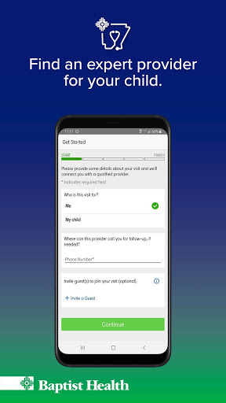
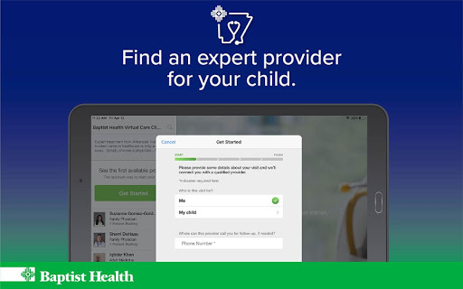
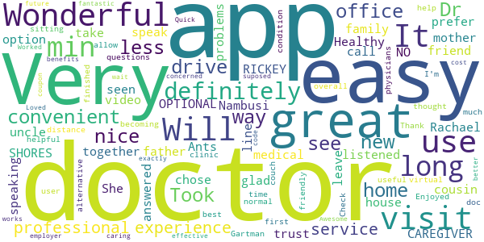
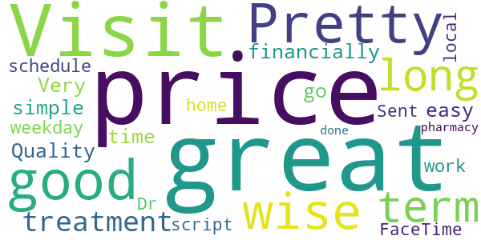

# Baptist Health - Virtual Care
App version ``12.0.16.005_01``

Analyzed with [covid-apps-observer](http://github.com/covid-apps-observer) project, version ``0.1``

## App overview
| | |
|-------------------------|-------------------------| 
| **Name**                                          | Baptist Health - Virtual Care |
| **Unique identifier** | com.baptisthealth.android.bark.virtualcare |
| **Link to Google Play** | [https://play.google.com/store/apps/details?id=com.baptisthealth.android.bark.virtualcare](https://play.google.com/store/apps/details?id=com.baptisthealth.android.bark.virtualcare) |
| **Summary**  | Baptist Health Virtual Care gives patients access to care anytime, anywhere. |
| **Privacy policy** | [https://www.americanwell.com/privacy-policy/](https://www.americanwell.com/privacy-policy/) |
| **Latest version** | 12.0.16.005_01 |
| **Last update** | 2020-10-29 21:35:43 |
| **Recent changes** | We continue to improve the patient experience with these new features: • Performance enhancements to increase reliability and speed |
| **Installs**  | 10,000+ |
| **Category** | Medical |
| **First release** | Mar 10, 2019 |
| **Size**  | 60M |
| **Supported Android version**  | 5.0 and up |

### Description
> Baptist Health Virtual Care allows patients to receive treatment from Arkansas’ largest, most trusted name in healthcare anytime, anywhere. We’re here to provide care for you, or your little one, 24 hours a day, seven days a week, through a private, secure connection. Baptist Health is constantly striving to improve the health and wellness of the communities we serve. Baptist Health Virtual Care is just one of the many ways we’re working to keep you healthier and happier by allowing you to see a knowledgeable caregiver from the comfort of home.
 No appointment is necessary to speak with one of our expert providers. Simply log in to the app to receive a complete assessment and find out how you can get on the road to wellness.
 Features:
 ·       Doctors available 24/7
 ·       Adult, adolescent and pediatric care available
 ·       Private and secure, HIPAA compliant connection
 ·       $55 per visit or less, depending on your insurance provider
 Common Conditions Treated:
 ·       Cold/Flu
 ·       Strep throat/sore throat
 ·       Pink eye
 ·       Sinus, respiratory and ear infections
 ·       Skin irritation or rash
 ·       UTI
 ·       Anxiety & depression
 ·       Headaches
 ·       General questions & more!
 The most trusted name in healthcare is now at your fingertips. Download Baptist Health Virtual Care today to get the care you need, when you need it.

### User interface
The developers of the app provide the following screenshots in the Google play store.
| | | |
|:-------------------------:|:-------------------------:|:-------------------------:|
 |   |   |   | 
 |   |   |   | 
 |   |   |   | 
 |   |   |   | 

## Development team
In the following we report the main information provided by the development team in the Google play store.

| | |
|-------------------------|-------------------------|
| **Developer**  | Baptist Health Virtual Care Clinic |
| **Website**  | [https://www.baptist-health.com/](https://www.baptist-health.com/) |
| **Email** | kevin.ehemann@baptist-health.org |
| **Physical address**  | [9601 Baptist Health Drive Little Rock, Arkansas 72205](https://www.google.com/maps/search/9601%20Baptist%20Health%20Drive%20Little%20Rock,%20Arkansas%2072205) (Google Maps) |
| **Other developed apps**  | [https://play.google.com/store/apps/developer?id=Baptist+Health+Virtual+Care+Clinic](https://play.google.com/store/apps/developer?id=Baptist+Health+Virtual+Care+Clinic) |

## Android support

| | |
|-------------------------|-------------------------|
| **Declared target Android version**  | Pie, version 9 (API level 28) |
| **Effective target Android version**  | Pie, version 9 (API level 28) |
| **Minimum supported Android version**  | Lollipop, version 5.0 (API level 21) |
| **Maximum target Android version**  | - |

The larger the difference between the minimum and maximum supported Android versions, the better. A larger difference means a wider audience. For example, old phones have a very low Android version, so a high minimum supported Android version means that the app cannot be used by users with old phones, thus leading to accessibility problems. 

## Requested permissions

In the following we report the complete list of the permissions requested by the app. 

| **Permission** | **Protection level** | **Description** | 
|-------------------------|-------------------------|-------------------------|
 **android.permission ACCESS_COARSE_LOCATION** | :warning:**Dangerous** | Allows an app to access approximate location. 
 **android.permission ACCESS_FINE_LOCATION** | :warning:**Dangerous** | Allows an app to access precise location. 
 **android.permission ACCESS_LOCATION_EXTRA_COMMANDS** | Normal | Allows an application to access extra location provider commands. 
 **android.permission ACCESS_NETWORK_STATE** | Normal | Allows applications to access information about networks. 
 **android.permission ACCESS_WIFI_STATE** | Normal | Allows applications to access information about Wi-Fi networks. 
 **android.permission BLUETOOTH** | Normal | Allows applications to connect to paired bluetooth devices. 
 **android.permission BROADCAST_STICKY** | Normal | Allows an application to broadcast sticky intents. 
 **android.permission CAMERA** | :warning:**Dangerous** | Required to be able to access the camera device. 
 **android.permission GET_TASKS** | Deprecated | This constant was deprecated in API level 21. No longer enforced. 
 **android.permission INTERNET** | Normal | Allows applications to open network sockets. 
 **android.permission MODIFY_AUDIO_SETTINGS** | Normal | Allows an application to modify global audio settings. 
 **android.permission READ_EXTERNAL_STORAGE** | :warning:**Dangerous** | Allows an application to read from external storage. 
 **android.permission READ_PHONE_STATE** | :warning:**Dangerous** | Allows read only access to phone state, including the phone number of the device, current cellular network information, the status of any ongoing calls, and a list of any PhoneAccounts registered on the device. 
 **android.permission RECEIVE_BOOT_COMPLETED** | Normal | Allows an application to receive the Intent.ACTION_BOOT_COMPLETED that is broadcast after the system finishes booting. 
 **android.permission RECORD_AUDIO** | :warning:**Dangerous** | Allows an application to record audio. 
 **android.permission REORDER_TASKS** | Normal | Allows an application to change the Z-order of tasks. 
 **android.permission SYSTEM_ALERT_WINDOW** | Signature - preinstalled - appop - pre23 - development | Allows an app to create windows using the type WindowManager.LayoutParams.TYPE_APPLICATION_OVERLAY, shown on top of all other apps. 
 **android.permission VIBRATE** | Normal | Allows access to the vibrator. 
 **android.permission WAKE_LOCK** | Normal | Allows using PowerManager WakeLocks to keep processor from sleeping or screen from dimming. 
 **android.permission WRITE_EXTERNAL_STORAGE** | :warning:**Dangerous** | Allows an application to write to external storage. 
 **com.baptisthealth.android.bark.virtualcare.permission C2D_MESSAGE** | - | - 
 **com.facebook.katana.provider ACCESS** | - | - 
 **com.google.android.c2dm.permission RECEIVE** | - | - 
 **com.google.android.finsky.permission BIND_GET_INSTALL_REFERRER_SERVICE** | - | - 

## Mentioned servers

| **Server** | **Registrant** | **Registrant country** | **Creation date** | 
|-------------------------|-------------------------|-------------------------|-------------------------|
 | amwell.com | American Well Corporation | :us: US | 2004-02-13 19:02:32 |
 | facebook.com | Facebook, Inc. | :us: US | 1997-03-29 05:00:00 |
 | doubleclick.net | Google Inc. | :us: US | 1996-01-16 05:00:00 |
 | googleadservices.com | Google LLC | :us: US | 2003-06-19 16:34:53 |
 | google.com | Google LLC | :us: US | 1997-09-15 04:00:00 |
 | googlesyndication.com | Google LLC | :us: US | 2003-01-21 06:17:24 |
 | googleapis.com | Google LLC | :us: US | 2005-01-25 17:52:26 |
 | google-analytics.com | Google LLC | :us: US | 2005-07-18 19:24:32 |
 | app-measurement.com | Google LLC | :us: US | 2015-06-19 20:13:31 |
 | appboy.com | Braze, Inc. | :us: US | 2008-10-06 23:28:32 |
 | braze.com | Braze, Inc. | :us: US | 2000-01-19 02:18:28 |
 | optimizely.com | Optimizely | :us: US | 2010-01-11 03:01:32 |
 | twitter.com | Twitter, Inc. | :us: US | 2000-01-21 16:28:17 |
 | crashlytics.com | Google LLC | :us: US | 2011-01-21 15:30:40 |
 | gstatic.com | Google LLC | :us: US | 2008-02-11 15:31:25 |
 | ggpht.com | Google LLC | :us: US | 2008-01-16 18:55:33 |

## Security analysis 

Below we report the main security warnings raised by our execution of the [Androwarn](https://github.com/maaaaz/androwarn) security analysis tool.

**Telephony identifiers leakage**
> - This application reads the ISO country code equivalent for the SIM provider's country code 
> - This application reads the ISO country code equivalent of the current registered operator's MCC (Mobile Country Code) 
> - This application reads the device phone type value 
> - This application reads the numeric name (MCC+MNC) of current registered operator 
> - This application reads the operator name 
> - This application reads the phone's current state 
> - This application reads the radio technology (network type) currently in use on the device for data transmission 

**Connection interfaces exfiltration**
> - This application reads details about the currently active data network 
> - This application tries to find out if the currently active data network is metered 

**Telephony services abuse**
> - This application makes phone calls 

**Audio video eavesdropping**
> - This application captures video from the 'CAMERA' source 

**Suspicious connection establishment**
> - This application opens a Socket and connects it to the remote address '' on the 'N/A' port  
> - This application opens a Socket and connects it to the remote address 'Ljava/lang/StringBuilder;->toString()Ljava/lang/String;' on the 'N/A' port  
> - This application opens a Socket and connects it to the remote address 'Ljava/net/Proxy;->type()Ljava/net/Proxy$Type;' on the 'N/A' port  
> - This application opens a Socket and connects it to the remote address 'timeout' on the 'N/A' port  

**Code execution**
> - This application loads a native library 
> - This application loads a native library: 'VidyoClientApp' 
> - This application loads a native library: 'ndkVideoClient' 
> - This application executes a UNIX command containing this argument: '2' 

## User ratings and reviews

Below we provide information about how end users are reacting to the app in terms of ratings and reviews in the Google Play store.

### Ratings

The Baptist Health - Virtual Care app has been installed by more than **10000** times. At this time, **60** rated the app and its average score is **4.3**. Below we show the distribution of the ratings across the usual star-based rating of Google Play

:star::star::star::star::star:: 42

:star::star::star::star:: 6

:star::star::star:: 6

:star::star:: 0

:star:: 6

### Reviews 

#### 5-star reviews

> My mother and father uncle Ants cousin friend and family together trust this Healthy CAREGIVER AND NO OPTIONAL RICKEY SHORES  :date: __2020-09-05 19:34:20__

> I am glad I had this option.  :date: __2020-08-07 14:55:25__

> This app. Is wonderful i didn't have to leave the house to be seen by a doctor. You have chose of the doctor you prefer to speak with. It didn't take long to be on line speaking to the doctor over video call. Dr. Rachael Nambusi was very nice and listened to all of my medical problems I was having. She answered all of my questions.  :date: __2020-05-27 16:58:45__

> Wonderful. Took less than 5 mins to see the doc and all finished in less than 5 mins. Will do this most of the time.  :date: __2020-05-11 00:26:16__

> Enjoyed visit and I like the app because I don't have to drive a long distance from my home to clinic. Very helpful and useful app. Easy to use!! Great app to have.!!!  :date: __2020-04-21 23:00:01__

> This new way to visit with physicians is becoming new normal.  :date: __2020-04-15 16:28:57__

> Wonderful! Dr. Gartman is the best!!  :date: __2020-04-07 21:53:58__

> Very nice visit with my doctor while I'm sitting at home. Thank you so much for all your help.  :date: __2020-04-03 21:07:10__

> It was my first virtual doctors visit but I thought it was overall great. I have a condition that does not allow me to drive so this is a great alternative for me.🥰🥰🥰🥰  :date: __2020-03-31 18:41:10__

> Took 10 min from my couch. So easy and user friendly. Check with your employer's benefits office to see if you have a coupon code. Loved the experience.  :date: __2020-03-31 17:50:10__

#### 4-star reviews

> Pretty good but price wise isn't that great for long term treatment financially. Quality is great price not so.  :date: __2020-07-19 05:55:35__

> Very easy for simple visits! I don't have time to go during the weekday because if work schedule. Visit was like FaceTime. The Dr was at home herself. Sent my script to local pharmacy and I was done $55  :date: __2019-09-27 00:33:39__

#### 3-star reviews

No recent reviews available with 3 stars.

#### 2-star reviews

No recent reviews available with 2 stars.

#### 1-star reviews

> You can ads your insurance, they just wa amt ur money  :date: __2020-07-08 16:16:46__

> I downloaded the app and opened it to a blank screen  :date: __2020-04-14 17:09:21__

> Very disgusted with Spiro's Dr I'd be ashamed to even acknowledge Linda is a part of your team what a horrible person and she wants to be addressed with such a status Dr she makes the word a dirty word what a terrific joke clean that office up and respect will naturally come back have to give it to get it.  :date: __2020-03-17 22:31:42__

