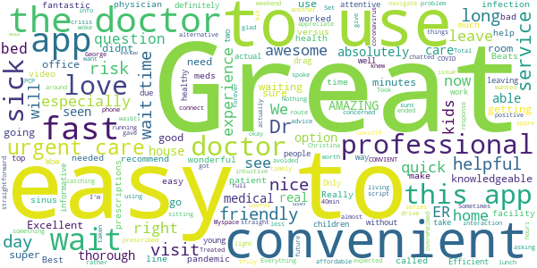
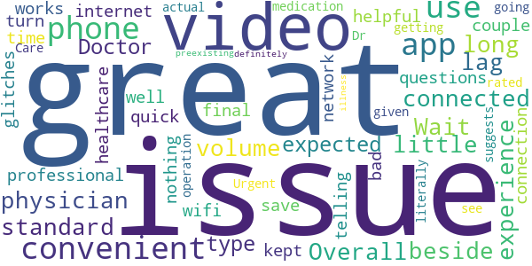
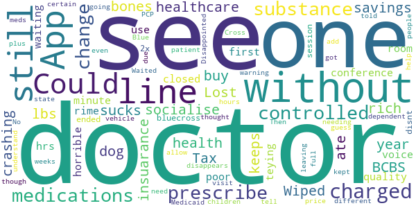

# BlueCare
App version ``12.6.00.005_01``

Analyzed with [covid-apps-observer](http://github.com/covid-apps-observer) project, version ``0.1``

## App overview
| | |
|-------------------------|-------------------------| 
| **Name**&nbsp;&nbsp;&nbsp;&nbsp;&nbsp;&nbsp;&nbsp;&nbsp;&nbsp;&nbsp;&nbsp;&nbsp;&nbsp;&nbsp;&nbsp;&nbsp;&nbsp;&nbsp;&nbsp;&nbsp;&nbsp;&nbsp;&nbsp;&nbsp;&nbsp;&nbsp;&nbsp;&nbsp;&nbsp;&nbsp;&nbsp;&nbsp;&nbsp;&nbsp;&nbsp;&nbsp;&nbsp;&nbsp;&nbsp;&nbsp;  | BlueCare |
| **Unique identifier** | com.bcbsla.android.bluecare |
| **Link to Google Play** | [https://play.google.com/store/apps/details?id=com.bcbsla.android.bluecare](https://play.google.com/store/apps/details?id=com.bcbsla.android.bluecare) |
| **Summary**  | BlueCare - Doctors online 24/7 - Blue Cross and Blue Shield of Louisiana |
| **Privacy policy** | [https://www.americanwell.com/privacy-policy/](https://www.americanwell.com/privacy-policy/) |
| **Latest version** | 12.6.00.005_01 |
| **Last update** | 2021-03-17 22:00:29 |
| **Recent changes** | We continue to improve the patient experience with these new features: • Performance enhancements to increase reliability and speed |
| **Installs**  | 10,000+ |
| **Category** | Medical |
| **First release** | Sep 23, 2016 |
| **Size**  | 53M |
| **Supported Android version**  | 5.0 and up |

### Description
> The doctor will see you – anywhere, anytime! With BlueCare, a telemedicine service of Blue Cross and Blue Shield of Louisiana, you can see a doctor online 24/7, without having to take time off from work or school.
 The BlueCare App lets you: 
 • See doctors from your phone or tablet when you need to – no appointments required
 • Save time and money by skipping trips to the ER or urgent care 
 • Easily get help for non-emergency illnesses like sinus infections, minor stomach trouble, allergies, rashes, bladder infections or the common cold 
 • Get a prescription or ask questions about your medication
 • Choose from a list of BlueCare doctors who are online 
 • Save information from your member ID card on your first visit, so you can automatically log in to see a doctor
 BlueCare is powered by American Well, which provides telemedicine services for Blue Cross and Blue Shield of Louisiana and its subsidiaries.
 Please note that telehealth is not for emergencies. If you’re having a medical emergency, call 911.

### User interface
The developers of the app provide the following screenshots in the Google play store.
| | | |
|:-------------------------:|:-------------------------:|:-------------------------:|
 |   |   |   | 
 |   |   |   | 
 |   |   |   | 
 |   |   |   | 

## Development team
In the following we report the main information provided by the development team in the Google play store.

| | |
|-------------------------|-------------------------|
| **Developer**  | Louisiana Health Service and Indemnity Company |
| **Website**  | [http://www.bluecarela.com/](http://www.bluecarela.com/) |
| **Email** | bluecaremobile@bcbsla.com |
| **Physical address**  | - |
| **Other developed apps**  | [https://play.google.com/store/apps/developer?id=Louisiana+Health+Service+and+Indemnity+Company](https://play.google.com/store/apps/developer?id=Louisiana+Health+Service+and+Indemnity+Company) |

## Android support

| | |
|-------------------------|-------------------------|
| **Declared target Android version**  | Android10, version 10 (API level 29) |
| **Effective target Android version**  | Android10, version 10 (API level 29) |
| **Minimum supported Android version**  | Lollipop, version 5.0 (API level 21) |
| **Maximum target Android version**  | - |

The larger the difference between the minimum and maximum supported Android versions, the better. A larger difference means a wider audience. For example, old phones have a very low Android version, so a high minimum supported Android version means that the app cannot be used by users with old phones, thus leading to accessibility problems. 

## Requested permissions

In the following we report the complete list of the permissions requested by the app. 

| **Permission** | **Protection level** | **Description** | 
|-------------------------|-------------------------|-------------------------|
 **android.permission ACCESS_COARSE_LOCATION** | :warning:**Dangerous** | Allows an app to access approximate location. 
 **android.permission ACCESS_FINE_LOCATION** | :warning:**Dangerous** | Allows an app to access precise location. 
 **android.permission ACCESS_LOCATION_EXTRA_COMMANDS** | Normal | Allows an application to access extra location provider commands. 
 **android.permission ACCESS_NETWORK_STATE** | Normal | Allows applications to access information about networks. 
 **android.permission ACCESS_WIFI_STATE** | Normal | Allows applications to access information about Wi-Fi networks. 
 **android.permission BLUETOOTH** | Normal | Allows applications to connect to paired bluetooth devices. 
 **android.permission BROADCAST_STICKY** | Normal | Allows an application to broadcast sticky intents. 
 **android.permission CAMERA** | :warning:**Dangerous** | Required to be able to access the camera device. 
 **android.permission GET_TASKS** | Deprecated | This constant was deprecated in API level 21. No longer enforced. 
 **android.permission INTERNET** | Normal | Allows applications to open network sockets. 
 **android.permission MODIFY_AUDIO_SETTINGS** | Normal | Allows an application to modify global audio settings. 
 **android.permission READ_EXTERNAL_STORAGE** | :warning:**Dangerous** | Allows an application to read from external storage. 
 **android.permission READ_PHONE_STATE** | :warning:**Dangerous** | Allows read only access to phone state, including the phone number of the device, current cellular network information, the status of any ongoing calls, and a list of any PhoneAccounts registered on the device. 
 **android.permission RECEIVE_BOOT_COMPLETED** | Normal | Allows an application to receive the Intent.ACTION_BOOT_COMPLETED that is broadcast after the system finishes booting. 
 **android.permission RECORD_AUDIO** | :warning:**Dangerous** | Allows an application to record audio. 
 **android.permission REORDER_TASKS** | Normal | Allows an application to change the Z-order of tasks. 
 **android.permission SYSTEM_ALERT_WINDOW** | Signature - preinstalled - appop - pre23 - development | Allows an app to create windows using the type WindowManager.LayoutParams.TYPE_APPLICATION_OVERLAY, shown on top of all other apps. 
 **android.permission USE_BIOMETRIC** | Normal | Allows an app to use device supported biometric modalities. 
 **android.permission USE_FINGERPRINT** | Normal | This constant was deprecated in API level 28. Applications should request USE_BIOMETRIC instead 
 **android.permission VIBRATE** | Normal | Allows access to the vibrator. 
 **android.permission WAKE_LOCK** | Normal | Allows using PowerManager WakeLocks to keep processor from sleeping or screen from dimming. 
 **android.permission WRITE_EXTERNAL_STORAGE** | :warning:**Dangerous** | Allows an application to write to external storage. 
 **com.bcbsla.android.bluecare.permission C2D_MESSAGE** | - | - 
 **com.facebook.katana.provider ACCESS** | - | - 
 **com.google.android.c2dm.permission RECEIVE** | - | - 
 **com.google.android.finsky.permission BIND_GET_INSTALL_REFERRER_SERVICE** | - | - 

## Mentioned servers

| **Server** | **Registrant** | **Registrant country** | **Creation date** | 
|-------------------------|-------------------------|-------------------------|-------------------------|
 | amwell.com | American Well Corporation | :us: US | 2004-02-13 19:02:32 |
 | facebook.com | Facebook, Inc. | :us: US | 1997-03-29 05:00:00 |
 | doubleclick.net | Google Inc. | :us: US | 1996-01-16 05:00:00 |
 | googleadservices.com | Google LLC | :us: US | 2003-06-19 16:34:53 |
 | google.com | Google LLC | :us: US | 1997-09-15 04:00:00 |
 | googlesyndication.com | Google LLC | :us: US | 2003-01-21 06:17:24 |
 | google-analytics.com | Google LLC | :us: US | 2005-07-18 19:24:32 |
 | app-measurement.com | Google LLC | :us: US | 2015-06-19 20:13:31 |
 | appboy.com | Braze, Inc. | :us: US | 2008-10-06 23:28:32 |
 | braze.com | Braze, Inc. | :us: US | 2000-01-19 02:18:28 |
 | optimizely.com | Optimizely | :us: US | 2010-01-11 03:01:32 |
 | twitter.com | Twitter, Inc. | :us: US | 2000-01-21 16:28:17 |
 | branch.io | Branch | :us: US | 2011-11-10 13:52:13 |
 | gstatic.com | Google LLC | :us: US | 2008-02-11 15:31:25 |
 | crashlytics.com | Google LLC | :us: US | 2011-01-21 15:30:40 |
 | bnc.lt | - | - | 2016-11-14 00:00:00 |
 | ggpht.com | Google LLC | :us: US | 2008-01-16 18:55:33 |

## Security analysis 

Below we report the main security warnings raised by our execution of the [Androwarn](https://github.com/maaaaz/androwarn) security analysis tool.

**Telephony identifiers leakage**
> - This application reads the ISO country code equivalent for the SIM provider's country code 
> - This application reads the ISO country code equivalent of the current registered operator's MCC (Mobile Country Code) 
> - This application reads the MCC+MNC of the provider of the SIM 
> - This application reads the device phone type value 
> - This application reads the numeric name (MCC+MNC) of current registered operator 
> - This application reads the operator name 
> - This application reads the phone's current state 
> - This application reads the radio technology (network type) currently in use on the device for data transmission 

**Connection interfaces exfiltration**
> - This application reads details about the currently active data network 
> - This application tries to find out if the currently active data network is metered 

**Telephony services abuse**
> - This application makes phone calls 

**Audio video eavesdropping**
> - This application captures video from the 'CAMERA' source 

**Suspicious connection establishment**
> - This application opens a Socket and connects it to the remote address ' returned no addresses for  ; port is out of range' on the 'N/A' port  
> - This application opens a Socket and connects it to the remote address '' on the 'N/A' port  
> - This application opens a Socket and connects it to the remote address 'Ljava/net/Proxy;->type()Ljava/net/Proxy$Type;' on the 'N/A' port  
> - This application opens a Socket and connects it to the remote address 'timeout' on the 'N/A' port  

**Code execution**
> - This application loads a native library 
> - This application executes a UNIX command containing this argument: '2' 

## User ratings and reviews

Below we provide information about how end users are reacting to the app in terms of ratings and reviews in the Google Play store.

### Ratings

The BlueCare app has been installed by more than **10000** times. At this time, **184** rated the app and its average score is **4.64**. Below we show the distribution of the ratings across the usual star-based rating of Google Play

:star::star::star::star::star:: 158

:star::star::star::star:: 13

:star::star::star:: 1

:star::star:: 1

:star:: 11

### Reviews 

#### 5-star reviews

> Great and quick  :date: __2021-03-17 16:17:30__

> Very fast and friendly .They are real doctors they get straight down to the problem by asking you a series of questions and get you the right help needed .it was very convenient didn't have to leave the house and they sunt the prescriptions right over.  :date: __2021-03-17 12:07:59__

> Absolutely fantastic!!!!!  :date: __2021-03-13 01:01:26__

> Very Professional and timely and thorough and truly concerned about me  :date: __2021-02-09 02:22:51__

> Great option for medical care  :date: __2021-01-19 19:12:41__

> Nice  :date: __2021-01-17 19:45:48__

> I love this app and will recommend it to others  :date: __2021-01-15 07:23:21__

> THE DOCTORS ARE AMAZING...THIS IS SO CONVIENT!!  :date: __2020-12-09 18:19:41__

> Convenient! I was able to be seen and prescribed meds by a DR with 30-40min. I was taken care of during my lunch with time to spare.  :date: __2020-10-21 17:51:34__

> Very convenient and affordable especially on a weekend versus an ER visit physician very knowledgeable  :date: __2020-08-09 15:01:17__

#### 4-star reviews

> It's great once you are connected to the physician.  :date: __2020-04-18 19:49:00__

> Overall experience was great. Wait was a little long but no volume issue or video lag beside the standard that is expected with these type of videos. Doctor was very professional and helpful with all questions I had.  :date: __2020-04-07 18:51:44__

> Very convenient app for healthcare. A couple of glitches, but nothing too bad.  :date: __2019-11-11 17:05:08__

> very quick and convenient  :date: __2019-07-13 17:49:09__

> works well but it kept telling me there was an issue with the internet connection on my phone so I final had to turn off the wifi on my phone and use my network.  :date: __2019-02-17 16:14:13__

> It did save me time from getting up and literally going into an Urgent Care but it's not an actual 24/7 operation like it suggests. I rated it a 4 because of that. I did see a Dr and was given medication for a preexisting illness. So all and all I would definitely use this App again.  :date: __2018-09-22 19:27:17__

#### 3-star reviews

> The experiance was good but the Dr. Voice and video kept going out. I inserted my info 3 times but didn't save it for dr.  :date: __2020-01-09 00:03:01__

#### 2-star reviews

> It might be great, but I won't scroll back to 1975 from 2017 one month at a time.  It would be so much easier to type in my birthday!  :date: __2017-09-26 01:17:22__

#### 1-star reviews

> BCBS sucks. Tax the rich and socialise healthcare. Wiped out my savings the one year I had to buy health insuarance. Lost 70 lbs and ate dog bones.  :date: __2021-03-18 04:14:54__

> App keeps crashing  :date: __2020-08-20 19:07:13__

> The conference closed after one minute.The voice quality was poor.  :date: __2020-04-03 01:13:54__

> horrible. first rime teying to use it. I was in waiting room for 4 hrs. bluecross ended my session 2x. still disnt get through  :date: __2020-04-01 20:25:37__

> The doctor that you're in line to see disappears without warning. Waited 9 hours to see a doctor because they kept leaving so I had to get in line to see a different one.  :date: __2020-03-28 15:07:54__

> Disappointed. Could not help because the patient is 17 and all the doctor could do was tell her she has to see her PCP. Then why allow people to add their dependent children? They still charged me the full price.  :date: __2020-03-11 04:52:05__

> They need to state that they don't prescribe certain medications even though they are not a controlled substance. I got charged $39 to be told they don't prescribe the medications I was needing. No, they are not controlled substances. I am just without a vehicle and have been without my meds 3 weeks plus having to change doctors due to change from Medicaid to Blue Cross. I guess I don't understand what this App is for? I thought it was the same as going in for a visit with your doctor.  :date: __2019-02-22 20:59:07__

