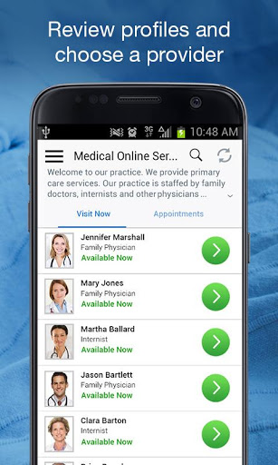
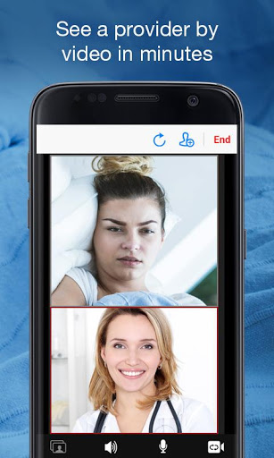
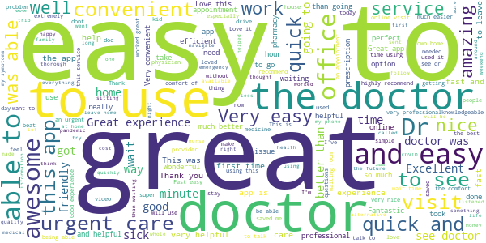
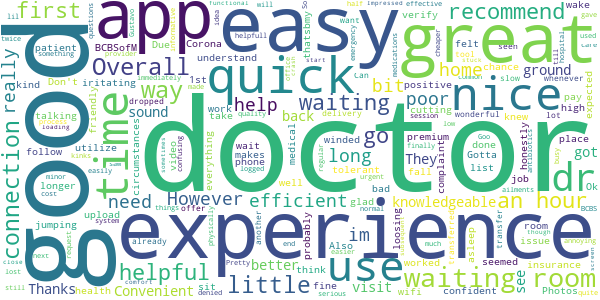
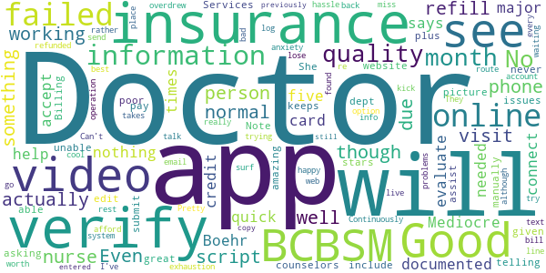
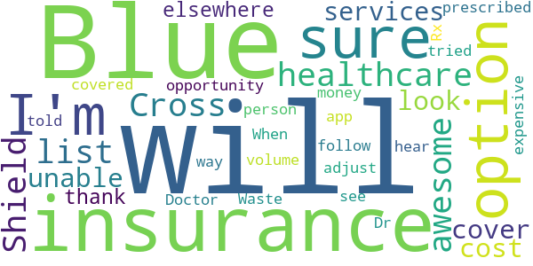
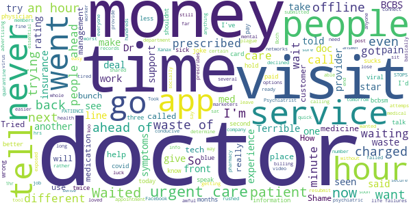

# BCBSM Online Visits
App version ``12.0.19.010_02``

Analyzed with [covid-apps-observer](http://github.com/covid-apps-observer) project, version ``0.1``

## App overview
| | |
|-------------------------|-------------------------| 
| **Name**&nbsp;&nbsp;&nbsp;&nbsp;&nbsp;&nbsp;&nbsp;&nbsp;&nbsp;&nbsp;&nbsp;&nbsp;&nbsp;&nbsp;&nbsp;&nbsp;&nbsp;&nbsp;&nbsp;&nbsp;&nbsp;&nbsp;&nbsp;&nbsp;&nbsp;&nbsp;&nbsp;&nbsp;&nbsp;&nbsp;&nbsp;&nbsp;&nbsp;&nbsp;&nbsp;&nbsp;&nbsp;&nbsp;&nbsp;&nbsp;  | BCBSM Online Visits |
| **Unique identifier** | com.bcbsm.android.bcmi.onlinevisit |
| **Link to Google Play** | [https://play.google.com/store/apps/details?id=com.bcbsm.android.bcmi.onlinevisit](https://play.google.com/store/apps/details?id=com.bcbsm.android.bcmi.onlinevisit) |
| **Summary**  | See a U.S. board certified doctor or licensed therapist from virtually anywhere. |
| **Privacy policy** | [https://www.americanwell.com/privacy-policy/](https://www.americanwell.com/privacy-policy/) |
| **Latest version** | 12.0.19.010_02 |
| **Last update** | 2020-12-23 02:40:48 |
| **Recent changes** | We continue to improve the patient experience with these new features: • Performance enhancements to increase reliability and speed |
| **Installs**  | 50,000+ |
| **Category** | Medical |
| **First release** | Dec 29, 2017 |
| **Size**  | 53M |
| **Supported Android version**  | 5.0 and up |

### Description
> See a U.S. board certified doctor or licensed therapist from virtually anywhere.
 If you’re a member of Blue Cross® Blue Shield® of Michigan or Blue Care Network, just download the Blue Cross Online VisitsSM app to get started.
 Having a visit couldn’t be easier. Once you register for an account, you can connect with doctors or therapists wherever it’s convenient for you: at home, in the office or even while traveling.
 ONLINE HEALTH CARE OPTIONS
 Depending on your plan, you can see a telehealth practitioner for medical, therapy or psychiatry services.
 Medical services
 Online doctors are available 24/7 for minor symptoms like sore throats and stuffy noses.
 If they determine that you need a prescription, they can send one to your nearest pharmacy. They can also send visit notes to your primary care physician at your request.
 All of our telemedicine doctors are U.S. board certified.
 Therapy services
 See a doctoral-level psychologist or a master’s-level therapist by appointment.
 Therapists include clinical social workers, marriage and family therapists, and professional counselors.
 All are trained in prevention and treatment techniques specific to telemedicine.
 Psychiatry services
 Our psychiatrists are online doctors who are also U.S. board certified.
 They’re available by appointment and are capable of treating a variety of behavioral health conditions.
 They can prescribe medications and work with you to manage them, too, if you need it.
 For members of Blue Cross Blue Shield of Michigan and Blue Care Network, the convenience of online health care is at your fingertips.
 Please note that telehealth is not for emergencies. If you’re having a medical emergency, call 911.
 ---------
 Blue Cross Online Visits is powered by American Well®, an independent company that provides online visits for Blue Cross Blue Shield of Michigan and Blue Care Network members.
 © 1996-2017 Blue Cross Blue Shield of Michigan and Blue Care Network are nonprofit corporations and independent licensees of the Blue Cross and Blue Shield Association. We provide health insurance in Michigan.

### User interface
The developers of the app provide the following screenshots in the Google play store.
| | | |
|:-------------------------:|:-------------------------:|:-------------------------:|
 |   |   |   | 
 |   |   |   | 
 |   |   |   | 
 |   |   |   | 

## Development team
In the following we report the main information provided by the development team in the Google play store.

| | |
|-------------------------|-------------------------|
| **Developer**  | Blue Cross and Blue Shield of Michigan |
| **Website**  | [http://www.bcbsm.com](http://www.bcbsm.com) |
| **Email** | mbryson@bcbsm.com |
| **Physical address**  | - |
| **Other developed apps**  | [https://play.google.com/store/apps/developer?id=Blue+Cross+and+Blue+Shield+of+Michigan](https://play.google.com/store/apps/developer?id=Blue+Cross+and+Blue+Shield+of+Michigan) |

## Android support

| | |
|-------------------------|-------------------------|
| **Declared target Android version**  | Android10, version 10 (API level 29) |
| **Effective target Android version**  | Android10, version 10 (API level 29) |
| **Minimum supported Android version**  | Lollipop, version 5.0 (API level 21) |
| **Maximum target Android version**  | - |

The larger the difference between the minimum and maximum supported Android versions, the better. A larger difference means a wider audience. For example, old phones have a very low Android version, so a high minimum supported Android version means that the app cannot be used by users with old phones, thus leading to accessibility problems. 

## Requested permissions

In the following we report the complete list of the permissions requested by the app. 

| **Permission** | **Protection level** | **Description** | 
|-------------------------|-------------------------|-------------------------|
 **android.permission ACCESS_COARSE_LOCATION** | :warning:**Dangerous** | Allows an app to access approximate location. 
 **android.permission ACCESS_FINE_LOCATION** | :warning:**Dangerous** | Allows an app to access precise location. 
 **android.permission ACCESS_LOCATION_EXTRA_COMMANDS** | Normal | Allows an application to access extra location provider commands. 
 **android.permission ACCESS_NETWORK_STATE** | Normal | Allows applications to access information about networks. 
 **android.permission ACCESS_WIFI_STATE** | Normal | Allows applications to access information about Wi-Fi networks. 
 **android.permission BLUETOOTH** | Normal | Allows applications to connect to paired bluetooth devices. 
 **android.permission BROADCAST_STICKY** | Normal | Allows an application to broadcast sticky intents. 
 **android.permission CAMERA** | :warning:**Dangerous** | Required to be able to access the camera device. 
 **android.permission GET_TASKS** | Deprecated | This constant was deprecated in API level 21. No longer enforced. 
 **android.permission INTERNET** | Normal | Allows applications to open network sockets. 
 **android.permission MODIFY_AUDIO_SETTINGS** | Normal | Allows an application to modify global audio settings. 
 **android.permission READ_EXTERNAL_STORAGE** | :warning:**Dangerous** | Allows an application to read from external storage. 
 **android.permission READ_PHONE_STATE** | :warning:**Dangerous** | Allows read only access to phone state, including the phone number of the device, current cellular network information, the status of any ongoing calls, and a list of any PhoneAccounts registered on the device. 
 **android.permission RECEIVE_BOOT_COMPLETED** | Normal | Allows an application to receive the Intent.ACTION_BOOT_COMPLETED that is broadcast after the system finishes booting. 
 **android.permission RECORD_AUDIO** | :warning:**Dangerous** | Allows an application to record audio. 
 **android.permission REORDER_TASKS** | Normal | Allows an application to change the Z-order of tasks. 
 **android.permission SYSTEM_ALERT_WINDOW** | Signature - preinstalled - appop - pre23 - development | Allows an app to create windows using the type WindowManager.LayoutParams.TYPE_APPLICATION_OVERLAY, shown on top of all other apps. 
 **android.permission USE_BIOMETRIC** | Normal | Allows an app to use device supported biometric modalities. 
 **android.permission USE_FINGERPRINT** | Normal | This constant was deprecated in API level 28. Applications should request USE_BIOMETRIC instead 
 **android.permission VIBRATE** | Normal | Allows access to the vibrator. 
 **android.permission WAKE_LOCK** | Normal | Allows using PowerManager WakeLocks to keep processor from sleeping or screen from dimming. 
 **android.permission WRITE_EXTERNAL_STORAGE** | :warning:**Dangerous** | Allows an application to write to external storage. 
 **com.bcbsm.android.bcmi.onlinevisit.permission C2D_MESSAGE** | - | - 
 **com.facebook.katana.provider ACCESS** | - | - 
 **com.google.android.c2dm.permission RECEIVE** | - | - 
 **com.google.android.finsky.permission BIND_GET_INSTALL_REFERRER_SERVICE** | - | - 

## Mentioned servers

| **Server** | **Registrant** | **Registrant country** | **Creation date** | 
|-------------------------|-------------------------|-------------------------|-------------------------|
 | amwell.com | American Well Corporation | :us: US | 2004-02-13 19:02:32 |
 | facebook.com | Facebook, Inc. | :us: US | 1997-03-29 05:00:00 |
 | doubleclick.net | Google Inc. | :us: US | 1996-01-16 05:00:00 |
 | googleadservices.com | Google LLC | :us: US | 2003-06-19 16:34:53 |
 | google.com | Google LLC | :us: US | 1997-09-15 04:00:00 |
 | googlesyndication.com | Google LLC | :us: US | 2003-01-21 06:17:24 |
 | google-analytics.com | Google LLC | :us: US | 2005-07-18 19:24:32 |
 | app-measurement.com | Google LLC | :us: US | 2015-06-19 20:13:31 |
 | appboy.com | Braze, Inc. | :us: US | 2008-10-06 23:28:32 |
 | optimizely.com | Optimizely | :us: US | 2010-01-11 03:01:32 |
 | twitter.com | Twitter, Inc. | :us: US | 2000-01-21 16:28:17 |
 | branch.io | Branch | :us: US | 2011-11-10 13:52:13 |
 | gstatic.com | Google LLC | :us: US | 2008-02-11 15:31:25 |
 | crashlytics.com | Google LLC | :us: US | 2011-01-21 15:30:40 |
 | bnc.lt | - | - | 2016-11-14 00:00:00 |
 | ggpht.com | Google LLC | :us: US | 2008-01-16 18:55:33 |

## Security analysis 

Below we report the main security warnings raised by our execution of the [Androwarn](https://github.com/maaaaz/androwarn) security analysis tool.

**Telephony identifiers leakage**
> - This application reads the ISO country code equivalent for the SIM provider's country code 
> - This application reads the ISO country code equivalent of the current registered operator's MCC (Mobile Country Code) 
> - This application reads the MCC+MNC of the provider of the SIM 
> - This application reads the device phone type value 
> - This application reads the numeric name (MCC+MNC) of current registered operator 
> - This application reads the operator name 
> - This application reads the phone's current state 
> - This application reads the radio technology (network type) currently in use on the device for data transmission 

**Connection interfaces exfiltration**
> - This application reads details about the currently active data network 
> - This application tries to find out if the currently active data network is metered 

**Telephony services abuse**
> - This application makes phone calls 

**Audio video eavesdropping**
> - This application captures video from the 'CAMERA' source 

**Suspicious connection establishment**
> - This application opens a Socket and connects it to the remote address ' returned no addresses for  ; port is out of range' on the 'N/A' port  
> - This application opens a Socket and connects it to the remote address '' on the 'N/A' port  
> - This application opens a Socket and connects it to the remote address 'Ljava/net/Proxy;->type()Ljava/net/Proxy$Type;' on the 'N/A' port  
> - This application opens a Socket and connects it to the remote address 'timeout' on the 'N/A' port  

**Code execution**
> - This application loads a native library 
> - This application executes a UNIX command containing this argument: '2' 

## User ratings and reviews

Below we provide information about how end users are reacting to the app in terms of ratings and reviews in the Google Play store.

### Ratings

The BCBSM Online Visits app has been installed by more than **50000** times. At this time, **1330** rated the app and its average score is **4.7293234**. Below we show the distribution of the ratings across the usual star-based rating of Google Play

:star::star::star::star::star:: 1140

:star::star::star::star:: 110

:star::star::star:: 20

:star::star:: 30

:star:: 30

### Reviews 

#### 5-star reviews

> Great  :date: __2021-01-22 21:49:13__

> The experience was great. Quick and easy.  :date: __2021-01-20 00:31:23__

> This app is very easy to use. There were lots of provider options and the entire process took less time than checking in at urgent care.  :date: __2021-01-17 18:50:30__

> It has been a very positive experience using the app  :date: __2021-01-15 19:24:08__

> Great experience !  :date: __2021-01-15 16:28:05__

> My Doctor was very helpful and understanding. This is a new way to have ailments addressed more immediately.  :date: __2021-01-14 19:14:22__

> Very good  :date: __2021-01-12 15:04:48__

> With two kids, this is the best app on my tablet. I have used it while traveling, after hours, and holiday. My kids seem to suddenly need medical attention at the most inopportune times. This app has saved me 4 trips to ER/Urgent care in less than 2 years.  :date: __2021-01-05 01:30:16__

> I used it for online doctor consult. Took me 10 minutes and cost $10 !  :date: __2020-12-26 15:51:08__

> Convenient, worked great for me  :date: __2020-12-22 05:38:56__

#### 4-star reviews

> Easy and convenient  :date: __2021-01-19 18:36:59__

> Don't understand why BCBSofM couldn't verify my insurance. I pay way to high a premium for that. That's very iritating. However, other than that this was a positive experience.  :date: __2021-01-04 17:55:21__

> Was a fine experience  :date: __2020-12-26 20:58:30__

> Very efficient.  :date: __2020-12-02 19:49:40__

> Photos wouldn't upload but otherwise everything was great.  :date: __2020-11-10 03:44:54__

> Overall a good experience .  :date: __2020-08-06 22:35:43__

> Good experience little bit of video jumping cutting in and out! Doctor was good felt confident he knew what he was talking about  :date: __2020-07-18 17:27:11__

> Ok  :date: __2020-06-10 13:04:51__

> Good. Easy to follow.  :date: __2020-06-08 16:05:59__

> Good experience..doctor was nice and friendly. A little issue with wifi connection but over all good. Doctor was tolerant with poor connection and patient.  :date: __2020-05-31 00:21:44__

#### 3-star reviews

> Doctor Good, App Mediocre. Doctor Boehr was quick to evaluate and get me the help I needed. The BCBSM online app, however, failed to connect to my BCBSM insurance information. It also failed five times to verify and accept any credit card information.  :date: __2021-01-07 01:34:44__

> Doctor says picture quality wasn't great. She was able to assist me but why is my video quality poor with a Note 10 plus? No other issues.  :date: __2020-07-23 16:55:37__

> The app keeps telling me its unable to verify my insurance and asking me to pay  :date: __2020-05-17 20:55:40__

> I would have given it 4 or 5 stars but it can never verify my insurance so I have to manually submit.  :date: __2020-03-15 18:46:42__

> Online Services include the website.  :date: __2019-11-17 01:27:24__

> edit 7/31/19 The counselors on this app have been amazing! Billing dept, no. Continuously miss bill me and I have to get it refunded which takes the rest of the month. They overdrew my account once doing this. Not worth the hassle. Can't afford all that every month. I've been having really bad problems with anxiety and this was the best option for me. I was so happy when I found I could go this route rather than the exhaustion of trying to get to the doctor  :date: __2019-08-01 01:15:31__

> Pretty cool app where you can see each other and talk live. However, don't try to send a text or do any other operation (web surf or email) or it will kick you off the system and you'll lose your place in line if you are waiting. You'll have to re-log back in again although the info. you previously entered will still be there to copy over.  :date: __2019-05-21 15:26:34__

#### 2-star reviews

> I'm sure that this option for healthcare will be awesome but it did not list my Blue Cross Blue Shield insurance and I am unable to cover the cost so I will have to look for services elsewhere thank you for the opportunity  :date: __2020-01-28 02:35:41__

> Doctor couldn't hear me and there is no way to adjust volume in the app.  :date: __2019-04-19 06:42:33__

> I was prescribed a very expensive Rx that was not covered by insurance. When I tried to follow up I was told to see an in-person Dr. Waste of money  :date: __2018-03-16 20:02:31__

#### 1-star reviews

> Psychiatrist can only "do" medication management. How can anyone "do" med management without your records or psychiatric work up. If you just want a bunch of Xanax, this is the place. If you need a help or are trying to determine what you should do for a loved one, this is not the place. Shame on you bcbs.  :date: __2020-12-03 00:50:12__

> Doctor experience is a 5 however the tech support and billing department is awful. I will never use this app again.  :date: __2020-09-24 01:49:38__

> Had no video, even after several attemps.  :date: __2020-09-06 23:08:31__

> Took a while to connect with the doctor. The appointment was really rushed and I was prescribed a medicine that didn't make sense. I called customer support to try to get info on why I was prescribed the certain medicine and was told I had to "take it or leave it or call a different doctor". Tried calling a different physician and the physician declined my call. I would rather go to ready care.  :date: __2020-07-03 21:36:58__

> This tool has failed me twice now, trying again tomorrow. Your tech support said my end was fine, it on yours. It is not conducive to ones mental health to experience these failures when trying to get better. I could lose my job if I don't get to speak to a doctor soon.  :date: __2020-06-17 13:37:42__

> If I ever wanted my medical information shared with marketers, advertising networks and "services that can provide me options" I'd just post it on Facebook because that's easier and just about as secure.  :date: __2020-06-11 16:25:44__

> This app sucks makes pay money for visit takes 1hr to sit an wait for visit l...doctor koo she prescribes meds easy quick visit..try to get meds from pharmacy they say doc never submitted they give u number to call to resubmit u have to wait another 2 hrs for them to answer I am on hold now  :date: __2020-05-19 00:35:48__

> One of the worst experiences of my life. This whole company sucks.  :date: __2020-04-21 17:43:14__

> this app doesn't do anything  :date: __2020-04-05 23:55:36__

> I sat waiting for an hour for a doctor and then said doc was offline. Tried again and waited an hour and doc went offline. Both times with 2 people ahead of me. I work for bcbsm and this is wrong for me. Our members shouldnt have to deal with this. I shouldnt have to deal with that. Went to urgent care.  :date: __2020-04-05 21:41:46__

