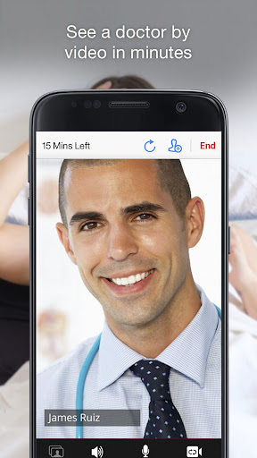
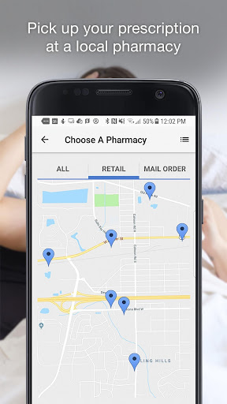
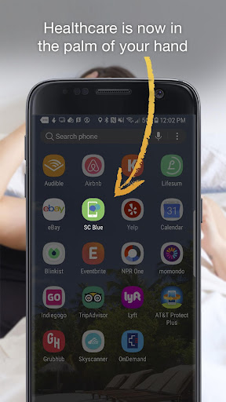
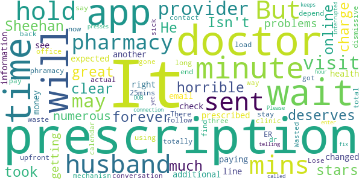

# Blue CareOnDemand – See a Doctor Online
App version ``12.9.01.000_00``

Analyzed with [covid-apps-observer](http://github.com/covid-apps-observer) project, version ``0.1``

## App overview
| | |
|-------------------------|-------------------------| 
| **Name**&nbsp;&nbsp;&nbsp;&nbsp;&nbsp;&nbsp;&nbsp;&nbsp;&nbsp;&nbsp;&nbsp;&nbsp;&nbsp;&nbsp;&nbsp;&nbsp;&nbsp;&nbsp;&nbsp;&nbsp;&nbsp;&nbsp;&nbsp;&nbsp;&nbsp;&nbsp;&nbsp;&nbsp;&nbsp;&nbsp;&nbsp;&nbsp;&nbsp;&nbsp;&nbsp;&nbsp;&nbsp;&nbsp;&nbsp;&nbsp;  | Blue CareOnDemand – See a Doctor Online |
| **Unique identifier** | com.bcbssc.android.careondemand |
| **Link to Google Play** | [https://play.google.com/store/apps/details?id=com.bcbssc.android.careondemand](https://play.google.com/store/apps/details?id=com.bcbssc.android.careondemand) |
| **Summary**  | Doctor visits when and where you want on your phone or tablet. |
| **Privacy policy** | [https://www.southcarolinablues.com/web/nonsecure/sc/AboutUs/Privacy+and+Legal/Privacy+Practices/](https://www.southcarolinablues.com/web/nonsecure/sc/AboutUs/Privacy+and+Legal/Privacy+Practices/) |
| **Latest version** | 12.9.01.000_00 |
| **Last update** | 2021-04-01 17:04:29 |
| **Recent changes** | We continue to improve the patient experience with these new features: • Performance enhancements to increase reliability and speed |
| **Installs**  | 50,000+ |
| **Category** | Medical |
| **First release** | Jan 12, 2016 |
| **Size**  | 53M |
| **Supported Android version**  | 5.0 and up |

### Description
> Blue CareOnDemand
 BCBS of SC and BlueChoice HealthPlan SC members can see a doctor when and where they want on a phone or tablet. It’s the easy, fast way to get health care 24/7 with no appointment. Choose doctors who are U.S. board certified with an average of 10-15 years in practice, with many in S.C.
 SAFE AND EASY
 Use a credit card for an easy, low-cost payment based on your BlueCross BlueShield of South Carolina or BlueChoice HealthPlan insurance benefits. Telehealth through Blue CareOnDemand is also safe and secure, with your privacy as our priority. Your visit with a Blue CareOnDemand doctor complies with HIPAA. Your entire telemedicine visit and credit card transaction is secure, and your personal information is protected. 
 URGENT CARE
 Don’t wait until a doctor’s office is open or can “fit you in.” Choose the time and place that works for you. Use Blue CareOnDemand for many of the same reasons that would normally send you to a clinic or doctor’s office — but without the hassles of travel time, crowded waiting rooms and restrictive office hours:
 · Fever
 · Sore throat
 · Cough
 · Flu, cold
 · Bronchitis
 · Sinus infection
 · Respiratory infection
 · Urinary tract infection
 · Vomiting, diarrhea
 · Stomach ache
 · Pinkeye
 · Sprains and strains
 · Headache
 Blue CareOnDemand doctors will access your symptoms using live video and audio chat. These virtual office visits allow the doctor to interact with you to diagnose your illness or injury, suggest follow-up and even prescribe medicine, when appropriate.
 HIGH PRAISE, HIGH QUALITY
 Blue CareOnDemand uses a platform created by doctors that was named the most popular consumer telehealth app worldwide in 2014, according to App Annie, and the first telehealth service awarded accreditation by The American Telemedicine Association.
 Get Ready to Get Well
 Download Blue CareOnDemand now. Even if you’re not sick or hurt right now, don’t wait to register as a new user. As easy as it is to use Blue CareOnDemand, setting up your profile now will make your doctor’s visit go even faster later, when you really need it. So you can get on with your life and your health … in a hurry.
 BlueCross® BlueShield® of South Carolina and BlueChoice® HealthPlan of South Carolina are independent licensees of the Blue Cross and Blue Shield Association. American Well is an independent company that offers hosting and software services on behalf of your health plan.
 Please note that telehealth is not for emergencies. If you’re having a medical emergency, call 911.

### User interface
The developers of the app provide the following screenshots in the Google play store.
| | | |
|:-------------------------:|:-------------------------:|:-------------------------:|
 |   |   |   | 
 |   |   |   | 
 |   |   |   | 
 |   |   |   | 
 |   |   |   | 

## Development team
In the following we report the main information provided by the development team in the Google play store.

| | |
|-------------------------|-------------------------|
| **Developer**  | American Well |
| **Website**  | - |
| **Email** | jon.freshman@americanwell.com |
| **Physical address**  | - |
| **Other developed apps**  | [https://play.google.com/store/apps/developer?id=American+Well](https://play.google.com/store/apps/developer?id=American+Well) |

## Android support

| | |
|-------------------------|-------------------------|
| **Declared target Android version**  | Android10, version 10 (API level 29) |
| **Effective target Android version**  | Android10, version 10 (API level 29) |
| **Minimum supported Android version**  | Lollipop, version 5.0 (API level 21) |
| **Maximum target Android version**  | - |

The larger the difference between the minimum and maximum supported Android versions, the better. A larger difference means a wider audience. For example, old phones have a very low Android version, so a high minimum supported Android version means that the app cannot be used by users with old phones, thus leading to accessibility problems. 

## Requested permissions

In the following we report the complete list of the permissions requested by the app. 

| **Permission** | **Protection level** | **Description** | 
|-------------------------|-------------------------|-------------------------|
 **android.permission ACCESS_COARSE_LOCATION** | :warning:**Dangerous** | Allows an app to access approximate location. 
 **android.permission ACCESS_FINE_LOCATION** | :warning:**Dangerous** | Allows an app to access precise location. 
 **android.permission ACCESS_LOCATION_EXTRA_COMMANDS** | Normal | Allows an application to access extra location provider commands. 
 **android.permission ACCESS_NETWORK_STATE** | Normal | Allows applications to access information about networks. 
 **android.permission ACCESS_WIFI_STATE** | Normal | Allows applications to access information about Wi-Fi networks. 
 **android.permission BLUETOOTH** | Normal | Allows applications to connect to paired bluetooth devices. 
 **android.permission BROADCAST_STICKY** | Normal | Allows an application to broadcast sticky intents. 
 **android.permission CAMERA** | :warning:**Dangerous** | Required to be able to access the camera device. 
 **android.permission GET_TASKS** | Deprecated | This constant was deprecated in API level 21. No longer enforced. 
 **android.permission INTERNET** | Normal | Allows applications to open network sockets. 
 **android.permission MODIFY_AUDIO_SETTINGS** | Normal | Allows an application to modify global audio settings. 
 **android.permission READ_EXTERNAL_STORAGE** | :warning:**Dangerous** | Allows an application to read from external storage. 
 **android.permission READ_PHONE_STATE** | :warning:**Dangerous** | Allows read only access to phone state, including the phone number of the device, current cellular network information, the status of any ongoing calls, and a list of any PhoneAccounts registered on the device. 
 **android.permission RECEIVE_BOOT_COMPLETED** | Normal | Allows an application to receive the Intent.ACTION_BOOT_COMPLETED that is broadcast after the system finishes booting. 
 **android.permission RECORD_AUDIO** | :warning:**Dangerous** | Allows an application to record audio. 
 **android.permission REORDER_TASKS** | Normal | Allows an application to change the Z-order of tasks. 
 **android.permission SYSTEM_ALERT_WINDOW** | Signature - preinstalled - appop - pre23 - development | Allows an app to create windows using the type WindowManager.LayoutParams.TYPE_APPLICATION_OVERLAY, shown on top of all other apps. 
 **android.permission USE_BIOMETRIC** | Normal | Allows an app to use device supported biometric modalities. 
 **android.permission USE_FINGERPRINT** | Normal | This constant was deprecated in API level 28. Applications should request USE_BIOMETRIC instead 
 **android.permission VIBRATE** | Normal | Allows access to the vibrator. 
 **android.permission WAKE_LOCK** | Normal | Allows using PowerManager WakeLocks to keep processor from sleeping or screen from dimming. 
 **android.permission WRITE_EXTERNAL_STORAGE** | :warning:**Dangerous** | Allows an application to write to external storage. 
 **com.bcbssc.android.careondemand.permission C2D_MESSAGE** | - | - 
 **com.facebook.katana.provider ACCESS** | - | - 
 **com.google.android.c2dm.permission RECEIVE** | - | - 
 **com.google.android.finsky.permission BIND_GET_INSTALL_REFERRER_SERVICE** | - | - 

## Mentioned servers

| **Server** | **Registrant** | **Registrant country** | **Creation date** | 
|-------------------------|-------------------------|-------------------------|-------------------------|
 | amwell.com | American Well Corporation | :us: US | 2004-02-13 19:02:32 |
 | facebook.com | Facebook, Inc. | :us: US | 1997-03-29 05:00:00 |
 | doubleclick.net | Google Inc. | :us: US | 1996-01-16 05:00:00 |
 | googleadservices.com | Google LLC | :us: US | 2003-06-19 16:34:53 |
 | google.com | Google LLC | :us: US | 1997-09-15 04:00:00 |
 | googlesyndication.com | Google LLC | :us: US | 2003-01-21 06:17:24 |
 | google-analytics.com | Google LLC | :us: US | 2005-07-18 19:24:32 |
 | app-measurement.com | Google LLC | :us: US | 2015-06-19 20:13:31 |
 | appboy.com | Braze, Inc. | :us: US | 2008-10-06 23:28:32 |
 | braze.com | Braze, Inc. | :us: US | 2000-01-19 02:18:28 |
 | optimizely.com | Optimizely | :us: US | 2010-01-11 03:01:32 |
 | twitter.com | Twitter, Inc. | :us: US | 2000-01-21 16:28:17 |
 | branch.io | Branch | :us: US | 2011-11-10 13:52:13 |
 | gstatic.com | Google LLC | :us: US | 2008-02-11 15:31:25 |
 | crashlytics.com | Google LLC | :us: US | 2011-01-21 15:30:40 |
 | bnc.lt | - | - | 2016-11-14 00:00:00 |
 | ggpht.com | Google LLC | :us: US | 2008-01-16 18:55:33 |

## Security analysis 

Below we report the main security warnings raised by our execution of the [Androwarn](https://github.com/maaaaz/androwarn) security analysis tool.

**Telephony identifiers leakage**
> - This application reads the ISO country code equivalent for the SIM provider's country code 
> - This application reads the ISO country code equivalent of the current registered operator's MCC (Mobile Country Code) 
> - This application reads the MCC+MNC of the provider of the SIM 
> - This application reads the device phone type value 
> - This application reads the numeric name (MCC+MNC) of current registered operator 
> - This application reads the operator name 
> - This application reads the phone's current state 
> - This application reads the radio technology (network type) currently in use on the device for data transmission 

**Connection interfaces exfiltration**
> - This application reads details about the currently active data network 
> - This application tries to find out if the currently active data network is metered 

**Telephony services abuse**
> - This application makes phone calls 

**Audio video eavesdropping**
> - This application captures video from the 'CAMERA' source 

**Suspicious connection establishment**
> - This application opens a Socket and connects it to the remote address ' returned no addresses for  ; port is out of range' on the 'N/A' port  
> - This application opens a Socket and connects it to the remote address '' on the 'N/A' port  
> - This application opens a Socket and connects it to the remote address 'Ljava/net/Proxy;->type()Ljava/net/Proxy$Type;' on the 'N/A' port  
> - This application opens a Socket and connects it to the remote address 'timeout' on the 'N/A' port  

**Code execution**
> - This application loads a native library 
> - This application executes a UNIX command containing this argument: '2' 

## User ratings and reviews

Below we provide information about how end users are reacting to the app in terms of ratings and reviews in the Google Play store.

### Ratings

The Blue CareOnDemand – See a Doctor Online app has been installed by more than **50000** times. At this time, **713** rated the app and its average score is **4.85**. Below we show the distribution of the ratings across the usual star-based rating of Google Play

:star::star::star::star::star:: 642

:star::star::star::star:: 57

:star::star::star:: 0

:star::star:: 7

:star:: 7

### Reviews 

#### 5-star reviews

> Quick and easy to use. Great doctors at a rate much less than an actual office visit.  :date: __2021-06-17 18:01:08__

> Qui k response. From install to consult in less than 10 minutes. I felt the consulting doctor knew what he was talking about.  :date: __2021-06-02 00:48:15__

> So far a great experience! I would highly recommend it to anyone  :date: __2021-06-01 18:54:04__

> Brief, informative and professional. I will definitely use them again.  :date: __2021-05-26 17:29:43__

> Quick and informative.  :date: __2021-05-19 17:04:11__

> Excellent!  :date: __2021-04-30 21:17:02__

> Really nice and comfortable to talk to.  :date: __2021-04-22 13:29:22__

> Fast service  :date: __2021-04-19 20:44:30__

> Loved it! Didn't have to leave the house and was seen after a wait of no more than 5 minutes.  :date: __2021-04-14 14:30:29__

> Quick, professional exam for minor complaint  :date: __2021-04-06 15:55:24__

#### 4-star reviews

> Connection wasn't all that great, but probably not any fault of the app or provider  :date: __2020-09-21 15:20:45__

> Was pretty easy set up and I didn't have to wait long either.  :date: __2020-07-29 21:31:51__

> Excellent  :date: __2020-06-25 23:25:17__

> Overall good  :date: __2020-05-02 00:23:40__

> Need a better waiting room to allow patients to get more information on the providers.  :date: __2020-03-24 01:58:28__

> Great experience buffered a lot  :date: __2020-03-23 20:10:05__

> Quick, easy!! Hopefully I won't have to but I would definitely use it again!  :date: __2019-11-24 02:52:49__

> hi there  :date: __2019-08-13 01:07:27__

> ok  :date: __2019-05-21 04:20:06__

> Used this 3 or 4 times always a good experience. Should allow search on specialty such as dermatologist for obvious skin issues.  :date: __2019-05-21 03:11:46__

#### 3-star reviews

> I love this insurance. The offers they gave need to be easier to use like money back for checkupsand flu shots  :date: __2019-07-26 19:14:05__

> I had to log in twice, enter my ID twice, and enter my credit card info three times. Other than glitching out when entering info it was ok.  :date: __2019-01-22 02:22:16__

> App always crashes when selecting pharmacy  :date: __2017-09-18 01:55:44__

> This boots me out every time I put in a pharmacy and so I skipped it, so when I get to the end, it boots me out before connecting with a doctor. My daughter is sick and needed to get her in today, a little disappointed  :date: __2016-03-05 13:14:26__

> I just signed up for Blue CareOnDemand. I look forward to using this app for any minor medical issues I may face. I hope yhe service and connectoon to the Doctor is reliable as described.  The sign up was easy, except for your birth date. Simpler to just type in the date in 00/00/0000 format, rather than all of the scrolling to get the date in the middle. Glad to have this app !  :date: __2016-02-06 05:29:00__

#### 2-star reviews

> It took forever to get a doctor online. But doctor Sheehan was great! He deserves 5 stars. The app is horrible.  :date: __2021-06-19 12:26:02__

> Isn't clear about how much they will charge  :date: __2020-11-23 18:50:35__

> I have had numerous problems with getting the prescriptions prescribed during my and my husband's visits. I was on hold with the prescription health line for 50 mins, with an expected wait time 55 mins when it changed my wait time 65 additional minutes! I had to check in to the app and see another doctor, paying more money to get my prescription sent to the right pharmacy. My husband's prescription information is not in the email they sent, the phramacy doesn't have it, on hold for 25mins now...  :date: __2020-05-27 16:37:58__

> The wait is just as long as if you was at the ER.  :date: __2019-02-10 01:26:59__

> I can't get it to load or stay up  :date: __2018-08-18 05:51:26__

> I will say upfront, this will totally depend on provider, but using this app can be a total waste of your time and $59. You may find a provider who is dismissive and you may end up at an actual doctor's office, as I did. There is no follow-up mechanism, so once you pay for that visit, you are on your own...sick or not.  :date: __2018-01-27 16:09:04__

> A three minute conversation for $59.00.  :date: __2018-01-25 18:03:46__

> No way to contact the dr back when I got to the pharmacy and they had no prescription for me. Wasted $ should have just gone to minute clinic  :date: __2017-10-15 03:06:11__

> Lose the calendar! It would me 732 presses to enter my DOB !!!!!  :date: __2017-03-13 21:18:04__

> It's been over an hour and my prescription has yet to be called it.  :date: __2017-02-22 02:37:36__

#### 1-star reviews

> This app sucks. It's the same exact app as other telehealth apps except somehow it's slower and more glitchy. They charged me a 40$ missed appointment fee even though I attended my appointment. Now I'm fighting with them to get my money back. Also, they didn't tell me I was seeing someone who's out of my network. Not sophisticated and not cute. Do not recommend.  :date: __2021-06-23 19:49:27__

> log in difficulties every time  :date: __2020-10-06 14:08:15__

> Experiencing unusually high call volumes.  :date: __2020-07-26 02:39:12__

> I've tried twice now to have a telehealth appointment through this app and both times the audio and video on the app wasn't working and the provider had to call me. This last time, the provider called me, but I just ended up getting their voicemail. Really crappy system. Blue Cross should use the $10,000 a year I pay them in insurance premiums to make an app that works!!!!!!  :date: __2020-07-18 22:09:24__

> They take the money out of your account before you even see the doctor. I was waiting about an hour to see a doctor and got distracted from my phone it locked open it back up it signed me out. Took the money out but never got to see a doctor.  :date: __2020-06-20 22:53:25__

> I need to see a doctor, I could have Covid. I put in all my info, wait for an hour, then get told they couldn't find my insurance info and a visit will be $59 after they already accepted my insurance. This app is so beyond frustrating. Absolutely worthless.  :date: __2020-04-12 21:03:16__

> You have the privilege of waiting hours for a 3rd rate dr to see you and then you will never be able to contact them if you have any questions or need changes, Its the ideal set up.  :date: __2020-03-31 23:40:48__

> Trying as we speak a day long to get a doctor and it keeps booting me out every freaking time ! It has been a waste of my time. Dr Darrin Jackson has refused or rejected to see me 3 times. Dr Samerra lady All keeps booting me out  :date: __2020-03-20 05:54:52__

> 0 stars This app is a joke. You wait 40 minutes to see a doctor then get kicked out (doctor is no longer avaliable) then try to make another appointment and are told you must finish the first appointment before continuing. Not to mention when you finally do get an appointment the app doesn't work with your speaker.  :date: __2020-02-09 15:52:24__

> Horrible experience trying to get app to work on phone and on two computers. Never had issues with Teladoc.  :date: __2019-12-28 20:11:27__

