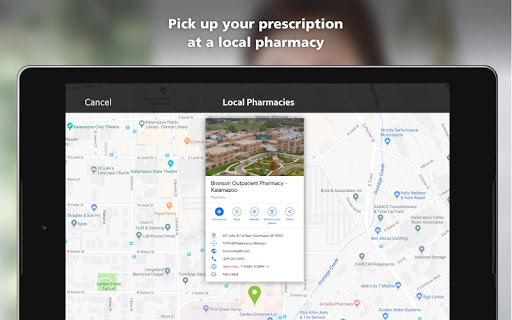
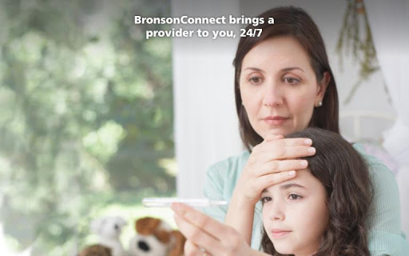
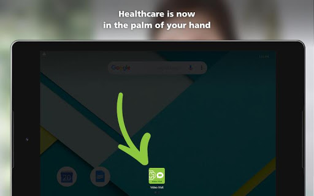
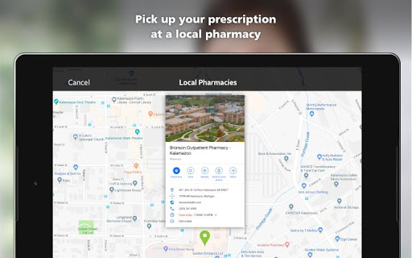
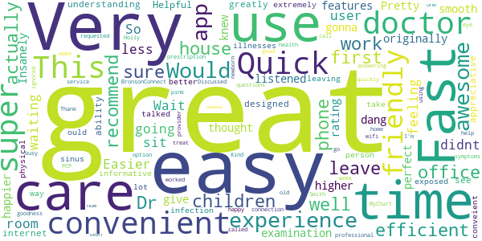
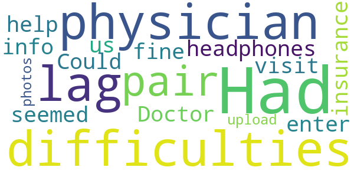

# BronsonConnect Video Visit
App version ``12.0.16.005_01``

Analyzed with [covid-apps-observer](http://github.com/covid-apps-observer) project, version ``0.1``

## App overview
| | |
|-------------------------|-------------------------| 
| **Name**&nbsp;&nbsp;&nbsp;&nbsp;&nbsp;&nbsp;&nbsp;&nbsp;&nbsp;&nbsp;&nbsp;&nbsp;&nbsp;&nbsp;&nbsp;&nbsp;&nbsp;&nbsp;&nbsp;&nbsp;&nbsp;&nbsp;&nbsp;&nbsp;&nbsp;&nbsp;&nbsp;&nbsp;&nbsp;&nbsp;&nbsp;&nbsp;&nbsp;&nbsp;&nbsp;&nbsp;&nbsp;&nbsp;&nbsp;&nbsp;  | BronsonConnect Video Visit |
| **Unique identifier** | com.bronsonhealth.android.bron.videovisit |
| **Link to Google Play** | [https://play.google.com/store/apps/details?id=com.bronsonhealth.android.bron.videovisit](https://play.google.com/store/apps/details?id=com.bronsonhealth.android.bron.videovisit) |
| **Summary**  | Feeling sick? Connect with a provider using your smartphone or computer, 24/7. |
| **Privacy policy** | [https://www.americanwell.com/privacy-policy/](https://www.americanwell.com/privacy-policy/) |
| **Latest version** | 12.0.16.005_01 |
| **Last update** | 2020-10-30 01:06:53 |
| **Recent changes** | We continue to improve the patient experience with these new features: • Performance enhancements to increase reliability and speed |
| **Installs**  | 1,000+ |
| **Category** | Medical |
| **First release** | May 14, 2019 |
| **Size**  | 58M |
| **Supported Android version**  | 5.0 and up |

### Description
> Connect face-to-face with a provider using your smartphone, tablet or computer, any time, day or night, from the comfort of your own home – or anywhere else for that matter. Safe and secure, you don’t even need to be a Bronson patient—you can get care for minor medical needs (18 months or older), behavioral health counseling (9 years or older), and behavioral health psychiatry (18 years or older) that is convenient and affordable.
 Services available include:
 1. Immediate Care: Feeling sick? Physicians and advanced practice providers can treat you 24/7 for colds, fever, allergies, bites, burns, rashes, stomach flu, sinus infections, pink eye and headaches. Medicines prescribed if appropriate. Cost: $59 per visit.
 2. Counseling and Psychiatry: Facing one of life’s many challenges? Counselors and psychiatrists are available to provide confidential advice and counseling 24/7 to help you with a variety of things, including depression (including post-partum depression), anxiety, bereavement, couple’s therapy, panic attacks, trauma, trouble sleeping, stress, substance use and smoking cessation, and more. Counseling cost: $105 or $120 per visit. Psychiatry cost: $225 for initial visit and $115 per follow up visit.
 Key features of a BronsonConnect Video Visit:
 · no appointment needed
 · connect immediately
 · available 24/7
 · cost payable by credit card or insurance, where applicable
 · no sign-up or subscription fees
 · secure and confidential visits - HIPAA compliant
 · physicians, advanced practice providers and counselors available – you choose who you want to see
 · do not need to be a Bronson patient
 · must be at least 18 months old for immediate care; 9 years old for counseling and 18 years old for psychiatry
 Have health insurance? Many insurance companies cover a BronsonConnect Video Visit. Contact your provider to find out if they cover the cost.
 It’s the quality care you need, made easier with a BronsonConnect Video Visit. To get started, download the app, register for an account and choose your provider.
 To learn more or get your questions answered, contact us.
 Web: www.bronsonhealth.com/videovisit
 Email: BronsonConnectSupport@americanwell.com
 Tel: (800) 688-4694

### User interface
The developers of the app provide the following screenshots in the Google play store.
| | | |
|:-------------------------:|:-------------------------:|:-------------------------:|
 |   |   |   | 
 |   |   |   | 
 |   |   |   | 
 |   |   |   | 

## Development team
In the following we report the main information provided by the development team in the Google play store.

| | |
|-------------------------|-------------------------|
| **Developer**  | Bronson Healthcare Group |
| **Website**  | [http://Bronsonhealth.com](http://Bronsonhealth.com) |
| **Email** | bronsonhealthcaregroup@gmail.com |
| **Physical address**  | [601 John St. Box H Kalamazoo, MI 49007](https://www.google.com/maps/search/601%20John%20St.%20Box%20H%20Kalamazoo,%20MI%2049007) (Google Maps) |
| **Other developed apps**  | [https://play.google.com/store/apps/developer?id=Bronson+Healthcare+Group](https://play.google.com/store/apps/developer?id=Bronson+Healthcare+Group) |

## Android support

| | |
|-------------------------|-------------------------|
| **Declared target Android version**  | Pie, version 9 (API level 28) |
| **Effective target Android version**  | Pie, version 9 (API level 28) |
| **Minimum supported Android version**  | Lollipop, version 5.0 (API level 21) |
| **Maximum target Android version**  | - |

The larger the difference between the minimum and maximum supported Android versions, the better. A larger difference means a wider audience. For example, old phones have a very low Android version, so a high minimum supported Android version means that the app cannot be used by users with old phones, thus leading to accessibility problems. 

## Requested permissions

In the following we report the complete list of the permissions requested by the app. 

| **Permission** | **Protection level** | **Description** | 
|-------------------------|-------------------------|-------------------------|
 **android.permission ACCESS_COARSE_LOCATION** | :warning:**Dangerous** | Allows an app to access approximate location. 
 **android.permission ACCESS_FINE_LOCATION** | :warning:**Dangerous** | Allows an app to access precise location. 
 **android.permission ACCESS_LOCATION_EXTRA_COMMANDS** | Normal | Allows an application to access extra location provider commands. 
 **android.permission ACCESS_NETWORK_STATE** | Normal | Allows applications to access information about networks. 
 **android.permission ACCESS_WIFI_STATE** | Normal | Allows applications to access information about Wi-Fi networks. 
 **android.permission BLUETOOTH** | Normal | Allows applications to connect to paired bluetooth devices. 
 **android.permission BROADCAST_STICKY** | Normal | Allows an application to broadcast sticky intents. 
 **android.permission CAMERA** | :warning:**Dangerous** | Required to be able to access the camera device. 
 **android.permission GET_TASKS** | Deprecated | This constant was deprecated in API level 21. No longer enforced. 
 **android.permission INTERNET** | Normal | Allows applications to open network sockets. 
 **android.permission MODIFY_AUDIO_SETTINGS** | Normal | Allows an application to modify global audio settings. 
 **android.permission READ_EXTERNAL_STORAGE** | :warning:**Dangerous** | Allows an application to read from external storage. 
 **android.permission READ_PHONE_STATE** | :warning:**Dangerous** | Allows read only access to phone state, including the phone number of the device, current cellular network information, the status of any ongoing calls, and a list of any PhoneAccounts registered on the device. 
 **android.permission RECEIVE_BOOT_COMPLETED** | Normal | Allows an application to receive the Intent.ACTION_BOOT_COMPLETED that is broadcast after the system finishes booting. 
 **android.permission RECORD_AUDIO** | :warning:**Dangerous** | Allows an application to record audio. 
 **android.permission REORDER_TASKS** | Normal | Allows an application to change the Z-order of tasks. 
 **android.permission SYSTEM_ALERT_WINDOW** | Signature - preinstalled - appop - pre23 - development | Allows an app to create windows using the type WindowManager.LayoutParams.TYPE_APPLICATION_OVERLAY, shown on top of all other apps. 
 **android.permission USE_BIOMETRIC** | Normal | Allows an app to use device supported biometric modalities. 
 **android.permission USE_FINGERPRINT** | Normal | This constant was deprecated in API level 28. Applications should request USE_BIOMETRIC instead 
 **android.permission VIBRATE** | Normal | Allows access to the vibrator. 
 **android.permission WAKE_LOCK** | Normal | Allows using PowerManager WakeLocks to keep processor from sleeping or screen from dimming. 
 **android.permission WRITE_EXTERNAL_STORAGE** | :warning:**Dangerous** | Allows an application to write to external storage. 
 **com.bronsonhealth.android.bron.videovisit.permission C2D_MESSAGE** | - | - 
 **com.facebook.katana.provider ACCESS** | - | - 
 **com.google.android.c2dm.permission RECEIVE** | - | - 
 **com.google.android.finsky.permission BIND_GET_INSTALL_REFERRER_SERVICE** | - | - 

## Mentioned servers

| **Server** | **Registrant** | **Registrant country** | **Creation date** | 
|-------------------------|-------------------------|-------------------------|-------------------------|
 | amwell.com | American Well Corporation | :us: US | 2004-02-13 19:02:32 |
 | facebook.com | Facebook, Inc. | :us: US | 1997-03-29 05:00:00 |
 | doubleclick.net | Google Inc. | :us: US | 1996-01-16 05:00:00 |
 | googleadservices.com | Google LLC | :us: US | 2003-06-19 16:34:53 |
 | google.com | Google LLC | :us: US | 1997-09-15 04:00:00 |
 | googlesyndication.com | Google LLC | :us: US | 2003-01-21 06:17:24 |
 | googleapis.com | Google LLC | :us: US | 2005-01-25 17:52:26 |
 | google-analytics.com | Google LLC | :us: US | 2005-07-18 19:24:32 |
 | app-measurement.com | Google LLC | :us: US | 2015-06-19 20:13:31 |
 | appboy.com | Braze, Inc. | :us: US | 2008-10-06 23:28:32 |
 | braze.com | Braze, Inc. | :us: US | 2000-01-19 02:18:28 |
 | branch.io | Branch | :us: US | 2011-11-10 13:52:13 |
 | optimizely.com | Optimizely | :us: US | 2010-01-11 03:01:32 |
 | twitter.com | Twitter, Inc. | :us: US | 2000-01-21 16:28:17 |
 | crashlytics.com | Google LLC | :us: US | 2011-01-21 15:30:40 |
 | bnc.lt | - | - | 2016-11-14 00:00:00 |
 | gstatic.com | Google LLC | :us: US | 2008-02-11 15:31:25 |
 | ggpht.com | Google LLC | :us: US | 2008-01-16 18:55:33 |

## Security analysis 

Below we report the main security warnings raised by our execution of the [Androwarn](https://github.com/maaaaz/androwarn) security analysis tool.

**Telephony identifiers leakage**
> - This application reads the ISO country code equivalent for the SIM provider's country code 
> - This application reads the ISO country code equivalent of the current registered operator's MCC (Mobile Country Code) 
> - This application reads the MCC+MNC of the provider of the SIM 
> - This application reads the device phone type value 
> - This application reads the numeric name (MCC+MNC) of current registered operator 
> - This application reads the operator name 
> - This application reads the phone's current state 
> - This application reads the radio technology (network type) currently in use on the device for data transmission 

**Connection interfaces exfiltration**
> - This application reads details about the currently active data network 
> - This application tries to find out if the currently active data network is metered 

**Telephony services abuse**
> - This application makes phone calls 

**Audio video eavesdropping**
> - This application captures video from the 'CAMERA' source 

**Suspicious connection establishment**
> - This application opens a Socket and connects it to the remote address '' on the 'N/A' port  
> - This application opens a Socket and connects it to the remote address 'Ljava/lang/StringBuilder;->toString()Ljava/lang/String;' on the 'N/A' port  
> - This application opens a Socket and connects it to the remote address 'Ljava/net/Proxy;->type()Ljava/net/Proxy$Type;' on the 'N/A' port  
> - This application opens a Socket and connects it to the remote address 'timeout' on the 'N/A' port  

**Code execution**
> - This application loads a native library 
> - This application loads a native library: 'VidyoClientApp' 
> - This application loads a native library: 'ndkVideoClient' 
> - This application executes a UNIX command containing this argument: '2' 

## User ratings and reviews

Below we provide information about how end users are reacting to the app in terms of ratings and reviews in the Google Play store.

### Ratings

The BronsonConnect Video Visit app has been installed by more than **1000** times. At this time, **52** rated the app and its average score is **4.7884617**. Below we show the distribution of the ratings across the usual star-based rating of Google Play

:star::star::star::star::star:: 45

:star::star::star::star:: 5

:star::star::star:: 1

:star::star:: 0

:star:: 1

### Reviews 

#### 5-star reviews

> So easy to use! Very user friendly. Wait time was less than going to Fast Care and I didnt have to sit in a waiting room with others who are not feeling well  :date: __2020-09-26 17:41:03__

> I had a great experience!  :date: __2020-08-14 22:08:35__

> Easier to use than I originally thought it would be  :date: __2020-07-31 18:29:50__

> Very smooth app with convenient features  :date: __2020-07-22 17:53:28__

> Insanely awesome  :date: __2020-06-26 22:27:03__

> Pretty dang efficient!  :date: __2020-05-10 22:44:20__

> Quick and easy  :date: __2020-05-10 19:03:08__

> She was awesome actually listened to me and she actually knew what she was doing I couldn't be happier with her examination great doctor and great app I wasn't sure how it was gonna work on the phone but it was perfect couldn't give her a higher rating  :date: __2020-05-06 00:15:40__

> Helpful and understanding doctors.  :date: __2020-05-04 15:56:42__

> Very well designed app, greatly appreciative for the ability to see a doctor over the internet.  :date: __2020-04-25 20:11:42__

#### 4-star reviews

> Had some difficulties with lag with my physician but a pair of headphones seemed to help both of us.  :date: __2019-12-30 15:19:02__

> Doctor visit was fine. Could not enter insurance info or upload photos.  :date: __2019-09-17 00:09:40__

#### 3-star reviews

No recent reviews available with 3 stars.

#### 2-star reviews

No recent reviews available with 2 stars.

#### 1-star reviews

> Download this app if you like errors, and not chatting with a doctor.  :date: __2019-08-19 16:35:56__

