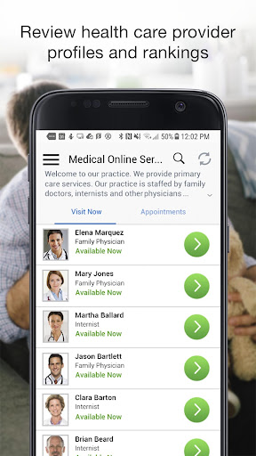
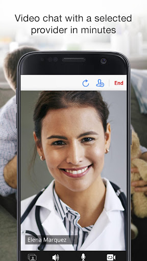
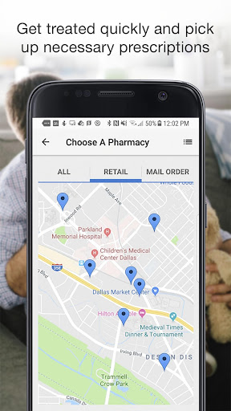
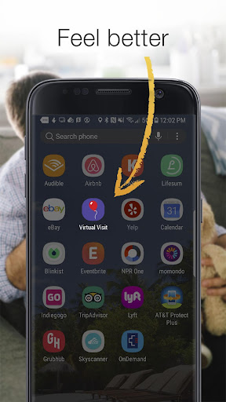
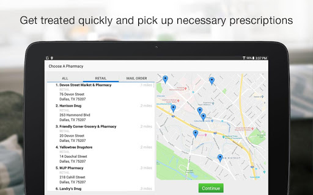
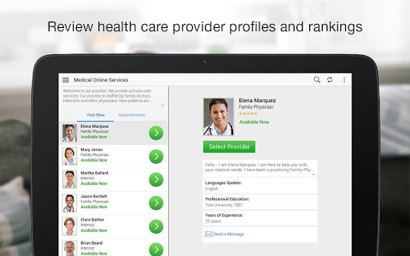
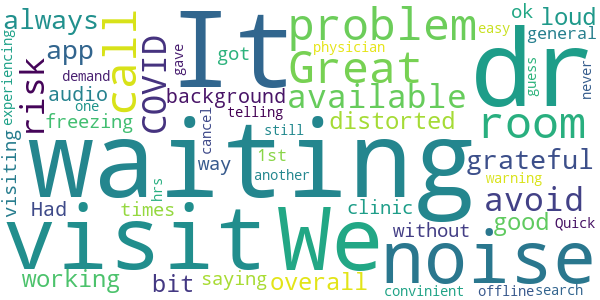

# Children’s Health VirtualVisit – Family Care 24/7
App version ``12.10.01.005_01``

Analyzed with [covid-apps-observer](http://github.com/covid-apps-observer) project, version ``0.1``

## App overview
| | |
|-------------------------|-------------------------| 
| **Name**&nbsp;&nbsp;&nbsp;&nbsp;&nbsp;&nbsp;&nbsp;&nbsp;&nbsp;&nbsp;&nbsp;&nbsp;&nbsp;&nbsp;&nbsp;&nbsp;&nbsp;&nbsp;&nbsp;&nbsp;&nbsp;&nbsp;&nbsp;&nbsp;&nbsp;&nbsp;&nbsp;&nbsp;&nbsp;&nbsp;&nbsp;&nbsp;&nbsp;&nbsp;&nbsp;&nbsp;&nbsp;&nbsp;&nbsp;&nbsp;  | Children’s Health VirtualVisit – Family Care 24/7 |
| **Unique identifier** | com.childrenstx.android.virtualvisit |
| **Link to Google Play** | [https://play.google.com/store/apps/details?id=com.childrenstx.android.virtualvisit](https://play.google.com/store/apps/details?id=com.childrenstx.android.virtualvisit) |
| **Summary**  | A more convenient way to see a health care provider. |
| **Privacy policy** | [https://www.childrens.com/footer/privacy-policy](https://www.childrens.com/footer/privacy-policy) |
| **Latest version** | 12.10.01.005_01 |
| **Last update** | 2021-05-21 22:00:43 |
| **Recent changes** | We continue to improve the patient experience with these new features: • Performance enhancements to increase reliability and speed |
| **Installs**  | 10,000+ |
| **Category** | Medical |
| **First release** | Feb 16, 2016 |
| **Size**  | 48M |
| **Supported Android version**  | 5.0 and up |

### Description
> With Virtual Visit by Children’s Health℠ Virtual Care, you’re just one click away from being healthier. Virtual Visit makes it more convenient to see a health care provider. Simply select a provider and connect to have an online, face-to-face appointment using your phone or tablet. During your consultation, a Virtual Visit health care provider will decide if a diagnosis is possible and if prescribed medication is necessary. 
 Virtual Visit can be used to address common conditions such as:
 •	Cough
 •	Respiratory and sinus infection
 •	Cold
 •	Fever
 •	Flu
 •	Headache
 •	Strep throat
 •	Pink eye
 Key features of Virtual Visit include:
 •	Online consultations for children and adults with trusted providers
 •	Affordable visits – $55 
 •	Private, secure and HIPPA compliant 
 •	Board-certified physicians trained in the U.S.
 •	24/7 availability – even on holidays
 •	Convenient prescriptions with pick up at your preferred pharmacy
  
 If you have a medical emergency, call 911. Virtual Visit is not for serious or life-threatening conditions.

### User interface
The developers of the app provide the following screenshots in the Google play store.
| | | |
|:-------------------------:|:-------------------------:|:-------------------------:|
 |   |   |   | 
 |   |   |   | 
 |   |   |   | 
 |   |   |   | 
 |   |   |   | 

## Development team
In the following we report the main information provided by the development team in the Google play store.

| | |
|-------------------------|-------------------------|
| **Developer**  | Children’s Health |
| **Website**  | [http://www.childrens.com/](http://www.childrens.com/) |
| **Email** | childrensole@gmail.com |
| **Physical address**  | - |
| **Other developed apps**  | [https://play.google.com/store/apps/developer?id=Children%E2%80%99s+Health](https://play.google.com/store/apps/developer?id=Children%E2%80%99s+Health) |

## Android support

| | |
|-------------------------|-------------------------|
| **Declared target Android version**  | Android10, version 10 (API level 29) |
| **Effective target Android version**  | Android10, version 10 (API level 29) |
| **Minimum supported Android version**  | Lollipop, version 5.0 (API level 21) |
| **Maximum target Android version**  | - |

The larger the difference between the minimum and maximum supported Android versions, the better. A larger difference means a wider audience. For example, old phones have a very low Android version, so a high minimum supported Android version means that the app cannot be used by users with old phones, thus leading to accessibility problems. 

## Requested permissions

In the following we report the complete list of the permissions requested by the app. 

| **Permission** | **Protection level** | **Description** | 
|-------------------------|-------------------------|-------------------------|
 **android.permission ACCESS_COARSE_LOCATION** | :warning:**Dangerous** | Allows an app to access approximate location. 
 **android.permission ACCESS_FINE_LOCATION** | :warning:**Dangerous** | Allows an app to access precise location. 
 **android.permission ACCESS_LOCATION_EXTRA_COMMANDS** | Normal | Allows an application to access extra location provider commands. 
 **android.permission ACCESS_NETWORK_STATE** | Normal | Allows applications to access information about networks. 
 **android.permission ACCESS_WIFI_STATE** | Normal | Allows applications to access information about Wi-Fi networks. 
 **android.permission BLUETOOTH** | Normal | Allows applications to connect to paired bluetooth devices. 
 **android.permission BROADCAST_STICKY** | Normal | Allows an application to broadcast sticky intents. 
 **android.permission CAMERA** | :warning:**Dangerous** | Required to be able to access the camera device. 
 **android.permission GET_TASKS** | Deprecated | This constant was deprecated in API level 21. No longer enforced. 
 **android.permission INTERNET** | Normal | Allows applications to open network sockets. 
 **android.permission MODIFY_AUDIO_SETTINGS** | Normal | Allows an application to modify global audio settings. 
 **android.permission READ_EXTERNAL_STORAGE** | :warning:**Dangerous** | Allows an application to read from external storage. 
 **android.permission READ_PHONE_STATE** | :warning:**Dangerous** | Allows read only access to phone state, including the phone number of the device, current cellular network information, the status of any ongoing calls, and a list of any PhoneAccounts registered on the device. 
 **android.permission RECEIVE_BOOT_COMPLETED** | Normal | Allows an application to receive the Intent.ACTION_BOOT_COMPLETED that is broadcast after the system finishes booting. 
 **android.permission RECORD_AUDIO** | :warning:**Dangerous** | Allows an application to record audio. 
 **android.permission REORDER_TASKS** | Normal | Allows an application to change the Z-order of tasks. 
 **android.permission SYSTEM_ALERT_WINDOW** | Signature - preinstalled - appop - pre23 - development | Allows an app to create windows using the type WindowManager.LayoutParams.TYPE_APPLICATION_OVERLAY, shown on top of all other apps. 
 **android.permission USE_BIOMETRIC** | Normal | Allows an app to use device supported biometric modalities. 
 **android.permission USE_FINGERPRINT** | Normal | This constant was deprecated in API level 28. Applications should request USE_BIOMETRIC instead 
 **android.permission VIBRATE** | Normal | Allows access to the vibrator. 
 **android.permission WAKE_LOCK** | Normal | Allows using PowerManager WakeLocks to keep processor from sleeping or screen from dimming. 
 **android.permission WRITE_EXTERNAL_STORAGE** | :warning:**Dangerous** | Allows an application to write to external storage. 
 **com.childrenstx.android.virtualvisit.permission C2D_MESSAGE** | - | - 
 **com.facebook.katana.provider ACCESS** | - | - 
 **com.google.android.c2dm.permission RECEIVE** | - | - 
 **com.google.android.finsky.permission BIND_GET_INSTALL_REFERRER_SERVICE** | - | - 

## Mentioned servers

| **Server** | **Registrant** | **Registrant country** | **Creation date** | 
|-------------------------|-------------------------|-------------------------|-------------------------|
 | amwell.com | American Well Corporation | :us: US | 2004-02-13 19:02:32 |
 | facebook.com | Facebook, Inc. | :us: US | 1997-03-29 05:00:00 |
 | doubleclick.net | Google Inc. | :us: US | 1996-01-16 05:00:00 |
 | googleadservices.com | Google LLC | :us: US | 2003-06-19 16:34:53 |
 | google.com | Google LLC | :us: US | 1997-09-15 04:00:00 |
 | googlesyndication.com | Google LLC | :us: US | 2003-01-21 06:17:24 |
 | google-analytics.com | Google LLC | :us: US | 2005-07-18 19:24:32 |
 | appboy.com | Braze, Inc. | :us: US | 2008-10-06 23:28:32 |
 | braze.com | Braze, Inc. | :us: US | 2000-01-19 02:18:28 |
 | app-measurement.com | Google LLC | :us: US | 2015-06-19 20:13:31 |
 | optimizely.com | Optimizely | :us: US | 2010-01-11 03:01:32 |
 | twitter.com | Twitter, Inc. | :us: US | 2000-01-21 16:28:17 |
 | branch.io | Branch | :us: US | 2011-11-10 13:52:13 |
 | gstatic.com | Google LLC | :us: US | 2008-02-11 15:31:25 |
 | crashlytics.com | Google LLC | :us: US | 2011-01-21 15:30:40 |
 | bnc.lt | - | - | 2016-11-14 00:00:00 |
 | ggpht.com | Google LLC | :us: US | 2008-01-16 18:55:33 |

## Security analysis 

Below we report the main security warnings raised by our execution of the [Androwarn](https://github.com/maaaaz/androwarn) security analysis tool.

**Telephony identifiers leakage**
> - This application reads the ISO country code equivalent for the SIM provider's country code 
> - This application reads the ISO country code equivalent of the current registered operator's MCC (Mobile Country Code) 
> - This application reads the device phone type value 
> - This application reads the numeric name (MCC+MNC) of current registered operator 
> - This application reads the operator name 
> - This application reads the phone's current state 
> - This application reads the radio technology (network type) currently in use on the device for data transmission 

**Connection interfaces exfiltration**
> - This application reads details about the currently active data network 
> - This application tries to find out if the currently active data network is metered 

**Telephony services abuse**
> - This application makes phone calls 

**Audio video eavesdropping**
> - This application records audio from the 'VOICE_RECOGNITION' source  
> - This application captures video from the 'CAMERA' source 

**Suspicious connection establishment**
> - This application opens a Socket and connects it to the remote address ' returned no addresses for  ; port is out of range' on the 'N/A' port  
> - This application opens a Socket and connects it to the remote address '' on the 'N/A' port  
> - This application opens a Socket and connects it to the remote address 'Ljava/net/Proxy;->type()Ljava/net/Proxy$Type;' on the 'N/A' port  
> - This application opens a Socket and connects it to the remote address 'timeout' on the 'N/A' port  

**Code execution**
> - This application loads a native library 
> - This application executes a UNIX command containing this argument: '2' 

## User ratings and reviews

Below we provide information about how end users are reacting to the app in terms of ratings and reviews in the Google Play store.

### Ratings

The Children’s Health VirtualVisit – Family Care 24/7 app has been installed by more than **10000** times. At this time, **277** rated the app and its average score is **4.77**. Below we show the distribution of the ratings across the usual star-based rating of Google Play

:star::star::star::star::star:: 247

:star::star::star::star:: 19

:star::star::star:: 0

:star::star:: 0

:star:: 11

### Reviews 

#### 5-star reviews

> Quick, easy to use, so much better than waiting for an appt or waiting in the er!  :date: __2021-05-21 20:00:04__

> Excellent doctors, and so nice not to have to go to the ER!  :date: __2021-05-12 23:34:27__

> Super easy. Installed & using in just minutes!  :date: __2021-04-06 15:03:34__

> Very goid  :date: __2021-03-17 21:49:34__

> Great App. No issues! Love it!  :date: __2021-02-25 16:37:19__

> Great!!  :date: __2021-02-16 20:24:18__

> Dr was great explained everything  :date: __2021-02-13 16:56:46__

> Great app to is when unable to bring my child to her appt  :date: __2021-01-27 15:25:46__

> Detailed  :date: __2021-01-15 17:15:18__

> It work grate.  :date: __2020-12-28 18:30:31__

#### 4-star reviews

> We were available to have our visit, and avoid the risk of COVID, so we are grateful for this app. But it is not always working.  :date: __2020-06-12 18:07:20__

> It was good overall the noise can get a bit distorted with a loud background noise  :date: __2020-06-01 20:47:54__

> Had problem with audio, freezing up.  :date: __2020-05-20 16:59:31__

> I was in the waiting room & then I got a call from the clinic saying i was not in the waiting room. It did that 3 times!  :date: __2020-05-12 21:42:04__

> Great way to visit the dr without visiting the dr.  :date: __2020-04-20 21:25:57__

> Was ok in general but on my 1st physician the call was telling me I was still waiting and after 2 hrs I cancel & Dr was offline but never gave me a warning to search for another one. I guess for the demand they were experiencing problems  :date: __2020-03-24 04:28:27__

> Great  :date: __2019-12-15 14:54:04__

> very convinient  :date: __2019-02-10 19:59:22__

> Quick and easy  :date: __2018-02-13 16:48:24__

#### 3-star reviews

No recent reviews available with 3 stars.

#### 2-star reviews

No recent reviews available with 2 stars.

#### 1-star reviews

> Didn't work for us  :date: __2021-05-13 21:36:10__

> will let me log in  :date: __2021-02-03 22:35:34__

> Updated Terms of Use are only available in Spanish.  :date: __2020-11-26 01:38:53__

> Hard to login  :date: __2020-11-03 19:08:20__

> It never works. Always have glitches  :date: __2020-05-05 22:07:42__

