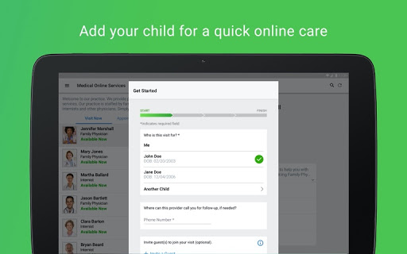
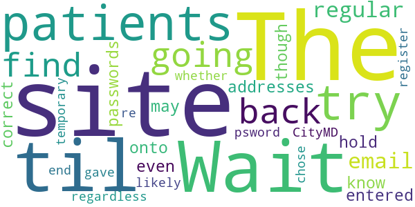
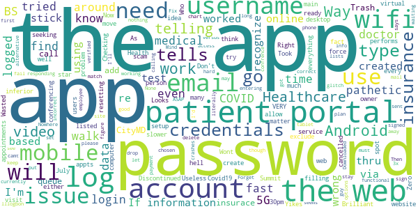

# CityMD
App version ``12.9.01.000_00``

Analyzed with [covid-apps-observer](http://github.com/covid-apps-observer) project, version ``0.1``

## App overview
| | |
|-------------------------|-------------------------| 
| **Name**&nbsp;&nbsp;&nbsp;&nbsp;&nbsp;&nbsp;&nbsp;&nbsp;&nbsp;&nbsp;&nbsp;&nbsp;&nbsp;&nbsp;&nbsp;&nbsp;&nbsp;&nbsp;&nbsp;&nbsp;&nbsp;&nbsp;&nbsp;&nbsp;&nbsp;&nbsp;&nbsp;&nbsp;&nbsp;&nbsp;&nbsp;&nbsp;&nbsp;&nbsp;&nbsp;&nbsp;&nbsp;&nbsp;&nbsp;&nbsp;  | CityMD |
| **Unique identifier** | com.citymd.android.city.citymd |
| **Link to Google Play** | [https://play.google.com/store/apps/details?id=com.citymd.android.city.citymd](https://play.google.com/store/apps/details?id=com.citymd.android.city.citymd) |
| **Summary**  | CITYMD gives you immediate virtual access to a quality doctor 24/7. |
| **Privacy policy** | [https://www.americanwell.com/privacy-policy/](https://www.americanwell.com/privacy-policy/) |
| **Latest version** | 12.9.01.000_00 |
| **Last update** | 2021-04-08 19:32:03 |
| **Recent changes** | We continue to improve the patient experience with these new features: • Performance enhancements to increase reliability and speed |
| **Installs**  | 10,000+ |
| **Category** | Medical |
| **First release** | Mar 29, 2019 |
| **Size**  | 53M |
| **Supported Android version**  | 5.0 and up |

### Description
> CITYMD gives you immediate virtual access to a licensed medical provider 24/7 with just a click on your smartphone, tablet or computer. Experience the high quality care that CITYMD provides through a one-on-one connection with our highly trained providers. Need a prescription filled? Our providers will call it in to a location close to you. Enroll for free today: the best non-emergency medical care is just a click away!
 Safe, Private and Secure
 Enrolling is easy. Just download the app, create your account, and follow the quick and easy steps to be “seen” in minutes. Rest assured your information, including your credit card number and personal details, is secure. Your visit is private and protected and follows HIPAA guidelines for patient safety and confidentiality. Download the CITYMD app today and always be one click away from CITYMD!
 Conditions Treated
 CITYMD treats a wide range of illnesses. You can count on receiving the very best care you’ve come to expect from CITYMD for Acid Reflux, Acne, Allergies, Asthma, Back Pain, Cold & Flu, Constipation, Cough, Diarrhea, Ear Ache, Fever, Headache/Migraine, Muscle/ Joint Pain, Nausea/ Vomiting/ Stomach Upset, Pink/ Red Eye, Rash, Runny Nose, Sinus Infection, Skin Conditions, Sore Throat/ Laryngitis, Upper Respiratory Infection, Urinary Tract Infection (UTI), and Yeast Infection.
 Through your live video chat, a CITYMD provider will assess your symptoms, answer your questions, provide treatment, and call in prescriptions if needed.
 We Welcome Your Feedback!
 We hope you’re feeling better, and that you had a great experience with CITYMD.
 Please let us know how you feel about our service by leaving a review.
 Visit us on www.citymd.com.
 Learn how we’re promoting health and wellness in every community we serve. With over 100 locations in NY and NJ, when you need some CITYMD, just walk in. Or click on CITYMD.

### User interface
The developers of the app provide the following screenshots in the Google play store.
| | | |
|:-------------------------:|:-------------------------:|:-------------------------:|
 |   |   |   | 
 |   |   |   | 
 |   |   |   | 
 |   |   |   | 

## Development team
In the following we report the main information provided by the development team in the Google play store.

| | |
|-------------------------|-------------------------|
| **Developer**  | City Practice Group of New York, LLC |
| **Website**  | - |
| **Email** | aftercare@citymd.net |
| **Physical address**  | - |
| **Other developed apps**  | [https://play.google.com/store/apps/developer?id=City+Practice+Group+of+New+York,+LLC](https://play.google.com/store/apps/developer?id=City+Practice+Group+of+New+York,+LLC) |

## Android support

| | |
|-------------------------|-------------------------|
| **Declared target Android version**  | Android10, version 10 (API level 29) |
| **Effective target Android version**  | Android10, version 10 (API level 29) |
| **Minimum supported Android version**  | Lollipop, version 5.0 (API level 21) |
| **Maximum target Android version**  | - |

The larger the difference between the minimum and maximum supported Android versions, the better. A larger difference means a wider audience. For example, old phones have a very low Android version, so a high minimum supported Android version means that the app cannot be used by users with old phones, thus leading to accessibility problems. 

## Requested permissions

In the following we report the complete list of the permissions requested by the app. 

| **Permission** | **Protection level** | **Description** | 
|-------------------------|-------------------------|-------------------------|
 **android.permission ACCESS_COARSE_LOCATION** | :warning:**Dangerous** | Allows an app to access approximate location. 
 **android.permission ACCESS_FINE_LOCATION** | :warning:**Dangerous** | Allows an app to access precise location. 
 **android.permission ACCESS_LOCATION_EXTRA_COMMANDS** | Normal | Allows an application to access extra location provider commands. 
 **android.permission ACCESS_NETWORK_STATE** | Normal | Allows applications to access information about networks. 
 **android.permission ACCESS_WIFI_STATE** | Normal | Allows applications to access information about Wi-Fi networks. 
 **android.permission BLUETOOTH** | Normal | Allows applications to connect to paired bluetooth devices. 
 **android.permission BROADCAST_STICKY** | Normal | Allows an application to broadcast sticky intents. 
 **android.permission CAMERA** | :warning:**Dangerous** | Required to be able to access the camera device. 
 **android.permission GET_TASKS** | Deprecated | This constant was deprecated in API level 21. No longer enforced. 
 **android.permission INTERNET** | Normal | Allows applications to open network sockets. 
 **android.permission MODIFY_AUDIO_SETTINGS** | Normal | Allows an application to modify global audio settings. 
 **android.permission READ_EXTERNAL_STORAGE** | :warning:**Dangerous** | Allows an application to read from external storage. 
 **android.permission READ_PHONE_STATE** | :warning:**Dangerous** | Allows read only access to phone state, including the phone number of the device, current cellular network information, the status of any ongoing calls, and a list of any PhoneAccounts registered on the device. 
 **android.permission RECEIVE_BOOT_COMPLETED** | Normal | Allows an application to receive the Intent.ACTION_BOOT_COMPLETED that is broadcast after the system finishes booting. 
 **android.permission RECORD_AUDIO** | :warning:**Dangerous** | Allows an application to record audio. 
 **android.permission REORDER_TASKS** | Normal | Allows an application to change the Z-order of tasks. 
 **android.permission SYSTEM_ALERT_WINDOW** | Signature - preinstalled - appop - pre23 - development | Allows an app to create windows using the type WindowManager.LayoutParams.TYPE_APPLICATION_OVERLAY, shown on top of all other apps. 
 **android.permission USE_BIOMETRIC** | Normal | Allows an app to use device supported biometric modalities. 
 **android.permission USE_FINGERPRINT** | Normal | This constant was deprecated in API level 28. Applications should request USE_BIOMETRIC instead 
 **android.permission VIBRATE** | Normal | Allows access to the vibrator. 
 **android.permission WAKE_LOCK** | Normal | Allows using PowerManager WakeLocks to keep processor from sleeping or screen from dimming. 
 **android.permission WRITE_EXTERNAL_STORAGE** | :warning:**Dangerous** | Allows an application to write to external storage. 
 **com.citymd.android.city.citymd.permission C2D_MESSAGE** | - | - 
 **com.facebook.katana.provider ACCESS** | - | - 
 **com.google.android.c2dm.permission RECEIVE** | - | - 
 **com.google.android.finsky.permission BIND_GET_INSTALL_REFERRER_SERVICE** | - | - 

## Mentioned servers

| **Server** | **Registrant** | **Registrant country** | **Creation date** | 
|-------------------------|-------------------------|-------------------------|-------------------------|
 | amwell.com | American Well Corporation | :us: US | 2004-02-13 19:02:32 |
 | facebook.com | Facebook, Inc. | :us: US | 1997-03-29 05:00:00 |
 | doubleclick.net | Google Inc. | :us: US | 1996-01-16 05:00:00 |
 | googleadservices.com | Google LLC | :us: US | 2003-06-19 16:34:53 |
 | google.com | Google LLC | :us: US | 1997-09-15 04:00:00 |
 | googlesyndication.com | Google LLC | :us: US | 2003-01-21 06:17:24 |
 | google-analytics.com | Google LLC | :us: US | 2005-07-18 19:24:32 |
 | appboy.com | Braze, Inc. | :us: US | 2008-10-06 23:28:32 |
 | braze.com | Braze, Inc. | :us: US | 2000-01-19 02:18:28 |
 | app-measurement.com | Google LLC | :us: US | 2015-06-19 20:13:31 |
 | optimizely.com | Optimizely | :us: US | 2010-01-11 03:01:32 |
 | twitter.com | Twitter, Inc. | :us: US | 2000-01-21 16:28:17 |
 | branch.io | Branch | :us: US | 2011-11-10 13:52:13 |
 | gstatic.com | Google LLC | :us: US | 2008-02-11 15:31:25 |
 | crashlytics.com | Google LLC | :us: US | 2011-01-21 15:30:40 |
 | bnc.lt | - | - | 2016-11-14 00:00:00 |
 | ggpht.com | Google LLC | :us: US | 2008-01-16 18:55:33 |

## Security analysis 

Below we report the main security warnings raised by our execution of the [Androwarn](https://github.com/maaaaz/androwarn) security analysis tool.

**Telephony identifiers leakage**
> - This application reads the ISO country code equivalent for the SIM provider's country code 
> - This application reads the ISO country code equivalent of the current registered operator's MCC (Mobile Country Code) 
> - This application reads the device phone type value 
> - This application reads the numeric name (MCC+MNC) of current registered operator 
> - This application reads the operator name 
> - This application reads the phone's current state 
> - This application reads the radio technology (network type) currently in use on the device for data transmission 

**Connection interfaces exfiltration**
> - This application reads details about the currently active data network 
> - This application tries to find out if the currently active data network is metered 

**Telephony services abuse**
> - This application makes phone calls 

**Audio video eavesdropping**
> - This application records audio from the 'VOICE_RECOGNITION' source  
> - This application captures video from the 'CAMERA' source 

**Suspicious connection establishment**
> - This application opens a Socket and connects it to the remote address ' returned no addresses for  ; port is out of range' on the 'N/A' port  
> - This application opens a Socket and connects it to the remote address '' on the 'N/A' port  
> - This application opens a Socket and connects it to the remote address 'Ljava/net/Proxy;->type()Ljava/net/Proxy$Type;' on the 'N/A' port  
> - This application opens a Socket and connects it to the remote address 'timeout' on the 'N/A' port  

**Code execution**
> - This application loads a native library 
> - This application executes a UNIX command containing this argument: '2' 

## User ratings and reviews

Below we provide information about how end users are reacting to the app in terms of ratings and reviews in the Google Play store.

### Ratings

The CityMD app has been installed by more than **10000** times. At this time, **261** rated the app and its average score is **4.84**. Below we show the distribution of the ratings across the usual star-based rating of Google Play

:star::star::star::star::star:: 244

:star::star::star::star:: 10

:star::star::star:: 0

:star::star:: 0

:star:: 7

### Reviews 

#### 5-star reviews

> Excellent intetface  :date: __2021-06-27 18:30:15__

> I was evaluated by Doctor Jane Avella. She was caring and nice during my visit.  :date: __2021-05-24 17:14:54__

> Quick doctor on call.  :date: __2021-05-12 19:15:44__

> Knowledgeable  :date: __2021-05-09 14:32:31__

> Very knowledgeable and kind  :date: __2021-05-07 15:16:48__

> Excellent experience with telehealth  :date: __2021-05-06 20:31:42__

> Easy to use. Clear instructions  :date: __2021-05-04 16:46:27__

> I think this service is a wonderful service because it saves us time and gives peace if mind about what's going on PLEASE use if needed  :date: __2021-04-18 01:53:39__

> Great app! Took me only 30 min from downloading to see a doctor!  :date: __2021-04-13 21:29:22__

> Excellent!  :date: __2021-04-04 01:21:13__

#### 4-star reviews

> Fast and convenient way to see a medical provider. Video quality could be better, but adequate for my purposes.  :date: __2021-04-30 20:48:21__

> The doctor was very professional and took his time to resolve my issue  :date: __2020-10-12 23:13:41__

> Very good experience with clinic and doctor. Your questions only show selective answers as NO and NOT SURE.  :date: __2020-07-04 18:30:48__

> lost audio but finished up with audio on home phone and video on cell  :date: __2020-05-06 19:12:36__

> I received great help and prescription for my issue.  :date: __2020-04-09 22:00:17__

> It was good  :date: __2020-04-07 17:14:55__

#### 3-star reviews

> Virtual doctor nice, but I was expecting the full City MD account info to be available on this app. The Portal information for your medical history at city md would not be available on this app along with any test results.  :date: __2020-05-11 00:49:08__

#### 2-star reviews

> Wait til some patients try going back to this site & find that their regular email addresses &/or passwords are "not correct", even though you know it is. The site can't hold onto what you may have entered, regardless of whether CityMD gave out the temporary psword or you chose it yourself, you most likely end up having to re register again.  :date: __2020-06-02 00:29:37__

#### 1-star reviews

> Discontinued your service to move over to Summit Health before you were ready with an Android app? Brilliant work. Way to exclude every android owner seeking Healthcare with you.  :date: __2021-06-04 02:12:05__

> Who the hell do you think you are telling me that I need wifi to use video conferencing? This is pathetic BS. You have no idea how fast my wifi is and how fast my mobile data is. My mobile data is 5G and performs VERY well. I do NOT need wifi to use video. Don't you ever force users to do BS like this. Now I have to walk around and find some inferior wifi spot that will be slower than my 5G, and the main medical issue here is that after COVID, I cannot walk around too much. PATHETIC!!!!!!  :date: __2021-03-28 20:41:01__

> Wasted time filling everything out and the doctor cancelled the visit...  :date: __2021-03-13 10:17:15__

> I can't login to the app with the same credentials that I logged in on desktop website. I tried resetting my password, but app didn't even find my account either. Yikes. Zero star  :date: __2020-08-27 14:18:37__

> You can't even log on to the app doesn't matter how many times I try and i know for a fact that it's the Right information until this issue is worked out i would stick to Checking online  :date: __2020-08-14 00:09:32__

> Useless app  :date: __2020-08-08 14:20:58__

> My insurance is not listed for the virtual appointments, only in-person appts.  :date: __2020-08-06 01:48:15__

> Looks like scam.  :date: __2020-08-03 07:29:36__

> Took Covid19 test  :date: __2020-07-06 23:04:39__

> As of July 02, 2020 at 5:30pm, there is a problem with the app. If you create an account thru the web using your computer, or by responding to the "patient portal" e-mail first, the app will not recognize your username or password chosen thru the web. Until they get this glitch worked out, I'd stay away from the app. Using the web based versus app based patient portal seems way more functional. If you must use your phone or tablet to access the patient portal via this app, you may currently need to delete the account set up through the web and re-sign-up via the app. I'm no IT guy, but this shouldn't be so hard. :-(  :date: __2020-07-02 23:56:39__

