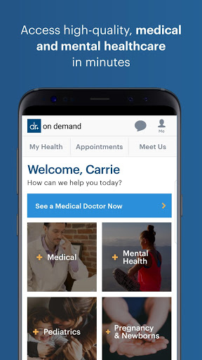
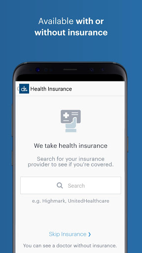
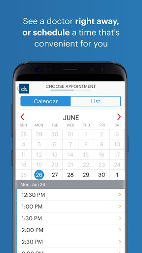
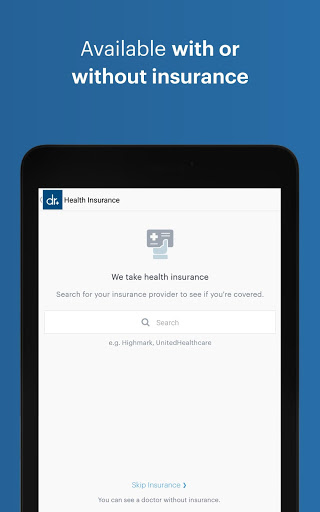
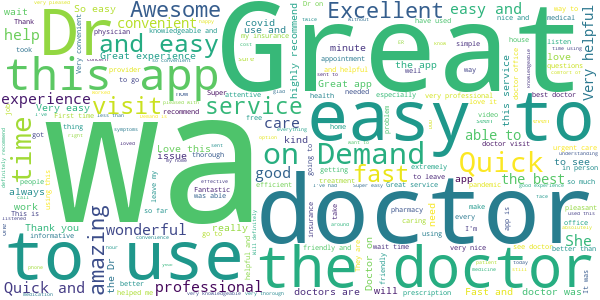
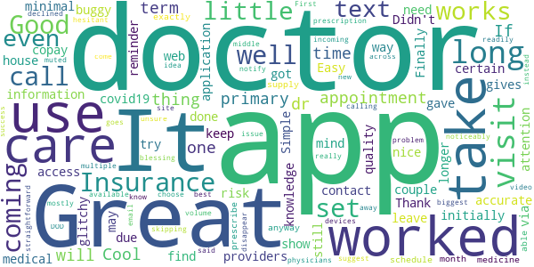
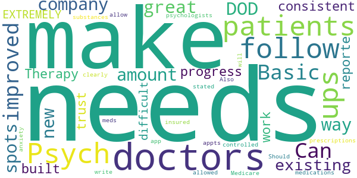
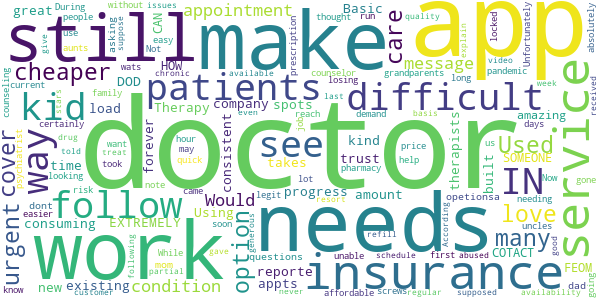
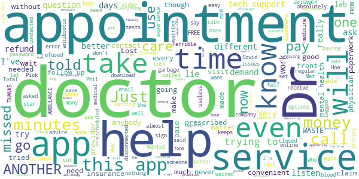

# Doctor On Demand
App version ``3.51.4``

Analyzed with [covid-apps-observer](http://github.com/covid-apps-observer) project, version ``0.1``

## App overview
| | |
|-------------------------|-------------------------| 
| **Name**&nbsp;&nbsp;&nbsp;&nbsp;&nbsp;&nbsp;&nbsp;&nbsp;&nbsp;&nbsp;&nbsp;&nbsp;&nbsp;&nbsp;&nbsp;&nbsp;&nbsp;&nbsp;&nbsp;&nbsp;&nbsp;&nbsp;&nbsp;&nbsp;&nbsp;&nbsp;&nbsp;&nbsp;&nbsp;&nbsp;&nbsp;&nbsp;&nbsp;&nbsp;&nbsp;&nbsp;&nbsp;&nbsp;&nbsp;&nbsp;  | Doctor On Demand |
| **Unique identifier** | com.doctorondemand.android.patient |
| **Link to Google Play** | [https://play.google.com/store/apps/details?id=com.doctorondemand.android.patient](https://play.google.com/store/apps/details?id=com.doctorondemand.android.patient) |
| **Summary**  | Live Video Visits with Board-Certified Physicians and Psychologists |
| **Privacy policy** | [https://www.doctorondemand.com/privacy-policies/site-privacy-policy](https://www.doctorondemand.com/privacy-policies/site-privacy-policy) |
| **Latest version** | 3.51.4 |
| **Last update** | 2020-11-29 04:06:11 |
| **Recent changes** | Thanks for choosing Doctor On Demand! We update our app regularly to improve performance and functionality to help you connect with our doctors and manage your health. |
| **Installs**  | 1,000,000+ |
| **Category** | Medical |
| **First release** | Oct 7, 2013 |
| **Size**  | 68M |
| **Supported Android version**  | 5.0 and up |

### Description
> Available when you are and without the hassle of the waiting room. Connect in minutes with board-certified physicians and doctoral-level therapists over live video. Just like an in-person visit, your doctor will take your history and symptoms, then will perform an exam.
 Some of examples of what we treat:
 - Cold & Flu
 - UTI
 - Allergies
 - Depression & Anxiety
 - Skin and Eye Issues
 - Urgent Care & more
 When are doctors available?
 Our doctors are available 24 hours a day, seven days a week. You can see a doctor immediately or schedule a visit at your convenience.
 Is insurance accepted?
 Our services are available with and without an insurance. We also partner with many top employers to reduce your cost.
 How much do visits cost?
 Doctor On Demand is open to everyone. See exactly what your visit will cost before you connect. There are no monthly fees.
 Can my other family members use this too?
 Our doctors can help your entire family - including kids. From medical to mental health, we’re available to make sure your family gets the care they need.
 This service is available in all 50 states and the District of Columbia.

### User interface
The developers of the app provide the following screenshots in the Google play store.
| | | |
|:-------------------------:|:-------------------------:|:-------------------------:|
 |   |   |   | 
 |   |   |   | 
 |   |   |   | 
 |  

## Development team
In the following we report the main information provided by the development team in the Google play store.

| | |
|-------------------------|-------------------------|
| **Developer**  | Doctor On Demand, Inc |
| **Website**  | [http://www.doctorondemand.com/contact](http://www.doctorondemand.com/contact) |
| **Email** | support@doctorondemand.com |
| **Physical address**  | - |
| **Other developed apps**  | [https://play.google.com/store/apps/developer?id=Doctor+On+Demand,+Inc](https://play.google.com/store/apps/developer?id=Doctor+On+Demand,+Inc) |

## Android support

| | |
|-------------------------|-------------------------|
| **Declared target Android version**  | Android10, version 10 (API level 29) |
| **Effective target Android version**  | Android10, version 10 (API level 29) |
| **Minimum supported Android version**  | Lollipop, version 5.0 (API level 21) |
| **Maximum target Android version**  | - |

The larger the difference between the minimum and maximum supported Android versions, the better. A larger difference means a wider audience. For example, old phones have a very low Android version, so a high minimum supported Android version means that the app cannot be used by users with old phones, thus leading to accessibility problems. 

## Requested permissions

In the following we report the complete list of the permissions requested by the app. 

| **Permission** | **Protection level** | **Description** | 
|-------------------------|-------------------------|-------------------------|
 **android.permission ACCESS_FINE_LOCATION** | :warning:**Dangerous** | Allows an app to access precise location. 
 **android.permission ACCESS_NETWORK_STATE** | Normal | Allows applications to access information about networks. 
 **android.permission ACCESS_WIFI_STATE** | Normal | Allows applications to access information about Wi-Fi networks. 
 **android.permission BLUETOOTH** | Normal | Allows applications to connect to paired bluetooth devices. 
 **android.permission CAMERA** | :warning:**Dangerous** | Required to be able to access the camera device. 
 **android.permission FOREGROUND_SERVICE** | Normal | Allows a regular application to use Service.startForeground. 
 **android.permission INTERNET** | Normal | Allows applications to open network sockets. 
 **android.permission MODIFY_AUDIO_SETTINGS** | Normal | Allows an application to modify global audio settings. 
 **android.permission READ_PROFILE** | - | - 
 **android.permission RECEIVE_BOOT_COMPLETED** | Normal | Allows an application to receive the Intent.ACTION_BOOT_COMPLETED that is broadcast after the system finishes booting. 
 **android.permission RECORD_AUDIO** | :warning:**Dangerous** | Allows an application to record audio. 
 **android.permission USE_BIOMETRIC** | Normal | Allows an app to use device supported biometric modalities. 
 **android.permission USE_FINGERPRINT** | Normal | This constant was deprecated in API level 28. Applications should request USE_BIOMETRIC instead 
 **android.permission VIBRATE** | Normal | Allows access to the vibrator. 
 **android.permission WAKE_LOCK** | Normal | Allows using PowerManager WakeLocks to keep processor from sleeping or screen from dimming. 
 **com.google.android.c2dm.permission RECEIVE** | - | - 
 **com.google.android.finsky.permission BIND_GET_INSTALL_REFERRER_SERVICE** | - | - 

## Mentioned servers

| **Server** | **Registrant** | **Registrant country** | **Creation date** | 
|-------------------------|-------------------------|-------------------------|-------------------------|
 | braintreegateway.com | PayPal Inc. | :us: US | 2009-10-06 23:05:33 |
 | doctorondemand.com | Doctor On Demand, Inc | :us: US | 2003-09-30 18:28:02 |
 | firebaseapp.com | Google LLC | :us: US | 2012-10-15 18:12:22 |
 | facebook.com | Facebook, Inc. | :us: US | 1997-03-29 05:00:00 |
 | google.com | Google LLC | :us: US | 1997-09-15 04:00:00 |
 | doubleclick.net | Google Inc. | :us: US | 1996-01-16 05:00:00 |
 | googleadservices.com | Google LLC | :us: US | 2003-06-19 16:34:53 |
 | googlesyndication.com | Google LLC | :us: US | 2003-01-21 06:17:24 |
 | adobe.com | Adobe Inc. | :us: US | 1986-11-17 05:00:00 |
 | amazonaws.com | Amazon.com, Inc. | :us: US | 2005-08-18 02:10:45 |
 | googleapis.com | Google LLC | :us: US | 2005-01-25 17:52:26 |
 | medium.com | Whois Privacy Service | :us: US | 1998-05-27 04:00:00 |
 | youtube.com | Google LLC | :us: US | 2005-02-15 05:13:12 |
 | app-measurement.com | Google LLC | :us: US | 2015-06-19 20:13:31 |
 | googleapis.com | Google LLC | :us: US | 2005-01-25 17:52:26 |
 | mixpanel.com | WhoisGuard, Inc. | PA | 2007-03-13 02:23:00 |
 | paypal.com | PayPal Inc. | :us: US | 1999-07-15 05:32:11 |
 | paypalobjects.com | PayPal Inc. | :us: US | 2005-05-12 17:11:21 |
 | crashlytics.com | Google LLC | :us: US | 2011-01-21 15:30:40 |

## Security analysis 

Below we report the main security warnings raised by our execution of the [Androwarn](https://github.com/maaaaz/androwarn) security analysis tool.

**Telephony identifiers leakage**
> - This application reads the MCC+MNC of the provider of the SIM 
> - This application reads the SIM's serial number 
> - This application reads the Service Provider Name (SPN) 
> - This application reads the constant indicating the state of the device SIM card 
> - This application reads the current location of the device 
> - This application reads the device phone type value 
> - This application reads the numeric name (MCC+MNC) of current registered operator 
> - This application reads the operator name 
> - This application reads the radio technology (network type) currently in use on the device for data transmission 
> - This application reads the unique device ID, i.e the IMEI for GSM and the MEID or ESN for CDMA phones 
> - This application reads the unique subscriber ID, for example, the IMSI for a GSM phone 
> - This application reads the Cell ID value 
> - This application reads the Location Area Code value 

**Location lookup**
> - This application reads location information from all available providers (WiFi, GPS etc.) 

**Connection interfaces exfiltration**
> - This application reads details about the currently active data network 
> - This application tries to find out if the currently active data network is metered 

**Telephony services abuse**
> - This application makes phone calls 

**Suspicious connection establishment**
> - This application opens a Socket and connects it to the remote address '' on the 'N/A' port  
> - This application opens a Socket and connects it to the remote address 'Ljava/lang/StringBuilder;->toString()Ljava/lang/String;' on the 'N/A' port  
> - This application opens a Socket and connects it to the remote address 'Ljava/net/Proxy;->type()Ljava/net/Proxy$Type;' on the 'N/A' port  
> - This application opens a Socket and connects it to the remote address 'timeout' on the 'N/A' port  

**Code execution**
> - This application loads a native library 
> - This application executes a UNIX command 
> - This application executes a UNIX command containing this argument: '' 

## User ratings and reviews

Below we provide information about how end users are reacting to the app in terms of ratings and reviews in the Google Play store.

### Ratings

The Doctor On Demand app has been installed by more than **1000000** times. At this time, **40688** rated the app and its average score is **4.8586745**. Below we show the distribution of the ratings across the usual star-based rating of Google Play

:star::star::star::star::star:: 38063

:star::star::star::star:: 1368

:star::star::star:: 237

:star::star:: 178

:star:: 842

### Reviews 

#### 5-star reviews

> Great app and service!  :date: __2020-12-13 15:57:40__

> Very nice! Spent $75, sent pictures of my issue, and video chatted with a doctor for 15 minutes. She sent a prescription to my local CVS, and I'm done. No sitting at Urgent Care, or ER for hours, and endangering my health.  :date: __2020-12-13 03:22:36__

> Easy to use  :date: __2020-12-13 00:18:06__

> I love that you don't have to leave your home and the doctor is nice and very fast responding.  :date: __2020-12-12 23:33:13__

> Great little app.  :date: __2020-12-12 21:29:26__

> Great doctors  :date: __2020-12-12 20:51:17__

> Used twice so far and for routine proble.s, extremely effective. Love it!  :date: __2020-12-12 18:09:17__

> Awesome experience.  :date: __2020-12-12 17:50:35__

> Awesome and kind doctors. Excellent, thorough care. Help getting answers. Top notch!  :date: __2020-12-12 16:18:17__

> Easy to use fast and helpful life saver during this pandemic!  :date: __2020-12-12 14:57:31__

#### 4-star reviews

> I guess its a great app Im just now learning about these Dr.Site Apps you can get a Dr. Over the web now and not have to go in. Before long they will have a scan system on your phone so they can scan your body and see everything. Before or so you dont go to hospitals. Hopefully in the near feuture they can also cure us at home too. Without touching us.  :date: __2020-12-12 02:40:24__

> Very helpful. Nice and friendly. Got most pending issue addressed. It was twice the price of a busy visit copay but I'm too sick to drive so it's worth it. Thanks!!  :date: __2020-12-11 23:15:40__

> App doesn't find Insurance providers or show accurate copay information initially. You may need to try couple of times.  :date: __2020-11-21 21:01:43__

> Good knowledge doctors  :date: __2020-11-21 17:33:03__

> Great  :date: __2020-11-19 23:19:45__

> It gives access to medical attention with minimal risk of coming in contact with covid19. Thank you for this app  :date: __2020-11-15 03:54:48__

> The application worked well for me. Simple to set up and use.  :date: __2020-11-10 17:41:45__

> Finally got it to take my insurance! The quality of care was great, call was a little glitchy.  :date: __2020-11-06 18:34:53__

> A little buggy, but still works well.  :date: __2020-11-04 16:53:52__

> Easy to use once your all set up, just keep in mind certain things take longer or can't be done via web due to the way it works!  :date: __2020-10-28 23:11:27__

#### 3-star reviews

> Great providers. But the app is not so good.  :date: __2020-12-12 01:48:33__

> Can be improved  :date: __2020-11-05 14:46:03__

> Psych will not allow appts for Medicare insured. Also, doctors are not allowed to write prescriptions for controlled substances such as anxiety meds or some psych medications. Should be clearly stated in app  :date: __2020-10-28 21:08:45__

#### 2-star reviews

> Basic needs are great... The DOD company needs to make it so the doctors only have X amount of spots for new patients and a way for existing patients to get their follow ups. Therapy doesn't work if it isn't consistent. A trust and reporte needs to be built to make progress. Its EXTREMELY difficult to get follow-ups with the therapists for kids any kind of kid appts are difficult to make. Using the app is time consuming. It takes forever to load. The doctors are amazing.  :date: __2020-12-11 16:56:32__

> HOW CAN I GET IN COTACT WITH SOMEONE FEOM THE APP, the questions there asking me some i have, my mom, dad, i dont see opetionsa for grandparents or aunts or uncles??? wats up with that. my conditions are know run in my family and all o want is help  :date: __2020-11-26 16:51:19__

> While Doctor on demand certainly is a lot cheaper than going to a psychiatrist or counselor, those services are still over $200 an hour. During a pandemic, when so many may be needing counseling services, many of us are also still locked down and unable to work, so that price is still out of our reach  :date: __2020-11-23 17:44:28__

> It was easy to use and quick to get my prescription to my pharmacy. Unfortunately it took way to long to get my doctor's note for work. It has been 3 days. If I don't have it soon, I risk losing my job, because I thought it was a legit, easier and cheaper option than urgent care.  :date: __2020-11-21 20:03:23__

> Not what I was looking for  :date: __2020-11-18 03:32:15__

> Used to love this app when it first came out. It was more affordable for people without insurance or insurance that didn't cover it, $45. Now I see they've gone up to $75 and my current insurance doesn't cover any of it.  :date: __2020-11-08 20:47:36__

> I absolutely love my doctor. What I DON'T like is that this app screws up appointment availability on a regular basis. They were supposed to message my doctor to explain that the app had no available appointments, which is why I couldn't schedule for the following week. My doctor never even received the message. There are also issues with video quality.  :date: __2020-11-05 15:52:37__

> According to what their customer service just told me, they are for urgent care ONLY. Would only give me a partial refill for a drug that can't be abused, and is used to treat a chronic condition. I suppose they would be a good option as a last resort, so I gave them a generous 2 stars.  :date: __2020-10-23 04:10:33__

#### 1-star reviews

> Missed my appointment 3 times apprentley even though I was on hold for 20 minutes I was chargerd $390!.. and when I finnley did get though to someone he prescribed me stuff that could've killed me when I demanded for a refund they refused becouse apprently the doctor had givein help. Are you trying to kill us? Uninstalled 1 star highly not recommended!..  :date: __2020-12-12 17:02:24__

> What a let down after seeing this advertised with Dr Phil. He swore absolutely no co-pay for anybody on Medicare. Lie, lie, lie!! cost me 40 bucks. Won't be using this app again  :date: __2020-12-09 07:26:50__

> They are not 24/7, I was waiting for video chat doctor and while they estimated time was >5 minutes I waited TEN with no answer, I then closed the app, came back and now I have to wait for an appointment to be able to talk to anybody? This is deceitful, and incongruous with the promotion that a doctor is available 24/7. That is a lie  :date: __2020-12-04 12:07:17__

> Absolutely horrible damn app won't even let me get through the registration process to see a doctor every app I've downloaded has been complete garbage especially this one  :date: __2020-12-03 12:45:28__

> Good luck...Getting a dr to listen to you is hard and then they take your money even if they do nothing for you. I will NEVER use them again!!!  :date: __2020-12-02 15:57:59__

> I don't like them anymore. It's like a Lyft or Uber driver and the Drs. Are there to receive whoever is paying. They DON'T really care.............. It's PLENTY of other options out there. DON'T even bother.  :date: __2020-12-02 03:24:31__

> I can't get connected. I need psych sessions  :date: __2020-12-01 05:41:10__

> I selected a lab for testing that was closest to me and went there, turns out the location had been closed for almost 5 months, according to the building's front desk. I took time off work, spent money on transport, and unnecessarily exposed myself to Covid for a shockingly simple error on their part.  :date: __2020-11-30 21:59:22__

> She didn't listen to me.CALL AMBULANCE.. Your havingaheartattack. . I have had this many times.. wanted her thoughts.. she wouldn't listen to me .her answer was Call The Ambulance immediately!!! It would be different if I didn't know what was going on.. I needed advice... I wasn't having a heart attack.. you really should LISTEN... sorry but I did not like this person at all!!!  :date: __2020-11-29 01:38:46__

> I screwed up and missed my first appointment and now all the money I had left is gone! You'd think an app like this would have some forgiveness and compassion for people looking for help. Total garbage  :date: __2020-11-27 20:44:19__

