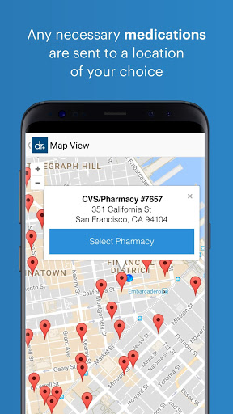
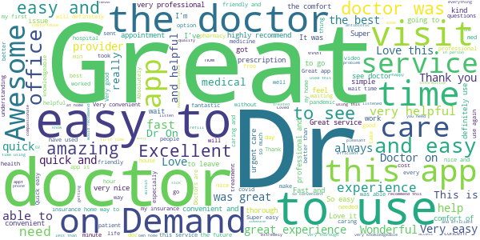

# Doctor On Demand
App version ``3.52.0``

Analyzed with [covid-apps-observer](http://github.com/covid-apps-observer) project, version ``0.1``

## App overview
| | |
|-------------------------|-------------------------| 
| **Name**&nbsp;&nbsp;&nbsp;&nbsp;&nbsp;&nbsp;&nbsp;&nbsp;&nbsp;&nbsp;&nbsp;&nbsp;&nbsp;&nbsp;&nbsp;&nbsp;&nbsp;&nbsp;&nbsp;&nbsp;&nbsp;&nbsp;&nbsp;&nbsp;&nbsp;&nbsp;&nbsp;&nbsp;&nbsp;&nbsp;&nbsp;&nbsp;&nbsp;&nbsp;&nbsp;&nbsp;&nbsp;&nbsp;&nbsp;&nbsp;  | Doctor On Demand |
| **Unique identifier** | com.doctorondemand.android.patient |
| **Link to Google Play** | [https://play.google.com/store/apps/details?id=com.doctorondemand.android.patient](https://play.google.com/store/apps/details?id=com.doctorondemand.android.patient) |
| **Summary**  | Live Video Visits with Board-Certified Physicians and Psychologists |
| **Privacy policy** | [https://www.doctorondemand.com/privacy-policies/site-privacy-policy](https://www.doctorondemand.com/privacy-policies/site-privacy-policy) |
| **Latest version** | 3.52.0 |
| **Last update** | 2020-12-15 03:53:47 |
| **Recent changes** | Thanks for choosing Doctor On Demand! We update our app regularly to improve performance and functionality to help you connect with our doctors and manage your health. |
| **Installs**  | 1,000,000+ |
| **Category** | Medical |
| **First release** | Oct 7, 2013 |
| **Size**  | 68M |
| **Supported Android version**  | 5.0 and up |

### Description
> Available when you are and without the hassle of the waiting room. Connect in minutes with board-certified physicians and doctoral-level therapists over live video. Just like an in-person visit, your doctor will take your history and symptoms, then will perform an exam.
 Some of examples of what we treat:
 - Cold & Flu
 - UTI
 - Allergies
 - Depression & Anxiety
 - Skin and Eye Issues
 - Urgent Care & more
 When are doctors available?
 Our doctors are available 24 hours a day, seven days a week. You can see a doctor immediately or schedule a visit at your convenience.
 Is insurance accepted?
 Our services are available with and without an insurance. We also partner with many top employers to reduce your cost.
 How much do visits cost?
 Doctor On Demand is open to everyone. See exactly what your visit will cost before you connect. There are no monthly fees.
 Can my other family members use this too?
 Our doctors can help your entire family - including kids. From medical to mental health, we’re available to make sure your family gets the care they need.
 This service is available in all 50 states and the District of Columbia.

### User interface
The developers of the app provide the following screenshots in the Google play store.
| | | |
|:-------------------------:|:-------------------------:|:-------------------------:|
 |   |   |   | 
 |   |   |   | 
 |   |   |   | 
 |  

## Development team
In the following we report the main information provided by the development team in the Google play store.

| | |
|-------------------------|-------------------------|
| **Developer**  | Doctor On Demand, Inc |
| **Website**  | [http://www.doctorondemand.com/contact](http://www.doctorondemand.com/contact) |
| **Email** | support@doctorondemand.com |
| **Physical address**  | - |
| **Other developed apps**  | [https://play.google.com/store/apps/developer?id=Doctor+On+Demand,+Inc](https://play.google.com/store/apps/developer?id=Doctor+On+Demand,+Inc) |

## Android support

| | |
|-------------------------|-------------------------|
| **Declared target Android version**  | Android10, version 10 (API level 29) |
| **Effective target Android version**  | Android10, version 10 (API level 29) |
| **Minimum supported Android version**  | Lollipop, version 5.0 (API level 21) |
| **Maximum target Android version**  | - |

The larger the difference between the minimum and maximum supported Android versions, the better. A larger difference means a wider audience. For example, old phones have a very low Android version, so a high minimum supported Android version means that the app cannot be used by users with old phones, thus leading to accessibility problems. 

## Requested permissions

In the following we report the complete list of the permissions requested by the app. 

| **Permission** | **Protection level** | **Description** | 
|-------------------------|-------------------------|-------------------------|
 **android.permission ACCESS_FINE_LOCATION** | :warning:**Dangerous** | Allows an app to access precise location. 
 **android.permission ACCESS_NETWORK_STATE** | Normal | Allows applications to access information about networks. 
 **android.permission ACCESS_WIFI_STATE** | Normal | Allows applications to access information about Wi-Fi networks. 
 **android.permission BLUETOOTH** | Normal | Allows applications to connect to paired bluetooth devices. 
 **android.permission CAMERA** | :warning:**Dangerous** | Required to be able to access the camera device. 
 **android.permission FOREGROUND_SERVICE** | Normal | Allows a regular application to use Service.startForeground. 
 **android.permission INTERNET** | Normal | Allows applications to open network sockets. 
 **android.permission MODIFY_AUDIO_SETTINGS** | Normal | Allows an application to modify global audio settings. 
 **android.permission READ_PROFILE** | - | - 
 **android.permission RECEIVE_BOOT_COMPLETED** | Normal | Allows an application to receive the Intent.ACTION_BOOT_COMPLETED that is broadcast after the system finishes booting. 
 **android.permission RECORD_AUDIO** | :warning:**Dangerous** | Allows an application to record audio. 
 **android.permission USE_BIOMETRIC** | Normal | Allows an app to use device supported biometric modalities. 
 **android.permission USE_FINGERPRINT** | Normal | This constant was deprecated in API level 28. Applications should request USE_BIOMETRIC instead 
 **android.permission VIBRATE** | Normal | Allows access to the vibrator. 
 **android.permission WAKE_LOCK** | Normal | Allows using PowerManager WakeLocks to keep processor from sleeping or screen from dimming. 
 **com.google.android.c2dm.permission RECEIVE** | - | - 
 **com.google.android.finsky.permission BIND_GET_INSTALL_REFERRER_SERVICE** | - | - 

## Mentioned servers

| **Server** | **Registrant** | **Registrant country** | **Creation date** | 
|-------------------------|-------------------------|-------------------------|-------------------------|
 | braintreegateway.com | PayPal Inc. | :us: US | 2009-10-06 23:05:33 |
 | doctorondemand.com | Doctor On Demand, Inc | :us: US | 2003-09-30 18:28:02 |
 | firebaseapp.com | Google LLC | :us: US | 2012-10-15 18:12:22 |
 | facebook.com | Facebook, Inc. | :us: US | 1997-03-29 05:00:00 |
 | google.com | Google LLC | :us: US | 1997-09-15 04:00:00 |
 | doubleclick.net | Google Inc. | :us: US | 1996-01-16 05:00:00 |
 | googleadservices.com | Google LLC | :us: US | 2003-06-19 16:34:53 |
 | googlesyndication.com | Google LLC | :us: US | 2003-01-21 06:17:24 |
 | adobe.com | Adobe Inc. | :us: US | 1986-11-17 05:00:00 |
 | amazonaws.com | Amazon.com, Inc. | :us: US | 2005-08-18 02:10:45 |
 | medium.com | Whois Privacy Service | :us: US | 1998-05-27 04:00:00 |
 | youtube.com | Google LLC | :us: US | 2005-02-15 05:13:12 |
 | googleapis.com | Google LLC | :us: US | 2005-01-25 17:52:26 |
 | app-measurement.com | Google LLC | :us: US | 2015-06-19 20:13:31 |
 | googleapis.com | Google LLC | :us: US | 2005-01-25 17:52:26 |
 | mixpanel.com | WhoisGuard, Inc. | PA | 2007-03-13 02:23:00 |
 | paypal.com | PayPal Inc. | :us: US | 1999-07-15 05:32:11 |
 | paypalobjects.com | PayPal Inc. | :us: US | 2005-05-12 17:11:21 |
 | crashlytics.com | Google LLC | :us: US | 2011-01-21 15:30:40 |

## Security analysis 

Below we report the main security warnings raised by our execution of the [Androwarn](https://github.com/maaaaz/androwarn) security analysis tool.

**Telephony identifiers leakage**
> - This application reads the MCC+MNC of the provider of the SIM 
> - This application reads the SIM's serial number 
> - This application reads the Service Provider Name (SPN) 
> - This application reads the constant indicating the state of the device SIM card 
> - This application reads the current location of the device 
> - This application reads the device phone type value 
> - This application reads the numeric name (MCC+MNC) of current registered operator 
> - This application reads the operator name 
> - This application reads the radio technology (network type) currently in use on the device for data transmission 
> - This application reads the unique device ID, i.e the IMEI for GSM and the MEID or ESN for CDMA phones 
> - This application reads the unique subscriber ID, for example, the IMSI for a GSM phone 
> - This application reads the Cell ID value 
> - This application reads the Location Area Code value 

**Location lookup**
> - This application reads location information from all available providers (WiFi, GPS etc.) 

**Connection interfaces exfiltration**
> - This application reads details about the currently active data network 
> - This application tries to find out if the currently active data network is metered 

**Telephony services abuse**
> - This application makes phone calls 

**Suspicious connection establishment**
> - This application opens a Socket and connects it to the remote address '' on the 'N/A' port  
> - This application opens a Socket and connects it to the remote address 'Ljava/lang/StringBuilder;->toString()Ljava/lang/String;' on the 'N/A' port  
> - This application opens a Socket and connects it to the remote address 'Ljava/net/Proxy;->type()Ljava/net/Proxy$Type;' on the 'N/A' port  
> - This application opens a Socket and connects it to the remote address 'timeout' on the 'N/A' port  

**Code execution**
> - This application loads a native library 
> - This application executes a UNIX command 
> - This application executes a UNIX command containing this argument: '' 

## User ratings and reviews

Below we provide information about how end users are reacting to the app in terms of ratings and reviews in the Google Play store.

### Ratings

The Doctor On Demand app has been installed by more than **1000000** times. At this time, **41331** rated the app and its average score is **4.8532023**. Below we show the distribution of the ratings across the usual star-based rating of Google Play

:star::star::star::star::star:: 38686

:star::star::star::star:: 1308

:star::star::star:: 208

:star::star:: 178

:star:: 951

### Reviews 

#### 5-star reviews

> Dr. Singh is a great doctor! She’s very understanding and listens to your concerns. She takes her time to help you with your health issue! I highly recommend her!!  :date: __2021-01-23 05:22:34__

> The doctor I got was amazing! Very personable and I felt very comfortable opening up to her!  :date: __2021-01-23 04:47:27__

> First time user, very easy.  :date: __2021-01-23 04:44:29__

> Very useful app during these social distancing times.  :date: __2021-01-23 04:21:23__

> Quick, easy, awesome. Doctor was great!  :date: __2021-01-23 04:17:56__

> I love this! Great to be able to get what you need from anywhere, anytime and not wait weeks out for an appointment. Highly recommended.  :date: __2021-01-23 03:03:38__

> Very easy to use  :date: __2021-01-23 01:55:34__

> Super convenient  :date: __2021-01-23 01:05:53__

> Quick and easy.  :date: __2021-01-22 23:49:35__

> Extremely disappointed. My antibiotic prescription was lost out of state. Called customer service. Had someone assisting me with getting a refill. Got disconnected. Called back and now they tell me they cant help me unless I pay another 75$ dollars for a visit. My transmission just went out and I have to go into debt paying 2800$ and the customer service for Doctor on demand isnt helping at all  :date: __2021-01-22 23:24:42__

#### 4-star reviews

> Interesting, knowledgable & friendly.  :date: __2021-01-20 00:04:55__

> It is fi.e bit Doctors are limited  :date: __2021-01-19 00:45:44__

> A little laggy  :date: __2021-01-16 17:04:05__

> Very easy to use  :date: __2021-01-15 22:47:07__

> App has shown much improvement since its first release. It was initially clunky and broken in places, but now it works smoothly and I was able to see a doctor relatively quickly.  :date: __2021-01-13 19:50:29__

> Great  :date: __2021-01-13 04:53:28__

> Once able to get to the provider. Very efficient. Now the process to get there needs some work. If I was able to rate each aspect. The app would get 1.5 stars. And the Dr. 5 stars.  :date: __2021-01-10 03:24:51__

> Each time I have used the app, I have had a positive experience. All of the physicians I have seen this past year were very attentive, nice, and answered my questions. I just wish there was a better way to followup with the doctor regarding questions and prescriptions.  :date: __2021-01-06 01:11:45__

> Besides the expensive co-pay cost, good care.  :date: __2021-01-04 01:13:58__

> Very helpful info  :date: __2021-01-01 01:21:01__

#### 3-star reviews

> The doctors are fabulous. However their lack of ability of tec support and processing insurance is not good.  :date: __2021-01-22 01:24:14__

> Limiting treatment options and appointment options.  :date: __2021-01-12 19:15:09__

> Nice and safe way to check symptoms before going in to ER.  :date: __2021-01-09 03:28:42__

> While I like the convenience of this platform, it is UNACCEPTABLE that I have been cut off at the 15 minute mark, while the doctor is still talking to me! This has been twice! I have no idea what she is going to do and I have no time to ask questions at all! Its my health! I am definitely considering going back to the office, if possible as this is really unethical.  :date: __2021-01-04 18:34:00__

> Pretty good but couldn't contact Tricare  :date: __2020-12-27 10:37:31__

> This app is great if you need a therapy session or a prescription refill, but if you're actually seeking medical advice, this is probably not your app. I've tried 2 doctors through this app and all both wanted to do was rush me through (neither $75 appt lasted more than 7 minutes) and wrote me a prescription. The doctors in this network are probably just starting their residencies, so they don't have enough experience to do anything more than hand out pills and referrals to real doctors.  :date: __2020-12-23 17:38:00__

> Great providers. But the app is not so good.  :date: __2020-12-12 01:48:33__

#### 2-star reviews

> Not a good fit for the care I need.  :date: __2021-01-08 16:51:08__

> Basic needs are great... The DOD company needs to make it so the doctors only have X amount of spots for new patients and a way for existing patients to get their follow ups. Therapy doesn't work if it isn't consistent. A trust and reporte needs to be built to make progress. Its EXTREMELY difficult to get follow-ups with the therapists for kids any kind of kid appts are difficult to make. Using the app is time consuming. It takes forever to load. The doctors are amazing.  :date: __2020-12-11 16:56:32__

> HOW CAN I GET IN COTACT WITH SOMEONE FEOM THE APP, the questions there asking me some i have, my mom, dad, i dont see opetionsa for grandparents or aunts or uncles??? wats up with that. my conditions are know run in my family and all o want is help  :date: __2020-11-26 16:51:19__

#### 1-star reviews

> Forces you to give up your location data even if you're going the telehealth route. Completely useless app.  :date: __2021-01-22 15:28:35__

> I made 4 appointments in advance immediately after my first session, and none of them are there. I showed up for my next appointment and there's nothing to show up to. None of the dates are available anymore. I'm extremely upset over this, I have a short time frame I can get this done and now I may have to change my therapist because he is booked.  :date: __2021-01-22 15:24:37__

> Not helpful at all... just recomed you covid test for any and all symptoms.  :date: __2021-01-22 03:14:14__

> HORRIBLE exp. with this app. Took 2 hrs and 4 different tries to register then "5-10" minute wait was actually 80. Bug in app twice reset several things on my phone including disabling my keyboard. 2 hrs from start the Dr. came on but couldn't see or hear me. Rescheduled 4 hours later. Dr. was professional but failed to send rx for antibiotics she said I needed. Finally, I left a negative review yesterday and it's missing and I'm still repairing bug damage. DO NOT BELIEVE THE HIGH RATING.  :date: __2021-01-21 19:28:39__

> Good luck entering your insurance information in. I've had to actually call the company every time because the app isn't capable of basic data entry.  :date: __2021-01-19 19:22:27__

> Made an appointment only for the doctor to tell me I'm the last 5 minutes that they can't help me with what I had made the appointment for and denied a refund. They can scam you if they really want to.  :date: __2021-01-19 15:34:18__

> Does not work as described.  :date: __2021-01-18 05:21:03__

> Trash. After complete register and asking 100 questions they want 75 dollars just to talk to someone.  :date: __2021-01-17 19:58:54__

> I paid $75 to see a doctor and was told to go see a doctor in person, when I asked for a refund they said they could not since they provided clinical advance since they advised me te go see a doctor in person  :date: __2021-01-17 18:17:32__

> PRICE RAPE  :date: __2021-01-17 13:26:10__

