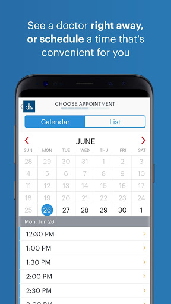
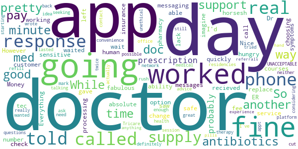
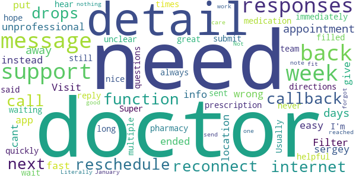
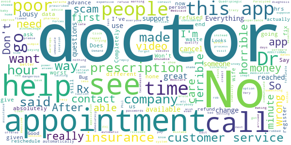

# Doctor On Demand
App version ``3.52.0``

Analyzed with [covid-apps-observer](http://github.com/covid-apps-observer) project, version ``0.1``

## App overview
| | |
|-------------------------|-------------------------| 
| **Name**                                          | Doctor On Demand |
| **Unique identifier** | com.doctorondemand.android.patient |
| **Link to Google Play** | [https://play.google.com/store/apps/details?id=com.doctorondemand.android.patient](https://play.google.com/store/apps/details?id=com.doctorondemand.android.patient) |
| **Summary**  | Live Video Visits with Board-Certified Physicians and Psychologists |
| **Privacy policy** | [https://www.doctorondemand.com/privacy-policies/site-privacy-policy](https://www.doctorondemand.com/privacy-policies/site-privacy-policy) |
| **Latest version** | 3.52.0 |
| **Last update** | 2020-12-15 03:53:47 |
| **Recent changes** | Thanks for choosing Doctor On Demand! We update our app regularly to improve performance and functionality to help you connect with our doctors and manage your health. |
| **Installs**  | 1,000,000+ |
| **Category** | Medical |
| **First release** | Oct 7, 2013 |
| **Size**  | 68M |
| **Supported Android version**  | 5.0 and up |

### Description
> Available when you are and without the hassle of the waiting room. Connect in minutes with board-certified physicians and doctoral-level therapists over live video. Just like an in-person visit, your doctor will take your history and symptoms, then will perform an exam.
 Some of examples of what we treat:
 - Cold & Flu
 - UTI
 - Allergies
 - Depression & Anxiety
 - Skin and Eye Issues
 - Urgent Care & more
 When are doctors available?
 Our doctors are available 24 hours a day, seven days a week. You can see a doctor immediately or schedule a visit at your convenience.
 Is insurance accepted?
 Our services are available with and without an insurance. We also partner with many top employers to reduce your cost.
 How much do visits cost?
 Doctor On Demand is open to everyone. See exactly what your visit will cost before you connect. There are no monthly fees.
 Can my other family members use this too?
 Our doctors can help your entire family - including kids. From medical to mental health, we’re available to make sure your family gets the care they need.
 This service is available in all 50 states and the District of Columbia.

### User interface
The developers of the app provide the following screenshots in the Google play store.
| | | |
|:-------------------------:|:-------------------------:|:-------------------------:|
 |   |   |   | 
 |   |   |   | 
 |   |   |   | 
 |  

## Development team
In the following we report the main information provided by the development team in the Google play store.

| | |
|-------------------------|-------------------------|
| **Developer**  | Doctor On Demand, Inc |
| **Website**  | [http://www.doctorondemand.com/contact](http://www.doctorondemand.com/contact) |
| **Email** | support@doctorondemand.com |
| **Physical address**  | - |
| **Other developed apps**  | [https://play.google.com/store/apps/developer?id=Doctor+On+Demand,+Inc](https://play.google.com/store/apps/developer?id=Doctor+On+Demand,+Inc) |

## Android support

| | |
|-------------------------|-------------------------|
| **Declared target Android version**  | Android10, version 10 (API level 29) |
| **Effective target Android version**  | Android10, version 10 (API level 29) |
| **Minimum supported Android version**  | Lollipop, version 5.0 (API level 21) |
| **Maximum target Android version**  | - |

The larger the difference between the minimum and maximum supported Android versions, the better. A larger difference means a wider audience. For example, old phones have a very low Android version, so a high minimum supported Android version means that the app cannot be used by users with old phones, thus leading to accessibility problems. 

## Requested permissions

In the following we report the complete list of the permissions requested by the app. 

| **Permission** | **Protection level** | **Description** | 
|-------------------------|-------------------------|-------------------------|
 **android.permission ACCESS_FINE_LOCATION** | :warning:**Dangerous** | Allows an app to access precise location. 
 **android.permission ACCESS_NETWORK_STATE** | Normal | Allows applications to access information about networks. 
 **android.permission ACCESS_WIFI_STATE** | Normal | Allows applications to access information about Wi-Fi networks. 
 **android.permission BLUETOOTH** | Normal | Allows applications to connect to paired bluetooth devices. 
 **android.permission CAMERA** | :warning:**Dangerous** | Required to be able to access the camera device. 
 **android.permission FOREGROUND_SERVICE** | Normal | Allows a regular application to use Service.startForeground. 
 **android.permission INTERNET** | Normal | Allows applications to open network sockets. 
 **android.permission MODIFY_AUDIO_SETTINGS** | Normal | Allows an application to modify global audio settings. 
 **android.permission READ_PROFILE** | - | - 
 **android.permission RECEIVE_BOOT_COMPLETED** | Normal | Allows an application to receive the Intent.ACTION_BOOT_COMPLETED that is broadcast after the system finishes booting. 
 **android.permission RECORD_AUDIO** | :warning:**Dangerous** | Allows an application to record audio. 
 **android.permission USE_BIOMETRIC** | Normal | Allows an app to use device supported biometric modalities. 
 **android.permission USE_FINGERPRINT** | Normal | This constant was deprecated in API level 28. Applications should request USE_BIOMETRIC instead 
 **android.permission VIBRATE** | Normal | Allows access to the vibrator. 
 **android.permission WAKE_LOCK** | Normal | Allows using PowerManager WakeLocks to keep processor from sleeping or screen from dimming. 
 **com.google.android.c2dm.permission RECEIVE** | - | - 
 **com.google.android.finsky.permission BIND_GET_INSTALL_REFERRER_SERVICE** | - | - 

## Mentioned servers

| **Server** | **Registrant** | **Registrant country** | **Creation date** | 
|-------------------------|-------------------------|-------------------------|-------------------------|
 | braintreegateway.com | PayPal Inc. | :us: US | 2009-10-06 23:05:33 |
 | doctorondemand.com | Doctor On Demand, Inc | :us: US | 2003-09-30 18:28:02 |
 | firebaseapp.com | Google LLC | :us: US | 2012-10-15 18:12:22 |
 | facebook.com | Facebook, Inc. | :us: US | 1997-03-29 05:00:00 |
 | google.com | Google LLC | :us: US | 1997-09-15 04:00:00 |
 | doubleclick.net | Google Inc. | :us: US | 1996-01-16 05:00:00 |
 | googleadservices.com | Google LLC | :us: US | 2003-06-19 16:34:53 |
 | googlesyndication.com | Google LLC | :us: US | 2003-01-21 06:17:24 |
 | adobe.com | Adobe Inc. | :us: US | 1986-11-17 05:00:00 |
 | amazonaws.com | Amazon.com, Inc. | :us: US | 2005-08-18 02:10:45 |
 | medium.com | Whois Privacy Service | :us: US | 1998-05-27 04:00:00 |
 | youtube.com | Google LLC | :us: US | 2005-02-15 05:13:12 |
 | googleapis.com | Google LLC | :us: US | 2005-01-25 17:52:26 |
 | app-measurement.com | Google LLC | :us: US | 2015-06-19 20:13:31 |
 | googleapis.com | Google LLC | :us: US | 2005-01-25 17:52:26 |
 | mixpanel.com | WhoisGuard, Inc. | PA | 2007-03-13 02:23:00 |
 | paypal.com | PayPal Inc. | :us: US | 1999-07-15 05:32:11 |
 | paypalobjects.com | PayPal Inc. | :us: US | 2005-05-12 17:11:21 |
 | crashlytics.com | Google LLC | :us: US | 2011-01-21 15:30:40 |

## Security analysis 

Below we report the main security warnings raised by our execution of the [Androwarn](https://github.com/maaaaz/androwarn) security analysis tool.

**Telephony identifiers leakage**
> - This application reads the MCC+MNC of the provider of the SIM 
> - This application reads the SIM's serial number 
> - This application reads the Service Provider Name (SPN) 
> - This application reads the constant indicating the state of the device SIM card 
> - This application reads the current location of the device 
> - This application reads the device phone type value 
> - This application reads the numeric name (MCC+MNC) of current registered operator 
> - This application reads the operator name 
> - This application reads the radio technology (network type) currently in use on the device for data transmission 
> - This application reads the unique device ID, i.e the IMEI for GSM and the MEID or ESN for CDMA phones 
> - This application reads the unique subscriber ID, for example, the IMSI for a GSM phone 
> - This application reads the Cell ID value 
> - This application reads the Location Area Code value 

**Location lookup**
> - This application reads location information from all available providers (WiFi, GPS etc.) 

**Connection interfaces exfiltration**
> - This application reads details about the currently active data network 
> - This application tries to find out if the currently active data network is metered 

**Telephony services abuse**
> - This application makes phone calls 

**Suspicious connection establishment**
> - This application opens a Socket and connects it to the remote address '' on the 'N/A' port  
> - This application opens a Socket and connects it to the remote address 'Ljava/lang/StringBuilder;->toString()Ljava/lang/String;' on the 'N/A' port  
> - This application opens a Socket and connects it to the remote address 'Ljava/net/Proxy;->type()Ljava/net/Proxy$Type;' on the 'N/A' port  
> - This application opens a Socket and connects it to the remote address 'timeout' on the 'N/A' port  

**Code execution**
> - This application loads a native library 
> - This application executes a UNIX command 
> - This application executes a UNIX command containing this argument: '' 

## User ratings and reviews

Below we provide information about how end users are reacting to the app in terms of ratings and reviews in the Google Play store.

### Ratings

The Doctor On Demand app has been installed by more than **1000000** times. At this time, **41331** rated the app and its average score is **4.8532023**. Below we show the distribution of the ratings across the usual star-based rating of Google Play

:star::star::star::star::star:: 38686

:star::star::star::star:: 1308

:star::star::star:: 208

:star::star:: 178

:star:: 951

### Reviews 

#### 5-star reviews

> Doctor on Demand is as good, if not better than, my primary care provider who wouldn't care for me because I hadn't had my initial patient visit. The doctors I've seen have been caring, timely and very helpful.  :date: __2021-01-03 08:22:44__

> My two experiences with the app have both been great. I know people are in front of me and it takes a lot longer to reach medical provider but this is better than going out. They really get to see candid atmosphere and see things happen live.  :date: __2021-01-03 06:14:11__

> Wonderful  :date: __2021-01-03 04:26:35__

> Phenomenal!! Modern day medicine and a way to see a doctor and get your meds.. Dr on Demand app!! I highly recommend it! The doctor I saw was fantastic she was amazing! With throbbing tooth pain (late at night) she didnt make me wait forever and had my antibiotics called in to a 24hr pharmacy in minutes! What else can you ask for?! With tooth pain.. you don't have a tolerance for anything let alone waiting time. Thanks dr On Demand!  :date: __2021-01-03 04:14:18__

> Love how you can be seen and treated at home without having to go too many places when feeling sick! All the doctors I've seen are great and thorough in diagnosing you and sending prescriptions to your preferred pharmacy fast to get treatment.  :date: __2021-01-03 03:41:37__

> Exceptional  :date: __2021-01-03 03:14:46__

> Very professional  :date: __2021-01-02 23:31:59__

> So nice to have as an option.  :date: __2021-01-02 23:25:55__

> Amazing  :date: __2021-01-02 23:11:38__

> Incredible! Really! Dr+ is a Godsend and has made it much easier to get the medical treatment I need. I live in a rural area with few doctor's which often makes appointments hard to come by witbout being very ill. I look forward to continuing to use this platform. It is so easy to navigate and keeps you updated all the way through your appointment making it easy to keep up with visits that may otherwise be forgotten about. Thank you Dr+! Truly, thank you!  :date: __2021-01-02 23:10:10__

#### 4-star reviews

> Very helpful info  :date: __2021-01-01 01:21:01__

> My first visit was years ago and it was ok, but I'm not a fan of telemedicine. The 2nd was disconnected before it even got started, so I went back in and set up a same day appointment. Third times a charm. Although I'm still not a fan of telemedicine, it is better than urgent care or emergency room in non-emergency situations.  :date: __2020-12-30 22:27:21__

> Good  :date: __2020-12-24 19:08:19__

> So far so good. I am still waiting for a good general physician.  :date: __2020-12-24 17:16:03__

> Beside the low volume we had no other issues.  :date: __2020-12-20 12:49:54__

> Dr sarah was awesome. Support is slow to response online, and instead to sort out why pharmacy didn't received prescription, they just asked to wait few hours, which didn't resolve issue. They are responsive and helpful on phone call. Issue was at CVS pharmacy.  :date: __2020-12-19 02:05:35__

> Great doctor but glitchy video.  :date: __2020-12-18 21:16:15__

> Amazing. Fast. Free.  :date: __2020-12-16 17:59:29__

> Good i hope meds help  :date: __2020-12-16 06:32:17__

> Wonderful insight and caring ways.  :date: __2020-12-14 18:53:59__

#### 3-star reviews

> Pretty good but couldn't contact Tricare  :date: __2020-12-27 10:37:31__

> This app is great if you need a therapy session or a prescription refill, but if you're actually seeking medical advice, this is probably not your app. I've tried 2 doctors through this app and all both wanted to do was rush me through (neither $75 appt lasted more than 7 minutes) and wrote me a prescription. The doctors in this network are probably just starting their residencies, so they don't have enough experience to do anything more than hand out pills and referrals to real doctors.  :date: __2020-12-23 17:38:00__

> Great providers. But the app is not so good.  :date: __2020-12-12 01:48:33__

> Can be improved  :date: __2020-11-05 14:46:03__

#### 2-star reviews

> Basic needs are great... The DOD company needs to make it so the doctors only have X amount of spots for new patients and a way for existing patients to get their follow ups. Therapy doesn't work if it isn't consistent. A trust and reporte needs to be built to make progress. Its EXTREMELY difficult to get follow-ups with the therapists for kids any kind of kid appts are difficult to make. Using the app is time consuming. It takes forever to load. The doctors are amazing.  :date: __2020-12-11 16:56:32__

> HOW CAN I GET IN COTACT WITH SOMEONE FEOM THE APP, the questions there asking me some i have, my mom, dad, i dont see opetionsa for grandparents or aunts or uncles??? wats up with that. my conditions are know run in my family and all o want is help  :date: __2020-11-26 16:51:19__

> While Doctor on demand certainly is a lot cheaper than going to a psychiatrist or counselor, those services are still over $200 an hour. During a pandemic, when so many may be needing counseling services, many of us are also still locked down and unable to work, so that price is still out of our reach  :date: __2020-11-23 17:44:28__

> It was easy to use and quick to get my prescription to my pharmacy. Unfortunately it took way to long to get my doctor's note for work. It has been 3 days. If I don't have it soon, I risk losing my job, because I thought it was a legit, easier and cheaper option than urgent care.  :date: __2020-11-21 20:03:23__

> Not what I was looking for  :date: __2020-11-18 03:32:15__

> Used to love this app when it first came out. It was more affordable for people without insurance or insurance that didn't cover it, $45. Now I see they've gone up to $75 and my current insurance doesn't cover any of it.  :date: __2020-11-08 20:47:36__

> I absolutely love my doctor. What I DON'T like is that this app screws up appointment availability on a regular basis. They were supposed to message my doctor to explain that the app had no available appointments, which is why I couldn't schedule for the following week. My doctor never even received the message. There are also issues with video quality.  :date: __2020-11-05 15:52:37__

#### 1-star reviews

> No connection  :date: __2021-01-03 07:56:50__

> I had to cancel my appointment due to an emergency 17 hours before the time I had scheduled. I wasn't able to reschedule it because they have a 24 hour rule and thats completely understandable. Except for the fact they'll still charge me $300 for an appointment I couldn't make or reschedule and now I can't afford to see a doctor at all. What a way to ring in 2021.  :date: __2021-01-02 00:27:28__

> Terrible absolutely ridiculous! Received no help at all! I will never use this app again! If I could of not given any stars to post this I would of.  :date: __2021-01-01 05:30:26__

> All they want is your CC# when your insurance company covers everything this is a SCAM!!!?  :date: __2020-12-31 19:29:22__

> Terrible. I made 2 appointments today. The first was ended automatically as soon as it started with no reason. The 2nd I waited for 15 minutes to then get connected with black video screen to then have that end automatically too. Waste of time. Not sure if there are better alternatives, but anything must be better than this. Especially if you value your time.  :date: __2020-12-29 02:03:43__

> Multiple cancellations without notice by different doctors  :date: __2020-12-22 21:23:27__

> If you choose to have Dr.Kamra Mays as your therapist, be prepared to have your appointment cancelled 3 minutes before your session with no explanation. No phone call. No text. Nothing. Not only is this unprofessional, its inconsiderate. If you do chose to use this app, avoid Dr.Kamra May's.  :date: __2020-12-22 00:33:06__

> Be aware that you run the risk of not getting a diagnosis. You will still pay for advice that isn't helpful to your problem...  :date: __2020-12-21 18:04:17__

> Have used this app before with zero issues. And then yesterday came and I have an appt. That appointment goes just fine and doctor says she will call me in a script which was the reason for appt - med refill. Usually within less than an hour the full summary is written by doc and posted on app for me and then the script is called in NONE OF THIS HAS HAPPENED. I have submitted questions for customer service for help and no one answers me. At all. Over 24 hours has passed and radio silence. ......  :date: __2020-12-20 05:49:48__

> Dr. Phil said that his app covered Medicare specifically Mental Health appointments during the pandemic... it does not cover Medicare! I deleted it immediately it was a lie.  :date: __2020-12-19 16:57:48__

