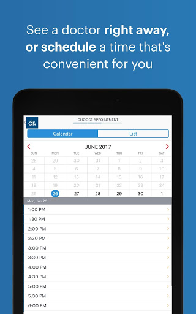
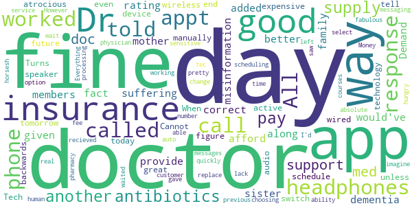
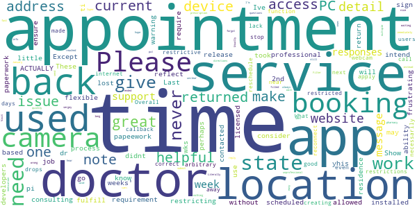

# Doctor On Demand
App version ``3.53.1``

Analyzed with [covid-apps-observer](http://github.com/covid-apps-observer) project, version ``0.1``

## App overview
| | |
|-------------------------|-------------------------| 
| **Name**&nbsp;&nbsp;&nbsp;&nbsp;&nbsp;&nbsp;&nbsp;&nbsp;&nbsp;&nbsp;&nbsp;&nbsp;&nbsp;&nbsp;&nbsp;&nbsp;&nbsp;&nbsp;&nbsp;&nbsp;&nbsp;&nbsp;&nbsp;&nbsp;&nbsp;&nbsp;&nbsp;&nbsp;&nbsp;&nbsp;&nbsp;&nbsp;&nbsp;&nbsp;&nbsp;&nbsp;&nbsp;&nbsp;&nbsp;&nbsp;  | Doctor On Demand |
| **Unique identifier** | com.doctorondemand.android.patient |
| **Link to Google Play** | [https://play.google.com/store/apps/details?id=com.doctorondemand.android.patient](https://play.google.com/store/apps/details?id=com.doctorondemand.android.patient) |
| **Summary**  | Live Video Visits with Board-Certified Physicians and Psychologists |
| **Privacy policy** | [https://www.doctorondemand.com/privacy-policies/site-privacy-policy](https://www.doctorondemand.com/privacy-policies/site-privacy-policy) |
| **Latest version** | 3.53.1 |
| **Last update** | 2021-02-18 22:21:02 |
| **Recent changes** | Thanks for choosing Doctor On Demand! We update our app regularly to improve performance and functionality to help you connect with our doctors and manage your health. |
| **Installs**  | 1,000,000+ |
| **Category** | Medical |
| **First release** | Oct 7, 2013 |
| **Size**  | 66M |
| **Supported Android version**  | 5.0 and up |

### Description
> Available when you are and without the hassle of the waiting room. Connect in minutes with board-certified physicians and doctoral-level therapists over live video. Just like an in-person visit, your doctor will take your history and symptoms, then will perform an exam.
 Some of examples of what we treat:
 - Cold & Flu
 - UTI
 - Allergies
 - Depression & Anxiety
 - Skin and Eye Issues
 - Urgent Care & more
 When are doctors available?
 Our doctors are available 24 hours a day, seven days a week. You can see a doctor immediately or schedule a visit at your convenience.
 Is insurance accepted?
 Our services are available with and without an insurance. We also partner with many top employers to reduce your cost.
 How much do visits cost?
 Doctor On Demand is open to everyone. See exactly what your visit will cost before you connect. There are no monthly fees.
 Can my other family members use this too?
 Our doctors can help your entire family - including kids. From medical to mental health, we’re available to make sure your family gets the care they need.
 This service is available in all 50 states and the District of Columbia.

### User interface
The developers of the app provide the following screenshots in the Google play store.
| | | |
|:-------------------------:|:-------------------------:|:-------------------------:|
 |   |   |   | 
 |   |   |   | 
 |   |   |   | 
 |  

## Development team
In the following we report the main information provided by the development team in the Google play store.

| | |
|-------------------------|-------------------------|
| **Developer**  | Doctor On Demand, Inc |
| **Website**  | [http://www.doctorondemand.com/contact](http://www.doctorondemand.com/contact) |
| **Email** | support@doctorondemand.com |
| **Physical address**  | - |
| **Other developed apps**  | [https://play.google.com/store/apps/developer?id=Doctor+On+Demand,+Inc](https://play.google.com/store/apps/developer?id=Doctor+On+Demand,+Inc) |

## Android support

| | |
|-------------------------|-------------------------|
| **Declared target Android version**  | Android10, version 10 (API level 29) |
| **Effective target Android version**  | Android10, version 10 (API level 29) |
| **Minimum supported Android version**  | Lollipop, version 5.0 (API level 21) |
| **Maximum target Android version**  | - |

The larger the difference between the minimum and maximum supported Android versions, the better. A larger difference means a wider audience. For example, old phones have a very low Android version, so a high minimum supported Android version means that the app cannot be used by users with old phones, thus leading to accessibility problems. 

## Requested permissions

In the following we report the complete list of the permissions requested by the app. 

| **Permission** | **Protection level** | **Description** | 
|-------------------------|-------------------------|-------------------------|
 **android.permission ACCESS_FINE_LOCATION** | :warning:**Dangerous** | Allows an app to access precise location. 
 **android.permission ACCESS_NETWORK_STATE** | Normal | Allows applications to access information about networks. 
 **android.permission ACCESS_WIFI_STATE** | Normal | Allows applications to access information about Wi-Fi networks. 
 **android.permission BLUETOOTH** | Normal | Allows applications to connect to paired bluetooth devices. 
 **android.permission CAMERA** | :warning:**Dangerous** | Required to be able to access the camera device. 
 **android.permission FOREGROUND_SERVICE** | Normal | Allows a regular application to use Service.startForeground. 
 **android.permission INTERNET** | Normal | Allows applications to open network sockets. 
 **android.permission MODIFY_AUDIO_SETTINGS** | Normal | Allows an application to modify global audio settings. 
 **android.permission READ_PROFILE** | - | - 
 **android.permission RECEIVE_BOOT_COMPLETED** | Normal | Allows an application to receive the Intent.ACTION_BOOT_COMPLETED that is broadcast after the system finishes booting. 
 **android.permission RECORD_AUDIO** | :warning:**Dangerous** | Allows an application to record audio. 
 **android.permission USE_BIOMETRIC** | Normal | Allows an app to use device supported biometric modalities. 
 **android.permission USE_FINGERPRINT** | Normal | This constant was deprecated in API level 28. Applications should request USE_BIOMETRIC instead 
 **android.permission VIBRATE** | Normal | Allows access to the vibrator. 
 **android.permission WAKE_LOCK** | Normal | Allows using PowerManager WakeLocks to keep processor from sleeping or screen from dimming. 
 **com.google.android.c2dm.permission RECEIVE** | - | - 
 **com.google.android.finsky.permission BIND_GET_INSTALL_REFERRER_SERVICE** | - | - 

## Mentioned servers

| **Server** | **Registrant** | **Registrant country** | **Creation date** | 
|-------------------------|-------------------------|-------------------------|-------------------------|
 | braintreegateway.com | PayPal Inc. | :us: US | 2009-10-06 23:05:33 |
 | doctorondemand.com | Doctor On Demand, Inc | :us: US | 2003-09-30 18:28:02 |
 | firebaseapp.com | Google LLC | :us: US | 2012-10-15 18:12:22 |
 | facebook.com | Facebook, Inc. | :us: US | 1997-03-29 05:00:00 |
 | google.com | Google LLC | :us: US | 1997-09-15 04:00:00 |
 | adobe.com | Adobe Inc. | :us: US | 1986-11-17 05:00:00 |
 | amazonaws.com | Amazon.com, Inc. | :us: US | 2005-08-18 02:10:45 |
 | medium.com | Whois Privacy Service | :us: US | 1998-05-27 04:00:00 |
 | youtube.com | Google LLC | :us: US | 2005-02-15 05:13:12 |
 | doubleclick.net | Google Inc. | :us: US | 1996-01-16 05:00:00 |
 | googleadservices.com | Google LLC | :us: US | 2003-06-19 16:34:53 |
 | googlesyndication.com | Google LLC | :us: US | 2003-01-21 06:17:24 |
 | googleapis.com | Google LLC | :us: US | 2005-01-25 17:52:26 |
 | app-measurement.com | Google LLC | :us: US | 2015-06-19 20:13:31 |
 | googleapis.com | Google LLC | :us: US | 2005-01-25 17:52:26 |
 | mixpanel.com | WhoisGuard, Inc. | PA | 2007-03-13 02:23:00 |
 | paypal.com | PayPal Inc. | :us: US | 1999-07-15 05:32:11 |
 | paypalobjects.com | PayPal Inc. | :us: US | 2005-05-12 17:11:21 |
 | crashlytics.com | Google LLC | :us: US | 2011-01-21 15:30:40 |

## Security analysis 

Below we report the main security warnings raised by our execution of the [Androwarn](https://github.com/maaaaz/androwarn) security analysis tool.

**Telephony identifiers leakage**
> - This application reads the MCC+MNC of the provider of the SIM 
> - This application reads the SIM's serial number 
> - This application reads the Service Provider Name (SPN) 
> - This application reads the constant indicating the state of the device SIM card 
> - This application reads the current location of the device 
> - This application reads the device phone type value 
> - This application reads the numeric name (MCC+MNC) of current registered operator 
> - This application reads the operator name 
> - This application reads the radio technology (network type) currently in use on the device for data transmission 
> - This application reads the unique device ID, i.e the IMEI for GSM and the MEID or ESN for CDMA phones 
> - This application reads the unique subscriber ID, for example, the IMSI for a GSM phone 
> - This application reads the Cell ID value 
> - This application reads the Location Area Code value 

**Location lookup**
> - This application reads location information from all available providers (WiFi, GPS etc.) 

**Connection interfaces exfiltration**
> - This application reads details about the currently active data network 
> - This application tries to find out if the currently active data network is metered 

**Telephony services abuse**
> - This application makes phone calls 

**Suspicious connection establishment**
> - This application opens a Socket and connects it to the remote address '' on the 'N/A' port  
> - This application opens a Socket and connects it to the remote address 'Ljava/lang/StringBuilder;->toString()Ljava/lang/String;' on the 'N/A' port  
> - This application opens a Socket and connects it to the remote address 'Ljava/net/Proxy;->type()Ljava/net/Proxy$Type;' on the 'N/A' port  
> - This application opens a Socket and connects it to the remote address 'timeout' on the 'N/A' port  

**Code execution**
> - This application loads a native library 
> - This application executes a UNIX command 
> - This application executes a UNIX command containing this argument: '' 

## User ratings and reviews

Below we provide information about how end users are reacting to the app in terms of ratings and reviews in the Google Play store.

### Ratings

The Doctor On Demand app has been installed by more than **1000000** times. At this time, **43896** rated the app and its average score is **4.8538637**. Below we show the distribution of the ratings across the usual star-based rating of Google Play

:star::star::star::star::star:: 41085

:star::star::star::star:: 1416

:star::star::star:: 219

:star::star:: 149

:star:: 1027

### Reviews 

#### 5-star reviews

> I love this service!! The Doctors are Awesome, they take the time to explain everything patiently to you. I will recommend Doctor on Demand 100% to anyone.  :date: __2021-02-27 09:11:48__

> Great option vs going into a doc office  :date: __2021-02-27 04:54:57__

> Nice  :date: __2021-02-27 04:07:07__

> Professional, quick, and extremly helpful!  :date: __2021-02-27 01:46:52__

> Great experience with Dr. Andrew Zaager. Fast and efficient! Will definitely use again!👍  :date: __2021-02-27 01:39:33__

> Doctor was available quicker than estimated, and showed concern while providing fast care. And free through my insurance! Will use again if needed. Edit: used today for a different medical concern. The doctor ordered labs immediately, gave me homework, and asked for a follow-up visit to build a plan. I feel better already knowing my concerns are being addressed.  :date: __2021-02-26 23:50:54__

> great service and easy to use. attentive doctors! Always very satisfied after numerous calls with different doctors. Highly recommend. App works very.  :date: __2021-02-26 22:08:28__

> Convenient  :date: __2021-02-26 19:38:23__

> Simply the best  :date: __2021-02-26 19:21:15__

> This app is the future of medicine. It's not perfect yet but we it will get there  :date: __2021-02-26 17:47:36__

#### 4-star reviews

> It's nice to get good care at home  :date: __2021-02-26 23:03:42__

> App is a great idea, but the doctor needs to be in a quieter room, ie curtains or something on the walls and acoustic tiles on the ceiling, somehing to help absorb the noise, sort of echoes. Also even with 4 bars the video and audio froze up twice, needs to use less bandwidth  :date: __2021-02-26 22:46:55__

> Awesome!  :date: __2021-02-26 18:57:22__

> Great help for a quick easy visit to the dr for minor aliment that needed medical prescription .  :date: __2021-02-26 16:09:57__

> It was great for me perfect I'll advise anybody if you need to talk with the doctor to go ahead and download the app in talk to a doctor I got my prescription I'm good  :date: __2021-02-25 23:51:04__

> Other than some tech glitches, very useful.  :date: __2021-02-22 15:56:52__

> Good very informative!  :date: __2021-02-21 14:39:41__

> I have overall enjoyed my use of D.O.D, however, what needs to be improved upon is the scheduling. There seems to be an issue always when trying to schedule follow-up appointments (at least for me - i.e. no dates available). I don't have time to check the app every day to see if there are openings. Outside of this hiccup, I don't have any other issues with the app. Very convenient.  :date: __2021-02-16 05:26:59__

> A big hell ya. No one feels like getting out of PJ's when you feel bad and the Cova Cloud is lerking.  :date: __2021-02-15 19:37:37__

> It's a good option for a lot of more minor problem's. The audio kept breaking up but the weather is horrible and that was a connection issue not Dr..onD. 's fault.  :date: __2021-02-14 20:09:58__

#### 3-star reviews

> Dr great. Tech not so good.  :date: __2021-02-23 18:48:28__

> The doctor was fine, but the audio was atrocious. Turns out you have to manually tell the app to switch to headphones from speaker even with wireless or wired headphones active on your device. I didn't figure this out until the end of the call. That is some backwards technology.  :date: __2021-02-19 16:05:41__

> Cannot schedule a future appt unless it's today or tomorrow. When scheduling an appt. The app should auto select the previous physician.  :date: __2021-02-17 22:04:11__

> App worked fine but the customer service messaging is absolute horsesh&t. I left 3 messages and waited days for a response. I then called the phone number. I was quickly able to get a real human on the phone who told me I had to wait days for a response. All this was just to replace a 4 day supply of antibiotics I recieved from the Dr. A 4 day supply that was as you can imagine pretty time sensitive as most courses of antibiotics are. So my only other option was to pay another $75 fee.  :date: __2021-02-03 20:45:47__

> Money hungry just like all the other docs....gave meds 2 days, weren't working. Called support because there is no way to call the doc you saw. Told me I'd have to pay ANOTHER $75 to get a med change!!!  :date: __2021-02-01 17:13:46__

> Everything but choosing a pharmacy worked fine.  :date: __2021-01-27 23:33:52__

> The doctors are fabulous. However their lack of ability of tec support and processing insurance is not good.  :date: __2021-01-22 01:24:14__

> Nice and safe way to check symptoms before going in to ER.  :date: __2021-01-09 03:28:42__

#### 2-star reviews

> No callback or reconnect function of your internet drops during the call so you have to reschedule for the next appointment which could be days or weeks away very unprofessional for an app in 2021  :date: __2021-02-09 23:49:18__

> Filter needs more detail. I cant put location in and other details.  :date: __2021-02-09 23:09:42__

> They give me wrong info i ended up having sergey instead  :date: __2021-02-06 14:20:52__

> Visit was easy and fast but I can't get the prescription they filled for me because my pharmacy said the directions were "unclear" I sent a support message immediately after and I'm still waiting to hear back. I am out of this medication so I hope they can get back to me quickly.  :date: __2021-02-04 14:01:24__

> Doctors are great!! Super nice and always so helpful! Usually never a long wait. But don't ever have any questions to submit to the support team. I have message multiple times with no reply. Literally week 3 of no responses. I need a doctor's note for work, the doctor forgot to send it to me. I reached out January 15 for one, and nothing no responses at all.  :date: __2021-02-03 18:10:21__

> Not a good fit for the care I need.  :date: __2021-01-08 16:51:08__

#### 1-star reviews

> only wanf to use this app when i am sick and it is so frustrating to use I give up  :date: __2021-02-26 23:18:05__

> Cannot get payment option to explain what is needed.  :date: __2021-02-23 23:56:18__

> Can't give referrals  :date: __2021-02-23 16:37:46__

> I have changes my 5 star review to a 1 star! For urgent care services and to avoid a trip to the emergency room, this app has been great! However, my most recent experiences have not been the same. I have made 3 appointments for therapy services and each time we are prepared waiting for the appointment to start and the appointment drops or is canceled within minutes. Very disappointing!  :date: __2021-02-22 22:23:20__

> Incompetence, telling me they called in my prescription, and they didn't. Connection problems on there part. If I could give a 0., I would. Warning.  :date: __2021-02-21 00:42:47__

> They say if you have Medicare you pay 0! I was looking for a counselor not an MD. But what they dont say is, you can't get a counselor for an appointment unless your paying full price with no insurance! I tried with an alternate log in without insurance and could get an appointment right away, but with Medicare I couldn't even get an appointment period!!! This app is a freaking scam! Thanks for the help!  :date: __2021-02-17 00:08:01__

> Delete  :date: __2021-02-14 03:16:37__

> Horrible doctors that almost always miss diagnose you. Scam don't use it go to the urgent care you will end up going anyways.  :date: __2021-02-14 01:37:38__

> HORRIBLE EXPERIENCE entered data and got TO pharmacy input a nd screen said "no pharmacy" listed Three days later tried and hitting on initial pro.pts for ins,pharm, etc dont work IM TOO SICK AND VERY DONE WITH THIS SLOW DISORGANIZED OUTFIT!!!  :date: __2021-02-13 22:13:21__

> Dr.Phil said they take Medicare part b,4 a freedr.appt.they would not do this.  :date: __2021-02-13 20:58:56__

