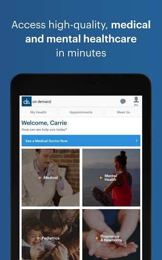
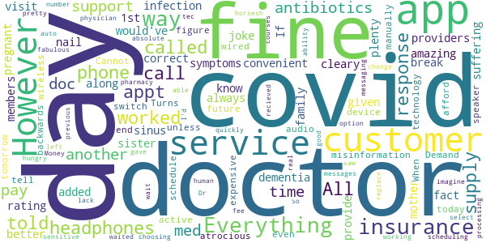

# Doctor On Demand
App version ``3.54.1``

Analyzed with [covid-apps-observer](http://github.com/covid-apps-observer) project, version ``0.1``

## App overview
| | |
|-------------------------|-------------------------| 
| **Name**                                          | Doctor On Demand |
| **Unique identifier** | com.doctorondemand.android.patient |
| **Link to Google Play** | [https://play.google.com/store/apps/details?id=com.doctorondemand.android.patient](https://play.google.com/store/apps/details?id=com.doctorondemand.android.patient) |
| **Summary**  | Live Video Visits with Board-Certified Physicians and Psychologists |
| **Privacy policy** | [https://www.doctorondemand.com/privacy-policies/site-privacy-policy](https://www.doctorondemand.com/privacy-policies/site-privacy-policy) |
| **Latest version** | 3.54.1 |
| **Last update** | 2021-03-12 23:09:34 |
| **Recent changes** | Thanks for choosing Doctor On Demand! We update our app regularly to improve performance and functionality to help you connect with our doctors and manage your health. |
| **Installs**  | 1,000,000+ |
| **Category** | Medical |
| **First release** | Oct 7, 2013 |
| **Size**  | 66M |
| **Supported Android version**  | 5.0 and up |

### Description
> Available when you are and without the hassle of the waiting room. Connect in minutes with board-certified physicians and doctoral-level therapists over live video. Just like an in-person visit, your doctor will take your history and symptoms, then will perform an exam.
 Some of examples of what we treat:
 - Cold & Flu
 - UTI
 - Allergies
 - Depression & Anxiety
 - Skin and Eye Issues
 - Urgent Care & more
 When are doctors available?
 Our doctors are available 24 hours a day, seven days a week. You can see a doctor immediately or schedule a visit at your convenience.
 Is insurance accepted?
 Our services are available with and without an insurance. We also partner with many top employers to reduce your cost.
 How much do visits cost?
 Doctor On Demand is open to everyone. See exactly what your visit will cost before you connect. There are no monthly fees.
 Can my other family members use this too?
 Our doctors can help your entire family - including kids. From medical to mental health, we’re available to make sure your family gets the care they need.
 This service is available in all 50 states and the District of Columbia.

### User interface
The developers of the app provide the following screenshots in the Google play store.
| | | |
|:-------------------------:|:-------------------------:|:-------------------------:|
 |   |   |   | 
 |   |   |   | 
 |   |   |   | 
 |  

## Development team
In the following we report the main information provided by the development team in the Google play store.

| | |
|-------------------------|-------------------------|
| **Developer**  | Doctor On Demand, Inc |
| **Website**  | [http://www.doctorondemand.com/contact](http://www.doctorondemand.com/contact) |
| **Email** | support@doctorondemand.com |
| **Physical address**  | - |
| **Other developed apps**  | [https://play.google.com/store/apps/developer?id=Doctor+On+Demand,+Inc](https://play.google.com/store/apps/developer?id=Doctor+On+Demand,+Inc) |

## Android support

| | |
|-------------------------|-------------------------|
| **Declared target Android version**  | Android10, version 10 (API level 29) |
| **Effective target Android version**  | Android10, version 10 (API level 29) |
| **Minimum supported Android version**  | Lollipop, version 5.0 (API level 21) |
| **Maximum target Android version**  | - |

The larger the difference between the minimum and maximum supported Android versions, the better. A larger difference means a wider audience. For example, old phones have a very low Android version, so a high minimum supported Android version means that the app cannot be used by users with old phones, thus leading to accessibility problems. 

## Requested permissions

In the following we report the complete list of the permissions requested by the app. 

| **Permission** | **Protection level** | **Description** | 
|-------------------------|-------------------------|-------------------------|
 **android.permission ACCESS_FINE_LOCATION** | :warning:**Dangerous** | Allows an app to access precise location. 
 **android.permission ACCESS_NETWORK_STATE** | Normal | Allows applications to access information about networks. 
 **android.permission ACCESS_WIFI_STATE** | Normal | Allows applications to access information about Wi-Fi networks. 
 **android.permission BLUETOOTH** | Normal | Allows applications to connect to paired bluetooth devices. 
 **android.permission CAMERA** | :warning:**Dangerous** | Required to be able to access the camera device. 
 **android.permission FOREGROUND_SERVICE** | Normal | Allows a regular application to use Service.startForeground. 
 **android.permission INTERNET** | Normal | Allows applications to open network sockets. 
 **android.permission MODIFY_AUDIO_SETTINGS** | Normal | Allows an application to modify global audio settings. 
 **android.permission READ_PROFILE** | - | - 
 **android.permission RECEIVE_BOOT_COMPLETED** | Normal | Allows an application to receive the Intent.ACTION_BOOT_COMPLETED that is broadcast after the system finishes booting. 
 **android.permission RECORD_AUDIO** | :warning:**Dangerous** | Allows an application to record audio. 
 **android.permission USE_BIOMETRIC** | Normal | Allows an app to use device supported biometric modalities. 
 **android.permission USE_FINGERPRINT** | Normal | This constant was deprecated in API level 28. Applications should request USE_BIOMETRIC instead 
 **android.permission VIBRATE** | Normal | Allows access to the vibrator. 
 **android.permission WAKE_LOCK** | Normal | Allows using PowerManager WakeLocks to keep processor from sleeping or screen from dimming. 
 **com.google.android.c2dm.permission RECEIVE** | - | - 
 **com.google.android.finsky.permission BIND_GET_INSTALL_REFERRER_SERVICE** | - | - 

## Mentioned servers

| **Server** | **Registrant** | **Registrant country** | **Creation date** | 
|-------------------------|-------------------------|-------------------------|-------------------------|
 | braintreegateway.com | PayPal Inc. | :us: US | 2009-10-06 23:05:33 |
 | doctorondemand.com | Doctor On Demand, Inc | :us: US | 2003-09-30 18:28:02 |
 | firebaseapp.com | Google LLC | :us: US | 2012-10-15 18:12:22 |
 | facebook.com | Facebook, Inc. | :us: US | 1997-03-29 05:00:00 |
 | google.com | Google LLC | :us: US | 1997-09-15 04:00:00 |
 | adobe.com | Adobe Inc. | :us: US | 1986-11-17 05:00:00 |
 | amazonaws.com | Amazon.com, Inc. | :us: US | 2005-08-18 02:10:45 |
 | medium.com | Whois Privacy Service | :us: US | 1998-05-27 04:00:00 |
 | youtube.com | Google LLC | :us: US | 2005-02-15 05:13:12 |
 | doubleclick.net | Google Inc. | :us: US | 1996-01-16 05:00:00 |
 | googleadservices.com | Google LLC | :us: US | 2003-06-19 16:34:53 |
 | googlesyndication.com | Google LLC | :us: US | 2003-01-21 06:17:24 |
 | googleapis.com | Google LLC | :us: US | 2005-01-25 17:52:26 |
 | app-measurement.com | Google LLC | :us: US | 2015-06-19 20:13:31 |
 | googleapis.com | Google LLC | :us: US | 2005-01-25 17:52:26 |
 | mixpanel.com | - | - | 2007-03-13 02:23:00 |
 | paypal.com | PayPal Inc. | :us: US | 1999-07-15 05:32:11 |
 | paypalobjects.com | PayPal Inc. | :us: US | 2005-05-12 17:11:21 |
 | crashlytics.com | Google LLC | :us: US | 2011-01-21 15:30:40 |

## Security analysis 

Below we report the main security warnings raised by our execution of the [Androwarn](https://github.com/maaaaz/androwarn) security analysis tool.

**Telephony identifiers leakage**
> - This application reads the MCC+MNC of the provider of the SIM 
> - This application reads the SIM's serial number 
> - This application reads the Service Provider Name (SPN) 
> - This application reads the constant indicating the state of the device SIM card 
> - This application reads the current location of the device 
> - This application reads the device phone type value 
> - This application reads the numeric name (MCC+MNC) of current registered operator 
> - This application reads the operator name 
> - This application reads the radio technology (network type) currently in use on the device for data transmission 
> - This application reads the unique device ID, i.e the IMEI for GSM and the MEID or ESN for CDMA phones 
> - This application reads the unique subscriber ID, for example, the IMSI for a GSM phone 
> - This application reads the Cell ID value 
> - This application reads the Location Area Code value 

**Location lookup**
> - This application reads location information from all available providers (WiFi, GPS etc.) 

**Connection interfaces exfiltration**
> - This application reads details about the currently active data network 
> - This application tries to find out if the currently active data network is metered 

**Telephony services abuse**
> - This application makes phone calls 

**Suspicious connection establishment**
> - This application opens a Socket and connects it to the remote address '' on the 'N/A' port  
> - This application opens a Socket and connects it to the remote address 'Ljava/lang/StringBuilder;->toString()Ljava/lang/String;' on the 'N/A' port  
> - This application opens a Socket and connects it to the remote address 'Ljava/net/Proxy;->type()Ljava/net/Proxy$Type;' on the 'N/A' port  
> - This application opens a Socket and connects it to the remote address 'timeout' on the 'N/A' port  

**Code execution**
> - This application loads a native library 
> - This application executes a UNIX command 
> - This application executes a UNIX command containing this argument: '' 

## User ratings and reviews

Below we provide information about how end users are reacting to the app in terms of ratings and reviews in the Google Play store.

### Ratings

The Doctor On Demand app has been installed by more than **1000000** times. At this time, **44515** rated the app and its average score is **4.841295**. Below we show the distribution of the ratings across the usual star-based rating of Google Play

:star::star::star::star::star:: 41467

:star::star::star::star:: 1480

:star::star::star:: 258

:star::star:: 178

:star:: 1132

### Reviews 

#### 5-star reviews

> Great app with superb service  :date: __2021-03-14 13:00:03__

> Great, and so convenient  :date: __2021-03-14 05:19:25__

> A great experience .  :date: __2021-03-14 03:28:24__

> Easy, simple, direct  :date: __2021-03-14 01:22:19__

> Very satisfied  :date: __2021-03-14 00:54:17__

> Honestly it's if not an emergency thus is a great option  :date: __2021-03-13 18:12:34__

> Good service  :date: __2021-03-13 17:49:05__

> Very convenient and Dr was very nice and helpful  :date: __2021-03-13 16:09:46__

> Very easy to do!! Stress saver for sure!!!  :date: __2021-03-13 16:06:01__

> Great experience and easy to use App.  :date: __2021-03-13 14:49:50__

#### 4-star reviews

> Quick and easy but too expensive  :date: __2021-03-12 17:14:00__

> Great resource. I wish they didn't just cut your appointment off if you run over time with your doctor. That's really my only criticism  :date: __2021-03-07 16:16:03__

> Good  :date: __2021-03-05 16:25:54__

> easy and efficient  :date: __2021-03-04 16:53:16__

> The online service is convenient for the patient. I've had all good experiences. Friendly doctors. I'm glad my friend recommended Doctor on Demand.  :date: __2021-03-03 16:30:46__

> It's nice to get good care at home  :date: __2021-02-26 23:03:42__

> App is a great idea, but the doctor needs to be in a quieter room, ie curtains or something on the walls and acoustic tiles on the ceiling, somehing to help absorb the noise, sort of echoes. Also even with 4 bars the video and audio froze up twice, needs to use less bandwidth  :date: __2021-02-26 22:46:55__

> Awesome!  :date: __2021-02-26 18:57:22__

> Great help for a quick easy visit to the dr for minor aliment that needed medical prescription .  :date: __2021-02-26 16:09:57__

> It was great for me perfect I'll advise anybody if you need to talk with the doctor to go ahead and download the app in talk to a doctor I got my prescription I'm good  :date: __2021-02-25 23:51:04__

#### 3-star reviews

> This was my 1st visit, I like how convenient it is. However I cleary have a sinus infection, I have had them plenty of times and know the symptoms. Everything is not always covid. If you get pregnant covid, break a nail covid!  :date: __2021-03-12 17:15:54__

> I would've given a better rating it it wasn't for the fact that they added my sister along with my mother as family members suffering from dementia. They didn't provide a way for me to correct the misinformation.  :date: __2021-03-05 00:49:51__

> I don't have insurance because I can't afford it and Doctor on Demand is very expensive.  :date: __2021-03-02 18:21:55__

> The doctor was fine, but the audio was atrocious. Turns out you have to manually tell the app to switch to headphones from speaker even with wireless or wired headphones active on your device. I didn't figure this out until the end of the call. That is some backwards technology.  :date: __2021-02-19 16:05:41__

> Cannot schedule a future appt unless it's today or tomorrow. When scheduling an appt. The app should auto select the previous physician.  :date: __2021-02-17 22:04:11__

> App worked fine but the customer service messaging is absolute horsesh&t. I left 3 messages and waited days for a response. I then called the phone number. I was quickly able to get a real human on the phone who told me I had to wait days for a response. All this was just to replace a 4 day supply of antibiotics I recieved from the Dr. A 4 day supply that was as you can imagine pretty time sensitive as most courses of antibiotics are. So my only other option was to pay another $75 fee.  :date: __2021-02-03 20:45:47__

> Money hungry just like all the other docs....gave meds 2 days, weren't working. Called support because there is no way to call the doc you saw. Told me I'd have to pay ANOTHER $75 to get a med change!!!  :date: __2021-02-01 17:13:46__

> Everything but choosing a pharmacy worked fine.  :date: __2021-01-27 23:33:52__

> The doctors are fabulous. However their lack of ability of tec support and processing insurance is not good.  :date: __2021-01-22 01:24:14__

#### 2-star reviews

> Very poor technical platform. First appointment doctor drop the call because coul not hear. Second appointment doctor explained they hear feedback because of platform  :date: __2021-03-09 15:17:35__

> Ive used yhis app 3 times. 2 of the times they didnt fulfill the papeework requirement i had to return ti work. Which makes you have to go back a 2nd time. Last time took 5 wks for them to get a pi release for me to give dr and they never contacted him to sign paperwork. lost the job.  :date: __2021-03-06 00:50:25__

> The consulting service itself is great, and the doctors have been both helpful and professional, but the app/service restricting the ability to make appointments based on your current location and not the location where you'll have returned to in... I don't know... 5 weeks' time when the appointment ACTUALLY is scheduled is more than a little frustrating. Not only that, booking on a PC isn't allowed without camera access. Except I don't have a camera installed on this PC, and I don't intend to use it for the appointment. App developers, please consider that the devices and locations used during the appointment booking process may not reflect those used at the time of service and be more flexible. Show a warning: "This doctor is not licensed in your current state. Please ensure you have returned to your state of residence at the time of your appointment." or perhaps "Please note that this service will require camera access at the time of your appointment." These restrictions should only apply at the time of service. What's to stop me from booking an appointment in the correct state and on a device with a webcam, only to lack both of those at or near the time of the appointment? THAT'S the issue you need to address. Not the arbitrary one you're creating for your users. Overall, it's a good service with a restricted app and website that don't even necessarily address the issues for which they've made the app/website so restrictive.  :date: __2021-02-28 18:27:12__

> No callback or reconnect function of your internet drops during the call so you have to reschedule for the next appointment which could be days or weeks away very unprofessional for an app in 2021  :date: __2021-02-09 23:49:18__

> Filter needs more detail. I cant put location in and other details.  :date: __2021-02-09 23:09:42__

> They give me wrong info i ended up having sergey instead  :date: __2021-02-06 14:20:52__

> Visit was easy and fast but I can't get the prescription they filled for me because my pharmacy said the directions were "unclear" I sent a support message immediately after and I'm still waiting to hear back. I am out of this medication so I hope they can get back to me quickly.  :date: __2021-02-04 14:01:24__

> Doctors are great!! Super nice and always so helpful! Usually never a long wait. But don't ever have any questions to submit to the support team. I have message multiple times with no reply. Literally week 3 of no responses. I need a doctor's note for work, the doctor forgot to send it to me. I reached out January 15 for one, and nothing no responses at all.  :date: __2021-02-03 18:10:21__

#### 1-star reviews

> I keep trying and it will only keep looping on the virtual intro!! So much for emergency help!!!  :date: __2021-03-11 22:05:48__

> Won't do anything unless you ALREADY HAVE THE MEDICINE  :date: __2021-03-11 21:34:28__

> Tried multiple times during different times of day and there was never a doctor available. What good is that?  :date: __2021-03-11 01:07:48__

> Dr's are great! App easy enough to use. Customer service is completely incompetent and read from exact same scripts.  :date: __2021-03-10 16:04:10__

> Installed the ap all I ever saw was the intro video and it would not let me go anywhere else. AN exercise in futility.  :date: __2021-03-10 09:08:14__

> A waste of time. Go see your real Doctor  :date: __2021-03-10 02:57:45__

> 75$ to talk to a dr on the phone??? That's terrible and you shouldnt have to pay anything.  :date: __2021-03-08 17:58:51__

> Lack of Response. Talked to Dr. at 2:30 am. She said she would send a prescription to the pharmacy. 31 hours later, no prescription. I sent an email requesting support. They said they would respond in a few hours. 19 hours hours later, no response.  :date: __2021-03-07 17:00:45__

> Huge scam. They said they would provide a service and didn't. Just told me to go see a local doctor for a simple condition that they claim they can help with. How does that help?  :date: __2021-03-05 03:50:48__

> Does not take my insurances.  :date: __2021-03-04 15:24:08__

