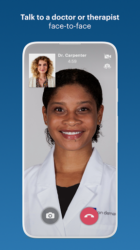
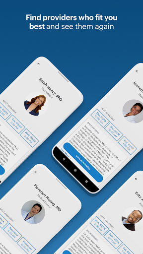
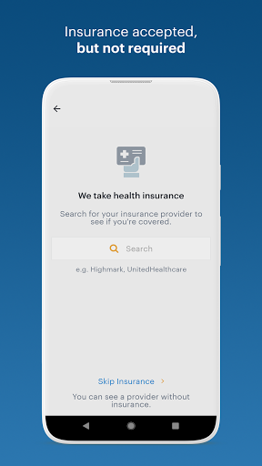
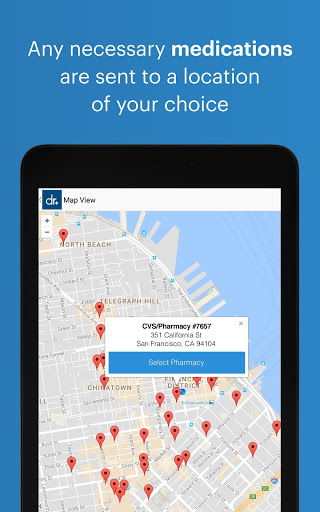
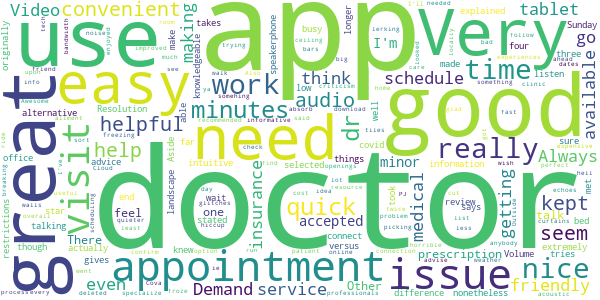
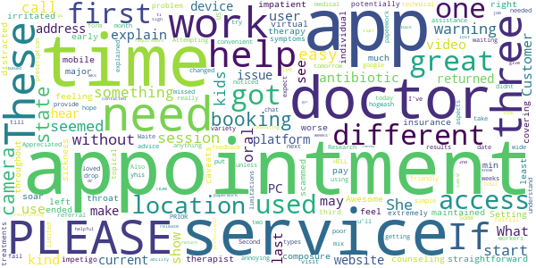

# Doctor On Demand
App version ``3.55.1``

Analyzed with [covid-apps-observer](http://github.com/covid-apps-observer) project, version ``0.1``

## App overview
| | |
|-------------------------|-------------------------| 
| **Name**&nbsp;&nbsp;&nbsp;&nbsp;&nbsp;&nbsp;&nbsp;&nbsp;&nbsp;&nbsp;&nbsp;&nbsp;&nbsp;&nbsp;&nbsp;&nbsp;&nbsp;&nbsp;&nbsp;&nbsp;&nbsp;&nbsp;&nbsp;&nbsp;&nbsp;&nbsp;&nbsp;&nbsp;&nbsp;&nbsp;&nbsp;&nbsp;&nbsp;&nbsp;&nbsp;&nbsp;&nbsp;&nbsp;&nbsp;&nbsp;  | Doctor On Demand |
| **Unique identifier** | com.doctorondemand.android.patient |
| **Link to Google Play** | [https://play.google.com/store/apps/details?id=com.doctorondemand.android.patient](https://play.google.com/store/apps/details?id=com.doctorondemand.android.patient) |
| **Summary**  | Live Video Visits with Board-Certified Physicians and Psychologists |
| **Privacy policy** | [https://www.doctorondemand.com/privacy-policies/site-privacy-policy](https://www.doctorondemand.com/privacy-policies/site-privacy-policy) |
| **Latest version** | 3.55.1 |
| **Last update** | 2021-03-31 02:51:23 |
| **Recent changes** | Thanks for choosing Doctor On Demand! We update our app regularly to improve performance and functionality to help you connect with our doctors and manage your health. |
| **Installs**  | 1,000,000+ |
| **Category** | Medical |
| **First release** | Oct 7, 2013 |
| **Size**  | 66M |
| **Supported Android version**  | 5.0 and up |

### Description
> Total Virtual Care™ available when you are – anytime, anywhere. Connect face-to-face with board-certified providers and licensed therapists over live video on your smartphone or tablet. 
 Examples of what we treat:
 - Cold & flu
 - UTIs
 - Depression and anxiety
 - Allergies
 - Skin and eye issues
 - Urgent Care & more
 When can I see a doctor or therapist?
 Our providers are available 24 hours a day, seven days a week. You can see a provider immediately or schedule a visit at your convenience.
 What can I expect in a visit?
 After you select the type of visit and provide your history and symptoms, you’ll meet with your provider. Your doctor may recommend lab work and treatment, including prescriptions. After the visit, you can review your visit details in your Doctor On Demand health record.  
 How much do visits cost and do you accept insurance?
 Our services are available with and without insurance. We also partner with many top employers to reduce your cost. See exactly what your visit will cost before you connect. There are no monthly fees.
 Can my family members use Doctor On Demand, too?
 Our care team can help your entire family. From medical to mental health, we’re here to make sure your family gets the care they need.
 This service is available in all 50 states and the District of Columbia.

### User interface
The developers of the app provide the following screenshots in the Google play store.
| | | |
|:-------------------------:|:-------------------------:|:-------------------------:|
 |   |   |   | 
 |   |   |   | 
 |   |   |   | 
 |   |   |   | 

## Development team
In the following we report the main information provided by the development team in the Google play store.

| | |
|-------------------------|-------------------------|
| **Developer**  | Doctor On Demand, Inc |
| **Website**  | [http://www.doctorondemand.com/contact](http://www.doctorondemand.com/contact) |
| **Email** | support@doctorondemand.com |
| **Physical address**  | - |
| **Other developed apps**  | [https://play.google.com/store/apps/developer?id=Doctor+On+Demand,+Inc](https://play.google.com/store/apps/developer?id=Doctor+On+Demand,+Inc) |

## Android support

| | |
|-------------------------|-------------------------|
| **Declared target Android version**  | Android10, version 10 (API level 29) |
| **Effective target Android version**  | Android10, version 10 (API level 29) |
| **Minimum supported Android version**  | Lollipop, version 5.0 (API level 21) |
| **Maximum target Android version**  | - |

The larger the difference between the minimum and maximum supported Android versions, the better. A larger difference means a wider audience. For example, old phones have a very low Android version, so a high minimum supported Android version means that the app cannot be used by users with old phones, thus leading to accessibility problems. 

## Requested permissions

In the following we report the complete list of the permissions requested by the app. 

| **Permission** | **Protection level** | **Description** | 
|-------------------------|-------------------------|-------------------------|
 **android.permission ACCESS_FINE_LOCATION** | :warning:**Dangerous** | Allows an app to access precise location. 
 **android.permission ACCESS_NETWORK_STATE** | Normal | Allows applications to access information about networks. 
 **android.permission ACCESS_WIFI_STATE** | Normal | Allows applications to access information about Wi-Fi networks. 
 **android.permission BLUETOOTH** | Normal | Allows applications to connect to paired bluetooth devices. 
 **android.permission CAMERA** | :warning:**Dangerous** | Required to be able to access the camera device. 
 **android.permission FOREGROUND_SERVICE** | Normal | Allows a regular application to use Service.startForeground. 
 **android.permission INTERNET** | Normal | Allows applications to open network sockets. 
 **android.permission MODIFY_AUDIO_SETTINGS** | Normal | Allows an application to modify global audio settings. 
 **android.permission READ_PROFILE** | - | - 
 **android.permission RECEIVE_BOOT_COMPLETED** | Normal | Allows an application to receive the Intent.ACTION_BOOT_COMPLETED that is broadcast after the system finishes booting. 
 **android.permission RECORD_AUDIO** | :warning:**Dangerous** | Allows an application to record audio. 
 **android.permission USE_BIOMETRIC** | Normal | Allows an app to use device supported biometric modalities. 
 **android.permission USE_FINGERPRINT** | Normal | This constant was deprecated in API level 28. Applications should request USE_BIOMETRIC instead 
 **android.permission VIBRATE** | Normal | Allows access to the vibrator. 
 **android.permission WAKE_LOCK** | Normal | Allows using PowerManager WakeLocks to keep processor from sleeping or screen from dimming. 
 **com.google.android.c2dm.permission RECEIVE** | - | - 
 **com.google.android.finsky.permission BIND_GET_INSTALL_REFERRER_SERVICE** | - | - 

## Mentioned servers

| **Server** | **Registrant** | **Registrant country** | **Creation date** | 
|-------------------------|-------------------------|-------------------------|-------------------------|
 | braintreegateway.com | PayPal Inc. | :us: US | 2009-10-06 23:05:33 |
 | doctorondemand.com | Doctor On Demand, Inc | :us: US | 2003-09-30 18:28:02 |
 | firebaseapp.com | Google LLC | :us: US | 2012-10-15 18:12:22 |
 | facebook.com | Facebook, Inc. | :us: US | 1997-03-29 05:00:00 |
 | google.com | Google LLC | :us: US | 1997-09-15 04:00:00 |
 | adobe.com | Adobe Inc. | :us: US | 1986-11-17 05:00:00 |
 | amazonaws.com | Amazon.com, Inc. | :us: US | 2005-08-18 02:10:45 |
 | medium.com | Whois Privacy Service | :us: US | 1998-05-27 04:00:00 |
 | youtube.com | Google LLC | :us: US | 2005-02-15 05:13:12 |
 | doubleclick.net | Google Inc. | :us: US | 1996-01-16 05:00:00 |
 | googleadservices.com | Google LLC | :us: US | 2003-06-19 16:34:53 |
 | googlesyndication.com | Google LLC | :us: US | 2003-01-21 06:17:24 |
 | googleapis.com | Google LLC | :us: US | 2005-01-25 17:52:26 |
 | app-measurement.com | Google LLC | :us: US | 2015-06-19 20:13:31 |
 | googleapis.com | Google LLC | :us: US | 2005-01-25 17:52:26 |
 | mixpanel.com | WhoisGuard, Inc. | PA | 2007-03-13 02:23:00 |
 | paypal.com | PayPal Inc. | :us: US | 1999-07-15 05:32:11 |
 | paypalobjects.com | PayPal Inc. | :us: US | 2005-05-12 17:11:21 |
 | crashlytics.com | Google LLC | :us: US | 2011-01-21 15:30:40 |

## Security analysis 

Below we report the main security warnings raised by our execution of the [Androwarn](https://github.com/maaaaz/androwarn) security analysis tool.

**Telephony identifiers leakage**
> - This application reads the MCC+MNC of the provider of the SIM 
> - This application reads the SIM's serial number 
> - This application reads the Service Provider Name (SPN) 
> - This application reads the constant indicating the state of the device SIM card 
> - This application reads the current location of the device 
> - This application reads the device phone type value 
> - This application reads the numeric name (MCC+MNC) of current registered operator 
> - This application reads the operator name 
> - This application reads the radio technology (network type) currently in use on the device for data transmission 
> - This application reads the unique device ID, i.e the IMEI for GSM and the MEID or ESN for CDMA phones 
> - This application reads the unique subscriber ID, for example, the IMSI for a GSM phone 
> - This application reads the Cell ID value 
> - This application reads the Location Area Code value 

**Location lookup**
> - This application reads location information from all available providers (WiFi, GPS etc.) 

**Connection interfaces exfiltration**
> - This application reads details about the currently active data network 
> - This application tries to find out if the currently active data network is metered 

**Telephony services abuse**
> - This application makes phone calls 

**Suspicious connection establishment**
> - This application opens a Socket and connects it to the remote address '' on the 'N/A' port  
> - This application opens a Socket and connects it to the remote address 'Ljava/lang/StringBuilder;->toString()Ljava/lang/String;' on the 'N/A' port  
> - This application opens a Socket and connects it to the remote address 'Ljava/net/Proxy;->type()Ljava/net/Proxy$Type;' on the 'N/A' port  
> - This application opens a Socket and connects it to the remote address 'timeout' on the 'N/A' port  

**Code execution**
> - This application loads a native library 
> - This application executes a UNIX command 
> - This application executes a UNIX command containing this argument: '' 

## User ratings and reviews

Below we provide information about how end users are reacting to the app in terms of ratings and reviews in the Google Play store.

### Ratings

The Doctor On Demand app has been installed by more than **1000000** times. At this time, **45147** rated the app and its average score is **4.838567**. Below we show the distribution of the ratings across the usual star-based rating of Google Play

:star::star::star::star::star:: 41954

:star::star::star::star:: 1607

:star::star::star:: 259

:star::star:: 149

:star:: 1178

### Reviews 

#### 5-star reviews

> Easy option for simple diagnosis (I had a rash). Would absolutely do again.  :date: __2021-04-04 08:21:48__

> Really appreciate the ease of use and great doctors.  :date: __2021-04-04 00:19:01__

> Smooth easy experience. Highly recommended.  :date: __2021-04-04 00:14:34__

> It was fruitful, at the comfort and safe of my home, I saw a doctor, had a lab test ordered. The doctor was very easy to talk, friendly and saw me on Saturday early evening. It gave me peace of mind.  :date: __2021-04-04 00:01:05__

> I am very pleased with Doctor on Demand. Every doctor that Ive seen has been very caring and really listens to you. It is so much better for me, an asthmatic, to be able to do visits at home and not go to an office. I would definetely refer someone. Thank you.  :date: __2021-04-03 21:31:59__

> I knew I needed antibiotics for swollen glands, but it is a Saturday today. If it werent for this app, I wouldve had to suffer until Monday and hope my regular dr could get me in. This app is awesome!!  :date: __2021-04-03 20:58:17__

> Always on - on time, on point, on delivery  :date: __2021-04-03 20:36:31__

> Never had a problem with this it save me time and and headache going to urgent care for long waits  :date: __2021-04-03 19:29:00__

> Comfortable and safe way to get my counseling and therapy even across the country  :date: __2021-04-03 18:55:09__

> Our family has used Doctor on Demand a few times and we love it. Very easy to use, wonderful doctors, great staff if you have any questions or concerns. I would recommend this app to everyone :-)  :date: __2021-04-03 17:34:01__

#### 4-star reviews

> So far, so good.  :date: __2021-04-03 22:18:58__

> Works really well, app is intuitive and does what it says it does. Volume was extremely low though, and that was even with speakerphone selected, which didn't seem to make a difference.  :date: __2021-04-03 01:34:22__

> Always helpful and gives great service!  :date: __2021-03-30 21:30:03__

> Aside from a longer wait time than originally stated on the app (20 minutes versus 5 minutes), I was able to get an appointment after getting off of work on a Sunday, in my bed nonetheless!  :date: __2021-03-29 04:34:11__

> Would not connect four three tries. In the end, audio only.  :date: __2021-03-25 20:38:37__

> Doctor on Demand is very convenient. With covid restrictions and a busy work schedule, it's nice to get medical advice from very knowledgeable professionals.  :date: __2021-03-22 14:21:40__

> Video kept freezing during visit.  :date: __2021-03-19 20:44:59__

> When you get a nice doctor it's a great app when u get a ride doctor not so much  :date: __2021-03-17 22:59:24__

> Seems like a good app. I deleted it after I looked into it. I like the list of available doctor's and the info. about what they specialize in. I went through the process of picking a doctor and making an appointment. It was fast and easy. I didn't confirm. I don't think my insurance was accepted and my said cost was over $200. If your insurance is accepted and you need to find a doctor I think it's a good app to use. I would only use if I couldn't get a doctor locally or use a walk in clinic.  :date: __2021-03-15 19:39:10__

> Quick and easy but too expensive  :date: __2021-03-12 17:14:00__

#### 3-star reviews

> The providers are amazing, customer service is a joke.  :date: __2021-03-19 15:37:48__

> This was my 1st visit, I like how convenient it is. However I cleary have a sinus infection, I have had them plenty of times and know the symptoms. Everything is not always covid. If you get pregnant covid, break a nail covid!  :date: __2021-03-12 17:15:54__

> I would've given a better rating it it wasn't for the fact that they added my sister along with my mother as family members suffering from dementia. They didn't provide a way for me to correct the misinformation.  :date: __2021-03-05 00:49:51__

> I don't have insurance because I can't afford it and Doctor on Demand is very expensive.  :date: __2021-03-02 18:21:55__

> The doctor was fine, but the audio was atrocious. Turns out you have to manually tell the app to switch to headphones from speaker even with wireless or wired headphones active on your device. I didn't figure this out until the end of the call. That is some backwards technology.  :date: __2021-02-19 16:05:41__

> Cannot schedule a future appt unless it's today or tomorrow. When scheduling an appt. The app should auto select the previous physician.  :date: __2021-02-17 22:04:11__

> App worked fine but the customer service messaging is absolute horsesh&t. I left 3 messages and waited days for a response. I then called the phone number. I was quickly able to get a real human on the phone who told me I had to wait days for a response. All this was just to replace a 4 day supply of antibiotics I recieved from the Dr. A 4 day supply that was as you can imagine pretty time sensitive as most courses of antibiotics are. So my only other option was to pay another $75 fee.  :date: __2021-02-03 20:45:47__

> Money hungry just like all the other docs....gave meds 2 days, weren't working. Called support because there is no way to call the doc you saw. Told me I'd have to pay ANOTHER $75 to get a med change!!!  :date: __2021-02-01 17:13:46__

#### 2-star reviews

> Easy and convenient when it it work's out, the last two appointments were missed, the first because I could not get into the video chat and they put me down as a no show, the other time was today, I was in the app waiting for the appointment to start when I noticed the date was changed to tomorrow when I work, now I have to Waite till next month to see the doctor.  :date: __2021-03-22 22:07:09__

> I loved the doctor. Attempting to access my appointment PRIOR was HELL. No where on your app so you explain how the app works. The video you provide "What you can expect on your first visit" was hogwash. It did NOT explain anything at all. Appreciated the care but the app is NOT user friendly.  :date: __2021-03-19 17:47:59__

> \*\*\*\* PLEASE PLEASE, try not to use this kind of app unless u really need it. These kind of apps can fail you when you run need. Customers from all over the US are needed services. W/Limited workers u may not get your prescription or referral u need. Research these types of apps. Also If u google doctors help/assistance u'll get a wide variety. Some W/800 #. I've had mix results, but after using different aspects of these services I understand the limitations. I hope this helps you.  :date: __2021-03-15 21:53:16__

> Very poor technical platform. First appointment doctor drop the call because coul not hear. Second appointment doctor explained they hear feedback because of platform  :date: __2021-03-09 15:17:35__

> Ive used yhis app 3 times. 2 of the times they didnt fulfill the papeework requirement i had to return ti work. Which makes you have to go back a 2nd time. Last time took 5 wks for them to get a pi release for me to give dr and they never contacted him to sign paperwork. lost the job.  :date: __2021-03-06 00:50:25__

> The consulting service itself is great, and the doctors have been both helpful and professional, but the app/service restricting the ability to make appointments based on your current location and not the location where you'll have returned to in... I don't know... 5 weeks' time when the appointment ACTUALLY is scheduled is more than a little frustrating. Not only that, booking on a PC isn't allowed without camera access. Except I don't have a camera installed on this PC, and I don't intend to use it for the appointment. App developers, please consider that the devices and locations used during the appointment booking process may not reflect those used at the time of service and be more flexible. Show a warning: "This doctor is not licensed in your current state. Please ensure you have returned to your state of residence at the time of your appointment." or perhaps "Please note that this service will require camera access at the time of your appointment." These restrictions should only apply at the time of service. What's to stop me from booking an appointment in the correct state and on a device with a webcam, only to lack both of those at or near the time of the appointment? THAT'S the issue you need to address. Not the arbitrary one you're creating for your users. Overall, it's a good service with a restricted app and website that don't even necessarily address the issues for which they've made the app/website so restrictive.  :date: __2021-02-28 18:27:12__

> No callback or reconnect function of your internet drops during the call so you have to reschedule for the next appointment which could be days or weeks away very unprofessional for an app in 2021  :date: __2021-02-09 23:49:18__

> Filter needs more detail. I cant put location in and other details.  :date: __2021-02-09 23:09:42__

> Visit was easy and fast but I can't get the prescription they filled for me because my pharmacy said the directions were "unclear" I sent a support message immediately after and I'm still waiting to hear back. I am out of this medication so I hope they can get back to me quickly.  :date: __2021-02-04 14:01:24__

> Doctors are great!! Super nice and always so helpful! Usually never a long wait. But don't ever have any questions to submit to the support team. I have message multiple times with no reply. Literally week 3 of no responses. I need a doctor's note for work, the doctor forgot to send it to me. I reached out January 15 for one, and nothing no responses at all.  :date: __2021-02-03 18:10:21__

#### 1-star reviews

> My insurance pays 100%..but not here. Would be at least $125 plus extra. Dr. Phil I just quit loving you. Better luck next time I hope.  :date: __2021-04-01 02:48:29__

> Never used  :date: __2021-03-30 20:37:41__

> Just try to use it and it kept crashing when i finallu needed it it keeps kicking me out was waiting for a doc and all of sudden it crashed 8 times im done like this is rediclous and i know they guna charge a no show even tho the app keep crashing and cant even get past the forst page i tryed unistalling n redownloading 5 times n same thing keep happening this is rediculous sorry if some things miss spelled but im writing while angry cause money aint free period  :date: __2021-03-25 23:29:52__

> Please, I beg you if it is anything past a sniffe seek attention where you can get immediate help. I am ending up in the ER waiting on a Rx that I still haven't gotten after two days. These people do not care. Even if your employer makes it free do not trust these people!  :date: __2021-03-25 22:19:45__

> Not impressed that it took them 6 days to respond to me when I realized the medicine they gave my daughter was liquid and she will only take pill form because of taste. I told them she only took it for 2 days and then ended up with the stomach flu and would not take it. Their response was "we're not meant to replace primary care, you'll need to be seen again to get a new med" really? I messaged immediately after the appointment and even tried talking with the pharmacy. This sucks!  :date: __2021-03-23 00:21:29__

> Oh no, this medical devices not at all free you're going to have to pay for it just like going to our real not virtual doctor, so I uninstalled  :date: __2021-03-22 23:29:56__

> I thought this service would finally fix some of the medical industry's shortcomings, but it would seem that's not the case. Sadly, it's literally a digital urgent care clinic. So, you get the same corrupt, and rigged medical system, but in a digital package. For a point of logic, if I have a regular Dr. and have already subscribed to the annual Dr fee, why would I go to urgent care anything? If you cared about me 365 days, I'd believe you. Not just when it monetarily benefits you.  :date: __2021-03-21 05:18:09__

> I SET UP .. TELP US THIS .. SURGICIES .. I HAD TO MUCG CONTEBT . ABOUT FAMILY HISTORY DOESN'T INCLUDE GRANDPARENTS AUNTS UNCLES .. THE INSURANCE THING .. THEY STILL WANTED A CARD ... WTH ... WHAT IF I DINT HAVE A. BANK OR DEBIT CARD ... SO THEN .. TELLS ME .. I'LL HAVE A PROVIDER IN 5 MINUTES .. THEN . WENT TO 5 TO 10 MINUTES .. THAT WAS. AFTER 20 MINUTES .. WTH .. . . DR PHIL . .I. WOULDN'T SUGGEST THIS APP TO ANYONE . I COULD BEEN TO E R AND BACK .. BETWEEN SET UP & WAIT  :date: __2021-03-21 01:56:45__

> With the most recent app update (Mar. 12, 2021) appointments no longer actually open. I login in and the screen says "your appointment starts in 0 minutes" and usually at this point a pop-up would occur to take me to the appointment and that pop-up is no longer occuring. with that I've been billed for each "missed appointment" regardless of the fact that I was in the app & on time. it's happened twice this week. tech support reversed the fees but at this point the app is useless.  :date: __2021-03-18 15:28:47__

> sucks and expensive. not even free advice. doubt even a real doctor. this is a SCAMMER APP 100 PERCENT  :date: __2021-03-18 15:20:35__

