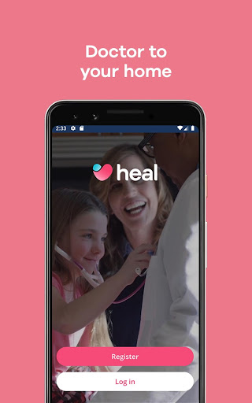
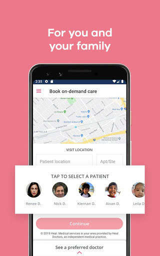

# Heal: Telehealth & House Calls
App version ``5.14.2``

Analyzed with [covid-apps-observer](http://github.com/covid-apps-observer) project, version ``0.1``

## App overview
| | |
|-------------------------|-------------------------| 
| **Name**&nbsp;&nbsp;&nbsp;&nbsp;&nbsp;&nbsp;&nbsp;&nbsp;&nbsp;&nbsp;&nbsp;&nbsp;&nbsp;&nbsp;&nbsp;&nbsp;&nbsp;&nbsp;&nbsp;&nbsp;&nbsp;&nbsp;&nbsp;&nbsp;&nbsp;&nbsp;&nbsp;&nbsp;&nbsp;&nbsp;&nbsp;&nbsp;&nbsp;&nbsp;&nbsp;&nbsp;&nbsp;&nbsp;&nbsp;&nbsp;  | Heal: Telehealth & House Calls |
| **Unique identifier** | com.getheal.patient |
| **Link to Google Play** | [https://play.google.com/store/apps/details?id=com.getheal.patient](https://play.google.com/store/apps/details?id=com.getheal.patient) |
| **Summary**  | Talk to a Heal Doctor over video chat, 8am-8pm, 365 days, covered by insurance |
| **Privacy policy** | [https://www.heal.com/privacy](https://www.heal.com/privacy) |
| **Latest version** | 5.14.2 |
| **Last update** | 2021-04-02 17:57:35 |
| **Recent changes** | House calls are back, with safety in mind. We are pleased to announce that we are resuming home visits in ZIP codes where Heal house calls are available. Medical staff will be wearing face masks, gloves, and disposable gowns. Their temperature is checked twice daily. If you have one, please wear a face mask during your visit. If you have symptoms, such as fever, cough, shortness of breath, body aches, or sore throat, then please choose the &#39;Talk to a doctor&#39; option. |
| **Installs**  | 50,000+ |
| **Category** | Medical |
| **First release** | May 5, 2015 |
| **Size**  | 65M |
| **Supported Android version**  | 7.0 and up |

### Description
> IMPORTANT UPDATE
 For the safety of patients and Heal's physician teams during this time, effective March 24th, 2020 Heal will no longer provide house calls as a first visit. 
 Patients can use the Heal app to book a telemedicine video call and receive care remotely from a licensed, qualified, and caring Heal Doctor.
 For more information about the changes to Heal's service in response to the national emergency, please visit: heal.com
 What the press is saying about Heal:
 • WSJ — "The Heal app sent an excellent Stanford-trained doctor to my door in under an hour."
 • New York Times — "Bringing back old-school techniques with new-school technology."
 • USA Today — "Heal will bring a well qualified doctor right to your own house — no months-long waiting for an appointment or germy waiting rooms needed."
 Heal telemedicine video calls and house calls are currently available in: 
 • California, in Los Angeles, the Inland Empire, Orange County, Sacramento, San Diego, and the San Francisco Bay Area
 • Georgia, in the Greater Atlanta area
 • New York, in New York City, in the Manhattan, Queens, and Brooklyn boroughs
 • The Washington DC area, including Northern Virginia
 • Washington State, in Seattle and Spokane 
 Need to contact the Heal Patient Support team? 
 Visit heal.com/help-center or call toll-free (844) 644-4325
 • Heal Doctors are licensed, highly trained, and thoroughly vetted physicians and providers. 
 • Heal accepts Medicare insurance in California, Washington DC, Georgia and New York. Washington state and New Jersey are coming soon.
 • In California, Heal is in network with the following insurance providers: Aetna, Alignment, Anthem Blue Cross California, BlueShield, TRICARE West, Cigna, GEHA, Health Net, HealthSCOPE, Molina Healthcare, Humana, California Preferred IPA, UMR, and UnitedHealthcare.
 • In Georgia, Heal is in network with the following insurance providers: Aetna, Anthem, Humana, UnitedHealthcare and Wellcare Health.
 • In New York, Heal is in network with the following insurance providers: Empire and Oscar (and Cigna and UnitedHealthcare soon) 
 • In Washington DC, Heal is in network with the following insurance provider: CareFirst BCBS.
 • In Washington state, Heal is in network with the following insurance providers: Aetna, BridgeSpan Health, and Regence BlueShield.
 • With insurance, the cost of a Heal telemedicine call is typically just your copay. Without insurance, a telemedicine call is just $79.
 • With insurance, the cost of a Heal house call is typically just your copay. Without insurance, a house call is just $159.
 • There are no additional costs for seeing a doctor on-demand using Heal. All lab tests and prescriptions are paid separately.
 • Use Google Pay to pay quickly and securely.
 • Create a profile for each member of your household.
 • Set your Preferred Doctor to see the same doctor again and view their schedule first. Each family member can have their own Preferred Doctor.
 Licensed, background-checked, caring doctors and providers on-demand 7 days a week:
 • Pediatricians for kids
 • General practice and internal medicine doctors for adults
 • Family medicine doctors for the whole family

### User interface
The developers of the app provide the following screenshots in the Google play store.
| | | |
|:-------------------------:|:-------------------------:|:-------------------------:|
 |   |   |   | 
 |   |   |   | 
 |   |  

## Development team
In the following we report the main information provided by the development team in the Google play store.

| | |
|-------------------------|-------------------------|
| **Developer**  | Heal |
| **Website**  | [https://www.heal.com](https://www.heal.com) |
| **Email** | developer@heal.com |
| **Physical address**  | - |
| **Other developed apps**  | [https://play.google.com/store/apps/developer?id=Heal](https://play.google.com/store/apps/developer?id=Heal) |

## Android support

| | |
|-------------------------|-------------------------|
| **Declared target Android version**  | - |
| **Effective target Android version**  | - |
| **Minimum supported Android version**  | Nougat, version 7.0 (API level 24) |
| **Maximum target Android version**  | - |

The larger the difference between the minimum and maximum supported Android versions, the better. A larger difference means a wider audience. For example, old phones have a very low Android version, so a high minimum supported Android version means that the app cannot be used by users with old phones, thus leading to accessibility problems. 

## Requested permissions

In the following we report the complete list of the permissions requested by the app. 

| **Permission** | **Protection level** | **Description** | 
|-------------------------|-------------------------|-------------------------|
 **android.permission ACCESS_COARSE_LOCATION** | :warning:**Dangerous** | Allows an app to access approximate location. 
 **android.permission ACCESS_FINE_LOCATION** | :warning:**Dangerous** | Allows an app to access precise location. 
 **android.permission ACCESS_NETWORK_STATE** | Normal | Allows applications to access information about networks. 
 **android.permission ACCESS_WIFI_STATE** | Normal | Allows applications to access information about Wi-Fi networks. 
 **android.permission BLUETOOTH** | Normal | Allows applications to connect to paired bluetooth devices. 
 **android.permission CAMERA** | :warning:**Dangerous** | Required to be able to access the camera device. 
 **android.permission FLASHLIGHT** | - | - 
 **android.permission INTERNET** | Normal | Allows applications to open network sockets. 
 **android.permission MODIFY_AUDIO_SETTINGS** | Normal | Allows an application to modify global audio settings. 
 **android.permission READ_CALENDAR** | :warning:**Dangerous** | Allows an application to read the user's calendar data. 
 **android.permission READ_EXTERNAL_STORAGE** | :warning:**Dangerous** | Allows an application to read from external storage. 
 **android.permission READ_PHONE_STATE** | :warning:**Dangerous** | Allows read only access to phone state, including the phone number of the device, current cellular network information, the status of any ongoing calls, and a list of any PhoneAccounts registered on the device. 
 **android.permission RECEIVE_BOOT_COMPLETED** | Normal | Allows an application to receive the Intent.ACTION_BOOT_COMPLETED that is broadcast after the system finishes booting. 
 **android.permission RECORD_AUDIO** | :warning:**Dangerous** | Allows an application to record audio. 
 **android.permission VIBRATE** | Normal | Allows access to the vibrator. 
 **android.permission WAKE_LOCK** | Normal | Allows using PowerManager WakeLocks to keep processor from sleeping or screen from dimming. 
 **android.permission WRITE_CALENDAR** | :warning:**Dangerous** | Allows an application to write the user's calendar data. 
 **android.permission WRITE_EXTERNAL_STORAGE** | :warning:**Dangerous** | Allows an application to write to external storage. 
 **com.getheal.patient.permission C2D_MESSAGE** | - | - 
 **com.google.android.c2dm.permission RECEIVE** | - | - 
 **com.google.android.finsky.permission BIND_GET_INSTALL_REFERRER_SERVICE** | - | - 
 **com.google.android.providers.gsf.permission READ_GSERVICES** | - | - 

## Mentioned servers

| **Server** | **Registrant** | **Registrant country** | **Creation date** | 
|-------------------------|-------------------------|-------------------------|-------------------------|
 | adobe.com | Adobe Inc. | :us: US | 1986-11-17 05:00:00 |
 | facebook.com | Facebook, Inc. | :us: US | 1997-03-29 05:00:00 |
 | google.com | Google LLC | :us: US | 1997-09-15 04:00:00 |
 | heal.com | Whois Privacy Service | :us: US | 1995-04-10 04:00:00 |
 | googlesyndication.com | Google LLC | :us: US | 2003-01-21 06:17:24 |
 | googleapis.com | Google LLC | :us: US | 2005-01-25 17:52:26 |
 | twitter.com | Twitter, Inc. | :us: US | 2000-01-21 16:28:17 |
 | doubleclick.net | Google Inc. | :us: US | 1996-01-16 05:00:00 |
 | googleapis.com | Google LLC | :us: US | 2005-01-25 17:52:26 |
 | gstatic.com | Google LLC | :us: US | 2008-02-11 15:31:25 |
 | google-analytics.com | Google LLC | :us: US | 2005-07-18 19:24:32 |
 | app-measurement.com | Google LLC | :us: US | 2015-06-19 20:13:31 |
 | googletagmanager.com | Google LLC | :us: US | 2011-11-11 23:39:05 |
 | googleapis.com | Google LLC | :us: US | 2005-01-25 17:52:26 |
 | googleadservices.com | Google LLC | :us: US | 2003-06-19 16:34:53 |
 | googleapis.com | Google LLC | :us: US | 2005-01-25 17:52:26 |
 | segment.com | Domains By Proxy, LLC | :us: US | 1998-07-06 04:00:00 |
 | segment.io | Segment.io, Inc. | :us: US | 2011-10-01 04:10:05 |
 | stripe.com | - | :us: US | 1995-09-12 04:00:00 |
 | branch.io | Branch | :us: US | 2011-11-10 13:52:13 |
 | crashlytics.com | Google LLC | :us: US | 2011-01-21 15:30:40 |
 | bnc.lt | - | - | 2016-11-14 00:00:00 |
 | zopim.com | Zendesk, Inc. | :us: US | 2006-11-16 10:30:59 |

## Security analysis 

Below we report the main security warnings raised by our execution of the [Androwarn](https://github.com/maaaaz/androwarn) security analysis tool.

**Telephony identifiers leakage**
> - This application reads the ISO country code equivalent for the SIM provider's country code 
> - This application reads the ISO country code equivalent of the current registered operator's MCC (Mobile Country Code) 
> - This application reads the MCC+MNC of the provider of the SIM 
> - This application reads the SIM's serial number 
> - This application reads the Service Provider Name (SPN) 
> - This application reads the alphabetic identifier associated with the voice mail number 
> - This application reads the constant indicating the state of the device SIM card 
> - This application reads the device phone type value 
> - This application reads the numeric name (MCC+MNC) of current registered operator 
> - This application reads the operator name 
> - This application reads the phone number string for line 1, for example, the MSISDN for a GSM phone 
> - This application reads the radio technology (network type) currently in use on the device for data transmission 
> - This application reads the unique device ID, i.e the IMEI for GSM and the MEID or ESN for CDMA phones 
> - This application reads the unique subscriber ID, for example, the IMSI for a GSM phone 
> - This application reads the voice mail number 

**Connection interfaces exfiltration**
> - This application reads details about the currently active data network 
> - This application tries to find out if the currently active data network is metered 

**Telephony services abuse**
> - This application makes phone calls 

**Suspicious connection establishment**
> - This application opens a Socket and connects it to the remote address '1' on the 'N/A' port  
> - This application opens a Socket and connects it to the remote address '2' on the 'N/A' port  
> - This application opens a Socket and connects it to the remote address '3' on the 'N/A' port  
> - This application opens a Socket and connects it to the remote address 'Ljava/net/Proxy;->type()Ljava/net/Proxy$Type;' on the 'N/A' port  
> - This application opens a Socket and connects it to the remote address 'timeout' on the 'N/A' port  

**Code execution**
> - This application loads a native library 

## User ratings and reviews

Below we provide information about how end users are reacting to the app in terms of ratings and reviews in the Google Play store.

### Ratings

The Heal: Telehealth & House Calls app has been installed by more than **50000** times. At this time, **481** rated the app and its average score is **4.42**. Below we show the distribution of the ratings across the usual star-based rating of Google Play

:star::star::star::star::star:: 382

:star::star::star::star:: 33

:star::star::star:: 9

:star::star:: 4

:star:: 53

### Reviews 

#### 5-star reviews

> Great app, even better healthcare!  :date: __2021-04-03 18:34:16__

> Dr Hart was delightful and kind. Knowledgeable about me and what I needed to do. I'm so happy that I found Dr Hart again. Thank you Dr Curving for giving him the message.  :date: __2021-03-27 18:16:26__

> Very good professional and comprehensive Nurse practitioner.... very supportive!  :date: __2021-03-25 18:38:12__

> Very good  :date: __2021-03-23 16:05:13__

> I really love this app. The drs are awesome. Really helped me with my medicine. Awesome!  :date: __2021-03-18 02:47:26__

> This is my first time setting up the Heal App. I will in the future let you know if it works for us. Thank you  :date: __2021-03-14 17:57:41__

> Great app. Nice clean UI. Does what it needs to do without getting in the way with too many bells and whistles.  :date: __2021-03-13 05:44:02__

> We have used the HEAL app since 2019 when my daughter was in bed for 3 days and couldn't move due to a headache. Dr. Mitton came out within hours to see her and properly diagnosed her with migraines (which run in my family). The process was amazing. She couldn't have walked out of the house to the car to get to our Dr so it was a blessing to have the Dr come to us. We have used the app a few times and will continue to do so in the future!  :date: __2021-03-12 15:33:44__

> Wonderful conversation with the Dr. She was very sweet and Her Concern was outstanding!  :date: __2021-03-03 05:54:10__

> I would have to come back and read this app later. All I could say is that the nurse assistant that came to see me was a very proficient, professional, and personable, young lady with a very wonderful attitude.  :date: __2021-02-22 02:39:28__

#### 4-star reviews

> I had a very good virtual visit with Dr. Lingad who reviewed my health-care issue today, March 29th. Thanks for assigning him to me.  :date: __2021-03-29 23:04:30__

> Better with Dr Mc Duffie.  :date: __2020-11-09 15:32:57__

> Great service, app can be a bit annoying, but it's full of useful information  :date: __2020-07-20 22:40:40__

> Despite a billing error, I had a great experience. I cant see going to a doctor's office again. The app itself is broken and the billing is messed up but the concept is fantastic.  :date: __2018-10-01 01:48:41__

> Love the service - extremely convenient for families with kids. 4 out 5 because I did have issues with the app timing out, which appears to have resolved by me reinstalling the app - which is a legit way to fix bugs ;) but does not deserve 5/5  :date: __2018-09-28 06:26:18__

> The app works great for scheduling and getting regular updates, but I wish 
I could access the care plans from within the app, rather than needing to 
go to the website; it makes me question why I should use the app over the 
website.  :date: __2018-05-04 18:36:50__

> Thought I would give it a try and was pleased. Showed up early in their window. Noted they claim they work with Cogna but not sure. For me the convenience was well worth the extra price over sitting in some ready center. Will use this service again.  :date: __2018-03-06 22:59:40__

> Great app, I needed the flu shot asap the doc showed up gave me the shot all done with in 10 minutes. I will definitely be using the heal app again.  :date: __2018-02-19 18:00:59__

> Ive heard about this app on Dr. Drews show. I belive this app has alot of potential but its not available in moreno valley. When can we expect more areas???  :date: __2016-05-23 20:04:57__

> My first time using this app I hope that I can I'll let you know in a few days thank you thank you  :date: __2016-03-11 11:33:20__

#### 3-star reviews

> I enjoy talking with the doctor  :date: __2021-01-14 02:47:50__

> There's a couple of issues within the teleconference option. One, on my Pixel 4 XL the front facing camera video is on Gray Scale, swapping between front and back cameras doesn't fix it. And two, there's no way to resume the video call intent if you send it to the background, it doesn't show up on the recent apps. I still can talk for a couple of seconds before the conference is killed and the doctor has to call again.  :date: __2020-05-06 18:49:22__

> Waiting patiently for HEAL to come to my area in Florida!  :date: __2019-10-29 03:29:26__

> My visit with the doctor was OK. He completely overreacted and recommended more testing then was really needed. Long story short, I ended up seeing my regular doctor anyway, which defeated the purpose of this app Plus, they now spam me everydsy with messsges. I might use this in the future in a pinch, but for now I'm uninstalling it.  :date: __2018-12-04 20:06:26__

> When entering birthday, a required field, the only method is using the pop up calendar which defaults to today's date and only let's you go back one month at a time, so if you are 30 years old, you need to tap the back arrow at least 360 times to get to your birthday, really? Why not allow someone to just type it in?? No healthy person would want to do this let alone a sick person. Terrible UI design.  :date: __2017-11-25 07:58:07__

> There is no services in the Las Vegas,  NV valley @ all.  We need the doctor sevices here.  We have to wait 2 to 3 months to get in for appointments.  It is a shame or waiting in line @ Urgent care for 2 or 3 hours..  :date: __2016-11-01 21:15:32__

> Wish it was available in my area.  :date: __2015-11-22 22:40:57__

> Do they take any insurance at all??  :date: __2015-08-17 01:35:28__

#### 2-star reviews

> There are multiple issues with this app. 1. There needs to be a visual timestamp. Especially in chat. It's obvious as to why it's not there, but it would and should be displayed ethically. 2. There should be a way to set an audible notification, as I have no idea until I look again, whether or not my chat has been answered.  :date: __2021-01-26 21:36:42__

> This app is pretty buggy. I couldn't open or find any of the documents I was sent. I finally went to the website. Also, it keeps asking to verify my email, and then decides that I've already verified. And also, the app icon is the default android icon...  :date: __2019-08-20 22:15:47__

> The app has not allowed me to select a date for appointments for two months. It freezes and I have to close the app entirely, then call anyway to make my appointments. The frustration compounds when appointments are cancelled and I have to repeat the process.  :date: __2019-07-18 03:08:25__

> Good service, bad app: you will get annoying notifications promoting the app, which interfere with the need to allow useful notifications from the app. When clicking on these notifications, they disappear and cannot be read (you're taken to the "schedule a service" view). Consequently, I just choose to disable all notifications from this app using the Android OS settings. It's a bit ironic that the assault of notification spam is incompatible with mental health, isn't it?  :date: __2018-12-05 18:14:31__

> The service is terrific but the app is no longer working well. I have to use the website rather than the app to schedule my appointments.  :date: __2018-09-23 18:26:18__

> Live in Walnut Creek. One side of the street has service, other side doesn't. Mind blown!  :date: __2018-01-13 20:25:11__

> I'm trying to use it because I am sick but it won't let me save any of my information on it on the profile everytime I hit the save button it just spins a circle like it saving but then if I go back out of it because it does nothing afterwards it just cleared everything out and nothing gets saved so I really never got to use the app at all  :date: __2017-09-12 18:56:17__

> App doesn't work.  Actually needed it last week and it failed.  Wound up going to the local urgent care instead.  Waste of time to even use it...  :date: __2017-04-27 20:41:02__

> The App only works from 8am to 8pm.  :date: __2015-07-02 08:10:07__

#### 1-star reviews

> This app is not user friendly. I don't understand it at all.  :date: __2021-03-03 22:26:35__

> When trying to schedule, it takes forever trying to reach the screen and then displays a non-English-readable (i.e. system code) error.  :date: __2021-02-27 19:49:07__

> This app goes from creating a new account to immediately wanting to book a doctor appointment and input a credit card#. No mention of copays, insurance, or how/when/if your health records are obtained. Overall, the app feels more like an old-school magazine subscription service with silly clipart, rather than a high-tech health app. During Live Chat, I was told that a house visit costs $189.06 (their website says $159). A phone consult is $189.06 as well, or "only" $79 if you pay cash. That makes this the priciest telemed app on my list of choices, and it is now off my list. I would have saved time and annoyance skipping this app and looking for telehealth services elsewhere.  :date: __2021-02-27 18:33:44__

> They canceled a vaccination appointment for my senior parent without warning and provided no help to restore the appointment due to their error  :date: __2021-02-07 04:43:11__

> This app interrupted my usage of it to ask me to rate it, which as per policy is an automatic one star rating.  :date: __2021-01-20 02:42:00__

> To many problems not honest at all complete lies Message me back  :date: __2020-12-03 20:03:50__

> Waste of time  :date: __2020-11-21 15:57:43__

> Web shows 30.00 on site flu shots for the elderly, in this case my 89 year old mother.. Once you register its 79.00. Uninstalled app and will never use or recommend. Be honest and upfront.  :date: __2020-09-17 04:28:56__

> I can't sign on through Blue Shield. The app constantly crashes.  :date: __2020-09-07 19:37:29__

> Works 50% of the time  :date: __2020-08-05 22:06:00__

