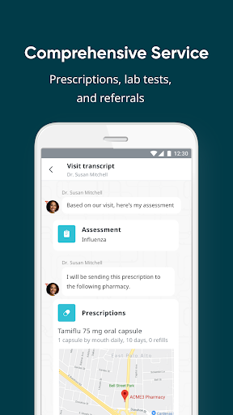
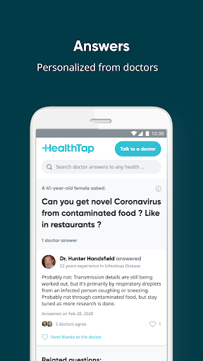
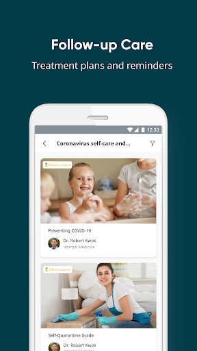
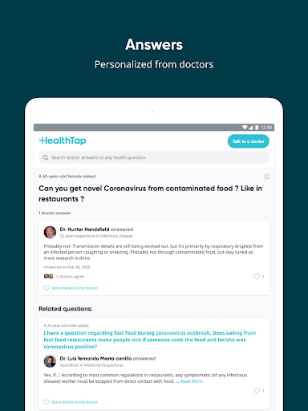
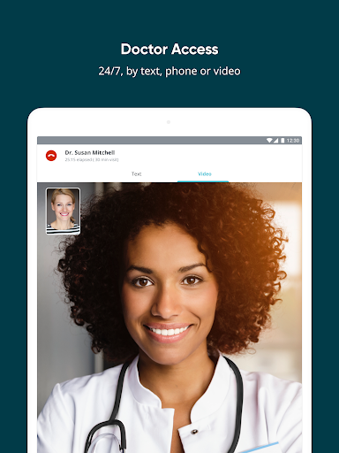

# HealthTap — 24/7 Telemedicine
App version ``7.26.1``

Analyzed with [covid-apps-observer](http://github.com/covid-apps-observer) project, version ``0.1``

## App overview
| | |
|-------------------------|-------------------------| 
| **Name**                                          | HealthTap — 24/7 Telemedicine |
| **Unique identifier** | com.healthtap.userhtexpress |
| **Link to Google Play** | [https://play.google.com/store/apps/details?id=com.healthtap.userhtexpress](https://play.google.com/store/apps/details?id=com.healthtap.userhtexpress) |
| **Summary**  | High-quality healthcare from doctors you can trust, 24/7, from any device |
| **Privacy policy** | [https://www.healthtap.com/privacy/statement](https://www.healthtap.com/privacy/statement) |
| **Latest version** | 7.26.1 |
| **Last update** | 2020-12-01 09:47:19 |
| **Recent changes** | • HealthTap is now accepting insurance to cover 24/7 virtual doctor visits! Many plans cover 100% of telemedicine costs. • No insurance or high-deductible plan? We still offer our affordable monthly membership for 24/7 virtual doctor visits. |
| **Installs**  | 1,000,000+ |
| **Category** | Medical |
| **First release** | Sep 25, 2011 |
| **Size**  | 25M |
| **Supported Android version**  | 4.1 and up |

### Description
> HealthTap gives you 24/7 access to top U.S. board-certified doctors with or without insurance.
 Two ways to tap in:
 Monthly membership (when you’re not using insurance). $45 for the first visit, then after you will have access to 24/7 virtual doctor visits for just $10 per month.
 Pay-per-visit (when you’re using insurance). Costs vary based on insurance copay and deductible. Many plans cover 100%!
 Unlike other on-demand providers, HealthTap connects you with a doctor via text or video in less than one minute--not hours or even the next day. We also don’t require you to answer a bunch of questions in advance. You can see a doctor immediately.
 HealthTap doctors can diagnose and treat you and your family when you’re ill or have a health concern. They can send medically necessary prescriptions to your pharmacy, order lab tests, and recommend specialists if you need ongoing care. After your doctor visit, you will get a treatment plan with easy-to-follow instructions and reminders to help you stay on track.
 Note that certain medications including controlled substances must be prescribed by a specialist or with an in-person visit, and cannot be ordered by HealthTap doctors or any other on-demand provider.
 In addition to seeing a doctor anytime, with HealthTap you can:
 1. ASSESS your symptoms with our artificial intelligence-powered symptom checker
 2. SEARCH our library of patient-asked, doctor-answered medical questions
 3. ASK written questions and get personalized, doctor-written answers in 24 hours or less
 HealthTap will build your health dossier and store all your data in one place. This includes medical treatments, prescriptions, labs, wearable devices, and doctor visit notes — and it all works together to provide a more personalized experience.
 100% SECURE & CONFIDENTIAL
 We take your privacy very seriously. Your visit with the doctor is confidential and HIPAA compliant.
 What people are saying:
 PC Magazine - "The next time you have a medical question… try asking the doctors on HealthTap."
 *Virtual doctor visits currently not available for people in Alaska and Idaho
 Copyright © 2020 HealthTap, Inc. All Rights Reserved.
 HealthTap may not be available in certain states and is subject to state regulations. HealthTap does not replace the primary care physician, is not an insurance product, and may not be able to substitute for traditional in-person care in every case or for every condition.
 HealthTap does not guarantee patients will receive a prescription, does not prescribe DEA controlled substances and may not prescribe non-therapeutic drugs and certain other drugs which may be harmful because of their potential for abuse.
 For complete terms of use visit www.healthtap.com/terms

### User interface
The developers of the app provide the following screenshots in the Google play store.
| | | |
|:-------------------------:|:-------------------------:|:-------------------------:|
 |   |   |   | 
 |   |   |   | 
 |   |   |   | 
 |   |   |   | 

## Development team
In the following we report the main information provided by the development team in the Google play store.

| | |
|-------------------------|-------------------------|
| **Developer**  | HealthTap |
| **Website**  | [https://www.healthtap.com/](https://www.healthtap.com/) |
| **Email** | support@healthtap.com |
| **Physical address**  | - |
| **Other developed apps**  | [https://play.google.com/store/apps/developer?id=HealthTap](https://play.google.com/store/apps/developer?id=HealthTap) |

## Android support

| | |
|-------------------------|-------------------------|
| **Declared target Android version**  | Android10, version 10 (API level 29) |
| **Effective target Android version**  | Android10, version 10 (API level 29) |
| **Minimum supported Android version**  | Jelly Bean, version 4.1.x (API level 16) |
| **Maximum target Android version**  | - |

The larger the difference between the minimum and maximum supported Android versions, the better. A larger difference means a wider audience. For example, old phones have a very low Android version, so a high minimum supported Android version means that the app cannot be used by users with old phones, thus leading to accessibility problems. 

## Requested permissions

In the following we report the complete list of the permissions requested by the app. 

| **Permission** | **Protection level** | **Description** | 
|-------------------------|-------------------------|-------------------------|
 **android.permission ACCESS_COARSE_LOCATION** | :warning:**Dangerous** | Allows an app to access approximate location. 
 **android.permission ACCESS_FINE_LOCATION** | :warning:**Dangerous** | Allows an app to access precise location. 
 **android.permission ACCESS_NETWORK_STATE** | Normal | Allows applications to access information about networks. 
 **android.permission ACCESS_WIFI_STATE** | Normal | Allows applications to access information about Wi-Fi networks. 
 **android.permission BLUETOOTH** | Normal | Allows applications to connect to paired bluetooth devices. 
 **android.permission BROADCAST_STICKY** | Normal | Allows an application to broadcast sticky intents. 
 **android.permission CAMERA** | :warning:**Dangerous** | Required to be able to access the camera device. 
 **android.permission CHANGE_NETWORK_STATE** | Normal | Allows applications to change network connectivity state. 
 **android.permission GET_ACCOUNTS** | :warning:**Dangerous** | Allows access to the list of accounts in the Accounts Service. 
 **android.permission GET_TASKS** | Deprecated | This constant was deprecated in API level 21. No longer enforced. 
 **android.permission INTERNET** | Normal | Allows applications to open network sockets. 
 **android.permission MODIFY_AUDIO_SETTINGS** | Normal | Allows an application to modify global audio settings. 
 **android.permission READ_EXTERNAL_STORAGE** | :warning:**Dangerous** | Allows an application to read from external storage. 
 **android.permission READ_PHONE_STATE** | :warning:**Dangerous** | Allows read only access to phone state, including the phone number of the device, current cellular network information, the status of any ongoing calls, and a list of any PhoneAccounts registered on the device. 
 **android.permission RECEIVE_BOOT_COMPLETED** | Normal | Allows an application to receive the Intent.ACTION_BOOT_COMPLETED that is broadcast after the system finishes booting. 
 **android.permission RECORD_AUDIO** | :warning:**Dangerous** | Allows an application to record audio. 
 **android.permission USE_BIOMETRIC** | Normal | Allows an app to use device supported biometric modalities. 
 **android.permission USE_FINGERPRINT** | Normal | This constant was deprecated in API level 28. Applications should request USE_BIOMETRIC instead 
 **android.permission VIBRATE** | Normal | Allows access to the vibrator. 
 **android.permission WAKE_LOCK** | Normal | Allows using PowerManager WakeLocks to keep processor from sleeping or screen from dimming. 
 **android.permission WRITE_EXTERNAL_STORAGE** | :warning:**Dangerous** | Allows an application to write to external storage. 
 **com.google.android.c2dm.permission RECEIVE** | - | - 
 **com.google.android.finsky.permission BIND_GET_INSTALL_REFERRER_SERVICE** | - | - 
 **com.google.android.providers.gsf.permission READ_GSERVICES** | - | - 

## Mentioned servers

| **Server** | **Registrant** | **Registrant country** | **Creation date** | 
|-------------------------|-------------------------|-------------------------|-------------------------|
 | amplitude.com | Amplitude | :us: US | 1996-05-09 04:00:00 |
 | braintreegateway.com | PayPal Inc. | :us: US | 2009-10-06 23:05:33 |
 | w3.org | W3C | :us: US | 1994-07-06 04:00:00 |
 | xml.org | OASIS Open | :us: US | 1997-02-03 05:00:00 |
 | xmlpull.org | WhoisGuard, Inc. | PA | 2001-11-26 20:33:08 |
 | googlesyndication.com | Google LLC | :us: US | 2003-01-21 06:17:24 |
 | google.com | Google LLC | :us: US | 1997-09-15 04:00:00 |
 | googleapis.com | Google LLC | :us: US | 2005-01-25 17:52:26 |
 | app-measurement.com | Google LLC | :us: US | 2015-06-19 20:13:31 |
 | googleapis.com | Google LLC | :us: US | 2005-01-25 17:52:26 |
 | healthtap.com | HealthTap | :us: US | 2002-01-12 05:37:51 |
 | googleapis.com | Google LLC | :us: US | 2005-01-25 17:52:26 |
 | crashlytics.com | Google LLC | :us: US | 2011-01-21 15:30:40 |
 | googleadservices.com | Google LLC | :us: US | 2003-06-19 16:34:53 |
 | kaptcha.com | Domain Privacy Service FBO Registrant. | :us: US | 2006-09-12 15:14:53 |
 | paypal.com | PayPal Inc. | :us: US | 1999-07-15 05:32:11 |
 | paypalobjects.com | PayPal Inc. | :us: US | 2005-05-12 17:11:21 |
 | zendesk.com | Zendesk, Inc. | :us: US | 2005-05-16 18:05:12 |
 | cvs.com | CVS Pharmacy, Inc. | :us: US | 1996-01-30 05:00:00 |

## Security analysis 

Below we report the main security warnings raised by our execution of the [Androwarn](https://github.com/maaaaz/androwarn) security analysis tool.

**Telephony identifiers leakage**
> - This application reads the ISO country code equivalent for the SIM provider's country code 
> - This application reads the ISO country code equivalent of the current registered operator's MCC (Mobile Country Code) 
> - This application reads the MCC+MNC of the provider of the SIM 
> - This application reads the SIM's serial number 
> - This application reads the Service Provider Name (SPN) 
> - This application reads the constant indicating the state of the device SIM card 
> - This application reads the current location of the device 
> - This application reads the device phone type value 
> - This application reads the numeric name (MCC+MNC) of current registered operator 
> - This application reads the operator name 
> - This application reads the unique device ID, i.e the IMEI for GSM and the MEID or ESN for CDMA phones 
> - This application reads the unique subscriber ID, for example, the IMSI for a GSM phone 
> - This application reads the Cell ID value 
> - This application reads the Location Area Code value 

**Location lookup**
> - This application reads location information from all available providers (WiFi, GPS etc.) 

**Connection interfaces exfiltration**
> - This application reads details about the currently active data network 

**Telephony services abuse**
> - This application makes phone calls 

**Suspicious connection establishment**
> - This application opens a Socket and connects it to the remote address '' on the 'N/A' port  
> - This application opens a Socket and connects it to the remote address 'Lch/boye/httpclientandroidlib/HttpHost;->getPort()I' on the 'Lch/boye/httpclientandroidlib/HttpHost;->getPort()I' port  
> - This application opens a Socket and connects it to the remote address 'Ljava/lang/StringBuilder;->toString()Ljava/lang/String;' on the 'N/A' port  
> - This application opens a Socket and connects it to the remote address 'Ljava/net/Proxy;->type()Ljava/net/Proxy$Type;' on the 'N/A' port  
> - This application opens a Socket and connects it to the remote address 'timeout' on the 'N/A' port  

**Pim data leakage**
> - This application accesses the downloads folder 
> - This application accesses data stored in the clipboard 

**Code execution**
> - This application loads a native library 
> - This application loads a native library: 'crashlytics' 
> - This application loads a native library: 'pl_droidsonroids_gif' 
> - This application executes a UNIX command containing this argument: '2' 

## User ratings and reviews

Below we provide information about how end users are reacting to the app in terms of ratings and reviews in the Google Play store.

### Ratings

The HealthTap — 24/7 Telemedicine app has been installed by more than **1000000** times. At this time, **17385** rated the app and its average score is **4.487371**. Below we show the distribution of the ratings across the usual star-based rating of Google Play

:star::star::star::star::star:: 13475

:star::star::star::star:: 1726

:star::star::star:: 638

:star::star:: 279

:star:: 1267

### Reviews 

#### 5-star reviews

> Easy to do.  :date: __2020-11-30 20:13:13__

> I LOVE THIS APP SUPER EASY ,SUPER HELPFUL, LOVE IT  :date: __2020-11-29 13:54:30__

> Very productive  :date: __2020-11-28 20:25:40__

> Health Tap has very professional doctors and make it easy for me to get my refills in between visits with my primary doctor! Also, more affordable than Lemonaid Health and K Health.  :date: __2020-11-28 00:05:46__

> Yes it told me everything i wanted to know  :date: __2020-11-24 22:27:14__

> Awesome  :date: __2020-11-24 10:33:06__

> Love being able to talk to a doctor when I need to without jumping through a million hoops or waiting hours for a callback. One of the best telemedicine companies I have ever worked with.  :date: __2020-11-23 19:13:01__

> Loved very quick easy and affordable as i do not have insurance and i also work crazy hours so this was nice  :date: __2020-11-20 18:28:48__

> Excellent service and was completed in 15 minutes. Awesome app and great price too!!!  :date: __2020-11-20 16:36:00__

> Very straight forward easy to use 10 bucks for a dr. This is great  :date: __2020-11-20 06:33:47__

#### 4-star reviews

> The video portion did not work but the appointment was completed and prescription sent in a matter of minutes. $10 a month is a great value for such quick service, I will be sticking with HealthTap!  :date: __2020-09-27 18:34:49__

> So far so good. Haven't done much in it. Will reevaluate  :date: __2020-07-24 00:16:01__

> Helpful. But hope there is a suggestion for home remedy temporary treatment before suggesting to seek immediate help  :date: __2020-06-09 04:00:32__

> I dont know just downloded the app today  :date: __2020-05-24 23:33:54__

> Good  :date: __2020-05-18 18:15:33__

> Could be better with bigger list of symptoms  :date: __2020-04-02 03:53:57__

> Very helpful  :date: __2020-04-01 13:46:54__

> Very good app  :date: __2020-01-20 21:49:58__

> Just got the app  :date: __2019-09-29 17:13:43__

> l've just started using it so far it's going great  :date: __2019-07-31 23:32:45__

#### 3-star reviews

> So far so good. App is easy to fill out. After my appointment with the doctor I'll come back with a final decision and change my star rating according to that experience.  :date: __2020-05-12 16:10:00__

> Good  :date: __2020-03-13 08:34:50__

> Good!  :date: __2019-10-18 13:23:30__

> Is a great service with great providers. one downside though is that I couldn't get an answer from my Doctor due to the app being buggy.  :date: __2019-04-20 03:40:59__

> Symptom checker need further enhancement  :date: __2018-10-14 16:27:26__

> Full of bugs in new version, I can't open my notifications, I can't see my questions. Another thing is that you ask a simple yes or no question but the doctors answer something else.  :date: __2018-09-07 23:00:52__

> As much as I like this service since it keeps me from needing to go to a 
doctor's office, it needs work. I have done two consults now as a Prime 
member. My prescriptions were not actually called in on either one, 
resulting in extra time and visits needed at my pharmacies.  :date: __2018-08-03 15:34:35__

> I used once without an issue. Now I've paid for another consult but had no 
response from the physician and I keep getting a pop up about verifying my 
email but the link is never sent (I've checked all folders). So now I'm 
just out $50??  :date: __2018-07-29 04:51:44__

> I don't care for the app too much  :date: __2018-02-25 19:30:18__

> The actual appointments are costly and I was not able to see a doctor from Colorado via video chat for diagnosis  :date: __2018-02-05 06:26:10__

#### 2-star reviews

> We downloaded this app one VERY busy week ...my daughters middle finger had gotten infected due to the several open areas she has because of eczema. The doctor we spoke to on the app seemed to think that going to the ER for IV antibiotics was the only thing that would help her. So we headed to the ER... the dr there wrote a prescription for oral antibiotics. THIS IS A SUBSCRIPTION. THEY CONTINUED BILLING MY CARD MONTHLY UNTIL I CANCELLED IT!  :date: __2020-11-08 10:05:40__

> Great at first, but ur new policy sucks. At first I was thrilled I wouldn't have to wait for open enrollment and could get treated using this app, by virtual means. After filling out the account info within a matter of seconds I was able to speak to a kindly doc who prescribed me a medication for my severe anxiety and depression due to PMDD. However today, I had dosage questions and hoped my dosage could be altered, but was told no more psychiatric Rx's can be prescribed online. Back to sq 1!🤦  :date: __2020-08-28 17:42:33__

> Wait is long for answers. I've waited over two days with no response. You have to pay for faster answers, which is understandable. Just be aware that the free service could have you waiting quite a while for any responses. You might be better off with other services.  :date: __2019-10-03 13:28:51__

> stomach pain  :date: __2019-01-17 00:45:53__

> Was using the service for over a year and consulting with Dr Leslie Hart. 
They changed the service now I cant find her, get my meds anymore and have 
been going through hell. Thanks HealthTap for changing services on people 
who now can't get their meds.  :date: __2018-08-10 19:23:24__

> I'm not going to be paying for this after my trial ends, as it shuts down every time a consult begins. Doesn't let me do a thing. I already paid 19.99 and I'm asking for a refund.  :date: __2018-01-06 19:21:22__

> I didn't think that we would have to pay to ask questions! It's kind of unfair! If we had to pay to ask questions you should've just charged to download the app! I had an really important question and I'm sure no one can answer for me !  :date: __2016-06-24 17:58:56__

> Wouldn't let me add or update. I kept trying but it would not work.  Plus it kept asking me to upgrade to add money.  :date: __2016-03-23 15:29:33__

> I've asked questions twice now without an answer. I guess now you have to pay if you want your question answered. As recent as last fall I had my questions answered within 24 hours. Uninstalling.  :date: __2016-03-12 21:59:11__

> It keeps saying cannot play video cant use the app. It always says cannot play video -.-  :date: __2016-02-11 14:06:09__

#### 1-star reviews

> Tricked me out of $50. Don't use this. Thought I could get my standard medications from here. Nope. Was told they can't send anxiety medications. "Dr" instructed me that I had to be seen by my pcp. Kept my composure, thanked the "Dr" and canceled my account. Now I'm out of $50. Dont make the mistake I made. I'm going to go back to trying to get KHealth to work....  :date: __2020-11-30 15:32:28__

> Can't easily put in date of birth  :date: __2020-11-27 05:07:52__

> Forces you to pay $45 set up fee or $65 per month for a Basic Membership. No longer affordable.  :date: __2020-11-23 09:59:37__

> No help  :date: __2020-11-18 04:21:34__

> NEVER WORKS! They've now got my money and I've got no help!  :date: __2020-10-31 20:42:45__

> been 3 days and no one reply to my question yet  :date: __2020-10-05 22:22:29__

> Its false advertising ! All I asked for was a note to get a memory foam mattress topper in a sober living home, just a note he couldn't even do that. Ser vice is a rip off for real..  :date: __2020-09-27 07:50:53__

> Horrible registration process. It asks for location. I allow the location and it detects im not in US but registration requires my address and the phone which will be used for collecting the prescription and select the pharmacy in US when obviously i will not be able to go there! And you cant register without doing these steps! And in their website says for non US residents you can still use to get the diagnostic etc. Meh, another useless app in the store  :date: __2020-09-26 21:42:28__

> The app rules is unclear, it's so disappointing  :date: __2020-09-20 00:04:59__

> UNEXCUSABLE. Go to purchase $10 subscription for Virtual Dr and upon entering all my payment Info, it tells me the payment didn't work so I went back and did it again. Same outcome. I went to PayPal to check the history be and turns out I was charged $1 authorization charge BOTH times. No refund, no Customer service help, NOTHING. Sends NOT one payment verification info but would have kept charging $1 each time trying to update payment. HEALTH TAP SHOULD BE ASHAMED  :date: __2020-08-24 12:53:33__

