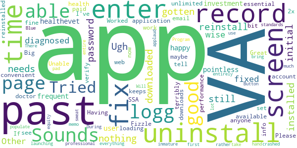

# iBlueButton
App version ``10.0.0.23``

Analyzed with [covid-apps-observer](http://github.com/covid-apps-observer) project, version ``0.1``

## App overview
| | |
|-------------------------|-------------------------| 
| **Name**&nbsp;&nbsp;&nbsp;&nbsp;&nbsp;&nbsp;&nbsp;&nbsp;&nbsp;&nbsp;&nbsp;&nbsp;&nbsp;&nbsp;&nbsp;&nbsp;&nbsp;&nbsp;&nbsp;&nbsp;&nbsp;&nbsp;&nbsp;&nbsp;&nbsp;&nbsp;&nbsp;&nbsp;&nbsp;&nbsp;&nbsp;&nbsp;&nbsp;&nbsp;&nbsp;&nbsp;&nbsp;&nbsp;&nbsp;&nbsp;  | iBlueButton |
| **Unique identifier** | com.humetrix.iBlueButton |
| **Link to Google Play** | [https://play.google.com/store/apps/details?id=com.humetrix.iBlueButton](https://play.google.com/store/apps/details?id=com.humetrix.iBlueButton) |
| **Summary**  | Multi award-winning app to access Blue Button health records anytime, anywhere. |
| **Privacy policy** | [https://ice.ibluebutton.com/docs/ibb/privacy_policy.html](https://ice.ibluebutton.com/docs/ibb/privacy_policy.html) |
| **Latest version** | 10.0.0.23 |
| **Last update** | 2021-03-14 04:56:32 |
| **Recent changes** | Bug Fixes for EPIC Immunizations |
| **Installs**  | 10,000+ |
| **Category** | Medical |
| **First release** | Dec 3, 2011 |
| **Size**  | 12M |
| **Supported Android version**  | 4.4 and up |

### Description
> iBlueButton has been designed to specifically serve Medicare beneficiaries, Veterans, Americans covered by HUMANA, the Military and their family covered by TRICARE and those receiving care from the nearly 400 healthcare systems and thousands of physician offices iBlueButton supports. With iBlueButton, you have in your hands at all times your medical information to better manage your healthcare, avoid preventable medical errors, and receive safer and more effective care. 
 iBlueButton won the U.S. Department of Health and Human Services Industry Innovation competition for its Blue Button® program, to give Americans the ability to access their Blue Button health records. iBlueButton was the first native mobile application approved by the Center for Medicare and Medicaid Services (CMS) for Americans covered by Medicare to make use their Medicare Blue Button data to receive safer healthcare. iBlueButton is also one of only four applications approved by the VA for Veterans to access their VA health records and has been partner of the VA since 2011, and in 2021 iBlueButton was the first mobile application approved by Humana.
 For Medicare and Humana beneficiaries along with their approved caregivers, iBlueButton lets you login into your account at MyMedicare.gov or Humana and retrieve your medical history. Your health information is automatically translated on your phone or tablet from your Medicare or Humana claim  information into an organized medical history in all of its useful details. 
 When accessing VA or your other healthcare provider health records, iBlueButton additionally displays your lab results in organized lab panels with indication of normal ranges and graphs so that you can see lab value trends overtime. To get more information for each laboratory test, iBlueButton provides one-tap look ups through Medline Plus, a service of the National Library of Medicine. 
 - ALL IN YOUR HANDS
 iBlueButton pulls and organizes multiple records into a single Summary Record, with all critical information in easy to view sections (medications, conditions, laboratory test results, etc.) and your detailed medical history (physician visits, hospitalizations, etc.). This Summary Record is available at all times to review, research, share, print and annotate critical health information. iBlueButton’s on device architecture fosters privacy and security and allows for data to be accessible even if you are not connected to the Internet.
 - PERSONALIZED SAFETY WARNINGS
 Whether it is about the medications you currently take, a new one recently prescribed, an existing condition, or new medical condition iBlueButton automatically generates safety warnings and best care practices based on well-established guidelines. iBlueButton now also offers COVID-19 related alerts, including an alert if you are at risk of severe COVID-19 infection, and an alert about eligibility to receive the COVID-19 vaccine.
 - LIFE AND COST SAVING
 On average every year, a Medicare beneficiary sees seven different physicians and most of the time any one of these physicians will not have a view of the full medical history of their patients, which can be the cause of medical errors, unnecessary tests, and avoidable healthcare expenses. Veterans and military personnel and their families experience these same healthcare issues, as their care takes place not only in VA and military health facilities, but also in the private sector. iBlueButton helps you prevent dangerous medical errors by having with you, anytime and anywhere, your critical medical history.
 - SECURE AND PRIVATE
 Unlike most personal health applications, iBlueButton stores your information securely encrypted on your own mobile device. Under your sole control, your personal health information is retrieved by your app from the data source and goes directly on your mobile device where it is securely stored. None of your personal data is processed or stored in the cloud or seen by Humetrix.

### User interface
The developers of the app provide the following screenshots in the Google play store.
| | | |
|:-------------------------:|:-------------------------:|:-------------------------:|
 |   |   |   | 
 |   |   |   | 
 |  

## Development team
In the following we report the main information provided by the development team in the Google play store.

| | |
|-------------------------|-------------------------|
| **Developer**  | Humetrix, Inc. |
| **Website**  | [http://www.ibluebutton.com/](http://www.ibluebutton.com/) |
| **Email** | ibb.support@humetrix.com |
| **Physical address**  | [1310 Camino Del Mar, Suite C Del Mar, CA 92014](https://www.google.com/maps/search/1310%20Camino%20Del%20Mar,%20Suite%20C%20Del%20Mar,%20CA%2092014) (Google Maps) |
| **Other developed apps**  | [https://play.google.com/store/apps/developer?id=Humetrix,+Inc.](https://play.google.com/store/apps/developer?id=Humetrix,+Inc.) |

## Android support

| | |
|-------------------------|-------------------------|
| **Declared target Android version**  | Android10, version 10 (API level 29) |
| **Effective target Android version**  | Android10, version 10 (API level 29) |
| **Minimum supported Android version**  | KitKat, version 4.4 - 4.4.4 (API level 19) |
| **Maximum target Android version**  | - |

The larger the difference between the minimum and maximum supported Android versions, the better. A larger difference means a wider audience. For example, old phones have a very low Android version, so a high minimum supported Android version means that the app cannot be used by users with old phones, thus leading to accessibility problems. 

## Requested permissions

In the following we report the complete list of the permissions requested by the app. 

| **Permission** | **Protection level** | **Description** | 
|-------------------------|-------------------------|-------------------------|
 **android.permission ACCESS_NETWORK_STATE** | Normal | Allows applications to access information about networks. 
 **android.permission CAMERA** | :warning:**Dangerous** | Required to be able to access the camera device. 
 **android.permission INTERNET** | Normal | Allows applications to open network sockets. 
 **android.permission READ_EXTERNAL_STORAGE** | :warning:**Dangerous** | Allows an application to read from external storage. 
 **android.permission SEND_DOWNLOAD_COMPLETED_INTENTS** | - | - 
 **android.permission WAKE_LOCK** | Normal | Allows using PowerManager WakeLocks to keep processor from sleeping or screen from dimming. 
 **com.android.vending BILLING** | - | - 
 **com.google.android.finsky.permission BIND_GET_INSTALL_REFERRER_SERVICE** | - | - 

## Mentioned servers

| **Server** | **Registrant** | **Registrant country** | **Creation date** | 
|-------------------------|-------------------------|-------------------------|-------------------------|
 | amazonaws.com | Amazon.com, Inc. | :us: US | 2005-08-18 02:10:45 |
 | googlesyndication.com | Google LLC | :us: US | 2003-01-21 06:17:24 |
 | google.com | Google LLC | :us: US | 1997-09-15 04:00:00 |
 | app-measurement.com | Google LLC | :us: US | 2015-06-19 20:13:31 |
 | ibluebutton.com | REDACTED FOR PRIVACY | :us: US | 2011-04-05 16:10:32 |
 | w3.org | W3C | :us: US | 1994-07-06 04:00:00 |
 | googleapis.com | Google LLC | :us: US | 2005-01-25 17:52:26 |
 | googleadservices.com | Google LLC | :us: US | 2003-06-19 16:34:53 |
 | snomed.org | SNOMED International | GB | 1995-01-11 05:00:00 |
 | snomed.info | IHTSDO | GB | 2001-09-13 05:40:58 |
 | hl7.org | Health Level Seven | :us: US | 1996-03-11 05:00:00 |
 | ama-assn.org | American Medical Association | :us: US | 1994-12-12 05:00:00 |
 | loinc.org | Contact Privacy Inc. Customer 124813267 | :canada: CA | 2000-01-14 16:04:24 |
 | amazonaws.com | Amazon.com, Inc. | :us: US | 2005-08-18 02:10:45 |
 | tricareonline.com | Vecna Technologies, Inc. | :us: US | 2000-09-26 22:39:44 |
 | crashlytics.com | Google LLC | :us: US | 2011-01-21 15:30:40 |
 | appspot.com | Google LLC | :us: US | 2005-03-10 02:27:55 |
 | veteranscrisisline.net | - | :us: US | 2011-02-17 19:13:39 |
 | ltcombudsman.org | The National Consumer Voice for Quality Long-Term Care | :us: US | 2000-02-01 20:17:20 |
 | adrc-tae.org | Registrant State/Province: PP | KH | 2003-11-11 19:41:36 |
 | ilru.org | ILRU at TIRR Memorial Hermann | :us: US | 1997-02-27 05:00:00 |
 | resna.org | WhoisGuard, Inc. | PA | 1995-04-27 04:00:00 |
 | benefitscheckup.org | Whois Privacy Service | :us: US | 2001-02-09 15:05:15 |
 | youtube.com | Google LLC | :us: US | 2005-02-15 05:13:12 |
 | aetna.com | Aetna Life Insurance Company | :us: US | 1993-11-02 05:00:00 |
 | relayhealth.com | - | :us: US | 2002-05-23 22:09:03 |

## Security analysis 

Below we report the main security warnings raised by our execution of the [Androwarn](https://github.com/maaaaz/androwarn) security analysis tool.

**Telephony identifiers leakage**
> - This application reads the ISO country code equivalent of the current registered operator's MCC (Mobile Country Code) 
> - This application reads the MCC+MNC of the provider of the SIM 

**Connection interfaces exfiltration**
> - This application reads details about the currently active data network 
> - This application tries to find out if the currently active data network is metered 

**Suspicious connection establishment**
> - This application opens a Socket and connects it to the remote address ': ; port is out of range' on the 'N/A' port  
> - This application opens a Socket and connects it to the remote address 'Lb/b/b/a/a;->b(Ljava/lang/String;)Ljava/lang/StringBuilder;' on the 'N/A' port  
> - This application opens a Socket and connects it to the remote address 'Ljava/net/Proxy;->type()Ljava/net/Proxy$Type;' on the 'N/A' port  
> - This application opens a Socket and connects it to the remote address 'timeout' on the 'N/A' port  

**Code execution**
> - This application loads a native library 

## User ratings and reviews

Below we provide information about how end users are reacting to the app in terms of ratings and reviews in the Google Play store.

### Ratings

The iBlueButton app has been installed by more than **10000** times. At this time, **162** rated the app and its average score is **3.36**. Below we show the distribution of the ratings across the usual star-based rating of Google Play

:star::star::star::star::star:: 88

:star::star::star::star:: 3

:star::star::star:: 8

:star::star:: 6

:star:: 57

### Reviews 

#### 5-star reviews

> Along with my Medicare records, I'm now also getting records from my physicians. Great to have it all in one place.  :date: __2021-03-04 19:24:45__

> Just discovered that I can get my Humana info with this app. Super helpful. Easy to use.  :date: __2021-03-04 01:23:28__

> Great app. All my information from the VA is at my fingertips.  :date: __2020-08-24 20:03:58__

> Had initial issues but support worked tirelessly until app was able to work. Allows easy download of va data. Allows to graph out your lab results over time. Easy access to your information sorted by categories. Exactly what I was looking for.  :date: __2020-06-26 04:31:01__

> My favorite with this app: seeing an opioid warning for a pain medication I was prescribed for my back and had no clue I could get addicted to that!  :date: __2020-05-07 00:29:47__

> Wow, this app just alerted me that one of the medications I take pits me at "higher risk for more severe coronavirus infection.". I thought that might be the case but it's nice to get this confirmation. Got some other drug warnings too that are super helpful. App is well laid out and makes things easy to understand.  :date: __2020-04-28 19:33:49__

> I've been using this app for a few years with MyHealtheVet and with my Medicare records which nicely combines with all my prescriptions organized and listed in one place. I like the MedlinePlus button to research information like medication side effects. I noticed the recent update with the new VA records, with new labs section with the useful plot button to see graph displays and again that MedLinePlus info button which I found helpful to understand what these tests results means.  :date: __2020-04-28 19:29:37__

> Really useful to have my VA health record combined with my Medicare Blue Button record. I sometimes see doctors outside the VA and didn't know until this app that I could get my different medical information in one place.  :date: __2020-04-28 03:14:19__

> Works as advertised.  :date: __2019-10-15 01:10:34__

> Great app to organize your medical information found on the Medicare website in Manage your Health.  :date: __2019-10-04 21:19:10__

#### 4-star reviews

> A QUICK and EASY Document review system for multiplatform Care Providers. My only link is : " My Health e Vet " and it allows Documented & Statistical Data Review without need to allow entry to my actual secure site. A very pleasingly designed Medical Portal Software Device.  :date: __2015-12-31 06:51:01__

> Concept is awesome. Needs work  :date: __2015-02-17 17:13:42__

> Tried it since it was updated just yesterday (wanting to stay away from old junk). It won't retain the portal information, at least for VA.  I'd put it on and save but it would erase it and all again.  I used the same info to log on to actual site with no problems.  Maybe VA has changed their portal access or something.  I am a MHV coordinator so I'd love for this to work.  Update...working perfect now!  :date: __2014-07-22 20:47:53__

#### 3-star reviews

> Still not sure but the concept is a good idea. I will try it first  :date: __2018-07-18 14:23:21__

> Not impressed, and for those of you that think that it's an official VA app...IT'S NOT. For security reasons, they still haven't come out with one. Until they do, this is all we have.  :date: __2017-10-25 11:39:17__

> The VA app is still in beta. (I know, because I'm in the beta.) Currently only VA employees can access the beta. All I can say is, it's still clunky, like most other apps I've looked at.  :date: __2016-11-21 20:23:02__

> Won't access tricareonline.  Unable to contact support as they filter all of those emails.  :date: __2016-05-13 00:32:29__

> Supposed to link to my VA page or from my VA page to the app bit doesn't. Have to manually get files/feeds but deletes previous downloaded items.  :date: __2015-06-18 05:46:14__

> When entering the password to protect info in the app it does a force close crash on my samsung galaxy exhibit running android  4.1.  After doing some program diagnostics the crash was the result of a  conflict with my swiping keyboard app called swype keyboard. The keyboard app causes the force close crash.  :date: __2015-01-19 06:34:09__

> This app seems to work fine as far as downloading my VA medical records. However, it doesn't save any info; neither reports I've just downloaded nor my personal info I just input. If I try to add my personal info from my card, the app crashes consistently.  :date: __2014-11-17 16:53:43__

#### 2-star reviews

> Sounds like it would be a good app but not able to get past logg in page. Tried uninstall and reinstall but still nothing. Ugh.  :date: __2018-08-21 11:55:40__

> I have downloaded and installed this app 5 times and not once have I gotten past the initial password screen. This needs to be diagnosed and  fixed. Other wise it is a pointless time investment. I am a frequent and happy user of the my healthevet application on the web. Having your health records available when you see your doctor (while maybe not essential, it is terribly convenient). we  :date: __2017-06-24 18:50:34__

> Great Big Fizzle on VA performance.  :date: __2016-04-09 02:02:09__

> Worked fine before now after I paid to get unlimited downloads it just keeps me at the loading screen.  :date: __2015-04-12 13:55:58__

> I've uninstall and reinstalled 2x. Unable to email record to anyone. Please fix or tell me how to fix it.  :date: __2014-06-29 07:28:24__

> It's a bit of work to set up. If you have an account with the VA or SSA, once you enter & verify who you are, the info should just populate itself; not hand enter everything. There's a memo pad app for that.  :date: __2014-03-02 06:34:16__

> I applaud the VA for launching the entire Blue Button Program.   The App is rather inmature and Will take a lot of sweat equity to bring it up to professional standards.   During my first use the App crashed entirely too much.  :date: __2013-06-15 05:23:08__

#### 1-star reviews

> I would recommend it but it just keeps circling me back to the DS log-on after tapping on VA's button for my records. I was able to access it once after downloading the app. I was checking out my current appointments, meds, vaccinations & diagnoses from provider visits. However, I had to start all over after I tried getting more info for the latest appointment tha I got. Clicked on it & the cycle of the DS log-on started. Frustrating.  :date: __2021-02-28 16:10:35__

> after update, deleted all my data and will not import new data from VA  :date: __2021-02-25 19:50:03__

> Non-functional  :date: __2021-02-10 17:46:51__

> Terrible app! The UI is cluttered and isn't intuitive. I was hoping to use iBlueButton to link my VA medical records, but it's not any better than the VA's My HealtheVet website. Don't waste your time with this app.  :date: __2020-12-27 19:28:44__

> App won't even open anymore. Just says some error code and that there is a problem with the server. What is the deal!  :date: __2020-01-08 07:37:04__

> This was a total waste of my time. It ask for dates for things in your childhood that no one would ever remember to add it. It also does not have all the medications that I am taking. What is the deal of listing pharmaceutical companies for meds when people go to stores to get meds? Why not just list the med. This is a useless app and a Big waste of time.  :date: __2019-09-16 23:45:07__

> crashes more often than anything. With the new upgrades this app is unusable. Can I get a rollback?  :date: __2019-01-14 17:32:18__

> Cant get past direct access setup. Keeps failing with java error. App is pure junk  :date: __2018-08-28 03:21:56__

> stinks  :date: __2018-01-21 16:17:16__

> Crash automatically all time  :date: __2018-01-04 18:34:06__

