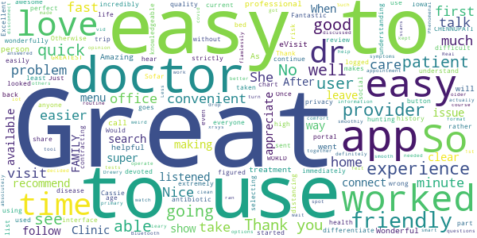
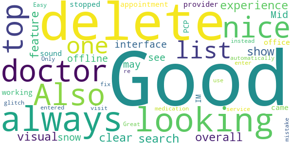
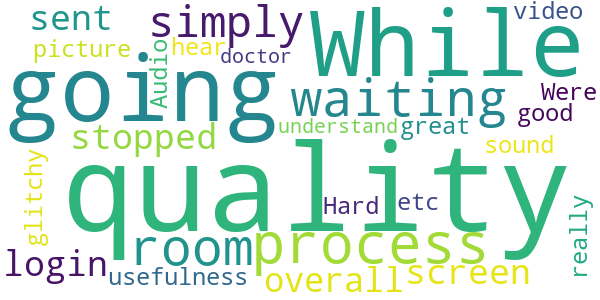
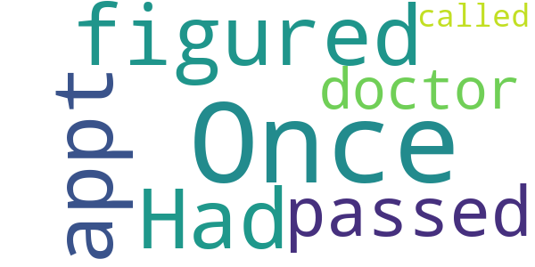
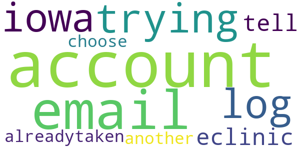

# Virtual Care The Iowa eClinic
App version ``12.6.00.005_01``

Analyzed with [covid-apps-observer](http://github.com/covid-apps-observer) project, version ``0.1``

## App overview
| | |
|-------------------------|-------------------------| 
| **Name**&nbsp;&nbsp;&nbsp;&nbsp;&nbsp;&nbsp;&nbsp;&nbsp;&nbsp;&nbsp;&nbsp;&nbsp;&nbsp;&nbsp;&nbsp;&nbsp;&nbsp;&nbsp;&nbsp;&nbsp;&nbsp;&nbsp;&nbsp;&nbsp;&nbsp;&nbsp;&nbsp;&nbsp;&nbsp;&nbsp;&nbsp;&nbsp;&nbsp;&nbsp;&nbsp;&nbsp;&nbsp;&nbsp;&nbsp;&nbsp;  | Virtual Care The Iowa eClinic |
| **Unique identifier** | com.iowaclinic.android.iowa.eclinic |
| **Link to Google Play** | [https://play.google.com/store/apps/details?id=com.iowaclinic.android.iowa.eclinic](https://play.google.com/store/apps/details?id=com.iowaclinic.android.iowa.eclinic) |
| **Summary**  | The Iowa eClinic is a secure, HIPAA compliant online platform for video consults |
| **Privacy policy** | [https://www.americanwell.com/privacy-policy/](https://www.americanwell.com/privacy-policy/) |
| **Latest version** | 12.6.00.005_01 |
| **Last update** | 2021-03-18 19:49:15 |
| **Recent changes** | We continue to improve the patient experience with these new features: • Performance enhancements to increase reliability and speed |
| **Installs**  | 1,000+ |
| **Category** | Medical |
| **First release** | Oct 30, 2019 |
| **Size**  | 53M |
| **Supported Android version**  | 5.0 and up |

### Description
> The Iowa eClinic is a secure, HIPAA compliant virtual platform that allows you to have an online video consult with a healthcare professional. This service is 100% local, staffed by Iowa Clinic medical providers based in the Des Moines Metro area.
 Think of our eClinic as a high-tech house call, giving you access to an Iowa Clinic provider when you can’t make a trip to the doctor’s office or urgent care. When you visit The Iowa eClinic, you can see a healthcare professional from the comfort of your own home or office. Through the convenience of video, we provide online consultations to answer medical questions, diagnose illnesses, and evaluate injuries.

### User interface
The developers of the app provide the following screenshots in the Google play store.
| | | |
|:-------------------------:|:-------------------------:|:-------------------------:|
 |   |   |   | 
 |   |   |   | 
 |   |   |   | 
 |   |   |   | 

## Development team
In the following we report the main information provided by the development team in the Google play store.

| | |
|-------------------------|-------------------------|
| **Developer**  | The Iowa Clinic |
| **Website**  | - |
| **Email** | itc@americanwell.com |
| **Physical address**  | - |
| **Other developed apps**  | [https://play.google.com/store/apps/developer?id=The+Iowa+Clinic](https://play.google.com/store/apps/developer?id=The+Iowa+Clinic) |

## Android support

| | |
|-------------------------|-------------------------|
| **Declared target Android version**  | Android10, version 10 (API level 29) |
| **Effective target Android version**  | Android10, version 10 (API level 29) |
| **Minimum supported Android version**  | Lollipop, version 5.0 (API level 21) |
| **Maximum target Android version**  | - |

The larger the difference between the minimum and maximum supported Android versions, the better. A larger difference means a wider audience. For example, old phones have a very low Android version, so a high minimum supported Android version means that the app cannot be used by users with old phones, thus leading to accessibility problems. 

## Requested permissions

In the following we report the complete list of the permissions requested by the app. 

| **Permission** | **Protection level** | **Description** | 
|-------------------------|-------------------------|-------------------------|
 **android.permission ACCESS_COARSE_LOCATION** | :warning:**Dangerous** | Allows an app to access approximate location. 
 **android.permission ACCESS_FINE_LOCATION** | :warning:**Dangerous** | Allows an app to access precise location. 
 **android.permission ACCESS_LOCATION_EXTRA_COMMANDS** | Normal | Allows an application to access extra location provider commands. 
 **android.permission ACCESS_NETWORK_STATE** | Normal | Allows applications to access information about networks. 
 **android.permission ACCESS_WIFI_STATE** | Normal | Allows applications to access information about Wi-Fi networks. 
 **android.permission BLUETOOTH** | Normal | Allows applications to connect to paired bluetooth devices. 
 **android.permission BROADCAST_STICKY** | Normal | Allows an application to broadcast sticky intents. 
 **android.permission CAMERA** | :warning:**Dangerous** | Required to be able to access the camera device. 
 **android.permission GET_TASKS** | Deprecated | This constant was deprecated in API level 21. No longer enforced. 
 **android.permission INTERNET** | Normal | Allows applications to open network sockets. 
 **android.permission MODIFY_AUDIO_SETTINGS** | Normal | Allows an application to modify global audio settings. 
 **android.permission READ_EXTERNAL_STORAGE** | :warning:**Dangerous** | Allows an application to read from external storage. 
 **android.permission READ_PHONE_STATE** | :warning:**Dangerous** | Allows read only access to phone state, including the phone number of the device, current cellular network information, the status of any ongoing calls, and a list of any PhoneAccounts registered on the device. 
 **android.permission RECEIVE_BOOT_COMPLETED** | Normal | Allows an application to receive the Intent.ACTION_BOOT_COMPLETED that is broadcast after the system finishes booting. 
 **android.permission RECORD_AUDIO** | :warning:**Dangerous** | Allows an application to record audio. 
 **android.permission REORDER_TASKS** | Normal | Allows an application to change the Z-order of tasks. 
 **android.permission SYSTEM_ALERT_WINDOW** | Signature - preinstalled - appop - pre23 - development | Allows an app to create windows using the type WindowManager.LayoutParams.TYPE_APPLICATION_OVERLAY, shown on top of all other apps. 
 **android.permission USE_BIOMETRIC** | Normal | Allows an app to use device supported biometric modalities. 
 **android.permission USE_FINGERPRINT** | Normal | This constant was deprecated in API level 28. Applications should request USE_BIOMETRIC instead 
 **android.permission VIBRATE** | Normal | Allows access to the vibrator. 
 **android.permission WAKE_LOCK** | Normal | Allows using PowerManager WakeLocks to keep processor from sleeping or screen from dimming. 
 **android.permission WRITE_EXTERNAL_STORAGE** | :warning:**Dangerous** | Allows an application to write to external storage. 
 **com.facebook.katana.provider ACCESS** | - | - 
 **com.google.android.c2dm.permission RECEIVE** | - | - 
 **com.google.android.finsky.permission BIND_GET_INSTALL_REFERRER_SERVICE** | - | - 
 **com.iowaclinic.android.iowa.eclinic.permission C2D_MESSAGE** | - | - 

## Mentioned servers

| **Server** | **Registrant** | **Registrant country** | **Creation date** | 
|-------------------------|-------------------------|-------------------------|-------------------------|
 | amwell.com | American Well Corporation | :us: US | 2004-02-13 19:02:32 |
 | facebook.com | Facebook, Inc. | :us: US | 1997-03-29 05:00:00 |
 | doubleclick.net | Google Inc. | :us: US | 1996-01-16 05:00:00 |
 | googleadservices.com | Google LLC | :us: US | 2003-06-19 16:34:53 |
 | google.com | Google LLC | :us: US | 1997-09-15 04:00:00 |
 | googlesyndication.com | Google LLC | :us: US | 2003-01-21 06:17:24 |
 | google-analytics.com | Google LLC | :us: US | 2005-07-18 19:24:32 |
 | app-measurement.com | Google LLC | :us: US | 2015-06-19 20:13:31 |
 | appboy.com | Braze, Inc. | :us: US | 2008-10-06 23:28:32 |
 | braze.com | Braze, Inc. | :us: US | 2000-01-19 02:18:28 |
 | optimizely.com | Optimizely | :us: US | 2010-01-11 03:01:32 |
 | twitter.com | Twitter, Inc. | :us: US | 2000-01-21 16:28:17 |
 | branch.io | Branch | :us: US | 2011-11-10 13:52:13 |
 | gstatic.com | Google LLC | :us: US | 2008-02-11 15:31:25 |
 | crashlytics.com | Google LLC | :us: US | 2011-01-21 15:30:40 |
 | bnc.lt | - | - | 2016-11-14 00:00:00 |
 | ggpht.com | Google LLC | :us: US | 2008-01-16 18:55:33 |

## Security analysis 

Below we report the main security warnings raised by our execution of the [Androwarn](https://github.com/maaaaz/androwarn) security analysis tool.

**Telephony identifiers leakage**
> - This application reads the ISO country code equivalent for the SIM provider's country code 
> - This application reads the ISO country code equivalent of the current registered operator's MCC (Mobile Country Code) 
> - This application reads the MCC+MNC of the provider of the SIM 
> - This application reads the device phone type value 
> - This application reads the numeric name (MCC+MNC) of current registered operator 
> - This application reads the operator name 
> - This application reads the phone's current state 
> - This application reads the radio technology (network type) currently in use on the device for data transmission 

**Connection interfaces exfiltration**
> - This application reads details about the currently active data network 
> - This application tries to find out if the currently active data network is metered 

**Telephony services abuse**
> - This application makes phone calls 

**Audio video eavesdropping**
> - This application captures video from the 'CAMERA' source 

**Suspicious connection establishment**
> - This application opens a Socket and connects it to the remote address ' returned no addresses for  ; port is out of range' on the 'N/A' port  
> - This application opens a Socket and connects it to the remote address '' on the 'N/A' port  
> - This application opens a Socket and connects it to the remote address 'Ljava/net/Proxy;->type()Ljava/net/Proxy$Type;' on the 'N/A' port  
> - This application opens a Socket and connects it to the remote address 'timeout' on the 'N/A' port  

**Code execution**
> - This application loads a native library 
> - This application executes a UNIX command containing this argument: '2' 

## User ratings and reviews

Below we provide information about how end users are reacting to the app in terms of ratings and reviews in the Google Play store.

### Ratings

The Virtual Care The Iowa eClinic app has been installed by more than **1000** times. At this time, **150** rated the app and its average score is **4.894231**. Below we show the distribution of the ratings across the usual star-based rating of Google Play

:star::star::star::star::star:: 138

:star::star::star::star:: 10

:star::star::star:: 2

:star::star:: 0

:star:: 0

### Reviews 

#### 5-star reviews

> I appreciate that the app is not difficult to follow and understand if you take your time. I love that it is devoted strictly to e-visits, rather than making them part of the patient portal. When you get logged in, there's no hunting through menus, you are taken immediately to the list of providers and can easily differentiate between those who are available and those who are not. It is incredibly user friendly, at least to this user. Thank you!  :date: __2021-03-19 21:40:02__

> Once I figured this out the first time I used it this app worked wonderfully!  :date: __2021-02-16 20:43:08__

> Very clear n understanding for everyone  :date: __2020-12-15 21:26:23__

> It was awesome  :date: __2020-12-14 23:10:23__

> Nice  :date: __2020-12-14 22:44:24__

> DR. CHENNUPATI IS THE GREATEST FAMILY DOCTOR IN THE WORLD!!!!!!!! My family loves her!!  :date: __2020-12-14 17:05:26__

> Great experience!!  :date: __2020-12-01 17:44:08__

> Its very easy to use,and it goes quick.  :date: __2020-11-19 23:37:12__

> So fast! The dr was super nice. She looked at my history, listened to my current health issue and sent in an antibiotic all in under 10 minutes!  :date: __2020-11-13 17:13:06__

> Thank you Cassie  :date: __2020-10-27 19:57:56__

#### 4-star reviews

> Good experience, clear and good visual.  :date: __2020-12-17 20:30:08__

> Good overall but search feature doesn't always show up when looking for your doctor and the interface doesn't snow all offline doctors so you may not see who you are looking for.  :date: __2020-05-07 22:30:22__

> Mid appointment the sound stopped working. Also it would be nice to IM my provider's office and also it would be nice if my PCP came up automatically at the top of my list.  :date: __2020-04-29 18:00:43__

> Easy to use  :date: __2020-04-24 00:41:09__

> Great service! Only one glitch, when I delete any medication from the list I entered for the visit, it always deletes the very top one instead so had to delete them all and re-enter to fix my mistake.  :date: __2020-04-04 03:49:44__

#### 3-star reviews

> While going through the process I was in the waiting room when the all simply stopped and sent me to the login screen. The overall usefulness, picture quality, sound quality, etc. Were really good.  :date: __2021-02-03 20:17:39__

> Audio was great, the video was very glitchy.  :date: __2020-05-15 21:48:52__

> Hard to hear and understand the doctor  :date: __2020-03-30 15:44:13__

#### 2-star reviews

> Once I figured it out my appt. Had passed so doctor called.  :date: __2020-04-13 22:42:06__

#### 1-star reviews

> i am trying to log into my iowa eclinic account and you tell me my email account is alreadytaken and to choose another. this is the only email account that i have. what can i do.  :date: __2020-04-14 13:15:10__

