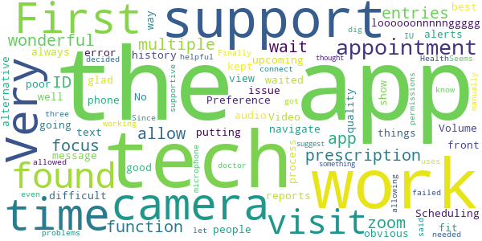

# IU Health Virtual Visits: Online Doctor Visit
App version ``12.0.16.005_01``

Analyzed with [covid-apps-observer](http://github.com/covid-apps-observer) project, version ``0.1``

## App overview
| | |
|-------------------------|-------------------------| 
| **Name**&nbsp;&nbsp;&nbsp;&nbsp;&nbsp;&nbsp;&nbsp;&nbsp;&nbsp;&nbsp;&nbsp;&nbsp;&nbsp;&nbsp;&nbsp;&nbsp;&nbsp;&nbsp;&nbsp;&nbsp;&nbsp;&nbsp;&nbsp;&nbsp;&nbsp;&nbsp;&nbsp;&nbsp;&nbsp;&nbsp;&nbsp;&nbsp;&nbsp;&nbsp;&nbsp;&nbsp;&nbsp;&nbsp;&nbsp;&nbsp;  | IU Health Virtual Visits: Online Doctor Visit |
| **Unique identifier** | com.iuhealth.android.videovisits |
| **Link to Google Play** | [https://play.google.com/store/apps/details?id=com.iuhealth.android.videovisits](https://play.google.com/store/apps/details?id=com.iuhealth.android.videovisits) |
| **Summary**  | Anyone in Indiana can see an IU Health doctor via a mobile device. |
| **Privacy policy** | [https://www.americanwell.com/privacy-policy/](https://www.americanwell.com/privacy-policy/) |
| **Latest version** | 12.0.16.005_01 |
| **Last update** | 2020-10-30 15:00:05 |
| **Recent changes** | We continue to improve the patient experience with these new features: • Performance enhancements to increase reliability and speed |
| **Installs**  | 50,000+ |
| **Category** | Medical |
| **First release** | Dec 22, 2015 |
| **Size**  | 53M |
| **Supported Android version**  | 5.0 and up |

### Description
> Anyone in Indiana (ages 2+) can now see a highly skilled Indiana University Health provider 24 hours per day, 7 days a week through an online live video with the IU Health Virtual Visits app.
 IU Health Virtual Visits is a secure, trusted alternative that works with your busy schedule to bring you and your family convenient access to our providers without having to travel to an office. You will interact with our providers via live, high-quality video and receive a diagnosis and instructions for treatment.
 Virtual Visits can be used for, but not limited to, the following symptoms:
 • Bronchitis, cold, cough, congestion, fever, flu and other sinus symptoms
 • Diarrhea, heartburn, nausea and vomiting
 • Cuts, scrapes, sprains, bruises, burns and insect bites
 • Hives, pink eye and rash
 • Infections, including bladder, yeast or urinary tract infection
 We also treat conditions such as acne, allergies, asthma, athlete's foot and back pain.
 If you use Apple Health, you can choose to share your health information with the provider during your virtual video visit, such as heart rate, blood pressure, body temperature, blood glucose level, weight, nutritional information, and respiratory rate.

### User interface
The developers of the app provide the following screenshots in the Google play store.
| | | |
|:-------------------------:|:-------------------------:|:-------------------------:|
 |   |   |   | 
 |   |   |   | 
 |   |   |   | 
 |   |   |   | 

## Development team
In the following we report the main information provided by the development team in the Google play store.

| | |
|-------------------------|-------------------------|
| **Developer**  | Indiana University Health |
| **Website**  | [http://iuhealth.org/videovisitsapp/](http://iuhealth.org/videovisitsapp/) |
| **Email** | webmaster@iuhealth.org |
| **Physical address**  | - |
| **Other developed apps**  | [https://play.google.com/store/apps/developer?id=Indiana+University+Health](https://play.google.com/store/apps/developer?id=Indiana+University+Health) |

## Android support

| | |
|-------------------------|-------------------------|
| **Declared target Android version**  | Android10, version 10 (API level 29) |
| **Effective target Android version**  | Android10, version 10 (API level 29) |
| **Minimum supported Android version**  | Lollipop, version 5.0 (API level 21) |
| **Maximum target Android version**  | - |

The larger the difference between the minimum and maximum supported Android versions, the better. A larger difference means a wider audience. For example, old phones have a very low Android version, so a high minimum supported Android version means that the app cannot be used by users with old phones, thus leading to accessibility problems. 

## Requested permissions

In the following we report the complete list of the permissions requested by the app. 

| **Permission** | **Protection level** | **Description** | 
|-------------------------|-------------------------|-------------------------|
 **android.permission ACCESS_COARSE_LOCATION** | :warning:**Dangerous** | Allows an app to access approximate location. 
 **android.permission ACCESS_FINE_LOCATION** | :warning:**Dangerous** | Allows an app to access precise location. 
 **android.permission ACCESS_LOCATION_EXTRA_COMMANDS** | Normal | Allows an application to access extra location provider commands. 
 **android.permission ACCESS_NETWORK_STATE** | Normal | Allows applications to access information about networks. 
 **android.permission ACCESS_WIFI_STATE** | Normal | Allows applications to access information about Wi-Fi networks. 
 **android.permission BLUETOOTH** | Normal | Allows applications to connect to paired bluetooth devices. 
 **android.permission BROADCAST_STICKY** | Normal | Allows an application to broadcast sticky intents. 
 **android.permission CAMERA** | :warning:**Dangerous** | Required to be able to access the camera device. 
 **android.permission GET_TASKS** | Deprecated | This constant was deprecated in API level 21. No longer enforced. 
 **android.permission INTERNET** | Normal | Allows applications to open network sockets. 
 **android.permission MODIFY_AUDIO_SETTINGS** | Normal | Allows an application to modify global audio settings. 
 **android.permission READ_EXTERNAL_STORAGE** | :warning:**Dangerous** | Allows an application to read from external storage. 
 **android.permission READ_PHONE_STATE** | :warning:**Dangerous** | Allows read only access to phone state, including the phone number of the device, current cellular network information, the status of any ongoing calls, and a list of any PhoneAccounts registered on the device. 
 **android.permission RECEIVE_BOOT_COMPLETED** | Normal | Allows an application to receive the Intent.ACTION_BOOT_COMPLETED that is broadcast after the system finishes booting. 
 **android.permission RECORD_AUDIO** | :warning:**Dangerous** | Allows an application to record audio. 
 **android.permission REORDER_TASKS** | Normal | Allows an application to change the Z-order of tasks. 
 **android.permission SYSTEM_ALERT_WINDOW** | Signature - preinstalled - appop - pre23 - development | Allows an app to create windows using the type WindowManager.LayoutParams.TYPE_APPLICATION_OVERLAY, shown on top of all other apps. 
 **android.permission USE_BIOMETRIC** | Normal | Allows an app to use device supported biometric modalities. 
 **android.permission USE_FINGERPRINT** | Normal | This constant was deprecated in API level 28. Applications should request USE_BIOMETRIC instead 
 **android.permission VIBRATE** | Normal | Allows access to the vibrator. 
 **android.permission WAKE_LOCK** | Normal | Allows using PowerManager WakeLocks to keep processor from sleeping or screen from dimming. 
 **android.permission WRITE_EXTERNAL_STORAGE** | :warning:**Dangerous** | Allows an application to write to external storage. 
 **com.facebook.katana.provider ACCESS** | - | - 
 **com.google.android.c2dm.permission RECEIVE** | - | - 
 **com.google.android.finsky.permission BIND_GET_INSTALL_REFERRER_SERVICE** | - | - 
 **com.iuhealth.android.videovisits.permission C2D_MESSAGE** | - | - 

## Mentioned servers

| **Server** | **Registrant** | **Registrant country** | **Creation date** | 
|-------------------------|-------------------------|-------------------------|-------------------------|
 | amwell.com | American Well Corporation | :us: US | 2004-02-13 19:02:32 |
 | facebook.com | Facebook, Inc. | :us: US | 1997-03-29 05:00:00 |
 | doubleclick.net | Google Inc. | :us: US | 1996-01-16 05:00:00 |
 | googleadservices.com | Google LLC | :us: US | 2003-06-19 16:34:53 |
 | google.com | Google LLC | :us: US | 1997-09-15 04:00:00 |
 | googlesyndication.com | Google LLC | :us: US | 2003-01-21 06:17:24 |
 | google-analytics.com | Google LLC | :us: US | 2005-07-18 19:24:32 |
 | app-measurement.com | Google LLC | :us: US | 2015-06-19 20:13:31 |
 | appboy.com | Braze, Inc. | :us: US | 2008-10-06 23:28:32 |
 | braze.com | Braze, Inc. | :us: US | 2000-01-19 02:18:28 |
 | optimizely.com | Optimizely | :us: US | 2010-01-11 03:01:32 |
 | twitter.com | Twitter, Inc. | :us: US | 2000-01-21 16:28:17 |
 | branch.io | Branch | :us: US | 2011-11-10 13:52:13 |
 | gstatic.com | Google LLC | :us: US | 2008-02-11 15:31:25 |
 | crashlytics.com | Google LLC | :us: US | 2011-01-21 15:30:40 |
 | bnc.lt | - | - | 2016-11-14 00:00:00 |
 | ggpht.com | Google LLC | :us: US | 2008-01-16 18:55:33 |

## Security analysis 

Below we report the main security warnings raised by our execution of the [Androwarn](https://github.com/maaaaz/androwarn) security analysis tool.

**Telephony identifiers leakage**
> - This application reads the ISO country code equivalent for the SIM provider's country code 
> - This application reads the ISO country code equivalent of the current registered operator's MCC (Mobile Country Code) 
> - This application reads the MCC+MNC of the provider of the SIM 
> - This application reads the device phone type value 
> - This application reads the numeric name (MCC+MNC) of current registered operator 
> - This application reads the operator name 
> - This application reads the phone's current state 
> - This application reads the radio technology (network type) currently in use on the device for data transmission 

**Connection interfaces exfiltration**
> - This application reads details about the currently active data network 
> - This application tries to find out if the currently active data network is metered 

**Telephony services abuse**
> - This application makes phone calls 

**Audio video eavesdropping**
> - This application captures video from the 'CAMERA' source 

**Suspicious connection establishment**
> - This application opens a Socket and connects it to the remote address ' returned no addresses for  ; port is out of range' on the 'N/A' port  
> - This application opens a Socket and connects it to the remote address '' on the 'N/A' port  
> - This application opens a Socket and connects it to the remote address 'Ljava/net/Proxy;->type()Ljava/net/Proxy$Type;' on the 'N/A' port  
> - This application opens a Socket and connects it to the remote address 'timeout' on the 'N/A' port  

**Code execution**
> - This application loads a native library 
> - This application executes a UNIX command containing this argument: '2' 

## User ratings and reviews

Below we provide information about how end users are reacting to the app in terms of ratings and reviews in the Google Play store.

### Ratings

The IU Health Virtual Visits: Online Doctor Visit app has been installed by more than **50000** times. At this time, **1219** rated the app and its average score is **4.699187**. Below we show the distribution of the ratings across the usual star-based rating of Google Play

:star::star::star::star::star:: 1043

:star::star::star::star:: 99

:star::star::star:: 9

:star::star:: 29

:star:: 39

### Reviews 

#### 5-star reviews

> Helpful  :date: __2021-01-08 18:21:02__

> Great telehealth service.  :date: __2021-01-05 01:41:13__

> Works for me very good picture.. THANKS  :date: __2021-01-04 17:03:09__

> Very Good Customer Service  :date: __2020-12-31 01:30:18__

> The app is very easy to use and the doctors visit beats going in and waiting in a room where you have the potential to expose yourself to ill patients coming in  :date: __2020-12-27 23:15:35__

> Easy and convenient  :date: __2020-12-18 14:52:53__

> Personal, caring and helpful!!!!!!! Highly recommend.  :date: __2020-12-05 13:50:47__

> Excellent  :date: __2020-12-04 15:43:32__

> very good  :date: __2020-11-30 01:34:59__

> Very easy to use. Only had an occasional sound problem but may have been the providers mic.  :date: __2020-11-28 20:56:25__

#### 4-star reviews

> Easy to use and friendly physicians, but you can't use non-IU health plans, so I have to pay $60 per visit.  :date: __2020-11-01 20:28:13__

> Pleasant  :date: __2020-09-30 15:43:55__

> Considering it is new for covid, they do a great job. Took me over 5 hours, however, to get myself and my two children screened for testing.  :date: __2020-09-02 23:40:34__

> Wish, I could answer questions before choosing the provider, I think it would flow better  :date: __2020-08-15 21:20:13__

> Ok  :date: __2020-07-31 18:04:29__

> Overall visit went well!!  :date: __2020-07-24 16:47:09__

> I love IU Health so this makes it easy for me to stay upon my health concerns.  :date: __2020-06-17 20:12:15__

> All was fine , but volume was very low!  :date: __2020-06-15 18:02:09__

> Great for normal visit.  :date: __2020-05-27 19:53:04__

> Its been 60 / 40 on successful completed visits. Todsy great. This us a tremendos tool for our generation in this ever changing times.....  :date: __2020-05-26 22:06:52__

#### 3-star reviews

> The app didn't allow for multiple prescription entries and the camera function would not zoom or focus on my ID.  :date: __2020-12-28 03:08:45__

> The visits are wonderful. The wait time is loooooonnnnnggggg. And the app kept putting people in front of me while I waited.  :date: __2020-10-20 18:39:06__

> Very poor audio  :date: __2020-06-09 16:05:13__

> First time. I found things difficult to navigate through the process.  :date: __2020-05-13 16:53:23__

> Volume is an issue  :date: __2020-05-11 16:49:36__

> Scheduling and the visit itself work very well. Preference fit text message alerts for upcoming appointments doesn't work (always reports an error). No obvious way to view appointment history.  :date: __2020-04-29 19:16:53__

> Video quality is not the best.  :date: __2020-04-22 18:11:19__

> It was good glad there was an alternative because of what's going on  :date: __2020-04-01 17:48:22__

> The app does not show up on my phone.  :date: __2020-03-12 20:51:56__

> I had problems with this app on first three uses. IU Health tech support was not helpful when the app failed to connect to doctor. Tech said the app should "just work" even after I let them know it didn't. Since tech support was not supportive, I decided to dig into it myself. I found the permissions the app needed were not all allowed. Finally got the app working after manually allowing the camera and microphone. Seems like something tech support should have thought to suggest.  :date: __2020-02-11 20:07:56__

#### 2-star reviews

> Well I can't get connected to it. It said they can't download my ID. I put myself on a wait list with a nurse and never was contacted. I am very frustrated with this whole thing .  :date: __2020-11-27 19:37:01__

> Sucked  :date: __2020-09-06 18:41:29__

> 444r  :date: __2020-08-18 17:17:45__

> I seen the dr. But, he did not see me ...  :date: __2020-08-14 16:17:42__

> could not download onto my desktop computer. Safari couldnt download app.  :date: __2020-05-18 15:45:29__

> Poor video, but excellent doctor!  :date: __2020-04-10 02:50:24__

#### 1-star reviews

> I can't leave the app while I'm waiting for the visit or it will take me off the wait list. So I had to wait an hour without access to my phone. Also tried doing my visit on the computer but it wouldn't let me continue without allowing access to my camera and microphone, but the website never asked for that permission so I was never able to give permission, and google doesn't let you manually give permission without the site asking. Incredibly annoying, and required even after I was covid free.  :date: __2020-11-11 04:06:13__

> Unable to download and reinstall. When installed and opening the application the app kept crashing. I'm on the most recent version of Android. No clue why this is happening. It worked a couple months ago.  :date: __2020-10-20 14:27:49__

> What is subscriber ID? Can't get past this question.....  :date: __2020-10-10 17:23:02__

> Whenever I went to go and use this app for my doctor's appointment it kept freezing in me in the middle of my virtual doctor's visits that just ones if the things that it would do bad while using this app  :date: __2020-09-02 00:46:45__

> Not working.. Says wrong password and I try to reset and I says wrong name and email.  :date: __2020-08-20 14:47:41__

> It takes for ever and they even cancel the appointment  :date: __2020-08-14 19:56:55__

> No record of visit, not linked to rest of health record. Have had 2 appointments (one for me and one for my child). Neither appointment exist in my app history. When I log into my Health Portal, these visits don't show. During my visit yesterday the nurse practitioner stated they were transferring prescriptions to my pharmacy. My pharmacy doesn't have them and there is no way to verify the appointment even occurred.  :date: __2020-06-17 21:55:41__

> Doesn't work.  :date: __2020-06-16 14:40:52__

> Unable to find appointment reminder. Not user friendly  :date: __2020-05-18 06:42:26__

> Spoke to physician. He was supposed to prescribe medication but never called in the prescription. There is no way to go back into the app to follow-up and contact physicians without paying fee again. Flawed app!  :date: __2020-05-09 02:05:51__

