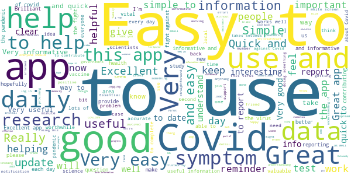
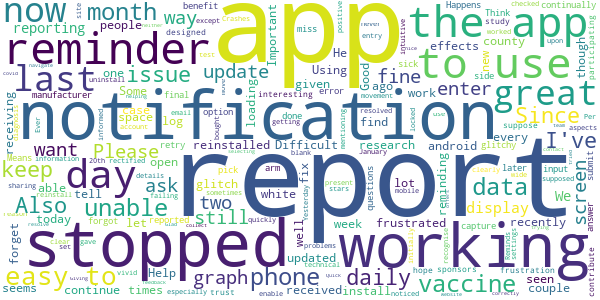

# COVID Symptom Study
App version ``2.2.0``

Analyzed with [covid-apps-observer](http://github.com/covid-apps-observer) project, version ``0.1``

## App overview
| | |
|-------------------------|-------------------------| 
| **Name**&nbsp;&nbsp;&nbsp;&nbsp;&nbsp;&nbsp;&nbsp;&nbsp;&nbsp;&nbsp;&nbsp;&nbsp;&nbsp;&nbsp;&nbsp;&nbsp;&nbsp;&nbsp;&nbsp;&nbsp;&nbsp;&nbsp;&nbsp;&nbsp;&nbsp;&nbsp;&nbsp;&nbsp;&nbsp;&nbsp;&nbsp;&nbsp;&nbsp;&nbsp;&nbsp;&nbsp;&nbsp;&nbsp;&nbsp;&nbsp;  | COVID Symptom Study |
| **Unique identifier** | com.joinzoe.covid_zoe |
| **Link to Google Play** | [https://play.google.com/store/apps/details?id=com.joinzoe.covid_zoe](https://play.google.com/store/apps/details?id=com.joinzoe.covid_zoe) |
| **Summary**  | Help slow COVID-19 by self-reporting your symptoms daily, even if you feel well. |
| **Privacy policy** | [https://predict.study/covid-privacy-notice/](https://predict.study/covid-privacy-notice/) |
| **Latest version** | 2.2.0 |
| **Last update** | 2020-12-18 12:42:28 |
| **Recent changes** | Diet study results for participating users. UI fixes. |
| **Installs**  | 1,000,000+ |
| **Category** | Health & Fitness |
| **First release** | Mar 27, 2020 |
| **Size**  | 36M |
| **Supported Android version**  | 5.0 and up |

### Description
> Take 1 minute each day and help fight the spread of COVID-19 in your community
 * Report your health daily even if you feel well
 * Get a daily estimate of COVID in your area
 * Help slow the outbreak near you
 Join millions of people supporting scientists at Stanford University, Harvard University, Massachusetts General Hospital, and King's College London to help fight coronavirus by identifying:
 * How fast the virus is spreading in your area
 * High-risk areas in the US
 * Who is most at risk, by better understanding symptoms linked to underlying health conditions
 You will contribute to advance research on COVID-19 in partnership with leading health researchers globally like TwinsUK, one of the most clinically detailed studies in the world.
 This app (formerly known as the Covid Symptom Tracker) allows you to help others, but does not give health advice. If you need health advice please visit the CDC website at: [https://www.cdc.gov/coronavirus/2019-ncov/index.html](https://www.cdc.gov/coronavirus/2019-ncov/index.html)
 This app has been designed for everyone to report their status not just those who are ill.
 It was designed by doctors and scientists at King's College London, Guys and St Thomas’ Hospitals and Zoe Global Limited, a health technology company.
 In the US the app is being used by the Nurses' Health Study to identify symptoms in active healthcare workers who are treating people with COVID across the country and risking their own health to help us.
 In response to recommendations by Stand Up To Cancer (SU2C), the app also includes questions for cancer patients and survivors, such as if they are living with cancer, what type of cancer and what treatment they are receiving.
 If you would like to help out in this difficult time, then you can. Download the app and share daily your own status, even if you are well. With your help we can understand much better the situation across the nation, how the disease presents itself to different people, and how it progresses.
 This is a new virus which the world has never seen before. There are a wide range of symptoms, which differ between people. With your help we can understand better how the disease presents itself depending upon individual factors such as health and age.
 No information you share will be used for commercial purposes.
 There are two parts to the app:
 HEALTH INFORMATION
 You will be asked to share some general information, such as your age and some health details, such as whether you have certain diseases.
 SYMPTOM TRACKING
 We will ask you every day to let us know how you feel, so you can share your symptoms. We will also ask whether you have visited the hospital, what treatment you received there, and whether you have been tested for COVID-19 (Coronavirus).

### User interface
The developers of the app provide the following screenshots in the Google play store.
| | | |
|:-------------------------:|:-------------------------:|:-------------------------:|
 |   |   |   | 
 |   |   |   | 
 |   |  

## Development team
In the following we report the main information provided by the development team in the Google play store.

| | |
|-------------------------|-------------------------|
| **Developer**  | Zoe Global Limited |
| **Website**  | [http://covid.joinzoe.com/](http://covid.joinzoe.com/) |
| **Email** | covid@joinzoe.com |
| **Physical address**  | [164 Westminster Bridge Road London SE1 7RW United Kingdom](https://www.google.com/maps/search/164%20Westminster%20Bridge%20Road%20London%20SE1%207RW%20United%20Kingdom) (Google Maps) |
| **Other developed apps**  | [https://play.google.com/store/apps/developer?id=Zoe+Global+Limited](https://play.google.com/store/apps/developer?id=Zoe+Global+Limited) |

## Android support

| | |
|-------------------------|-------------------------|
| **Declared target Android version**  | Android10, version 10 (API level 29) |
| **Effective target Android version**  | Android10, version 10 (API level 29) |
| **Minimum supported Android version**  | Lollipop, version 5.0 (API level 21) |
| **Maximum target Android version**  | - |

The larger the difference between the minimum and maximum supported Android versions, the better. A larger difference means a wider audience. For example, old phones have a very low Android version, so a high minimum supported Android version means that the app cannot be used by users with old phones, thus leading to accessibility problems. 

## Requested permissions

In the following we report the complete list of the permissions requested by the app. 

| **Permission** | **Protection level** | **Description** | 
|-------------------------|-------------------------|-------------------------|
 **android.permission ACCESS_BACKGROUND_LOCATION** | :warning:**Dangerous** | Allows an app to access location in the background. 
 **android.permission ACCESS_COARSE_LOCATION** | :warning:**Dangerous** | Allows an app to access approximate location. 
 **android.permission ACCESS_FINE_LOCATION** | :warning:**Dangerous** | Allows an app to access precise location. 
 **android.permission ACCESS_NETWORK_STATE** | Normal | Allows applications to access information about networks. 
 **android.permission ACCESS_WIFI_STATE** | Normal | Allows applications to access information about Wi-Fi networks. 
 **android.permission FOREGROUND_SERVICE** | Normal | Allows a regular application to use Service.startForeground. 
 **android.permission INTERNET** | Normal | Allows applications to open network sockets. 
 **android.permission READ_APP_BADGE** | - | - 
 **android.permission READ_EXTERNAL_STORAGE** | :warning:**Dangerous** | Allows an application to read from external storage. 
 **android.permission RECEIVE_BOOT_COMPLETED** | Normal | Allows an application to receive the Intent.ACTION_BOOT_COMPLETED that is broadcast after the system finishes booting. 
 **android.permission WAKE_LOCK** | Normal | Allows using PowerManager WakeLocks to keep processor from sleeping or screen from dimming. 
 **android.permission WRITE_EXTERNAL_STORAGE** | :warning:**Dangerous** | Allows an application to write to external storage. 
 **com.anddoes.launcher.permission UPDATE_COUNT** | - | - 
 **com.google.android.c2dm.permission RECEIVE** | - | - 
 **com.google.android.finsky.permission BIND_GET_INSTALL_REFERRER_SERVICE** | - | - 
 **com.google.android.gms.permission ACTIVITY_RECOGNITION** | - | - 
 **com.google.android.providers.gsf.permission READ_GSERVICES** | - | - 
 **com.htc.launcher.permission READ_SETTINGS** | - | - 
 **com.htc.launcher.permission UPDATE_SHORTCUT** | - | - 
 **com.huawei.android.launcher.permission CHANGE_BADGE** | - | - 
 **com.huawei.android.launcher.permission READ_SETTINGS** | - | - 
 **com.huawei.android.launcher.permission WRITE_SETTINGS** | - | - 
 **com.majeur.launcher.permission UPDATE_BADGE** | - | - 
 **com.oppo.launcher.permission READ_SETTINGS** | - | - 
 **com.oppo.launcher.permission WRITE_SETTINGS** | - | - 
 **com.sec.android.provider.badge.permission READ** | - | - 
 **com.sec.android.provider.badge.permission WRITE** | - | - 
 **com.sonyericsson.home.permission BROADCAST_BADGE** | - | - 
 **com.sonymobile.home.permission PROVIDER_INSERT_BADGE** | - | - 
 **me.everything.badger.permission BADGE_COUNT_READ** | - | - 
 **me.everything.badger.permission BADGE_COUNT_WRITE** | - | - 

## Mentioned servers

| **Server** | **Registrant** | **Registrant country** | **Creation date** | 
|-------------------------|-------------------------|-------------------------|-------------------------|
 | amplitude.com | Amplitude | :us: US | 1996-05-09 04:00:00 |
 | android.com | Google LLC | :us: US | 1997-06-23 04:00:00 |
 | google.com | Google LLC | :us: US | 1997-09-15 04:00:00 |
 | microsoft.com | Microsoft Corporation | :us: US | 1991-05-02 04:00:00 |
 | googleapis.com | Google LLC | :us: US | 2005-01-25 17:52:26 |
 | cloudfront.net | Amazon.com, Inc. | :us: US | 2008-04-25 18:25:49 |
 | expo.io | See PrivacyGuardian.org | :us: US | 2011-05-01 21:26:50 |

## Security analysis 

Below we report the main security warnings raised by our execution of the [Androwarn](https://github.com/maaaaz/androwarn) security analysis tool.

**Telephony identifiers leakage**
> - This application reads the ISO country code equivalent of the current registered operator's MCC (Mobile Country Code) 
> - This application reads the device phone type value 
> - This application reads the numeric name (MCC+MNC) of current registered operator 
> - This application reads the operator name 

**Location lookup**
> - This application reads location information from all available providers (WiFi, GPS etc.) 

**Connection interfaces exfiltration**
> - This application reads details about the currently active data network 
> - This application tries to find out if the currently active data network is metered 

**Suspicious connection establishment**
> - This application opens a Socket and connects it to the remote address '' on the 'N/A' port  
> - This application opens a Socket and connects it to the remote address 'Ljava/lang/StringBuilder;->toString()Ljava/lang/String;' on the ': connect, resolve' port  
> - This application opens a Socket and connects it to the remote address 'Ljava/lang/StringBuilder;->toString()Ljava/lang/String;' on the 'N/A' port  
> - This application opens a Socket and connects it to the remote address 'Ljava/net/Proxy;->type()Ljava/net/Proxy$Type;' on the 'N/A' port  
> - This application opens a Socket and connects it to the remote address 'timeout' on the 'N/A' port  

**Pim data leakage**
> - This application accesses data stored in the clipboard 

**Code execution**
> - This application loads a native library 
> - This application executes a UNIX command 

## User ratings and reviews

Below we provide information about how end users are reacting to the app in terms of ratings and reviews in the Google Play store.

### Ratings

The COVID Symptom Study app has been installed by more than **1000000** times. At this time, **132533** rated the app and its average score is **4.7363434**. Below we show the distribution of the ratings across the usual star-based rating of Google Play

:star::star::star::star::star:: 103236

:star::star::star::star:: 25440

:star::star::star:: 2712

:star::star:: 504

:star:: 641

### Reviews 

#### 5-star reviews

> Very straightforward and very happy to help in the fight against Covid.  :date: __2021-01-29 19:17:20__

> Crucial.  :date: __2021-01-29 18:08:15__

> Very good  :date: __2021-01-29 17:58:04__

> Easy and very quick to use. Providing vital information, makes you feel as though you're doing something to help.  :date: __2021-01-29 17:55:49__

> It's non obtrusive, it doesn't give identifiable information to anyone. It could help scientists and the government get a more accurate idea of the spread of convid. But that depends on the number of people using it, which is up to you (•‿•)  :date: __2021-01-29 16:30:11__

> Quick and easy to contribute daily report and gives access to helpful data and advice on Covid  :date: __2021-01-29 15:35:59__

> Excellent, very easy to use. Feels like you are helping research.  :date: __2021-01-29 15:25:21__

> Having worked perfectly for months, the app will now not log in. Screen goes white after log in. Have uninstalled and reinstalled. Frustrating.  :date: __2021-01-29 14:47:02__

> Be part of a citizen science project - join 4.5 million UK citizens to down load this app, a few minutes to register and a minute or so to report each day any Covid symptoms - including none.  :date: __2021-01-29 14:24:48__

> Easy and effective. Home screen gives reminder to watch useful weekly update video.  :date: __2021-01-29 13:52:21__

#### 4-star reviews

> Easy to use, great reminder everyday, i have a brain like a sieve, so is helpful  :date: __2021-01-29 19:54:28__

> It's interesting and good. However, this is the first time that I have been able to login over the last 36 hours.  :date: __2021-01-29 16:42:47__

> Really enjoying the app, the information is relevant and easy to understand. I like that it is tracking symptoms following the vaccine as well. I would like to see an option to check in symptoms from previous days when I forget.  :date: __2021-01-29 12:52:32__

> Missed the detailed questions i.e. the tick sheet, when I first used this app and I was feeling bad. Couldn't go back and amend anything on the previous day.  :date: __2021-01-29 12:45:04__

> It's very easy to use, and there's lots of good communication featured on the app. However, the daily notifications haven't worked for me for months, which is a major downside as I then only remember to log how I am a couple of times a week, and have had several longer periods of inactivity. I figure this is better than nothing, but not ideal given the nature of the study  :date: __2021-01-29 11:47:46__

> Good to keep updated, this app does just that. Thank you 😊  :date: __2021-01-29 11:46:26__

> Easy to download, easy to use, hopefully useful  :date: __2021-01-29 09:38:34__

> Good to feel you are contributing info which is valuable to scientists working on Covid-19. The app gives info on the latest research projects & data in interesting formats. Lost one star as still no longer getting automatic daily reminder notifications, despite following instructions to rectify this.  :date: __2021-01-29 01:13:54__

> Does as described  :date: __2021-01-28 19:51:52__

> Many times the App doesn't open properly.  :date: __2021-01-28 11:44:40__

#### 3-star reviews

> Not able to input vaccine side effects other than on arm - glitch? Think it would benefit you to capture which vaccine manufacturer has been given too.  :date: __2021-01-27 19:47:12__

> Please fix the error with the days. I report every day and am frustrated that it continually tells me I haven't reported for 2 or more days.  :date: __2021-01-27 14:51:26__

> The app continues to be glitchy as it won't let me pick the final option to submit my report Happens a few times. Means I forgot to retry later and then miss a day or two  :date: __2021-01-25 08:23:17__

> Since I am not sick, I answer 3 questions every day and I am done. This is not very interesting, but I want to contribute and hope I am doing so. I trust that it is a well designed study, given its sponsors. I suppose my only frustration is that more people are not participating; especially not in my county, where there are at present too few to enable a county wide report. I do keep sharing the app!  :date: __2021-01-25 05:14:54__

> Great except notifications have stopped working so forget to report daily.  :date: __2021-01-23 10:10:03__

> I was locked out of the app for 2 months - until I bought a new phone. The app was updated and I was unable to get the update to work on my phone. Some aspects of movement through the data entry are not clear e.g. enter test details and then how are you supposed to move on.  :date: __2021-01-23 09:59:28__

> Been technical problems but rectified quickly. Easy to use and a lot of information on the site.  :date: __2021-01-23 08:28:21__

> Ever since the last update, I have been unable to get notifications working again. Also I've noticed people mentioning graphs??? I've never seen a graph.  :date: __2021-01-22 22:36:27__

> Reminds me to update but sometimes I have to uninstall it then reinstall again  :date: __2021-01-22 20:37:27__

> It doesn't ask about my positive vivid diagnosis? And it's not very intuitive  :date: __2021-01-22 18:19:16__

#### 2-star reviews

> The app has begun erroring since yesterday (28th Jan 2021). It loads, the screen with 'report today, even if you're well' appears for a split second before the whole screen goes white and stays that way. It's now unusable and this is day two of not being able to log.  :date: __2021-01-29 11:47:20__

> Excellent app until phone had an update and now it crashes everytime I try to open it. I've tried un-installing and re-installing it bit still unable to open it. Don't know what else I can do to make it work again 😪  :date: __2021-01-28 16:54:42__

> Unfortunately when I tried to insert a password my phone's keyboard covered the box I was meant to write it in! An elementary design error which rendered the app useless. I'm surprised this hasn't been fixed.  :date: __2021-01-27 17:23:40__

> I installed it 3 weeks ago, and to begin with it worked fine. Then it asked me to log in with my password and email for the first time. I was unable to do that because on my phone - a Samsung Galaxy A10 - as soon as I begin to type, the keyboard covers the place where the password has to go! It was also telling me my password wasn't recognised although I am certain it was the one I submitted. I tried the Force Stop recommended but it made no difference. finally I uninstalled the app. I have tried now to reinstall it but I guess I will still have the same problem. I'd be really grateful if anyone can help. It 's a great idea, but the app needs to be reliable. I am disappointed not to be able to participate.  :date: __2021-01-23 22:54:01__

> Been using this all way through the pandemic and think it's been very useful for understanding the various symptoms covid-19 can display. However the app has now stoped working entirely on my phone. On the old it works fine and the settings seems to be the same.  :date: __2021-01-23 14:48:33__

> My first vaccine date disappeared .  :date: __2021-01-20 16:53:26__

> A giant missed opportunity. With the urgent need for better evidence on effective preventative or treatment options, why not collect data on a wide variety of products and practices while infection rates are so high? Any substance or routine correlated with lower infection or disease severity rates can then be prioritised for investigation. For example, N acetyl cysteine, quercetin, turmeric/curcumin, Nasal spray compounds or lavage, oestrogen, progesterone, daily hours slept, etc.  :date: __2021-01-20 15:26:26__

> I am unable to report a problem with the app anywhere else, so I'm doing it here: recent update has added a mandotory blood group question before any other reporting options. I don't know my blood group, so cannot report! There is no option to skip or to choose "I don't know"  :date: __2021-01-16 16:54:02__

> The app had been working fine for over a week but currently freezes with a white screen. Not sure how this has happened, please fix the bug?  :date: __2021-01-16 10:56:55__

> I don't know what good this is doing, there is no feedback, info is all one-way. The app just freezes sometimes. The developers should try using it to find out the issues. Bet that will never happen. Now the app just says "loading". Tried stop/starting it. Who wrote this rubbish?  :date: __2021-01-13 20:45:49__

#### 1-star reviews

> The app has worked perfectly until today and now it starts to load and then flips to a blank screen. I've uninstalled and reinstalled it and logged back in but still the same problem. I'm using it on an android smartphone and have today also loaded and logged into it on an ipad but still the same error 🙁  :date: __2021-01-29 12:03:13__

> It has stopped working, I havectried to reinstall it but it still isn't loading. It may have been a problem with the last software update I had on my Samsung phone.  :date: __2021-01-29 10:39:15__

> Graph for the Midlands hasn't been updated since 9/1 and I can't find a way to report this problem other than in the play store. Please fix  :date: __2021-01-25 18:02:21__

> Stopped working 24 January?? Anyone else having this issue. Been using it since March  :date: __2021-01-25 10:55:09__

> Manipulates the figures to suit  :date: __2021-01-23 18:55:39__

> Since endeavouring to update the app I have not received a daily notification even though my app states Installed. Such a pity as I have updated daily throughout the pandemic.  :date: __2021-01-22 19:29:38__

> Suddenly stopped working  :date: __2021-01-16 12:03:09__

> This app worked well untill it was upgraded now it does not work on android the same . You struggle to give responses ha ha,the questioner doesn't work  :date: __2021-01-15 20:15:45__

> Today my oxygen levels good my palate is sore and my nasal cavity feels horrid everything still tastes awful walking in bungalow flapping my arms started to cook for myself  :date: __2021-01-15 20:03:50__

> Was reporting daily since March till the daily reminders stopped. On the advice of some of the reviews here, having not reported for about 4 months now because I have other important things going on in my life, I deleted the app thinking that would fix it and now can't login again. No password reminder emails received. This app is broken.  :date: __2021-01-13 21:24:10__

