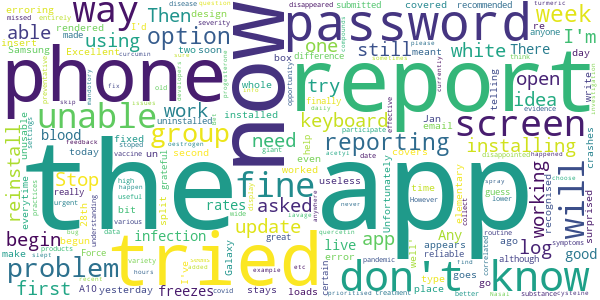

# COVID Symptom Study
App version ``2.2.0``

Analyzed with [covid-apps-observer](http://github.com/covid-apps-observer) project, version ``0.1``

## App overview
| | |
|-------------------------|-------------------------| 
| **Name**&nbsp;&nbsp;&nbsp;&nbsp;&nbsp;&nbsp;&nbsp;&nbsp;&nbsp;&nbsp;&nbsp;&nbsp;&nbsp;&nbsp;&nbsp;&nbsp;&nbsp;&nbsp;&nbsp;&nbsp;&nbsp;&nbsp;&nbsp;&nbsp;&nbsp;&nbsp;&nbsp;&nbsp;&nbsp;&nbsp;&nbsp;&nbsp;&nbsp;&nbsp;&nbsp;&nbsp;&nbsp;&nbsp;&nbsp;&nbsp;  | COVID Symptom Study |
| **Unique identifier** | com.joinzoe.covid_zoe |
| **Link to Google Play** | [https://play.google.com/store/apps/details?id=com.joinzoe.covid_zoe](https://play.google.com/store/apps/details?id=com.joinzoe.covid_zoe) |
| **Summary**  | Help slow COVID-19 by self-reporting your symptoms daily, even if you feel well. |
| **Privacy policy** | [https://predict.study/covid-privacy-notice/](https://predict.study/covid-privacy-notice/) |
| **Latest version** | 2.2.0 |
| **Last update** | 2020-12-18 12:42:28 |
| **Recent changes** | Diet study results for participating users. UI fixes. |
| **Installs**  | 1,000,000+ |
| **Category** | Health & Fitness |
| **First release** | Mar 27, 2020 |
| **Size**  | 36M |
| **Supported Android version**  | 5.0 and up |

### Description
> Take 1 minute each day and help fight the spread of COVID-19 in your community
 * Report your health daily even if you feel well
 * Get a daily estimate of COVID in your area
 * Help slow the outbreak near you
 Join millions of people supporting scientists at Stanford University, Harvard University, Massachusetts General Hospital, and King's College London to help fight coronavirus by identifying:
 * How fast the virus is spreading in your area
 * High-risk areas in the US
 * Who is most at risk, by better understanding symptoms linked to underlying health conditions
 You will contribute to advance research on COVID-19 in partnership with leading health researchers globally like TwinsUK, one of the most clinically detailed studies in the world.
 This app (formerly known as the Covid Symptom Tracker) allows you to help others, but does not give health advice. If you need health advice please visit the CDC website at: [https://www.cdc.gov/coronavirus/2019-ncov/index.html](https://www.cdc.gov/coronavirus/2019-ncov/index.html)
 This app has been designed for everyone to report their status not just those who are ill.
 It was designed by doctors and scientists at King's College London, Guys and St Thomas’ Hospitals and Zoe Global Limited, a health technology company.
 In the US the app is being used by the Nurses' Health Study to identify symptoms in active healthcare workers who are treating people with COVID across the country and risking their own health to help us.
 In response to recommendations by Stand Up To Cancer (SU2C), the app also includes questions for cancer patients and survivors, such as if they are living with cancer, what type of cancer and what treatment they are receiving.
 If you would like to help out in this difficult time, then you can. Download the app and share daily your own status, even if you are well. With your help we can understand much better the situation across the nation, how the disease presents itself to different people, and how it progresses.
 This is a new virus which the world has never seen before. There are a wide range of symptoms, which differ between people. With your help we can understand better how the disease presents itself depending upon individual factors such as health and age.
 No information you share will be used for commercial purposes.
 There are two parts to the app:
 HEALTH INFORMATION
 You will be asked to share some general information, such as your age and some health details, such as whether you have certain diseases.
 SYMPTOM TRACKING
 We will ask you every day to let us know how you feel, so you can share your symptoms. We will also ask whether you have visited the hospital, what treatment you received there, and whether you have been tested for COVID-19 (Coronavirus).

### User interface
The developers of the app provide the following screenshots in the Google play store.
| | | |
|:-------------------------:|:-------------------------:|:-------------------------:|
 |   |   |   | 
 |   |   |   | 
 |   |  

## Development team
In the following we report the main information provided by the development team in the Google play store.

| | |
|-------------------------|-------------------------|
| **Developer**  | Zoe Global Limited |
| **Website**  | [http://covid.joinzoe.com/](http://covid.joinzoe.com/) |
| **Email** | covid@joinzoe.com |
| **Physical address**  | [164 Westminster Bridge Road London SE1 7RW United Kingdom](https://www.google.com/maps/search/164%20Westminster%20Bridge%20Road%20London%20SE1%207RW%20United%20Kingdom) (Google Maps) |
| **Other developed apps**  | [https://play.google.com/store/apps/developer?id=Zoe+Global+Limited](https://play.google.com/store/apps/developer?id=Zoe+Global+Limited) |

## Android support

| | |
|-------------------------|-------------------------|
| **Declared target Android version**  | Android10, version 10 (API level 29) |
| **Effective target Android version**  | Android10, version 10 (API level 29) |
| **Minimum supported Android version**  | Lollipop, version 5.0 (API level 21) |
| **Maximum target Android version**  | - |

The larger the difference between the minimum and maximum supported Android versions, the better. A larger difference means a wider audience. For example, old phones have a very low Android version, so a high minimum supported Android version means that the app cannot be used by users with old phones, thus leading to accessibility problems. 

## Requested permissions

In the following we report the complete list of the permissions requested by the app. 

| **Permission** | **Protection level** | **Description** | 
|-------------------------|-------------------------|-------------------------|
 **android.permission ACCESS_BACKGROUND_LOCATION** | :warning:**Dangerous** | Allows an app to access location in the background. 
 **android.permission ACCESS_COARSE_LOCATION** | :warning:**Dangerous** | Allows an app to access approximate location. 
 **android.permission ACCESS_FINE_LOCATION** | :warning:**Dangerous** | Allows an app to access precise location. 
 **android.permission ACCESS_NETWORK_STATE** | Normal | Allows applications to access information about networks. 
 **android.permission ACCESS_WIFI_STATE** | Normal | Allows applications to access information about Wi-Fi networks. 
 **android.permission FOREGROUND_SERVICE** | Normal | Allows a regular application to use Service.startForeground. 
 **android.permission INTERNET** | Normal | Allows applications to open network sockets. 
 **android.permission READ_APP_BADGE** | - | - 
 **android.permission READ_EXTERNAL_STORAGE** | :warning:**Dangerous** | Allows an application to read from external storage. 
 **android.permission RECEIVE_BOOT_COMPLETED** | Normal | Allows an application to receive the Intent.ACTION_BOOT_COMPLETED that is broadcast after the system finishes booting. 
 **android.permission WAKE_LOCK** | Normal | Allows using PowerManager WakeLocks to keep processor from sleeping or screen from dimming. 
 **android.permission WRITE_EXTERNAL_STORAGE** | :warning:**Dangerous** | Allows an application to write to external storage. 
 **com.anddoes.launcher.permission UPDATE_COUNT** | - | - 
 **com.google.android.c2dm.permission RECEIVE** | - | - 
 **com.google.android.finsky.permission BIND_GET_INSTALL_REFERRER_SERVICE** | - | - 
 **com.google.android.gms.permission ACTIVITY_RECOGNITION** | - | - 
 **com.google.android.providers.gsf.permission READ_GSERVICES** | - | - 
 **com.htc.launcher.permission READ_SETTINGS** | - | - 
 **com.htc.launcher.permission UPDATE_SHORTCUT** | - | - 
 **com.huawei.android.launcher.permission CHANGE_BADGE** | - | - 
 **com.huawei.android.launcher.permission READ_SETTINGS** | - | - 
 **com.huawei.android.launcher.permission WRITE_SETTINGS** | - | - 
 **com.majeur.launcher.permission UPDATE_BADGE** | - | - 
 **com.oppo.launcher.permission READ_SETTINGS** | - | - 
 **com.oppo.launcher.permission WRITE_SETTINGS** | - | - 
 **com.sec.android.provider.badge.permission READ** | - | - 
 **com.sec.android.provider.badge.permission WRITE** | - | - 
 **com.sonyericsson.home.permission BROADCAST_BADGE** | - | - 
 **com.sonymobile.home.permission PROVIDER_INSERT_BADGE** | - | - 
 **me.everything.badger.permission BADGE_COUNT_READ** | - | - 
 **me.everything.badger.permission BADGE_COUNT_WRITE** | - | - 

## Mentioned servers

| **Server** | **Registrant** | **Registrant country** | **Creation date** | 
|-------------------------|-------------------------|-------------------------|-------------------------|
 | amplitude.com | Amplitude | :us: US | 1996-05-09 04:00:00 |
 | android.com | Google LLC | :us: US | 1997-06-23 04:00:00 |
 | google.com | Google LLC | :us: US | 1997-09-15 04:00:00 |
 | microsoft.com | Microsoft Corporation | :us: US | 1991-05-02 04:00:00 |
 | googleapis.com | Google LLC | :us: US | 2005-01-25 17:52:26 |
 | cloudfront.net | Amazon.com, Inc. | :us: US | 2008-04-25 18:25:49 |
 | expo.io | See PrivacyGuardian.org | :us: US | 2011-05-01 21:26:50 |

## Security analysis 

Below we report the main security warnings raised by our execution of the [Androwarn](https://github.com/maaaaz/androwarn) security analysis tool.

**Telephony identifiers leakage**
> - This application reads the ISO country code equivalent of the current registered operator's MCC (Mobile Country Code) 
> - This application reads the device phone type value 
> - This application reads the numeric name (MCC+MNC) of current registered operator 
> - This application reads the operator name 

**Location lookup**
> - This application reads location information from all available providers (WiFi, GPS etc.) 

**Connection interfaces exfiltration**
> - This application reads details about the currently active data network 
> - This application tries to find out if the currently active data network is metered 

**Suspicious connection establishment**
> - This application opens a Socket and connects it to the remote address '' on the 'N/A' port  
> - This application opens a Socket and connects it to the remote address 'Ljava/lang/StringBuilder;->toString()Ljava/lang/String;' on the ': connect, resolve' port  
> - This application opens a Socket and connects it to the remote address 'Ljava/lang/StringBuilder;->toString()Ljava/lang/String;' on the 'N/A' port  
> - This application opens a Socket and connects it to the remote address 'Ljava/net/Proxy;->type()Ljava/net/Proxy$Type;' on the 'N/A' port  
> - This application opens a Socket and connects it to the remote address 'timeout' on the 'N/A' port  

**Pim data leakage**
> - This application accesses data stored in the clipboard 

**Code execution**
> - This application loads a native library 
> - This application executes a UNIX command 

## User ratings and reviews

Below we provide information about how end users are reacting to the app in terms of ratings and reviews in the Google Play store.

### Ratings

The COVID Symptom Study app has been installed by more than **1000000** times. At this time, **132533** rated the app and its average score is **4.7363434**. Below we show the distribution of the ratings across the usual star-based rating of Google Play

:star::star::star::star::star:: 103236

:star::star::star::star:: 25440

:star::star::star:: 2712

:star::star:: 504

:star:: 641

### Reviews 

#### 5-star reviews

> Good to know that there is some effective monitoring of covid-19  :date: __2021-01-16 17:22:37__

> Very straightforward so far. No glitches at all  :date: __2021-01-16 17:15:38__

> Easy to use  :date: __2021-01-16 15:10:30__

> Easy to use, helps everyone else.  :date: __2021-01-16 15:08:03__

> Very good and trustworthy  :date: __2021-01-16 14:45:17__

> Excellent app. I feel I am doing something to help further understanding of covid whilst getting the latest data myself.  :date: __2021-01-16 14:39:17__

> Easy to use and contribute to. Good useful info on it  :date: __2021-01-16 13:20:17__

> Easy to use and update.  :date: __2021-01-16 12:40:44__

> Very easy to use.  :date: __2021-01-16 12:36:05__

> Excellent information. However the 'daily, weekly, monthly' pop-up graph doesn't work on my phone.  :date: __2021-01-16 12:25:55__

#### 4-star reviews

> You should re-examine Vit. D efficacy. Studies in Spain showed that calcifidiol given to people entering hospital with covid changed the outcome SIGNIFICANTLY. (Dr. John Campbell)  :date: __2021-01-16 16:02:24__

> Really easy to set up and use.  :date: __2021-01-16 14:39:24__

> Easy to use  :date: __2021-01-16 13:16:27__

> Works efficiently...  :date: __2021-01-16 13:02:13__

> Interesting  :date: __2021-01-16 12:13:59__

> I can't get into the app any more!!Why not? I joined this app as it started. I had already contracted Covid. I reported my symptoms regularly,then my health. It was a privilege to contribute towards knowledge of this terrible disease and it's spread. I am deeply impressed with the way the app has evolved and learnt from the contributions of users. To combat the disease, it remains vital to collect and analyse data from the public and to interpret that data independant of political bias.  :date: __2021-01-15 20:50:01__

> Very useful, easy to use  :date: __2021-01-15 20:01:37__

> Local data useful  :date: __2021-01-15 19:42:33__

> Useful, just frustrating you have Togo through the launch questions afresh every time.  :date: __2021-01-15 19:00:05__

> I was in Colchester Hospital Dec 2020. I was told that i had 20 mins of life left. Again i was in ITU with double pneumonia but my blood sats was 22.I was there for 3 weeks. Again I was admitted to hospital in March 2020 with asthma attack.I was admitted to hospital and was informed that a blood test was carried out. My asthma has become the worst its ever been. I was given a frame to assist me with walking i was very weak and easily tired, everything left me breathless and terribly fatigued.  :date: __2021-01-15 01:02:34__

#### 3-star reviews

> Why cannot I do it on my PC much easier for me.  :date: __2021-01-15 22:56:48__

> Reminders have stopped pushing through.  :date: __2021-01-15 12:47:41__

> The graph display capability is very poor - the default scaling is terrible when you've seen a large rate increase in the past but want to view only the last week or month as you can't zoom in on the y-axis. Found it was also using lots of data storage space which I cleared to free up space on my device.  :date: __2021-01-15 11:27:20__

> Keeps asking to report today's symptoms, I thought that I had.  :date: __2021-01-14 14:39:57__

> Does what it says on the tin. However, since about mid-December, I don't get a notification reminding me to report in  :date: __2021-01-14 08:48:49__

> Good but doesnt always notify  :date: __2021-01-13 21:35:00__

> Was great but for the last month it has stopped notifying me to enter data. Not sure if this is by design but I can't find a way to switch notifications on.  :date: __2021-01-13 20:29:47__

> Stopped working. Opens up then displays a white screen. Reboot & still same.  :date: __2021-01-13 20:26:23__

> Important app but have to keep uninstalling due to loading glitch  :date: __2021-01-13 07:29:56__

> Relatively easy to install and use But when it asks if you've been infected it doesn't ask when In your area it counts number of cases that are self reporting but doesn't tell you how many are reporting which doesn't give a full picture  :date: __2021-01-11 13:31:30__

#### 2-star reviews

> I am unable to report a problem with the app anywhere else, so I'm doing it here: recent update has added a mandotory blood group question before any other reporting options. I don't know my blood group, so cannot report! There is no option to skip or to choose "I don't know"  :date: __2021-01-16 16:54:02__

> The app had been working fine for over a week but currently freezes with a white screen. Not sure how this has happened, please fix the bug?  :date: __2021-01-16 10:56:55__

> I don't know what good this is doing, there is no feedback, info is all one-way. The app just freezes sometimes. The developers should try using it to find out the issues. Bet that will never happen. Now the app just says "loading". Tried stop/starting it. Who wrote this rubbish?  :date: __2021-01-13 20:45:49__

> App not downloading properly now.  :date: __2021-01-11 10:08:19__

> It's a good idea, but the app has continuous problems.  :date: __2021-01-06 22:09:45__

> I am frustrated because I kept being asked to repeat my report. I have an añdroid phone and I followed your advice to reinstall the app ensuring it is the latest version. I am NOT going to do that anymore and to that end I will not be reporting my status for a week to allow you to SORT this. Many, inclùding those involved in deciding how we are all to live our lives. Your study group use our reports to develop models, which may be skewed by additional reporting.  :date: __2021-01-02 17:57:57__

> Clear well thought out APP just need more people taking part. Or at least it was until I am now trapped with a white screen and seemingly no way of fixing it.  :date: __2021-01-02 09:27:18__

> It used to give me daily notifications to fill out the form but this stopped few months ago nothing I do can change this. Not sure if this is just me or others having the same issue.  :date: __2021-01-01 21:06:28__

> Used it since the start but reminders stopped two months ago so forget to do it  :date: __2020-12-31 15:29:28__

> Reminders just stopped working and I cannot find a way to restart them. So useless as I forget to report each day  :date: __2020-12-31 08:23:11__

#### 1-star reviews

> Suddenly stopped working  :date: __2021-01-16 12:03:09__

> This app worked well untill it was upgraded now it does not work on android the same . You struggle to give responses ha ha,the questioner doesn't work  :date: __2021-01-15 20:15:45__

> Today my oxygen levels good my palate is sore and my nasal cavity feels horrid everything still tastes awful walking in bungalow flapping my arms started to cook for myself  :date: __2021-01-15 20:03:50__

> Was reporting daily since March till the daily reminders stopped. On the advice of some of the reviews here, having not reported for about 4 months now because I have other important things going on in my life, I deleted the app thinking that would fix it and now can't login again. No password reminder emails received. This app is broken.  :date: __2021-01-13 21:24:10__

> Doesn't show correct information in my area. Prof Whitty state infections increasing but your app shows them falling. Poor performance.  :date: __2021-01-11 17:27:57__

> Edit: the missing figures issue has been resolved but now the graphs are missing from the week/month breakdown (just appears as a blank box). App has been missing the last digit off figures for over 2 months now. Sent screenshots to the developer 3 weeks ago but nothing has changed. E.g. 234 cases in my area show as 23.  :date: __2021-01-11 16:32:43__

> Useless junk. Stats are wrong. Crashes. Was working yesterday to a point but now unusable with just a white screen. Yesterday the graph showed a decrease in cases but the text stated an increase your information is a joke. Tried reinstalling , no difference , uninstalled, not wasting anymore time on this.  :date: __2021-01-06 21:23:55__

> Informative and reassuring, great app, a couple of months on and now the app is just a white screen, unable to open, please fix  :date: __2021-01-06 11:04:54__

> Stopped working 05 Jan 2021. Tried to uninstall then re install no good.  :date: __2021-01-05 19:22:08__

> The app won't let me on since the update as I don't know what my blood group is.  :date: __2021-01-05 18:12:28__

