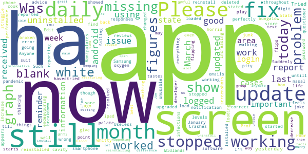

# COVID Symptom Study
App version ``2.2.0``

Analyzed with [covid-apps-observer](http://github.com/covid-apps-observer) project, version ``0.1``

## App overview
| | |
|-------------------------|-------------------------| 
| **Name**&nbsp;&nbsp;&nbsp;&nbsp;&nbsp;&nbsp;&nbsp;&nbsp;&nbsp;&nbsp;&nbsp;&nbsp;&nbsp;&nbsp;&nbsp;&nbsp;&nbsp;&nbsp;&nbsp;&nbsp;&nbsp;&nbsp;&nbsp;&nbsp;&nbsp;&nbsp;&nbsp;&nbsp;&nbsp;&nbsp;&nbsp;&nbsp;&nbsp;&nbsp;&nbsp;&nbsp;&nbsp;&nbsp;&nbsp;&nbsp;  | COVID Symptom Study |
| **Unique identifier** | com.joinzoe.covid_zoe |
| **Link to Google Play** | [https://play.google.com/store/apps/details?id=com.joinzoe.covid_zoe](https://play.google.com/store/apps/details?id=com.joinzoe.covid_zoe) |
| **Summary**  | Help slow COVID-19 by self-reporting your symptoms daily, even if you feel well. |
| **Privacy policy** | [https://predict.study/covid-privacy-notice/](https://predict.study/covid-privacy-notice/) |
| **Latest version** | 2.2.0 |
| **Last update** | 2020-12-18 12:42:28 |
| **Recent changes** | Diet study results for participating users. UI fixes. |
| **Installs**  | 1,000,000+ |
| **Category** | Health & Fitness |
| **First release** | Mar 27, 2020 |
| **Size**  | 36M |
| **Supported Android version**  | 5.0 and up |

### Description
> Take 1 minute each day and help fight the spread of COVID-19 in your community
 * Report your health daily even if you feel well
 * Get a daily estimate of COVID in your area
 * Help slow the outbreak near you
 Join millions of people supporting scientists at Stanford University, Harvard University, Massachusetts General Hospital, and King's College London to help fight coronavirus by identifying:
 * How fast the virus is spreading in your area
 * High-risk areas in the US
 * Who is most at risk, by better understanding symptoms linked to underlying health conditions
 You will contribute to advance research on COVID-19 in partnership with leading health researchers globally like TwinsUK, one of the most clinically detailed studies in the world.
 This app (formerly known as the Covid Symptom Tracker) allows you to help others, but does not give health advice. If you need health advice please visit the CDC website at: [https://www.cdc.gov/coronavirus/2019-ncov/index.html](https://www.cdc.gov/coronavirus/2019-ncov/index.html)
 This app has been designed for everyone to report their status not just those who are ill.
 It was designed by doctors and scientists at King's College London, Guys and St Thomas’ Hospitals and Zoe Global Limited, a health technology company.
 In the US the app is being used by the Nurses' Health Study to identify symptoms in active healthcare workers who are treating people with COVID across the country and risking their own health to help us.
 In response to recommendations by Stand Up To Cancer (SU2C), the app also includes questions for cancer patients and survivors, such as if they are living with cancer, what type of cancer and what treatment they are receiving.
 If you would like to help out in this difficult time, then you can. Download the app and share daily your own status, even if you are well. With your help we can understand much better the situation across the nation, how the disease presents itself to different people, and how it progresses.
 This is a new virus which the world has never seen before. There are a wide range of symptoms, which differ between people. With your help we can understand better how the disease presents itself depending upon individual factors such as health and age.
 No information you share will be used for commercial purposes.
 There are two parts to the app:
 HEALTH INFORMATION
 You will be asked to share some general information, such as your age and some health details, such as whether you have certain diseases.
 SYMPTOM TRACKING
 We will ask you every day to let us know how you feel, so you can share your symptoms. We will also ask whether you have visited the hospital, what treatment you received there, and whether you have been tested for COVID-19 (Coronavirus).

### User interface
The developers of the app provide the following screenshots in the Google play store.
| | | |
|:-------------------------:|:-------------------------:|:-------------------------:|
 |   |   |   | 
 |   |   |   | 
 |   |  

## Development team
In the following we report the main information provided by the development team in the Google play store.

| | |
|-------------------------|-------------------------|
| **Developer**  | Zoe Global Limited |
| **Website**  | [http://covid.joinzoe.com/](http://covid.joinzoe.com/) |
| **Email** | covid@joinzoe.com |
| **Physical address**  | [164 Westminster Bridge Road London SE1 7RW United Kingdom](https://www.google.com/maps/search/164%20Westminster%20Bridge%20Road%20London%20SE1%207RW%20United%20Kingdom) (Google Maps) |
| **Other developed apps**  | [https://play.google.com/store/apps/developer?id=Zoe+Global+Limited](https://play.google.com/store/apps/developer?id=Zoe+Global+Limited) |

## Android support

| | |
|-------------------------|-------------------------|
| **Declared target Android version**  | Android10, version 10 (API level 29) |
| **Effective target Android version**  | Android10, version 10 (API level 29) |
| **Minimum supported Android version**  | Lollipop, version 5.0 (API level 21) |
| **Maximum target Android version**  | - |

The larger the difference between the minimum and maximum supported Android versions, the better. A larger difference means a wider audience. For example, old phones have a very low Android version, so a high minimum supported Android version means that the app cannot be used by users with old phones, thus leading to accessibility problems. 

## Requested permissions

In the following we report the complete list of the permissions requested by the app. 

| **Permission** | **Protection level** | **Description** | 
|-------------------------|-------------------------|-------------------------|
 **android.permission ACCESS_BACKGROUND_LOCATION** | :warning:**Dangerous** | Allows an app to access location in the background. 
 **android.permission ACCESS_COARSE_LOCATION** | :warning:**Dangerous** | Allows an app to access approximate location. 
 **android.permission ACCESS_FINE_LOCATION** | :warning:**Dangerous** | Allows an app to access precise location. 
 **android.permission ACCESS_NETWORK_STATE** | Normal | Allows applications to access information about networks. 
 **android.permission ACCESS_WIFI_STATE** | Normal | Allows applications to access information about Wi-Fi networks. 
 **android.permission FOREGROUND_SERVICE** | Normal | Allows a regular application to use Service.startForeground. 
 **android.permission INTERNET** | Normal | Allows applications to open network sockets. 
 **android.permission READ_APP_BADGE** | - | - 
 **android.permission READ_EXTERNAL_STORAGE** | :warning:**Dangerous** | Allows an application to read from external storage. 
 **android.permission RECEIVE_BOOT_COMPLETED** | Normal | Allows an application to receive the Intent.ACTION_BOOT_COMPLETED that is broadcast after the system finishes booting. 
 **android.permission WAKE_LOCK** | Normal | Allows using PowerManager WakeLocks to keep processor from sleeping or screen from dimming. 
 **android.permission WRITE_EXTERNAL_STORAGE** | :warning:**Dangerous** | Allows an application to write to external storage. 
 **com.anddoes.launcher.permission UPDATE_COUNT** | - | - 
 **com.google.android.c2dm.permission RECEIVE** | - | - 
 **com.google.android.finsky.permission BIND_GET_INSTALL_REFERRER_SERVICE** | - | - 
 **com.google.android.gms.permission ACTIVITY_RECOGNITION** | - | - 
 **com.google.android.providers.gsf.permission READ_GSERVICES** | - | - 
 **com.htc.launcher.permission READ_SETTINGS** | - | - 
 **com.htc.launcher.permission UPDATE_SHORTCUT** | - | - 
 **com.huawei.android.launcher.permission CHANGE_BADGE** | - | - 
 **com.huawei.android.launcher.permission READ_SETTINGS** | - | - 
 **com.huawei.android.launcher.permission WRITE_SETTINGS** | - | - 
 **com.majeur.launcher.permission UPDATE_BADGE** | - | - 
 **com.oppo.launcher.permission READ_SETTINGS** | - | - 
 **com.oppo.launcher.permission WRITE_SETTINGS** | - | - 
 **com.sec.android.provider.badge.permission READ** | - | - 
 **com.sec.android.provider.badge.permission WRITE** | - | - 
 **com.sonyericsson.home.permission BROADCAST_BADGE** | - | - 
 **com.sonymobile.home.permission PROVIDER_INSERT_BADGE** | - | - 
 **me.everything.badger.permission BADGE_COUNT_READ** | - | - 
 **me.everything.badger.permission BADGE_COUNT_WRITE** | - | - 

## Mentioned servers

| **Server** | **Registrant** | **Registrant country** | **Creation date** | 
|-------------------------|-------------------------|-------------------------|-------------------------|
 | amplitude.com | Amplitude | :us: US | 1996-05-09 04:00:00 |
 | android.com | Google LLC | :us: US | 1997-06-23 04:00:00 |
 | google.com | Google LLC | :us: US | 1997-09-15 04:00:00 |
 | microsoft.com | Microsoft Corporation | :us: US | 1991-05-02 04:00:00 |
 | googleapis.com | Google LLC | :us: US | 2005-01-25 17:52:26 |
 | cloudfront.net | Amazon.com, Inc. | :us: US | 2008-04-25 18:25:49 |
 | expo.io | See PrivacyGuardian.org | :us: US | 2011-05-01 21:26:50 |

## Security analysis 

Below we report the main security warnings raised by our execution of the [Androwarn](https://github.com/maaaaz/androwarn) security analysis tool.

**Telephony identifiers leakage**
> - This application reads the ISO country code equivalent of the current registered operator's MCC (Mobile Country Code) 
> - This application reads the device phone type value 
> - This application reads the numeric name (MCC+MNC) of current registered operator 
> - This application reads the operator name 

**Location lookup**
> - This application reads location information from all available providers (WiFi, GPS etc.) 

**Connection interfaces exfiltration**
> - This application reads details about the currently active data network 
> - This application tries to find out if the currently active data network is metered 

**Suspicious connection establishment**
> - This application opens a Socket and connects it to the remote address '' on the 'N/A' port  
> - This application opens a Socket and connects it to the remote address 'Ljava/lang/StringBuilder;->toString()Ljava/lang/String;' on the ': connect, resolve' port  
> - This application opens a Socket and connects it to the remote address 'Ljava/lang/StringBuilder;->toString()Ljava/lang/String;' on the 'N/A' port  
> - This application opens a Socket and connects it to the remote address 'Ljava/net/Proxy;->type()Ljava/net/Proxy$Type;' on the 'N/A' port  
> - This application opens a Socket and connects it to the remote address 'timeout' on the 'N/A' port  

**Pim data leakage**
> - This application accesses data stored in the clipboard 

**Code execution**
> - This application loads a native library 
> - This application executes a UNIX command 

## User ratings and reviews

Below we provide information about how end users are reacting to the app in terms of ratings and reviews in the Google Play store.

### Ratings

The COVID Symptom Study app has been installed by more than **1000000** times. At this time, **132533** rated the app and its average score is **4.7363434**. Below we show the distribution of the ratings across the usual star-based rating of Google Play

:star::star::star::star::star:: 103236

:star::star::star::star:: 25440

:star::star::star:: 2712

:star::star:: 504

:star:: 641

### Reviews 

#### 5-star reviews

> Doing a splendid job. Easy to use.  :date: __2021-01-03 14:14:31__

> So easy and useful there is NO excuse not to use it!!  :date: __2021-01-03 13:54:56__

> Easy to use!  :date: __2021-01-03 12:34:13__

> Easy to use.  :date: __2021-01-03 12:24:12__

> This app does not tell you if you have had covid but any information you can give will help better understanding of the covid 19 virus. Please help in the fight of covid 19.  :date: __2021-01-03 11:58:48__

> Really positive pp  :date: __2021-01-03 11:38:32__

> Very helpful  :date: __2021-01-03 11:37:16__

> Brilliant and simple app to use. I work in health care with vulnerable people and I've been reporting daily since March 2020. Lots of my friends have joined, the more people contributing the better the data. Please join this community.  :date: __2021-01-03 11:08:51__

> Very easy to use  :date: __2021-01-03 11:02:31__

> Really helpful app  :date: __2021-01-03 10:57:08__

#### 4-star reviews

> Easy to complete nothing complicated  :date: __2021-01-03 12:51:39__

> Occasional glitches, but on the whole, app works well and happy to be helping  :date: __2021-01-03 11:26:15__

> I had been using the app daily since March, but in late 2020 the reminders stopped working, so I only remember to log in periodically... I have reinstalled a number of times but nothing seems to fix it. Such a shame after all the team's hard work, can't they get any IT companies to fix these glitches??! PS one day later: tried reinstalling one more time and now finally the notifications are working again - yay!  :date: __2021-01-02 18:44:27__

> Does what it says on the tin, you can report your health and covid status to researchers. It can be quite buggy, which is annoying. I went 11 days being unable to report as I couldn't log in until they did a bug fix.  :date: __2021-01-02 13:58:19__

> Easy and quick to use. Now mostly warns if there is no connection. However if connection is later lost whilst reporting symptoms, this is not reported. \*\* Broken again: Graphs of All, Month, Week don't show any data \*\*  :date: __2021-01-02 11:49:29__

> Normally no problems with app easy to use, however over the last two days my wife nor myself have been able to report app only displaying a white screen even after uninstalling and re installing app glad to say all well now.  :date: __2021-01-02 11:27:23__

> Good to know I'm contributing but I did lapse for a while. I think my phone was at fault however. Quick and easy to use.  :date: __2021-01-01 12:22:17__

> Easy to use & hopefully effective in gathering relevant information.  :date: __2021-01-01 00:08:02__

> Good app. Important in these strange times to help understand this virus in some small way.  :date: __2020-12-31 19:25:49__

> Takes just a few seconds to report how you're feeling each day. No intrusive questions.  :date: __2020-12-31 19:15:29__

#### 3-star reviews

> Can't log as when opening I just get a white screen.  :date: __2021-01-01 17:37:55__

> The next second zip code feature is great. Thank you for addding. However it would be nice if the app then reported the new zip codes county if you have moved from your original. It would also be nice if the app remebered your previous second zip code.  :date: __2021-01-01 16:29:59__

> Excellent initiative but IT side is the weak link...filled in for 6 months then it did not recognise me despite doing all fixes so had to register under different name to continue its just such a loss of 6 months linked data. That said incredible work that is being done  :date: __2021-01-01 11:49:48__

> Yep, I've got the white screen issue now as well. Worked fine until lunchtime 31/12/2020. No matter what I do, uninstall, re-install it still loads and then goes full white screen so I can no longer participate. Please fix.  :date: __2021-01-01 09:49:05__

> Not sure what it's achieving  :date: __2020-12-31 09:24:17__

> Should be useful but seems limited and a tad buggy - stats charts don't show (android 10) when click them to go through to week/month etc view. No notifications despite ensuring they are turned on. And no differentiation between the old antibody test & symptom testing - I had an antibody test months ago when I returned to work. It was positive but never had any symptoms so should be able to clarify this. Also really feel there should be a link to the official number of cases for comparison.  :date: __2020-12-31 08:38:35__

> Very clear and useful. 30/12/20 app will not display month or weekly data in graph, only the full set to dec data. Latest version 2.2 and tried a force stop  :date: __2020-12-30 18:13:29__

> I have updated the app, but still not getting daily reminders  :date: __2020-12-30 17:59:09__

> Report in daily but sometimes it's not recorded and I am being told that it's a day or more since I reported in  :date: __2020-12-30 17:35:47__

> Worked ok until 19th December when it just showed a blank screen after loading. Same after updating. Shame but this type of app must be 100% reliable to be useful. Uninstalling Update 30.12.20 Re installed following email update; seems to be working now  :date: __2020-12-30 17:33:18__

#### 2-star reviews

> I am frustrated because I kept being asked to repeat my report. I have an añdroid phone and I followed your advice to reinstall the app ensuring it is the latest version. I am NOT going to do that anymore and to that end I will not be reporting my status for a week to allow you to SORT this. Many, inclùding those involved in deciding how we are all to live our lives. Your study group use our reports to develop models, which may be skewed by additional reporting.  :date: __2021-01-02 17:57:57__

> Clear well thought out APP just need more people taking part. Or at least it was until I am now trapped with a white screen and seemingly no way of fixing it.  :date: __2021-01-02 09:27:18__

> It used to give me daily notifications to fill out the form but this stopped few months ago nothing I do can change this. Not sure if this is just me or others having the same issue.  :date: __2021-01-01 21:06:28__

> Used it since the start but reminders stopped two months ago so forget to do it  :date: __2020-12-31 15:29:28__

> Reminders just stopped working and I cannot find a way to restart them. So useless as I forget to report each day  :date: __2020-12-31 08:23:11__

> I am told by the computer that the Symtoms Study has been installed, yet i am unable to enter data from my Android laptop  :date: __2020-12-30 19:18:53__

> Still unable to add the test result even after restarting the app as the email suggested  :date: __2020-12-30 17:26:12__

> IT IS BROKEN AGAIN - CAN'T ENTER TEST RESULTS SINCE 17TH DECEMBER  :date: __2020-12-29 12:09:03__

> All, Month and Week graphs stopped working some time ago and the developer has not fixed them or responded to email.  :date: __2020-12-27 12:12:45__

> Great to assist in the fight against covid !!  :date: __2020-12-26 11:46:56__

#### 1-star reviews

> White screen of doom - I get through to the 'report today' screen very very briefly then it disappears and I get a blank white screen. Clearly not an issue just with my phone or my account by the look of other comments. I've reported daily for months and am disappointed not to be able to continue.  :date: __2021-01-01 18:10:10__

> The app has stopped working today. It launches for a split second and then the screen goes all white. Update 1 Jan, it's working now.  :date: __2021-01-01 14:49:27__

> I am now unable to open the app despite uninstalling then reinstalling many times. It now works .. 12 MD 01 01 21  :date: __2021-01-01 13:19:08__

> No updated often enough  :date: __2021-01-01 11:34:07__

> I have to say I'm really pissed off with this. There was a fault and it stopped working for a while, now I'm getting emails asking me to reinstall but with no link in the email (a no reply email address!). When you think Facebook manages literally billions of accounts, fully indexed and cross referenced, and these clowns can't cope with a simple database.... I'm doing something else instead  :date: __2020-12-31 15:41:45__

> Have been an enthusiastic user but sadly Tim Spector is misusing his data to make dangerous pronouncements. There are now better more accurate data sources available so the job here has been done...at this point users are just potential customers for Zoe's diet plans.  :date: __2020-12-31 15:22:05__

> The app is broken... Loads to a white screen.. Deleted and reloaded... Sign in then opens to a white blank screen again, unable to fill in any details...  :date: __2020-12-29 11:02:43__

> COVID data for my region is out of alignment with PHE and worryingly the app shows a fall of ~500 from last week and PHE showing a rise of 158 (~39%). True the figures shown widely disagree but the trends should be consistent. The app appears to be making the area looking better than national statistics suggest. Is there a way to get the app to show both?  :date: __2020-12-28 08:12:31__

> HELP! I've been logging every day but today after the 'splash' screen I just get an empty white screen and I can't do anything. Tried killing the app and restarting, uninstalling and re-installing but still no luck.  :date: __2020-12-24 12:11:50__

> Won't let me enter previous Covid test info so can't use app. Obviously bug in it or an issue with my One Plus 6 phone??  :date: __2020-12-23 19:09:33__

