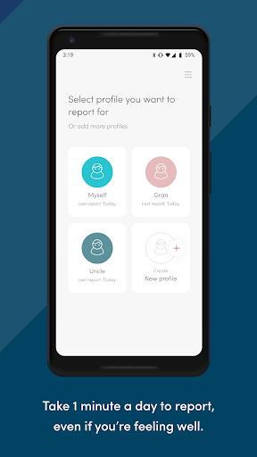
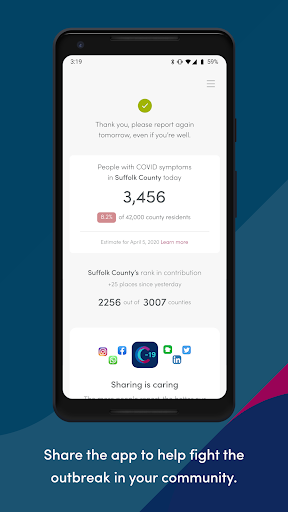
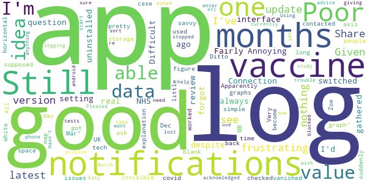

# COVID Symptom Study
App version ``2.4.0``

Analyzed with [covid-apps-observer](http://github.com/covid-apps-observer) project, version ``0.1``

## App overview
| | |
|-------------------------|-------------------------| 
| **Name**&nbsp;&nbsp;&nbsp;&nbsp;&nbsp;&nbsp;&nbsp;&nbsp;&nbsp;&nbsp;&nbsp;&nbsp;&nbsp;&nbsp;&nbsp;&nbsp;&nbsp;&nbsp;&nbsp;&nbsp;&nbsp;&nbsp;&nbsp;&nbsp;&nbsp;&nbsp;&nbsp;&nbsp;&nbsp;&nbsp;&nbsp;&nbsp;&nbsp;&nbsp;&nbsp;&nbsp;&nbsp;&nbsp;&nbsp;&nbsp;  | COVID Symptom Study |
| **Unique identifier** | com.joinzoe.covid_zoe |
| **Link to Google Play** | [https://play.google.com/store/apps/details?id=com.joinzoe.covid_zoe](https://play.google.com/store/apps/details?id=com.joinzoe.covid_zoe) |
| **Summary**  | Help slow COVID-19 by self-reporting your symptoms daily, even if you feel well. |
| **Privacy policy** | [https://predict.study/covid-privacy-notice/](https://predict.study/covid-privacy-notice/) |
| **Latest version** | 2.4.0 |
| **Last update** | 2021-02-08 21:04:34 |
| **Recent changes** | Security upgrade and bug fixes.  |
| **Installs**  | 1,000,000+ |
| **Category** | Health & Fitness |
| **First release** | Mar 27, 2020 |
| **Size**  | 37M |
| **Supported Android version**  | 5.0 and up |

### Description
> Take 1 minute each day and help fight the spread of COVID-19 in your community
 * Report your health daily even if you feel well
 * Get a daily estimate of COVID in your area
 * Help slow the outbreak near you
 Join millions of people supporting scientists at Stanford University, Harvard University, Massachusetts General Hospital, and King's College London to help fight coronavirus by identifying:
 * How fast the virus is spreading in your area
 * High-risk areas in the US
 * Who is most at risk, by better understanding symptoms linked to underlying health conditions
 You will contribute to advance research on COVID-19 in partnership with leading health researchers globally like TwinsUK, one of the most clinically detailed studies in the world.
 This app (formerly known as the Covid Symptom Tracker) allows you to help others, but does not give health advice. If you need health advice please visit the CDC website at: [https://www.cdc.gov/coronavirus/2019-ncov/index.html](https://www.cdc.gov/coronavirus/2019-ncov/index.html)
 This app has been designed for everyone to report their status not just those who are ill.
 It was designed by doctors and scientists at King's College London, Guys and St Thomas’ Hospitals and Zoe Global Limited, a health technology company.
 In the US the app is being used by the Nurses' Health Study to identify symptoms in active healthcare workers who are treating people with COVID across the country and risking their own health to help us.
 In response to recommendations by Stand Up To Cancer (SU2C), the app also includes questions for cancer patients and survivors, such as if they are living with cancer, what type of cancer and what treatment they are receiving.
 If you would like to help out in this difficult time, then you can. Download the app and share daily your own status, even if you are well. With your help we can understand much better the situation across the nation, how the disease presents itself to different people, and how it progresses.
 This is a new virus which the world has never seen before. There are a wide range of symptoms, which differ between people. With your help we can understand better how the disease presents itself depending upon individual factors such as health and age.
 No information you share will be used for commercial purposes.
 There are two parts to the app:
 HEALTH INFORMATION
 You will be asked to share some general information, such as your age and some health details, such as whether you have certain diseases.
 SYMPTOM TRACKING
 We will ask you every day to let us know how you feel, so you can share your symptoms. We will also ask whether you have visited the hospital, what treatment you received there, and whether you have been tested for COVID-19 (Coronavirus).

### User interface
The developers of the app provide the following screenshots in the Google play store.
| | | |
|:-------------------------:|:-------------------------:|:-------------------------:|
 |   |   |   | 
 |   |   |   | 
 |   |  

## Development team
In the following we report the main information provided by the development team in the Google play store.

| | |
|-------------------------|-------------------------|
| **Developer**  | Zoe Global Limited |
| **Website**  | [http://covid.joinzoe.com/](http://covid.joinzoe.com/) |
| **Email** | covid@joinzoe.com |
| **Physical address**  | [164 Westminster Bridge Road London SE1 7RW United Kingdom](https://www.google.com/maps/search/164%20Westminster%20Bridge%20Road%20London%20SE1%207RW%20United%20Kingdom) (Google Maps) |
| **Other developed apps**  | [https://play.google.com/store/apps/developer?id=Zoe+Global+Limited](https://play.google.com/store/apps/developer?id=Zoe+Global+Limited) |

## Android support

| | |
|-------------------------|-------------------------|
| **Declared target Android version**  | Android10, version 10 (API level 29) |
| **Effective target Android version**  | Android10, version 10 (API level 29) |
| **Minimum supported Android version**  | Lollipop, version 5.0 (API level 21) |
| **Maximum target Android version**  | - |

The larger the difference between the minimum and maximum supported Android versions, the better. A larger difference means a wider audience. For example, old phones have a very low Android version, so a high minimum supported Android version means that the app cannot be used by users with old phones, thus leading to accessibility problems. 

## Requested permissions

In the following we report the complete list of the permissions requested by the app. 

| **Permission** | **Protection level** | **Description** | 
|-------------------------|-------------------------|-------------------------|
 **android.permission ACCESS_NETWORK_STATE** | Normal | Allows applications to access information about networks. 
 **android.permission ACCESS_WIFI_STATE** | Normal | Allows applications to access information about Wi-Fi networks. 
 **android.permission INTERNET** | Normal | Allows applications to open network sockets. 
 **android.permission READ_APP_BADGE** | - | - 
 **android.permission READ_EXTERNAL_STORAGE** | :warning:**Dangerous** | Allows an application to read from external storage. 
 **android.permission RECEIVE_BOOT_COMPLETED** | Normal | Allows an application to receive the Intent.ACTION_BOOT_COMPLETED that is broadcast after the system finishes booting. 
 **android.permission WAKE_LOCK** | Normal | Allows using PowerManager WakeLocks to keep processor from sleeping or screen from dimming. 
 **android.permission WRITE_EXTERNAL_STORAGE** | :warning:**Dangerous** | Allows an application to write to external storage. 
 **com.anddoes.launcher.permission UPDATE_COUNT** | - | - 
 **com.google.android.c2dm.permission RECEIVE** | - | - 
 **com.google.android.finsky.permission BIND_GET_INSTALL_REFERRER_SERVICE** | - | - 
 **com.htc.launcher.permission READ_SETTINGS** | - | - 
 **com.htc.launcher.permission UPDATE_SHORTCUT** | - | - 
 **com.huawei.android.launcher.permission CHANGE_BADGE** | - | - 
 **com.huawei.android.launcher.permission READ_SETTINGS** | - | - 
 **com.huawei.android.launcher.permission WRITE_SETTINGS** | - | - 
 **com.majeur.launcher.permission UPDATE_BADGE** | - | - 
 **com.oppo.launcher.permission READ_SETTINGS** | - | - 
 **com.oppo.launcher.permission WRITE_SETTINGS** | - | - 
 **com.sec.android.provider.badge.permission READ** | - | - 
 **com.sec.android.provider.badge.permission WRITE** | - | - 
 **com.sonyericsson.home.permission BROADCAST_BADGE** | - | - 
 **com.sonymobile.home.permission PROVIDER_INSERT_BADGE** | - | - 
 **me.everything.badger.permission BADGE_COUNT_READ** | - | - 
 **me.everything.badger.permission BADGE_COUNT_WRITE** | - | - 

## Mentioned servers

| **Server** | **Registrant** | **Registrant country** | **Creation date** | 
|-------------------------|-------------------------|-------------------------|-------------------------|
 | amplitude.com | Amplitude | :us: US | 1996-05-09 04:00:00 |
 | android.com | Google LLC | :us: US | 1997-06-23 04:00:00 |
 | google.com | Google LLC | :us: US | 1997-09-15 04:00:00 |
 | microsoft.com | Microsoft Corporation | :us: US | 1991-05-02 04:00:00 |
 | googleapis.com | Google LLC | :us: US | 2005-01-25 17:52:26 |
 | cloudfront.net | Amazon.com, Inc. | :us: US | 2008-04-25 18:25:49 |
 | expo.io | See PrivacyGuardian.org | :us: US | 2011-05-01 21:26:50 |

## Security analysis 

Below we report the main security warnings raised by our execution of the [Androwarn](https://github.com/maaaaz/androwarn) security analysis tool.

**Telephony identifiers leakage**
> - This application reads the ISO country code equivalent of the current registered operator's MCC (Mobile Country Code) 
> - This application reads the device phone type value 
> - This application reads the numeric name (MCC+MNC) of current registered operator 
> - This application reads the operator name 

**Location lookup**
> - This application reads location information from all available providers (WiFi, GPS etc.) 

**Connection interfaces exfiltration**
> - This application reads details about the currently active data network 
> - This application tries to find out if the currently active data network is metered 

**Suspicious connection establishment**
> - This application opens a Socket and connects it to the remote address '' on the 'N/A' port  
> - This application opens a Socket and connects it to the remote address 'Ljava/lang/StringBuilder;->toString()Ljava/lang/String;' on the ': connect, resolve' port  
> - This application opens a Socket and connects it to the remote address 'Ljava/lang/StringBuilder;->toString()Ljava/lang/String;' on the 'N/A' port  
> - This application opens a Socket and connects it to the remote address 'Ljava/net/Proxy;->type()Ljava/net/Proxy$Type;' on the 'N/A' port  
> - This application opens a Socket and connects it to the remote address 'timeout' on the 'N/A' port  

**Pim data leakage**
> - This application accesses data stored in the clipboard 

**Code execution**
> - This application loads a native library 
> - This application loads a native library: 'log' 
> - This application loads a native library: 'sentry' 
> - This application loads a native library: 'sentry-android' 
> - This application executes a UNIX command 

## User ratings and reviews

Below we provide information about how end users are reacting to the app in terms of ratings and reviews in the Google Play store.

### Ratings

The COVID Symptom Study app has been installed by more than **1000000** times. At this time, **137117** rated the app and its average score is **4.72549**. Below we show the distribution of the ratings across the usual star-based rating of Google Play

:star::star::star::star::star:: 107010

:star::star::star::star:: 25322

:star::star::star:: 3022

:star::star:: 781

:star:: 982

### Reviews 

#### 5-star reviews

> Great to be able to help out to fight this deadly virus. Well done guys 👍👍  :date: __2021-02-13 18:30:36__

> Checked in pretty much everyday since lockdown 1 started. A glitch after a few months in but it's been fine since. Through using this app I've been asked to (& done) a test to see if I've had Covid & got a home test after feeling rough but not with.typical Covid systems. Easy to do & nice to think I'm contributing to research & knowledge.  :date: __2021-02-13 18:13:42__

> Very smooth would recommend. Keep up the good work.  :date: __2021-02-13 17:34:08__

> Great idea. UI could use some work.  :date: __2021-02-13 17:11:32__

> Simple to use.  :date: __2021-02-13 16:39:40__

> Easy to use  :date: __2021-02-13 15:04:39__

> Simple clear and I think it helps.  :date: __2021-02-13 15:04:02__

> Easy to use. Great source of information on covid 19  :date: __2021-02-13 13:53:49__

> I've had nothing to report so not sure of what good I'm doing. However, the app is very easy to use, isn't time consuming and there is easy access to information from zoe.  :date: __2021-02-13 13:48:35__

> Good way to keep tabs on things  :date: __2021-02-13 13:42:29__

#### 4-star reviews

> Ok  :date: __2021-02-13 16:20:20__

> Less than a minute a day. Excellent source of information. Local statistics and regular vlogs.  :date: __2021-02-13 15:37:46__

> So far I've maintained my logging in unless I am busy and forgetful. I intend to carry on.  :date: __2021-02-13 14:47:26__

> Easy to use.  :date: __2021-02-13 13:58:17__

> Easy to follow. Informative  :date: __2021-02-13 13:48:28__

> N problem to use and it may be of help. Just do it  :date: __2021-02-13 13:38:09__

> Easy to use and very informative.  :date: __2021-02-13 12:38:57__

> Easy and quick to report daily. Very simple display. Very interesting research links. Pod cast presentations engaging and information clearly explained.  :date: __2021-02-13 11:37:19__

> I've probably missed something, but it doesnt seem to remind me each day to do it, and I'm a bit bored of having to say that I havent had another test and i havent been vaccinated EVERY DAY... surely there could be an option to add information if one wanted to, rather than being asked two extra questions every day.  :date: __2021-02-13 11:02:15__

> Fairly easy to use but can't fulfil latest instruction as my screen not the same as Zoe's  :date: __2021-02-13 09:39:10__

#### 3-star reviews

> Get, 'Something went wrong, please try again later' each time I try to complete medical questionnaire. UPDATE: Now working ok since update. Daily reminder to enter your health status is good. App lacks ability to state that you know you have had Covid, but haven't had a test. This must apply to tens of thousands who suffered at home or who's symptoms were very mild and where caught off other tested members of same household. If to provide valuable data, surly, this must be included.  :date: __2021-02-13 13:25:45__

> Was a bit confusing as I only down loaded app after my 1st vaccine,it would not let me go back to add that I also had a head ache and fuzzy head 20hours in so if others had the same experience your symtoms value may be incorrect or wrong  :date: __2021-02-12 12:47:59__

> Easy to use.  :date: __2021-02-08 14:25:03__

> Only problem I don't know my blood group so I had to guess. There should be an option under blood group to say don't know  :date: __2021-02-06 12:32:39__

> Please fix the error with the days. I report every day and am frustrated that it continually tells me I haven't reported for 2 or more days. I've tried contacting you various ways, but nothing has changed except it can read up to 5 days now. Am I wasting my time?  :date: __2021-02-06 12:07:29__

> I failed first of all to enter my vaccination details because I was using as an early version of the app. It was only when I deleted the app in frustration that I realized that if I reinstalled it I might get a newer version. I did email Zoe for help but the instructions were confusing  :date: __2021-02-05 20:39:41__

> Lack of possibility to describe reactions to vaccination that might be helpful for the study.  :date: __2021-02-05 16:27:43__

> Was an avid user but then needed to change my email address and there's no function to do that nor way to contact the author. So had to delete.  :date: __2021-02-02 22:15:07__

> Report in daily but sometimes it's not recorded and I am being told that it's a day or more since I reported in. A month later and this is still happening, every few days my input is not being recorded  :date: __2021-02-01 18:17:15__

> Not able to input vaccine side effects other than on arm - glitch? Think it would benefit you to capture which vaccine manufacturer has been given too.  :date: __2021-01-27 19:47:12__

#### 2-star reviews

> Difficult to work. Repeatedly back to first page. Does not accept what is entered.  :date: __2021-02-13 18:00:23__

> Can no longer see the prompt on the vaccine page  :date: __2021-02-12 12:19:35__

> It stopped working, button stays grayed on screen display vaccine dosage information when one dose recorded and no change, can't hit enter.  :date: __2021-02-11 22:35:06__

> Didn't seem to have an option for being pregnant. I think a lot of my symptoms can be down to pregnancy...  :date: __2021-02-10 14:14:43__

> I am able to report me and my family's condition regularly. However, the app crashes everytime I select the COVID & Diet "Let's go" button. It also crashes before I can send feedback.  :date: __2021-02-08 04:46:23__

> Please reassure me that my data is actually being recorded. The app says I haven't entered any for 4 days. That simply isn't the case. I have missed a day as I forgot to charge my phone, but I entered data Yesterday afternoon. This inaccuracy has been there from the beginning. I want to be sure it is worthwhile continuing. Have you even seen this? Why don't you respond to my numerous contacts about this? I entered yesterday. The app says 5 days.  :date: __2021-02-06 12:17:00__

> The map makes less sense since they started using cases per million when everywhere else does it per100,000. It also appears data for Wales is at least a fortnight behind.  :date: __2021-02-05 01:08:37__

> The app has begun erroring since yesterday (28th Jan 2021). It loads, the screen with 'report today, even if you're well' appears for a split second before the whole screen goes white and stays that way. It's now unusable and this is day two of not being able to log.  :date: __2021-01-29 11:47:20__

> Unfortunately when I tried to insert a password my phone's keyboard covered the box I was meant to write it in! An elementary design error which rendered the app useless. I'm surprised this hasn't been fixed.  :date: __2021-01-27 17:23:40__

> I installed it 3 weeks ago, and to begin with it worked fine. Then it asked me to log in with my password and email for the first time. I was unable to do that because on my phone - a Samsung Galaxy A10 - as soon as I begin to type, the keyboard covers the place where the password has to go! It was also telling me my password wasn't recognised although I am certain it was the one I submitted. I tried the Force Stop recommended but it made no difference. finally I uninstalled the app. I have tried now to reinstall it but I guess I will still have the same problem. I'd be really grateful if anyone can help. It 's a great idea, but the app needs to be reliable. I am disappointed not to be able to participate.  :date: __2021-01-23 22:54:01__

#### 1-star reviews

> Cant download. Stuck on pending with a rotating circle that goes on forever.  :date: __2021-02-13 01:33:25__

> would like to record daily but the app goes to page have you had a test, which I recorded on the first day but dioes not let me go past it. anyone have any ideas which may help  :date: __2021-02-10 17:19:11__

> The app is making a massive contribution to the fight against Covid-19, and on a day-to-day basis it works fine. The downside is that it breaks when it's updated. After the last three updates I've either been unable to login (despite getting a password reset), or the daily notifications have stopped. In all cases the only fix was to uninstall the updated app and reinstall from scratch. The update process needs more testing before new versions are released otherwise users will give up.  :date: __2021-02-09 15:06:18__

> I can't report my vaccination on my profile !  :date: __2021-02-07 10:12:31__

> Downloaded this. Suspected/documented Covid only had 'yes" answers. Left that as the answer was no and completed the other questions as 'no' except that I could count on someone IF I needed help. With those entirely correct answers, 'continue' button is not highlighted. Only highlights if you say yes to documented or suspected Covid. I thought this was a general app for all, not reliant on Covid contact. Am I doing something wrong?  :date: __2021-02-06 14:01:42__

> Not easy to use. Finding how to report is poorly designed. No wonder you are short of 70+s.. its now improved now having problems editing vaccine type and batch  :date: __2021-02-06 13:02:10__

> Completely useless, no longer reminds me every day 🙄 Lucky if I remember to use it once a month now 😆 and that's NOT an exaggeration!  :date: __2021-02-06 05:36:22__

> Have uninstalled the app. Watched the recent webinar and wasn't impressed. BoJo and his Tory cronies will risk everyone's lives no matter what scientific advice is provided.  :date: __2021-02-05 00:10:13__

> Never gave any info except for NI resident, so no good for me in Brighton  :date: __2021-02-02 19:59:56__

> This should be such a simple little app. Why is it taking up 479 MB of my phone's storage??  :date: __2021-02-01 14:58:00__

