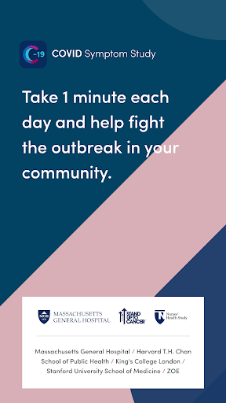
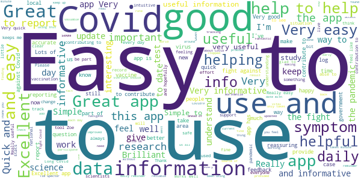
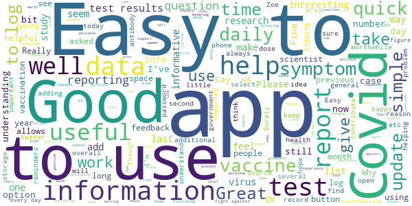
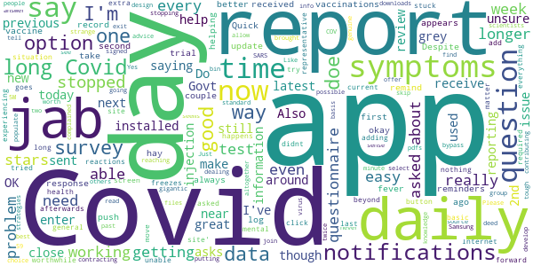
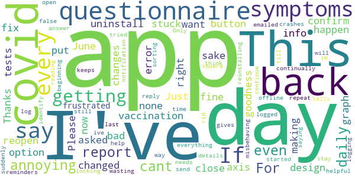
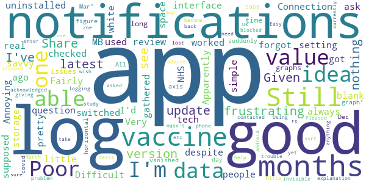

# COVID Symptom Study
App version ``2.5.0``

Analyzed with [covid-apps-observer](http://github.com/covid-apps-observer) project, version ``0.1``

## App overview
| | |
|-------------------------|-------------------------| 
| **Name**&nbsp;&nbsp;&nbsp;&nbsp;&nbsp;&nbsp;&nbsp;&nbsp;&nbsp;&nbsp;&nbsp;&nbsp;&nbsp;&nbsp;&nbsp;&nbsp;&nbsp;&nbsp;&nbsp;&nbsp;&nbsp;&nbsp;&nbsp;&nbsp;&nbsp;&nbsp;&nbsp;&nbsp;&nbsp;&nbsp;&nbsp;&nbsp;&nbsp;&nbsp;&nbsp;&nbsp;&nbsp;&nbsp;&nbsp;&nbsp;  | COVID Symptom Study |
| **Unique identifier** | com.joinzoe.covid_zoe |
| **Link to Google Play** | [https://play.google.com/store/apps/details?id=com.joinzoe.covid_zoe](https://play.google.com/store/apps/details?id=com.joinzoe.covid_zoe) |
| **Summary**  | Help slow COVID-19 by self-reporting your symptoms daily, even if you feel well. |
| **Privacy policy** | [https://predict.study/covid-privacy-notice/](https://predict.study/covid-privacy-notice/) |
| **Latest version** | 2.5.0 |
| **Last update** | 2021-05-13 15:07:39 |
| **Recent changes** | Improved support for screen readers. Add support for deep links / universal links.  |
| **Installs**  | 1,000,000+ |
| **Category** | Health & Fitness |
| **First release** | Mar 27, 2020 |
| **Size**  | 38M |
| **Supported Android version**  | 5.0 and up |

### Description
> Take 1 minute each day and help fight the spread of COVID-19 in your community
 * Report your health daily even if you feel well
 * Get a daily estimate of COVID in your area
 * Help slow the outbreak near you
 Join millions of people supporting scientists at Stanford University, Harvard University, Massachusetts General Hospital, and King's College London to help fight coronavirus by identifying:
 * How fast the virus is spreading in your area
 * High-risk areas in the US
 * Who is most at risk, by better understanding symptoms linked to underlying health conditions
 You will contribute to advance research on COVID-19 in partnership with leading health researchers globally like TwinsUK, one of the most clinically detailed studies in the world.
 This app (formerly known as the Covid Symptom Tracker) allows you to help others, but does not give health advice. If you need health advice please visit the CDC website at: [https://www.cdc.gov/coronavirus/2019-ncov/index.html](https://www.cdc.gov/coronavirus/2019-ncov/index.html)
 This app has been designed for everyone to report their status not just those who are ill.
 It was designed by doctors and scientists at King's College London, Guys and St Thomas’ Hospitals and Zoe Global Limited, a health technology company.
 In the US the app is being used by the Nurses' Health Study to identify symptoms in active healthcare workers who are treating people with COVID across the country and risking their own health to help us.
 In response to recommendations by Stand Up To Cancer (SU2C), the app also includes questions for cancer patients and survivors, such as if they are living with cancer, what type of cancer and what treatment they are receiving.
 If you would like to help out in this difficult time, then you can. Download the app and share daily your own status, even if you are well. With your help we can understand much better the situation across the nation, how the disease presents itself to different people, and how it progresses.
 This is a new virus which the world has never seen before. There are a wide range of symptoms, which differ between people. With your help we can understand better how the disease presents itself depending upon individual factors such as health and age.
 No information you share will be used for commercial purposes.
 There are two parts to the app:
 HEALTH INFORMATION
 You will be asked to share some general information, such as your age and some health details, such as whether you have certain diseases.
 SYMPTOM TRACKING
 We will ask you every day to let us know how you feel, so you can share your symptoms. We will also ask whether you have visited the hospital, what treatment you received there, and whether you have been tested for COVID-19 (Coronavirus).

### User interface
The developers of the app provide the following screenshots in the Google play store.
| | | |
|:-------------------------:|:-------------------------:|:-------------------------:|
 |   |   |   | 
 |   |   |   | 
 |   |  

## Development team
In the following we report the main information provided by the development team in the Google play store.

| | |
|-------------------------|-------------------------|
| **Developer**  | Zoe Global Limited |
| **Website**  | [http://covid.joinzoe.com/](http://covid.joinzoe.com/) |
| **Email** | covid@joinzoe.com |
| **Physical address**  | [164 Westminster Bridge Road London SE1 7RW United Kingdom](https://www.google.com/maps/search/164%20Westminster%20Bridge%20Road%20London%20SE1%207RW%20United%20Kingdom) (Google Maps) |
| **Other developed apps**  | [https://play.google.com/store/apps/developer?id=Zoe+Global+Limited](https://play.google.com/store/apps/developer?id=Zoe+Global+Limited) |

## Android support

| | |
|-------------------------|-------------------------|
| **Declared target Android version**  | Android10, version 10 (API level 29) |
| **Effective target Android version**  | Android10, version 10 (API level 29) |
| **Minimum supported Android version**  | Lollipop, version 5.0 (API level 21) |
| **Maximum target Android version**  | - |

The larger the difference between the minimum and maximum supported Android versions, the better. A larger difference means a wider audience. For example, old phones have a very low Android version, so a high minimum supported Android version means that the app cannot be used by users with old phones, thus leading to accessibility problems. 

## Requested permissions

In the following we report the complete list of the permissions requested by the app. 

| **Permission** | **Protection level** | **Description** | 
|-------------------------|-------------------------|-------------------------|
 **android.permission ACCESS_NETWORK_STATE** | Normal | Allows applications to access information about networks. 
 **android.permission ACCESS_WIFI_STATE** | Normal | Allows applications to access information about Wi-Fi networks. 
 **android.permission INTERNET** | Normal | Allows applications to open network sockets. 
 **android.permission READ_APP_BADGE** | - | - 
 **android.permission READ_EXTERNAL_STORAGE** | :warning:**Dangerous** | Allows an application to read from external storage. 
 **android.permission RECEIVE_BOOT_COMPLETED** | Normal | Allows an application to receive the Intent.ACTION_BOOT_COMPLETED that is broadcast after the system finishes booting. 
 **android.permission WAKE_LOCK** | Normal | Allows using PowerManager WakeLocks to keep processor from sleeping or screen from dimming. 
 **android.permission WRITE_EXTERNAL_STORAGE** | :warning:**Dangerous** | Allows an application to write to external storage. 
 **com.anddoes.launcher.permission UPDATE_COUNT** | - | - 
 **com.google.android.c2dm.permission RECEIVE** | - | - 
 **com.google.android.finsky.permission BIND_GET_INSTALL_REFERRER_SERVICE** | - | - 
 **com.htc.launcher.permission READ_SETTINGS** | - | - 
 **com.htc.launcher.permission UPDATE_SHORTCUT** | - | - 
 **com.huawei.android.launcher.permission CHANGE_BADGE** | - | - 
 **com.huawei.android.launcher.permission READ_SETTINGS** | - | - 
 **com.huawei.android.launcher.permission WRITE_SETTINGS** | - | - 
 **com.majeur.launcher.permission UPDATE_BADGE** | - | - 
 **com.oppo.launcher.permission READ_SETTINGS** | - | - 
 **com.oppo.launcher.permission WRITE_SETTINGS** | - | - 
 **com.sec.android.provider.badge.permission READ** | - | - 
 **com.sec.android.provider.badge.permission WRITE** | - | - 
 **com.sonyericsson.home.permission BROADCAST_BADGE** | - | - 
 **com.sonymobile.home.permission PROVIDER_INSERT_BADGE** | - | - 
 **me.everything.badger.permission BADGE_COUNT_READ** | - | - 
 **me.everything.badger.permission BADGE_COUNT_WRITE** | - | - 

## Mentioned servers

| **Server** | **Registrant** | **Registrant country** | **Creation date** | 
|-------------------------|-------------------------|-------------------------|-------------------------|
 | amplitude.com | Amplitude | :us: US | 1996-05-09 04:00:00 |
 | android.com | Google LLC | :us: US | 1997-06-23 04:00:00 |
 | google.com | Google LLC | :us: US | 1997-09-15 04:00:00 |
 | microsoft.com | Microsoft Corporation | :us: US | 1991-05-02 04:00:00 |
 | googleapis.com | Google LLC | :us: US | 2005-01-25 17:52:26 |
 | cloudfront.net | Amazon.com, Inc. | :us: US | 2008-04-25 18:25:49 |
 | expo.io | See PrivacyGuardian.org | :us: US | 2011-05-01 21:26:50 |

## Security analysis 

Below we report the main security warnings raised by our execution of the [Androwarn](https://github.com/maaaaz/androwarn) security analysis tool.

**Telephony identifiers leakage**
> - This application reads the ISO country code equivalent of the current registered operator's MCC (Mobile Country Code) 
> - This application reads the device phone type value 
> - This application reads the numeric name (MCC+MNC) of current registered operator 
> - This application reads the operator name 

**Location lookup**
> - This application reads location information from all available providers (WiFi, GPS etc.) 

**Connection interfaces exfiltration**
> - This application reads details about the currently active data network 
> - This application tries to find out if the currently active data network is metered 

**Suspicious connection establishment**
> - This application opens a Socket and connects it to the remote address '' on the 'N/A' port  
> - This application opens a Socket and connects it to the remote address 'Ljava/lang/StringBuilder;->toString()Ljava/lang/String;' on the ': connect, resolve' port  
> - This application opens a Socket and connects it to the remote address 'Ljava/lang/StringBuilder;->toString()Ljava/lang/String;' on the 'N/A' port  
> - This application opens a Socket and connects it to the remote address 'Ljava/net/Proxy;->type()Ljava/net/Proxy$Type;' on the 'N/A' port  
> - This application opens a Socket and connects it to the remote address 'timeout' on the 'N/A' port  

**Pim data leakage**
> - This application accesses data stored in the clipboard 

**Code execution**
> - This application loads a native library 
> - This application loads a native library: 'log' 
> - This application loads a native library: 'sentry' 
> - This application loads a native library: 'sentry-android' 
> - This application executes a UNIX command 

## User ratings and reviews

Below we provide information about how end users are reacting to the app in terms of ratings and reviews in the Google Play store.

### Ratings

The COVID Symptom Study app has been installed by more than **1000000** times. At this time, **141930** rated the app and its average score is **4.732828**. Below we show the distribution of the ratings across the usual star-based rating of Google Play

:star::star::star::star::star:: 112528

:star::star::star::star:: 24162

:star::star::star:: 3148

:star::star:: 909

:star:: 1183

### Reviews 

#### 5-star reviews

> Easy to use with good information  :date: __2021-05-22 14:17:49__

> Easy to follow. Easy to talk about!  :date: __2021-05-22 13:06:58__

> Simple to use and hopefully helpful too  :date: __2021-05-22 12:47:58__

> Almost a civic duty to use this spp  :date: __2021-05-22 12:46:56__

> Easy to use.  :date: __2021-05-22 11:52:33__

> Easy peasy  :date: __2021-05-22 10:17:37__

> Easy to use, and very informative.  :date: __2021-05-22 09:42:01__

> Useful and important in the fight against covid-19 and other harmful viruses.  :date: __2021-05-21 20:47:27__

> Very easy to use  :date: __2021-05-21 20:19:42__

> Really informative, feel like I'm helping in a smal way.  :date: __2021-05-21 20:13:47__

#### 4-star reviews

> Easy to do and for hubby useful informative videos on covid updates. No govt project fear rubbish.  :date: __2021-05-22 09:32:03__

> ..Great app, very easy to use. Very informative  :date: __2021-05-21 00:25:08__

> Easy to set up and use.  :date: __2021-05-20 13:23:33__

> Great app easy to use  :date: __2021-05-19 20:43:26__

> Only 2 questions make.me feel I may have missed something? Have.I?  :date: __2021-05-19 12:16:05__

> Simple app.  :date: __2021-05-19 08:48:25__

> Easy to use, informative.  :date: __2021-05-18 10:20:42__

> Had problem setting up at the beginning. But all good now  :date: __2021-05-17 21:39:59__

> I think it is important to keep track of after covid shot symptoms. This helping.  :date: __2021-05-16 17:43:04__

> Quick and easy to use. I like the weekly video update. Encouraged me to do the covid testing at home.  :date: __2021-05-15 12:27:41__

#### 3-star reviews

> Great app to support national lockd and r3se but doe snot always remind you to log and record  :date: __2021-05-15 22:37:27__

> Very good app that is easy to use . No problem with push notifications. Would have given 5 stars but for one problem. Example: I noticed when reporting this morning (14 May) that the app said that I hadn't reported for 3 days. This is incorrect and is not the first time that this has happened. There appears to be a problem here where data is not always collected, or has gone missing somehow.  :date: __2021-05-14 11:30:08__

> I'm close to giving up on this app. My second jab was done as part of a trial. The app does not want trial jabs to be recorded. So I have to lie every day and say I haven't had a second jab. I also had hay fever recently and was asked to take a Covid test. Hay fever is completely normal for me at this time of year. I will probably have it for a couple of months. I'm not taking dozens of Covid tests!  :date: __2021-05-12 01:39:30__

> It is a bit quirky ..needs some fine tuning to make it work better  :date: __2021-05-10 16:22:30__

> Worked really well until a couple of weeks ago when I stopped getting notifications. I need these to remind me to update every day. I managed to get them back for around 3 days they then stopped again. Hence why only gave 3 stars.  :date: __2021-05-08 12:34:54__

> Really good app, easy to fill the survey but I don't receive the daily reminders anymore... So I tend to forget  :date: __2021-05-07 23:46:52__

> Its not really that usefull.  :date: __2021-05-06 21:30:52__

> notifications have stopped  :date: __2021-05-06 11:24:16__

> I stopped getting the push notifications and have forgotten to log for over a week! Have remembered now but lowered the stars on this review because of that. Otherwise a fab app and idea.  :date: __2021-05-01 10:23:28__

> Hey - as of 6 days ago, I'm not getting daily notifications, so there's a gap in my records. This appears to be a bug.  :date: __2021-04-27 12:59:36__

#### 2-star reviews

> Not very helpful  :date: __2021-05-18 17:28:00__

> This app has suddenly started misbehaving. It says it is offline when it is not. Even after reinstalling it will not open- it crashes. Annoying.  :date: __2021-05-11 12:01:50__

> I send daily details but still have up to 3 reminders. Only way of getting rid of notification is to repeat . This gives false reading .  :date: __2021-05-10 18:59:47__

> App keeps locking me out, saying cant identify me, also i cant stay logged in after i get help to log back in, then im back to square 1.. ive been logging since the beginning daily till the last few days, it needs sorting for me to continue.  :date: __2021-05-09 20:08:38__

> No longer very accurate  :date: __2021-04-20 07:41:19__

> Doesn't seem easy enough to use. Can't see it going "viral". (Scuse the pun).  :date: __2021-04-15 11:48:20__

> I was in this for over a. Year but your system through me out and I can no longer get into it and can't email anyone. Too baf  :date: __2021-04-14 17:41:53__

> This app worked really well, now for some reason, it won't let me log in. I've uninstall and reinstalled and changed my password, nothing has helped 🤷‍♀️  :date: __2021-04-13 13:17:59__

> Suddenly asking me to login each time and now not recognizing my account aftrr reinstalling.  :date: __2021-04-09 17:53:00__

> Clunky, on a daily basis you need to update your profiles, yet they are only available by scrolling right to the bottom of the home screen, which you have to do again and again for EVERY profile, no thought put into how this is used daily.  :date: __2021-03-31 15:40:49__

#### 1-star reviews

> Not as good as the NHS one  :date: __2021-05-05 22:39:28__

> Annoying  :date: __2021-05-02 14:41:42__

> I haven't had any notifications for months, despite the app setting being switched on.  :date: __2021-04-19 12:47:37__

> Poor. Connection Difficult always to log in .  :date: __2021-04-09 12:28:45__

> I had this app a while ago, uninstalled it but forgot to review it. Fairly poor interface but also I'd question the value of the data gathered and how it can be of real value.  :date: __2021-04-07 03:02:39__

> Apparently I'm supposed to be able to log my vaccine on here. Still have not worked out how. Can ask other people log their vaccine, but no idea how to log my own. Very frustrating. I've checked I've got the latest version, I'm pretty tech savvy but still no idea. Given up.  :date: __2021-04-06 08:49:24__

> 547 MB of storage used!? This should be such a simple little app!  :date: __2021-04-04 15:00:35__

> Still a blank white space where the graphs should be: there were no issues for a long time, then suddenly one day they vanished! All you see is the covid case figure, 'Dec-Mar' on the horizontal axis & 'Share the graph', nothing else: you can't share what you can't see. No explanation given. Ditto for the UK map: that's become invisible too. I contacted Zoe a good while back, they acknowledged the problem...but nothing. It is a good app, but I do wish they would take the trouble to sort it out.  :date: __2021-04-01 11:56:57__

> Hasn't asked me for update for months. Not sure why it stopped giving me notifications. Using latest (android) version and notifications not blocked on phone  :date: __2021-03-28 13:42:39__

> Easy to use. Pleased to be able to help this study. Update March 21 It's lost about 3.5 months of my data. No advice yet on if I need to re-enter vaccine, tests, etc. so currently not logging anything. Frustrating.  :date: __2021-03-27 17:44:40__

