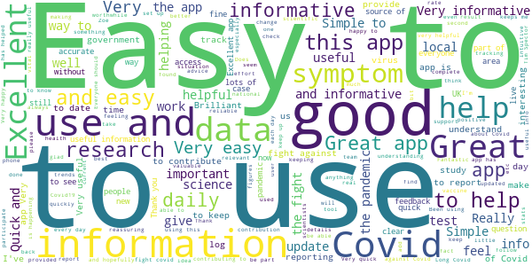
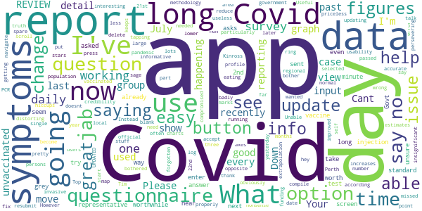
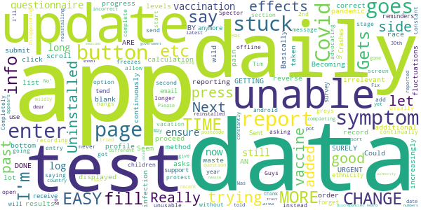

# COVID Symptom Study
App version ``2.5.0``

Analyzed with [covid-apps-observer](http://github.com/covid-apps-observer) project, version ``0.1``

## App overview
| | |
|-------------------------|-------------------------| 
| **Name**                                          | COVID Symptom Study |
| **Unique identifier** | com.joinzoe.covid_zoe |
| **Link to Google Play** | [https://play.google.com/store/apps/details?id=com.joinzoe.covid_zoe](https://play.google.com/store/apps/details?id=com.joinzoe.covid_zoe) |
| **Summary**  | Help slow COVID-19 by self-reporting your symptoms daily, even if you feel well. |
| **Privacy policy** | [https://predict.study/covid-privacy-notice/](https://predict.study/covid-privacy-notice/) |
| **Latest version** | 2.5.0 |
| **Last update** | 2021-05-13 15:07:39 |
| **Recent changes** | Improved support for screen readers. Add support for deep links / universal links.  |
| **Installs**  | 1,000,000+ |
| **Category** | Health & Fitness |
| **First release** | Mar 27, 2020 |
| **Size**  | 38M |
| **Supported Android version**  | 5.0 and up |

### Description
> Take 1 minute each day and help fight the spread of COVID-19 in your community
 * Report your health daily even if you feel well
 * Get a daily estimate of COVID in your area
 * Help slow the outbreak near you
 Join millions of people supporting scientists at Stanford University, Harvard University, Massachusetts General Hospital, and King's College London to help fight coronavirus by identifying:
 * How fast the virus is spreading in your area
 * High-risk areas in the US
 * Who is most at risk, by better understanding symptoms linked to underlying health conditions
 You will contribute to advance research on COVID-19 in partnership with leading health researchers globally like TwinsUK, one of the most clinically detailed studies in the world.
 This app (formerly known as the Covid Symptom Tracker) allows you to help others, but does not give health advice. If you need health advice please visit the CDC website at: [https://www.cdc.gov/coronavirus/2019-ncov/index.html](https://www.cdc.gov/coronavirus/2019-ncov/index.html)
 This app has been designed for everyone to report their status not just those who are ill.
 It was designed by doctors and scientists at King's College London, Guys and St Thomas’ Hospitals and Zoe Global Limited, a health technology company.
 In the US the app is being used by the Nurses' Health Study to identify symptoms in active healthcare workers who are treating people with COVID across the country and risking their own health to help us.
 In response to recommendations by Stand Up To Cancer (SU2C), the app also includes questions for cancer patients and survivors, such as if they are living with cancer, what type of cancer and what treatment they are receiving.
 If you would like to help out in this difficult time, then you can. Download the app and share daily your own status, even if you are well. With your help we can understand much better the situation across the nation, how the disease presents itself to different people, and how it progresses.
 This is a new virus which the world has never seen before. There are a wide range of symptoms, which differ between people. With your help we can understand better how the disease presents itself depending upon individual factors such as health and age.
 No information you share will be used for commercial purposes.
 There are two parts to the app:
 HEALTH INFORMATION
 You will be asked to share some general information, such as your age and some health details, such as whether you have certain diseases.
 SYMPTOM TRACKING
 We will ask you every day to let us know how you feel, so you can share your symptoms. We will also ask whether you have visited the hospital, what treatment you received there, and whether you have been tested for COVID-19 (Coronavirus).

### User interface
The developers of the app provide the following screenshots in the Google play store.
| | | |
|:-------------------------:|:-------------------------:|:-------------------------:|
 |   |   |   | 
 |   |   |   | 
 |   |  

## Development team
In the following we report the main information provided by the development team in the Google play store.

| | |
|-------------------------|-------------------------|
| **Developer**  | Zoe Global Limited |
| **Website**  | [http://covid.joinzoe.com/](http://covid.joinzoe.com/) |
| **Email** | covid@joinzoe.com |
| **Physical address**  | [164 Westminster Bridge Road London SE1 7RW United Kingdom](https://www.google.com/maps/search/164%20Westminster%20Bridge%20Road%20London%20SE1%207RW%20United%20Kingdom) (Google Maps) |
| **Other developed apps**  | [https://play.google.com/store/apps/developer?id=Zoe+Global+Limited](https://play.google.com/store/apps/developer?id=Zoe+Global+Limited) |

## Android support

| | |
|-------------------------|-------------------------|
| **Declared target Android version**  | Android10, version 10 (API level 29) |
| **Effective target Android version**  | Android10, version 10 (API level 29) |
| **Minimum supported Android version**  | Lollipop, version 5.0 (API level 21) |
| **Maximum target Android version**  | - |

The larger the difference between the minimum and maximum supported Android versions, the better. A larger difference means a wider audience. For example, old phones have a very low Android version, so a high minimum supported Android version means that the app cannot be used by users with old phones, thus leading to accessibility problems. 

## Requested permissions

In the following we report the complete list of the permissions requested by the app. 

| **Permission** | **Protection level** | **Description** | 
|-------------------------|-------------------------|-------------------------|
 **android.permission ACCESS_NETWORK_STATE** | Normal | Allows applications to access information about networks. 
 **android.permission ACCESS_WIFI_STATE** | Normal | Allows applications to access information about Wi-Fi networks. 
 **android.permission INTERNET** | Normal | Allows applications to open network sockets. 
 **android.permission READ_APP_BADGE** | - | - 
 **android.permission READ_EXTERNAL_STORAGE** | :warning:**Dangerous** | Allows an application to read from external storage. 
 **android.permission RECEIVE_BOOT_COMPLETED** | Normal | Allows an application to receive the Intent.ACTION_BOOT_COMPLETED that is broadcast after the system finishes booting. 
 **android.permission WAKE_LOCK** | Normal | Allows using PowerManager WakeLocks to keep processor from sleeping or screen from dimming. 
 **android.permission WRITE_EXTERNAL_STORAGE** | :warning:**Dangerous** | Allows an application to write to external storage. 
 **com.anddoes.launcher.permission UPDATE_COUNT** | - | - 
 **com.google.android.c2dm.permission RECEIVE** | - | - 
 **com.google.android.finsky.permission BIND_GET_INSTALL_REFERRER_SERVICE** | - | - 
 **com.htc.launcher.permission READ_SETTINGS** | - | - 
 **com.htc.launcher.permission UPDATE_SHORTCUT** | - | - 
 **com.huawei.android.launcher.permission CHANGE_BADGE** | - | - 
 **com.huawei.android.launcher.permission READ_SETTINGS** | - | - 
 **com.huawei.android.launcher.permission WRITE_SETTINGS** | - | - 
 **com.majeur.launcher.permission UPDATE_BADGE** | - | - 
 **com.oppo.launcher.permission READ_SETTINGS** | - | - 
 **com.oppo.launcher.permission WRITE_SETTINGS** | - | - 
 **com.sec.android.provider.badge.permission READ** | - | - 
 **com.sec.android.provider.badge.permission WRITE** | - | - 
 **com.sonyericsson.home.permission BROADCAST_BADGE** | - | - 
 **com.sonymobile.home.permission PROVIDER_INSERT_BADGE** | - | - 
 **me.everything.badger.permission BADGE_COUNT_READ** | - | - 
 **me.everything.badger.permission BADGE_COUNT_WRITE** | - | - 

## Mentioned servers

| **Server** | **Registrant** | **Registrant country** | **Creation date** | 
|-------------------------|-------------------------|-------------------------|-------------------------|
 | amplitude.com | Amplitude | :us: US | 1996-05-09 04:00:00 |
 | android.com | Google LLC | :us: US | 1997-06-23 04:00:00 |
 | google.com | Google LLC | :us: US | 1997-09-15 04:00:00 |
 | microsoft.com | Microsoft Corporation | :us: US | 1991-05-02 04:00:00 |
 | googleapis.com | Google LLC | :us: US | 2005-01-25 17:52:26 |
 | cloudfront.net | Amazon.com, Inc. | :us: US | 2008-04-25 18:25:49 |
 | expo.io | See PrivacyGuardian.org | :us: US | 2011-05-01 21:26:50 |

## Security analysis 

Below we report the main security warnings raised by our execution of the [Androwarn](https://github.com/maaaaz/androwarn) security analysis tool.

**Telephony identifiers leakage**
> - This application reads the ISO country code equivalent of the current registered operator's MCC (Mobile Country Code) 
> - This application reads the device phone type value 
> - This application reads the numeric name (MCC+MNC) of current registered operator 
> - This application reads the operator name 

**Location lookup**
> - This application reads location information from all available providers (WiFi, GPS etc.) 

**Connection interfaces exfiltration**
> - This application reads details about the currently active data network 
> - This application tries to find out if the currently active data network is metered 

**Suspicious connection establishment**
> - This application opens a Socket and connects it to the remote address '' on the 'N/A' port  
> - This application opens a Socket and connects it to the remote address 'Ljava/lang/StringBuilder;->toString()Ljava/lang/String;' on the ': connect, resolve' port  
> - This application opens a Socket and connects it to the remote address 'Ljava/lang/StringBuilder;->toString()Ljava/lang/String;' on the 'N/A' port  
> - This application opens a Socket and connects it to the remote address 'Ljava/net/Proxy;->type()Ljava/net/Proxy$Type;' on the 'N/A' port  
> - This application opens a Socket and connects it to the remote address 'timeout' on the 'N/A' port  

**Pim data leakage**
> - This application accesses data stored in the clipboard 

**Code execution**
> - This application loads a native library 
> - This application loads a native library: 'log' 
> - This application loads a native library: 'sentry' 
> - This application loads a native library: 'sentry-android' 
> - This application executes a UNIX command 

## User ratings and reviews

Below we provide information about how end users are reacting to the app in terms of ratings and reviews in the Google Play store.

### Ratings

The COVID Symptom Study app has been installed by more than **1000000** times. At this time, **141930** rated the app and its average score is **4.732828**. Below we show the distribution of the ratings across the usual star-based rating of Google Play

:star::star::star::star::star:: 112528

:star::star::star::star:: 24162

:star::star::star:: 3148

:star::star:: 909

:star:: 1183

### Reviews 

#### 5-star reviews

> Pertinent and practical info. Glad somebody still cares rather than pretending that "covid never exited". Ta !  :date: __2021-07-30 14:40:29__

> I've done this so long that it's become a good habit and makes me feel like I'm contributing to an important cause. Thank you for doing this!!  :date: __2021-07-30 13:49:26__

> Does exactly what it's designed to.  :date: __2021-07-30 13:48:39__

> Very useful for doing your bit help understand current status of the virus and get in depth access to scientific information.  :date: __2021-07-30 13:42:53__

> Useful  :date: __2021-07-30 13:11:45__

> Ok  :date: __2021-07-30 12:43:07__

> Easy to use. Lots of Covid information available.  :date: __2021-07-30 12:08:55__

> Easy way to keep track of what's going on  :date: __2021-07-30 12:06:51__

> Fine but not many people near me use it so it wasn't that helpful for me  :date: __2021-07-30 10:57:45__

> Really informative and makes me feel I am helping fight covid  :date: __2021-07-30 09:27:20__

#### 4-star reviews

> If it helps to track it and helps with understanding its nature of spread of Covid we should all use this app  :date: __2021-07-30 14:17:40__

> They ask if you ever had a cobid test..if you say yes you cannot log in any info..mine was neg over a year ago so i had to say no to log in vaccine info..thus seems wrong  :date: __2021-07-30 04:32:43__

> Glad to be of help  :date: __2021-07-29 16:39:49__

> Well worth the time and effort  :date: __2021-07-27 16:57:04__

> I've been registering on this app daily for 16 months now. For data it's got to be worthwhile.  :date: __2021-07-26 17:36:30__

> I am not very techno minded, but I found the app very easy to use  :date: __2021-07-26 13:09:38__

> Really good but occasionally thr app drops out  :date: __2021-07-26 12:19:56__

> Still easy to use.  :date: __2021-07-25 10:40:01__

> Very straight forward, easy to use, plenty of covid information available.  :date: __2021-07-24 15:38:12__

> No option to log a double test if your a candidate on the ONS survey. I give 4 wkly finger prick blood for antibody research as well as nose & throat swabs but App only allows you to log one or the other, not both.  :date: __2021-07-24 13:17:08__

#### 3-star reviews

> When updating my profile, tapping update doesnt move in. Cant get passed this point so cant log data  :date: __2021-07-27 23:30:44__

> I've used the app from the start and it has been interesting to see their estimates of the pandemic which had the ring of truth and were often lower than the official/ sage nonsense figures, so it was informative. However more recently and particularly since the 21st July methodology change the figures are far less accurate and show large increases when the opposite is obviously the case. Does government funding talk? Your credibility is now badly compromised in my view  :date: __2021-07-26 21:33:38__

> It's a good app. Since the last change to the figures the local cases graph detail view shows no graph, only the axes.  :date: __2021-07-25 15:46:27__

> UPDATED REVIEW FOR 22nd JULY 2021: the Covid map for my regional area of Perth & Kinross, for the past year is blank.  :date: __2021-07-22 21:14:41__

> I'm reporting every day but the app keeps saying I've missed 1, 2, 3 or more days! I haven't! If this is happening to lots of app users it's distorting the data. Please fix this error. 22/7/21 this is happening again. What's going wrong?  :date: __2021-07-22 10:04:07__

> Easy to use and non invasive. Top marks. 7 months later...UPDATE. Down to 3 stars! As the input of unvaccinated persons (we are getting few) is pretty useless to compile charts according to Tim, it has become an app for the vaccinated only. So if you are unvaccinated I would not bother with this app, your data input is insignificant. I am going to delete it.  :date: __2021-07-18 10:21:19__

> I don't like that the app uses extrapolation of date from a self selected group, I do not think this is properly representative of the population.  :date: __2021-07-15 12:19:01__

> Had some hiccups when it wouldn't accept my normal standard answer. But hey, up and running when needed, so worth persevering. And the data is priceless  :date: __2021-07-09 18:41:36__

> I wanted to take part, but after 3 days its already forgotten all the info I already put in about my vaccine ans stuff. I can spare 1 minute but I can't be bothered to resubmit the same info over and over.  :date: __2021-07-09 06:05:19__

> Unable to update details after PCR.test  :date: __2021-07-07 15:31:52__

#### 2-star reviews

> Could be much more user friendly & efficient. I cannot understand why there is no interest in tracking vaccine trial participants. At the least, there should be an option to select trial participant instead of recording the requested not vaccinated, even though I have been fully vaccinated since 12/2020.  :date: __2021-07-29 21:25:27__

> Suddenly stopped working. No functionality since 19 July 2021  :date: __2021-07-22 09:30:20__

> Cases projections are now very out of step with official figures. App says 30k per day new cases reducing, reality is 50k per day and growing. False security is dangerous!!  :date: __2021-07-17 15:36:16__

> Doesnt differ from long covid symptoms as a reporting app - i would find it useful to have a section on the longevity of symptoms  :date: __2021-07-12 17:42:05__

> Please add a small script to this app so that if I have already logged my symptoms, the app doesn't send a notification to do it. It's intrusive and very annoying.  :date: __2021-07-08 12:08:59__

> I've had to re-load this app four times since I started. If I hadn't been so determined, I would have given up long ago. I have an Android phone. Other than that- great app guys. I hope that better statistical science will be the result of your efforts.  :date: __2021-07-06 12:23:07__

> The app stuck on a questionnaire about covid and covid symptoms of which I have none but I can't get out of it. If I close the app and reopen it is back at the questionnaire with no option to say I haven't had covid and I've not had any symptoms.  :date: __2021-06-10 14:56:18__

> This app has been fine up until now, but being asked to confirm, every day, that my vaccination info hasn't changed (I've had both, so why would it?) and my tests... its bad design and its getting very annoying. Just put a button so we can report changes if they happen? Its making me want to uninstall it. Thanks  :date: __2021-06-09 12:43:13__

> For goodness sake get the graph axis right... 8 June 2021.  :date: __2021-06-08 15:05:45__

> Please fix the error with the days. I report every day and am frustrated that it continually tells me 2 days even to to 5. I've emailed, no reply. I've tried everything I can think of to get an answer. Am I wasting my time doing this?  :date: __2021-05-28 19:06:11__

#### 1-star reviews

> Unable to submit daily symptom. When I click on my profile under "who I'm reporting for" it asks me to fill in additional info (race etc) when I do the proceed button goes blank and I cannot progress  :date: __2021-07-26 12:08:51__

> THIS IS GETTING MORE URGENT AS TIME GOES BY AND MORE TESTS ARE DONE - SURELY AN EASY CHANGE!Could the record of test results be displayed in reverse order as when you have taken a lot of tests it is a pain having to scroll to the bottom just to say the list is correct.  :date: __2021-07-25 10:21:50__

> Becoming increasingly irrelevant as the pandemic goes on. Seem to continuously change the method of calculation of infection levels with wild fluctuations. Basically a waste of time.  :date: __2021-07-24 12:11:24__

> Gets stuck when trying to update my ethnicity so I can't use the app to report. Sent email to support.  :date: __2021-07-23 12:14:47__

> Really good app, easy to fill the survey but I don't receive the daily reminders anymore... So I tend to forget  :date: __2021-07-12 19:37:39__

> Crashes continually since android update unusable  :date: __2021-07-08 07:38:05__

> Gets stuck at recording a test stage.  :date: __2021-07-07 23:10:49__

> Uninstalled after a year in protest at Tim Spector advocating vaccines for children.  :date: __2021-07-02 19:28:36__

> Completely freezes on start up screen  :date: __2021-06-14 12:46:15__

> Cannot send data about 2nd vacation as it's asking about symptoms and will not go past this section, press enter and it just hangs  :date: __2021-06-12 11:30:37__

