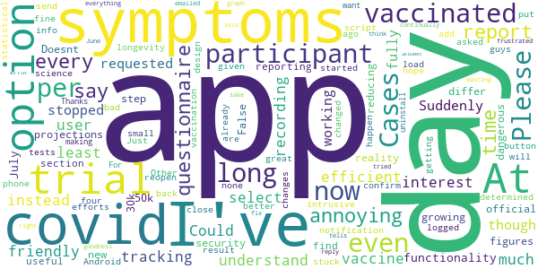

# COVID Symptom Study
App version ``2.5.0``

Analyzed with [covid-apps-observer](http://github.com/covid-apps-observer) project, version ``0.1``

## App overview
| | |
|-------------------------|-------------------------| 
| **Name**                                          | COVID Symptom Study |
| **Unique identifier** | com.joinzoe.covid_zoe |
| **Link to Google Play** | [https://play.google.com/store/apps/details?id=com.joinzoe.covid_zoe](https://play.google.com/store/apps/details?id=com.joinzoe.covid_zoe) |
| **Summary**  | Help slow COVID-19 by self-reporting your symptoms daily, even if you feel well. |
| **Privacy policy** | [https://predict.study/covid-privacy-notice/](https://predict.study/covid-privacy-notice/) |
| **Latest version** | 2.5.0 |
| **Last update** | 2021-05-13 15:07:39 |
| **Recent changes** | Improved support for screen readers. Add support for deep links / universal links.  |
| **Installs**  | 1,000,000+ |
| **Category** | Health & Fitness |
| **First release** | Mar 27, 2020 |
| **Size**  | 38M |
| **Supported Android version**  | 5.0 and up |

### Description
> Take 1 minute each day and help fight the spread of COVID-19 in your community
 * Report your health daily even if you feel well
 * Get a daily estimate of COVID in your area
 * Help slow the outbreak near you
 Join millions of people supporting scientists at Stanford University, Harvard University, Massachusetts General Hospital, and King's College London to help fight coronavirus by identifying:
 * How fast the virus is spreading in your area
 * High-risk areas in the US
 * Who is most at risk, by better understanding symptoms linked to underlying health conditions
 You will contribute to advance research on COVID-19 in partnership with leading health researchers globally like TwinsUK, one of the most clinically detailed studies in the world.
 This app (formerly known as the Covid Symptom Tracker) allows you to help others, but does not give health advice. If you need health advice please visit the CDC website at: [https://www.cdc.gov/coronavirus/2019-ncov/index.html](https://www.cdc.gov/coronavirus/2019-ncov/index.html)
 This app has been designed for everyone to report their status not just those who are ill.
 It was designed by doctors and scientists at King's College London, Guys and St Thomas’ Hospitals and Zoe Global Limited, a health technology company.
 In the US the app is being used by the Nurses' Health Study to identify symptoms in active healthcare workers who are treating people with COVID across the country and risking their own health to help us.
 In response to recommendations by Stand Up To Cancer (SU2C), the app also includes questions for cancer patients and survivors, such as if they are living with cancer, what type of cancer and what treatment they are receiving.
 If you would like to help out in this difficult time, then you can. Download the app and share daily your own status, even if you are well. With your help we can understand much better the situation across the nation, how the disease presents itself to different people, and how it progresses.
 This is a new virus which the world has never seen before. There are a wide range of symptoms, which differ between people. With your help we can understand better how the disease presents itself depending upon individual factors such as health and age.
 No information you share will be used for commercial purposes.
 There are two parts to the app:
 HEALTH INFORMATION
 You will be asked to share some general information, such as your age and some health details, such as whether you have certain diseases.
 SYMPTOM TRACKING
 We will ask you every day to let us know how you feel, so you can share your symptoms. We will also ask whether you have visited the hospital, what treatment you received there, and whether you have been tested for COVID-19 (Coronavirus).

### User interface
The developers of the app provide the following screenshots in the Google play store.
| | | |
|:-------------------------:|:-------------------------:|:-------------------------:|
 |   |   |   | 
 |   |   |   | 
 |   |  

## Development team
In the following we report the main information provided by the development team in the Google play store.

| | |
|-------------------------|-------------------------|
| **Developer**  | Zoe Global Limited |
| **Website**  | [http://covid.joinzoe.com/](http://covid.joinzoe.com/) |
| **Email** | covid@joinzoe.com |
| **Physical address**  | [164 Westminster Bridge Road London SE1 7RW United Kingdom](https://www.google.com/maps/search/164%20Westminster%20Bridge%20Road%20London%20SE1%207RW%20United%20Kingdom) (Google Maps) |
| **Other developed apps**  | [https://play.google.com/store/apps/developer?id=Zoe+Global+Limited](https://play.google.com/store/apps/developer?id=Zoe+Global+Limited) |

## Android support

| | |
|-------------------------|-------------------------|
| **Declared target Android version**  | Android10, version 10 (API level 29) |
| **Effective target Android version**  | Android10, version 10 (API level 29) |
| **Minimum supported Android version**  | Lollipop, version 5.0 (API level 21) |
| **Maximum target Android version**  | - |

The larger the difference between the minimum and maximum supported Android versions, the better. A larger difference means a wider audience. For example, old phones have a very low Android version, so a high minimum supported Android version means that the app cannot be used by users with old phones, thus leading to accessibility problems. 

## Requested permissions

In the following we report the complete list of the permissions requested by the app. 

| **Permission** | **Protection level** | **Description** | 
|-------------------------|-------------------------|-------------------------|
 **android.permission ACCESS_NETWORK_STATE** | Normal | Allows applications to access information about networks. 
 **android.permission ACCESS_WIFI_STATE** | Normal | Allows applications to access information about Wi-Fi networks. 
 **android.permission INTERNET** | Normal | Allows applications to open network sockets. 
 **android.permission READ_APP_BADGE** | - | - 
 **android.permission READ_EXTERNAL_STORAGE** | :warning:**Dangerous** | Allows an application to read from external storage. 
 **android.permission RECEIVE_BOOT_COMPLETED** | Normal | Allows an application to receive the Intent.ACTION_BOOT_COMPLETED that is broadcast after the system finishes booting. 
 **android.permission WAKE_LOCK** | Normal | Allows using PowerManager WakeLocks to keep processor from sleeping or screen from dimming. 
 **android.permission WRITE_EXTERNAL_STORAGE** | :warning:**Dangerous** | Allows an application to write to external storage. 
 **com.anddoes.launcher.permission UPDATE_COUNT** | - | - 
 **com.google.android.c2dm.permission RECEIVE** | - | - 
 **com.google.android.finsky.permission BIND_GET_INSTALL_REFERRER_SERVICE** | - | - 
 **com.htc.launcher.permission READ_SETTINGS** | - | - 
 **com.htc.launcher.permission UPDATE_SHORTCUT** | - | - 
 **com.huawei.android.launcher.permission CHANGE_BADGE** | - | - 
 **com.huawei.android.launcher.permission READ_SETTINGS** | - | - 
 **com.huawei.android.launcher.permission WRITE_SETTINGS** | - | - 
 **com.majeur.launcher.permission UPDATE_BADGE** | - | - 
 **com.oppo.launcher.permission READ_SETTINGS** | - | - 
 **com.oppo.launcher.permission WRITE_SETTINGS** | - | - 
 **com.sec.android.provider.badge.permission READ** | - | - 
 **com.sec.android.provider.badge.permission WRITE** | - | - 
 **com.sonyericsson.home.permission BROADCAST_BADGE** | - | - 
 **com.sonymobile.home.permission PROVIDER_INSERT_BADGE** | - | - 
 **me.everything.badger.permission BADGE_COUNT_READ** | - | - 
 **me.everything.badger.permission BADGE_COUNT_WRITE** | - | - 

## Mentioned servers

| **Server** | **Registrant** | **Registrant country** | **Creation date** | 
|-------------------------|-------------------------|-------------------------|-------------------------|
 | amplitude.com | Amplitude | :us: US | 1996-05-09 04:00:00 |
 | android.com | Google LLC | :us: US | 1997-06-23 04:00:00 |
 | google.com | Google LLC | :us: US | 1997-09-15 04:00:00 |
 | microsoft.com | Microsoft Corporation | :us: US | 1991-05-02 04:00:00 |
 | googleapis.com | Google LLC | :us: US | 2005-01-25 17:52:26 |
 | cloudfront.net | Amazon.com, Inc. | :us: US | 2008-04-25 18:25:49 |
 | expo.io | See PrivacyGuardian.org | :us: US | 2011-05-01 21:26:50 |

## Security analysis 

Below we report the main security warnings raised by our execution of the [Androwarn](https://github.com/maaaaz/androwarn) security analysis tool.

**Telephony identifiers leakage**
> - This application reads the ISO country code equivalent of the current registered operator's MCC (Mobile Country Code) 
> - This application reads the device phone type value 
> - This application reads the numeric name (MCC+MNC) of current registered operator 
> - This application reads the operator name 

**Location lookup**
> - This application reads location information from all available providers (WiFi, GPS etc.) 

**Connection interfaces exfiltration**
> - This application reads details about the currently active data network 
> - This application tries to find out if the currently active data network is metered 

**Suspicious connection establishment**
> - This application opens a Socket and connects it to the remote address '' on the 'N/A' port  
> - This application opens a Socket and connects it to the remote address 'Ljava/lang/StringBuilder;->toString()Ljava/lang/String;' on the ': connect, resolve' port  
> - This application opens a Socket and connects it to the remote address 'Ljava/lang/StringBuilder;->toString()Ljava/lang/String;' on the 'N/A' port  
> - This application opens a Socket and connects it to the remote address 'Ljava/net/Proxy;->type()Ljava/net/Proxy$Type;' on the 'N/A' port  
> - This application opens a Socket and connects it to the remote address 'timeout' on the 'N/A' port  

**Pim data leakage**
> - This application accesses data stored in the clipboard 

**Code execution**
> - This application loads a native library 
> - This application loads a native library: 'log' 
> - This application loads a native library: 'sentry' 
> - This application loads a native library: 'sentry-android' 
> - This application executes a UNIX command 

## User ratings and reviews

Below we provide information about how end users are reacting to the app in terms of ratings and reviews in the Google Play store.

### Ratings

The COVID Symptom Study app has been installed by more than **1000000** times. At this time, **141930** rated the app and its average score is **4.732828**. Below we show the distribution of the ratings across the usual star-based rating of Google Play

:star::star::star::star::star:: 112528

:star::star::star::star:: 24162

:star::star::star:: 3148

:star::star:: 909

:star:: 1183

### Reviews 

#### 5-star reviews

> Excellent App. Very informative. Better than the Government's track and trace waste of billions  :date: __2021-06-11 10:22:05__

> Easy to use and navigate.  :date: __2021-06-11 09:45:31__

> Important study.  :date: __2021-06-11 09:08:50__

> Finally someone who talks sense and is helpful. Thank you  :date: __2021-06-10 23:47:55__

> Simple and easy to use very clear questions, still doing this app as at June 2021 I think it's really important  :date: __2021-06-10 22:24:42__

> Quick and easy to report daily for me and my children  :date: __2021-06-10 20:42:39__

> This app is very worthwhile.It helps cientists to understand the spread of COVID and how to fight against it for the benefit of us all.  :date: __2021-06-10 18:15:44__

> Helpful to check each day.  :date: __2021-06-10 17:48:46__

> Took me several attempts to actually access it and input my log in but now it is working fine! No problems since  :date: __2021-06-10 17:04:08__

> Simple, intuitive but comprehensive  :date: __2021-06-10 15:18:13__

#### 4-star reviews

> The app is gathering important data about Covid and offers helpful information.  :date: __2021-06-11 09:18:45__

> Very good.  :date: __2021-06-11 02:02:19__

> Options regarding my emotions and a few other questions do not apply, and the reasons behind why I am feeling as I do are not relevant to the study.  :date: __2021-06-10 22:20:22__

> Fine - no symptoms - daily reporting.  :date: __2021-06-09 08:09:59__

> Just like a normal form to fill in, asking questions about your health problems, and if it's related to the Coronavirus.  :date: __2021-06-08 23:15:53__

> Generally great but occationally logs me out and takes 6 days and several resets to get in again  :date: __2021-06-08 19:51:28__

> Very good  :date: __2021-06-08 19:14:41__

> Why is everyone with a smartphone not doing this?  :date: __2021-06-08 09:24:05__

> Really good way to help fight covid-19. Signup and help  :date: __2021-06-06 19:54:20__

> Clear information  :date: __2021-06-06 14:01:13__

#### 3-star reviews

> What is going on. It asks me if I have had long Covid and there is no option to say No. The only option is Yes or unsure. A strange design choice for a survey.  :date: __2021-06-11 10:54:53__

> The new long covid question is stopping me from daily reporting. I answer the standard questions before reaching the long covid one off question. It asks me if I've had covid but there is no option to say no. If I select unsure, I'm asked about the symptoms. I haven't had covid but can't say no to bypass the question so my daily report isn't sent.  :date: __2021-06-11 09:37:11__

> The latest covid-19 one off questionnaire does not make sense. Like one or two others on here, I cannot exit the questionnaire even though I have never had Covid to the best of my knowledge  :date: __2021-06-10 15:37:54__

> A great source of genuine info and advice on Covid 19 it's a gigantic group app with around 4.5M people contributing their Covid symptoms that helps scientists help Govt to develop strategies for dealing with Covid. Do a good deed and join in - it only takes a minute a day. I've brought my review down from 5* to 3*, because the data downloads in the app on my Samsung S9+ are .bin files, not .pdfs and I can't find a way to read them. I have complained, but the response I received was that it was working for them, tough. Despite this, it is still worth putting the data in on a daily basis and helping to populate the report sent to Govt, even if I can't see it myself  :date: __2021-06-09 17:55:51__

> Just okay  :date: __2021-06-05 19:52:15__

> Report jabs not working  :date: __2021-06-03 15:48:44__

> The app seems to have signed me up twice and is now saying l haven't logged my vaccinations, which l have!  :date: __2021-06-03 14:32:12__

> Lost my information and have not been able to retrieve it  :date: __2021-05-30 17:54:00__

> Frustrated that ZOE has not found a way to let participants enter their vaccines from test centers.  :date: __2021-05-29 04:52:48__

> Ok app, does what it supposed to do  :date: __2021-05-25 16:59:28__

#### 2-star reviews

> The app stuck on a questionnaire about covid and covid symptoms of which I have none but I can't get out of it. If I close the app and reopen it is back at the questionnaire with no option to say I haven't had covid and I've not had any symptoms.  :date: __2021-06-10 14:56:18__

> This app has been fine up until now, but being asked to confirm, every day, that my vaccination info hasn't changed (I've had both, so why would it?) and my tests... its bad design and its getting very annoying. Just put a button so we can report changes if they happen? Its making me want to uninstall it. Thanks  :date: __2021-06-09 12:43:13__

> For goodness sake get the graph axis right... 8 June 2021.  :date: __2021-06-08 15:05:45__

> Please fix the error with the days. I report every day and am frustrated that it continually tells me 2 days even to to 5. I've emailed, no reply. I've tried everything I can think of to get an answer. Am I wasting my time doing this?  :date: __2021-05-28 19:06:11__

> Not very helpful  :date: __2021-05-18 17:28:00__

> This app has suddenly started misbehaving. It says it is offline when it is not. Even after reinstalling it will not open- it crashes. Annoying.  :date: __2021-05-11 12:01:50__

> I send daily details but still have up to 3 reminders. Only way of getting rid of notification is to repeat . This gives false reading .  :date: __2021-05-10 18:59:47__

> App keeps locking me out, saying cant identify me, also i cant stay logged in after i get help to log back in, then im back to square 1.. ive been logging since the beginning daily till the last few days, it needs sorting for me to continue.  :date: __2021-05-09 20:08:38__

> No longer very accurate  :date: __2021-04-20 07:41:19__

> Doesn't seem easy enough to use. Can't see it going "viral". (Scuse the pun).  :date: __2021-04-15 11:48:20__

#### 1-star reviews

> I had trouble last November which was sorted now(June 2021) asks me to fill in questionnaire about long covid assuming I have had covid,I haven't. Can't say haven't had or get past this... Won't let me report health. I hope too many people are not affected.  :date: __2021-06-10 22:04:47__

> Can't complete todays log. After tapping "feel ok" app throws up a long Covid Questionnaire with no exit! I've never had it! Fix this or I'm out....  :date: __2021-06-10 09:06:29__

> Guys, you added questionnaire about long Covid which doesn't allow option to say you never had Covid. And you cannot complete your daily data entry without completing long Covid Fix it!!  :date: __2021-06-10 08:59:40__

> Doesnt differ from long covid symptoms as a reporting app  :date: __2021-06-08 18:24:45__

> Oh dear it's really gone to pot. I constantly have to enter my postcode and now can't report as the added questionnaire won't let me past question 1 as I can't enter a 'No' Please sort this out.  :date: __2021-06-02 09:38:00__

> Has up to date info but I'm unable to log my vaccination, told to ensure I have latest updates etc. so even reinstalled app to ensure this, but still can't. Disappointing. Update 30th May, tried reinstalling app yet again and still unable to log vaccination so think I'll give up with it.  :date: __2021-05-30 15:41:22__

> Was good, but recent data appears to be incorrect. The data being reported for my area of the country is wildly different from the government data and local health authority data. I have emailed about the discrepancies but have heard nothing back. Have uninstalled the App now as I don't trust the numbers.  :date: __2021-05-27 13:06:03__

> Not as good as the NHS one  :date: __2021-05-05 22:39:28__

> Annoying  :date: __2021-05-02 14:41:42__

> I haven't had any notifications for months, despite the app setting being switched on.  :date: __2021-04-19 12:47:37__

