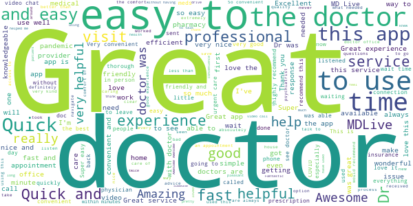
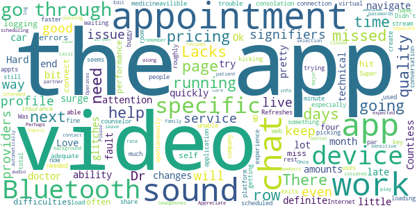

# MDLIVE: Talk to a Doctor 24/7
App version ``4.43.1``

Analyzed with [covid-apps-observer](http://github.com/covid-apps-observer) project, version ``0.1``

## App overview
| | |
|-------------------------|-------------------------| 
| **Name**&nbsp;&nbsp;&nbsp;&nbsp;&nbsp;&nbsp;&nbsp;&nbsp;&nbsp;&nbsp;&nbsp;&nbsp;&nbsp;&nbsp;&nbsp;&nbsp;&nbsp;&nbsp;&nbsp;&nbsp;&nbsp;&nbsp;&nbsp;&nbsp;&nbsp;&nbsp;&nbsp;&nbsp;&nbsp;&nbsp;&nbsp;&nbsp;&nbsp;&nbsp;&nbsp;&nbsp;&nbsp;&nbsp;&nbsp;&nbsp;  | MDLIVE: Talk to a Doctor 24/7 |
| **Unique identifier** | com.mdlive.mobile |
| **Link to Google Play** | [https://play.google.com/store/apps/details?id=com.mdlive.mobile](https://play.google.com/store/apps/details?id=com.mdlive.mobile) |
| **Summary**  | The MDLIVE app makes connecting with a doctor fast, easy, and convenient. |
| **Privacy policy** | [https://www.mdlive.com/consumer/privacy.html](https://www.mdlive.com/consumer/privacy.html) |
| **Latest version** | 4.43.1 |
| **Last update** | 2020-10-28 19:12:09 |
| **Recent changes** | - Design changes to improve the experience of connecting with our providers, as well as managing your health care needs - General bug fixes and improvements |
| **Installs**  | 100,000+ |
| **Category** | Medical |
| **First release** | Jul 11, 2014 |
| **Size**  | 47M |
| **Supported Android version**  | 5.0 and up |

### Description
> Have an MDLIVE virtual doctor visit with board-certified physicians from the comfort and convenience of your own home or from wherever you are, whenever you want – nights, after hours, weekends and holidays.
 MDLIVE also offers behavioral health appointments with licensed therapists and board-certified psychiatrists as well as dermatology services.
 You can schedule an appointment at a time and day that's convenient for you or have an on-demand visit in around 15 minutes.
 All MDLIVE doctors are board-certified and state-licensed, with an average of 15+ years of experience. MDLIVE has two National Committee for Quality Assurance certifications and is accredited by the American Telemedicine Association. MDLIVE doctors are also friendly, caring, compassionate, and experts in conducting virtual medical consultations. And best of all, 9 out of 10 people would recommend us to their friends and family members in need of a doctor visit.
 Great reasons to use MDLIVE virtual doctors:
 1.	You’re not feeling up to leaving home
 2.	You want to avoid the high cost of Urgent Care or the ER
 3.	Your doctor isn’t available
 4.	It's after hours, the weekend or a holiday
 5.	You need a short-term refill on a prescription
 6.	It’s hard to get to the doctor’s office
 7.	You don’t want to take time off work or be away from home
  
 MDLIVE doctors treat over 50 non-emergency medical conditions like these:
 • Allergies
 • Bronchitis
 • Colds & Flu
 • Ear Pain
 • Fever
 • Migraines
 • Pink Eye
 • Rash 
 • Sinus Infections
 • Sore Throat
 • Urinary Tract Infections (Female, 18+)
 • And more…
 We also offer treatment and support for a wide variety of behavioral health issues:
 • Addictions
 • Anxiety
 • Bipolar Disorder
 • Couples Therapy
 • Depression
 • Eating Disorders
 • LGBTQ Support
 • Panic Disorders
 • Postpartum Depression
 • Relationships
 • Social Anxiety
 • Stress Management
 • PTSD (Post-traumatic Stress Disorder)
 • And more
 We treat thousands of people a day with many different conditions, but you should not use MDLIVE if you are experiencing a medical emergency. In addition, we don't treat sexually transmitted diseases, urinary tract infections in males, or urinary tract infections in females under 18 years of age. Children under 3 with a fever and children under 12 with ear pain cannot be treated by MDLIVE.
 Copyright © 2020 MDLIVE, Inc. All Rights Reserved. 
 MDLIVE may not be available in certain states and is subject to state regulations.  MDLIVE does not replace the primary care physician, is not an insurance product, and may not be able to substitute for traditional in-person care in every case or for every condition. 
 MDLIVE does not guarantee patients will receive a prescription, does not prescribe DEA controlled substances and may not prescribe non-therapeutic drugs and certain other drugs which may be harmful because of their potential for abuse. 
 MDLIVE and the MDLIVE logo are registered trademarks of MDLIVE, Inc. and may not be used without written permission. For complete terms of use visit www.mdlive.com/terms-of-use

### User interface
The developers of the app provide the following screenshots in the Google play store.
| | | |
|:-------------------------:|:-------------------------:|:-------------------------:|
 |   |   |   | 

## Development team
In the following we report the main information provided by the development team in the Google play store.

| | |
|-------------------------|-------------------------|
| **Developer**  | MDLIVE Inc |
| **Website**  | [http://www.mdlive.com](http://www.mdlive.com) |
| **Email** | androidsupport@mdlive.com |
| **Physical address**  | - |
| **Other developed apps**  | [https://play.google.com/store/apps/developer?id=MDLIVE+Inc](https://play.google.com/store/apps/developer?id=MDLIVE+Inc) |

## Android support

| | |
|-------------------------|-------------------------|
| **Declared target Android version**  | Android10, version 10 (API level 29) |
| **Effective target Android version**  | Android10, version 10 (API level 29) |
| **Minimum supported Android version**  | Lollipop, version 5.0 (API level 21) |
| **Maximum target Android version**  | - |

The larger the difference between the minimum and maximum supported Android versions, the better. A larger difference means a wider audience. For example, old phones have a very low Android version, so a high minimum supported Android version means that the app cannot be used by users with old phones, thus leading to accessibility problems. 

## Requested permissions

In the following we report the complete list of the permissions requested by the app. 

| **Permission** | **Protection level** | **Description** | 
|-------------------------|-------------------------|-------------------------|
 **android.permission ACCESS_COARSE_LOCATION** | :warning:**Dangerous** | Allows an app to access approximate location. 
 **android.permission ACCESS_FINE_LOCATION** | :warning:**Dangerous** | Allows an app to access precise location. 
 **android.permission ACCESS_NETWORK_STATE** | Normal | Allows applications to access information about networks. 
 **android.permission ACCESS_WIFI_STATE** | Normal | Allows applications to access information about Wi-Fi networks. 
 **android.permission BLUETOOTH** | Normal | Allows applications to connect to paired bluetooth devices. 
 **android.permission CALL_PHONE** | :warning:**Dangerous** | Allows an application to initiate a phone call without going through the Dialer user interface for the user to confirm the call. 
 **android.permission CAMERA** | :warning:**Dangerous** | Required to be able to access the camera device. 
 **android.permission FOREGROUND_SERVICE** | Normal | Allows a regular application to use Service.startForeground. 
 **android.permission INTERNET** | Normal | Allows applications to open network sockets. 
 **android.permission MODIFY_AUDIO_SETTINGS** | Normal | Allows an application to modify global audio settings. 
 **android.permission READ_CALENDAR** | :warning:**Dangerous** | Allows an application to read the user's calendar data. 
 **android.permission RECORD_AUDIO** | :warning:**Dangerous** | Allows an application to record audio. 
 **android.permission USE_BIOMETRIC** | Normal | Allows an app to use device supported biometric modalities. 
 **android.permission USE_FINGERPRINT** | Normal | This constant was deprecated in API level 28. Applications should request USE_BIOMETRIC instead 
 **android.permission WAKE_LOCK** | Normal | Allows using PowerManager WakeLocks to keep processor from sleeping or screen from dimming. 
 **android.permission WRITE_CALENDAR** | :warning:**Dangerous** | Allows an application to write the user's calendar data. 
 **android.permission WRITE_EXTERNAL_STORAGE** | :warning:**Dangerous** | Allows an application to write to external storage. 
 **com.android.launcher.permission INSTALL_SHORTCUT** | Normal | Allows an application to install a shortcut in Launcher. 
 **com.google.android.c2dm.permission RECEIVE** | - | - 
 **com.google.android.finsky.permission BIND_GET_INSTALL_REFERRER_SERVICE** | - | - 
 **com.google.android.providers.gsf.permission READ_GSERVICES** | - | - 

## Mentioned servers

| **Server** | **Registrant** | **Registrant country** | **Creation date** | 
|-------------------------|-------------------------|-------------------------|-------------------------|
 | facebook.com | Facebook, Inc. | :us: US | 1997-03-29 05:00:00 |
 | google.com | Google LLC | :us: US | 1997-09-15 04:00:00 |
 | googlesyndication.com | Google LLC | :us: US | 2003-01-21 06:17:24 |
 | google-analytics.com | Google LLC | :us: US | 2005-07-18 19:24:32 |
 | app-measurement.com | Google LLC | :us: US | 2015-06-19 20:13:31 |
 | appboy.com | Braze, Inc. | :us: US | 2008-10-06 23:28:32 |
 | braze.com | Braze, Inc. | :us: US | 2000-01-19 02:18:28 |
 | googleapis.com | Google LLC | :us: US | 2005-01-25 17:52:26 |
 | googleadservices.com | Google LLC | :us: US | 2003-06-19 16:34:53 |
 | googleapis.com | Google LLC | :us: US | 2005-01-25 17:52:26 |
 | crashlytics.com | Google LLC | :us: US | 2011-01-21 15:30:40 |
 | arcgis.com | ESRI | :us: US | 1999-06-09 22:21:51 |
 | mdlive.com | Domains By Proxy, LLC | :us: US | 1999-04-07 04:00:00 |
 | hostedpci.com | Domains By Proxy, LLC | :us: US | 2009-05-26 17:47:23 |
 | mapbox.com | Whois Privacy Service | :us: US | 2003-11-27 11:15:57 |
 | googleapis.com | Google LLC | :us: US | 2005-01-25 17:52:26 |
 | dermatologistoncall.com | Iagnosis, Inc. | :us: US | 2011-07-09 18:25:58 |
 | iagnosis-test.com | Iagnosis, Inc. | :us: US | 2012-06-06 17:00:28 |
 | googleapis.com | Google LLC | :us: US | 2005-01-25 17:52:26 |

## Security analysis 

Below we report the main security warnings raised by our execution of the [Androwarn](https://github.com/maaaaz/androwarn) security analysis tool.

**Telephony identifiers leakage**
> - This application reads the device phone type value 
> - This application reads the numeric name (MCC+MNC) of current registered operator 
> - This application reads the operator name 

**Connection interfaces exfiltration**
> - This application reads details about the currently active data network 
> - This application tries to find out if the currently active data network is metered 

**Telephony services abuse**
> - This application makes phone calls 

**Suspicious connection establishment**
> - This application opens a Socket and connects it to the remote address ' returned no addresses for  ; port is out of range' on the 'N/A' port  
> - This application opens a Socket and connects it to the remote address '' on the 'N/A' port  
> - This application opens a Socket and connects it to the remote address 'Ljava/lang/StringBuilder;->toString()Ljava/lang/String;' on the 'N/A' port  
> - This application opens a Socket and connects it to the remote address 'Ljava/net/Proxy;->type()Ljava/net/Proxy$Type;' on the 'N/A' port  
> - This application opens a Socket and connects it to the remote address 'timeout' on the 'N/A' port  

**Code execution**
> - This application loads a native library 
> - This application executes a UNIX command containing this argument: '2' 

## User ratings and reviews

Below we provide information about how end users are reacting to the app in terms of ratings and reviews in the Google Play store.

### Ratings

The MDLIVE: Talk to a Doctor 24/7 app has been installed by more than **100000** times. At this time, **3597** rated the app and its average score is **4.70765**. Below we show the distribution of the ratings across the usual star-based rating of Google Play

:star::star::star::star::star:: 2979

:star::star::star::star:: 432

:star::star::star:: 59

:star::star:: 9

:star:: 118

### Reviews 

#### 5-star reviews

> Amazing tool  :date: __2020-12-12 21:00:16__

> Used this for years.  :date: __2020-12-12 17:35:00__

> Excellent service!  :date: __2020-12-11 23:59:45__

> I had an absolutely life changing experience with my therapist I met through this app!  :date: __2020-12-11 20:49:15__

> Making an appointment was quick and easy. The doctor was able to identify and offer a solution for my reason for contacting MDLIVE. Most of all the virtual visit saved me time and out of pocket costs.  :date: __2020-12-11 04:14:14__

> Great doctors.  :date: __2020-12-11 01:37:25__

> My daughter has the best time we love it!  :date: __2020-12-11 00:43:16__

> This has been an awesome application especially during the current situation of the country  :date: __2020-12-10 21:13:24__

> Very helpful, the doctor was well informed and had me taken care of quite quickly. I will definitely refer people over.  :date: __2020-12-10 21:06:12__

> Simple and quick!  :date: __2020-12-10 19:25:07__

#### 4-star reviews

> Overall, this is an amazing app and an incredible blessing during a pandemic. Dealing with continued therapy appointments has proved to be a tad difficult. Obviously one would like to keep the same provider but you are unable to schedule another appointment until the next day and unless the provider is currently seeing patients, they don't show up in the list to select. Other than this small issue, this app is worth dealing with!  :date: __2020-12-12 02:31:36__

> This has been super helpful for the pandemic. Do have some issues for the 2 times I used it connecting to the video call. Seems to look like it freezes and the doc is either not joining or something is wrong and no indication of what it is.  :date: __2020-12-10 16:26:53__

> A little glitchy at first. Was unable to add my medication and allergy history. The problem resolved itself within a few days. Other than that, a fantastic application. Easy to use, quality video and audio, and a plethora of healthcare providers at your fingertips  :date: __2020-12-03 18:14:50__

> The sound was horrible, couldn't hear a word from what the doctor was saying, although I did the sound test. Now, I have no sound on YouTube, volume is all the way up, but can barely hear.  :date: __2020-11-30 19:39:17__

> The interface could use some improvements but overall the concept is helpful and has potential.  :date: __2020-11-25 22:47:36__

> Works well, give you a reminder when session is available  :date: __2020-11-25 19:19:29__

> Great video, sound wouldn't work  :date: __2020-11-18 16:18:16__

> It was actually really great, the doctor was great. Took little time, got my prescripton.  :date: __2020-11-18 15:21:28__

> Had a hard time connecting the first try. Once connected, it was great.  :date: __2020-11-13 23:20:05__

> Great experience!  :date: __2020-11-12 20:39:45__

#### 3-star reviews

> Love the ability to have help or a doctor pretty quickly but the video quality is in definite need of attention.  :date: __2020-12-08 01:45:06__

> Countless technical difficulties logging in to do a video chat missed four appointments in a row because video chat wouldn't connect.  :date: __2020-12-06 01:58:44__

> The app its self is hit or miss performance. There are often errors especially with video stream consolation. The rest of the app seems to work fine. I missed a total of 4 appts in a row.  :date: __2020-12-01 19:39:15__

> Super buggy. Lacks adequate loading signifiers. Lacks profile signifiers when 2 people share the same name. Refreshes spontaneously when trying to create profile. But still a good service. Was able to get my medicine way faster than if I scheduled a live appointment.  :date: __2020-12-01 04:32:18__

> The app did not work i had to go through my insurance company to get through something is not good with the app it just keeps kicking me to web page not avilible  :date: __2020-11-28 00:29:37__

> Internet connection is the key. I had a counselor before and she uses this platform so I don't have much experience with picking providers. But the video quality, sound, and virtual waiting room were all up to par.  :date: __2020-11-21 20:02:37__

> I have used MD live a few times. I am now having trouble with the app itself. I keep getting unable to load needed service. And application exits.  :date: __2020-11-08 16:06:56__

> Didn't get to video chat w/the Dr.& had roughly a 3 minute conversation with the Dr.  :date: __2020-10-24 00:23:40__

> The scheduling and appointment help has been awesome. The major issue I have is that the sound when on the appointments will not go through my Bluetooth headphones. This is the only app that the calls won't go through. Edit: Appreciate passing it along. I isolated the issue; when the app is running,even in the background, no sound from any app will play to any Bluetooth device. Once the app is closed, the Bluetooth audio in other apps works as expected. Please contact me for more specific info  :date: __2020-08-21 17:38:12__

> Operates as intended, but doesn't remember specific patient on a specific device, so it would be better to automatically log in as me on my device, and not my partner/the "who needs care" selection screen. Perhaps even separate passwords for family members in case of sensitive topics?  :date: __2020-07-30 23:24:47__

#### 2-star reviews

> Great experience, would definitely use again. It was convenient and very easy to use. Update: Used again and was extremely disappointed. The doctor never looked and my pictures that I had sent. Also I wanted a video call, instead the doctor called me on the phone, he was driving and like I said he never looked at my pictures because he asked me to describe my rash. Without looking at my pictures he went ahead and diagnosed me even after I told him I already had the prescription he prescribed it  :date: __2020-12-01 17:20:58__

> It keeps crashing  :date: __2020-12-01 13:47:38__

> Mediocre for video; awful for scheduling. You can tell it any date you want to schedule a doctor and it will show you all doctors whether they are available or not.  :date: __2020-10-28 22:04:50__

> Nice idea, not done in a good way. Started seeing a therapist about 2 months ago & around 2 weeks after, I couldn't message her on their system. Last week, I couldn't confirm an appt., I called support. They did nothing. They said they would escalate it, and I never heard anything back. When I mentioned the message problem, they didn't acknowledge it. I had to message them again to see what was going on. Turns out it was something my therapist needed to do on her end, they didn't even know.  :date: __2020-09-24 00:57:38__

> Had to set up my first visit 5 times. Crashed anr would not let me move on from particular fields. Seemed to get stuck trying to add primary provider. Audio on first call was choppy. My wife has used before on hers and up till recent had not noted similar issue. Could have been network rather than app  :date: __2020-09-04 17:22:25__

> Auto created account through cigna, username looks like a name and UUID, but login of app doesn't allow more than 30 chars and doesn't accept email (site does). Unable to login via app, so kinda useless there.  :date: __2020-08-09 21:11:42__

> I have tried to use this app to separate times to speak with a doctor using a video call and the first time it would not take my credit card information and I never could get that to complete and now this second time I could never get past the screen asking for my blood pressure my heart rate my blood glucose levels and that sort of thing I can get to that point and it would never go any further no matter what I did so I just closed the app logged into the website through Google and everything w  :date: __2020-07-23 17:07:26__

> The app is ok. There were always some issues with the the video chat and scheduling. The dr I spoke to basically had no idea what I was talking about. He just got paid for telling me to go to urgent care. Which I finally got a hold of my PCP and she figured it out. There are not enough providers for other services.  :date: __2020-06-26 22:23:55__

> Always crashing. After I fill out everything to book the appointment this app crashes. It's been doing this for over a year and I always have to go to the website to make the appointment.  :date: __2020-06-12 21:53:18__

> The doctors don't pay attention to the medications you take the time to fill out and will just prescribe the first one that pops up  :date: __2020-05-19 05:58:46__

#### 1-star reviews

> Never even got to create an account due to it kept reloading and clearing EVERYTHING I had already entered out. If I could give NO stars I would! I DEFINITELY DON'T RECOMMEND!  :date: __2020-12-03 07:42:07__

> I created an account and verified my email and your app is saying my user name and password are invalid. This app is useless.  :date: __2020-11-30 16:13:04__

> Their automated system didn't take my insurance, and I was charged the full amount. I called 3 weeks before my card was to be charged, and they opened a ticket but it wasn't resolved in time, so I have to pay the full amount and follow up on my own to make sure I get my credit. Also, the doctor was nice and helpful, but the medicine he prescribed didn't work and I was unable to contact the doctor who prescribed it when my prescription was over and I still had the present health issue.  :date: __2020-11-24 17:17:13__

> Crashes before i even have a chance to create an account.  :date: __2020-11-20 22:09:55__

> Disconnected, would not connect me with a physician  :date: __2020-11-19 14:49:15__

> So when are you gonna support android tablets? Been told it's coming soon for 2 years! Your providers have a tablet app, your competitors have a tablet app. Seriously as a dev myself it's not hard  :date: __2020-11-18 15:16:07__

> This app is terrible. I can't even get passed the part where i put in my insurance. Just takes me to a blank page. Its even worse through the BCBSTX app.  :date: __2020-11-17 23:57:07__

> This app hardly works. Waited 45 minutes to speak to a doctor only to have the app not able to connect. Took me a total of 4 hours to actually speak to someone when I gave up and used a laptop.  :date: __2020-11-16 04:04:41__

> Horrible  :date: __2020-11-13 19:23:49__

> Very clunky... took me multiple tries/guesses just to sign up. Needs work  :date: __2020-11-13 15:53:52__

