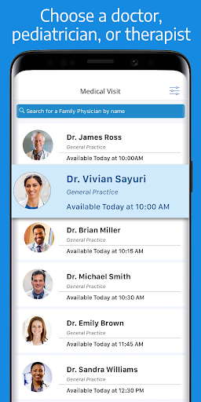
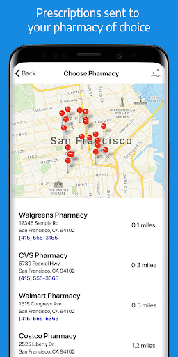
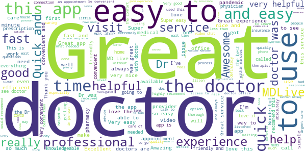
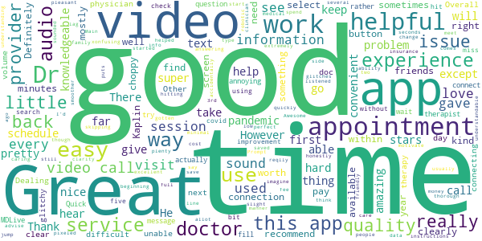
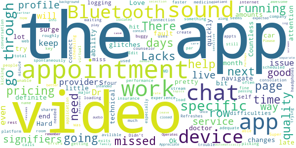
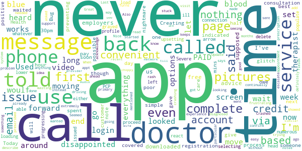
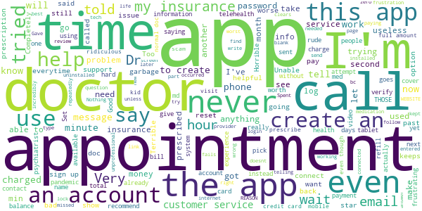

# MDLIVE: Talk to a Doctor 24/7
App version ``4.44.1``

Analyzed with [covid-apps-observer](http://github.com/covid-apps-observer) project, version ``0.1``

## App overview
| | |
|-------------------------|-------------------------| 
| **Name**&nbsp;&nbsp;&nbsp;&nbsp;&nbsp;&nbsp;&nbsp;&nbsp;&nbsp;&nbsp;&nbsp;&nbsp;&nbsp;&nbsp;&nbsp;&nbsp;&nbsp;&nbsp;&nbsp;&nbsp;&nbsp;&nbsp;&nbsp;&nbsp;&nbsp;&nbsp;&nbsp;&nbsp;&nbsp;&nbsp;&nbsp;&nbsp;&nbsp;&nbsp;&nbsp;&nbsp;&nbsp;&nbsp;&nbsp;&nbsp;  | MDLIVE: Talk to a Doctor 24/7 |
| **Unique identifier** | com.mdlive.mobile |
| **Link to Google Play** | [https://play.google.com/store/apps/details?id=com.mdlive.mobile](https://play.google.com/store/apps/details?id=com.mdlive.mobile) |
| **Summary**  | The MDLIVE app makes connecting with a doctor fast, easy, and convenient. |
| **Privacy policy** | [https://www.mdlive.com/consumer/privacy.html](https://www.mdlive.com/consumer/privacy.html) |
| **Latest version** | 4.44.1 |
| **Last update** | 2021-03-02 21:57:52 |
| **Recent changes** | - General bug fixes and improvements |
| **Installs**  | 500,000+ |
| **Category** | Medical |
| **First release** | Jul 11, 2014 |
| **Size**  | 48M |
| **Supported Android version**  | 5.0 and up |

### Description
> Have an MDLIVE virtual doctor visit with board-certified physicians from the comfort and convenience of your own home or from wherever you are, whenever you want – nights, after hours, weekends and holidays.
 MDLIVE also offers behavioral health appointments with licensed therapists and board-certified psychiatrists as well as dermatology services.
 You can schedule an appointment at a time and day that's convenient for you or have an on-demand visit in around 15 minutes.
 All MDLIVE doctors are board-certified and state-licensed, with an average of 15+ years of experience. MDLIVE has two National Committee for Quality Assurance certifications and is accredited by the American Telemedicine Association. MDLIVE doctors are also friendly, caring, compassionate, and experts in conducting virtual medical consultations. And best of all, 9 out of 10 people would recommend us to their friends and family members in need of a doctor visit.
 Great reasons to use MDLIVE virtual doctors:
 1.	You’re not feeling up to leaving home
 2.	You want to avoid the high cost of Urgent Care or the ER
 3.	Your doctor isn’t available
 4.	It's after hours, the weekend or a holiday
 5.	You need a short-term refill on a prescription
 6.	It’s hard to get to the doctor’s office
 7.	You don’t want to take time off work or be away from home
  
 MDLIVE doctors treat over 50 non-emergency medical conditions like these:
 • Allergies
 • Bronchitis
 • Colds & Flu
 • Ear Pain
 • Fever
 • Migraines
 • Pink Eye
 • Rash 
 • Sinus Infections
 • Sore Throat
 • Urinary Tract Infections (Female, 18+)
 • And more…
 We also offer treatment and support for a wide variety of behavioral health issues:
 • Addictions
 • Anxiety
 • Bipolar Disorder
 • Couples Therapy
 • Depression
 • Eating Disorders
 • LGBTQ Support
 • Panic Disorders
 • Postpartum Depression
 • Relationships
 • Social Anxiety
 • Stress Management
 • PTSD (Post-traumatic Stress Disorder)
 • And more
 We treat thousands of people a day with many different conditions, but you should not use MDLIVE if you are experiencing a medical emergency. In addition, we don't treat sexually transmitted diseases, urinary tract infections in males, or urinary tract infections in females under 18 years of age. Children under 3 with a fever and children under 12 with ear pain cannot be treated by MDLIVE.
 Copyright © 2020 MDLIVE, Inc. All Rights Reserved. 
 MDLIVE may not be available in certain states and is subject to state regulations.  MDLIVE does not replace the primary care physician, is not an insurance product, and may not be able to substitute for traditional in-person care in every case or for every condition. 
 MDLIVE does not guarantee patients will receive a prescription, does not prescribe DEA controlled substances and may not prescribe non-therapeutic drugs and certain other drugs which may be harmful because of their potential for abuse. 
 MDLIVE and the MDLIVE logo are registered trademarks of MDLIVE, Inc. and may not be used without written permission. For complete terms of use visit www.mdlive.com/terms-of-use

### User interface
The developers of the app provide the following screenshots in the Google play store.
| | | |
|:-------------------------:|:-------------------------:|:-------------------------:|
 |   |   |   | 

## Development team
In the following we report the main information provided by the development team in the Google play store.

| | |
|-------------------------|-------------------------|
| **Developer**  | MDLIVE Inc |
| **Website**  | [http://www.mdlive.com](http://www.mdlive.com) |
| **Email** | androidsupport@mdlive.com |
| **Physical address**  | - |
| **Other developed apps**  | [https://play.google.com/store/apps/developer?id=MDLIVE+Inc](https://play.google.com/store/apps/developer?id=MDLIVE+Inc) |

## Android support

| | |
|-------------------------|-------------------------|
| **Declared target Android version**  | Android10, version 10 (API level 29) |
| **Effective target Android version**  | Android10, version 10 (API level 29) |
| **Minimum supported Android version**  | Lollipop, version 5.0 (API level 21) |
| **Maximum target Android version**  | - |

The larger the difference between the minimum and maximum supported Android versions, the better. A larger difference means a wider audience. For example, old phones have a very low Android version, so a high minimum supported Android version means that the app cannot be used by users with old phones, thus leading to accessibility problems. 

## Requested permissions

In the following we report the complete list of the permissions requested by the app. 

| **Permission** | **Protection level** | **Description** | 
|-------------------------|-------------------------|-------------------------|
 **android.permission ACCESS_COARSE_LOCATION** | :warning:**Dangerous** | Allows an app to access approximate location. 
 **android.permission ACCESS_FINE_LOCATION** | :warning:**Dangerous** | Allows an app to access precise location. 
 **android.permission ACCESS_NETWORK_STATE** | Normal | Allows applications to access information about networks. 
 **android.permission ACCESS_WIFI_STATE** | Normal | Allows applications to access information about Wi-Fi networks. 
 **android.permission BLUETOOTH** | Normal | Allows applications to connect to paired bluetooth devices. 
 **android.permission CALL_PHONE** | :warning:**Dangerous** | Allows an application to initiate a phone call without going through the Dialer user interface for the user to confirm the call. 
 **android.permission CAMERA** | :warning:**Dangerous** | Required to be able to access the camera device. 
 **android.permission FOREGROUND_SERVICE** | Normal | Allows a regular application to use Service.startForeground. 
 **android.permission INTERNET** | Normal | Allows applications to open network sockets. 
 **android.permission MODIFY_AUDIO_SETTINGS** | Normal | Allows an application to modify global audio settings. 
 **android.permission READ_CALENDAR** | :warning:**Dangerous** | Allows an application to read the user's calendar data. 
 **android.permission RECORD_AUDIO** | :warning:**Dangerous** | Allows an application to record audio. 
 **android.permission USE_BIOMETRIC** | Normal | Allows an app to use device supported biometric modalities. 
 **android.permission USE_FINGERPRINT** | Normal | This constant was deprecated in API level 28. Applications should request USE_BIOMETRIC instead 
 **android.permission WAKE_LOCK** | Normal | Allows using PowerManager WakeLocks to keep processor from sleeping or screen from dimming. 
 **android.permission WRITE_CALENDAR** | :warning:**Dangerous** | Allows an application to write the user's calendar data. 
 **android.permission WRITE_EXTERNAL_STORAGE** | :warning:**Dangerous** | Allows an application to write to external storage. 
 **com.android.launcher.permission INSTALL_SHORTCUT** | Normal | Allows an application to install a shortcut in Launcher. 
 **com.google.android.c2dm.permission RECEIVE** | - | - 
 **com.google.android.finsky.permission BIND_GET_INSTALL_REFERRER_SERVICE** | - | - 
 **com.google.android.providers.gsf.permission READ_GSERVICES** | - | - 

## Mentioned servers

| **Server** | **Registrant** | **Registrant country** | **Creation date** | 
|-------------------------|-------------------------|-------------------------|-------------------------|
 | facebook.com | Facebook, Inc. | :us: US | 1997-03-29 05:00:00 |
 | google.com | Google LLC | :us: US | 1997-09-15 04:00:00 |
 | googlesyndication.com | Google LLC | :us: US | 2003-01-21 06:17:24 |
 | google-analytics.com | Google LLC | :us: US | 2005-07-18 19:24:32 |
 | appboy.com | Braze, Inc. | :us: US | 2008-10-06 23:28:32 |
 | braze.com | Braze, Inc. | :us: US | 2000-01-19 02:18:28 |
 | googleapis.com | Google LLC | :us: US | 2005-01-25 17:52:26 |
 | app-measurement.com | Google LLC | :us: US | 2015-06-19 20:13:31 |
 | googleapis.com | Google LLC | :us: US | 2005-01-25 17:52:26 |
 | crashlytics.com | Google LLC | :us: US | 2011-01-21 15:30:40 |
 | googleadservices.com | Google LLC | :us: US | 2003-06-19 16:34:53 |
 | arcgis.com | ESRI | :us: US | 1999-06-09 22:21:51 |
 | mdlive.com | Domains By Proxy, LLC | :us: US | 1999-04-07 04:00:00 |
 | hostedpci.com | Domains By Proxy, LLC | :us: US | 2009-05-26 17:47:23 |
 | mapbox.com | Whois Privacy Service | :us: US | 2003-11-27 11:15:57 |
 | googleapis.com | Google LLC | :us: US | 2005-01-25 17:52:26 |
 | dermatologistoncall.com | Iagnosis, Inc. | :us: US | 2011-07-09 18:25:58 |
 | iagnosis-test.com | Iagnosis, Inc. | :us: US | 2012-06-06 17:00:28 |
 | googleapis.com | Google LLC | :us: US | 2005-01-25 17:52:26 |

## Security analysis 

Below we report the main security warnings raised by our execution of the [Androwarn](https://github.com/maaaaz/androwarn) security analysis tool.

**Telephony identifiers leakage**
> - This application reads the MCC+MNC of the provider of the SIM 
> - This application reads the device phone type value 
> - This application reads the numeric name (MCC+MNC) of current registered operator 
> - This application reads the operator name 

**Connection interfaces exfiltration**
> - This application reads details about the currently active data network 
> - This application tries to find out if the currently active data network is metered 

**Telephony services abuse**
> - This application makes phone calls 

**Suspicious connection establishment**
> - This application opens a Socket and connects it to the remote address ' returned no addresses for  ; port is out of range' on the 'N/A' port  
> - This application opens a Socket and connects it to the remote address '' on the 'N/A' port  
> - This application opens a Socket and connects it to the remote address 'Ljava/lang/StringBuilder;->toString()Ljava/lang/String;' on the 'N/A' port  
> - This application opens a Socket and connects it to the remote address 'Ljava/net/Proxy;->type()Ljava/net/Proxy$Type;' on the 'N/A' port  
> - This application opens a Socket and connects it to the remote address 'timeout' on the 'N/A' port  

**Code execution**
> - This application loads a native library 
> - This application executes a UNIX command containing this argument: '2' 

## User ratings and reviews

Below we provide information about how end users are reacting to the app in terms of ratings and reviews in the Google Play store.

### Ratings

The MDLIVE: Talk to a Doctor 24/7 app has been installed by more than **500000** times. At this time, **4666** rated the app and its average score is **4.6021276**. Below we show the distribution of the ratings across the usual star-based rating of Google Play

:star::star::star::star::star:: 3883

:star::star::star::star:: 327

:star::star::star:: 129

:star::star:: 39

:star:: 288

### Reviews 

#### 5-star reviews

> It was very helpful to get ahold of a doctor even in the evening!  :date: __2021-03-06 04:07:29__

> Very easy to use I love it a lot.  :date: __2021-03-05 20:37:50__

> Very fast and super kind and helpful!!  :date: __2021-03-04 23:27:27__

> I enjoy this app very much! There was a glitch and support was quick to respond and helped me resolve the matter!! Thank you!  :date: __2021-03-04 18:22:35__

> MDlive is a great option if you can't get to the doctors office. The service is great. I highly recommend this app to anyone.  :date: __2021-03-04 16:04:18__

> Wonderful quality of care and technology is top notch  :date: __2021-03-04 15:30:51__

> Awesome  :date: __2021-03-04 01:48:40__

> Wonderful therapist.  :date: __2021-03-03 22:56:28__

> Fast response. Nicest Doctor I've ever spoke with.  :date: __2021-03-03 22:24:58__

> I am so Grateful for my Weekly Sessions. I was somewhat reluctant to pursue Supportive Services due to Cultural Taboos about Counselling. Since receiving Services I have been able to feel a sense of Comfort as to how Im nagivating this Pandemic. My therapist is Empathic Compassionate and provides an enviroment where I feel comfortable about expressing my fears anxieties and my outlook on the Guture. Thank ypu providing this Outlet.  :date: __2021-03-03 22:08:41__

#### 4-star reviews

> Good  :date: __2021-02-26 21:16:09__

> Call could be smoother. Audio video choppy. My data connection was very good.  :date: __2021-02-24 19:26:50__

> I could here clarity clearly and See Clearly I think it was excellent I really would recommend this to people my friends and family thank you S.P.  :date: __2021-02-23 19:41:21__

> Dr was kind, helpful and knowledgeable. Video session was kind of choppy at times, but minimal.  :date: __2021-02-18 17:58:52__

> Good video connection  :date: __2021-02-15 16:06:18__

> Main issue is accidentally skipping appointments by just a few seconds puts you back in line. However the ability to jump right back in is easy and the low cost really helps motivate me to get medical advise I'd otherwise need to spend way more money for.  :date: __2021-02-02 21:43:14__

> Awesome and helpful  :date: __2021-01-28 18:15:05__

> Of the 3 times I have used it, only once did I have a slight issue with the audio. But just used it for a 3rd time and audio and video were perfect. Easy to use and usually a doctor comes on within minutes.  :date: __2021-01-27 12:26:11__

> Good  :date: __2021-01-26 04:27:31__

> Great app has helped me out allot it has its glitches but it's good when being on video call it sounded robotic and video was pixeled  :date: __2021-01-20 05:31:02__

#### 3-star reviews

> Hard to navigate.  :date: __2021-02-26 21:33:04__

> My pricing page changes amounts all the time, some days it's $0 then the next it's $82, surge pricing?  :date: __2021-02-18 19:36:50__

> Ok  :date: __2021-02-09 00:49:39__

> It's my fault for not going to the end of this month for the next few days so I can get the car running a little bit late but I am going to try y  :date: __2020-12-25 00:13:06__

> The app glitches a lot  :date: __2020-12-23 19:14:22__

> Love the ability to have help or a doctor pretty quickly but the video quality is in definite need of attention.  :date: __2020-12-08 01:45:06__

> Countless technical difficulties logging in to do a video chat missed four appointments in a row because video chat wouldn't connect.  :date: __2020-12-06 01:58:44__

> The app its self is hit or miss performance. There are often errors especially with video stream consolation. The rest of the app seems to work fine. I missed a total of 4 appts in a row.  :date: __2020-12-01 19:39:15__

> Super buggy. Lacks adequate loading signifiers. Lacks profile signifiers when 2 people share the same name. Refreshes spontaneously when trying to create profile. But still a good service. Was able to get my medicine way faster than if I scheduled a live appointment.  :date: __2020-12-01 04:32:18__

> The app did not work i had to go through my insurance company to get through something is not good with the app it just keeps kicking me to web page not avilible  :date: __2020-11-28 00:29:37__

#### 2-star reviews

> I downloaded this app based on my employers advice because it's supposed to be a free service for us. I've had nothing but issues. The registration process was not simple and I was told I had to pay $82 for a consultation. I called and spent 30 mins on the phone with someone who told me that was a glitch and she gave me a credit. Today I'm told via email I'm not covered and I owe $82. This is not convenient and poor customer service.  :date: __2021-02-11 16:26:02__

> Bug preventing use  :date: __2021-01-13 23:01:26__

> Creating an account is a complete nightmare.  :date: __2021-01-05 00:56:54__

> I am very disappointed as I heard this app was one of the best but was a complete let down on my end. I set up a call around 9:30pm and waited an hour and a half for care even though it said that a doctor will be with me as soon as possible. No wait time was ever indicated. A positive note is that it did give me options for them to call back next day. It was very upsetting I had to wait that long but whatever ill delete the app and head over to my PCP.  :date: __2020-12-30 08:11:29__

> Severe issues with progressing after selecting options. Was only able to proceed after moving back a page and then moving forward. The blue arrow in the lower left page woulf either be grayed out or it woulf be blue wouldn't react. Long loading between screens. Health profile wouldn't load and had to move back a page and go forward numerous times to get it to populate. Not phone or connection based issued as everything else works.  :date: __2020-12-21 21:07:37__

> The app works, but is frustrating. It continually says I have a message waiting but there is no message to read. I made an appointment, PAID, and then doctor never showed. So now what? I paid and got no service.  :date: __2020-12-16 01:22:16__

> Great experience, would definitely use again. It was convenient and very easy to use. Update: Used again and was extremely disappointed. The doctor never looked and my pictures that I had sent. Also I wanted a video call, instead the doctor called me on the phone, he was driving and like I said he never looked at my pictures because he asked me to describe my rash. Without looking at my pictures he went ahead and diagnosed me even after I told him I already had the prescription he prescribed it  :date: __2020-12-01 17:20:58__

> It keeps crashing  :date: __2020-12-01 13:47:38__

> Nice idea, not done in a good way. Started seeing a therapist about 2 months ago & around 2 weeks after, I couldn't message her on their system. Last week, I couldn't confirm an appt., I called support. They did nothing. They said they would escalate it, and I never heard anything back. When I mentioned the message problem, they didn't acknowledge it. I had to message them again to see what was going on. Turns out it was something my therapist needed to do on her end, they didn't even know.  :date: __2020-09-24 00:57:38__

> Had to set up my first visit 5 times. Crashed anr would not let me move on from particular fields. Seemed to get stuck trying to add primary provider. Audio on first call was choppy. My wife has used before on hers and up till recent had not noted similar issue. Could have been network rather than app  :date: __2020-09-04 17:22:25__

#### 1-star reviews

> What a horrible ripoff. I will never use this app ever again.  :date: __2021-02-28 05:36:32__

> Report suspected abuse #mandatoryreporters #improvementiscool #pedifiles  :date: __2021-02-27 18:35:03__

> I'm trying to find a surgeon for colon and everytime the password is entered CORRECTLY using this app, it locks me out of the entire system. This application AND THE WEBSITE. I'm forced to reset my password at the website everytime. I've called customer service. Only helped me reset my password... Now I suffer because of a pandemic lock out.  :date: __2021-02-23 03:29:18__

> Once you select your appointment type the screen will not move forward the next button does not respond.  :date: __2021-02-22 19:52:05__

> Unable to create login. When I attempt to create an account it erases my login info so I'm not even able to create an account at all. This is the app that is supposed to be part of my Behavior Health telehealth benefits. Very frustrating when I need mental health support & can't get it!!  :date: __2021-02-21 09:10:16__

> Worse app we have ever used. Very frustrating and not easy to use. This app is built to just not go anywhere if you don't pick what they want. If you just pick anything that is not related just to move forward you then get a message that your session has expired. Just go see Dr in person. This app isn't worth your frustration  :date: __2021-02-20 04:17:23__

> Says I'm already registered. No recovery options besides email. Sent help request here, and my message was blocked. Completely inaccessible.  :date: __2021-02-19 05:47:07__

> Having problems connecting. I have the best internet and the best wireless provider yet each time I try to log on it tells me "A problem in the network occurred, verify internet connection and retry." Yet I'm able to sit here and write this review without issue and use all my other apps, phone and anything else on my phone that i need to use. Something weird is going on and it's certainly not my end.  :date: __2021-02-17 18:47:18__

> Unorganized, I needed a psychiatrist and it connected me to an ER doctor. I finally found a psychiatrist and once prescribed me my needed antidepressant, she couldn't book me for just a refill a month later. I was told to send her a message 5 days prior to running out of medication, and she would send a refill. FOR NO REASON Dr. Sembrano sent another message to tell me to find a new psychiatrist.. completely unprofessional. I don't recommend.  :date: __2021-02-15 03:34:19__

> I'm trying to create an account. Everytime I imput my information,it clears the blocks and I have to start over again. I have uninstalled the app,, installed it three times now. Still no success 😞  :date: __2021-02-10 19:45:27__

