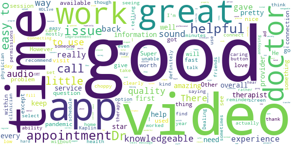
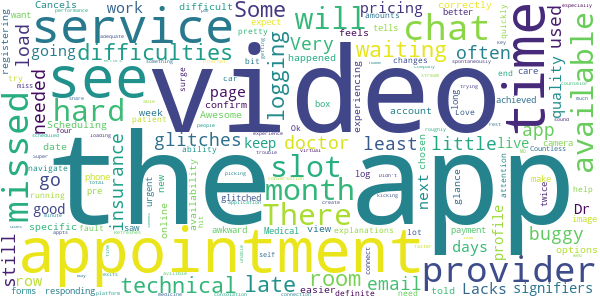

# MDLIVE: Talk to a Doctor 24/7
App version ``4.44.3``

Analyzed with [covid-apps-observer](http://github.com/covid-apps-observer) project, version ``0.1``

## App overview
| | |
|-------------------------|-------------------------| 
| **Name**&nbsp;&nbsp;&nbsp;&nbsp;&nbsp;&nbsp;&nbsp;&nbsp;&nbsp;&nbsp;&nbsp;&nbsp;&nbsp;&nbsp;&nbsp;&nbsp;&nbsp;&nbsp;&nbsp;&nbsp;&nbsp;&nbsp;&nbsp;&nbsp;&nbsp;&nbsp;&nbsp;&nbsp;&nbsp;&nbsp;&nbsp;&nbsp;&nbsp;&nbsp;&nbsp;&nbsp;&nbsp;&nbsp;&nbsp;&nbsp;  | MDLIVE: Talk to a Doctor 24/7 |
| **Unique identifier** | com.mdlive.mobile |
| **Link to Google Play** | [https://play.google.com/store/apps/details?id=com.mdlive.mobile](https://play.google.com/store/apps/details?id=com.mdlive.mobile) |
| **Summary**  | The MDLIVE app makes connecting with a doctor fast, easy, and convenient. |
| **Privacy policy** | [https://www.mdlive.com/consumer/privacy.html](https://www.mdlive.com/consumer/privacy.html) |
| **Latest version** | 4.44.3 |
| **Last update** | 2021-03-10 01:41:28 |
| **Recent changes** | - General bug fixes and improvements |
| **Installs**  | 500,000+ |
| **Category** | Medical |
| **First release** | Jul 11, 2014 |
| **Size**  | 48M |
| **Supported Android version**  | 5.0 and up |

### Description
> Have an MDLIVE virtual doctor visit with board-certified physicians from the comfort and convenience of your own home or from wherever you are, whenever you want – nights, after hours, weekends and holidays.
 MDLIVE also offers behavioral health appointments with licensed therapists and board-certified psychiatrists as well as dermatology services.
 You can schedule an appointment at a time and day that's convenient for you or have an on-demand visit in around 15 minutes.
 All MDLIVE doctors are board-certified and state-licensed, with an average of 15+ years of experience. MDLIVE has two National Committee for Quality Assurance certifications and is accredited by the American Telemedicine Association. MDLIVE doctors are also friendly, caring, compassionate, and experts in conducting virtual medical consultations. And best of all, 9 out of 10 people would recommend us to their friends and family members in need of a doctor visit.
 Great reasons to use MDLIVE virtual doctors:
 1.	You’re not feeling up to leaving home
 2.	You want to avoid the high cost of Urgent Care or the ER
 3.	Your doctor isn’t available
 4.	It's after hours, the weekend or a holiday
 5.	You need a short-term refill on a prescription
 6.	It’s hard to get to the doctor’s office
 7.	You don’t want to take time off work or be away from home
  
 MDLIVE doctors treat over 50 non-emergency medical conditions like these:
 • Allergies
 • Bronchitis
 • Colds & Flu
 • Ear Pain
 • Fever
 • Migraines
 • Pink Eye
 • Rash 
 • Sinus Infections
 • Sore Throat
 • Urinary Tract Infections (Female, 18+)
 • And more…
 We also offer treatment and support for a wide variety of behavioral health issues:
 • Addictions
 • Anxiety
 • Bipolar Disorder
 • Couples Therapy
 • Depression
 • Eating Disorders
 • LGBTQ Support
 • Panic Disorders
 • Postpartum Depression
 • Relationships
 • Social Anxiety
 • Stress Management
 • PTSD (Post-traumatic Stress Disorder)
 • And more
 We treat thousands of people a day with many different conditions, but you should not use MDLIVE if you are experiencing a medical emergency. In addition, we don't treat sexually transmitted diseases, urinary tract infections in males, or urinary tract infections in females under 18 years of age. Children under 3 with a fever and children under 12 with ear pain cannot be treated by MDLIVE.
 Copyright © 2020 MDLIVE, Inc. All Rights Reserved. 
 MDLIVE may not be available in certain states and is subject to state regulations.  MDLIVE does not replace the primary care physician, is not an insurance product, and may not be able to substitute for traditional in-person care in every case or for every condition. 
 MDLIVE does not guarantee patients will receive a prescription, does not prescribe DEA controlled substances and may not prescribe non-therapeutic drugs and certain other drugs which may be harmful because of their potential for abuse. 
 MDLIVE and the MDLIVE logo are registered trademarks of MDLIVE, Inc. and may not be used without written permission. For complete terms of use visit www.mdlive.com/terms-of-use

### User interface
The developers of the app provide the following screenshots in the Google play store.
| | | |
|:-------------------------:|:-------------------------:|:-------------------------:|
 |   |   |   | 

## Development team
In the following we report the main information provided by the development team in the Google play store.

| | |
|-------------------------|-------------------------|
| **Developer**  | MDLIVE Inc |
| **Website**  | [http://www.mdlive.com](http://www.mdlive.com) |
| **Email** | androidsupport@mdlive.com |
| **Physical address**  | - |
| **Other developed apps**  | [https://play.google.com/store/apps/developer?id=MDLIVE+Inc](https://play.google.com/store/apps/developer?id=MDLIVE+Inc) |

## Android support

| | |
|-------------------------|-------------------------|
| **Declared target Android version**  | Android10, version 10 (API level 29) |
| **Effective target Android version**  | Android10, version 10 (API level 29) |
| **Minimum supported Android version**  | Lollipop, version 5.0 (API level 21) |
| **Maximum target Android version**  | - |

The larger the difference between the minimum and maximum supported Android versions, the better. A larger difference means a wider audience. For example, old phones have a very low Android version, so a high minimum supported Android version means that the app cannot be used by users with old phones, thus leading to accessibility problems. 

## Requested permissions

In the following we report the complete list of the permissions requested by the app. 

| **Permission** | **Protection level** | **Description** | 
|-------------------------|-------------------------|-------------------------|
 **android.permission ACCESS_COARSE_LOCATION** | :warning:**Dangerous** | Allows an app to access approximate location. 
 **android.permission ACCESS_FINE_LOCATION** | :warning:**Dangerous** | Allows an app to access precise location. 
 **android.permission ACCESS_NETWORK_STATE** | Normal | Allows applications to access information about networks. 
 **android.permission ACCESS_WIFI_STATE** | Normal | Allows applications to access information about Wi-Fi networks. 
 **android.permission BLUETOOTH** | Normal | Allows applications to connect to paired bluetooth devices. 
 **android.permission CALL_PHONE** | :warning:**Dangerous** | Allows an application to initiate a phone call without going through the Dialer user interface for the user to confirm the call. 
 **android.permission CAMERA** | :warning:**Dangerous** | Required to be able to access the camera device. 
 **android.permission FOREGROUND_SERVICE** | Normal | Allows a regular application to use Service.startForeground. 
 **android.permission INTERNET** | Normal | Allows applications to open network sockets. 
 **android.permission MODIFY_AUDIO_SETTINGS** | Normal | Allows an application to modify global audio settings. 
 **android.permission READ_CALENDAR** | :warning:**Dangerous** | Allows an application to read the user's calendar data. 
 **android.permission RECORD_AUDIO** | :warning:**Dangerous** | Allows an application to record audio. 
 **android.permission USE_BIOMETRIC** | Normal | Allows an app to use device supported biometric modalities. 
 **android.permission USE_FINGERPRINT** | Normal | This constant was deprecated in API level 28. Applications should request USE_BIOMETRIC instead 
 **android.permission WAKE_LOCK** | Normal | Allows using PowerManager WakeLocks to keep processor from sleeping or screen from dimming. 
 **android.permission WRITE_CALENDAR** | :warning:**Dangerous** | Allows an application to write the user's calendar data. 
 **android.permission WRITE_EXTERNAL_STORAGE** | :warning:**Dangerous** | Allows an application to write to external storage. 
 **com.android.launcher.permission INSTALL_SHORTCUT** | Normal | Allows an application to install a shortcut in Launcher. 
 **com.google.android.c2dm.permission RECEIVE** | - | - 
 **com.google.android.finsky.permission BIND_GET_INSTALL_REFERRER_SERVICE** | - | - 
 **com.google.android.providers.gsf.permission READ_GSERVICES** | - | - 

## Mentioned servers

| **Server** | **Registrant** | **Registrant country** | **Creation date** | 
|-------------------------|-------------------------|-------------------------|-------------------------|
 | facebook.com | Facebook, Inc. | :us: US | 1997-03-29 05:00:00 |
 | google.com | Google LLC | :us: US | 1997-09-15 04:00:00 |
 | googlesyndication.com | Google LLC | :us: US | 2003-01-21 06:17:24 |
 | google-analytics.com | Google LLC | :us: US | 2005-07-18 19:24:32 |
 | appboy.com | Braze, Inc. | :us: US | 2008-10-06 23:28:32 |
 | braze.com | Braze, Inc. | :us: US | 2000-01-19 02:18:28 |
 | googleapis.com | Google LLC | :us: US | 2005-01-25 17:52:26 |
 | app-measurement.com | Google LLC | :us: US | 2015-06-19 20:13:31 |
 | googleapis.com | Google LLC | :us: US | 2005-01-25 17:52:26 |
 | crashlytics.com | Google LLC | :us: US | 2011-01-21 15:30:40 |
 | googleadservices.com | Google LLC | :us: US | 2003-06-19 16:34:53 |
 | arcgis.com | ESRI | :us: US | 1999-06-09 22:21:51 |
 | mdlive.com | Domains By Proxy, LLC | :us: US | 1999-04-07 04:00:00 |
 | hostedpci.com | Domains By Proxy, LLC | :us: US | 2009-05-26 17:47:23 |
 | mapbox.com | Whois Privacy Service | :us: US | 2003-11-27 11:15:57 |
 | googleapis.com | Google LLC | :us: US | 2005-01-25 17:52:26 |
 | dermatologistoncall.com | Iagnosis, Inc. | :us: US | 2011-07-09 18:25:58 |
 | iagnosis-test.com | Iagnosis, Inc. | :us: US | 2012-06-06 17:00:28 |
 | googleapis.com | Google LLC | :us: US | 2005-01-25 17:52:26 |

## Security analysis 

Below we report the main security warnings raised by our execution of the [Androwarn](https://github.com/maaaaz/androwarn) security analysis tool.

**Telephony identifiers leakage**
> - This application reads the MCC+MNC of the provider of the SIM 
> - This application reads the device phone type value 
> - This application reads the numeric name (MCC+MNC) of current registered operator 
> - This application reads the operator name 

**Connection interfaces exfiltration**
> - This application reads details about the currently active data network 
> - This application tries to find out if the currently active data network is metered 

**Telephony services abuse**
> - This application makes phone calls 

**Suspicious connection establishment**
> - This application opens a Socket and connects it to the remote address ' returned no addresses for  ; port is out of range' on the 'N/A' port  
> - This application opens a Socket and connects it to the remote address '' on the 'N/A' port  
> - This application opens a Socket and connects it to the remote address 'Ljava/lang/StringBuilder;->toString()Ljava/lang/String;' on the 'N/A' port  
> - This application opens a Socket and connects it to the remote address 'Ljava/net/Proxy;->type()Ljava/net/Proxy$Type;' on the 'N/A' port  
> - This application opens a Socket and connects it to the remote address 'timeout' on the 'N/A' port  

**Code execution**
> - This application loads a native library 
> - This application executes a UNIX command containing this argument: '2' 

## User ratings and reviews

Below we provide information about how end users are reacting to the app in terms of ratings and reviews in the Google Play store.

### Ratings

The MDLIVE: Talk to a Doctor 24/7 app has been installed by more than **500000** times. At this time, **4741** rated the app and its average score is **4.5925927**. Below we show the distribution of the ratings across the usual star-based rating of Google Play

:star::star::star::star::star:: 3943

:star::star::star::star:: 322

:star::star::star:: 126

:star::star:: 48

:star:: 302

### Reviews 

#### 5-star reviews

> I love MD live. Just talked to my therapist and she was amazing and som comforting. I will definitely keep it  :date: __2021-04-28 18:57:21__

> Very easy and helpful  :date: __2021-04-28 03:21:01__

> Great physician.  :date: __2021-04-27 23:19:24__

> Quick ans easy  :date: __2021-04-27 21:41:07__

> They are so hopeful! Please use them! They genuinely care about you and your symptoms and will do all that they can to help.  :date: __2021-04-27 03:42:45__

> The Dr was very nice. Seemed concerned. He addressed all issues. Thank you.  :date: __2021-04-27 01:07:32__

> This has been a life saver during the year of a Pandemic. So easy to schedule an appt and easy to use  :date: __2021-04-27 00:32:12__

> Being a bed bound patient this has made my ability to see a Dr for my mental health much easier.  :date: __2021-04-26 21:40:36__

> Really good  :date: __2021-04-26 00:40:48__

> My Dr was fantastic!  :date: __2021-04-25 22:20:27__

#### 4-star reviews

> It's easy and time manageable.  :date: __2021-04-18 13:44:37__

> This was a good program. The Doctor I saw was very nice and knowledgeable. The app worked good as well, sound skipped once or twice when a reminder popped up, but didn't cause any major concern. I am happy with this overall so far.  :date: __2021-04-15 21:54:40__

> My therapist really cared and gave me things to think about. Shes easy to talk to,, and open up to.  :date: __2021-04-15 15:51:13__

> It does doesn't have an option to switch time zones and it didn't transfer the permissions properly when I got a new phone which left it saying that it couldn't load instead of telling me to check my permissions. It works  :date: __2021-04-13 23:42:25__

> Too easy to visit the doctor in between emails at work (for the record, it's work from home). No ads so the ad question on app survey irrelevant.  :date: __2021-04-12 21:23:09__

> Super nice Doctors.  :date: __2021-04-08 22:47:26__

> The ability to talk to someone without leaving home is amazing, especially when you have anxiety. The quality of the video was good. I just wish that there is a simple way to upload documents. Also the Dropbox for issues needs to be updated to have all all illnesses and mental health listed.  :date: __2021-04-01 15:01:25__

> Very pleased with the therapist  :date: __2021-04-01 02:52:17__

> It was fast and just what I needed while out of town. Sound quality was low.  :date: __2021-03-31 16:52:35__

> There when you need them.  :date: __2021-03-30 19:43:15__

#### 3-star reviews

> Awesome service. Scheduling is difficult. It is hard to view a providers available slots, you only see availability for the specific date you've chosen. It would be easier to see all available time slot options for the week or month. There's no online waiting room so if your provider is late it feels like you aren't logging in correctly or experiencing technical difficulties.  :date: __2021-04-02 01:07:11__

> Some glitches registering until I happened to glance at email. If the app told me to confirm my new account by responding to an email, I missed it.  :date: __2021-03-30 22:34:15__

> Very buggy and times out often. When I want to make an appointment, I have to expect to go through the forms at least twice. It will load so long that it tells me to log in again. I just used the urgent care and it glitched where I saw a still image of myself where I should see the doctor, and then my little camera box. It was very awkward, but at least the appointment achieved what I needed.  :date: __2021-03-28 18:49:22__

> It's better than most other than apps  :date: __2021-03-15 16:21:15__

> Medical phone up to, "... $82, $108," insurance is payment. See app pre explanations. Not a patient.  :date: __2021-03-14 22:43:21__

> Hard to navigate.  :date: __2021-02-26 21:33:04__

> My pricing page changes amounts all the time, some days it's $0 then the next it's $82, surge pricing?  :date: __2021-02-18 19:36:50__

> Ok  :date: __2021-02-09 00:49:39__

> It's my fault for not going to the end of this month for the next few days so I can get the car running a little bit late but I am going to try y  :date: __2020-12-25 00:13:06__

> The app glitches a lot  :date: __2020-12-23 19:14:22__

#### 2-star reviews

> I actually like my therapist and it's nice being able to sometimes schedule an appointment quickly, but I wouldn't use this app for anything other than mental health. The times I've contacted customer service, they were rude and not helpful at all. They pretty much said, "too bad" to my technical difficulties. The app is very buggy and it can be incredibly stressful to schedule appointments because of this. They're online website isn't any better. They're lucky I like my therapist so much.  :date: __2021-04-28 04:38:16__

> Would like to meet and talk to a primary care doctor for my special needs having problem at University Hospital I thought I was getting some problems take care of her surgery  :date: __2021-04-28 02:49:11__

> It's okay it does the job but with the app I cannot use any type of earphones, whether wired or wireless ones.  :date: __2021-04-23 19:03:41__

> Don't waste your time ..only a dozen drs take this with in 50 Mile radius  :date: __2021-04-16 14:55:10__

> After reading the horrible ANXIETY PRODUCING reviews, and knowing I experienced similar issues with another Dr appt.. for several DAYS. And now I see many apps tend to not be connecting ..I'm uninstalling this as I DON'T appreciate the treatment by Drs who charge ppl due to the failed technology. Period. Ethically and morally wrong.  :date: __2021-04-02 07:44:04__

> I downloaded this app based on my employers advice because it's supposed to be a free service for us. I've had nothing but issues. The registration process was not simple and I was told I had to pay $82 for a consultation. I called and spent 30 mins on the phone with someone who told me that was a glitch and she gave me a credit. Today I'm told via email I'm not covered and I owe $82. This is not convenient and poor customer service.  :date: __2021-02-11 16:26:02__

> Bug preventing use  :date: __2021-01-13 23:01:26__

> Creating an account is a complete nightmare.  :date: __2021-01-05 00:56:54__

> I am very disappointed as I heard this app was one of the best but was a complete let down on my end. I set up a call around 9:30pm and waited an hour and a half for care even though it said that a doctor will be with me as soon as possible. No wait time was ever indicated. A positive note is that it did give me options for them to call back next day. It was very upsetting I had to wait that long but whatever ill delete the app and head over to my PCP.  :date: __2020-12-30 08:11:29__

> Severe issues with progressing after selecting options. Was only able to proceed after moving back a page and then moving forward. The blue arrow in the lower left page woulf either be grayed out or it woulf be blue wouldn't react. Long loading between screens. Health profile wouldn't load and had to move back a page and go forward numerous times to get it to populate. Not phone or connection based issued as everything else works.  :date: __2020-12-21 21:07:37__

#### 1-star reviews

> I thought it was free  :date: __2021-04-28 06:35:02__

> Why are you asking questions about insurance? Other med apps are free!  :date: __2021-04-27 03:38:26__

> I tried to see a doctor.... Because I didn't have any insurance and they wanted to diagnose me with covid... They keep kicking me out of the system.  :date: __2021-04-19 20:16:06__

> Not used  :date: __2021-04-19 05:04:40__

> Just signed up bc having mania for several days. Looking through therapist and they all play classic guitar and enjoying making Italian food with family! Not impressed. This is supposed to help ppl. What a joke!  :date: __2021-04-18 18:04:20__

> Worst experience with an app. Only downloaded it because their junk website kept crashing and giving errors. The app does the same. Absolutely infuriating when you're sick and just trying to get an appointment going. Garbage.  :date: __2021-04-17 02:43:20__

> This is a ripoff. They literally just take money from you without even trying to help. This is a freaking joke. I want my money back  :date: __2021-04-16 16:46:49__

> A Warning: This app is a scam. The doctor the app paired me with took my $40 co-pay and in the middle of me telling her my symptoms cut me off and told me she wasn't comfortable treating a mild case of nausea. All I wanted was for her to prescribe something to counter the nausea. This "doctor" had already decided before I ever spoke to her that she wasn't going to treat me. She said she absolutely refused to treat me. Just a warning. They will take your money but they may refuse to treat you.  :date: __2021-04-14 22:11:00__

> I'm uninstalling this app. The doctors on here treat me suspiciously most of the time and tell me to suck it up and deal. Then I still get charge the same for receiving no help at all. The therapy on here is a joke, too. Horrible app. Find a different one if you can.  :date: __2021-04-13 16:43:48__

> Had to restset damn password several times. Link will take to site to change password and once you change damn app still say invalid. Plus never can get a person on phone. I am in pain and will just take my chances at ER. Plus no area to key in your insurance information  :date: __2021-04-03 20:06:43__

