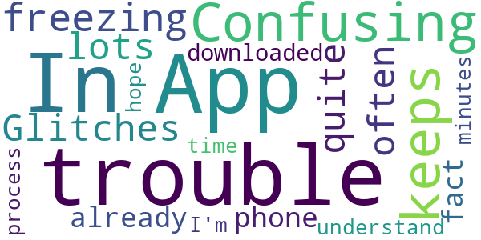

# Mend Telemedicine
App version ``3.04``

Analyzed with [covid-apps-observer](http://github.com/covid-apps-observer) project, version ``0.1``

## App overview
| | |
|-------------------------|-------------------------| 
| **Name**&nbsp;&nbsp;&nbsp;&nbsp;&nbsp;&nbsp;&nbsp;&nbsp;&nbsp;&nbsp;&nbsp;&nbsp;&nbsp;&nbsp;&nbsp;&nbsp;&nbsp;&nbsp;&nbsp;&nbsp;&nbsp;&nbsp;&nbsp;&nbsp;&nbsp;&nbsp;&nbsp;&nbsp;&nbsp;&nbsp;&nbsp;&nbsp;&nbsp;&nbsp;&nbsp;&nbsp;&nbsp;&nbsp;&nbsp;&nbsp;  | Mend Telemedicine |
| **Unique identifier** | com.mend.android.telemedicine |
| **Link to Google Play** | [https://play.google.com/store/apps/details?id=com.mend.android.telemedicine](https://play.google.com/store/apps/details?id=com.mend.android.telemedicine) |
| **Summary**  | Mend Telemedicine allows you to receive convenient, quality care, from anywhere. |
| **Privacy policy** | [http://www.mendfamily.com/privacy-policy/](http://www.mendfamily.com/privacy-policy/) |
| **Latest version** | 3.04 |
| **Last update** | 2021-04-02 16:16:47 |
| **Recent changes** | Bug Fixes |
| **Installs**  | 50,000+ |
| **Category** | Medical |
| **First release** | Oct 1, 2016 |
| **Size**  | 23M |
| **Supported Android version**  | 5.0 and up |

### Description
> Mend is a healthcare communication and engagement platform. Mend can connect to patients and/or providers anytime, anywhere, and with any device through messaging, video, forms, or other content. Mend can send or collect any information from a patient or a third party related to a patient's care. Mend is the absolute easiest, fully integrated technology to connect care.

### User interface
The developers of the app provide the following screenshots in the Google play store.
| | | |
|:-------------------------:|:-------------------------:|:-------------------------:|
 |   |   |   | 

## Development team
In the following we report the main information provided by the development team in the Google play store.

| | |
|-------------------------|-------------------------|
| **Developer**  | Mend VIP, Inc. |
| **Website**  | [http://www.mendfamily.com](http://www.mendfamily.com) |
| **Email** | brandon@mendfamily.com |
| **Physical address**  | - |
| **Other developed apps**  | [https://play.google.com/store/apps/developer?id=Mend+VIP,+Inc.](https://play.google.com/store/apps/developer?id=Mend+VIP,+Inc.) |

## Android support

| | |
|-------------------------|-------------------------|
| **Declared target Android version**  | Oreo, version 8.0.0 (API level 26) |
| **Effective target Android version**  | Oreo, version 8.0.0 (API level 26) |
| **Minimum supported Android version**  | Lollipop, version 5.0 (API level 21) |
| **Maximum target Android version**  | - |

The larger the difference between the minimum and maximum supported Android versions, the better. A larger difference means a wider audience. For example, old phones have a very low Android version, so a high minimum supported Android version means that the app cannot be used by users with old phones, thus leading to accessibility problems. 

## Requested permissions

In the following we report the complete list of the permissions requested by the app. 

| **Permission** | **Protection level** | **Description** | 
|-------------------------|-------------------------|-------------------------|
 **android.permission ACCESS_COARSE_LOCATION** | :warning:**Dangerous** | Allows an app to access approximate location. 
 **android.permission ACCESS_NETWORK_STATE** | Normal | Allows applications to access information about networks. 
 **android.permission BLUETOOTH** | Normal | Allows applications to connect to paired bluetooth devices. 
 **android.permission BROADCAST_STICKY** | Normal | Allows an application to broadcast sticky intents. 
 **android.permission CAMERA** | :warning:**Dangerous** | Required to be able to access the camera device. 
 **android.permission GET_ACCOUNTS** | :warning:**Dangerous** | Allows access to the list of accounts in the Accounts Service. 
 **android.permission INTERNET** | Normal | Allows applications to open network sockets. 
 **android.permission MODIFY_AUDIO_SETTINGS** | Normal | Allows an application to modify global audio settings. 
 **android.permission READ_EXTERNAL_STORAGE** | :warning:**Dangerous** | Allows an application to read from external storage. 
 **android.permission READ_PHONE_STATE** | :warning:**Dangerous** | Allows read only access to phone state, including the phone number of the device, current cellular network information, the status of any ongoing calls, and a list of any PhoneAccounts registered on the device. 
 **android.permission RECORD_AUDIO** | :warning:**Dangerous** | Allows an application to record audio. 
 **android.permission USE_CREDENTIALS** | - | - 
 **android.permission WRITE_EXTERNAL_STORAGE** | :warning:**Dangerous** | Allows an application to write to external storage. 

## Mentioned servers

| **Server** | **Registrant** | **Registrant country** | **Creation date** | 
|-------------------------|-------------------------|-------------------------|-------------------------|
 | google-analytics.com | Google LLC | :us: US | 2005-07-18 19:24:32 |
 | googleapis.com | Google LLC | :us: US | 2005-01-25 17:52:26 |
 | google.com | Google LLC | :us: US | 1997-09-15 04:00:00 |
 | facebook.com | Facebook, Inc. | :us: US | 1997-03-29 05:00:00 |
 | doubleclick.net | Google Inc. | :us: US | 1996-01-16 05:00:00 |
 | gstatic.com | Google LLC | :us: US | 2008-02-11 15:31:25 |
 | googletagmanager.com | Google LLC | :us: US | 2011-11-11 23:39:05 |
 | mendfamily.com | Mend VIP, Inc. | :us: US | 2014-07-06 18:37:38 |
 | opentok.com | Domains By Proxy, LLC | :us: US | 2010-09-24 17:14:13 |
 | tokbox.com | Domains By Proxy, LLC | :us: US | 2002-04-26 08:13:23 |

## Security analysis 

Below we report the main security warnings raised by our execution of the [Androwarn](https://github.com/maaaaz/androwarn) security analysis tool.

**Telephony identifiers leakage**
> - This application reads the device phone type value 
> - This application reads the numeric name (MCC+MNC) of current registered operator 
> - This application reads the radio technology (network type) currently in use on the device for data transmission 

**Connection interfaces exfiltration**
> - This application reads details about the currently active data network 
> - This application tries to find out if the currently active data network is metered 

**Telephony services abuse**
> - This application makes phone calls 

**Suspicious connection establishment**
> - This application opens a Socket and connects it to the remote address 'Lorg/apache/http/HttpHost;->getPort()I' on the 'Lorg/apache/http/HttpHost;->getPort()I' port  

**Code execution**
> - This application loads a native library 
> - This application loads a native library: 'opentok' 

## User ratings and reviews

Below we provide information about how end users are reacting to the app in terms of ratings and reviews in the Google Play store.

### Ratings

The Mend Telemedicine app has been installed by more than **50000** times. At this time, **161** rated the app and its average score is **4.158416**. Below we show the distribution of the ratings across the usual star-based rating of Google Play

:star::star::star::star::star:: 104

:star::star::star::star:: 27

:star::star::star:: 6

:star::star:: 0

:star:: 24

### Reviews 

#### 5-star reviews

> Very good for your teleconference visits with my doctor's , good connection is very good along with voice and camera , no problems with the total package overall . G. Lewis .  :date: __2021-05-06 02:04:50__

> Mend Telemedicine (My Doctor)  :date: __2021-04-18 18:06:00__

> Awesome  :date: __2021-02-09 01:16:03__

> Very good system  :date: __2021-02-08 19:29:25__

> Very easy to use once you get the hang of it. So convenient!  :date: __2020-11-21 01:38:33__

> This had made doctors appointments a breeze  :date: __2020-10-10 23:07:26__

> Works good not to hard  :date: __2020-10-02 14:15:26__

> It takes a minute to get the information to the doctor. But then u go into video and see a doctor within 5 minutes. I got my prescription fast. I recommend this instead of going to a walk in doctor or your regular provider. During the coronavirus . I know people are scared to go to the doctor right now. This app allows you to see a doctor and not put yourself or your family in jeopardy. I'd give 10 stars or more if that was possible. Great job to all the doctor's and nurses.  :date: __2020-07-05 15:04:58__

> It's ok  :date: __2020-07-01 03:15:22__

> My appointments are safe and sound while being private  :date: __2020-06-25 21:49:10__

#### 4-star reviews

> I love this i can talk without coming in  :date: __2020-12-14 18:27:08__

> Werw  :date: __2020-09-27 04:08:04__

> Pretty easy overall. I'm impressed with today's visit.  :date: __2020-09-10 22:43:10__

> This is easy to use. I haven't had any problems logging in or conducting my medical visits on here  :date: __2020-04-20 21:37:40__

> Not easy to start needs better interface,once you get it working works well. Needs to be made kindle fire friendlier  :date: __2020-02-13 20:02:21__

> The only thing I don't like about it was  the Dr only could see the top of my head on the  camera  :date: __2018-03-12 03:34:45__

#### 3-star reviews

> Confusing.  :date: __2020-11-17 19:00:14__

> App keeps freezing  :date: __2020-09-01 20:29:20__

> Glitches quite often  :date: __2020-05-31 05:06:30__

> I have had lots of trouble on the phone before. In fact I already downloaded the app and don't understand why I'm in the process of having to do it again. I only have 15 minutes so I hope I have no trouble this time.  :date: __2019-10-28 19:42:37__

#### 2-star reviews

No recent reviews available with 2 stars.

#### 1-star reviews

> Passed all the connection test, but I couldn't log in. Error "needs a stable connection". I'm using a private wifi, even tried cellular data. Gave permissions, closed background apps, same issue. Not user friendly at all  :date: __2021-04-02 14:53:00__

> It gives general problem statements and the techs can't help. VERY UNRELIABLE SYSTEM.  :date: __2021-01-22 18:44:48__

> Is flawed. Can't sign in  :date: __2021-01-13 19:51:29__

> Sucks  :date: __2021-01-09 04:25:07__

> The app forces uses to use cameras. This may be efficient for most situations but for people using the app for therapy, some users are very self conscious about their appearance on camera and it makes users, such as myself, extremely uncomfortable.  :date: __2021-01-08 05:58:29__

> To call this app awful is an understatement. I spent an hour trying to login and get the camera feature to work. Eventually I just called my Doctor and canceled the appointment due to this app being less helpful than a book of wet matches.  :date: __2020-06-29 17:17:21__

> Have only gotten this to work once on my end, or it not working on there end. It tells me invited email, or password all the time even when I try to reset. Feeling like this is a waste of time. Doesn't work  :date: __2020-06-18 17:11:48__

> A necessary app for me, but doesn't accept any information that I enter into it  :date: __2020-05-24 00:41:33__

> It's not even downloading. Glad I waisted my time with it  :date: __2020-04-08 18:08:02__

> Could not download.  :date: __2020-03-31 05:56:36__

