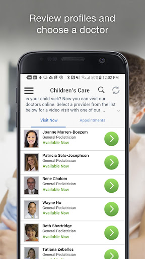
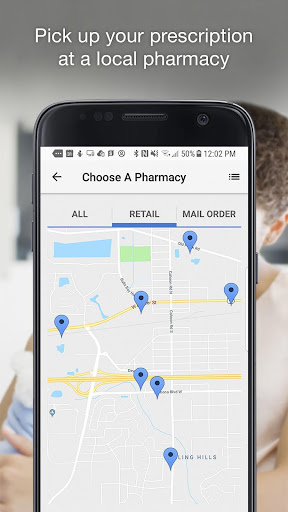
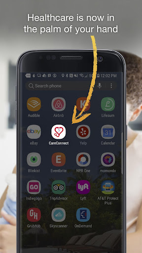
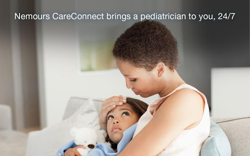
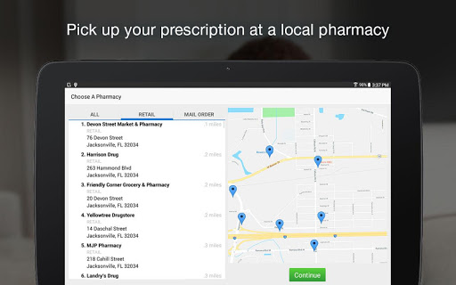
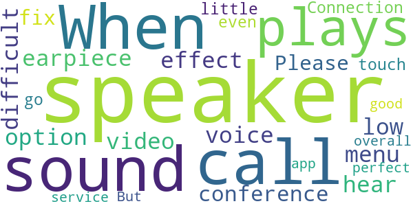
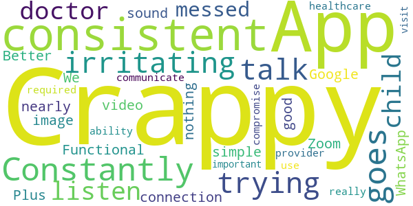

# Nemours CareConnect – See a Pediatrician 24/7
App version ``12.9.01.000_00``

Analyzed with [covid-apps-observer](http://github.com/covid-apps-observer) project, version ``0.1``

## App overview
| | |
|-------------------------|-------------------------| 
| **Name**&nbsp;&nbsp;&nbsp;&nbsp;&nbsp;&nbsp;&nbsp;&nbsp;&nbsp;&nbsp;&nbsp;&nbsp;&nbsp;&nbsp;&nbsp;&nbsp;&nbsp;&nbsp;&nbsp;&nbsp;&nbsp;&nbsp;&nbsp;&nbsp;&nbsp;&nbsp;&nbsp;&nbsp;&nbsp;&nbsp;&nbsp;&nbsp;&nbsp;&nbsp;&nbsp;&nbsp;&nbsp;&nbsp;&nbsp;&nbsp;  | Nemours CareConnect – See a Pediatrician 24/7 |
| **Unique identifier** | com.nemours.android.careconnect |
| **Link to Google Play** | [https://play.google.com/store/apps/details?id=com.nemours.android.careconnect](https://play.google.com/store/apps/details?id=com.nemours.android.careconnect) |
| **Summary**  | Nemours CareConnect: Expert pediatric care when and where you need it. |
| **Privacy policy** | [http://www.nemours.org/privacy.html](http://www.nemours.org/privacy.html) |
| **Latest version** | 12.9.01.000_00 |
| **Last update** | 2021-04-08 22:04:38 |
| **Recent changes** | We continue to improve the patient experience with these new features: • Performance enhancements to increase reliability and speed |
| **Installs**  | 50,000+ |
| **Category** | Medical |
| **First release** | Oct 30, 2015 |
| **Size**  | 52M |
| **Supported Android version**  | 5.0 and up |

### Description
> CareConnect brings Nemours pediatric care to you with on demand doctor visits through live video chat on your mobile device or computer. Our experts are here when you need answers – in the middle of the night, early in the mornings, or away from home.
 Nemours CareConnect features:
 • No appointment needed
 • Board-certified Nemours pediatricians
 • Available 24/7/365
 • Private and secure, HIPAA compliant connection
 • Cost $0 – $59 per visit, depending on your insurance benefits
 Common conditions we treat:  
 • Fever/Flu/Cold
 • Conjunctivitis
 • Respiratory and sinus infections

### User interface
The developers of the app provide the following screenshots in the Google play store.
| | | |
|:-------------------------:|:-------------------------:|:-------------------------:|
 |   |   |   | 
 |   |   |   | 
 |   |   |   | 
 |   |   |   | 
 |   |   |   | 

## Development team
In the following we report the main information provided by the development team in the Google play store.

| | |
|-------------------------|-------------------------|
| **Developer**  | Nemours Custom Solutions |
| **Website**  | [http://www.nemours.org](http://www.nemours.org) |
| **Email** | nemoursappengg@gmail.com |
| **Physical address**  | - |
| **Other developed apps**  | [https://play.google.com/store/apps/developer?id=Nemours+Custom+Solutions](https://play.google.com/store/apps/developer?id=Nemours+Custom+Solutions) |

## Android support

| | |
|-------------------------|-------------------------|
| **Declared target Android version**  | Android10, version 10 (API level 29) |
| **Effective target Android version**  | Android10, version 10 (API level 29) |
| **Minimum supported Android version**  | Lollipop, version 5.0 (API level 21) |
| **Maximum target Android version**  | - |

The larger the difference between the minimum and maximum supported Android versions, the better. A larger difference means a wider audience. For example, old phones have a very low Android version, so a high minimum supported Android version means that the app cannot be used by users with old phones, thus leading to accessibility problems. 

## Requested permissions

In the following we report the complete list of the permissions requested by the app. 

| **Permission** | **Protection level** | **Description** | 
|-------------------------|-------------------------|-------------------------|
 **android.permission ACCESS_COARSE_LOCATION** | :warning:**Dangerous** | Allows an app to access approximate location. 
 **android.permission ACCESS_FINE_LOCATION** | :warning:**Dangerous** | Allows an app to access precise location. 
 **android.permission ACCESS_LOCATION_EXTRA_COMMANDS** | Normal | Allows an application to access extra location provider commands. 
 **android.permission ACCESS_NETWORK_STATE** | Normal | Allows applications to access information about networks. 
 **android.permission ACCESS_WIFI_STATE** | Normal | Allows applications to access information about Wi-Fi networks. 
 **android.permission BLUETOOTH** | Normal | Allows applications to connect to paired bluetooth devices. 
 **android.permission BROADCAST_STICKY** | Normal | Allows an application to broadcast sticky intents. 
 **android.permission CAMERA** | :warning:**Dangerous** | Required to be able to access the camera device. 
 **android.permission GET_TASKS** | Deprecated | This constant was deprecated in API level 21. No longer enforced. 
 **android.permission INTERNET** | Normal | Allows applications to open network sockets. 
 **android.permission MODIFY_AUDIO_SETTINGS** | Normal | Allows an application to modify global audio settings. 
 **android.permission READ_EXTERNAL_STORAGE** | :warning:**Dangerous** | Allows an application to read from external storage. 
 **android.permission READ_PHONE_STATE** | :warning:**Dangerous** | Allows read only access to phone state, including the phone number of the device, current cellular network information, the status of any ongoing calls, and a list of any PhoneAccounts registered on the device. 
 **android.permission RECEIVE_BOOT_COMPLETED** | Normal | Allows an application to receive the Intent.ACTION_BOOT_COMPLETED that is broadcast after the system finishes booting. 
 **android.permission RECORD_AUDIO** | :warning:**Dangerous** | Allows an application to record audio. 
 **android.permission REORDER_TASKS** | Normal | Allows an application to change the Z-order of tasks. 
 **android.permission SYSTEM_ALERT_WINDOW** | Signature - preinstalled - appop - pre23 - development | Allows an app to create windows using the type WindowManager.LayoutParams.TYPE_APPLICATION_OVERLAY, shown on top of all other apps. 
 **android.permission USE_BIOMETRIC** | Normal | Allows an app to use device supported biometric modalities. 
 **android.permission USE_FINGERPRINT** | Normal | This constant was deprecated in API level 28. Applications should request USE_BIOMETRIC instead 
 **android.permission VIBRATE** | Normal | Allows access to the vibrator. 
 **android.permission WAKE_LOCK** | Normal | Allows using PowerManager WakeLocks to keep processor from sleeping or screen from dimming. 
 **android.permission WRITE_EXTERNAL_STORAGE** | :warning:**Dangerous** | Allows an application to write to external storage. 
 **com.facebook.katana.provider ACCESS** | - | - 
 **com.google.android.c2dm.permission RECEIVE** | - | - 
 **com.google.android.finsky.permission BIND_GET_INSTALL_REFERRER_SERVICE** | - | - 
 **com.nemours.android.careconnect.permission C2D_MESSAGE** | - | - 

## Mentioned servers

| **Server** | **Registrant** | **Registrant country** | **Creation date** | 
|-------------------------|-------------------------|-------------------------|-------------------------|
 | amwell.com | American Well Corporation | :us: US | 2004-02-13 19:02:32 |
 | facebook.com | Facebook, Inc. | :us: US | 1997-03-29 05:00:00 |
 | doubleclick.net | Google Inc. | :us: US | 1996-01-16 05:00:00 |
 | googleadservices.com | Google LLC | :us: US | 2003-06-19 16:34:53 |
 | google.com | Google LLC | :us: US | 1997-09-15 04:00:00 |
 | googlesyndication.com | Google LLC | :us: US | 2003-01-21 06:17:24 |
 | google-analytics.com | Google LLC | :us: US | 2005-07-18 19:24:32 |
 | app-measurement.com | Google LLC | :us: US | 2015-06-19 20:13:31 |
 | appboy.com | Braze, Inc. | :us: US | 2008-10-06 23:28:32 |
 | braze.com | Braze, Inc. | :us: US | 2000-01-19 02:18:28 |
 | optimizely.com | Optimizely | :us: US | 2010-01-11 03:01:32 |
 | twitter.com | Twitter, Inc. | :us: US | 2000-01-21 16:28:17 |
 | branch.io | Branch | :us: US | 2011-11-10 13:52:13 |
 | gstatic.com | Google LLC | :us: US | 2008-02-11 15:31:25 |
 | crashlytics.com | Google LLC | :us: US | 2011-01-21 15:30:40 |
 | bnc.lt | - | - | 2016-11-14 00:00:00 |
 | ggpht.com | Google LLC | :us: US | 2008-01-16 18:55:33 |

## Security analysis 

Below we report the main security warnings raised by our execution of the [Androwarn](https://github.com/maaaaz/androwarn) security analysis tool.

**Telephony identifiers leakage**
> - This application reads the ISO country code equivalent for the SIM provider's country code 
> - This application reads the ISO country code equivalent of the current registered operator's MCC (Mobile Country Code) 
> - This application reads the device phone type value 
> - This application reads the numeric name (MCC+MNC) of current registered operator 
> - This application reads the operator name 
> - This application reads the phone's current state 
> - This application reads the radio technology (network type) currently in use on the device for data transmission 

**Connection interfaces exfiltration**
> - This application reads details about the currently active data network 
> - This application tries to find out if the currently active data network is metered 

**Telephony services abuse**
> - This application makes phone calls 

**Audio video eavesdropping**
> - This application records audio from the 'VOICE_RECOGNITION' source  
> - This application captures video from the 'CAMERA' source 

**Suspicious connection establishment**
> - This application opens a Socket and connects it to the remote address ' returned no addresses for  ; port is out of range' on the 'N/A' port  
> - This application opens a Socket and connects it to the remote address '' on the 'N/A' port  
> - This application opens a Socket and connects it to the remote address 'Ljava/net/Proxy;->type()Ljava/net/Proxy$Type;' on the 'N/A' port  
> - This application opens a Socket and connects it to the remote address 'timeout' on the 'N/A' port  

**Code execution**
> - This application loads a native library 
> - This application executes a UNIX command containing this argument: '2' 

## User ratings and reviews

Below we provide information about how end users are reacting to the app in terms of ratings and reviews in the Google Play store.

### Ratings

The Nemours CareConnect – See a Pediatrician 24/7 app has been installed by more than **50000** times. At this time, **594** rated the app and its average score is **4.71**. Below we show the distribution of the ratings across the usual star-based rating of Google Play

:star::star::star::star::star:: 520

:star::star::star::star:: 35

:star::star::star:: 11

:star::star:: 5

:star:: 23

### Reviews 

#### 5-star reviews

> Love it! Thank you so much for this service!  :date: __2021-03-14 05:33:06__

> Convenient and wonderful provider  :date: __2021-01-18 21:14:36__

> Exceptional  :date: __2021-01-15 17:15:25__

> Excellent service dr was amazing  :date: __2021-01-06 20:40:42__

> It was a good and easy experience to get in touch with my doctor  :date: __2021-01-05 14:55:16__

> Outstanding service on New Year's Day! Dr. Was efficient, knowledgeable, and friendly. I am so happy that this virtual visit was available. Didn't have to leave my home on a cold and rainy day. Prescription sent over to my pharmacy of choice. Have your insurance, Primary care info and pharmacy information in order to register.  :date: __2021-01-01 22:04:39__

> Couldn't start with how many times this apps has saved me endless counts of trips to the emergency room for one of my kids. They love to take turns on who is going to push life's limits just for the fun of it.  :date: __2020-12-22 23:42:29__

> Excellent Service!!  :date: __2020-12-22 19:56:37__

> This app is very great to have especially if u have babies/toddlers. I just used this today for my son for his sick visit and everything went great the app worked great. I definitely would recommend this to my friends and family. And it was so easy to use.  :date: __2020-12-17 21:03:20__

> Was great  :date: __2020-12-14 21:23:01__

#### 4-star reviews

> As expected, no problems. Very convenient to see the Dr without having to go into the office. I don't see how to schedule appointments, though; that would be an excellent feature to add.  :date: __2020-10-11 22:17:30__

> Very good service. Nice people and very understanding.  :date: __2020-07-30 19:52:33__

> Our voices go in & out.  :date: __2020-07-13 21:39:22__

> Good Alternative during time of COVID  :date: __2020-06-24 23:01:02__

> Its okay..  :date: __2020-05-11 21:11:20__

> Good !  :date: __2020-05-05 16:19:22__

> Easy to manipulate. Convenient.  :date: __2020-05-01 15:39:27__

> Very easy to use, worked good, video was slight laggy at times but caught up quick  :date: __2020-04-30 17:18:16__

> Great app. Communication is clear and video is clear. No lag. Very convenient service because you receive treatment in the comfort of your home especially during covid19 time.  :date: __2020-04-15 05:21:54__

> Yay  :date: __2020-03-26 18:29:43__

#### 3-star reviews

> When in call the sound plays on earpiece not on speaker. The menu option for speaker have no effect and its very difficult to hear such a low voice while having video conference. Please fix this.  :date: __2020-07-03 06:53:34__

> Connection is a little touch n go even with perfect service. But overall it's a good app.  :date: __2018-10-08 19:56:13__

#### 2-star reviews

> Crappy App  :date: __2020-09-28 19:08:53__

> It isn't very consistent. Constantly goes in and out. Very irritating when you are trying to talk and listen to your child's doctor and its all messed up.  :date: __2020-06-04 20:18:13__

> Functional but not nearly as good of video image and sound connection as a simple Zoom, Google Plus, or WhatsApp. Better than nothing. We were required to use this by our healthcare provider, and it really compromise the ability to communicate during a very important visit.  :date: __2020-04-23 16:24:34__

#### 1-star reviews

> They used to be good but now they are absolutely a waste of time, all they do now is tell you to visit their office to have the child seen. Hello!! We don't feel safe taking our kids into an urgent care right now. What's the point of this app if you no longer do anything.  :date: __2020-11-08 00:36:36__

> Lagging. Voice going in and out. Not able to hear what the other person saying. Screen freezing.  :date: __2020-08-17 20:07:11__

> After waiting almost 45 minutes, the app kicked me out of the waiting, and I had to request a new visit because the Doctor I chose was unavailable. I waited almost two hours, when there were only 2 patients ahead of me. I ended up cancelling the visit because I got tired of waiting online. Not worth it!  :date: __2020-07-28 04:13:51__

> Worst Experience Ever! Only once the app has worked for us, rest multiple times it just fails. It says "connecting doctors video" but than fails and says your appointment is canceled. One day we were on hold for 4.5 hours, first it failed call the customer service they reset the appointment, than we waited and the doctor transferred to another doctor and post that failed again. Our friends us CHOP and have never faced such issues.Not sure if its the app or Nemours practices. Will not recommend  :date: __2020-07-25 16:52:37__

> Pediatric? Only adult options were listed  :date: __2020-07-19 01:15:40__

> Very frusterating. Stayed on the phone for hour just to have the Dr hang up on me due to no connection and i would have full barns on WIFI sitting right next to the box. For days i have been trying to get this to work. And everytime i call the office they just direct me back to this app. On the me help u and it never works. Cant even get my kid seen. Very pissed off mom  :date: __2020-07-17 22:37:56__

> The Clermont location is terrible. The staff is incompetent and rude. They do not care about the babies and only want to push products on you without listening to your concerns or needs. Do not go to Nemours in Clermont FL!!! You will be very unhappy!!  :date: __2020-07-13 22:39:04__

> My toddler fell outside and cut open his eyebrow. I did not want to go to the urgent care or ER and expose us to c- virus, so I tried the care connect app for urgent care. We were 11th in line waiting. After over an hour and a half of waiting we were still 3rd in line so I left the app running and pulled up my camera to get a new photo of the injury. I switched back over to the app, to see the doctor had declined seeing us. It would've been nice if the app had some type of way to alert you.  :date: __2020-04-05 00:06:50__

> Would give zero stars if I could. It says online that they treat ear infections, so I booked an appointment. She has an ear pain and a fever. They said she doesnt have an ear infection and even if she did they wouldn't treat her. That means I just wasted $60. Don't waste your time. Go to a real doctor. I know my doctor would've treated her infection because she's my 4th child and I've been through this many times. I'm so upset! This is what I get for trying to take shortcuts!  :date: __2020-03-26 23:36:46__

> Absolutely useless waited 1hr for the doctor to log off and the system to kick me out and make me start all over.........I could wait till morning and see my primary faster  :date: __2020-03-25 03:04:17__

