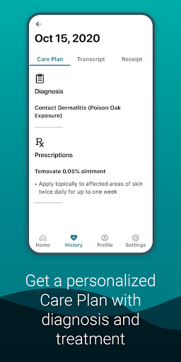
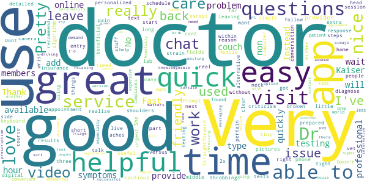
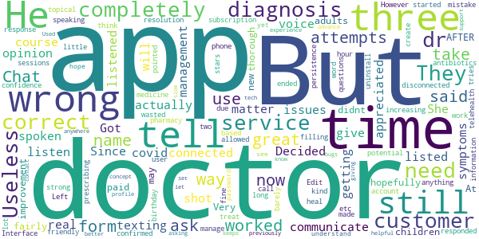

# 98point6
App version ``2.44.0``

Analyzed with [covid-apps-observer](http://github.com/covid-apps-observer) project, version ``0.1``

## App overview
| | |
|-------------------------|-------------------------| 
| **Name**&nbsp;&nbsp;&nbsp;&nbsp;&nbsp;&nbsp;&nbsp;&nbsp;&nbsp;&nbsp;&nbsp;&nbsp;&nbsp;&nbsp;&nbsp;&nbsp;&nbsp;&nbsp;&nbsp;&nbsp;&nbsp;&nbsp;&nbsp;&nbsp;&nbsp;&nbsp;&nbsp;&nbsp;&nbsp;&nbsp;&nbsp;&nbsp;&nbsp;&nbsp;&nbsp;&nbsp;&nbsp;&nbsp;&nbsp;&nbsp;  | 98point6 |
| **Unique identifier** | com.ninety8point6.patientapp |
| **Link to Google Play** | [https://play.google.com/store/apps/details?id=com.ninety8point6.patientapp](https://play.google.com/store/apps/details?id=com.ninety8point6.patientapp) |
| **Summary**  | On-demand, 24/7, text-based care via secure, in-app messaging. |
| **Privacy policy** | [https://www.98point6.com/legal/#privacy](https://www.98point6.com/legal/#privacy) |
| **Latest version** | 2.44.0 |
| **Last update** | 2021-02-16 20:53:02 |
| **Recent changes** | We’re continually updating our app to make it the best possible experience for you. Update to the latest version for all new available features. This version includes user experience improvements and minor bug fixes. |
| **Installs**  | 50,000+ |
| **Category** | Medical |
| **First release** | Jun 26, 2017 |
| **Size**  | 46M |
| **Supported Android version**  | 6.0 and up |

### Description
> 98point6 provides on-demand diagnosis, treatment and consultation from board-certified physicians and sends necessary prescriptions to your pharmacy—all via secure, in-app messaging. Our unique, text-based care delivery means you can get the right care at the right time. No appointments, no travel. We’re available nationwide, 24/7, 365 days a year. 
 HOW MUCH DOES IT COST?
 There are two ways to get 98point6: via a Personal Plan or a Sponsored Plan.
 Personal Plans subscriptions come at an introductory rate of $30 for the first 3 months, with unlimited access to on-demand care for just $1 per visit. When that initial period ends, you have the option to enroll in an annual plan for only $120 per year + $1 per visit. (Please note, only one patient per account. You must be 18+ to create an account and seek care; 19+ in Nebraska.)
 Some employers, health plans and retailers provide access to 98point6 at no charge and offer visits at low/no cost to eligible members and their dependents ages 1+. To see if you're eligible, please check with your plan sponsor.
 WHAT DOES MY PERSONAL PLAN SUBSCRIPTION COVER?
 Your 98point6 Personal Plan provides you access to our board-certified physicians who offer consultation, diagnosis and treatment. Insurance is not required for your visits. Patients are responsible for any outside-of-app costs, including prescriptions, labs and visits to an in-person physician, if referred. 
 WHO ARE YOUR DOCTORS?
 Our virtual clinic is staffed by carefully selected, board-certified physicians who are passionate about making care more accessible and affordable. They are specially trained to treat and diagnose via text-based care. (98point6 supports photo, video and audio as needed.)
 WHAT CAN YOU TREAT? 
 Our board-certified physicians are available on-demand to diagnose and treat, answer questions, offer peace of mind and when it matters, guide you towards the most appropriate next steps. If your issue does require in-person care, you can be sure you’re on the right path to feeling better after consulting with a 98point6 physician. 
  
 Common conditions we treat include:
 • Cold, cough and flu
 • Urinary tract infections (UTI)
 • Acid reflux, heartburn and digestive issues
 • Yeast infections or sexually transmitted infections (STIs) 
 • Muscle sprains and strains
 • Seasonal allergies, asthma and respiratory issues
 • Skin conditions, rashes, bites and sunburn
 • Women’s health, such as birth control 
 • Nausea, stomach flu and gastroenteritis 
 • General health questions
 • ...and more
  
 WHAT IS YOUR PRESCRIPTION POLICY? 
 Our doctors can prescribe a wide variety of medications. However, we do not prescribe controlled substances (such as Percocet), muscle relaxants (such as Flexeril), lifestyle medications (such as Viagra or Propecia) or medications that require strict monitoring. Our physicians adhere to evidence-based standards with respect to the responsible use of antibiotics. If we are unable to prescribe a medication, it’s likely due to a combination of factors, including state and federal regulations related to virtual care practices, as well as what’s in the best interest of your safety and well-being. 
  
 Note: 98point6 is not for medical emergencies.

### User interface
The developers of the app provide the following screenshots in the Google play store.
| | | |
|:-------------------------:|:-------------------------:|:-------------------------:|
 |   |   |   | 
 |   |   |   | 

## Development team
In the following we report the main information provided by the development team in the Google play store.

| | |
|-------------------------|-------------------------|
| **Developer**  | 98point6 Inc. |
| **Website**  | [https://www.98point6.com](https://www.98point6.com) |
| **Email** | support@98point6.com |
| **Physical address**  | [701 5th Ave, Ste 2300 Seattle, WA 98104](https://www.google.com/maps/search/701%205th%20Ave,%20Ste%202300%20Seattle,%20WA%2098104) (Google Maps) |
| **Other developed apps**  | [https://play.google.com/store/apps/developer?id=98point6+Inc.](https://play.google.com/store/apps/developer?id=98point6+Inc.) |

## Android support

| | |
|-------------------------|-------------------------|
| **Declared target Android version**  | Android10, version 10 (API level 29) |
| **Effective target Android version**  | Android10, version 10 (API level 29) |
| **Minimum supported Android version**  | Marshmallow, version 6.0 (API level 23) |
| **Maximum target Android version**  | - |

The larger the difference between the minimum and maximum supported Android versions, the better. A larger difference means a wider audience. For example, old phones have a very low Android version, so a high minimum supported Android version means that the app cannot be used by users with old phones, thus leading to accessibility problems. 

## Requested permissions

In the following we report the complete list of the permissions requested by the app. 

| **Permission** | **Protection level** | **Description** | 
|-------------------------|-------------------------|-------------------------|
 **android.permission ACCESS_FINE_LOCATION** | :warning:**Dangerous** | Allows an app to access precise location. 
 **android.permission ACCESS_NETWORK_STATE** | Normal | Allows applications to access information about networks. 
 **android.permission ACCESS_WIFI_STATE** | Normal | Allows applications to access information about Wi-Fi networks. 
 **android.permission BLUETOOTH** | Normal | Allows applications to connect to paired bluetooth devices. 
 **android.permission BROADCAST_STICKY** | Normal | Allows an application to broadcast sticky intents. 
 **android.permission CAMERA** | :warning:**Dangerous** | Required to be able to access the camera device. 
 **android.permission FOREGROUND_SERVICE** | Normal | Allows a regular application to use Service.startForeground. 
 **android.permission INTERNET** | Normal | Allows applications to open network sockets. 
 **android.permission MODIFY_AUDIO_SETTINGS** | Normal | Allows an application to modify global audio settings. 
 **android.permission READ_EXTERNAL_STORAGE** | :warning:**Dangerous** | Allows an application to read from external storage. 
 **android.permission RECEIVE_BOOT_COMPLETED** | Normal | Allows an application to receive the Intent.ACTION_BOOT_COMPLETED that is broadcast after the system finishes booting. 
 **android.permission RECORD_AUDIO** | :warning:**Dangerous** | Allows an application to record audio. 
 **android.permission WAKE_LOCK** | Normal | Allows using PowerManager WakeLocks to keep processor from sleeping or screen from dimming. 
 **com.android.alarm.permission SET_ALARM** | Normal | Allows an application to broadcast an Intent to set an alarm for the user. 
 **com.google.android.c2dm.permission RECEIVE** | - | - 
 **com.google.android.finsky.permission BIND_GET_INSTALL_REFERRER_SERVICE** | - | - 

## Mentioned servers

| **Server** | **Registrant** | **Registrant country** | **Creation date** | 
|-------------------------|-------------------------|-------------------------|-------------------------|
 | googlesyndication.com | Google LLC | :us: US | 2003-01-21 06:17:24 |
 | google.com | Google LLC | :us: US | 1997-09-15 04:00:00 |
 | app-measurement.com | Google LLC | :us: US | 2015-06-19 20:13:31 |
 | googleadservices.com | Google LLC | :us: US | 2003-06-19 16:34:53 |
 | launchdarkly.com | Catamorphic Co. | :us: US | 2014-07-15 17:17:52 |
 | 98point6.com | 98point6 Inc. | :us: US | 1998-12-08 05:00:00 |
 | zendesk.com | Zendesk, Inc. | :us: US | 2005-05-16 18:05:12 |
 | opentok.com | Domains By Proxy, LLC | :us: US | 2010-09-24 17:14:13 |
 | stripe.com | - | :us: US | 1995-09-12 04:00:00 |
 | android.com | Google LLC | :us: US | 1997-06-23 04:00:00 |
 | samsclub.com | Not Disclosed | :us: US | 1995-08-11 04:00:00 |
 | auth0.com | Auth0, Inc. | :us: US | 2012-10-18 18:46:46 |
 | googleapis.com | Google LLC | :us: US | 2005-01-25 17:52:26 |

## Security analysis 

Below we report the main security warnings raised by our execution of the [Androwarn](https://github.com/maaaaz/androwarn) security analysis tool.

**Telephony identifiers leakage**
> - This application reads the ISO country code equivalent for the SIM provider's country code 
> - This application reads the ISO country code equivalent of the current registered operator's MCC (Mobile Country Code) 
> - This application reads the MCC+MNC of the provider of the SIM 
> - This application reads the SIM's serial number 
> - This application reads the Service Provider Name (SPN) 
> - This application reads the alphabetic identifier associated with the voice mail number 
> - This application reads the constant indicating the state of the device SIM card 
> - This application reads the device phone type value 
> - This application reads the numeric name (MCC+MNC) of current registered operator 
> - This application reads the operator name 
> - This application reads the phone number string for line 1, for example, the MSISDN for a GSM phone 
> - This application reads the radio technology (network type) currently in use on the device for data transmission 
> - This application reads the unique device ID, i.e the IMEI for GSM and the MEID or ESN for CDMA phones 
> - This application reads the unique subscriber ID, for example, the IMSI for a GSM phone 
> - This application reads the voice mail number 

**Connection interfaces exfiltration**
> - This application reads details about the currently active data network 
> - This application tries to find out if the currently active data network is metered 

**Suspicious connection establishment**
> - This application opens a Socket and connects it to the remote address ' returned no addresses for  ; port is out of range' on the 'N/A' port  
> - This application opens a Socket and connects it to the remote address 'Ljava/lang/StringBuilder;->toString()Ljava/lang/String;' on the 'N/A' port  
> - This application opens a Socket and connects it to the remote address 'Ljava/net/Proxy;->type()Ljava/net/Proxy$Type;' on the 'N/A' port  
> - This application opens a Socket and connects it to the remote address 'No route to  ' on the 'N/A' port  
> - This application opens a Socket and connects it to the remote address 'timeout' on the 'N/A' port  

**Code execution**
> - This application loads a native library 
> - This application loads a native library: 'opentok' 
> - This application executes a UNIX command containing this argument: '2' 

## User ratings and reviews

Below we provide information about how end users are reacting to the app in terms of ratings and reviews in the Google Play store.

### Ratings

The 98point6 app has been installed by more than **50000** times. At this time, **2050** rated the app and its average score is **4.868293**. Below we show the distribution of the ratings across the usual star-based rating of Google Play

:star::star::star::star::star:: 1930

:star::star::star::star:: 70

:star::star::star:: 0

:star::star:: 0

:star:: 50

### Reviews 

#### 5-star reviews

> Great experience for my first time visit  :date: __2021-02-23 03:34:01__

> Absolutely awesome service.  :date: __2021-02-22 20:26:01__

> Very helpful especially in these crazy times  :date: __2021-02-22 18:54:04__

> I love being able to discuss symptoms with a Dr and they can help me with figuring out home remedies or if we need a trip to a Dr in person. I feel very confident in the advice they give me. It's a free service through my insurance and I really appreciate it!  :date: __2021-02-22 12:24:23__

> This is such an easy way to get help from the comfort of my home. Kind medical staff.  :date: __2021-02-21 18:18:57__

> Easy, quick, and very helpful!  :date: __2021-02-21 17:16:22__

> Love this app  :date: __2021-02-21 14:42:50__

> Easy to use with competent and professional Dr's  :date: __2021-02-20 07:38:10__

> Excellent, excellent, excellent. I am so thankful my employer has allowed this service thru my health plan. I have used for me and my 3 year old. I have always received great advice. As well as having medication called to pharmacy from a UTI to a sinus infection for myself. I highly recommend. Especially during covid no need to expose yourself unnecessarily in a MD office.  :date: __2021-02-19 14:13:14__

> Great, very responsive  :date: __2021-02-16 19:11:47__

#### 4-star reviews

> Dont like that u cant talk to the doctor only by text  :date: __2021-02-13 00:33:46__

> Very quick and helpful  :date: __2021-02-09 15:58:34__

> I had throbbing aches to the back of my right side of my head and times to my neck and tight shoulders to realize it could be a muscle strain.  :date: __2021-02-03 01:16:08__

> Very good  :date: __2021-01-05 11:50:15__

> Prompt and helpful and i didn't have to leave home.  :date: __2020-12-26 07:56:30__

> Very easy to use and got a quick response from a doctor about my wrist pain. She was able to diagnose the issue and recommend next steps.  :date: __2020-12-18 02:13:02__

> DR Was friendly and clear.  :date: __2020-12-15 00:01:37__

> I've used this app 2x and have found both to be beneficial. Questions were personalized and I was able to provide pictures. Really simple to use.  :date: __2020-10-19 16:09:55__

> Quick and easy all without leaving my couch!  :date: __2020-10-03 15:33:12__

> Provides a pretty quick and detailed appointment. Questions vet you so a doctor is more prepared, and they can schedule lab work and tests from within the app. Of course, since this is digital, they are extra cautious of all symptoms, but I've used this three times with good results.  :date: __2020-09-22 16:30:09__

#### 3-star reviews

> Takes a while to actually communicate with a real doctor, and then of course its still just texting, no voice, which I don't like. But I appreciated getting a doctor's opinion on a covid matter.  :date: __2020-08-23 00:55:56__

> Decided to give app a shot. Got connected to a doctor. She did not listen, listed my symptoms completely wrong, and wrong diagnosis. Since this time, I have spoken with management, not customer service. They listened to the issues and will hopefully correct them. It is a fairly new app, with time there may be improvement.  :date: __2020-08-20 23:39:39__

> Very thorough  :date: __2020-08-10 14:03:47__

> Useless if you need a dr for children. At this time its only for adults. Which they didnt tell me until AFTER i paid for a subscription and started speaking with a dr  :date: __2020-04-19 22:11:02__

> Completely useless. Three attempts, three disconnected sessions, no resolution of any kind, an hour of wasted time. Edit... increasing to three stars due to customer service response phone call. App still needs work.  :date: __2020-04-15 18:57:13__

> Chat based telehealth has a lot of potential, and the app worked fine, but the doctor barely said anything. He didn't tell me his diagnosis, just said "I think we can treat this with strong topical antibiotics", and confirmed my pharmacy. I had to ask him what he was prescribing. He responded with 1 word (the medicine name), and them ended the chat - didn't tell me how to use it or how long it would take to heal or ask if I had any other questions, etc. Left me with little confidence.  :date: __2020-04-05 20:56:16__

> Interface is not user friendly. But, with persistence you can manage it. I made a mistake filling out the create account form, my birthday was wrong. However, the form pointed me to my name, which it allowed me two tries and then I had to uninstall to get more attempts to get the information correct. I could understand a password. I have yet to use it to see a doctor. I hope that experience is better.  :date: __2020-04-02 18:41:33__

> Not helpful and slow  :date: __2020-03-26 22:26:44__

> Used this app previously and it worked great now it keeps asking me to set up a profile but not giving me a way to advance. No way to contact tech support anywhere in the app. Great concept now let's get the bugs out.  :date: __2020-03-08 07:33:57__

> I don't know what.  :date: __2018-06-11 03:22:11__

#### 2-star reviews

> Great concept but a real cra\*\*y app. I have insurance. The only questions asked have nothing to do with anything other than basic personal info. You got next and theb told your not covered. $120? I don't think so. Some of us are on social security  :date: __2020-08-14 14:02:12__

> Didn't like it  :date: __2020-08-12 20:17:58__

> Some doctors know what they are doing and actually get to the point. Others happen to treat you like a box to be checked off regardless of whether or not you receive correct treatment. But most commonly, doctors treat you like you're faking to be sick just to talk to nab a prescription. In my case, I have 2 ear infections, a sinus infection, and acute tonsilitis. I'm motion sick, nauseous, my head is heavy, I have varying fevers, etc and they won't give me antibiotics. A local clinic covered me.  :date: __2020-07-31 03:36:11__

> The app is great concept, meaning you dont have to get up to see a doctor as you can speak to a doctor right on your phone. The reason why I purchase the app was for that reason. My Bartholin Gland was very swollen and I was in severe pain, too painful to get up. I spoke to a doctor who told me to go to the ER. I didn't want to go to the ER considering the circumstance that at this time there is a COVID19 epidemic and I didn't want to be selfish to occupy a room when someone else needs. No meds  :date: __2020-07-05 21:15:22__

> Computer questions redundant, did not correctly respond. Example: I said no cough, it kept asking about my cough. Today I attempted follow-up, but did not get notification when Dr. available. Dr. ended chat one minute before I checked again.  :date: __2020-06-01 19:22:01__

> Same rigid and dogma, same low efficiency with other doctors, but good attitude. This is why American average lives are less than Japan, South Korea and Taiwan.  :date: __2020-06-01 00:21:52__

> No way to password protect. Anyone can view medical information which is a hippa violation. Please update app with fingerprint and pin options to protect privacy. Then I will raise back to 5 stars as I do like the app.  :date: __2019-03-16 02:01:47__

> I have a health coverage from my ex employer the treasure dept  :date: __2018-10-06 22:07:38__

#### 1-star reviews

> This is supposed to be text-based. I logged in to try and get care for a simple issue. I got as far as entering my name and phone number before the on-screen guidance asked if a video chat was ok. The options were Yes or End Visit. This is a bogus program.  :date: __2021-02-14 21:56:16__

> Want a covid test done before they do anything. Its a joke.  :date: __2021-01-20 23:08:44__

> The Dr's on here don't listen and definately won't prescribe medicine. I clearly had an URI and they said to just rest and take allergy medicine. Went to my Dr and they immediately prescribed an antibiotic. Similar experience prior. This is a joke and GIANT waste of time!!  :date: __2021-01-16 03:11:42__

> No alerts after wsiting sn hour for an MD then disconnected!  :date: __2021-01-06 02:40:51__

> Not being notified when doctor is available  :date: __2021-01-05 05:44:30__

> Waste of time, just go to a real Doctor.  :date: __2020-12-28 02:26:43__

> The first time i used this app was great...after that it was useless.. The drs didnt want to do anything to help me and suggested i go to a dr... I have no insurance and my normal dr is a low income clinic that takes months to get an appt at... And i cant afford an er visit each time i need a medication refilled... And it wasnt even a narcotic medication or anything along those lines... So whats the point of this app??  :date: __2020-12-21 12:48:01__

> Terrible. No one to help with technical issues and no number to call.  :date: __2020-12-02 02:44:52__

> Horrible!!! Unable to register. Pages keep rotating.  :date: __2020-11-29 18:02:56__

> Useless. I have used the app three times. Each time the result was a big fat nothing. Each time i then went to Urgent care , around $140-$150, and was told I have a sinus infection and was subscribed an anti-biotic. I thought the hole point was to forgo the office visit and use these physicians.  :date: __2020-11-24 19:40:12__

