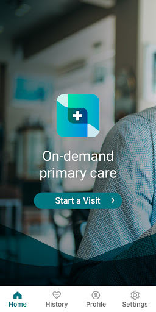
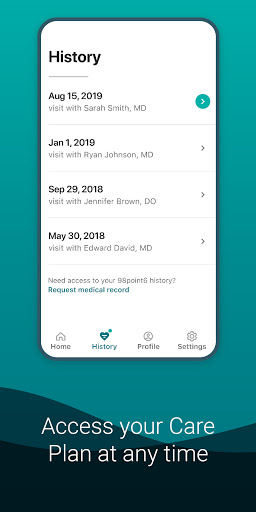
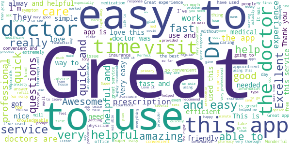
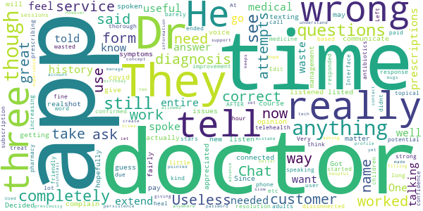

# 98point6
App version ``2.54.0``

Analyzed with [covid-apps-observer](http://github.com/covid-apps-observer) project, version ``0.1``

## App overview
| | |
|-------------------------|-------------------------| 
| **Name**                                          | 98point6 |
| **Unique identifier** | com.ninety8point6.patientapp |
| **Link to Google Play** | [https://play.google.com/store/apps/details?id=com.ninety8point6.patientapp](https://play.google.com/store/apps/details?id=com.ninety8point6.patientapp) |
| **Summary**  | On-demand, 24/7, text-based care via secure, in-app messaging. |
| **Privacy policy** | [https://www.98point6.com/legal/#privacy](https://www.98point6.com/legal/#privacy) |
| **Latest version** | 2.54.0 |
| **Last update** | 2021-07-07 03:30:09 |
| **Recent changes** | We’re continually updating our app to make it the best possible experience for you. Update to the latest version for all new available features. This version includes user experience improvements and minor bug fixes. |
| **Installs**  | 50,000+ |
| **Category** | Medical |
| **First release** | Jun 26, 2017 |
| **Size**  | 59M |
| **Supported Android version**  | 6.0 and up |

### Description
> 98point6 provides on-demand diagnosis, treatment and consultation from board-certified physicians and sends necessary prescriptions to your pharmacy—all via secure, in-app messaging. Our unique, text-based care delivery means you can get the right care at the right time. No appointments, no travel. We’re available nationwide, 24/7, 365 days a year. 
 HOW MUCH DOES IT COST?
 There are two ways to get 98point6: via a Personal Plan or a Sponsored Plan.
 Personal Plans subscriptions come at an introductory rate of $30 for the first 3 months, with unlimited access to on-demand care for just $1 per visit. When that initial period ends, you have the option to enroll in an annual plan for only $120 per year + $1 per visit. (Please note, only one patient per account. You must be 18+ to create an account and seek care; 19+ in Nebraska.)
 Some employers, health plans and retailers provide access to 98point6 at no charge and offer visits at low/no cost to eligible members and their dependents ages 1+. To see if you're eligible, please check with your plan sponsor.
 WHAT DOES MY PERSONAL PLAN SUBSCRIPTION COVER?
 Your 98point6 Personal Plan provides you access to our board-certified physicians who offer consultation, diagnosis and treatment. Insurance is not required for your visits. Patients are responsible for any outside-of-app costs, including prescriptions, labs and visits to an in-person physician, if referred. 
 WHO ARE YOUR DOCTORS?
 Our virtual clinic is staffed by carefully selected, board-certified physicians who are passionate about making care more accessible and affordable. They are specially trained to treat and diagnose via text-based care. (98point6 supports photo, video and audio as needed.)
 WHAT CAN YOU TREAT? 
 Our board-certified physicians are available on-demand to diagnose and treat, answer questions, offer peace of mind and when it matters, guide you towards the most appropriate next steps. If your issue does require in-person care, you can be sure you’re on the right path to feeling better after consulting with a 98point6 physician. 
  
 Common conditions we treat include:
 • Cold, cough and flu
 • Urinary tract infections (UTI)
 • Acid reflux, heartburn and digestive issues
 • Yeast infections or sexually transmitted infections (STIs) 
 • Muscle sprains and strains
 • Seasonal allergies, asthma and respiratory issues
 • Skin conditions, rashes, bites and sunburn
 • Women’s health, such as birth control 
 • Nausea, stomach flu and gastroenteritis 
 • General health questions
 • ...and more
  
 WHAT IS YOUR PRESCRIPTION POLICY? 
 Our doctors can prescribe a wide variety of medications. However, we do not prescribe controlled substances (such as Percocet), muscle relaxants (such as Flexeril), lifestyle medications (such as Viagra or Propecia) or medications that require strict monitoring. Our physicians adhere to evidence-based standards with respect to the responsible use of antibiotics. If we are unable to prescribe a medication, it’s likely due to a combination of factors, including state and federal regulations related to virtual care practices, as well as what’s in the best interest of your safety and well-being. 
  
 Note: 98point6 is not for medical emergencies.

### User interface
The developers of the app provide the following screenshots in the Google play store.
| | | |
|:-------------------------:|:-------------------------:|:-------------------------:|
 |   |   |   | 
 |   |   |   | 

## Development team
In the following we report the main information provided by the development team in the Google play store.

| | |
|-------------------------|-------------------------|
| **Developer**  | 98point6 Inc. |
| **Website**  | [https://www.98point6.com](https://www.98point6.com) |
| **Email** | support@98point6.com |
| **Physical address**  | [701 5th Ave, Ste 2300 Seattle, WA 98104](https://www.google.com/maps/search/701%205th%20Ave,%20Ste%202300%20Seattle,%20WA%2098104) (Google Maps) |
| **Other developed apps**  | [https://play.google.com/store/apps/developer?id=98point6+Inc.](https://play.google.com/store/apps/developer?id=98point6+Inc.) |

## Android support

| | |
|-------------------------|-------------------------|
| **Declared target Android version**  | Android10, version 10 (API level 29) |
| **Effective target Android version**  | Android10, version 10 (API level 29) |
| **Minimum supported Android version**  | Marshmallow, version 6.0 (API level 23) |
| **Maximum target Android version**  | - |

The larger the difference between the minimum and maximum supported Android versions, the better. A larger difference means a wider audience. For example, old phones have a very low Android version, so a high minimum supported Android version means that the app cannot be used by users with old phones, thus leading to accessibility problems. 

## Requested permissions

In the following we report the complete list of the permissions requested by the app. 

| **Permission** | **Protection level** | **Description** | 
|-------------------------|-------------------------|-------------------------|
 **android.permission ACCESS_FINE_LOCATION** | :warning:**Dangerous** | Allows an app to access precise location. 
 **android.permission ACCESS_NETWORK_STATE** | Normal | Allows applications to access information about networks. 
 **android.permission ACCESS_WIFI_STATE** | Normal | Allows applications to access information about Wi-Fi networks. 
 **android.permission BLUETOOTH** | Normal | Allows applications to connect to paired bluetooth devices. 
 **android.permission CAMERA** | :warning:**Dangerous** | Required to be able to access the camera device. 
 **android.permission FOREGROUND_SERVICE** | Normal | Allows a regular application to use Service.startForeground. 
 **android.permission INTERNET** | Normal | Allows applications to open network sockets. 
 **android.permission MODIFY_AUDIO_SETTINGS** | Normal | Allows an application to modify global audio settings. 
 **android.permission READ_EXTERNAL_STORAGE** | :warning:**Dangerous** | Allows an application to read from external storage. 
 **android.permission RECEIVE_BOOT_COMPLETED** | Normal | Allows an application to receive the Intent.ACTION_BOOT_COMPLETED that is broadcast after the system finishes booting. 
 **android.permission RECORD_AUDIO** | :warning:**Dangerous** | Allows an application to record audio. 
 **android.permission WAKE_LOCK** | Normal | Allows using PowerManager WakeLocks to keep processor from sleeping or screen from dimming. 
 **com.google.android.c2dm.permission RECEIVE** | - | - 
 **com.google.android.finsky.permission BIND_GET_INSTALL_REFERRER_SERVICE** | - | - 

## Mentioned servers

| **Server** | **Registrant** | **Registrant country** | **Creation date** | 
|-------------------------|-------------------------|-------------------------|-------------------------|
 | googlesyndication.com | Google LLC | :us: US | 2003-01-21 06:17:24 |
 | google.com | Google LLC | :us: US | 1997-09-15 04:00:00 |
 | app-measurement.com | Google LLC | :us: US | 2015-06-19 20:13:31 |
 | googleadservices.com | Google LLC | :us: US | 2003-06-19 16:34:53 |
 | launchdarkly.com | Catamorphic Co. | :us: US | 2014-07-15 17:17:52 |
 | 98point6.com | 98point6 Inc. | :us: US | 1998-12-08 05:00:00 |
 | zendesk.com | Zendesk, Inc. | :us: US | 2005-05-16 18:05:12 |
 | opentok.com | Domains By Proxy, LLC | :us: US | 2010-09-24 17:14:13 |
 | android.com | Google LLC | :us: US | 1997-06-23 04:00:00 |
 | auth0.com | Auth0, Inc. | :us: US | 2012-10-18 18:46:46 |
 | samsclub.com | Not Disclosed | :us: US | 1995-08-11 04:00:00 |
 | googleapis.com | Google LLC | :us: US | 2005-01-25 17:52:26 |
 | stripe.com | - | :us: US | 1995-09-12 04:00:00 |

## Security analysis 

Below we report the main security warnings raised by our execution of the [Androwarn](https://github.com/maaaaz/androwarn) security analysis tool.

**Telephony identifiers leakage**
> - This application reads the MCC+MNC of the provider of the SIM 
> - This application reads the Service Provider Name (SPN) 
> - This application reads the device phone type value 
> - This application reads the numeric name (MCC+MNC) of current registered operator 
> - This application reads the operator name 
> - This application reads the unique device ID, i.e the IMEI for GSM and the MEID or ESN for CDMA phones 

**Connection interfaces exfiltration**
> - This application reads details about the currently active data network 
> - This application tries to find out if the currently active data network is metered 

**Suspicious connection establishment**
> - This application opens a Socket and connects it to the remote address ' returned no addresses for  ; port is out of range' on the 'N/A' port  
> - This application opens a Socket and connects it to the remote address 'Ljava/lang/StringBuilder;->toString()Ljava/lang/String;' on the 'N/A' port  
> - This application opens a Socket and connects it to the remote address 'Ljava/net/Proxy;->type()Ljava/net/Proxy$Type;' on the 'N/A' port  
> - This application opens a Socket and connects it to the remote address 'No route to  ' on the 'N/A' port  
> - This application opens a Socket and connects it to the remote address 'timeout' on the 'N/A' port  

**Code execution**
> - This application loads a native library 
> - This application loads a native library: 'opentok' 
> - This application executes a UNIX command containing this argument: '2' 

## User ratings and reviews

Below we provide information about how end users are reacting to the app in terms of ratings and reviews in the Google Play store.

### Ratings

The 98point6 app has been installed by more than **50000** times. At this time, **2470** rated the app and its average score is **4.625**. Below we show the distribution of the ratings across the usual star-based rating of Google Play

:star::star::star::star::star:: 2124

:star::star::star::star:: 109

:star::star::star:: 39

:star::star:: 59

:star:: 139

### Reviews 

#### 5-star reviews

> available 24hrs a day. detailed care plan  :date: __2021-07-17 05:20:21__

> This was a great way to get the care I needed.  :date: __2021-07-15 18:07:36__

> Works great. Can't speak to cost, it's free as a work benefit.  :date: __2021-07-13 17:41:13__

> So simple and easy to use! Ask just the right questions to help with numerous situations!  :date: __2021-07-10 21:41:40__

> Easy and effective. Glad to have the app.  :date: __2021-07-09 15:53:10__

> So easy, fast, professional, love all the features!!  :date: __2021-07-08 23:41:01__

> Awesome Dr. Jyoti was amazing and explained everything perfectly  :date: __2021-07-08 17:43:01__

> The doctors are really helpful and great at explaining things to you...  :date: __2021-07-07 00:32:28__

> I have used this service a few times and it has always been helpful. I was surprised because I'm not seeing doctor in person BUT they are actually very personable and very helpful  :date: __2021-07-06 04:41:31__

> Easy to use better than going in person  :date: __2021-07-05 19:49:27__

#### 4-star reviews

> The experience was good. I received a few errors that said "woops something happened on our end" and I was worried that my information wasn't being saved and I was going to have to start over but I was able to continue on. There are quite a few questions and I understand they need to be asked but I wonder if some of them could be consolidated into one screen?  :date: __2021-06-29 20:45:22__

> Great for simple issues  :date: __2021-05-14 01:47:21__

> Quick and easy. The doctors are detailed in their questions.  :date: __2021-05-06 12:46:24__

> I will outeWe eeline ee we wwwkepp ewWww ewewwe rawness e we relock w eeeee equaTe ee eee Reews, eeeeweeeeeeeeewewwawseew e eee ere ewe w youeeeee wewe ewe eeeee e wwwe e e ewere the2 bigger person who I I.e.the e e ee w ewe at eeee  :date: __2021-05-01 04:46:13__

> Good  :date: __2021-04-21 22:02:54__

> Quick and efficient !  :date: __2021-03-30 18:53:17__

> Dont like that u cant talk to the doctor only by text  :date: __2021-02-13 00:33:46__

> Very quick and helpful  :date: __2021-02-09 15:58:34__

> I had throbbing aches to the back of my right side of my head and times to my neck and tight shoulders to realize it could be a muscle strain.  :date: __2021-02-03 01:16:08__

> Very good  :date: __2021-01-05 11:50:15__

#### 3-star reviews

> They can't really do anything but extend prescriptions, which is useful but, they also want your entire medical history to do it though which is not needed.  :date: __2021-07-01 17:45:29__

> One of the doctors I spoke with I feel doesn't know what she s talking about.  :date: __2021-06-23 05:39:12__

> App works really well but is a waste of time. Dr wouldn't answer any of my questions and told me to go see a Dr. I can't really complain though. I guess you get what you pay for.  :date: __2021-04-26 06:38:47__

> Takes a while to actually communicate with a real doctor, and then of course its still just texting, no voice, which I don't like. But I appreciated getting a doctor's opinion on a covid matter.  :date: __2020-08-23 00:55:56__

> Decided to give app a shot. Got connected to a doctor. She did not listen, listed my symptoms completely wrong, and wrong diagnosis. Since this time, I have spoken with management, not customer service. They listened to the issues and will hopefully correct them. It is a fairly new app, with time there may be improvement.  :date: __2020-08-20 23:39:39__

> Very thorough  :date: __2020-08-10 14:03:47__

> Useless if you need a dr for children. At this time its only for adults. Which they didnt tell me until AFTER i paid for a subscription and started speaking with a dr  :date: __2020-04-19 22:11:02__

> Completely useless. Three attempts, three disconnected sessions, no resolution of any kind, an hour of wasted time. Edit... increasing to three stars due to customer service response phone call. App still needs work.  :date: __2020-04-15 18:57:13__

> Chat based telehealth has a lot of potential, and the app worked fine, but the doctor barely said anything. He didn't tell me his diagnosis, just said "I think we can treat this with strong topical antibiotics", and confirmed my pharmacy. I had to ask him what he was prescribing. He responded with 1 word (the medicine name), and them ended the chat - didn't tell me how to use it or how long it would take to heal or ask if I had any other questions, etc. Left me with little confidence.  :date: __2020-04-05 20:56:16__

> Interface is not user friendly. But, with persistence you can manage it. I made a mistake filling out the create account form, my birthday was wrong. However, the form pointed me to my name, which it allowed me two tries and then I had to uninstall to get more attempts to get the information correct. I could understand a password. I have yet to use it to see a doctor. I hope that experience is better.  :date: __2020-04-02 18:41:33__

#### 2-star reviews

> Diana Lewis is rude and unempathetic  :date: __2021-07-01 00:23:14__

> The app interface is great. Very simple to use. Wait time only about 10 minutes, also great. Why 2 stars? I've used this for myself and my kids the outcome almost Everytime: doesn't seem like you ever get a MD, only DO. They basically send you a WebMD article you've already read. Tell you to take Tylenol, wash your hands, or go see your dr because they can't help. I can get the same results from these people as I can on Google. They never write a rx and we end up going to a dr. Smh  :date: __2021-06-11 02:08:18__

> Really, a text chat appt? What a joke. I will not use this again.  :date: __2021-05-11 22:51:03__

> Don't offer mental health care  :date: __2021-05-10 23:37:57__

> 27 minute wait and it didn't buzz or anything once they answered so I missed it 😡  :date: __2021-04-29 07:29:10__

> Only pertaining to one time, I felt rushed and one question he gave me no options or suggestions  :date: __2021-04-22 20:45:46__

> No point in an online Doctor if they are still going to send you to a doctor for a simple urinary tract infection that you and every other woman gets a couple of times a year!  :date: __2021-04-06 20:36:14__

> I don't know if this is the way to go  :date: __2021-03-18 17:40:30__

> I don't think this doctor listened to what I said.  :date: __2021-03-06 16:55:58__

> Great concept but a real cra\*\*y app. I have insurance. The only questions asked have nothing to do with anything other than basic personal info. You got next and theb told your not covered. $120? I don't think so. Some of us are on social security  :date: __2020-08-14 14:02:12__

#### 1-star reviews

> This app was a great idea however the doctors on here have no compassion or have any patience with each person requesting a visit. They have massive egos and refuse to listen to the patients history and try and treat them. If they don't like the questions the patient has they end the conversation. I am disappointed that Banner Health is associated with this app.  :date: __2021-06-15 01:27:42__

> Doctors dont actually help with any real problems. And just repeat what you tell them. So pretty much useless and you are better off using the internet.  :date: __2021-06-10 04:02:37__

> Contacted them to make sure the 2 meds I was looking for refills for were something they were able to prescribe. They said yes so I signed up. Got a silly argument from the doctor about how one is not a "first Line" med. I've been on many alternatives, this one works, I've been on it for a year, covered by insurance with good results. i got *1* month filled. The other she simply refused to prescribe. (Low dose non controlled to help with sleep - might as well be benadryl.). Complete waste.  :date: __2021-06-10 01:36:50__

> Didn't get a satisfactory resolution so I will go to a clinic tomorrow. Disappointed at the lack of concern for the tick bite. Lyme's disease is a serious concern and I was told to put a topical antibiotic on it and that's it.  :date: __2021-06-01 01:14:34__

> Worthless. Don't waste your time. Toothache? You got covid. Fell down, scrapped your leg? You got covid. Smash your thumb? You guessed it. You got covid. Exactly what Max Kaplan said.  :date: __2021-05-28 17:21:11__

> Doc ended session before I had a chance to respond  :date: __2021-05-27 05:00:23__

> If this service wasn't paid for by my work. I wouldn't use it. I've made multiple attempts over the past two years, and the only advice I've been given is to go to the ER, which I often can't afford even with insurance. I'm a chronically ill medical professional - I know what the first steps to try are, and I generally know what necessitates the ER. I really want to be able to recommend this service, but based on my experience I just can't.  :date: __2021-05-26 04:44:29__

> Useless app. How can you possible do medical checks by texting? The doctor told me to go to a real doctor's office for treatment. Waste of my time.  :date: __2021-05-19 20:49:27__

> They always tell me to go see my regular doctor. Waste of time.  :date: __2021-05-14 02:12:47__

> No care dr. Didn't want to help just told me to go to urgent care. I explained no money for copay and no way to get there and she didn't act interested. They say that they are concerned about there patients care. You can say that you care but the actions of the physician says different. If this is there idea of care they need to rethink what care is and what is acceptable. if they think this is acceptable then I worry about others that use this site. No one reached out to me that is not true.  :date: __2021-05-12 05:42:34__

