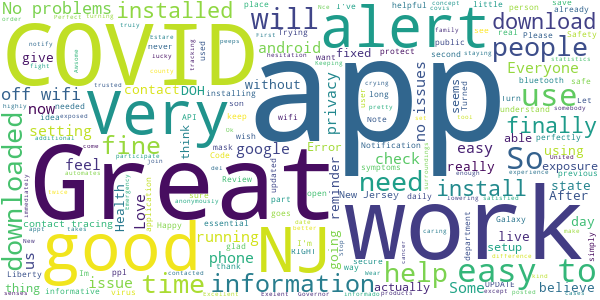

# COVID Alert NJ
App version ``1.0.1``

Analyzed with [covid-apps-observer](http://github.com/covid-apps-observer) project, version ``0.1``

## App overview
| | |
|-------------------------|-------------------------| 
| **Name**&nbsp;&nbsp;&nbsp;&nbsp;&nbsp;&nbsp;&nbsp;&nbsp;&nbsp;&nbsp;&nbsp;&nbsp;&nbsp;&nbsp;&nbsp;&nbsp;&nbsp;&nbsp;&nbsp;&nbsp;&nbsp;&nbsp;&nbsp;&nbsp;&nbsp;&nbsp;&nbsp;&nbsp;&nbsp;&nbsp;&nbsp;&nbsp;&nbsp;&nbsp;&nbsp;&nbsp;&nbsp;&nbsp;&nbsp;&nbsp;  | COVID Alert NJ |
| **Unique identifier** | com.nj.gov.covidalert |
| **Link to Google Play** | [https://play.google.com/store/apps/details?id=com.nj.gov.covidalert](https://play.google.com/store/apps/details?id=com.nj.gov.covidalert) |
| **Summary**  | Help us stop the spread of COVID-19 in New Jersey! |
| **Privacy policy** | [https://www.nj.gov/health/documents/DPP_COVIDALERTNJ.pdf](https://www.nj.gov/health/documents/DPP_COVIDALERTNJ.pdf) |
| **Latest version** | 1.0.1 |
| **Last update** | 2020-10-09 11:00:32 |
| **Recent changes** | Minor bug fixes |
| **Installs**  | 100,000+ |
| **Category** | Health & Fitness |
| **First release** | Sep 18, 2020 |
| **Size**  | 106M |
| **Supported Android version**  | 6.0 and up |

### Description
> COVID Alert NJ App is being made available by the New Jersey Department of Health (DOH) to complement New Jersey’s comprehensive COVID-19 contact tracing effort. COVID Alert NJ is a free and secure mobile phone app that allows New Jerseyans:
 1.	To be alerted if they have been in close contact with another app user who has tested positive for COVID-19 – even if that person is a stranger
 2.	To track their symptoms and get advice on what to do to protect themselves and others
 3.	To be able to anonymously warn other app users whom they were in close contact with, if they tested positive for COVID-19 – especially people they do not know or remember being in close contact with (e.g., during bus/train ride, at public places)
 4.	To monitor the latest information and statistics related to the COVID-19 pandemic
 5.	To reach NJ public health representatives and be connected with support services 
 For all this to work, all you have to do is push “Allow” COVID-19 Exposure Notification Services (ENS) on your phone within your App.
 You can also choose to “Allow” your phone to turn on the COVID-19 Exposure Notification Services (ENS) and also “Allow” your phone to display notifications so that you also receive an alert that you have been exposed to someone who has tested positive for COVID-19. You can also turn off this functionality, at any time, in the Settings page of the App. 
 In the event you receive an Exposure Notification, you may read NJ DOH advice under Exposure Notification Information or get in touch with a public health representative.
 It is important to note that COVID Alert NJ will never reveal the identity of any person using the app to other app users, and never reveals who has been diagnosed as positive for COVID-19. 
 Help us Stop the Spread of COVID-19 in New Jersey. Share this app with your friends and family.
 The use of this App is entirely voluntary and it is available to download for free from the Google Play Store. The App runs Android phones running Android 6.0 and higher. The App is not intended for use by persons under 18 years of age, as they are considered not to have reached the digital age of consent or agreement with the State of New Jersey. You will be asked to confirm that you are 18 years or older after you download the App.
 View our privacy policy here: https://www.nj.gov/health/documents/DPP_COVIDALERTNJ.pdf

### User interface
The developers of the app provide the following screenshots in the Google play store.
| | | |
|:-------------------------:|:-------------------------:|:-------------------------:|
 |   |   |   | 
 |   |  

## Development team
In the following we report the main information provided by the development team in the Google play store.

| | |
|-------------------------|-------------------------|
| **Developer**  | State of New Jersey  Applications |
| **Website**  | [https://covid19.nj.gov/index.html](https://covid19.nj.gov/index.html) |
| **Email** | COVIDapp@doh.nj.gov |
| **Physical address**  | - |
| **Other developed apps**  | [https://play.google.com/store/apps/developer?id=State+of+New+Jersey++Applications](https://play.google.com/store/apps/developer?id=State+of+New+Jersey++Applications) |

## Android support

| | |
|-------------------------|-------------------------|
| **Declared target Android version**  | Android10, version 10 (API level 29) |
| **Effective target Android version**  | Android10, version 10 (API level 29) |
| **Minimum supported Android version**  | Marshmallow, version 6.0 (API level 23) |
| **Maximum target Android version**  | - |

The larger the difference between the minimum and maximum supported Android versions, the better. A larger difference means a wider audience. For example, old phones have a very low Android version, so a high minimum supported Android version means that the app cannot be used by users with old phones, thus leading to accessibility problems. 

## Requested permissions

In the following we report the complete list of the permissions requested by the app. 

| **Permission** | **Protection level** | **Description** | 
|-------------------------|-------------------------|-------------------------|
 **android.permission ACCESS_NETWORK_STATE** | Normal | Allows applications to access information about networks. 
 **android.permission ACCESS_WIFI_STATE** | Normal | Allows applications to access information about Wi-Fi networks. 
 **android.permission BLUETOOTH** | Normal | Allows applications to connect to paired bluetooth devices. 
 **android.permission FOREGROUND_SERVICE** | Normal | Allows a regular application to use Service.startForeground. 
 **android.permission INTERNET** | Normal | Allows applications to open network sockets. 
 **android.permission RECEIVE_BOOT_COMPLETED** | Normal | Allows an application to receive the Intent.ACTION_BOOT_COMPLETED that is broadcast after the system finishes booting. 
 **android.permission VIBRATE** | Normal | Allows access to the vibrator. 

## Mentioned servers

| **Server** | **Registrant** | **Registrant country** | **Creation date** | 
|-------------------------|-------------------------|-------------------------|-------------------------|
 | android.com | Google LLC | :us: US | 1997-06-23 04:00:00 |
 | google.com | Google LLC | :us: US | 1997-09-15 04:00:00 |
 | expo.io | See PrivacyGuardian.org | :us: US | 2011-05-01 21:26:50 |

## Security analysis 

Below we report the main security warnings raised by our execution of the [Androwarn](https://github.com/maaaaz/androwarn) security analysis tool.

**Telephony identifiers leakage**
> - This application reads the numeric name (MCC+MNC) of current registered operator 
> - This application reads the operator name 

**Connection interfaces exfiltration**
> - This application reads details about the currently active data network 
> - This application tries to find out if the currently active data network is metered 

**Suspicious connection establishment**
> - This application opens a Socket and connects it to the remote address ' returned no addresses for  ; port is out of range' on the 'N/A' port  
> - This application opens a Socket and connects it to the remote address '' on the 'N/A' port  
> - This application opens a Socket and connects it to the remote address 'Ljava/lang/StringBuilder;->toString()Ljava/lang/String;' on the 'N/A' port  
> - This application opens a Socket and connects it to the remote address 'Ljava/net/Proxy;->type()Ljava/net/Proxy$Type;' on the 'N/A' port  
> - This application opens a Socket and connects it to the remote address 'timeout' on the 'N/A' port  

**Pim data leakage**
> - This application accesses data stored in the clipboard 

**Code execution**
> - This application loads a native library 
> - This application executes a UNIX command 

## User ratings and reviews

Below we provide information about how end users are reacting to the app in terms of ratings and reviews in the Google Play store.

### Ratings

The COVID Alert NJ app has been installed by more than **100000** times. At this time, **409** rated the app and its average score is **3.9306931**. Below we show the distribution of the ratings across the usual star-based rating of Google Play

:star::star::star::star::star:: 252

:star::star::star::star:: 40

:star::star::star:: 28

:star::star:: 16

:star:: 73

### Reviews 

#### 5-star reviews

> Great idea. Great app.  :date: __2021-02-05 15:41:31__

> Keeps me posted on what is going on  :date: __2021-01-30 23:21:39__

> No problems  :date: __2021-01-29 20:14:21__

> Perfect  :date: __2021-01-20 08:45:44__

> Everyone in NJ should be on this. It automates contact tracing, anonymously. Will notify you if you've been exposed.  :date: __2021-01-14 22:17:13__

> Exelent  :date: __2021-01-14 05:37:09__

> Ok  :date: __2021-01-09 02:54:21__

> Great concept. And as more and more of us participate, the more it will help to protect us all.  :date: __2021-01-06 23:59:44__

> The Covid- 19 alert app is only good "if you have bluetooth" 😣😞 in which i do not have,  :date: __2020-12-30 21:48:59__

> Estare informado del virus  :date: __2020-12-29 06:36:39__

#### 4-star reviews

> This app works well as far as the exposure system goes. Only downside is that the Covid tally for the state total is not accurate. It has been stuck at 615K for me, when obviously the numbers keep getting higher. Please fix this.  :date: __2021-01-30 09:39:17__

> Help us stop the spread of COVID-19 in New Jersey! COVID Alert NJ App is being made available by the New Jersey Department of Health (DOH) to complement New Jersey’s comprehensive COVID-19 contact tracing effort. COVID Alert NJ is a free and secure mobile phone app that allows New Jerseyans: 1. To be alerted if they have been in close contact with another app user who has tested positive for COVID-19 – even if that person is a stranger 2. To track their symptoms and get advice on what to do to  :date: __2021-01-25 03:35:13__

> Want info on getting vaccine !!  :date: __2021-01-08 20:39:52__

> It should show where I am in the queue for vaccination.  :date: __2021-01-06 14:58:41__

> Need to have an option to change the "How are you feeling?" response for when you select the incorrect response by mistake.  :date: __2020-12-26 19:43:12__

> Optimistic about the potential.  :date: __2020-12-12 17:22:21__

> I like that you can take a moment to store daily check ups. SJZ  :date: __2020-12-11 19:49:58__

> Informative  :date: __2020-11-30 11:57:38__

> This is a very informative app.  :date: __2020-11-18 01:56:53__

> To work everyone needs to use it, otherwise you could be exposed by someone who doesn't use this  :date: __2020-11-16 23:15:37__

#### 3-star reviews

> Okay  :date: __2021-01-30 07:35:25__

> Graph of deaths by day is very wrong.  :date: __2021-01-27 18:07:12__

> The numbers for confirmed cases and deaths are wrong.  :date: __2021-01-18 21:33:16__

> The adaptive icon randomly becomes a square.  :date: __2021-01-13 19:52:55__

> This app needs improvement. When you get an exposure alert it doesn't tell you the date of exposure, just that it was within the past 14 days. So you could already be out of the quarantine period or only need to test and isolate for a few days. Giving the date of exposure seems important.  :date: __2021-01-06 00:25:46__

> Rite aid Cov 19 testing  :date: __2020-12-13 15:43:07__

> I Certainly can't actually Rate something I just got.  :date: __2020-11-18 22:11:50__

> Works ONLY: #1. If an infected person ALSO has the APP and you both have Bluetooth &. Location turned on. And #2. You come within 6 Feet for more than 10 minutes of an infected person AND #3 The infected person AGREES to allow the Tracers to access the app code information. What code? When your phone meets another phone ( see #1) a code is sent via bluetooth to both phones. The app remembers the code info. The tracer simply activates that code to send you an alert. Good for crowds etc.  :date: __2020-11-18 04:34:50__

> This app collects daily data well enough, BUT IT GIVES LITTLE INFO THAT CAN HELP PEOPLE!! PLEASE IMPROVE IT!!! - County-level % is % of STATE!! USELESS!! WHAT'S IMPORTANT is the current 7 day positivity testing rate!!! - NOT BY COUNTY, BUT BY MY CURRENT LOCATION!!! - EVEN BETTER: GIVE THE % POSITIVITY WITHIN A 1,5,10,25 MIKE RADIUS!!! THIS WAY, PEOPLE CAN MANAGE RISK!!! - YOU HAVE THE GPS COORDINATES OF EVERYONE, SO YOU CAN DO THIS!!! WHY DON'T YOU????  :date: __2020-11-15 21:25:32__

> Just really want to know if the app talks to the NY and PA apps? I deal with people from both daily.  :date: __2020-11-15 21:15:30__

#### 2-star reviews

> For the elderly or those who cannot walk long distances, there is no information on which site is best; I am in category 1b. Everytime I search for a location. I am re-routed back to this site which I have already registered.  :date: __2021-01-26 23:12:35__

> Deaths per day graph is corrupted for a while now. This needs to be fixed.  :date: __2021-01-24 15:37:29__

> way too buggy  :date: __2021-01-07 20:09:36__

> I work at a busy congenial store, and have had the app installed for a few months now. I find it really improbable no one infected with the app has walked into the store.  :date: __2020-11-17 17:23:10__

> Difficult to navigate  :date: __2020-11-15 20:37:09__

> I am not leaving my Bluetooth on everywhere I go which isn't far but this will take a long time to get enough peoples info and get them on board before you can do that! Ifmt feels intrusive as well. Never leave your Bluetooth on unless you know what your hooked up to.  :date: __2020-11-13 21:08:54__

> Unfortunately b cause of the blue tooth ne don't to be on it has caused issues with my phone. In which I have issues turning off and or turning on manually the bluetooth. It has also cause phone to lock up. This is causing issues with hands free calling. Uninstalled app.  :date: __2020-10-27 21:13:14__

> Slowest app in existence, love the daily check-ins and the the app in general but the horrendous slowness makes it a pain  :date: __2020-10-16 14:52:44__

> Y 553e  :date: __2020-10-13 03:40:34__

> In order to install app I was to turn off my wifi during install and my malware scanner. After doing this I turned on my wifi no problem, but my malware scanner detected the NJ COVID ALERT as malware due to I guess the access to Bluetooth. I will try it for a week and decide weather to keep it  :date: __2020-10-11 16:57:02__

#### 1-star reviews

> Bogus  :date: __2021-02-03 06:12:06__

> nobody uses it  :date: __2021-01-25 07:24:34__

> Shows negative daily deaths  :date: __2021-01-19 03:50:44__

> It's not mine but it's on my phone  :date: __2021-01-12 11:50:16__

> 2019 US deaths be4 Pandemic: 2.85 mil 2020 US deaths After Pandemic: 2.83 mil Per C.D.C. Say no to fascism. Say no to this garbage app..  :date: __2021-01-06 11:15:47__

> The contact alert feature is bordeine comsumer fraud .has it zctually od contact by anyone why are comments going oy back to decembet  :date: __2021-01-02 00:59:00__

> #PRESIDENTSTEVENKING #STEVENKING I KNOW THE CURE FOR COVIDE, FDA APPORVED ME TO RESEarch  :date: __2021-01-01 22:54:10__

> I tested positive yesterday, but there is no way to tell the app. I can only report symptoms. Apparently I need a 6 digit code from some health department to let the app know I was positive. So until I get that code nobody who was in proximity to me will get a notification and will therefore keep spreading the 'rona.  :date: __2021-01-01 22:32:23__

> Absolutely worthless. Contracted covid from a person that contracted covid while in hospital. The contact tracer was not able to get the 6 digit code I needed for the app. Also Drs are refusing to test likely positive people. There's no way to use the app as intended without a test or a code, don't bother with the invasion of privacy.  :date: __2020-12-26 07:40:54__

> Your "ENABLE EXPOSURE ALERT" button has not worked since its launch. Gone into settings > exposure alert > enable and NOTHING. Have an Android phone but know of iPhone users with the same problem. Located in Morris County, NJ. PLEASE FIX THIS!!  :date: __2020-12-22 14:24:30__

