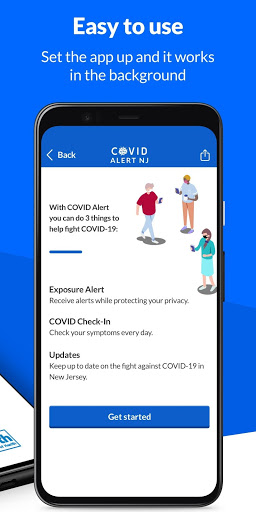
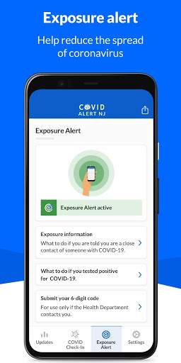

# COVID Alert NJ
App version ``1.0.1``

Analyzed with [covid-apps-observer](http://github.com/covid-apps-observer) project, version ``0.1``

## App overview
| | |
|-------------------------|-------------------------| 
| **Name**&nbsp;&nbsp;&nbsp;&nbsp;&nbsp;&nbsp;&nbsp;&nbsp;&nbsp;&nbsp;&nbsp;&nbsp;&nbsp;&nbsp;&nbsp;&nbsp;&nbsp;&nbsp;&nbsp;&nbsp;&nbsp;&nbsp;&nbsp;&nbsp;&nbsp;&nbsp;&nbsp;&nbsp;&nbsp;&nbsp;&nbsp;&nbsp;&nbsp;&nbsp;&nbsp;&nbsp;&nbsp;&nbsp;&nbsp;&nbsp;  | COVID Alert NJ |
| **Unique identifier** | com.nj.gov.covidalert |
| **Link to Google Play** | [https://play.google.com/store/apps/details?id=com.nj.gov.covidalert](https://play.google.com/store/apps/details?id=com.nj.gov.covidalert) |
| **Summary**  | Help us stop the spread of COVID-19 in New Jersey! |
| **Privacy policy** | [https://www.nj.gov/health/documents/DPP_COVIDALERTNJ.pdf](https://www.nj.gov/health/documents/DPP_COVIDALERTNJ.pdf) |
| **Latest version** | 1.0.1 |
| **Last update** | 2020-10-09 11:00:32 |
| **Recent changes** | Minor bug fixes |
| **Installs**  | 100,000+ |
| **Category** | Health & Fitness |
| **First release** | Sep 18, 2020 |
| **Size**  | 106M |
| **Supported Android version**  | 6.0 and up |

### Description
> COVID Alert NJ App is being made available by the New Jersey Department of Health (DOH) to complement New Jersey’s comprehensive COVID-19 contact tracing effort. COVID Alert NJ is a free and secure mobile phone app that allows New Jerseyans:
 1.	To be alerted if they have been in close contact with another app user who has tested positive for COVID-19 – even if that person is a stranger
 2.	To track their symptoms and get advice on what to do to protect themselves and others
 3.	To be able to anonymously warn other app users whom they were in close contact with, if they tested positive for COVID-19 – especially people they do not know or remember being in close contact with (e.g., during bus/train ride, at public places)
 4.	To monitor the latest information and statistics related to the COVID-19 pandemic
 5.	To reach NJ public health representatives and be connected with support services 
 For all this to work, all you have to do is push “Allow” COVID-19 Exposure Notification Services (ENS) on your phone within your App.
 You can also choose to “Allow” your phone to turn on the COVID-19 Exposure Notification Services (ENS) and also “Allow” your phone to display notifications so that you also receive an alert that you have been exposed to someone who has tested positive for COVID-19. You can also turn off this functionality, at any time, in the Settings page of the App. 
 In the event you receive an Exposure Notification, you may read NJ DOH advice under Exposure Notification Information or get in touch with a public health representative.
 It is important to note that COVID Alert NJ will never reveal the identity of any person using the app to other app users, and never reveals who has been diagnosed as positive for COVID-19. 
 Help us Stop the Spread of COVID-19 in New Jersey. Share this app with your friends and family.
 The use of this App is entirely voluntary and it is available to download for free from the Google Play Store. The App runs Android phones running Android 6.0 and higher. The App is not intended for use by persons under 18 years of age, as they are considered not to have reached the digital age of consent or agreement with the State of New Jersey. You will be asked to confirm that you are 18 years or older after you download the App.
 View our privacy policy here: https://www.nj.gov/health/documents/DPP_COVIDALERTNJ.pdf

### User interface
The developers of the app provide the following screenshots in the Google play store.
| | | |
|:-------------------------:|:-------------------------:|:-------------------------:|
 |   |   |   | 
 |   |  

## Development team
In the following we report the main information provided by the development team in the Google play store.

| | |
|-------------------------|-------------------------|
| **Developer**  | State of New Jersey  Applications |
| **Website**  | [https://covid19.nj.gov/index.html](https://covid19.nj.gov/index.html) |
| **Email** | COVIDapp@doh.nj.gov |
| **Physical address**  | - |
| **Other developed apps**  | [https://play.google.com/store/apps/developer?id=State+of+New+Jersey++Applications](https://play.google.com/store/apps/developer?id=State+of+New+Jersey++Applications) |

## Android support

| | |
|-------------------------|-------------------------|
| **Declared target Android version**  | Android10, version 10 (API level 29) |
| **Effective target Android version**  | Android10, version 10 (API level 29) |
| **Minimum supported Android version**  | Marshmallow, version 6.0 (API level 23) |
| **Maximum target Android version**  | - |

The larger the difference between the minimum and maximum supported Android versions, the better. A larger difference means a wider audience. For example, old phones have a very low Android version, so a high minimum supported Android version means that the app cannot be used by users with old phones, thus leading to accessibility problems. 

## Requested permissions

In the following we report the complete list of the permissions requested by the app. 

| **Permission** | **Protection level** | **Description** | 
|-------------------------|-------------------------|-------------------------|
 **android.permission ACCESS_NETWORK_STATE** | Normal | Allows applications to access information about networks. 
 **android.permission ACCESS_WIFI_STATE** | Normal | Allows applications to access information about Wi-Fi networks. 
 **android.permission BLUETOOTH** | Normal | Allows applications to connect to paired bluetooth devices. 
 **android.permission FOREGROUND_SERVICE** | Normal | Allows a regular application to use Service.startForeground. 
 **android.permission INTERNET** | Normal | Allows applications to open network sockets. 
 **android.permission RECEIVE_BOOT_COMPLETED** | Normal | Allows an application to receive the Intent.ACTION_BOOT_COMPLETED that is broadcast after the system finishes booting. 
 **android.permission VIBRATE** | Normal | Allows access to the vibrator. 

## Mentioned servers

| **Server** | **Registrant** | **Registrant country** | **Creation date** | 
|-------------------------|-------------------------|-------------------------|-------------------------|
 | android.com | Google LLC | :us: US | 1997-06-23 04:00:00 |
 | google.com | Google LLC | :us: US | 1997-09-15 04:00:00 |
 | expo.io | See PrivacyGuardian.org | :us: US | 2011-05-01 21:26:50 |

## Security analysis 

Below we report the main security warnings raised by our execution of the [Androwarn](https://github.com/maaaaz/androwarn) security analysis tool.

**Telephony identifiers leakage**
> - This application reads the numeric name (MCC+MNC) of current registered operator 
> - This application reads the operator name 

**Connection interfaces exfiltration**
> - This application reads details about the currently active data network 
> - This application tries to find out if the currently active data network is metered 

**Suspicious connection establishment**
> - This application opens a Socket and connects it to the remote address ' returned no addresses for  ; port is out of range' on the 'N/A' port  
> - This application opens a Socket and connects it to the remote address '' on the 'N/A' port  
> - This application opens a Socket and connects it to the remote address 'Ljava/lang/StringBuilder;->toString()Ljava/lang/String;' on the 'N/A' port  
> - This application opens a Socket and connects it to the remote address 'Ljava/net/Proxy;->type()Ljava/net/Proxy$Type;' on the 'N/A' port  
> - This application opens a Socket and connects it to the remote address 'timeout' on the 'N/A' port  

**Pim data leakage**
> - This application accesses data stored in the clipboard 

**Code execution**
> - This application loads a native library 
> - This application executes a UNIX command 

## User ratings and reviews

Below we provide information about how end users are reacting to the app in terms of ratings and reviews in the Google Play store.

### Ratings

The COVID Alert NJ app has been installed by more than **100000** times. At this time, **409** rated the app and its average score is **3.9306931**. Below we show the distribution of the ratings across the usual star-based rating of Google Play

:star::star::star::star::star:: 252

:star::star::star::star:: 40

:star::star::star:: 28

:star::star:: 16

:star:: 73

### Reviews 

#### 5-star reviews

> Great Health Emergency APP! My family and I downloaded immediately without hesitation! The DOH & our Governor want to save our lives! It's so easy to use and informative! You can simply set up a reminder and it only takes 15 seconds to check in! I truly believe if more NJ peeps downloaded this easy tool & join the fight, it could save lives & give additional information to our caring DOH department!! ❤  :date: __2020-11-26 19:37:27__

> Very helpful app  :date: __2020-11-25 05:06:53__

> After turning off WiFi then setting it up works. Thanks 😊  :date: __2020-11-23 20:47:44__

> Very easy to use and understand this app  :date: __2020-11-23 02:22:03__

> I have it already on my phone I like that I can keep up with people in my surroundings.  :date: __2020-11-20 22:42:46__

> First day of use and I am highly satisfied.  :date: __2020-11-19 23:13:38__

> Easy and secure. Everyone should have it.  :date: __2020-11-19 18:01:54__

> I can't use the appt i don't have e bluetooth but what i do have is my second time having covis twice I've never had any symptoms i could feel any better except for my cancer and other things  :date: __2020-11-17 20:06:10__

> Stop crying. If they are tracking you they can do it without this app. Be kind. Love each other. Wear a mask.  :date: __2020-11-15 13:23:31__

> Keeping us as updated as possible. People Please...Mask Up!!!!  :date: __2020-11-12 12:51:16__

#### 4-star reviews

> Informative  :date: __2020-11-30 11:57:38__

> This is a very informative app.  :date: __2020-11-18 01:56:53__

> To work everyone needs to use it, otherwise you could be exposed by someone who doesn't use this  :date: __2020-11-16 23:15:37__

> I think the app is great. Very informative. It's all in one spot. You do not have to have bluetooth on all the time. You can switch it on when you would like to use it then switch it back off. Without bluetooth you are still able to access and use all of the other features like covids daily numbers local/global/etc and also you are able to check in with how you are feeling and report symptoms..just another tool in the fight against covid.  :date: __2020-11-16 18:56:28__

> Doing our part to end Covid19!  :date: __2020-10-19 16:34:27__

> I just downloaded app cant give any feed back at this time. Thanks  :date: __2020-10-12 01:03:37__

> I'm not sure I understand how it works re. sharing the positive result so other people can be alerted. I read the app info /learn how it works several times so I must be missing something. Is the assumption that the person go anywhere to take a C19 test and wait for a representative to call them? If so, how would the representative know that you tested positive?  :date: __2020-10-11 22:01:49__

> I keep getting error after I click continue. It says Sorry that didn't work properly (error code 1002).  :date: __2020-10-09 17:18:05__

> Edit - works perfectly after turning off wifi during setup. Got an immediate response from the developer on the workaround. Does not work. Error code 1002. This error is displayed after I confirm my age and press continue. I have a OnePlus 6t phone (android)  :date: __2020-10-08 22:13:53__

> UPDATE: Working now per comment from developer. I can't get the app to work on my Galaxy S10. It installs, I affirm I'm over 18, and on the data sharing page I get an error code 1002 and can't move on. I've tried uninstalling and reinstalling and get the same problem. I do not have this problem on the VA COVID app I also have on my phone.  :date: __2020-10-07 16:11:30__

#### 3-star reviews

> I Certainly can't actually Rate something I just got.  :date: __2020-11-18 22:11:50__

> Works ONLY: #1. If an infected person ALSO has the APP and you both have Bluetooth &. Location turned on. And #2. You come within 6 Feet for more than 10 minutes of an infected person AND #3 The infected person AGREES to allow the Tracers to access the app code information. What code? When your phone meets another phone ( see #1) a code is sent via bluetooth to both phones. The app remembers the code info. The tracer simply activates that code to send you an alert. Good for crowds etc.  :date: __2020-11-18 04:34:50__

> This app collects daily data well enough, BUT IT GIVES LITTLE INFO THAT CAN HELP PEOPLE!! PLEASE IMPROVE IT!!! - County-level % is % of STATE!! USELESS!! WHAT'S IMPORTANT is the current 7 day positivity testing rate!!! - NOT BY COUNTY, BUT BY MY CURRENT LOCATION!!! - EVEN BETTER: GIVE THE % POSITIVITY WITHIN A 1,5,10,25 MIKE RADIUS!!! THIS WAY, PEOPLE CAN MANAGE RISK!!! - YOU HAVE THE GPS COORDINATES OF EVERYONE, SO YOU CAN DO THIS!!! WHY DON'T YOU????  :date: __2020-11-15 21:25:32__

> Just really want to know if the app talks to the NY and PA apps? I deal with people from both daily.  :date: __2020-11-15 21:15:30__

> Even though I have exposure alerts on it seems to only do a scan if I open the app itself. Shouldn't it do this automatically daily?  :date: __2020-11-05 15:15:12__

> During setup I realized that it requires both GPS and Bluetooth to be engaged. If I do this with my phone, it would die in 4 hours. I'm an emergency service personnel, I can't go with a dead phone all day. Sorry. Good idea but won't work for me.  :date: __2020-10-29 23:00:14__

> I have this app in my phone but in order to make it more effective it needs more advertise and insist ppl to download it. It can only work more ppl uses and learn how to use it properly. I also not sure myself when its says it use bluetooth in order to make it work. Does it mean I require to wear actual blutooth on my year? Many ppl didnt even know that NJ has this app. Otherwise its a good idea.  :date: __2020-10-26 18:33:37__

> Installing this =捉蟲入屎忽  :date: __2020-10-19 04:16:38__

> Easy to install. My only question is how does it know you have been in contact with someone personally? How is connecting the dots, so to speak?  :date: __2020-10-12 17:38:42__

> I understand needing location for the alerts but why would it need bluetooth? Modern day dependence on wireless devices destroys battery life as it is. I keep my Bluetooth, location and few other settings off unless I need to use them. Again, I understand location, but why bluetooth. *Anyone that doesn't know keep bluetooth wifi and nfc off unless you need it to keep yourself safe from hackers.  :date: __2020-10-12 04:27:49__

#### 2-star reviews

> I work at a busy congenial store, and have had the app installed for a few months now. I find it really improbable no one infected with the app has walked into the store.  :date: __2020-11-17 17:23:10__

> Difficult to navigate  :date: __2020-11-15 20:37:09__

> I am not leaving my Bluetooth on everywhere I go which isn't far but this will take a long time to get enough peoples info and get them on board before you can do that! Ifmt feels intrusive as well. Never leave your Bluetooth on unless you know what your hooked up to.  :date: __2020-11-13 21:08:54__

> Unfortunately b cause of the blue tooth ne don't to be on it has caused issues with my phone. In which I have issues turning off and or turning on manually the bluetooth. It has also cause phone to lock up. This is causing issues with hands free calling. Uninstalled app.  :date: __2020-10-27 21:13:14__

> Slowest app in existence, love the daily check-ins and the the app in general but the horrendous slowness makes it a pain  :date: __2020-10-16 14:52:44__

> Y 553e  :date: __2020-10-13 03:40:34__

> In order to install app I was to turn off my wifi during install and my malware scanner. After doing this I turned on my wifi no problem, but my malware scanner detected the NJ COVID ALERT as malware due to I guess the access to Bluetooth. I will try it for a week and decide weather to keep it  :date: __2020-10-11 16:57:02__

> I kept getting Error 1002 trying to enable Usage Statistics. Then I turned off Wifi and I was able to enable everything. I never experienced that type of bug before....Hmmmm. Why?  :date: __2020-10-02 05:12:39__

> Switch off Wi-Fi and use mobile data for any error you might be receiving.  :date: __2020-10-02 04:09:39__

> Not working on wifi. Only will setup using LTE, and even once setup won't run on wifi  :date: __2020-10-01 20:26:42__

#### 1-star reviews

> Not very useful. The app only works, if someone who had or has COVID is using it too! It DOES NOT just detect people with Covid and alert you. I uninstalled it after a week of nothing and especially after 5 people tested positive where I work and the app never alerted me! It's really a waste of time.  :date: __2020-12-05 15:02:06__

> It keeps freezing after verifying my age. Still not working for me. I have a galaxy 8+.  :date: __2020-12-02 01:05:58__

> I don't have Covid yet... But this app seems to assume everyone has COVID, and don't have COVID was not an option... So how is this going to help me as a doctor who comes in contact with patients daily....  :date: __2020-11-26 17:17:20__

> Does not work. Good idea but shame on NJ for not developing it right so it works. This could really keep people safe if they did it right. Dissapointing but thats no surprise given our government and the state of the world.  :date: __2020-11-26 05:54:06__

> I haven't seen anyone reported positive yet.  :date: __2020-11-22 01:11:15__

> Not very useful.: 1. You must have and utilize a smart phone 2. You must have it activated 3. You must report your status daily 4. You must be in close contact with an infected person for too long and they must have reported they have symptons 5. Will it be compatable with apps from other states  :date: __2020-11-17 14:16:13__

> Having Bluetooth on always is not realistic plus it never alerted once. Dont waste the space on your phone for this app. Very disappointing  :date: __2020-11-15 16:12:00__

> The stupidest app ever. It is relying on the people who use it to be honest and informed. Right! Come on, how likely is that? Verification pin? Your still relying on people to admit they might be sick, get tested and then be honest enough to share that info. Good luck with that. Also. The people who are at the most risk are the ones who are the least likely to know how or want to use a cell phone app  :date: __2020-11-14 16:01:44__

> I spend most of my time at home, and this app constantly harasses me to turn on my location. I use my phone a lot, and I don't want to waste the battery. This is more inconvenient to me than it is helpful.  :date: __2020-11-10 14:14:23__

> Looks like it a 3 year old designed it and the check in feature makes no sense  :date: __2020-11-07 17:56:59__

