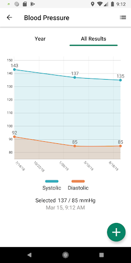
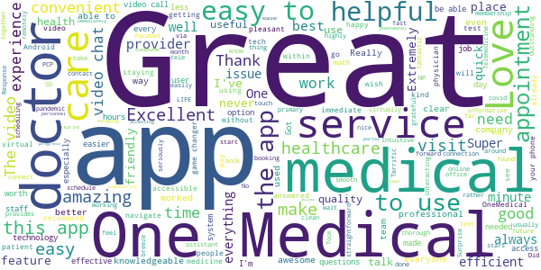
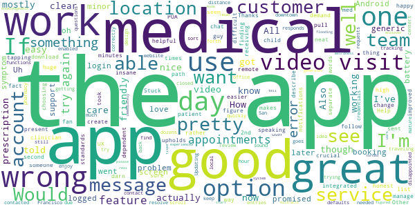
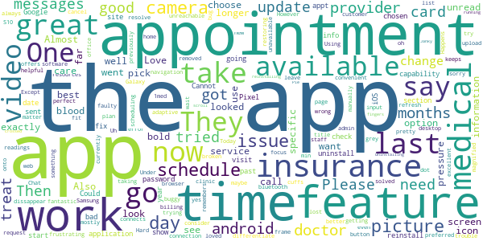
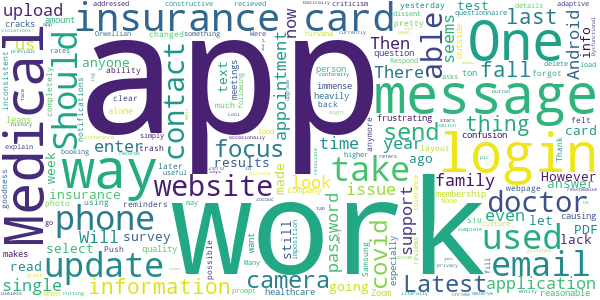

# One Medical
App version ``3.16.18``

Analyzed with [covid-apps-observer](http://github.com/covid-apps-observer) project, version ``0.1``

## App overview
| | |
|-------------------------|-------------------------| 
| **Name**                                          | One Medical |
| **Unique identifier** | com.onemedical.android |
| **Link to Google Play** | [https://play.google.com/store/apps/details?id=com.onemedical.android](https://play.google.com/store/apps/details?id=com.onemedical.android) |
| **Summary**  | Fall in love with your doctor’s office. |
| **Privacy policy** | [http://www.onemedical.com/sf/policies/privacy](http://www.onemedical.com/sf/policies/privacy) |
| **Latest version** | 3.16.18 |
| **Last update** | 2021-02-23 23:14:02 |
| **Recent changes** | If you&#39;re enjoying using the app, please leave us a review!  Having problems with the app or have suggestions to make it better? Let us know at techsupport@onemedical.com.  Minor bug fixes and improvements |
| **Installs**  | 100,000+ |
| **Category** | Medical |
| **First release** | Mar 27, 2013 |
| **Size**  | Varies with device |
| **Supported Android version**  | 6.0 and up |

### Description
> Named one of the "Most Innovative Companies" in 2019 by Fast Company, One Medical is reinventing the doctor’s office for adults and children. 
 We make it faster, easier, and more enjoyable to get exceptional primary care whenever you need it — with same- or next-day appointments at 70+ offices across the U.S. and 24/7 virtual care from anywhere, . 
 The One Medical mobile app makes it easy for members to get care and manage their health on the go. Use the app to:
 ► Book and change appointments, in-office and remote
 ► Video Chat with your providers
 ► Use Treat Me Now to get care for common issues 
 ► Message your medical team
 ► Renew prescriptions
 ► View your health history, lab results, and more
 ► Get reminders about lab work, screenings, vaccines, and follow-up visits
 ► Find One Medical locations and office/lab hours
 About One Medical
 We’re a membership-based primary care practice truly designed around your needs and your life. 
 We focus on building real relationships with patients of all ages and using technology to simplify every aspect of getting care. From illnesses and injuries to mental health to preventive care, think of us as your healthcare home base.
 Not a One Medical member yet? Join today for just $199 a year at onemedical.com or ask your employer if One Medical is one of your employee benefits.
 In addition to our easy-to-use app, our members enjoy:
 ► Same- or next-day appointments, in-office and remote
 ► Visits that start on time
 ► Beautiful, calming offices with on-site labs 
 ► More time with compassionate providers who listen
 ► Most major health insurance plans accepted
 To learn more, head to www.onemedical.com to see our full range of services.

### User interface
The developers of the app provide the following screenshots in the Google play store.
| | | |
|:-------------------------:|:-------------------------:|:-------------------------:|
 |   |   |   | 
 |   |   |   | 
 |  

## Development team
In the following we report the main information provided by the development team in the Google play store.

| | |
|-------------------------|-------------------------|
| **Developer**  | 1Life Healthcare, Inc. |
| **Website**  | [http://www.onemedical.com](http://www.onemedical.com) |
| **Email** | techsupport@onemedical.com |
| **Physical address**  | - |
| **Other developed apps**  | [https://play.google.com/store/apps/developer?id=1Life+Healthcare,+Inc.](https://play.google.com/store/apps/developer?id=1Life+Healthcare,+Inc.) |

## Android support

| | |
|-------------------------|-------------------------|
| **Declared target Android version**  | Android10, version 10 (API level 29) |
| **Effective target Android version**  | Android10, version 10 (API level 29) |
| **Minimum supported Android version**  | Marshmallow, version 6.0 (API level 23) |
| **Maximum target Android version**  | - |

The larger the difference between the minimum and maximum supported Android versions, the better. A larger difference means a wider audience. For example, old phones have a very low Android version, so a high minimum supported Android version means that the app cannot be used by users with old phones, thus leading to accessibility problems. 

## Requested permissions

In the following we report the complete list of the permissions requested by the app. 

| **Permission** | **Protection level** | **Description** | 
|-------------------------|-------------------------|-------------------------|
 **android.permission ACCESS_COARSE_LOCATION** | :warning:**Dangerous** | Allows an app to access approximate location. 
 **android.permission ACCESS_FINE_LOCATION** | :warning:**Dangerous** | Allows an app to access precise location. 
 **android.permission ACCESS_NETWORK_STATE** | Normal | Allows applications to access information about networks. 
 **android.permission ACCESS_WIFI_STATE** | Normal | Allows applications to access information about Wi-Fi networks. 
 **android.permission BLUETOOTH** | Normal | Allows applications to connect to paired bluetooth devices. 
 **android.permission BLUETOOTH_ADMIN** | Normal | Allows applications to discover and pair bluetooth devices. 
 **android.permission BROADCAST_STICKY** | Normal | Allows an application to broadcast sticky intents. 
 **android.permission CALL_PHONE** | :warning:**Dangerous** | Allows an application to initiate a phone call without going through the Dialer user interface for the user to confirm the call. 
 **android.permission CAMERA** | :warning:**Dangerous** | Required to be able to access the camera device. 
 **android.permission FOREGROUND_SERVICE** | Normal | Allows a regular application to use Service.startForeground. 
 **android.permission INTERNET** | Normal | Allows applications to open network sockets. 
 **android.permission MODIFY_AUDIO_SETTINGS** | Normal | Allows an application to modify global audio settings. 
 **android.permission READ_EXTERNAL_STORAGE** | :warning:**Dangerous** | Allows an application to read from external storage. 
 **android.permission RECEIVE_BOOT_COMPLETED** | Normal | Allows an application to receive the Intent.ACTION_BOOT_COMPLETED that is broadcast after the system finishes booting. 
 **android.permission RECORD_AUDIO** | :warning:**Dangerous** | Allows an application to record audio. 
 **android.permission SYSTEM_ALERT_WINDOW** | Signature - preinstalled - appop - pre23 - development | Allows an app to create windows using the type WindowManager.LayoutParams.TYPE_APPLICATION_OVERLAY, shown on top of all other apps. 
 **android.permission USE_BIOMETRIC** | Normal | Allows an app to use device supported biometric modalities. 
 **android.permission USE_FINGERPRINT** | Normal | This constant was deprecated in API level 28. Applications should request USE_BIOMETRIC instead 
 **android.permission VIBRATE** | Normal | Allows access to the vibrator. 
 **android.permission WAKE_LOCK** | Normal | Allows using PowerManager WakeLocks to keep processor from sleeping or screen from dimming. 
 **android.permission WRITE_EXTERNAL_STORAGE** | :warning:**Dangerous** | Allows an application to write to external storage. 
 **com.google.android.c2dm.permission RECEIVE** | - | - 
 **com.google.android.finsky.permission BIND_GET_INSTALL_REFERRER_SERVICE** | - | - 
 **com.google.android.providers.gsf.permission READ_GSERVICES** | - | - 
 **com.onemedical.android.permission MAPS_RECEIVE** | - | - 

## Mentioned servers

| **Server** | **Registrant** | **Registrant country** | **Creation date** | 
|-------------------------|-------------------------|-------------------------|-------------------------|
 | firebase.com | Google LLC | :us: US | 1997-10-02 04:00:00 |
 | googlesyndication.com | Google LLC | :us: US | 2003-01-21 06:17:24 |
 | google.com | Google LLC | :us: US | 1997-09-15 04:00:00 |
 | app-measurement.com | Google LLC | :us: US | 2015-06-19 20:13:31 |
 | amazonaws.com | Amazon.com, Inc. | :us: US | 2005-08-18 02:10:45 |
 | amazonaws.com | Amazon.com, Inc. | :us: US | 2005-08-18 02:10:45 |
 | crashlytics.com | Google LLC | :us: US | 2011-01-21 15:30:40 |
 | googleapis.com | Google LLC | :us: US | 2005-01-25 17:52:26 |
 | googleadservices.com | Google LLC | :us: US | 2003-06-19 16:34:53 |
 | mixpanel.com | WhoisGuard, Inc. | PA | 2007-03-13 02:23:00 |
 | patientops.com | Domains By Proxy, LLC | :us: US | 2018-09-27 15:37:10 |
 | opentok.com | Domains By Proxy, LLC | :us: US | 2010-09-24 17:14:13 |
 | stripe.com | - | :us: US | 1995-09-12 04:00:00 |
 | 1life.com | - | - | 2000-03-28 11:39:21 |
 | rollbar.com | Redacted for Privacy Purposes | :us: US | 2004-08-05 18:27:26 |
 | amazonaws.com | Amazon.com, Inc. | :us: US | 2005-08-18 02:10:45 |

## Security analysis 

Below we report the main security warnings raised by our execution of the [Androwarn](https://github.com/maaaaz/androwarn) security analysis tool.

**Telephony identifiers leakage**
> - This application reads the ISO country code equivalent for the SIM provider's country code 
> - This application reads the ISO country code equivalent of the current registered operator's MCC (Mobile Country Code) 
> - This application reads the MCC+MNC of the provider of the SIM 
> - This application reads the constant indicating the state of the device SIM card 
> - This application reads the current data connection state 
> - This application reads the numeric name (MCC+MNC) of current registered operator 
> - This application reads the operator name 
> - This application reads the phone number string for line 1, for example, the MSISDN for a GSM phone 
> - This application reads the phone's current state 

**Connection interfaces exfiltration**
> - This application reads details about the currently active data network 
> - This application tries to find out if the currently active data network is metered 

**Telephony services abuse**
> - This application makes phone calls 

**Suspicious connection establishment**
> - This application opens a Socket and connects it to the remote address ' returned no addresses for  ; port is out of range' on the 'N/A' port  
> - This application opens a Socket and connects it to the remote address '' on the '80' port  
> - This application opens a Socket and connects it to the remote address '' on the 'N/A' port  
> - This application opens a Socket and connects it to the remote address 'Ljava/net/Proxy;->type()Ljava/net/Proxy$Type;' on the 'N/A' port  
> - This application opens a Socket and connects it to the remote address 'timeout' on the 'N/A' port  

**Pim data leakage**
> - This application accesses the contacts list 
> - This application accesses the downloads folder 

**Code execution**
> - This application loads a native library 
> - This application loads a native library: 'Ljava/lang/System;->loadLibrary(Ljava/lang/String;)V' 
> - This application loads a native library: 'annotate' 
> - This application loads a native library: 'cmmlib' 
> - This application loads a native library: 'cptshare' 
> - This application loads a native library: 'crypto_sb' 
> - This application loads a native library: 'mcm' 
> - This application loads a native library: 'mcm_neon' 
> - This application loads a native library: 'nydus' 
> - This application loads a native library: 'opentok' 
> - This application loads a native library: 'srtp' 
> - This application loads a native library: 'ssb_sdk' 
> - This application loads a native library: 'ssl_sb' 
> - This application loads a native library: 'viper' 
> - This application loads a native library: 'viper_neon' 
> - This application loads a native library: 'zAutoUpdate' 
> - This application loads a native library: 'zChatApp' 
> - This application loads a native library: 'zChatUI' 
> - This application loads a native library: 'zData' 
> - This application loads a native library: 'zLoader' 
> - This application loads a native library: 'zVideoApp' 
> - This application loads a native library: 'zVideoUI' 
> - This application loads a native library: 'zWebService' 
> - This application loads a native library: 'zlt' 
> - This application loads a native library: 'zoom' 
> - This application loads a native library: 'zoom_pdfium' 
> - This application loads a native library: 'zoom_stlport' 
> - This application loads a native library: 'zoom_tp' 
> - This application loads a native library: 'zoom_util' 
> - This application executes a UNIX command 
> - This application executes a UNIX command containing this argument: 'logcat -d' 
> - This application executes a UNIX command containing this argument: 'mount' 
> - This application executes a UNIX command containing this argument: 'su sh' 
> - This application executes a UNIX command containing this argument: 'su' 

## User ratings and reviews

Below we provide information about how end users are reacting to the app in terms of ratings and reviews in the Google Play store.

### Ratings

The One Medical app has been installed by more than **100000** times. At this time, **914** rated the app and its average score is **4.4455447**. Below we show the distribution of the ratings across the usual star-based rating of Google Play

:star::star::star::star::star:: 734

:star::star::star::star:: 36

:star::star::star:: 36

:star::star:: 36

:star:: 72

### Reviews 

#### 5-star reviews

> Super easy to make appointments and talk with a doctor  :date: __2021-03-02 21:14:19__

> Immediate acces to health care virtually, the app works phenomenal! I will never go without my One Medical membership!  :date: __2021-02-24 23:13:39__

> Great app! Easy to use & super helpful with accessing and managing all services with my primary care provider.  :date: __2021-02-24 11:02:08__

> Excellent Service  :date: __2021-02-23 19:50:04__

> Easier than the Dept of Health portal. Got more progress in 2 days than 1 month before.  :date: __2021-02-21 18:38:19__

> The video chat feature connects you to a medical personnel immediately. We found this extremely useful.  :date: __2021-02-19 18:44:18__

> Everything works as expected  :date: __2021-02-19 01:54:16__

> Terrific NP. Have found the NP's excellent, thoro, intelligent/thinkers. Wish the field was around 50 yrs ago. I would've studied  :date: __2021-02-13 15:13:38__

> Excellent genuine service. Thanks  :date: __2021-02-12 10:26:33__

> Works great  :date: __2021-02-11 16:31:15__

#### 4-star reviews

> Only one day  :date: __2021-01-26 20:08:39__

> Works pretty darn good to be honest, didn't know for a while but you can video chat with someone on demand, it took me about 10 minutes from tapping the thing to speaking with a clinician, neat! Also crucial was the fact that I told this guy that I had sent a message to the med team, and he was able to pull it up and see it. Well integrated and actually easy to use, which is insane for a medical app  :date: __2020-12-16 01:23:25__

> Great medical service, pretty good app I'm a huge fan of one medical service, the app mostly upholds their high standards. At times I get notifications that I can't seem to clear, And it's difficult to manage my child's account, who's also a one medical patient on the same app. All told though, I'm pretty happy with the way the app makes finding remote care easy  :date: __2020-07-28 14:58:50__

> How do I create a second account or change my present one such that I can get separate messages for myself and a dependent customer on the app? I am the medical POA for the 2nd customer.  :date: __2020-07-15 01:14:24__

> The features all work well but the UX could be improved so that it's easier to figure out "what do I want to do" and then follow a clear path to receiving care from there.  :date: __2020-07-10 05:46:17__

> Stuck at 66% download. Not sure why. Help!  :date: __2020-07-02 04:59:16__

> Would be nice to be able to describe symptoms in my own words, rather than choosing from a list. Other than that, good app. Thanks.  :date: __2020-02-28 20:49:59__

> Great app, very helpful option for video visits. I was traveling and needed a prescription and they got it to a local pharmacy.  :date: __2020-02-04 16:23:53__

> I enjoy the (mostly) user friendly design. Medical team responds quickly to questions and requests. I'm disappointed that the app does not correctly sort medical centers by distance from me. I've enabled location tracking, but it still defaults to downtown San Francisco as my location , so I have to scroll down dozens of entries to find the locations that are actually near me.  :date: __2020-01-15 00:16:56__

> *Updating my review. The app team contacted me and after much back and forth got it working. The app now functions as promised.* I can't get the app to login. I can login to the website but I just keep getting a generic "something went wrong" error when trying to use the same credentials. There is no app support to contact to try and resolve this.  :date: __2019-11-05 11:59:47__

#### 3-star reviews

> Don't like that you can't pick a time frame for a call or choose your doctor. But the doctor that I got after about 8 min wait time was great.  :date: __2021-03-05 01:16:33__

> The doctors are great. The treat me now feature is fantastic. However, customer service 100% unreachable and insurance admin / billing issues take months to resolve.  :date: __2021-01-31 01:00:19__

> Doesn't list the provider and clinic I want to go to...pretty frustrating  :date: __2021-01-05 10:37:08__

> It would be best if the app remembers the last office I went to and keeps that available on My 1med app . Also be on each page maybe. I only use the app on my android. When I see a dot by messages it should dissappear after I have looked at it. Under care plan, there needs to be an option for "other" to leave specific information. I would say....I tried to go to appointment but got lost, or it was too far, or they don't take my insurance. Love the Chat!!!!  :date: __2020-12-18 23:55:21__

> Please update home screen icon to adaptive icons to fit in with android 11.  :date: __2020-11-23 06:40:12__

> Almost perfect. It works very well. The best of my medical apps. But unread and unread messages look almost exactly the same. The title can be bold, not bold, or grey. Hard to differentiate, even with the screen magnified.  :date: __2020-10-24 23:59:36__

> Not good.  :date: __2020-10-05 21:30:43__

> They removed the bluetooth connection and it no longer connects to blood pressure cuffs. They did this during the last software update. This was a good capability as you didn't have to manually input blood pressure readings. One Medical I.T. should consider restoring this capability.  :date: __2020-06-21 23:04:12__

> Could be better in navigation and the resources it offers. I would have preferred if it looked like the desktop site  :date: __2020-06-07 10:59:54__

> The treat me now video call feature currently is broken for me (Google Pixel). I get an error "Uh oh looks like something went wrong" when after I request a video visit.  :date: __2019-10-07 06:48:13__

#### 2-star reviews

> Latest update made it so I can't select the PDF message from my covid survey to send to work  :date: __2021-02-23 15:59:26__

> The only way to update your insurance info is with the camera. However it doesn't let you focus so that you can read the insurance card text.  :date: __2021-02-21 19:49:08__

> I had a covid test a week ago and still no results. And I can't get anyone to answer what is going on. The lack of information is frustrating and makes me question my membership.  :date: __2020-12-28 21:54:01__

> A ton of things fall through the cracks causing an immense amount of confusion with your healthcare that's the last thing you want to not have a quality application especially since this company leans heavily on the application alone outside of in person or Zoom meetings  :date: __2020-12-24 21:08:33__

> It doesn't work , $199  :date: __2020-10-06 19:39:50__

> It was reasonable until yesterday. Then, it forgot my password and later felt back to using a webpage. It completely changed the layout and I cannot enter information anymore the way I was used to.  :date: __2020-09-10 07:22:24__

> This app is pretty much trash on Android. The ability to take a clear photo of your insurance card is not possible. I have a Samsung S10. Push notifications are inconsistent. Thank goodness I get email reminders. The questionnaire is not adaptive. Respond with "None of the above" and the following prompt asks you for more details 🙄. This app has a ways to go before it's useful for more than simply booking an appointment.  :date: __2020-08-17 18:56:35__

> Will not load into Ipod on my phone can not delete all the messages recieved its fill my phone. Many issues too be addressed  :date: __2020-08-04 01:55:53__

> When an app with more than a few reviews rates higher than 4.8, something other than "app nirvana" may explain. With One Medical, it's a culture of zero tolerance for dissent or constructive criticism. Were it not for this Orwellian imposition of conformity (yes they will retaliate), both One Medical and its app might deserve 4 stars. The app (like the entity) occasionally has glitches (like the 3-year time warp). Putting all that and privacy violations aside (should we?), it can be OK.  :date: __2020-07-01 00:58:11__

> Used to work. Latest upgrade on 4/23 I can not log in via app. App is currently, useless.  :date: __2020-04-24 16:35:17__

#### 1-star reviews

> Really frustrating. Impersonal. Lots of flaws. They cancelled my Covid Vaccination appointment when I went inquire about it. I scheduled my Covid Vaccine over a week ago for an appointment a week later. I tried to call to make sure I had everything I would need to verify my occupation, I waited on hold for almost 20 minutes and finally had to leave a message. They never called me back like they said they would. Then I left another message. No call back. I had to use their chat service. Their representative was impersonal, wasn't aware of Los Angeles guidelines, and was no help. I inquired using their message service and was told that the facility I made the appointment at isn't where they are doing vaccinations (despite the fact that that's what I specifically made the appointment for). Rather than trying to help me, the representative cancelled my appointment and basically said, "good luck." I can't believe they are charging $200 a year for this.  :date: __2021-02-24 22:30:10__

> The app does not even open and immediately crashes  :date: __2021-02-01 15:50:40__

> Horrible, steer away at all costs  :date: __2021-01-30 21:06:27__

> Unable to make a Covid-19 vaccination appointment.  :date: __2021-01-23 00:58:43__

> Great unless you move outside an office area. Then extremely unhelpful. Their customer service staff also play games on phone calls. Will not sign up again for the same service I can get elsewhere without paying $200 extra.  :date: __2020-12-10 20:51:23__

> Trash bag of an app that gets stuck on a perpetual reload screen when you sign in. Oh and it signs you out by itself. Pretty sure this app gave my phone the electronic version of covid.  :date: __2020-12-09 20:44:22__

> So far not good the app is slow and cumbersome....seems to do something weird to my camera  :date: __2020-12-08 22:06:48__

> New users: Be very careful! One Medical did not indicate that my appointment would not be covered by my insurance nor was any amount ever presented to me beforehand. For a service that is digital and online, that is outright dishonesty, which is tantamount to scamming your customers. Shame on you, One Medical!  :date: __2020-09-17 19:54:27__

> Won't load  :date: __2020-08-16 09:30:37__

> Forces you to use the app to book covid test. But locations don't match the website.  :date: __2020-08-05 19:09:52__

