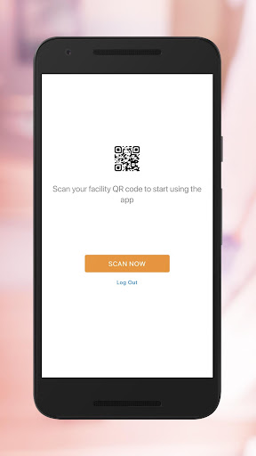
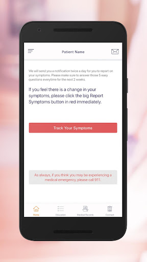
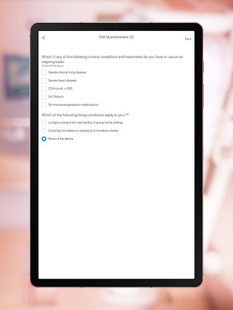
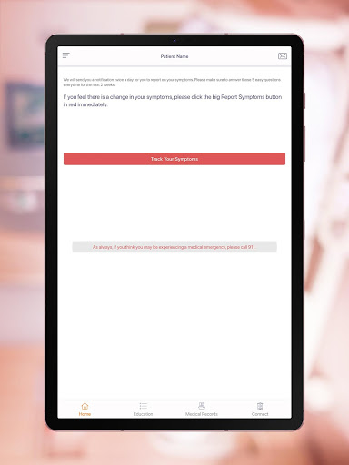
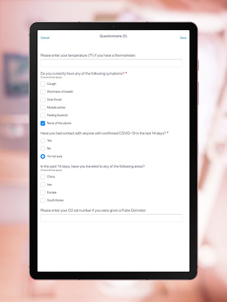

# CoronaCare
App version ``2.9.5``

Analyzed with [covid-apps-observer](http://github.com/covid-apps-observer) project, version ``0.1``

## App overview
| | |
|-------------------------|-------------------------| 
| **Name**&nbsp;&nbsp;&nbsp;&nbsp;&nbsp;&nbsp;&nbsp;&nbsp;&nbsp;&nbsp;&nbsp;&nbsp;&nbsp;&nbsp;&nbsp;&nbsp;&nbsp;&nbsp;&nbsp;&nbsp;&nbsp;&nbsp;&nbsp;&nbsp;&nbsp;&nbsp;&nbsp;&nbsp;&nbsp;&nbsp;&nbsp;&nbsp;&nbsp;&nbsp;&nbsp;&nbsp;&nbsp;&nbsp;&nbsp;&nbsp;  | CoronaCare |
| **Unique identifier** | com.paxerahealth.CoronaCare |
| **Link to Google Play** | [https://play.google.com/store/apps/details?id=com.paxerahealth.CoronaCare](https://play.google.com/store/apps/details?id=com.paxerahealth.CoronaCare) |
| **Summary**  | Corona virus symptoms tracking by healthcare providers and hospitals |
| **Privacy policy** | [https://carepassport.net/CPRN_Covid19/Privacy/Privacy_Policy-CoronaCare.html](https://carepassport.net/CPRN_Covid19/Privacy/Privacy_Policy-CoronaCare.html) |
| **Latest version** | 2.9.5 |
| **Last update** | 2021-03-25 14:51:54 |
| **Recent changes** | This version including fixes and enhancement and the new following features: - Allow Biointellisense devices to be detected and syncing the data whether the app in background or foreground. - Change the Fitness tab name to be Wearables. - Display data generated from Biointellisense devices in the Clinical tab. |
| **Installs**  | 10,000+ |
| **Category** | Health & Fitness |
| **First release** | Apr 2, 2020 |
| **Size**  | 85M |
| **Supported Android version**  | 7.0 and up |

### Description
> Corona Care is a platform designed to help healthcare providers, government and enterprise firms to track COVID-19 symptoms of potentially infected patients co-developed by some of the leading health systems like Mass General hospital and Harvard medical.
 This platform is directly utilized by patients that have been examined at a clinic or ER and need to be sent home, it includes a patient app to track if individuals have moved from low to high-risk groups , as well as to provide instructions and precautions for dealing with symptoms. 
 A provider portal enables providers to categorize patient cases by severity and mitigate risks of public spread by providing all patients with knowledge and resources to deal with low-risk symptoms at home, while also tracking the development of symptoms in higher-risk patients.
 This app allows to help patients to stay home if they are not high risk, but does not give health advice. If you need health advice please the CDC website at:
 https://www.cdc.gov/coronavirus/2019-nCoV/index.html
 No information will be used for any commercial purposes and all data are encrypted. 
 Features:
 - Mitigate risks of public spread by providing all patients with knowledge and resources to deal with low-risk symptoms at home.
 - Tracking the development of symptoms in higher-risk patients via customized surveys.
 - Providers can register patients by giving them a facility-specific QR code to scan and download the app.
 - Integrated with Fitbit, Withings, HealthKit, CCD, CDA, DICOM, HL7, FHIR and patient portals.
 - Mass enrollment module via text messaging for population registration invite.
 - Preliminary and followup surveys will be pushed to the patient via the app.
 - Patient survey results will appear in the provider portal (Command Center) and will be automatically color-coded by severity of case.
 - Surveys can be sent to targeted groups at specific frequencies via push notification, email, or text.
 - Provide instructions to patients on the app
 - Bidirectional instant message and video calls between providers and patient.
 - An AI-enabled chat-bot to help patients with questions more effectively

### User interface
The developers of the app provide the following screenshots in the Google play store.
| | | |
|:-------------------------:|:-------------------------:|:-------------------------:|
 |   |   |   | 
 |   |   |   | 
 |   |   |   | 

## Development team
In the following we report the main information provided by the development team in the Google play store.

| | |
|-------------------------|-------------------------|
| **Developer**  | CarePassport |
| **Website**  | [http://coronacare.io](http://coronacare.io) |
| **Email** | sales@carepassport.com |
| **Physical address**  | [300 Washington St. Newton, MA 02458](https://www.google.com/maps/search/300%20Washington%20St.%20Newton,%20MA%2002458) (Google Maps) |
| **Other developed apps**  | [https://play.google.com/store/apps/developer?id=CarePassport](https://play.google.com/store/apps/developer?id=CarePassport) |

## Android support

| | |
|-------------------------|-------------------------|
| **Declared target Android version**  | Android10, version 10 (API level 29) |
| **Effective target Android version**  | Android10, version 10 (API level 29) |
| **Minimum supported Android version**  | Nougat, version 7.0 (API level 24) |
| **Maximum target Android version**  | - |

The larger the difference between the minimum and maximum supported Android versions, the better. A larger difference means a wider audience. For example, old phones have a very low Android version, so a high minimum supported Android version means that the app cannot be used by users with old phones, thus leading to accessibility problems. 

## Requested permissions

In the following we report the complete list of the permissions requested by the app. 

| **Permission** | **Protection level** | **Description** | 
|-------------------------|-------------------------|-------------------------|
 **android.permission ACCESS_BACKGROUND_LOCATION** | :warning:**Dangerous** | Allows an app to access location in the background. 
 **android.permission ACCESS_COARSE_LOCATION** | :warning:**Dangerous** | Allows an app to access approximate location. 
 **android.permission ACCESS_FINE_LOCATION** | :warning:**Dangerous** | Allows an app to access precise location. 
 **android.permission ACCESS_NETWORK_STATE** | Normal | Allows applications to access information about networks. 
 **android.permission BIND_TELECOM_CONNECTION_SERVICE** | Signature - privileged | Must be required by a ConnectionService, to ensure that only the system can bind to it. 
 **android.permission BLUETOOTH** | Normal | Allows applications to connect to paired bluetooth devices. 
 **android.permission BLUETOOTH_ADMIN** | Normal | Allows applications to discover and pair bluetooth devices. 
 **android.permission BROADCAST_STICKY** | Normal | Allows an application to broadcast sticky intents. 
 **android.permission CALL_PHONE** | :warning:**Dangerous** | Allows an application to initiate a phone call without going through the Dialer user interface for the user to confirm the call. 
 **android.permission CAMERA** | :warning:**Dangerous** | Required to be able to access the camera device. 
 **android.permission FLASHLIGHT** | - | - 
 **android.permission FOREGROUND_SERVICE** | Normal | Allows a regular application to use Service.startForeground. 
 **android.permission GET_ACCOUNTS** | :warning:**Dangerous** | Allows access to the list of accounts in the Accounts Service. 
 **android.permission INTERNET** | Normal | Allows applications to open network sockets. 
 **android.permission MANAGE_OWN_CALLS** | Normal | Allows a calling application which manages it own calls through the self-managed ConnectionService APIs. 
 **android.permission MODIFY_AUDIO_SETTINGS** | Normal | Allows an application to modify global audio settings. 
 **android.permission READ_APP_BADGE** | - | - 
 **android.permission READ_CALENDAR** | :warning:**Dangerous** | Allows an application to read the user's calendar data. 
 **android.permission READ_CONTACTS** | :warning:**Dangerous** | Allows an application to read the user's contacts data. 
 **android.permission READ_EXTERNAL_STORAGE** | :warning:**Dangerous** | Allows an application to read from external storage. 
 **android.permission READ_PHONE_STATE** | :warning:**Dangerous** | Allows read only access to phone state, including the phone number of the device, current cellular network information, the status of any ongoing calls, and a list of any PhoneAccounts registered on the device. 
 **android.permission RECEIVE_BOOT_COMPLETED** | Normal | Allows an application to receive the Intent.ACTION_BOOT_COMPLETED that is broadcast after the system finishes booting. 
 **android.permission RECORD_AUDIO** | :warning:**Dangerous** | Allows an application to record audio. 
 **android.permission USE_BIOMETRIC** | Normal | Allows an app to use device supported biometric modalities. 
 **android.permission USE_FINGERPRINT** | Normal | This constant was deprecated in API level 28. Applications should request USE_BIOMETRIC instead 
 **android.permission VIBRATE** | Normal | Allows access to the vibrator. 
 **android.permission WAKE_LOCK** | Normal | Allows using PowerManager WakeLocks to keep processor from sleeping or screen from dimming. 
 **android.permission WRITE_CALENDAR** | :warning:**Dangerous** | Allows an application to write the user's calendar data. 
 **android.permission WRITE_CONTACTS** | :warning:**Dangerous** | Allows an application to write the user's contacts data. 
 **android.permission WRITE_EXTERNAL_STORAGE** | :warning:**Dangerous** | Allows an application to write to external storage. 
 **com.anddoes.launcher.permission UPDATE_COUNT** | - | - 
 **com.google.android.c2dm.permission RECEIVE** | - | - 
 **com.htc.launcher.permission READ_SETTINGS** | - | - 
 **com.htc.launcher.permission UPDATE_SHORTCUT** | - | - 
 **com.huawei.android.launcher.permission CHANGE_BADGE** | - | - 
 **com.huawei.android.launcher.permission READ_SETTINGS** | - | - 
 **com.huawei.android.launcher.permission WRITE_SETTINGS** | - | - 
 **com.majeur.launcher.permission UPDATE_BADGE** | - | - 
 **com.oppo.launcher.permission READ_SETTINGS** | - | - 
 **com.oppo.launcher.permission WRITE_SETTINGS** | - | - 
 **com.paxerahealth.CoronaCare.permission C2D_MESSAGE** | - | - 
 **com.sec.android.provider.badge.permission READ** | - | - 
 **com.sec.android.provider.badge.permission WRITE** | - | - 
 **com.sonyericsson.home.permission BROADCAST_BADGE** | - | - 
 **com.sonymobile.home.permission PROVIDER_INSERT_BADGE** | - | - 
 **me.everything.badger.permission BADGE_COUNT_READ** | - | - 
 **me.everything.badger.permission BADGE_COUNT_WRITE** | - | - 

## Mentioned servers

| **Server** | **Registrant** | **Registrant country** | **Creation date** | 
|-------------------------|-------------------------|-------------------------|-------------------------|
 | facebook.com | Facebook, Inc. | :us: US | 1997-03-29 05:00:00 |
 | google.com | Google LLC | :us: US | 1997-09-15 04:00:00 |
 | googlesyndication.com | Google LLC | :us: US | 2003-01-21 06:17:24 |
 | app-measurement.com | Google LLC | :us: US | 2015-06-19 20:13:31 |
 | appspot.com | Google LLC | :us: US | 2005-03-10 02:27:55 |
 | opentok.com | Domains By Proxy, LLC | :us: US | 2010-09-24 17:14:13 |
 | gstatic.com | Google LLC | :us: US | 2008-02-11 15:31:25 |
 | citymapper.com | REDACTED FOR PRIVACY | GB | 2004-04-08 18:56:04 |
 | here.com | HERE Global B.V. | :netherlands: NL | 1995-06-11 04:00:00 |
 | googleapis.com | Google LLC | :us: US | 2005-01-25 17:52:26 |
 | tokbox.com | Domains By Proxy, LLC | :us: US | 2002-04-26 08:13:23 |
 | whatsapp.com | WhatsApp LLC | :us: US | 2008-09-04 12:39:12 |
 | github.com | GitHub, Inc. | :us: US | 2007-10-09 18:20:50 |

## Security analysis 

Below we report the main security warnings raised by our execution of the [Androwarn](https://github.com/maaaaz/androwarn) security analysis tool.

**Telephony identifiers leakage**
> - This application reads the device phone type value 
> - This application reads the numeric name (MCC+MNC) of current registered operator 
> - This application reads the operator name 

**Connection interfaces exfiltration**
> - This application reads details about the currently active data network 
> - This application tries to find out if the currently active data network is metered 

**Telephony services abuse**
> - This application makes phone calls 

**Suspicious connection establishment**
> - This application opens a Socket and connects it to the remote address '' on the 'N/A' port  
> - This application opens a Socket and connects it to the remote address 'Ljava/lang/StringBuilder;->toString()Ljava/lang/String;' on the 'N/A' port  
> - This application opens a Socket and connects it to the remote address 'Ljava/net/Proxy;->type()Ljava/net/Proxy$Type;' on the 'N/A' port  
> - This application opens a Socket and connects it to the remote address 'timeout' on the 'N/A' port  

**Pim data leakage**
> - This application accesses the calendar 
> - This application accesses the downloads folder 
> - This application accesses data stored in the clipboard 

**Code execution**
> - This application loads a native library: 'jingle_peerconnection_so' 
> - This application loads a native library: 'opentok' 
> - This application executes a UNIX command 
> - This application executes a UNIX command containing this argument: 'Ljava/lang/StringBuilder;->toString()Ljava/lang/String;' 

## User ratings and reviews

Below we provide information about how end users are reacting to the app in terms of ratings and reviews in the Google Play store.

### Ratings

The CoronaCare app has been installed by more than **10000** times. At this time, **80** rated the app and its average score is **1.9**. Below we show the distribution of the ratings across the usual star-based rating of Google Play

:star::star::star::star::star:: 17

:star::star::star::star:: 1

:star::star::star:: 0

:star::star:: 1

:star:: 61

### Reviews 

#### 5-star reviews

No recent reviews available with 5 stars.

#### 4-star reviews

No recent reviews available with 4 stars.

#### 3-star reviews

No recent reviews available with 3 stars.

#### 2-star reviews

No recent reviews available with 2 stars.

#### 1-star reviews

> File under classified  :date: __2020-12-08 08:34:02__

