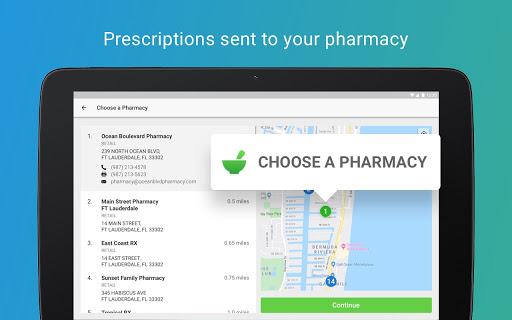

# KidzDocNow
App version ``12.0.19.010_02``

Analyzed with [covid-apps-observer](http://github.com/covid-apps-observer) project, version ``0.1``

## App overview
| | |
|-------------------------|-------------------------| 
| **Name**                                          | KidzDocNow |
| **Unique identifier** | com.pediatricassociates.android.papa.kidzdocnow |
| **Link to Google Play** | [https://play.google.com/store/apps/details?id=com.pediatricassociates.android.papa.kidzdocnow](https://play.google.com/store/apps/details?id=com.pediatricassociates.android.papa.kidzdocnow) |
| **Summary**  | See a Pediatric Associates pediatrician on your mobile device. |
| **Privacy policy** | [https://www.americanwell.com/privacy-policy/](https://www.americanwell.com/privacy-policy/) |
| **Latest version** | 12.0.19.010_02 |
| **Last update** | 2020-12-23 04:57:59 |
| **Recent changes** | We continue to improve the patient experience with these new features: • Performance enhancements to increase reliability and speed |
| **Installs**  | 10,000+ |
| **Category** | Medical |
| **First release** | May 22, 2017 |
| **Size**  | 52M |
| **Supported Android version**  | 5.0 and up |

### Description
> See a Pediatric Associates pediatrician on your mobile device. Physicians are board certified, with an average of 10-15 years in practice. Pediatric Associates KidzDocNow brings healthcare home, so that your child can feel better, faster.
 Have a question to ask a doctor? Get the care you need quickly - typical issues include:
 o Pink eye
 o Diaper Rash
 o Constipation
 o Diarrhea
 o Thrush
 o Head Lice
 o Newborn concerns
 o Lactation/feeding issues
 Depending on the issue at hand, the doctor can diagnose, suggest follow up, and prescribe medication, when appropriate.
 Pediatric Associates takes your privacy very seriously. Your visit with the doctor is secure and HIPAA compliant.

### User interface
The developers of the app provide the following screenshots in the Google play store.
| | | |
|:-------------------------:|:-------------------------:|:-------------------------:|
 |   |   |   | 
 |   |   |   | 
 |   |   |   | 
 |   |   |   | 

## Development team
In the following we report the main information provided by the development team in the Google play store.

| | |
|-------------------------|-------------------------|
| **Developer**  | Pediatric Associates |
| **Website**  | [https://www.pediatricassociates.com](https://www.pediatricassociates.com) |
| **Email** | sysadminnotify@pediatricassociates.com |
| **Physical address**  | - |
| **Other developed apps**  | [https://play.google.com/store/apps/developer?id=Pediatric+Associates](https://play.google.com/store/apps/developer?id=Pediatric+Associates) |

## Android support

| | |
|-------------------------|-------------------------|
| **Declared target Android version**  | Android10, version 10 (API level 29) |
| **Effective target Android version**  | Android10, version 10 (API level 29) |
| **Minimum supported Android version**  | Lollipop, version 5.0 (API level 21) |
| **Maximum target Android version**  | - |

The larger the difference between the minimum and maximum supported Android versions, the better. A larger difference means a wider audience. For example, old phones have a very low Android version, so a high minimum supported Android version means that the app cannot be used by users with old phones, thus leading to accessibility problems. 

## Requested permissions

In the following we report the complete list of the permissions requested by the app. 

| **Permission** | **Protection level** | **Description** | 
|-------------------------|-------------------------|-------------------------|
 **android.permission ACCESS_COARSE_LOCATION** | :warning:**Dangerous** | Allows an app to access approximate location. 
 **android.permission ACCESS_FINE_LOCATION** | :warning:**Dangerous** | Allows an app to access precise location. 
 **android.permission ACCESS_LOCATION_EXTRA_COMMANDS** | Normal | Allows an application to access extra location provider commands. 
 **android.permission ACCESS_NETWORK_STATE** | Normal | Allows applications to access information about networks. 
 **android.permission ACCESS_WIFI_STATE** | Normal | Allows applications to access information about Wi-Fi networks. 
 **android.permission BLUETOOTH** | Normal | Allows applications to connect to paired bluetooth devices. 
 **android.permission BROADCAST_STICKY** | Normal | Allows an application to broadcast sticky intents. 
 **android.permission CAMERA** | :warning:**Dangerous** | Required to be able to access the camera device. 
 **android.permission GET_TASKS** | Deprecated | This constant was deprecated in API level 21. No longer enforced. 
 **android.permission INTERNET** | Normal | Allows applications to open network sockets. 
 **android.permission MODIFY_AUDIO_SETTINGS** | Normal | Allows an application to modify global audio settings. 
 **android.permission READ_EXTERNAL_STORAGE** | :warning:**Dangerous** | Allows an application to read from external storage. 
 **android.permission READ_PHONE_STATE** | :warning:**Dangerous** | Allows read only access to phone state, including the phone number of the device, current cellular network information, the status of any ongoing calls, and a list of any PhoneAccounts registered on the device. 
 **android.permission RECEIVE_BOOT_COMPLETED** | Normal | Allows an application to receive the Intent.ACTION_BOOT_COMPLETED that is broadcast after the system finishes booting. 
 **android.permission RECORD_AUDIO** | :warning:**Dangerous** | Allows an application to record audio. 
 **android.permission REORDER_TASKS** | Normal | Allows an application to change the Z-order of tasks. 
 **android.permission SYSTEM_ALERT_WINDOW** | Signature - preinstalled - appop - pre23 - development | Allows an app to create windows using the type WindowManager.LayoutParams.TYPE_APPLICATION_OVERLAY, shown on top of all other apps. 
 **android.permission USE_BIOMETRIC** | Normal | Allows an app to use device supported biometric modalities. 
 **android.permission USE_FINGERPRINT** | Normal | This constant was deprecated in API level 28. Applications should request USE_BIOMETRIC instead 
 **android.permission VIBRATE** | Normal | Allows access to the vibrator. 
 **android.permission WAKE_LOCK** | Normal | Allows using PowerManager WakeLocks to keep processor from sleeping or screen from dimming. 
 **android.permission WRITE_EXTERNAL_STORAGE** | :warning:**Dangerous** | Allows an application to write to external storage. 
 **com.facebook.katana.provider ACCESS** | - | - 
 **com.google.android.c2dm.permission RECEIVE** | - | - 
 **com.google.android.finsky.permission BIND_GET_INSTALL_REFERRER_SERVICE** | - | - 
 **com.pediatricassociates.android.papa.kidzdocnow.permission C2D_MESSAGE** | - | - 

## Mentioned servers

| **Server** | **Registrant** | **Registrant country** | **Creation date** | 
|-------------------------|-------------------------|-------------------------|-------------------------|
 | amwell.com | American Well Corporation | :us: US | 2004-02-13 19:02:32 |
 | facebook.com | Facebook, Inc. | :us: US | 1997-03-29 05:00:00 |
 | doubleclick.net | Google Inc. | :us: US | 1996-01-16 05:00:00 |
 | googleadservices.com | Google LLC | :us: US | 2003-06-19 16:34:53 |
 | google.com | Google LLC | :us: US | 1997-09-15 04:00:00 |
 | googlesyndication.com | Google LLC | :us: US | 2003-01-21 06:17:24 |
 | google-analytics.com | Google LLC | :us: US | 2005-07-18 19:24:32 |
 | app-measurement.com | Google LLC | :us: US | 2015-06-19 20:13:31 |
 | appboy.com | Braze, Inc. | :us: US | 2008-10-06 23:28:32 |
 | braze.com | Braze, Inc. | :us: US | 2000-01-19 02:18:28 |
 | optimizely.com | Optimizely | :us: US | 2010-01-11 03:01:32 |
 | twitter.com | Twitter, Inc. | :us: US | 2000-01-21 16:28:17 |
 | branch.io | Branch | :us: US | 2011-11-10 13:52:13 |
 | gstatic.com | Google LLC | :us: US | 2008-02-11 15:31:25 |
 | crashlytics.com | Google LLC | :us: US | 2011-01-21 15:30:40 |
 | bnc.lt | - | - | 2016-11-14 00:00:00 |
 | ggpht.com | Google LLC | :us: US | 2008-01-16 18:55:33 |

## Security analysis 

Below we report the main security warnings raised by our execution of the [Androwarn](https://github.com/maaaaz/androwarn) security analysis tool.

**Telephony identifiers leakage**
> - This application reads the ISO country code equivalent for the SIM provider's country code 
> - This application reads the ISO country code equivalent of the current registered operator's MCC (Mobile Country Code) 
> - This application reads the MCC+MNC of the provider of the SIM 
> - This application reads the device phone type value 
> - This application reads the numeric name (MCC+MNC) of current registered operator 
> - This application reads the operator name 
> - This application reads the phone's current state 
> - This application reads the radio technology (network type) currently in use on the device for data transmission 

**Connection interfaces exfiltration**
> - This application reads details about the currently active data network 
> - This application tries to find out if the currently active data network is metered 

**Telephony services abuse**
> - This application makes phone calls 

**Audio video eavesdropping**
> - This application captures video from the 'CAMERA' source 

**Suspicious connection establishment**
> - This application opens a Socket and connects it to the remote address ' returned no addresses for  ; port is out of range' on the 'N/A' port  
> - This application opens a Socket and connects it to the remote address '' on the 'N/A' port  
> - This application opens a Socket and connects it to the remote address 'Ljava/net/Proxy;->type()Ljava/net/Proxy$Type;' on the 'N/A' port  
> - This application opens a Socket and connects it to the remote address 'timeout' on the 'N/A' port  

**Code execution**
> - This application loads a native library 
> - This application executes a UNIX command containing this argument: '2' 

## User ratings and reviews

Below we provide information about how end users are reacting to the app in terms of ratings and reviews in the Google Play store.

### Ratings

The KidzDocNow app has been installed by more than **10000** times. At this time, **1325** rated the app and its average score is **4.931818**. Below we show the distribution of the ratings across the usual star-based rating of Google Play

:star::star::star::star::star:: 1255

:star::star::star::star:: 60

:star::star::star:: 0

:star::star:: 10

:star:: 0

### Reviews 

#### 5-star reviews

> Love this app!  :date: __2021-02-18 18:37:43__

> Very professional, guidance on what to do, I am thankful for this app. Thank you for the professionalism and the app worked well.  :date: __2021-02-01 16:31:13__

> The Doctor was very nice and knowledgable!  :date: __2021-01-28 16:13:55__

> Easy to navigate, worked flawlessly.  :date: __2021-01-28 00:43:13__

> Very convenient! My little girl didn't want to get out of bed and I didn't want to bring my son with me. You got to stay right at home and still got a doctor's visit. Love it.  :date: __2021-01-26 17:03:43__

> Awesome!  :date: __2021-01-25 18:18:30__

> Great service and fast  :date: __2021-01-23 14:35:47__

> Reassuring to know that you can have an app that works well  :date: __2021-01-22 14:48:50__

> Quick service. Easy to use  :date: __2021-01-21 15:01:04__

> Fenomenal! I love I was able to discuss all my questions without having to leave the house.  :date: __2021-01-21 00:34:15__

#### 4-star reviews

> Convenient and u ser-friendly.  :date: __2020-11-03 08:41:15__

> Provider was informative and attentive. Wait time was better than office visit wait time.  :date: __2020-10-10 18:08:42__

> Easy interface, worked well  :date: __2020-08-19 22:06:36__

> Visually I can see the doctor very clear and audio was great as well. Overall great experience. Just wasn't sure about switching of the doctors last minute.  :date: __2020-07-09 04:10:27__

> Would've given a higher rating if not for waiting on a doc 10 mins then canceling and choosing another one who marked herself as unavailable while i was entering my info and then finally getting a 3rd one. It was smooth sailing from there.  :date: __2020-07-02 21:32:57__

> Super easy but make sure you and your provider have a solid wifi connection. We had some video issues which did thankfully resolve before completion of the call.  :date: __2020-06-08 13:28:26__

> The app works well. I do feel the camera capabilities could be better. I could not focus the image even though I know my phone is capable of doing so.  :date: __2020-04-07 13:46:28__

> Have used this app 3 times already and really like the convenience of telemedicine. One thing I would suggest to the App developers is if they could make this app work on top of other apps for multitasking. Then I would rate 5 stars.  :date: __2020-03-12 13:37:10__

> Very convenient  :date: __2020-03-12 03:57:53__

> I coudnt see the doctor but he could see us. Still a good experience and fast service  :date: __2020-01-23 00:28:13__

#### 3-star reviews

> The app was ok but I could not see the doctor face and the screen to show me was very small  :date: __2019-12-18 18:37:43__

> Excellent  :date: __2019-11-20 14:34:47__

> l was not able to see the doctor at all, but she was able to see me.  :date: __2019-02-08 16:44:58__

> Needs a lot of improvements. I'll rate it again later on but right now needs work. It has a mayor issue with the login screen where the mask it use to hide the remembered email results in a wrong email or password message if you don't delete and write everything. It becomes a hassle specially when you're in a hurry because the appointment is about to begin and you have to upload pictures and everything. Please check the login experience there is better technologies available right now.  :date: __2019-01-04 19:05:55__

> Lots of issues with internet connection even with personal Wi-Fi  :date: __2018-07-04 03:14:13__

#### 2-star reviews

> Clinicians need to wear headsets to avoid feedback during calls. Took two hours to troubleshoot issues and I'm a Healthcare IT security analyst. App does not sync with patient portal / EMR natively which caused part of problem. Other problem is that for most Google users, the email coming from domain will go into spam. Pediatric Associates need to go with a full-fledged telehealth solution instead of this fly by night, TytoCare (AmWell) app.  :date: __2021-02-18 01:14:23__

> Horrible  :date: __2020-12-31 15:25:18__

> Waited in line for an hour. Was next for a doctor and had the connecting circle go round and round, but never connected. Eventually the doctor disconnected. He did call to apologise and explain it was not connecting, but ultimately it did not work.  :date: __2020-03-16 15:49:37__

#### 1-star reviews

> Doesn't connect. Horrible tech support  :date: __2020-06-24 23:08:49__

> My doctor was Test Provider? Shouldn't be test data in an app, it's bad practice.  :date: __2020-04-22 22:41:45__

> Not downloading child has an appointment but app want download 😠  :date: __2020-04-03 20:54:25__

> I was waiting for over an hour even with an appointment, on top of that I was never able to speak with anyone. I tried to cancel my appointment and couldn't do that because there was an error with the app. Overall it was a bad experience and i have a sick child with no one to talk to.  :date: __2020-03-23 17:04:39__

> Not one doctor or nurse is available.  :date: __2020-03-22 14:14:06__

> Terrible. I have been in the waiting room for over an hour even though i had an app. A nurse assistant ask me a couple questions and then the nurse never talked to me and then I was just transferred to another dr. And I'm here still waiting. Bs  :date: __2020-02-07 05:32:04__

> I rather physically take my children to the doctors office  :date: __2020-01-18 18:50:57__

> The app is a great idea, but they do charge you for talking to the doctor most of them dont even know alot and for that i can take the time and go to the clinic  :date: __2019-11-13 07:59:07__

> Overpriced. Classist. Our doctor's office plugs them. I downloaded the app and immediately deleted it when I saw there's a $59 copay even with insurance! Ridiculous.  :date: __2019-11-09 00:23:06__

> I would much rather go in office.  :date: __2019-10-06 17:26:45__

