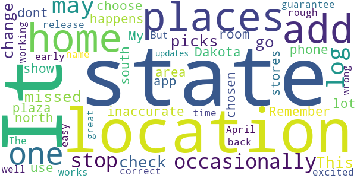

# Care19 Diary
App version ``3.1``

Analyzed with [covid-apps-observer](http://github.com/covid-apps-observer) project, version ``0.1``

## App overview
| | |
|-------------------------|-------------------------| 
| **Name**&nbsp;&nbsp;&nbsp;&nbsp;&nbsp;&nbsp;&nbsp;&nbsp;&nbsp;&nbsp;&nbsp;&nbsp;&nbsp;&nbsp;&nbsp;&nbsp;&nbsp;&nbsp;&nbsp;&nbsp;&nbsp;&nbsp;&nbsp;&nbsp;&nbsp;&nbsp;&nbsp;&nbsp;&nbsp;&nbsp;&nbsp;&nbsp;&nbsp;&nbsp;&nbsp;&nbsp;&nbsp;&nbsp;&nbsp;&nbsp;  | Care19 Diary |
| **Unique identifier** | com.proudcrowd.care |
| **Link to Google Play** | [https://play.google.com/store/apps/details?id=com.proudcrowd.care](https://play.google.com/store/apps/details?id=com.proudcrowd.care) |
| **Summary**  | You can help stop the spread of Covid-19 |
| **Privacy policy** | [https://care19.app/privacy](https://care19.app/privacy) |
| **Latest version** | 3.1 |
| **Last update** | 2020-06-26 17:01:47 |
| **Recent changes** | Fix a bug where manually added visits could display a month off. |
| **Installs**  | 10,000+ |
| **Category** | Medical |
| **First release** | Apr 19, 2020 |
| **Size**  | 5.5M |
| **Supported Android version**  | 6.0 and up |

### Description
> Care19 is the official COVID-19 app for the states of South Dakota and North Dakota.  It can be used with reduced functionality in other US states.
 A key part of the contact tracing process is remembering where you have been over the last 5-10 days before testing positive.  This helps contact tracers determine people you may have been near while you were infectious. 
 Care19 is a digital diary that records places you visit.  Many of the places you visit can be recorded automatically by Care19 using the phone's location services.  In some cases you may need to manually add an entry if the automated routines miss a place visit.  This can happen based on a variety of environmental factors.
 You will not be asked to provide any personally identifiable information within the app. Location data will only be shared with the North Dakota or South Dakota Department of Health if you consent upon testing positive for COVID-19. This is done by sharing a code number displayed on the “About” section of the app.  
 If you use the Care19 app outside of North and South Dakota it can be used as a memory aide if you test positive and are contacted by your state's Department of Health.

### User interface
The developers of the app provide the following screenshots in the Google play store.
| | | |
|:-------------------------:|:-------------------------:|:-------------------------:|
 |   |   |   | 
 |  

## Development team
In the following we report the main information provided by the development team in the Google play store.

| | |
|-------------------------|-------------------------|
| **Developer**  | ProudCrowd, LLC |
| **Website**  | [https://www.care19.app](https://www.care19.app) |
| **Email** | tim.brookins@proudcrowd.com |
| **Physical address**  | - |
| **Other developed apps**  | [https://play.google.com/store/apps/developer?id=ProudCrowd,+LLC](https://play.google.com/store/apps/developer?id=ProudCrowd,+LLC) |

## Android support

| | |
|-------------------------|-------------------------|
| **Declared target Android version**  | Android10, version 10 (API level 29) |
| **Effective target Android version**  | Android10, version 10 (API level 29) |
| **Minimum supported Android version**  | Marshmallow, version 6.0 (API level 23) |
| **Maximum target Android version**  | - |

The larger the difference between the minimum and maximum supported Android versions, the better. A larger difference means a wider audience. For example, old phones have a very low Android version, so a high minimum supported Android version means that the app cannot be used by users with old phones, thus leading to accessibility problems. 

## Requested permissions

In the following we report the complete list of the permissions requested by the app. 

| **Permission** | **Protection level** | **Description** | 
|-------------------------|-------------------------|-------------------------|
 **android.permission ACCESS_BACKGROUND_LOCATION** | :warning:**Dangerous** | Allows an app to access location in the background. 
 **android.permission ACCESS_COARSE_LOCATION** | :warning:**Dangerous** | Allows an app to access approximate location. 
 **android.permission ACCESS_FINE_LOCATION** | :warning:**Dangerous** | Allows an app to access precise location. 
 **android.permission ACCESS_NETWORK_STATE** | Normal | Allows applications to access information about networks. 
 **android.permission ACTIVITY_RECOGNITION** | :warning:**Dangerous** | Allows an application to recognize physical activity. 
 **android.permission FOREGROUND_SERVICE** | Normal | Allows a regular application to use Service.startForeground. 
 **android.permission INTERNET** | Normal | Allows applications to open network sockets. 
 **android.permission RECEIVE_BOOT_COMPLETED** | Normal | Allows an application to receive the Intent.ACTION_BOOT_COMPLETED that is broadcast after the system finishes booting. 
 **android.permission WAKE_LOCK** | Normal | Allows using PowerManager WakeLocks to keep processor from sleeping or screen from dimming. 
 **com.google.android.c2dm.permission RECEIVE** | - | - 
 **com.google.android.finsky.permission BIND_GET_INSTALL_REFERRER_SERVICE** | - | - 
 **com.google.android.gms.permission ACTIVITY_RECOGNITION** | - | - 

## Mentioned servers

| **Server** | **Registrant** | **Registrant country** | **Creation date** | 
|-------------------------|-------------------------|-------------------------|-------------------------|
 | bugfender.com | Beenario GmbH | :de: DE | 2014-10-28 11:32:13 |
 | googlesyndication.com | Google LLC | :us: US | 2003-01-21 06:17:24 |
 | google.com | Google LLC | :us: US | 1997-09-15 04:00:00 |
 | app-measurement.com | Google LLC | :us: US | 2015-06-19 20:13:31 |
 | azurewebsites.net | Microsoft Corporation | :us: US | 2012-01-24 18:43:51 |
 | crashlytics.com | Google LLC | :us: US | 2011-01-21 15:30:40 |
 | googleapis.com | Google LLC | :us: US | 2005-01-25 17:52:26 |
 | googleadservices.com | Google LLC | :us: US | 2003-06-19 16:34:53 |

## Security analysis 

Below we report the main security warnings raised by our execution of the [Androwarn](https://github.com/maaaaz/androwarn) security analysis tool.

**Telephony identifiers leakage**
> - This application reads the MCC+MNC of the provider of the SIM 
> - This application reads the Service Provider Name (SPN) 
> - This application reads the numeric name (MCC+MNC) of current registered operator 
> - This application reads the operator name 

**Connection interfaces exfiltration**
> - This application reads details about the currently active data network 
> - This application tries to find out if the currently active data network is metered 

**Suspicious connection establishment**
> - This application opens a Socket and connects it to the remote address ' returned no addresses for  ; port is out of range' on the 'N/A' port  
> - This application opens a Socket and connects it to the remote address '' on the 'N/A' port  
> - This application opens a Socket and connects it to the remote address 'Ljava/lang/StringBuilder;->toString()Ljava/lang/String;' on the 'N/A' port  
> - This application opens a Socket and connects it to the remote address 'Ljava/net/Proxy;->type()Ljava/net/Proxy$Type;' on the 'N/A' port  
> - This application opens a Socket and connects it to the remote address 'timeout' on the 'N/A' port  

**Code execution**
> - This application executes a UNIX command containing this argument: 'logcat -c 2' 
> - This application executes a UNIX command containing this argument: 'logcat -c' 

## User ratings and reviews

Below we provide information about how end users are reacting to the app in terms of ratings and reviews in the Google Play store.

### Ratings

The Care19 Diary app has been installed by more than **10000** times. At this time, **194** rated the app and its average score is **2.55**. Below we show the distribution of the ratings across the usual star-based rating of Google Play

:star::star::star::star::star:: 58

:star::star::star::star:: 5

:star::star::star:: 13

:star::star:: 23

:star:: 93

### Reviews 

#### 5-star reviews

> Oh yeah all good  :date: __2020-08-27 06:36:26__

> Good  :date: __2020-08-02 22:27:07__

> Please help charlie foxtrot googlemaps Meunstergritsandassociatesllc 442 blanding blvd 333 ORANGEPARK,FL 32073  :date: __2020-07-18 21:29:25__

> Updated daily. Easy to use and informative.  :date: __2020-06-23 15:03:08__

> Cool  :date: __2020-06-20 05:50:45__

> Good idea  :date: __2020-06-20 00:01:28__

> Good  :date: __2020-06-16 20:33:40__

> Nudes help  :date: __2020-06-11 01:24:14__

> Awesome  :date: __2020-05-17 11:47:26__

> Love this app  :date: __2020-05-16 12:11:08__

#### 4-star reviews

> This picks up most of the places I go, and I check when I get home so I can add places it has missed or change inaccurate locations, which only happens when I am in an area with a lot of stores, like a plaza. My home state has not chosen an app so I use this one.  :date: __2020-07-10 22:03:28__

> I just dont have room on my phone:(  :date: __2020-07-06 11:55:41__

> Remember this is for north & south Dakota only.. other states will may add their state if they choose too. It will show other states but will not guarantee it at this time  :date: __2020-06-20 21:46:43__

> The early release back in April was rough (didn't log any stops for me). But it's been working well for me since about May 4. It occasionally logs more than one stop at the same location. It occasionally gets the name of the location wrong, but this is very easy to correct.  :date: __2020-05-19 06:25:30__

> It is great, it works, and I am excited for updates!  :date: __2020-04-29 03:31:46__

#### 3-star reviews

> How long do the places you visit stay on the app? Mine seem to show maybe only previous 10 days.  :date: __2020-08-13 23:41:30__

> It had gotten better at tracking my locations but since the last update it stopped all tracking.  :date: __2020-06-25 01:46:44__

> Doesn't this app use the Contact Tracking System that Apple and Google developed?  :date: __2020-06-02 15:29:17__

> Simple app. Does what it was designed for but little else. Misses many locations and frequently has location accuracy issues. Routinely misses my home by 6 blocks. Says I have visited locations I have just driven past. Would be nice to have ability to add locations that I visited but app failed to record.  :date: __2020-05-22 15:52:32__

> Still isn't capturing places I've been. Was at 3 different locations today, and not one of them showing up.  :date: __2020-05-20 23:03:13__

> Very inconsistent with location. Can be at a location for hours and doesn't list it.  :date: __2020-05-16 15:20:52__

> It's a great idea, but does not log most of the places I've been. Stopped at 6 places in Bismarck and didn't log one place. And then the next time it will log the same place 4 times within a few minutes or log a place I only drove by.  :date: __2020-05-14 02:20:12__

> I hope this helps people but there are definitely a lot of bugs  :date: __2020-05-04 05:28:59__

#### 2-star reviews

> Doesn't catch all locations, and it recorded a one hour visit to one store as 12 minutes, then would not allow correction.  :date: __2020-09-21 13:10:23__

> Quit recording anything after about three weeks.  :date: __2020-07-26 05:30:54__

> Inaccurate didn't track me for days sometimes. Uninstalled it, that bad.  :date: __2020-07-19 03:31:36__

> Location info is incorrect and incomplete. I was able to fix the incorrect info, but can't add locations. Uninstalled and reinstalled on 6/24. Tracked my location until 6/27 then nothing.  :date: __2020-07-07 17:28:05__

> Gives a lot of erroneous locations that are passed while driving or stopping at a stop light. Some days it gives no information at all.. i reloaded it a couple of weeks ago. It worked well until July 3 then quit working, not registering any locations.  :date: __2020-07-04 20:23:07__

> Idk procedure to get my phone to let this work automatically in the background, out on the east coast  :date: __2020-07-02 20:56:10__

> It's not all that  :date: __2020-06-18 15:59:46__

> Not very accurate for locations. It does not show several places my wife & I have been for an hour or more and it shows us stopping at places we only drove passed on our way to our destination that does not show up. Very inaccurate. It's the same on both of our phones (Galaxy Note 9's). There is no way to add the places we did go to, only to delete the irrelevant ones or change the name from "Unknown" to a proper name. It's pointless/useless for tracking when this inaccurate.  :date: __2020-06-05 01:20:41__

> I have a samsung android phone and I used the app Tacoma 19 South Dakota app from Google Play. I have installed it and reinstalled it this install that reinstalled it and updated it every time. I have yet to see anything on my page of anywhere that I've been tracked it just keeps saying congratulations you are set up but doesn't detect that you win any places yet. I don't go very often but I have went to stores and I have spent more than 10 minutes there why can't I see where I have been?  :date: __2020-06-01 23:56:11__

> I wish this used the exposure API rather than log GPS coordinates. As I understand, the exposure API is just a log of device identifiers of other nearby phones, stored locally, rotated every 2 weeks. Your phone then simply downloads identifiers of any recent positives in your area and alerts you if they match any your phone has been near. That's very minimal impact on me and a health organization. For me, you don't know that I went to the eye doctor on Tuesday. For you: the health dept doesn't then have to go around in hazmat suits trying to play investigator - nor posting some public notice "HAVE YOU SEEN THIS WOMAN AT THE EYE DOCTOR ON TUESDAY? IF SO, YOU MAY BE INFECTED." One is a little more subtle message, cleans up after itself, puts the burden of response to the user, likely more reliable against device power savings features, and more battery friendly where a GPS/cell tower solution is more invasive, doesn't really capture proximity to another device, probably gets affected by device power savings features, elicits more work and exposes too much to a 3rd party. I'd just scrap this one and make an open source solution using the exposure API.  :date: __2020-05-26 20:08:29__

#### 1-star reviews

> Has me consistently at a location across town I'm never at.  :date: __2020-09-12 07:14:54__

> Privacy  :date: __2020-08-27 22:42:43__

> Does not automatically track as it says it will. Also, I can enter manually in my phone but my wife's phone cannot manually input as the app freezes when she puts in date from calendar. Uninstalled and reinstalled the app but still have same problems.  :date: __2020-08-16 17:20:12__

> utTý5hat's drive changes b  :date: __2020-08-14 22:35:18__

> Edit: 8.10.20 Still same problems. If battery saver is issue, fix it. Update 6.27.20 - Tou can tell the developer(s) doesnt even use this app or they would know what we are talking about. You say it's just the way it is, no, you know how it's supposed to work, so find someone to make it work correctly. This app does not trace where I been going. It does not stay open in the background. When open, it does not show where I go or been since the 23rd. I restarted phone and reinstalled app on S9+  :date: __2020-08-11 03:56:40__

> Uninstall. I didn't put it in  :date: __2020-08-04 19:20:34__

> Doesn't do anything that Google Maps My Timeline can't do better. Maybe in a state with a competent health department it could. As I understand it in incompetent SC, it won't even do Bluetooth ID exchanges with other devices for contact tracing.  :date: __2020-07-30 01:57:38__

> I am unable to add places I have been. Every time I try the app crashes. And the visits don't show up when they should. I have tried uninstalling and reinstalling more than once. This app is a lemon.  :date: __2020-07-26 21:59:16__

> App doesn't work. I wanted an app that would track my location automatically and the people that I was around. Now that I have covid-19 I can't even notify anyone that I was in contact with  :date: __2020-07-17 19:43:16__

> Does this app work for Los Angeles, CA residents? It doesn’t seem to work when installed on my phone because I’m still unable to turn on “Exposure Notifications” after the app is installed. I’m going to Settings > Google > COVID-19 Exposure Notifications and the toggle to turn on Exposure Notifications will not respond.  :date: __2020-07-06 03:44:17__

