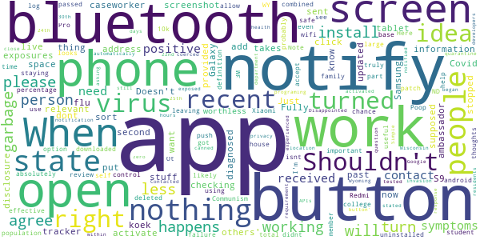

# Care19 Alert
App version ``1.1``

Analyzed with [covid-apps-observer](http://github.com/covid-apps-observer) project, version ``0.1``

## App overview
| | |
|-------------------------|-------------------------| 
| **Name**                                          | Care19 Alert |
| **Unique identifier** | com.proudcrowd.exposure |
| **Link to Google Play** | [https://play.google.com/store/apps/details?id=com.proudcrowd.exposure](https://play.google.com/store/apps/details?id=com.proudcrowd.exposure) |
| **Summary**  | Care19 Alert is the official COVID-19 exposure notification app for ND and WY. |
| **Privacy policy** | [https://www.care19.app/alert/privacy](https://www.care19.app/alert/privacy) |
| **Latest version** | 1.1 |
| **Last update** | 2020-09-17 02:44:19 |
| **Recent changes** | Routine monthly bug fixes |
| **Installs**  | 5,000+ |
| **Category** | Medical |
| **First release** | Aug 12, 2020 |
| **Size**  | 7.2M |
| **Supported Android version**  | 6.0 and up |

### Description
> Care19 Alert is the official COVID-19 exposure notification app for North Dakota and Wyoming as authorized by each states Department of Health. 
 Care19 Alert allows you to receive notifications if you have been near someone who has tested positive for Covid-19 recently.  Care19 Alert uses Apple’s Exposure Notification API to help reduce the spread of the coronavirus, with user privacy and security central to its design. 
 Care19 Alert maintains your privacy while securely communicating with nearby iOS and Android devices that also have exposure notifications enabled. This happens through the exchange of random keys that change every 15 minutes. These keys are stored securely on your device and hidden from the Care19 Alert application. All keys remain on your device and are not accessible unless you have tested positive for COVID-19, been contacted and verified by the Department of Health, and consent to sharing the random keys with others.
 Care19 Alert allows you to notify others if you test positive for COVID-19 and it will notify you if someone you came in contact tested positive for COVID-19. With your permission, your key/date pairs will be securely uploaded to the National Key Server run by the Association of Public Health Laboratories.  All uploaded key/date pairs are distributed to all of the devices connected to the National Key Server. 
  
 The downloaded keys are matched by the operating system based on criteria established by each Department of Health, and if you have a match you will be notified of the exposure and provided by your department of Health with the set of actions to take provided.

### User interface
The developers of the app provide the following screenshots in the Google play store.
| | | |
|:-------------------------:|:-------------------------:|:-------------------------:|
 |   |   |   | 

## Development team
In the following we report the main information provided by the development team in the Google play store.

| | |
|-------------------------|-------------------------|
| **Developer**  | ProudCrowd, LLC |
| **Website**  | [https://www.care19.app](https://www.care19.app) |
| **Email** | tim@brookinsfamily.net |
| **Physical address**  | - |
| **Other developed apps**  | [https://play.google.com/store/apps/developer?id=ProudCrowd,+LLC](https://play.google.com/store/apps/developer?id=ProudCrowd,+LLC) |

## Android support

| | |
|-------------------------|-------------------------|
| **Declared target Android version**  | Android10, version 10 (API level 29) |
| **Effective target Android version**  | Android10, version 10 (API level 29) |
| **Minimum supported Android version**  | Marshmallow, version 6.0 (API level 23) |
| **Maximum target Android version**  | - |

The larger the difference between the minimum and maximum supported Android versions, the better. A larger difference means a wider audience. For example, old phones have a very low Android version, so a high minimum supported Android version means that the app cannot be used by users with old phones, thus leading to accessibility problems. 

## Requested permissions

In the following we report the complete list of the permissions requested by the app. 

| **Permission** | **Protection level** | **Description** | 
|-------------------------|-------------------------|-------------------------|
 **android.permission ACCESS_NETWORK_STATE** | Normal | Allows applications to access information about networks. 
 **android.permission BLUETOOTH** | Normal | Allows applications to connect to paired bluetooth devices. 
 **android.permission FOREGROUND_SERVICE** | Normal | Allows a regular application to use Service.startForeground. 
 **android.permission INTERNET** | Normal | Allows applications to open network sockets. 
 **android.permission RECEIVE_BOOT_COMPLETED** | Normal | Allows an application to receive the Intent.ACTION_BOOT_COMPLETED that is broadcast after the system finishes booting. 
 **android.permission WAKE_LOCK** | Normal | Allows using PowerManager WakeLocks to keep processor from sleeping or screen from dimming. 
 **com.google.android.c2dm.permission RECEIVE** | - | - 
 **com.google.android.finsky.permission BIND_GET_INSTALL_REFERRER_SERVICE** | - | - 

## Mentioned servers

| **Server** | **Registrant** | **Registrant country** | **Creation date** | 
|-------------------------|-------------------------|-------------------------|-------------------------|
 | bugfender.com | Beenario GmbH | :de: DE | 2014-10-28 11:32:13 |
 | googlesyndication.com | Google LLC | :us: US | 2003-01-21 06:17:24 |
 | google.com | Google LLC | :us: US | 1997-09-15 04:00:00 |
 | app-measurement.com | Google LLC | :us: US | 2015-06-19 20:13:31 |
 | googleapis.com | Google LLC | :us: US | 2005-01-25 17:52:26 |
 | googleadservices.com | Google LLC | :us: US | 2003-06-19 16:34:53 |
 | googleapis.com | Google LLC | :us: US | 2005-01-25 17:52:26 |
 | crashlytics.com | Google LLC | :us: US | 2011-01-21 15:30:40 |

## Security analysis 

Below we report the main security warnings raised by our execution of the [Androwarn](https://github.com/maaaaz/androwarn) security analysis tool.

**Telephony identifiers leakage**
> - This application reads the MCC+MNC of the provider of the SIM 
> - This application reads the Service Provider Name (SPN) 
> - This application reads the numeric name (MCC+MNC) of current registered operator 
> - This application reads the operator name 

**Connection interfaces exfiltration**
> - This application reads details about the currently active data network 
> - This application tries to find out if the currently active data network is metered 

**Suspicious connection establishment**
> - This application opens a Socket and connects it to the remote address ' returned no addresses for  ; port is out of range' on the 'N/A' port  
> - This application opens a Socket and connects it to the remote address '' on the 'N/A' port  
> - This application opens a Socket and connects it to the remote address 'Ljava/lang/StringBuilder;->toString()Ljava/lang/String;' on the 'N/A' port  
> - This application opens a Socket and connects it to the remote address 'Ljava/net/Proxy;->type()Ljava/net/Proxy$Type;' on the 'N/A' port  
> - This application opens a Socket and connects it to the remote address 'timeout' on the 'N/A' port  

**Code execution**
> - This application executes a UNIX command 
> - This application executes a UNIX command containing this argument: 'logcat -c 2' 
> - This application executes a UNIX command containing this argument: 'logcat -c' 

## User ratings and reviews

Below we provide information about how end users are reacting to the app in terms of ratings and reviews in the Google Play store.

### Ratings

The Care19 Alert app has been installed by more than **5000** times. At this time, **25** rated the app and its average score is **3.52**. Below we show the distribution of the ratings across the usual star-based rating of Google Play

:star::star::star::star::star:: 13

:star::star::star::star:: 3

:star::star::star:: 1

:star::star:: 0

:star:: 8

### Reviews 

#### 5-star reviews

> Works great  :date: __2020-11-07 23:36:18__

> Not really sure how often it does a check but from what I see from the pictures it's suppose to check 2 hours or so and I will go hours between checks kind of disappointed in the app not going to know if I have been exposed if it don't check when it is suppose to  :date: __2020-11-03 20:26:41__

> I love the app because I love it  :date: __2020-10-29 18:17:07__

> Absolutely love it  :date: __2020-10-25 07:09:59__

> Help  :date: __2020-09-15 03:29:55__

> This app was no good it gave me covid  :date: __2020-09-04 02:48:59__

> We all need to take positive action to control the spread of the virus. It is our responsibility to keep us all safe.  :date: __2020-08-26 01:46:46__

> With ND's depressing lack of proper response to COVID-19, I was afraid this might not exist for the area. Thank you.  :date: __2020-08-23 22:43:40__

> I think this is a great way of keeping track of where you have been and who you could possibly come into contact with, without any effort.  :date: __2020-08-22 02:56:05__

> This is an anonymous way of doing contact tracing. Great Job!  :date: __2020-08-21 04:42:54__

#### 4-star reviews

> Seems like a good app but here's a question, will this app be effective even though I am in Colorado? Will it be effective in another state  :date: __2020-09-27 10:53:58__

> Add support for SD, please!  :date: __2020-09-10 00:36:08__

#### 3-star reviews

No recent reviews available with 3 stars.

#### 2-star reviews

No recent reviews available with 2 stars.

#### 1-star reviews

> Don't put stuff on my phone if I want it I would get it  :date: __2020-11-01 07:21:06__

> I dont live in the states that are provided, please add more states to this, and I will be an ambassador for the app.  :date: __2020-11-01 06:35:47__

> App won't open past the second screen where you have to agree to the disclosure. When you click the "I agree" button, nothing happens. Fully updated Samsung Galaxy S9. App is worthless if it won't open.  :date: __2020-10-28 15:58:15__

> The idea is garbage, but the app is absolutely garbage how it works. Ot is a virus its self.  :date: __2020-10-28 02:18:24__

> This app will only be effective and useful if a large percentage of the population install and use it. It looks like only 10k people have downloaded the app. With a combined total of 1.3M people between ND and WY, that is less than %1, the install base is likely even less since people have probably uninstalled it.  :date: __2020-10-24 19:03:20__

> I can't get passed the accept screen. When I push the button nothing happens . I am a college student and the only family member leaving my house so this is a very important part of staying safe. Any help? I'm using a Xiaomi Redmi Note 8 Pro and the most recent android patch.  :date: __2020-10-21 09:20:23__

> Communism is the very definition of failure.  :date: __2020-10-18 02:42:54__

> Poop  :date: __2020-10-17 03:20:45__

> I didnt open it at all  :date: __2020-10-07 01:07:10__

> I see my review got deleted. Here is my thoughts. I have to turn off and on wifi with bluetooth all the time for a chance for this app to work and log. Please allow the app to control Bluetooth and notify when it isnt truly working and option to turn on and off bluetooth automatically for it to work. Simple programing and still not working right.  :date: __2020-10-06 16:32:34__

