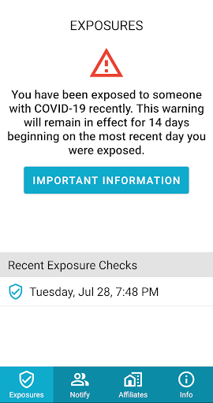

# Care19 Alert
App version ``1.2``

Analyzed with [covid-apps-observer](http://github.com/covid-apps-observer) project, version ``0.1``

## App overview
| | |
|-------------------------|-------------------------| 
| **Name**                                          | Care19 Alert |
| **Unique identifier** | com.proudcrowd.exposure |
| **Link to Google Play** | [https://play.google.com/store/apps/details?id=com.proudcrowd.exposure](https://play.google.com/store/apps/details?id=com.proudcrowd.exposure) |
| **Summary**  | Care19 Alert is the official COVID-19 exposure notification app for ND and WY. |
| **Privacy policy** | [https://www.care19.app/alert/privacy](https://www.care19.app/alert/privacy) |
| **Latest version** | 1.2 |
| **Last update** | 2020-11-27 04:42:00 |
| **Recent changes** | Fix an issue where some Samsung phones would not scan reliably |
| **Installs**  | 10,000+ |
| **Category** | Medical |
| **First release** | Aug 12, 2020 |
| **Size**  | 7.2M |
| **Supported Android version**  | 6.0 and up |

### Description
> Care19 Alert is the official COVID-19 exposure notification app for North Dakota and Wyoming as authorized by each states Department of Health. 
 Care19 Alert allows you to receive notifications if you have been near someone who has tested positive for Covid-19 recently.  Care19 Alert uses Apple’s Exposure Notification API to help reduce the spread of the coronavirus, with user privacy and security central to its design. 
 Care19 Alert maintains your privacy while securely communicating with nearby iOS and Android devices that also have exposure notifications enabled. This happens through the exchange of random keys that change every 15 minutes. These keys are stored securely on your device and hidden from the Care19 Alert application. All keys remain on your device and are not accessible unless you have tested positive for COVID-19, been contacted and verified by the Department of Health, and consent to sharing the random keys with others.
 Care19 Alert allows you to notify others if you test positive for COVID-19 and it will notify you if someone you came in contact tested positive for COVID-19. With your permission, your key/date pairs will be securely uploaded to the National Key Server run by the Association of Public Health Laboratories.  All uploaded key/date pairs are distributed to all of the devices connected to the National Key Server. 
  
 The downloaded keys are matched by the operating system based on criteria established by each Department of Health, and if you have a match you will be notified of the exposure and provided by your department of Health with the set of actions to take provided.

### User interface
The developers of the app provide the following screenshots in the Google play store.
| | | |
|:-------------------------:|:-------------------------:|:-------------------------:|
 |   |   |   | 

## Development team
In the following we report the main information provided by the development team in the Google play store.

| | |
|-------------------------|-------------------------|
| **Developer**  | ProudCrowd, LLC |
| **Website**  | [https://www.care19.app](https://www.care19.app) |
| **Email** | tim@brookinsfamily.net |
| **Physical address**  | - |
| **Other developed apps**  | [https://play.google.com/store/apps/developer?id=ProudCrowd,+LLC](https://play.google.com/store/apps/developer?id=ProudCrowd,+LLC) |

## Android support

| | |
|-------------------------|-------------------------|
| **Declared target Android version**  | Android10, version 10 (API level 29) |
| **Effective target Android version**  | Android10, version 10 (API level 29) |
| **Minimum supported Android version**  | Marshmallow, version 6.0 (API level 23) |
| **Maximum target Android version**  | - |

The larger the difference between the minimum and maximum supported Android versions, the better. A larger difference means a wider audience. For example, old phones have a very low Android version, so a high minimum supported Android version means that the app cannot be used by users with old phones, thus leading to accessibility problems. 

## Requested permissions

In the following we report the complete list of the permissions requested by the app. 

| **Permission** | **Protection level** | **Description** | 
|-------------------------|-------------------------|-------------------------|
 **android.permission ACCESS_NETWORK_STATE** | Normal | Allows applications to access information about networks. 
 **android.permission BLUETOOTH** | Normal | Allows applications to connect to paired bluetooth devices. 
 **android.permission FOREGROUND_SERVICE** | Normal | Allows a regular application to use Service.startForeground. 
 **android.permission INTERNET** | Normal | Allows applications to open network sockets. 
 **android.permission RECEIVE_BOOT_COMPLETED** | Normal | Allows an application to receive the Intent.ACTION_BOOT_COMPLETED that is broadcast after the system finishes booting. 
 **android.permission WAKE_LOCK** | Normal | Allows using PowerManager WakeLocks to keep processor from sleeping or screen from dimming. 
 **com.google.android.c2dm.permission RECEIVE** | - | - 
 **com.google.android.finsky.permission BIND_GET_INSTALL_REFERRER_SERVICE** | - | - 

## Mentioned servers

| **Server** | **Registrant** | **Registrant country** | **Creation date** | 
|-------------------------|-------------------------|-------------------------|-------------------------|
 | bugfender.com | Beenario GmbH | :de: DE | 2014-10-28 11:32:13 |
 | googlesyndication.com | Google LLC | :us: US | 2003-01-21 06:17:24 |
 | google.com | Google LLC | :us: US | 1997-09-15 04:00:00 |
 | app-measurement.com | Google LLC | :us: US | 2015-06-19 20:13:31 |
 | googleapis.com | Google LLC | :us: US | 2005-01-25 17:52:26 |
 | googleadservices.com | Google LLC | :us: US | 2003-06-19 16:34:53 |
 | googleapis.com | Google LLC | :us: US | 2005-01-25 17:52:26 |
 | crashlytics.com | Google LLC | :us: US | 2011-01-21 15:30:40 |

## Security analysis 

Below we report the main security warnings raised by our execution of the [Androwarn](https://github.com/maaaaz/androwarn) security analysis tool.

**Telephony identifiers leakage**
> - This application reads the MCC+MNC of the provider of the SIM 
> - This application reads the Service Provider Name (SPN) 
> - This application reads the numeric name (MCC+MNC) of current registered operator 
> - This application reads the operator name 

**Connection interfaces exfiltration**
> - This application reads details about the currently active data network 
> - This application tries to find out if the currently active data network is metered 

**Suspicious connection establishment**
> - This application opens a Socket and connects it to the remote address ' returned no addresses for  ; port is out of range' on the 'N/A' port  
> - This application opens a Socket and connects it to the remote address '' on the 'N/A' port  
> - This application opens a Socket and connects it to the remote address 'Ljava/lang/StringBuilder;->toString()Ljava/lang/String;' on the 'N/A' port  
> - This application opens a Socket and connects it to the remote address 'Ljava/net/Proxy;->type()Ljava/net/Proxy$Type;' on the 'N/A' port  
> - This application opens a Socket and connects it to the remote address 'timeout' on the 'N/A' port  

**Code execution**
> - This application executes a UNIX command 
> - This application executes a UNIX command containing this argument: 'logcat -c 2' 
> - This application executes a UNIX command containing this argument: 'logcat -c' 

## User ratings and reviews

Below we provide information about how end users are reacting to the app in terms of ratings and reviews in the Google Play store.

### Ratings

The Care19 Alert app has been installed by more than **10000** times. At this time, **81** rated the app and its average score is **3.4567902**. Below we show the distribution of the ratings across the usual star-based rating of Google Play

:star::star::star::star::star:: 39

:star::star::star::star:: 9

:star::star::star:: 7

:star::star:: 2

:star:: 24

### Reviews 

#### 5-star reviews

> I could not understand in minute meet me super 8 in brooklyn center today at we 12:00pm my phone rrquyqo are yqw if you done now I can he lol p you.  :date: __2021-03-17 11:00:37__

> ğŸ‘ğŸ‘ğŸ‘ğŸ‘👠 :date: __2021-03-13 07:11:13__

> Kok,🌬️🤩🤩🐧🐧🐧🐧🐧🐧🐧🐧🐧🐧🐧🌬️🐸🌬️⌨️🦃🦃🦃🦃🦃🦃🌬️🐸🌬️🐸🌬️🐸🌬️🤩🦃  :date: __2021-02-12 03:31:48__

> I check out all the nerdy statistics every night! 10/10  :date: __2021-01-27 04:21:56__

> My coverage  :date: __2021-01-23 11:07:33__

> I want this app back  :date: __2021-01-20 08:56:46__

> Love it  :date: __2021-01-13 23:48:06__

> Helpful💕⁦♥️⁩👏🙏👏🤗  :date: __2021-01-08 05:16:19__

> Good  :date: __2021-01-02 23:36:05__

> Good way to keep posted who sick got virus good app .  :date: __2021-01-02 13:55:56__

#### 4-star reviews

> Great!-!!🤔  :date: __2020-11-20 06:46:47__

> Seems like a good app but here's a question, will this app be effective even though I am in Colorado? Will it be effective in another state  :date: __2020-09-27 10:53:58__

> Add support for SD, please!  :date: __2020-09-10 00:36:08__

#### 3-star reviews

> Well, i don't know if it works, because a lot of the idiots in this state don't use it.  :date: __2021-01-23 04:24:06__

> From what it says when you check it, it only has 2 exposure checks per day. I do not see how it can be at all accurate if it only checks twice a day??  :date: __2020-12-10 14:20:51__

> It thinks I'm in North decode and Wyoming but I live in utah.  :date: __2020-11-29 20:27:49__

> It worked when I first downloaded it now it stopped working and can't get it to work at all. I tried everything. How can I get it to work please help  :date: __2020-11-24 03:25:10__

#### 2-star reviews

> I had this app had it active, and never got notifications of exposure. I ended up qith Covid and the health department didn't even know to ask for the notification code. Needs a lot of work to work properly.  :date: __2021-04-08 03:30:16__

> I love the concept of this app, but major issues needing addressed. Functionality of my device (android) slowed to near unusable, it was very "buggy" ie: Device would freeze up, apps closed without warning or would not open at all! Device shut down or restarted spontaneously, battery drained incredibly fast, plus any available memory was used sometimes within minutes so that I had to go through each installed & factory app to dump cache 2-3 times DAILY. If fixed I'd love to try using it again.  :date: __2020-11-26 09:28:13__

#### 1-star reviews

> It goes days, sometimes months without checking for exposures. I have to remember to open it for it to work for a few days and then it lapses again until I remember to open it again. Thank goodness it didn't detect any exposures in my bedroom this morning, its first check in who knows how long *rolls eyes*. I feel safer already.  :date: __2021-03-21 14:20:52__

> Wrong app  :date: __2021-02-05 07:34:11__

> Has not added a scan since December 15th. No updates available, so it's not that.  :date: __2021-01-06 07:27:48__

> Not updated since nov  :date: __2021-01-02 20:58:25__

> I can go days without it logging any activity even though I have had a number of stops and it will not recognize that I have changed my home address. It would be nice if I could just completely reset & start over but it won't let me do that either. Rather useless if I have to remember to manually enter where I've been.  :date: __2020-12-21 20:48:07__

> Please stop showing up as soon as i open google play  :date: __2020-12-21 12:32:13__

> Does not work clicked after a million times in nothing it just stayed there  :date: __2020-12-18 11:26:02__

> Shouldn't have any sort of tracker like this. If there isn't one for the flu or any other virus we shouldn't have it for this.  :date: __2020-12-01 08:59:39__

> App has stopped checking for recent exposures .  :date: __2020-11-23 04:34:00__

> Doesn't do what it should. Just takes up space on your phone or tablet  :date: __2020-11-21 15:36:41__

