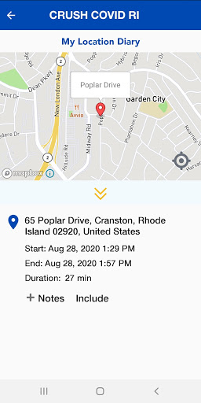
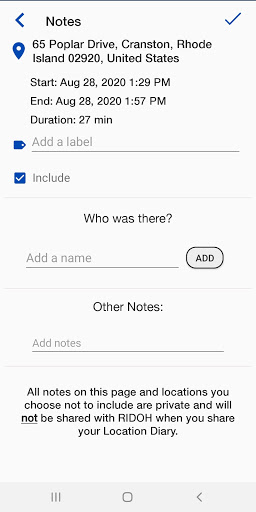
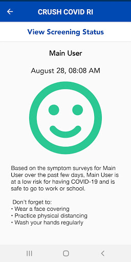
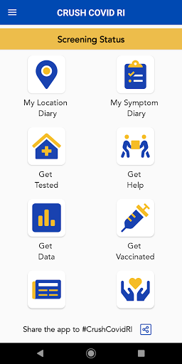
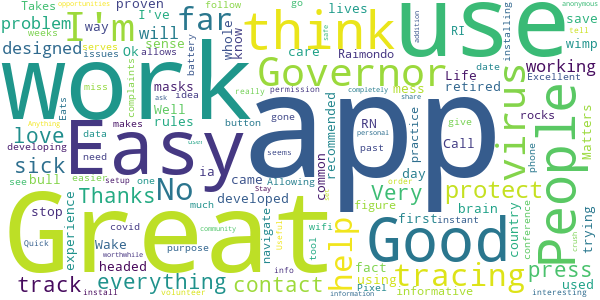
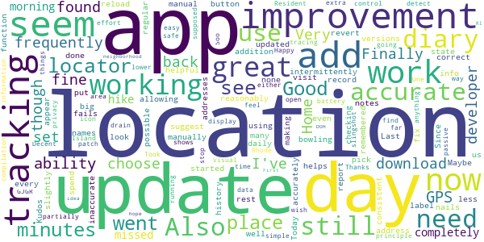
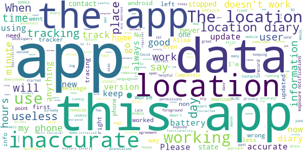

# CRUSH COVID RI
App version ``3.0``

Analyzed with [covid-apps-observer](http://github.com/covid-apps-observer) project, version ``0.1``

## App overview
| | |
|-------------------------|-------------------------| 
| **Name**&nbsp;&nbsp;&nbsp;&nbsp;&nbsp;&nbsp;&nbsp;&nbsp;&nbsp;&nbsp;&nbsp;&nbsp;&nbsp;&nbsp;&nbsp;&nbsp;&nbsp;&nbsp;&nbsp;&nbsp;&nbsp;&nbsp;&nbsp;&nbsp;&nbsp;&nbsp;&nbsp;&nbsp;&nbsp;&nbsp;&nbsp;&nbsp;&nbsp;&nbsp;&nbsp;&nbsp;&nbsp;&nbsp;&nbsp;&nbsp;  | CRUSH COVID RI |
| **Unique identifier** | com.ri.crushcovid |
| **Link to Google Play** | [https://play.google.com/store/apps/details?id=com.ri.crushcovid](https://play.google.com/store/apps/details?id=com.ri.crushcovid) |
| **Summary**  | CRUSH COVID RI is the COVID-19 response app for Rhode Island. #CrushCovidRI |
| **Privacy policy** | [https://health.ri.gov/covid/crush/privacypolicy/](https://health.ri.gov/covid/crush/privacypolicy/) |
| **Latest version** | 3.0 |
| **Last update** | 2021-03-08 21:55:59 |
| **Recent changes** | This update includes the following:  - Two new tiles added: “Get Vaccinated” and “Get Data” - General performance and user interface improvements |
| **Installs**  | 10,000+ |
| **Category** | Health & Fitness |
| **First release** | May 15, 2020 |
| **Size**  | 15M |
| **Supported Android version**  | 8.0 and up |

### Description
> CRUSH COVID RI is a COVID-19 pandemic response app that provides Rhode Islanders with easy access to all of the resources required during the public health crisis, and includes features such as a location diary and symptom diary. 
  
 All Rhode Islanders are encouraged to use the CRUSH COVID RI app and take an active role in slowing the spread of COVID-19 in Rhode Island.  You can make a difference in the health of your loved ones and your community by helping us track the virus in our state.  
  
 CRUSH COVID RI is a one-stop place to get all the information you need about COVID-19 in Rhode Island. It also has two features you can use to help everyone in the community.  
  
 The My Location Diary feature uses GPS location data that is already available from your phone to help you easily track the places you visited over the past 20 days. All data will be stored locally on your device. It is only shared when you voluntarily decide to share it. If you test positive for COVID-19, and you agree to share this information with the Rhode Island Department of Health, they can quickly identify places you went and people you were in contact with and reduce the spread of COVID-19.    
  
 The My Symptom Diary feature lets you tell us if you have any symptoms and only asks you to provide your zip code.  If you submit this quick survey daily, it will help give us early indicators of COVID-19 spread in certain zip codes so we can respond by doing things like setting up testing sites in that area.  
  
 Together we can #CrushCovidRI. 
  
 Please see our Terms of Use (https://health.ri.gov/covid/crush/termsofuse/) & Privacy Policy (https://health.ri.gov/covid/crush/privacypolicy/) for further information.

### User interface
The developers of the app provide the following screenshots in the Google play store.
| | | |
|:-------------------------:|:-------------------------:|:-------------------------:|
 |   |   |   | 
 |   |   |   | 
 |   |  

## Development team
In the following we report the main information provided by the development team in the Google play store.

| | |
|-------------------------|-------------------------|
| **Developer**  | State of Rhode Island |
| **Website**  | [https://health.ri.gov/crushcovid](https://health.ri.gov/crushcovid) |
| **Email** | CrushCovid.Survey@health.ri.gov |
| **Physical address**  | - |
| **Other developed apps**  | [https://play.google.com/store/apps/developer?id=State+of+Rhode+Island](https://play.google.com/store/apps/developer?id=State+of+Rhode+Island) |

## Android support

| | |
|-------------------------|-------------------------|
| **Declared target Android version**  | Android10, version 10 (API level 29) |
| **Effective target Android version**  | Android10, version 10 (API level 29) |
| **Minimum supported Android version**  | Oreo, version 8.0.0 (API level 26) |
| **Maximum target Android version**  | - |

The larger the difference between the minimum and maximum supported Android versions, the better. A larger difference means a wider audience. For example, old phones have a very low Android version, so a high minimum supported Android version means that the app cannot be used by users with old phones, thus leading to accessibility problems. 

## Requested permissions

In the following we report the complete list of the permissions requested by the app. 

| **Permission** | **Protection level** | **Description** | 
|-------------------------|-------------------------|-------------------------|
 **android.permission ACCESS_FINE_LOCATION** | :warning:**Dangerous** | Allows an app to access precise location. 
 **android.permission ACCESS_NETWORK_STATE** | Normal | Allows applications to access information about networks. 
 **android.permission ACCESS_WIFI_STATE** | Normal | Allows applications to access information about Wi-Fi networks. 
 **android.permission FOREGROUND_SERVICE** | Normal | Allows a regular application to use Service.startForeground. 
 **android.permission INTERNET** | Normal | Allows applications to open network sockets. 
 **android.permission RECEIVE_BOOT_COMPLETED** | Normal | Allows an application to receive the Intent.ACTION_BOOT_COMPLETED that is broadcast after the system finishes booting. 
 **android.permission WAKE_LOCK** | Normal | Allows using PowerManager WakeLocks to keep processor from sleeping or screen from dimming. 
 **com.google.android.c2dm.permission RECEIVE** | - | - 
 **com.google.android.finsky.permission BIND_GET_INSTALL_REFERRER_SERVICE** | - | - 

## Mentioned servers

| **Server** | **Registrant** | **Registrant country** | **Creation date** | 
|-------------------------|-------------------------|-------------------------|-------------------------|
 | android.com | Google LLC | :us: US | 1997-06-23 04:00:00 |
 | google.com | Google LLC | :us: US | 1997-09-15 04:00:00 |
 | app-measurement.com | Google LLC | :us: US | 2015-06-19 20:13:31 |
 | mapbox.com | Whois Privacy Service | :us: US | 2003-11-27 11:15:57 |
 | googlesyndication.com | Google LLC | :us: US | 2003-01-21 06:17:24 |
 | crashlytics.com | Google LLC | :us: US | 2011-01-21 15:30:40 |
 | googleapis.com | Google LLC | :us: US | 2005-01-25 17:52:26 |
 | googleadservices.com | Google LLC | :us: US | 2003-06-19 16:34:53 |

## Security analysis 

Below we report the main security warnings raised by our execution of the [Androwarn](https://github.com/maaaaz/androwarn) security analysis tool.

**Telephony identifiers leakage**
> - This application reads the numeric name (MCC+MNC) of current registered operator 
> - This application reads the operator name 
> - This application reads the radio technology (network type) currently in use on the device for data transmission 

**Connection interfaces exfiltration**
> - This application reads details about the currently active data network 
> - This application tries to find out if the currently active data network is metered 

**Telephony services abuse**
> - This application makes phone calls 

**Suspicious connection establishment**
> - This application opens a Socket and connects it to the remote address '; exhausted proxy configurations: ' on the 'N/A' port  
> - This application opens a Socket and connects it to the remote address 'Ljava/lang/StringBuilder;->toString()Ljava/lang/String;' on the 'N/A' port  
> - This application opens a Socket and connects it to the remote address 'Ljava/net/Proxy;->type()Ljava/net/Proxy$Type;' on the 'N/A' port  
> - This application opens a Socket and connects it to the remote address 'Ljava/net/SocketException;' on the 'N/A' port  
> - This application opens a Socket and connects it to the remote address 'timeout' on the 'N/A' port  

**Code execution**
> - This application loads a native library 

## User ratings and reviews

Below we provide information about how end users are reacting to the app in terms of ratings and reviews in the Google Play store.

### Ratings

The CRUSH COVID RI app has been installed by more than **10000** times. At this time, **306** rated the app and its average score is **3.2673268**. Below we show the distribution of the ratings across the usual star-based rating of Google Play

:star::star::star::star::star:: 137

:star::star::star::star:: 9

:star::star::star:: 39

:star::star:: 42

:star:: 79

### Reviews 

#### 5-star reviews

> All Life Matters...  :date: __2021-04-09 01:13:41__

> Great  :date: __2020-12-24 20:33:48__

> Well developed  :date: __2020-10-20 23:12:10__

> I think that if the whole country used this app we would not be in the mess we are in. People do not use their brain at all. It's common sense...you protect me I protect you. It's a proven fact that masks work. Wake up and stop being so bull headed...I've been trying to do everything that has been recommended by our Governor and have been using this app since the first day it came out. Call me a wimp, I don't care. I'm 70, a retired RN and know from experience these rules save lives.  :date: __2020-10-17 19:43:11__

> Good way to track were you've been  :date: __2020-10-14 18:24:27__

> The app ia good  :date: __2020-10-01 11:03:12__

> Very informative. Be  :date: __2020-09-22 22:19:48__

> Easy to navigate and use.  :date: __2020-09-18 04:00:13__

> Takes some practice to figure how It works.  :date: __2020-09-11 05:46:50__

> RI Governor Raimondo rocks. Thanks for developing this app. If you get covid, one press of a button allows you to see where you have gone for the past 2 weeks. Allowing for instant virus tracing.  :date: __2020-09-10 19:57:21__

#### 4-star reviews

> more f  :date: __2020-08-06 01:07:34__

> Kudos to the state and the developers for working to put this out. Maybe needs some improvements but none I can suggest. Last update was great allowing us to add names to location diary.  :date: __2020-07-13 23:21:21__

> Update: started using again with the update to see if there is improvement. Still need to add a manual addition for location if the locator doesn't pick up where you were for less that 10 minutes. Also, you still can't fix where you went if the locator is slightly off. Today, I went bowling, not get my nails done. Now you can add notes, so that helps. Location info not 100% accurate. Since I don't spend 20 minutes at every place I visit, you should add a location manually button.  :date: __2020-07-12 21:09:13__

> Good app, but still could use some improvements. The ability to correct an address would be helpful, as the GPS frequently does not accurately record it. Also, if possible, the ability to label regular addresses, like Home, and have it be remembered. Finally, the app frequently would revert to 5 day look back, even if I choose 20 day, as I was checking my history and making updates. I would have to back out and reload the location diary and then choose 20 day again.  :date: __2020-07-12 15:18:33__

> The Location Diary fails to report some places I've been and is inaccurate on many of the rest.  :date: __2020-07-12 15:11:35__

> Works fine, though doesn't seem to update daily on my tracking. 7/11/2020 tracking seems to be working fine now.  :date: __2020-07-11 22:18:17__

> Location function does not appear to be consistent. Some days are partially accurate and some days are not accurate at all.  :date: __2020-07-10 19:50:08__

> Resident of Rhode Island  :date: __2020-07-10 19:39:10__

> if you don't see the icon, it's not tracking you.  :date: __2020-07-04 23:43:54__

> Happy with it, but wish it had: - lower battery drain - visual display of location tracing Thanks!  :date: __2020-06-08 19:14:53__

#### 3-star reviews

> This seams to not be accurate very often with locations!!  :date: __2020-10-14 23:37:32__

> It puts me places I never was  :date: __2020-10-14 16:40:06__

> I have used this app regularly since downloading it months ago & while it was a rudimentary app in the beginning the 2.0 upgrades were a good improvement. What I DON'T find helpful is with today's update, I am forced to turn on my GPS feature in order to take the daily symptom survey; this is completely unnecessary as I may not have any plans to leave my house. I'm not a fan of an app controlling how my device works. Also the "No thanks" option does nothing, and I have to force the app closed.  :date: __2020-10-14 14:12:33__

> This should be integrated with the exposure notification system from Apple and Google. Without it, this app exists in its own tiny silo and won't be successful.  :date: __2020-09-28 05:33:30__

> This is not accurately tracking location. Update: Even after installing the update, it is not accurately tracking my location. Sometimes it shows me at an address down the street from my home all day rather than my house. Other days it doesn't record any location at all. Such as yesterday, I went to Narragansett, nothing shows on my location tracker at all for the last 2 days.  :date: __2020-09-10 01:24:33__

> Cannot get contact tracing in Crush Colvid  :date: __2020-08-10 20:35:33__

> Not totally accurate  :date: __2020-07-16 21:44:22__

> Most days the app is not picking up most of the locations I visit. Sometimes is says I did not go anywhere and I definitely did and stayed at Locations for hours. What is the point of participating in this if the data is going to be incorrect. I hope this can be fixed or at least have an option to correct Locations ourselves. Good luck.  :date: __2020-07-14 00:41:15__

> James Wadsworth I have found the tracking to be only 75 per cent accurate.  :date: __2020-07-13 06:40:02__

> I mean, I get that the app is trying it's best, but it only works in Rhode island! The better news is that at least it warns u what states the coronavirus are tracked  :date: __2020-07-11 03:50:12__

#### 2-star reviews

> In the location diary, It only gets the address right about half the time...sometimes it misses an address altogether...  :date: __2021-04-07 14:36:11__

> Good concept but it stopped tracking, which is a major function of the app. I deleted and downloaded again and still no tracking, so finding a reason to keep hard to come by.  :date: __2021-02-28 21:08:49__

> My app hasn't tracked my location since Dec 23, 2020. It has said it is "in progress" since then.  :date: __2021-01-09 15:25:09__

> Rarely works  :date: __2020-11-19 15:46:15__

> I appreciate this app so much that I've kept it on my phone pretty much since day 1, and have let it log my location for the chance that I catch COVID-19 and want to send it in. I just want to do anything I can to help stop the spread. However, this app accounts for 35 PERCENT of my battery usage. There's simply no need for an app to be that power-hungry, just logging my location idly. That, and the fact that it doesn't integrate Google's contact tracing technology, I have to say goodbye for now  :date: __2020-11-19 08:27:43__

> Location areas are not correct  :date: __2020-10-14 14:32:35__

> Flawed tracking. Please give option to manually add days/locations when there is no tracking history. Just checking location history today and there's been no tracking since the 20th. App has been running and I had expected that it was working.  :date: __2020-09-28 04:03:38__

> Had this app for a little while. Always had me in places that ive never been and hardley ever picked up where i actually was. Dont really go to a lot of new places so i tried it but now has been deleted  :date: __2020-09-15 14:37:38__

> Shuts down  :date: __2020-08-27 14:31:35__

> Battery not working charging likely from multiple ConVid19 tracker, in DC and other areas people may be running different apps from other states like Virginia and miss encounters...  :date: __2020-08-24 10:03:37__

#### 1-star reviews

> At first it was helpful tracking my help and keeping me up to date with new information. However, it's now been unable to retrieve new data for a couple months and I'm unable to access new information about testing or vaccinations.  :date: __2021-02-26 20:13:12__

> I can't get past the "Let's Go" button on a Pixel 5. This used to work on my Pixel.  :date: __2020-12-02 17:30:43__

> After I use symptom diary, the next screen freezes. I have to uninstall the app and then install it again.  :date: __2020-11-22 15:40:59__

> Constantly says that I need to connect to Wi-Fi or mobile which are both connected tried turning each off individually with the same message. I am removing the app from my phone  :date: __2020-11-12 19:18:39__

> Not accurate at all  :date: __2020-11-07 19:42:19__

> The app was ok but the most recent update drained my battery worse than a Pokemon go binge, just with the app running in the background. It's not worth having until this issue is fixed.  :date: __2020-10-31 15:41:18__

> Lack of exposure notifications make this app virtually useless.  :date: __2020-10-18 01:46:52__

> Not very accurate.  :date: __2020-10-17 05:08:13__

> No exposure notifications = useless app!  :date: __2020-10-09 03:20:46__

> Not working correctly. Dates wrong  :date: __2020-10-06 06:25:40__

