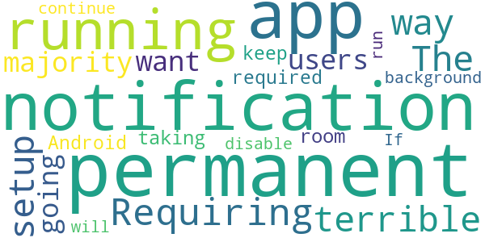
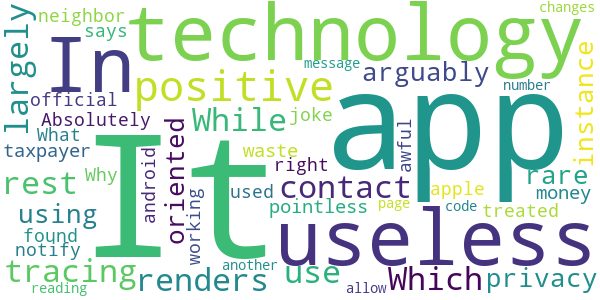

# CombatCOVID MDC
App version ``1.1.0``

Analyzed with [covid-apps-observer](http://github.com/covid-apps-observer) project, version ``0.1``

## App overview
| | |
|-------------------------|-------------------------| 
| **Name**&nbsp;&nbsp;&nbsp;&nbsp;&nbsp;&nbsp;&nbsp;&nbsp;&nbsp;&nbsp;&nbsp;&nbsp;&nbsp;&nbsp;&nbsp;&nbsp;&nbsp;&nbsp;&nbsp;&nbsp;&nbsp;&nbsp;&nbsp;&nbsp;&nbsp;&nbsp;&nbsp;&nbsp;&nbsp;&nbsp;&nbsp;&nbsp;&nbsp;&nbsp;&nbsp;&nbsp;&nbsp;&nbsp;&nbsp;&nbsp;  | CombatCOVID MDC |
| **Unique identifier** | com.shield.CombatCovidMD |
| **Link to Google Play** | [https://play.google.com/store/apps/details?id=com.shield.CombatCovidMD](https://play.google.com/store/apps/details?id=com.shield.CombatCovidMD) |
| **Summary**  | CombatCOVID alerts you when you&#39;ve been in contact with someone who has COVID-19 |
| **Privacy policy** | [https://combatcovidapp.com/combatcovid-miamidade-principles-privacy-policy-and-terms-of-use/](https://combatcovidapp.com/combatcovid-miamidade-principles-privacy-policy-and-terms-of-use/) |
| **Latest version** | 1.1.0 |
| **Last update** | 2020-12-22 18:07:58 |
| **Recent changes** | Improved OTP(One-Time Pin) SMS service |
| **Installs**  | 1,000+ |
| **Category** | Health & Fitness |
| **First release** | Aug 4, 2020 |
| **Size**  | 20M |
| **Supported Android version**  | 5.1 and up |

### Description
> CombatCOVID MDC app is for Miami-Dade County coverage.
 CombatCOVID is the Official COVID-19 notification and information app of the County Government of Miami-Dade County, Florida, a diverse community of over 2.7 million people.
 Unlike other apps, CombatCOVID has never used GPS or location notification in its architecture. The app user’s privacy and identity are protected. No names, emails addresses, locations or personally identifying information is required. There is never any location or identity information acquired by CombatCOVID.
 The CombatCOVID app uses Bluetooth signals to determine if you are near another user. All users who have been in close proximity to a COVID-19 positive person will be notified by a push notification recommending they get tested immediately, without revealing anyone’s personal identity. Suggested locations for testing are also provided.
 Your device’s phone number is encrypted and never shared with anyone, including local health officials. All data and Information about the device being in close proximity with another device is ONLY stored on the device.
 Access to the data indicating the device’s user may have tested positive is only shared IF/WHEN the user chooses to share it. IF the user does choose to share a COVID-19 positive result, they are still totally PRIVACY PROTECTED.

### User interface
The developers of the app provide the following screenshots in the Google play store.
| | | |
|:-------------------------:|:-------------------------:|:-------------------------:|
 |   |   |   | 

## Development team
In the following we report the main information provided by the development team in the Google play store.

| | |
|-------------------------|-------------------------|
| **Developer**  | Miami-Dade County |
| **Website**  | [https://combatcovidapp.com/mdc](https://combatcovidapp.com/mdc) |
| **Email** | info@combatcovidapp.com |
| **Physical address**  | - |
| **Other developed apps**  | [https://play.google.com/store/apps/developer?id=Miami-Dade+County](https://play.google.com/store/apps/developer?id=Miami-Dade+County) |

## Android support

| | |
|-------------------------|-------------------------|
| **Declared target Android version**  | Android10, version 10 (API level 29) |
| **Effective target Android version**  | Android10, version 10 (API level 29) |
| **Minimum supported Android version**  | Lollipop, version 5.1 (API level 22) |
| **Maximum target Android version**  | - |

The larger the difference between the minimum and maximum supported Android versions, the better. A larger difference means a wider audience. For example, old phones have a very low Android version, so a high minimum supported Android version means that the app cannot be used by users with old phones, thus leading to accessibility problems. 

## Requested permissions

In the following we report the complete list of the permissions requested by the app. 

| **Permission** | **Protection level** | **Description** | 
|-------------------------|-------------------------|-------------------------|
 **android.permission ACCESS_FINE_LOCATION** | :warning:**Dangerous** | Allows an app to access precise location. 
 **android.permission ACCESS_NETWORK_STATE** | Normal | Allows applications to access information about networks. 
 **android.permission BLUETOOTH** | Normal | Allows applications to connect to paired bluetooth devices. 
 **android.permission BLUETOOTH_ADMIN** | Normal | Allows applications to discover and pair bluetooth devices. 
 **android.permission FOREGROUND_SERVICE** | Normal | Allows a regular application to use Service.startForeground. 
 **android.permission INTERNET** | Normal | Allows applications to open network sockets. 
 **android.permission REQUEST_IGNORE_BATTERY_OPTIMIZATIONS** | Normal | Permission an application must hold in order to use Settings.ACTION_REQUEST_IGNORE_BATTERY_OPTIMIZATIONS. 
 **android.permission WAKE_LOCK** | Normal | Allows using PowerManager WakeLocks to keep processor from sleeping or screen from dimming. 
 **com.google.android.c2dm.permission RECEIVE** | - | - 
 **com.google.android.finsky.permission BIND_GET_INSTALL_REFERRER_SERVICE** | - | - 

## Mentioned servers

| **Server** | **Registrant** | **Registrant country** | **Creation date** | 
|-------------------------|-------------------------|-------------------------|-------------------------|
 | googlesyndication.com | Google LLC | :us: US | 2003-01-21 06:17:24 |
 | google.com | Google LLC | :us: US | 1997-09-15 04:00:00 |
 | app-measurement.com | Google LLC | :us: US | 2015-06-19 20:13:31 |
 | stackoverflow.com | Stack Exchange, Inc. | :us: US | 2003-12-26 19:18:07 |
 | googleapis.com | Google LLC | :us: US | 2005-01-25 17:52:26 |
 | googleadservices.com | Google LLC | :us: US | 2003-06-19 16:34:53 |
 | googleapis.com | Google LLC | :us: US | 2005-01-25 17:52:26 |
 | googleapis.com | Google LLC | :us: US | 2005-01-25 17:52:26 |
 | shieldgrouptech.com | Domains By Proxy, LLC | :us: US | 2015-11-11 16:30:04 |
 | combatcovidapp.com | Domains By Proxy, LLC | :us: US | 2020-05-18 13:25:41 |

## Security analysis 

Below we report the main security warnings raised by our execution of the [Androwarn](https://github.com/maaaaz/androwarn) security analysis tool.

**Telephony identifiers leakage**
> - This application reads the ISO country code equivalent for the SIM provider's country code 
> - This application reads the ISO country code equivalent of the current registered operator's MCC (Mobile Country Code) 

**Connection interfaces exfiltration**
> - This application reads details about the currently active data network 
> - This application tries to find out if the currently active data network is metered 

**Suspicious connection establishment**
> - This application opens a Socket and connects it to the remote address '' on the 'N/A' port  
> - This application opens a Socket and connects it to the remote address 'Ljava/lang/StringBuilder;->toString()Ljava/lang/String;' on the 'N/A' port  
> - This application opens a Socket and connects it to the remote address 'Ljava/net/Proxy;->type()Ljava/net/Proxy$Type;' on the 'N/A' port  
> - This application opens a Socket and connects it to the remote address 'Network subsystem is unavailable' on the 'N/A' port  
> - This application opens a Socket and connects it to the remote address 'timeout' on the 'N/A' port  

## User ratings and reviews

Below we provide information about how end users are reacting to the app in terms of ratings and reviews in the Google Play store.

### Ratings

The CombatCOVID MDC app has been installed by more than **1000** times. At this time, **30** rated the app and its average score is **4.133333**. Below we show the distribution of the ratings across the usual star-based rating of Google Play

:star::star::star::star::star:: 21

:star::star::star::star:: 2

:star::star::star:: 1

:star::star:: 2

:star:: 4

### Reviews 

#### 5-star reviews

> This is a very necessary health app.  :date: __2020-10-02 12:00:20__

> Working fine so far... Let's spread the word, the more people install it the better it will work!!!!  :date: __2020-09-28 20:25:15__

> Application is fantastic. Love the privacy and feel safer!  :date: __2020-09-18 17:34:58__

> Sweet, this is pretty cool that it doesn’t track me.  It just uses Bluetooth to connect with others.  I did some research and this is the way to go.  Hope I never get notified of anything but will be glad to know I may have been at risk  if I ever do.  :date: __2020-09-16 04:20:29__

> The app is explained well in the download process.  It should let people know that they were ever close to someone that later reported they were positive.  and its private. Load it use it tell everyone to use the app  :date: __2020-09-16 04:19:42__

> No issues at this point and it wasn’t hard to download.  Hope it works as described.  :date: __2020-09-16 04:17:08__

> This is a well made app.  I’m a very private person and value my privacy.  This app is made so that it is respected.  It doesn’t record my location or my phone number or track my location.  Well done.  :date: __2020-09-16 04:15:18__

#### 4-star reviews

> It's not sending me the pin # to access the app. I put in the correct phone #.  :date: __2020-09-20 23:45:38__

#### 3-star reviews

> Requiring a permanent notification is a terrible way to setup this app. The majority of users aren't going to want a permanent notification running and taking up room and this isn't required by Android to keep an app running in background. If I disable permanent notification will app continue to run?  :date: __2020-11-19 19:07:16__

#### 2-star reviews

> The app is built on old technology. The app needs to be open in order to detect other phones. It does not run in the background, so if you forget to open it before you leave home, it is useless. Not good for such a critical app. Google and Apple built Covid apps to run in the background but this one does not. I emailed the company 2 weeks ago and no response.  :date: __2020-11-11 19:02:14__

> Telling you to be tested IMMEDIATELY will give people false assurance when they test negative & haven't had sufficient viral load for detection. It does maintain confidentiality appropriately.  :date: __2020-09-18 22:56:15__

#### 1-star reviews

> It doesn't use the same contact tracing technology as the rest of apps. Which largely renders it useless. While arguably using a more privacy oriented technology. In this rare instance it's pointless and a waste of taxpayer money.  :date: __2020-12-14 17:31:44__

> Absolutely useless. I found out that my neighbor has treated positive and the app did not notify me. Why isn't the official app for android and apple being used. What a joke  :date: __2020-12-07 22:54:57__

> Not working right says am positive when I am not  :date: __2020-10-03 02:46:59__

> It is awful. When I am reading the message with the code number, the page changes to another. It does not allow me to get in.  :date: __2020-09-19 22:02:09__

