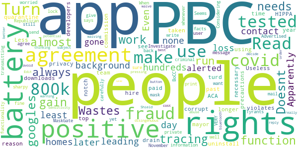

# CombatCOVID PBC
App version ``1.0.5``

Analyzed with [covid-apps-observer](http://github.com/covid-apps-observer) project, version ``0.1``

## App overview
| | |
|-------------------------|-------------------------| 
| **Name**&nbsp;&nbsp;&nbsp;&nbsp;&nbsp;&nbsp;&nbsp;&nbsp;&nbsp;&nbsp;&nbsp;&nbsp;&nbsp;&nbsp;&nbsp;&nbsp;&nbsp;&nbsp;&nbsp;&nbsp;&nbsp;&nbsp;&nbsp;&nbsp;&nbsp;&nbsp;&nbsp;&nbsp;&nbsp;&nbsp;&nbsp;&nbsp;&nbsp;&nbsp;&nbsp;&nbsp;&nbsp;&nbsp;&nbsp;&nbsp;  | CombatCOVID PBC |
| **Unique identifier** | com.shield.CombatCovidPBC |
| **Link to Google Play** | [https://play.google.com/store/apps/details?id=com.shield.CombatCovidPBC](https://play.google.com/store/apps/details?id=com.shield.CombatCovidPBC) |
| **Summary**  | CombatCOVID alerts you when you&#39;ve been in contact with someone who has COVID-19 |
| **Privacy policy** | [https://combatcovidapp.com/combatcovid-pbc-principles-privacy-policy-and-terms-of-use/](https://combatcovidapp.com/combatcovid-pbc-principles-privacy-policy-and-terms-of-use/) |
| **Latest version** | 1.0.5 |
| **Last update** | 2020-08-28 17:03:48 |
| **Recent changes** | - Minor issues corrected |
| **Installs**  | 1,000+ |
| **Category** | Health & Fitness |
| **First release** | Jul 20, 2020 |
| **Size**  | 12M |
| **Supported Android version**  | 5.1 and up |

### Description
> CombatCOVID is the Official COVID-19 notification and information app of the County Government of Palm Beach County, Florida, a diverse community of over a million and a half people.
 Unlike other apps, CombatCOVID has never used GPS or location notification in its architecture. The app user’s privacy and identity are protected. No names, emails addresses, locations or personally identifying information is required. There is never any location or identity information acquired by CombatCOVID.
 The CombatCOVID app uses Bluetooth signals to determine if you are near another user. All users who have been in close proximity to a COVID-19 positive person will be notified by a push notification recommending they get tested immediately, without revealing anyone’s personal identity. Suggested locations for testing are also provided.
 Your device’s phone number is encrypted and never shared with anyone, including local health officials. All data and Information about the device being in close proximity with another device is ONLY stored on the device.
 Access to the data indicating the device’s user may have tested positive is only shared IF/WHEN the user chooses to share it. IF the user does choose to share a COVID-19 positive result, they are still totally PRIVACY PROTECTED.

### User interface
The developers of the app provide the following screenshots in the Google play store.
| | | |
|:-------------------------:|:-------------------------:|:-------------------------:|
 |   |   |   | 
 |  

## Development team
In the following we report the main information provided by the development team in the Google play store.

| | |
|-------------------------|-------------------------|
| **Developer**  | Palm Beach County BoCC |
| **Website**  | [https://combatcovidapp.com/pbc](https://combatcovidapp.com/pbc) |
| **Email** | info@combatcovidapp.com |
| **Physical address**  | - |
| **Other developed apps**  | [https://play.google.com/store/apps/developer?id=Palm+Beach+County+BoCC](https://play.google.com/store/apps/developer?id=Palm+Beach+County+BoCC) |

## Android support

| | |
|-------------------------|-------------------------|
| **Declared target Android version**  | Android10, version 10 (API level 29) |
| **Effective target Android version**  | Android10, version 10 (API level 29) |
| **Minimum supported Android version**  | Lollipop, version 5.1 (API level 22) |
| **Maximum target Android version**  | - |

The larger the difference between the minimum and maximum supported Android versions, the better. A larger difference means a wider audience. For example, old phones have a very low Android version, so a high minimum supported Android version means that the app cannot be used by users with old phones, thus leading to accessibility problems. 

## Requested permissions

In the following we report the complete list of the permissions requested by the app. 

| **Permission** | **Protection level** | **Description** | 
|-------------------------|-------------------------|-------------------------|
 **android.permission ACCESS_FINE_LOCATION** | :warning:**Dangerous** | Allows an app to access precise location. 
 **android.permission ACCESS_NETWORK_STATE** | Normal | Allows applications to access information about networks. 
 **android.permission BLUETOOTH** | Normal | Allows applications to connect to paired bluetooth devices. 
 **android.permission BLUETOOTH_ADMIN** | Normal | Allows applications to discover and pair bluetooth devices. 
 **android.permission FOREGROUND_SERVICE** | Normal | Allows a regular application to use Service.startForeground. 
 **android.permission INTERNET** | Normal | Allows applications to open network sockets. 
 **android.permission REQUEST_IGNORE_BATTERY_OPTIMIZATIONS** | Normal | Permission an application must hold in order to use Settings.ACTION_REQUEST_IGNORE_BATTERY_OPTIMIZATIONS. 
 **android.permission WAKE_LOCK** | Normal | Allows using PowerManager WakeLocks to keep processor from sleeping or screen from dimming. 
 **com.google.android.c2dm.permission RECEIVE** | - | - 
 **com.google.android.finsky.permission BIND_GET_INSTALL_REFERRER_SERVICE** | - | - 

## Mentioned servers

| **Server** | **Registrant** | **Registrant country** | **Creation date** | 
|-------------------------|-------------------------|-------------------------|-------------------------|
 | googlesyndication.com | Google LLC | :us: US | 2003-01-21 06:17:24 |
 | google.com | Google LLC | :us: US | 1997-09-15 04:00:00 |
 | app-measurement.com | Google LLC | :us: US | 2015-06-19 20:13:31 |
 | stackoverflow.com | Stack Exchange, Inc. | :us: US | 2003-12-26 19:18:07 |
 | googleapis.com | Google LLC | :us: US | 2005-01-25 17:52:26 |
 | googleadservices.com | Google LLC | :us: US | 2003-06-19 16:34:53 |
 | googleapis.com | Google LLC | :us: US | 2005-01-25 17:52:26 |
 | googleapis.com | Google LLC | :us: US | 2005-01-25 17:52:26 |
 | combatcovidapp.com | Domains By Proxy, LLC | :us: US | 2020-05-18 13:25:41 |

## Security analysis 

Below we report the main security warnings raised by our execution of the [Androwarn](https://github.com/maaaaz/androwarn) security analysis tool.

**Telephony identifiers leakage**
> - This application reads the ISO country code equivalent for the SIM provider's country code 
> - This application reads the ISO country code equivalent of the current registered operator's MCC (Mobile Country Code) 

**Connection interfaces exfiltration**
> - This application reads details about the currently active data network 
> - This application tries to find out if the currently active data network is metered 

**Suspicious connection establishment**
> - This application opens a Socket and connects it to the remote address '' on the 'N/A' port  
> - This application opens a Socket and connects it to the remote address 'Ljava/lang/StringBuilder;->toString()Ljava/lang/String;' on the 'N/A' port  
> - This application opens a Socket and connects it to the remote address 'Ljava/net/Proxy;->type()Ljava/net/Proxy$Type;' on the 'N/A' port  
> - This application opens a Socket and connects it to the remote address 'Network subsystem is unavailable' on the 'N/A' port  
> - This application opens a Socket and connects it to the remote address 'timeout' on the 'N/A' port  

## User ratings and reviews

Below we provide information about how end users are reacting to the app in terms of ratings and reviews in the Google Play store.

### Ratings

The CombatCOVID PBC app has been installed by more than **1000** times. At this time, **36** rated the app and its average score is **3.7777777**. Below we show the distribution of the ratings across the usual star-based rating of Google Play

:star::star::star::star::star:: 21

:star::star::star::star:: 2

:star::star::star:: 3

:star::star:: 4

:star:: 6

### Reviews 

#### 5-star reviews

> App is awesome! So easy to use! Making the county safer!  :date: __2020-09-18 17:32:14__

> Fantastic tool - great app. Kudo's to PBC for being so proactive  :date: __2020-09-16 19:38:03__

> Pretty good so far, the instructions were easy to follow and it working good, it even reminds me with a notification to keep it running!!! I live in Boca and everyone in my family and me go to Deerfield area a lot, does this work in Broward?  :date: __2020-08-15 16:50:44__

> My husband downloaded combat covid a few days ago to try it out. He said that it was easy so I did it last night. I have had it running and no problems so far. I also like it has a lot of information for the people in palm beach to read about the disease. Thank you to the county for giving us this. I am going to show friends – well tell them I am not seeing anybody these days.  :date: __2020-08-15 16:42:08__

> Why so these political extremist/anti-mask fanatics interject their lunatic opinions into EVERYTHING! I’ve had the app running for several days now and so do several friend and family. I love it. It is simple to use and seems to be running flawlessly. Good job.  :date: __2020-08-15 16:37:17__

> Kudos to the county for making this available for use. Can’t tell yet what needs to be improved.  It was an easy and fast install but I did have to read it carefully to see what it was doing but it doesn’t look like other apps.  Not sure what I could say to fix that though.  :date: __2020-08-03 15:50:19__

> Great idea for an app. Glad my sister shared with me. Not much I had to do hope it works  :date: __2020-08-03 15:48:42__

> I am rooting for this app to be a huge success and help us here in PBC.  Hope everyone downloads it, uses it and we kick this viruses a\*\*.  :date: __2020-08-03 15:39:56__

> Good app  :date: __2020-07-29 15:17:53__

> This is a great idea and concept. App is smooth  :date: __2020-07-29 15:12:53__

#### 4-star reviews

> No support for the Android " Exposure Notification" feature?  :date: __2020-09-18 18:33:23__

> Needs to be publicized (and used) much more for it to be effective. Thanks.  :date: __2020-08-17 19:36:15__

#### 3-star reviews

> łBecause they are very important to me and I would feel bad if I got them sick. Hopefully the app actually works! as it says it does. Unfortunately these days most apps talk a big game and just dont deliver as they should work. Or they work great or they work great till you update the devices software and then are rendered useless.  :date: __2020-09-10 14:57:03__

> Great idea, I read about the issue with positive, this needs to be improved. The app needs update and additional functionality for example ability to make testing appointment directly from app.  :date: __2020-08-16 17:22:11__

> is this app not compatible w/ Android Covid Exposure Notification service?  :date: __2020-08-11 01:01:00__

#### 2-star reviews

> Not installing. It won't send the one time code. I love the idea, this is what we need! But please it has to be simple for everyone to use.  :date: __2020-09-17 18:33:28__

> The user interface needs help! I accidentally marked myself covid positive by clicking a tab, it have a warning that did not ask me if I was covid positive but instead asked if I wanted to upload my information. That is really unclear. I could find no way to undo this mistake. Reply to the response from the developer: At the time i reviewed it, the "3 step process" was definitely not a clearly defined clearly labeled 3 step process for marking yourself positive. Hopefully it has changed.  :date: __2020-08-20 04:39:13__

> I accidentally marked my self positive and I am not don't know how to fix it. So I would say it needs some work so people don't have the same problem.  :date: __2020-08-14 00:26:16__

> This app still needs help. Like others, I also accidentally marked myself positive. There needs to be a way to edit that. Plus it sent me a verification code, but didn't wait for me to enter it. It just accepted me.  :date: __2020-08-02 20:03:22__

#### 1-star reviews

> It doesn't work...also needs to always run in the background leading to battery loss.  :date: __2020-10-20 23:54:44__

> I am in the homes of hundreds of people each day. I was in contact with at least 130 people who later tested positive. Apparently none of them had this app. Even if they had alerted positive, I would not had gone into quarantine or been tested because I have taken all of the necessary precautions and then some. I no longer see any reason to drain my battery for this app. It is past time to uninstall. 1,500,000 people in PBC. Less than 2,000 downloads = .001% using app. Useless  :date: __2020-10-05 16:02:29__

> PBC corrupt mayor and commission paid $800k for this turd app that violates all your rights to privacy, HIPPA, and ACA. $800k could hire a team of 8 top notch developers for a year! Investigate this fraud and the MaskGate fraud as well. When you get your mask in mail from PBC make sure to get a sharpy, write a message on it, and send back! Turn PBC Republican in November and lock up all these criminal Tyrants! (Seems BoCC is worried about the facts!)  :date: __2020-08-18 13:35:13__

> Shifty beeps every 2 minutes an im alone in my home with no one around it got bugs  :date: __2020-08-14 23:48:58__

> Read the fine print of the user agreement VERY carefully! If you agree to it: you give up ALL of your rights. Advertised as not transmitting private information, yet it still has functionality to do so, and the agreement says they can whenever they want! Considering sensitivity of subject, potential for abuse, and waiving all rights in order to use this: one should avoid at all cost! Edit: read agreement and decide for yourself – you waive all your rights! Shield's reply is disingenuous at best.  :date: __2020-07-29 17:11:24__

> You really should make a better warning for the covid positive button.People have been pressing it thinking it turns on the bluetooth.  :date: __2020-07-28 21:59:54__

