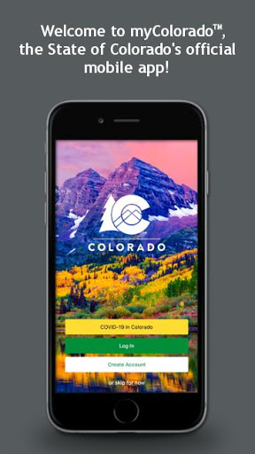
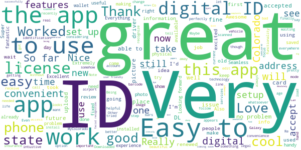
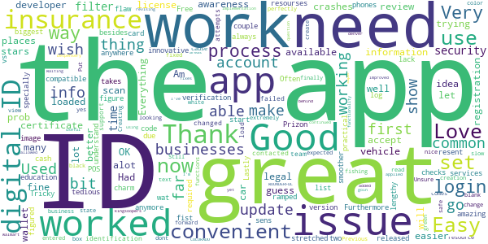
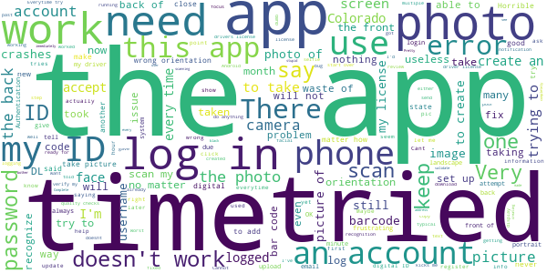

# myColorado
App version ``4.0``

Analyzed with [covid-apps-observer](http://github.com/covid-apps-observer) project, version ``0.1``

## App overview
| | |
|-------------------------|-------------------------| 
| **Name**&nbsp;&nbsp;&nbsp;&nbsp;&nbsp;&nbsp;&nbsp;&nbsp;&nbsp;&nbsp;&nbsp;&nbsp;&nbsp;&nbsp;&nbsp;&nbsp;&nbsp;&nbsp;&nbsp;&nbsp;&nbsp;&nbsp;&nbsp;&nbsp;&nbsp;&nbsp;&nbsp;&nbsp;&nbsp;&nbsp;&nbsp;&nbsp;&nbsp;&nbsp;&nbsp;&nbsp;&nbsp;&nbsp;&nbsp;&nbsp;  | myColorado |
| **Unique identifier** | com.soc.mycolorado |
| **Link to Google Play** | [https://play.google.com/store/apps/details?id=com.soc.mycolorado](https://play.google.com/store/apps/details?id=com.soc.mycolorado) |
| **Summary**  | The State of Colorado&#39;s Official Mobile App |
| **Privacy policy** | [https://mycolorado.state.co.us/privacy-policy](https://mycolorado.state.co.us/privacy-policy) |
| **Latest version** | 4.0 |
| **Last update** | 2020-11-17 17:48:50 |
| **Recent changes** | Minor bug fixes. |
| **Installs**  | 10,000+ |
| **Category** | Business |
| **First release** | Jan 2, 2019 |
| **Size**  | 74M |
| **Supported Android version**  | - |

### Description
> As the State of Colorado's official mobile app, myColorado™ provides a simple, secure and convenient way to show proof of identity and access state services.
 With myColorado™, you can:
 - create a Colorado Digital ID™ to complement your physical ID card for in-state use
 - renew your driver license or state ID
 - securely store payment information for future transactions
 - quickly find official online government resources with the State Services search function
 - link to state agency services, such as myDMV, state job search, and COVID-19 information
 - contact the myColorado support team through Chat
 - store your vehicle registration and insurance card in the Wallet
 The myColorado app requires Android OS version 8.1 or higher.
 myColorado™ is your trusted source to interact with state services anytime, anywhere. Skip the trip so you can go out and experience colorful Colorado!

### User interface
The developers of the app provide the following screenshots in the Google play store.
| | | |
|:-------------------------:|:-------------------------:|:-------------------------:|
 |   |   |   | 
 |  

## Development team
In the following we report the main information provided by the development team in the Google play store.

| | |
|-------------------------|-------------------------|
| **Developer**  | State of Colorado - Governor's Office of IT |
| **Website**  | [http://myColorado.state.co.us](http://myColorado.state.co.us) |
| **Email** | myColorado@state.co.us |
| **Physical address**  | - |
| **Other developed apps**  | [https://play.google.com/store/apps/developer?id=State+of+Colorado+-+Governor's+Office+of+IT](https://play.google.com/store/apps/developer?id=State+of+Colorado+-+Governor's+Office+of+IT) |

## Android support

| | |
|-------------------------|-------------------------|
| **Declared target Android version**  | Android10, version 10 (API level 29) |
| **Effective target Android version**  | Android10, version 10 (API level 29) |
| **Minimum supported Android version**  | Oreo, version 8.1.0 (API level 27) |
| **Maximum target Android version**  | - |

The larger the difference between the minimum and maximum supported Android versions, the better. A larger difference means a wider audience. For example, old phones have a very low Android version, so a high minimum supported Android version means that the app cannot be used by users with old phones, thus leading to accessibility problems. 

## Requested permissions

In the following we report the complete list of the permissions requested by the app. 

| **Permission** | **Protection level** | **Description** | 
|-------------------------|-------------------------|-------------------------|
 **android.permission ACCESS_COARSE_LOCATION** | :warning:**Dangerous** | Allows an app to access approximate location. 
 **android.permission ACCESS_FINE_LOCATION** | :warning:**Dangerous** | Allows an app to access precise location. 
 **android.permission ACCESS_NETWORK_STATE** | Normal | Allows applications to access information about networks. 
 **android.permission ACCESS_WIFI_STATE** | Normal | Allows applications to access information about Wi-Fi networks. 
 **android.permission CAMERA** | :warning:**Dangerous** | Required to be able to access the camera device. 
 **android.permission CHANGE_NETWORK_STATE** | Normal | Allows applications to change network connectivity state. 
 **android.permission INTERNET** | Normal | Allows applications to open network sockets. 
 **android.permission READ_EXTERNAL_STORAGE** | :warning:**Dangerous** | Allows an application to read from external storage. 
 **android.permission READ_PHONE_STATE** | :warning:**Dangerous** | Allows read only access to phone state, including the phone number of the device, current cellular network information, the status of any ongoing calls, and a list of any PhoneAccounts registered on the device. 
 **android.permission USE_BIOMETRIC** | Normal | Allows an app to use device supported biometric modalities. 
 **android.permission USE_FINGERPRINT** | Normal | This constant was deprecated in API level 28. Applications should request USE_BIOMETRIC instead 
 **android.permission WAKE_LOCK** | Normal | Allows using PowerManager WakeLocks to keep processor from sleeping or screen from dimming. 
 **android.permission WRITE_EXTERNAL_STORAGE** | :warning:**Dangerous** | Allows an application to write to external storage. 
 **com.google.android.c2dm.permission RECEIVE** | - | - 
 **com.google.android.finsky.permission BIND_GET_INSTALL_REFERRER_SERVICE** | - | - 

## Mentioned servers

| **Server** | **Registrant** | **Registrant country** | **Creation date** | 
|-------------------------|-------------------------|-------------------------|-------------------------|
 | amazonaws.com | Amazon.com, Inc. | :us: US | 2005-08-18 02:10:45 |
 | w3.org | W3C | :us: US | 1994-07-06 04:00:00 |
 | googlesyndication.com | Google LLC | :us: US | 2003-01-21 06:17:24 |
 | google.com | Google LLC | :us: US | 1997-09-15 04:00:00 |
 | app-measurement.com | Google LLC | :us: US | 2015-06-19 20:13:31 |
 | aws-mycolorado.com | Whois Privacy Service | :us: US | 2018-04-17 13:42:13 |
 | oit-shared.com | Whois Privacy Service | :us: US | 2018-06-30 13:57:22 |
 | amazonaws.com | Amazon.com, Inc. | :us: US | 2005-08-18 02:10:45 |
 | amazonaws.com | Amazon.com, Inc. | :us: US | 2005-08-18 02:10:45 |
 | googleapis.com | Google LLC | :us: US | 2005-01-25 17:52:26 |
 | googleadservices.com | Google LLC | :us: US | 2003-06-19 16:34:53 |
 | crashlytics.com | Google LLC | :us: US | 2011-01-21 15:30:40 |
 | cloudfront.net | Amazon.com, Inc. | :us: US | 2008-04-25 18:25:49 |
 | state.co.us | State of Colorado | :us: US | 2003-02-05 13:01:22 |

## Security analysis 

Below we report the main security warnings raised by our execution of the [Androwarn](https://github.com/maaaaz/androwarn) security analysis tool.

**Telephony identifiers leakage**
> - This application reads the ISO country code equivalent for the SIM provider's country code 
> - This application reads the ISO country code equivalent of the current registered operator's MCC (Mobile Country Code) 
> - This application reads the SIM's serial number 
> - This application reads the alphabetic identifier associated with the voice mail number 
> - This application reads the constant indicating the state of the device SIM card 
> - This application reads the current data connection state 
> - This application reads the current location of the device 
> - This application reads the device phone type value 
> - This application reads the numeric name (MCC+MNC) of current registered operator 
> - This application reads the operator name 
> - This application reads the phone number string for line 1, for example, the MSISDN for a GSM phone 
> - This application reads the software version number for the device, for example, the IMEI/SV for GSM phones 
> - This application reads the unique device ID, i.e the IMEI for GSM and the MEID or ESN for CDMA phones 
> - This application reads the unique subscriber ID, for example, the IMSI for a GSM phone 
> - This application reads the voice mail number 
> - This application reads the Cell ID value 
> - This application reads the Location Area Code value 

**Connection interfaces exfiltration**
> - This application reads details about the currently active data network 
> - This application tries to find out if the currently active data network is metered 

**Telephony services abuse**
> - This application makes phone calls 

**Suspicious connection establishment**
> - This application opens a Socket and connects it to the remote address 'Ljava/lang/Object;->toString()Ljava/lang/String;' on the 'N/A' port  
> - This application opens a Socket and connects it to the remote address 'Ljava/lang/StringBuilder;->toString()Ljava/lang/String;' on the 'N/A' port  
> - This application opens a Socket and connects it to the remote address 'Ljava/net/Proxy;->type()Ljava/net/Proxy$Type;' on the 'N/A' port  
> - This application opens a Socket and connects it to the remote address 'Ljava/net/SocketException;' on the 'N/A' port  
> - This application opens a Socket and connects it to the remote address 'No route to  ' on the 'N/A' port  
> - This application opens a Socket and connects it to the remote address 'timeout' on the 'N/A' port  

**Pim data leakage**
> - This application accesses the downloads folder 

**Code execution**
> - This application loads a native library 
> - This application loads a native library: 'PhoenixAndroid' 
> - This application loads a native library: 'jniPdfium' 
> - This application loads a native library: 'modft2' 
> - This application loads a native library: 'modpdfium' 
> - This application loads a native library: 'modpng' 
> - This application executes a UNIX command 

## User ratings and reviews

Below we provide information about how end users are reacting to the app in terms of ratings and reviews in the Google Play store.

### Ratings

The myColorado app has been installed by more than **10000** times. At this time, **441** rated the app and its average score is **4.13**. Below we show the distribution of the ratings across the usual star-based rating of Google Play

:star::star::star::star::star:: 297

:star::star::star::star:: 57

:star::star::star:: 4

:star::star:: 17

:star:: 66

### Reviews 

#### 5-star reviews

> It would not work on my phone. But then I got a new, better phone where it works fine.  :date: __2021-01-02 06:04:30__

> Easy to use  :date: __2020-12-29 18:47:12__

> Really like this. In this day and age of technology and convenience, this is awesome.  :date: __2020-12-21 16:14:02__

> Very helpful  :date: __2020-12-20 00:00:25__

> First state in the country with a legal digital identification. So cool!!! Also access to medical rec card via this app  :date: __2020-12-19 18:35:15__

> Very easy to use and upload information. Wish all agencies along with TSA accepted the digital documents.  :date: __2020-12-18 01:09:35__

> Really pleased with the app, can't wait till everybody understands and accepts digital IDs.  :date: __2020-12-16 23:20:43__

> Can not in places that have WiFi  :date: __2020-12-16 22:39:27__

> I am so elated and glad of the fact that I can no longer loose my ID.  :date: __2020-12-15 06:08:30__

> Thank goodness this is a thing now!!!  :date: __2020-12-13 23:46:31__

#### 4-star reviews

> Good  :date: __2020-12-11 15:53:14__

> Tricky to get set up but after that works like a charm  :date: __2020-12-02 23:26:24__

> Had a couple issues trying to figure out what to do at first, but I figured it out.  :date: __2020-12-01 23:17:23__

> A ways to go but a great start. The login process could be smoother, takes a bit to get in so log in before you need it. The image is a bit stretched in the app vs your id card. Lastly, I wish they did more education to businesses so they understand this is a legal version of identification.  :date: __2020-11-07 05:06:04__

> *update* changed review from 1 to 4 stars. After failed attempts to load, contacted support team and it loaded perfectly. Not convenient that, but yes loaded. Has worked great since. Used ID to get fishing license no prob. Used for other times no prob In state. Not used a lot, but nice when I have.  :date: __2020-10-26 15:59:26__

> Works well, wish it had more resource information available  :date: __2020-10-15 20:19:38__

> Love the digital ID. More business need to accept it.  :date: __2020-09-19 23:54:56__

> When trying to view my entered insurance info the app crashes  :date: __2020-08-31 19:22:38__

> Everything is good but the app need to change to color of text from white to black for easier to read.  :date: __2020-08-30 10:27:57__

> Previous certificate issue has now been fixed. App functions as expected now  :date: __2020-07-16 23:08:23__

#### 3-star reviews

> THIS APP IS HARD TO SET UP AND IT KEEPS REDIRECT ME .BUT NOT LETTING ME LOG IN  :date: __2020-12-21 09:32:36__

> This app saved my life but now it keep saying retry otp and now I can't use it for my I'd. How I'm supposed to buy my essential things with no I'd!  :date: __2020-09-25 20:54:47__

> Photo Capture does not work properly for live photo of physical face!! Has already provided feedback for the app developers 👍  :date: __2020-08-19 02:03:21__

> \*\*\*\*\*\*\*\**Update\*\*\*\*\*\** I had to dump all non basic operation apps off my phone to get every thing to process through, but Eureka success! All this app does is collect your data to sell I'm assuming. But it will have you set up an account just to not allow you to log into it after. And when you ask for assistance or request what companies they sell your info to, so you can block their spam, you get generic responses. Assuming these are bots designed to find key words and respond accordingly.  :date: __2020-07-30 23:54:34__

> Only after 10 attempts (using my new DL that just arrived in the mail earlier that day) was it able to register my driver's liscence in the virtual wallet. Other than taking forever to scan my documents, the app is pretty darn good.  :date: __2020-07-29 04:06:34__

> Everything was bool, then my picture didnt show up  :date: __2020-07-22 03:08:11__

> Drivers license does not show all the license it cuts off not able to see entire number cannot retake picture of new license that i renewed other parts of the app work great  :date: __2020-07-13 16:56:19__

> Had to use my sister's phone to scan my I.D., for whatever reason, my phone wouldn't scan, but other than that, I like this app..  :date: __2020-06-01 02:31:47__

> It ok needs improvement on application  :date: __2020-05-08 05:29:35__

> I am giving some stars based on the potential for being walletless. Using this in lieu of my driver's license would be game changing. I am taking off the same number of stars because I can't do this yet.  :date: __2020-05-04 03:17:40__

#### 2-star reviews

> Unable to add digital ID due to a camera malfunction during the verification. Will rate again when issue is fixed.  :date: __2021-01-09 03:02:10__

> My household moved 5 months ago & 6 of us changed our address online through DMV & followed the instructions to stick a label on the back of our DL's with the new address. However when I scanned the back of my DL today to try to create an account, my information still had my previous address. So this app really won't help me or any of my household members because the address will always be incorrect & cause problems for us in which we will still have to show our actual DL with the sticker.  :date: __2020-11-17 19:24:28__

> Cannot access my account anymore. The account recovery should work. I put in my email address but nothing comes back to reset my password.  :date: __2020-10-10 20:29:38__

> So, just renewed my license and while it was easy and the card arrived fast, it was missing the donor heart. I contacted support and they said it was not checked but I 100% did check it as it is really important to me so I made sure. They will not fix it! Really disappointed as the system errored and they will not correct it.  :date: __2020-10-10 05:51:46__

> Everything I upload the front side of my ID it kicks me out and makes me login in again??  :date: __2020-09-08 00:43:05__

> Frustrating. Trying to help roommate update his state id. Got to taking pics of id but then it would ask to log in after taking pic of back id. Multiple times. Hes mentally disabled and gets so frustrated that he almost punched a hole through a door window... he has little patience and gets so frustrated easily with almost anything.  :date: __2020-06-20 16:55:34__

> Need more documents  :date: __2020-05-26 17:43:27__

> 5/17/2020 I came back to the app to see if any functional utility was turned on. Instead all it does is open the website for each issue. I thought this app would provide a list of my vehicles and what the registration status is. How about selecting a vehicle to order a copy of title? I uploaded my license as proof of identity, why?  :date: __2020-05-18 00:48:27__

> I'm STILL not sure what the actual use of this is. when i added my ID it said it's not a replacement for the physical ID. also it's been easier to just pull out my ID than login again. at least the one time i was gonna use it i just gave up because i didn't have time to go through the verification process every time.  :date: __2020-04-28 23:55:02__

> Sweet, I need a registration renewal and everything is closed. So I see on Nextdoor about this app. But I can't use it - why? I have a 2 yr old $150 Lenovo Phab which won't allow this app. So I need to buy a new phone to use - great. Not everyone can afford a new phone every year especially Seniors. The emissions places are closed as are the DL locations so I guess I just drive with an expired tag.  :date: __2020-04-22 20:23:52__

#### 1-star reviews

> This app is ridiculous. I keep installing it over and over and over and over again and restarting my phone over and over and over and over again and everytime I try to scan my ID the app crashes. This is beyond frustrating I don't see why I can't just physically enter in my information this is so stupid.  :date: __2020-12-24 00:50:17__

> Wont download  :date: __2020-12-23 06:08:34__

> Freezes the phone and crashes every time it tries to get a face map after log in. I still have yet to actually USE the app, so bye-bye  :date: __2020-12-20 15:54:45__

> I just got my temporary paper ID the app will not allow me to scan it so I cant make an account. This is not cool waste of space on my device.  :date: __2020-12-15 22:28:10__

> This app is a good idea which is not ready for Prime Time. The app is hard to get set up. One can create an account, but then one needs the "Authentication" number which is supposedly emailed. I found that less than 10% of the time did I actually get an email. OK, fine, I eventually got one that worked, and got logged on. THE PROBLEM IS THAT IF YOU GET LOGGED OFF, YOU YOU NEED ANOTHER "AUTHENTICATION" EMAIL TO GET LOGGED ON AGAIN, AND THEY MOSTLY DON'T ARRIVE. In addition, this app is supposed to be able to be used on the roadside to touchlessly give one's info to a law enforcement officer. If the emails don't reliable arrive to a home with a fast wired connection, think what problems would arise on the side of a remote road somewhere in rural Colorado. And imagine telling a State Trooper "just a minute, I'm waiting for the email." As long as the app requires an unreliable "Authentication" I certainly can't recommend it. Shouldn't authenticating once be enough? ADDENDUM: A comment on this review from the State of Colorado - Governor's Office of IT asked me to contact their tech support. I had previously done that - they said: "When you created your account, Ping ID is used to pair your device. I am reaching out to our developers to confirm what email address is connected to your account. As soon as I have more information I will reach back out and let you know!" After 12 days I have heard nothing. I contacted them again, with a copy of this review, and we'll see if they do anything this time. I know things are weird in this country right now, so I'm willing to patiently wait and see what happens. I'd really like them to address the issue of whether one actually has to do the "Authentication" every time one logs into the app, or if that's an error of some sort. Maybe they could comment on that here?  :date: __2020-12-14 23:46:26__

> Looks like it would be a great app, if it worked. . . App crashes every time I scan the back of my license. I tried restarting the phone, not having any other apps in use, no luck.  :date: __2020-12-09 19:20:12__

> ID scanner is hot garbage, can't create account  :date: __2020-12-06 01:51:33__

> Try and do the facial recognition blacks out my camera, if you wanted to steal ppls info in Colorado just ask don't make an app that doesnt even work. Disgraceful!!! Your not even trying to improve Coloradan lives at all, just trying to line each other pockets while we continue to suffer. Pathetic!  :date: __2020-11-15 21:40:36__

> Took me literally 16 tries and a waste of 30 minutes of frustration just for it to recognize my face in a brightly light room for my id. Absolutely frustrating  :date: __2020-11-03 00:19:49__

> Businesses in Colorado are refused to accept digital ID. What is the point to have a digital ID? Website said "Colorado Digital ID may be accepted as a legal form of personal identification for use in Colorado". Keyword here is "may" instead of "shall". Business don't have to accept it if they are wish not to.  :date: __2020-10-19 01:09:50__

