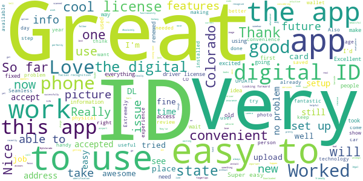
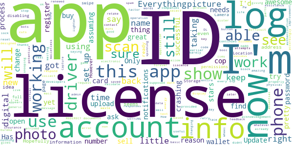
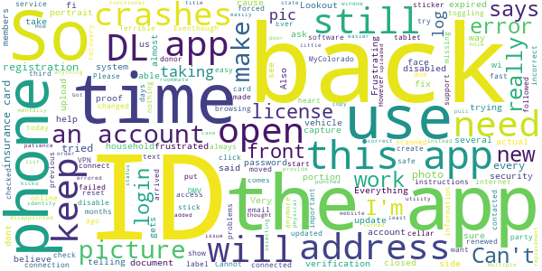
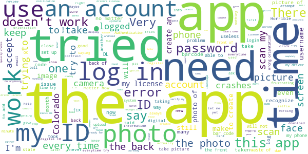

# myColorado
App version ``4.2``

Analyzed with [covid-apps-observer](http://github.com/covid-apps-observer) project, version ``0.1``

## App overview
| | |
|-------------------------|-------------------------| 
| **Name**&nbsp;&nbsp;&nbsp;&nbsp;&nbsp;&nbsp;&nbsp;&nbsp;&nbsp;&nbsp;&nbsp;&nbsp;&nbsp;&nbsp;&nbsp;&nbsp;&nbsp;&nbsp;&nbsp;&nbsp;&nbsp;&nbsp;&nbsp;&nbsp;&nbsp;&nbsp;&nbsp;&nbsp;&nbsp;&nbsp;&nbsp;&nbsp;&nbsp;&nbsp;&nbsp;&nbsp;&nbsp;&nbsp;&nbsp;&nbsp;  | myColorado |
| **Unique identifier** | com.soc.mycolorado |
| **Link to Google Play** | [https://play.google.com/store/apps/details?id=com.soc.mycolorado](https://play.google.com/store/apps/details?id=com.soc.mycolorado) |
| **Summary**  | The State of Colorado&#39;s Official Mobile App |
| **Privacy policy** | [https://mycolorado.state.co.us/privacy-policy](https://mycolorado.state.co.us/privacy-policy) |
| **Latest version** | 4.2 |
| **Last update** | 2021-03-16 19:10:21 |
| **Recent changes** | Ability to add a digital Colorado fishing license to the app Wallet. |
| **Installs**  | 50,000+ |
| **Category** | Business |
| **First release** | Jan 2, 2019 |
| **Size**  | 75M |
| **Supported Android version**  | - |

### Description
> As the State of Colorado's official mobile app, myColorado™ provides a simple, secure and convenient way to show proof of identity and access state services.
 With myColorado™, you can:
 - create a Colorado Digital ID™ to complement your physical ID card for in-state use
 - renew your driver license or state ID
 - securely store payment information for future transactions
 - quickly find official online government resources with the State Services search function
 - link to state agency services, such as myDMV, state job search, and COVID-19 information
 - contact the myColorado support team through Chat
 - store your vehicle registration and insurance card in the Wallet
 The myColorado app requires Android OS version 8.1 or higher.
 myColorado™ is your trusted source to interact with state services anytime, anywhere. Skip the trip so you can go out and experience colorful Colorado!

### User interface
The developers of the app provide the following screenshots in the Google play store.
| | | |
|:-------------------------:|:-------------------------:|:-------------------------:|
 |   |   |   | 
 |  

## Development team
In the following we report the main information provided by the development team in the Google play store.

| | |
|-------------------------|-------------------------|
| **Developer**  | State of Colorado - Governor's Office of IT |
| **Website**  | [http://myColorado.state.co.us](http://myColorado.state.co.us) |
| **Email** | myColorado@state.co.us |
| **Physical address**  | - |
| **Other developed apps**  | [https://play.google.com/store/apps/developer?id=State+of+Colorado+-+Governor's+Office+of+IT](https://play.google.com/store/apps/developer?id=State+of+Colorado+-+Governor's+Office+of+IT) |

## Android support

| | |
|-------------------------|-------------------------|
| **Declared target Android version**  | Android10, version 10 (API level 29) |
| **Effective target Android version**  | Android10, version 10 (API level 29) |
| **Minimum supported Android version**  | Oreo, version 8.1.0 (API level 27) |
| **Maximum target Android version**  | - |

The larger the difference between the minimum and maximum supported Android versions, the better. A larger difference means a wider audience. For example, old phones have a very low Android version, so a high minimum supported Android version means that the app cannot be used by users with old phones, thus leading to accessibility problems. 

## Requested permissions

In the following we report the complete list of the permissions requested by the app. 

| **Permission** | **Protection level** | **Description** | 
|-------------------------|-------------------------|-------------------------|
 **android.permission ACCESS_COARSE_LOCATION** | :warning:**Dangerous** | Allows an app to access approximate location. 
 **android.permission ACCESS_FINE_LOCATION** | :warning:**Dangerous** | Allows an app to access precise location. 
 **android.permission ACCESS_NETWORK_STATE** | Normal | Allows applications to access information about networks. 
 **android.permission ACCESS_WIFI_STATE** | Normal | Allows applications to access information about Wi-Fi networks. 
 **android.permission CAMERA** | :warning:**Dangerous** | Required to be able to access the camera device. 
 **android.permission CHANGE_NETWORK_STATE** | Normal | Allows applications to change network connectivity state. 
 **android.permission INTERNET** | Normal | Allows applications to open network sockets. 
 **android.permission READ_EXTERNAL_STORAGE** | :warning:**Dangerous** | Allows an application to read from external storage. 
 **android.permission READ_PHONE_STATE** | :warning:**Dangerous** | Allows read only access to phone state, including the phone number of the device, current cellular network information, the status of any ongoing calls, and a list of any PhoneAccounts registered on the device. 
 **android.permission USE_BIOMETRIC** | Normal | Allows an app to use device supported biometric modalities. 
 **android.permission USE_FINGERPRINT** | Normal | This constant was deprecated in API level 28. Applications should request USE_BIOMETRIC instead 
 **android.permission WAKE_LOCK** | Normal | Allows using PowerManager WakeLocks to keep processor from sleeping or screen from dimming. 
 **android.permission WRITE_EXTERNAL_STORAGE** | :warning:**Dangerous** | Allows an application to write to external storage. 
 **com.google.android.c2dm.permission RECEIVE** | - | - 
 **com.google.android.finsky.permission BIND_GET_INSTALL_REFERRER_SERVICE** | - | - 

## Mentioned servers

| **Server** | **Registrant** | **Registrant country** | **Creation date** | 
|-------------------------|-------------------------|-------------------------|-------------------------|
 | amazonaws.com | Amazon.com, Inc. | :us: US | 2005-08-18 02:10:45 |
 | w3.org | W3C | :us: US | 1994-07-06 04:00:00 |
 | googlesyndication.com | Google LLC | :us: US | 2003-01-21 06:17:24 |
 | google.com | Google LLC | :us: US | 1997-09-15 04:00:00 |
 | app-measurement.com | Google LLC | :us: US | 2015-06-19 20:13:31 |
 | aws-mycolorado.com | Whois Privacy Service | :us: US | 2018-04-17 13:42:13 |
 | oit-shared.com | Whois Privacy Service | :us: US | 2018-06-30 13:57:22 |
 | amazonaws.com | Amazon.com, Inc. | :us: US | 2005-08-18 02:10:45 |
 | crashlytics.com | Google LLC | :us: US | 2011-01-21 15:30:40 |
 | amazonaws.com | Amazon.com, Inc. | :us: US | 2005-08-18 02:10:45 |
 | googleapis.com | Google LLC | :us: US | 2005-01-25 17:52:26 |
 | googleadservices.com | Google LLC | :us: US | 2003-06-19 16:34:53 |
 | state.co.us | State of Colorado | :us: US | 2003-02-05 13:01:22 |

## Security analysis 

Below we report the main security warnings raised by our execution of the [Androwarn](https://github.com/maaaaz/androwarn) security analysis tool.

**Telephony identifiers leakage**
> - This application reads the ISO country code equivalent for the SIM provider's country code 
> - This application reads the ISO country code equivalent of the current registered operator's MCC (Mobile Country Code) 
> - This application reads the MCC+MNC of the provider of the SIM 
> - This application reads the SIM's serial number 
> - This application reads the alphabetic identifier associated with the voice mail number 
> - This application reads the constant indicating the state of the device SIM card 
> - This application reads the current data connection state 
> - This application reads the current location of the device 
> - This application reads the device phone type value 
> - This application reads the numeric name (MCC+MNC) of current registered operator 
> - This application reads the operator name 
> - This application reads the phone number string for line 1, for example, the MSISDN for a GSM phone 
> - This application reads the software version number for the device, for example, the IMEI/SV for GSM phones 
> - This application reads the unique device ID, i.e the IMEI for GSM and the MEID or ESN for CDMA phones 
> - This application reads the unique subscriber ID, for example, the IMSI for a GSM phone 
> - This application reads the voice mail number 
> - This application reads the Cell ID value 
> - This application reads the Location Area Code value 

**Connection interfaces exfiltration**
> - This application reads details about the currently active data network 
> - This application tries to find out if the currently active data network is metered 

**Telephony services abuse**
> - This application makes phone calls 

**Suspicious connection establishment**
> - This application opens a Socket and connects it to the remote address 'Ljava/lang/Object;->toString()Ljava/lang/String;' on the 'N/A' port  
> - This application opens a Socket and connects it to the remote address 'Ljava/lang/StringBuilder;->toString()Ljava/lang/String;' on the 'N/A' port  
> - This application opens a Socket and connects it to the remote address 'Ljava/net/Proxy;->type()Ljava/net/Proxy$Type;' on the 'N/A' port  
> - This application opens a Socket and connects it to the remote address 'Ljava/net/SocketException;' on the 'N/A' port  
> - This application opens a Socket and connects it to the remote address 'No route to  ' on the 'N/A' port  
> - This application opens a Socket and connects it to the remote address 'timeout' on the 'N/A' port  

**Pim data leakage**
> - This application accesses the downloads folder 

**Code execution**
> - This application loads a native library 
> - This application loads a native library: 'PhoenixAndroid' 
> - This application loads a native library: 'jniPdfium' 
> - This application loads a native library: 'modft2' 
> - This application loads a native library: 'modpdfium' 
> - This application loads a native library: 'modpng' 
> - This application executes a UNIX command 

## User ratings and reviews

Below we provide information about how end users are reacting to the app in terms of ratings and reviews in the Google Play store.

### Ratings

The myColorado app has been installed by more than **50000** times. At this time, **704** rated the app and its average score is **4.098039**. Below we show the distribution of the ratings across the usual star-based rating of Google Play

:star::star::star::star::star:: 471

:star::star::star::star:: 83

:star::star::star:: 13

:star::star:: 27

:star:: 110

### Reviews 

#### 5-star reviews

> Very exceptional app  :date: __2021-03-28 03:40:48__

> Great way to step into the future of technology 🙌 👏  :date: __2021-03-22 16:45:37__

> (UPDATE: They've fixed all of my previous issues and vastly improved the user interface. If only car dealers accepted the digital DL, then it'd be flawless.) Absolutely useless app. I tried scanning my ID on multiple phones, only to have nothing happen. Tried on my LG, Samsung, Iphone, and tablets with the same result accross all platforms.  :date: __2021-03-22 06:57:28__

> Whatever issues with the march update isn't affecting my use. Love it and super easy to use!!  :date: __2021-03-21 21:58:24__

> Now that most of the bugs are worked out, it's great. they do need to do a better job of explaining that the picture it takes is for facial recognition to prove that you're the person on your ID and not that it's taking a new picture for the ID.  :date: __2021-03-21 13:12:02__

> The app itself is good, I haven't the chance to use it yet but I like that I can share everything with one click if needed  :date: __2021-03-20 13:14:55__

> Very convenient would be nice if this would serve as a federal ID  :date: __2021-03-17 04:29:38__

> What a wonderful way to access your ID in the Digital age. I applaud Gov. Polis for being instrumental in giving Coloradoans access to their content digitally.  :date: __2021-03-16 21:34:38__

> Super easy  :date: __2021-03-16 17:51:00__

> Great info on Colorado  :date: __2021-03-16 15:30:26__

#### 4-star reviews

> Works well. Good list of resourses  :date: __2021-02-21 23:45:41__

> Very innovative app, works way better than when fist released. I do have two issues with the app. 1) The login process is required too many times and can be a tedious & lengthy process. Often verification code needs to be resent more than once. 2) Many businesses do not accept the digital ID due them not having a compatible POS - so they can't scan it. Furthermore, the lack of awareness about that ID is by far the biggest flaw. Awareness by the businesses needs to be ramped up.  :date: __2021-02-21 15:50:58__

> Very practical  :date: __2021-02-18 00:31:00__

> The app is great and is very convenient specially sens you don't ever go anywhere with out our phones so you always have your id with you this way! I just wish you were able to use it at more places and able to use it to cash checks and wat not but besides those few things it's an amazing idea thanks alot  :date: __2021-02-14 06:06:20__

> Prizon Free..as in not anymore.m..  :date: __2021-02-13 21:38:38__

> Love it  :date: __2021-02-02 18:16:54__

> Easy app and services  :date: __2021-01-15 05:58:17__

> Good  :date: __2021-01-12 01:43:44__

> Good  :date: __2020-12-11 15:53:14__

> Tricky to get set up but after that works like a charm  :date: __2020-12-02 23:26:24__

#### 3-star reviews

> 2 factor authentication not working. I've been waiting for 15 mins for the code to be text to me so I can buy a lighter and nothing! It's a waste of energy. ---Sure, thanks for the acknowledgement. 👍When this app is working, its amazing.  :date: __2021-03-25 05:22:11__

> When and if I'm allowed to use this electronic ID to show to a cop I should be able to "lock" everything else so cop can stop and prevent snooping in my phone other than the ID itself.  :date: __2021-03-08 17:03:23__

> Can't get it to scan my id in????  :date: __2021-02-26 21:16:20__

> Keeps crashing when I try to upload an insurance ID card. Everything else is awesome!  :date: __2021-02-01 20:44:35__

> pretty 🆒  :date: __2021-01-14 19:25:48__

> THIS APP IS HARD TO SET UP AND IT KEEPS REDIRECT ME .BUT NOT LETTING ME LOG IN  :date: __2020-12-21 09:32:36__

> This app saved my life but now it keep saying retry otp and now I can't use it for my I'd. How I'm supposed to buy my essential things with no I'd!  :date: __2020-09-25 20:54:47__

> Photo Capture does not work properly for live photo of physical face!! Has already provided feedback for the app developers 👍  :date: __2020-08-19 02:03:21__

> \*\*\*\*\*\*\*\**Update\*\*\*\*\*\** I had to dump all non basic operation apps off my phone to get every thing to process through, but Eureka success! All this app does is collect your data to sell I'm assuming. But it will have you set up an account just to not allow you to log into it after. And when you ask for assistance or request what companies they sell your info to, so you can block their spam, you get generic responses. Assuming these are bots designed to find key words and respond accordingly.  :date: __2020-07-30 23:54:34__

> Only after 10 attempts (using my new DL that just arrived in the mail earlier that day) was it able to register my driver's liscence in the virtual wallet. Other than taking forever to scan my documents, the app is pretty darn good.  :date: __2020-07-29 04:06:34__

#### 2-star reviews

> Terrible third-party software for text verification and face ID.  :date: __2021-03-19 02:33:43__

> The app says I have no internet connection. Eventhough I am connected to wi-fi or cellar. When toggling my wi-fi off then on, when the app is open, it crashes. Also, when trying to open the insurance cards, the app crashes. I believe it is due to Lookout security app safe browsing VPN. When this service is disabled, the app is able to connect. I believe this app should work with lookout security app where I'm not forced to disable it if I want to use this app.  :date: __2021-03-18 19:30:27__

> MyColorado app failed. Ever since the app was updated, the insurance cards portion doesn't open the document and once you click to open it the app crashes on all my phone's and tablet. Please update this to fix the insurance card portion.  :date: __2021-03-18 03:49:21__

> Can't start up error for days  :date: __2021-03-03 00:17:19__

> My household moved 5 months ago & 6 of us changed our address online through DMV & followed the instructions to stick a label on the back of our DL's with the new address. However when I scanned the back of my DL today to try to create an account, my information still had my previous address. So this app really won't help me or any of my household members because the address will always be incorrect & cause problems for us in which we will still have to show our actual DL with the sticker.  :date: __2020-11-17 19:24:28__

> Cannot access my account anymore. The account recovery should work. I put in my email address but nothing comes back to reset my password.  :date: __2020-10-10 20:29:38__

> So, just renewed my license and while it was easy and the card arrived fast, it was missing the donor heart. I contacted support and they said it was not checked but I 100% did check it as it is really important to me so I made sure. They will not fix it! Really disappointed as the system errored and they will not correct it.  :date: __2020-10-10 05:51:46__

> Everything I upload the front side of my ID it kicks me out and makes me login in again??  :date: __2020-09-08 00:43:05__

> Frustrating. Trying to help roommate update his state id. Got to taking pics of id but then it would ask to log in after taking pic of back id. Multiple times. Hes mentally disabled and gets so frustrated that he almost punched a hole through a door window... he has little patience and gets so frustrated easily with almost anything.  :date: __2020-06-20 16:55:34__

> Need more documents  :date: __2020-05-26 17:43:27__

#### 1-star reviews

> I was so excited to download this app only to be shut out EVERY TIME I TRY TO SCAN MY ID! Please iron out the kinks and I will be sure to come back for a 5 star review.  :date: __2021-03-27 02:04:15__

> Captures too much phone info. Spyware.  :date: __2021-03-20 19:52:26__

> It says the app isn't working 😕  :date: __2021-03-12 04:20:44__

> Who designed this piece of junk? I can't get it to recognize my face, or even scan my license. What a waste of time  :date: __2021-03-10 01:13:10__

> Freezes every time i attempt to scan barcode. Tried both on and off wifi. Reinstalled multiple times. Ensured all permissions are allowed. Then when i try to chat for help, i get queued for 26 minutes until it closes on a Friday. I need help. If you're moving this direction, you still need humans to address concerns.  :date: __2021-03-06 01:51:13__

> App doesn't work don't bother downloading waste of time. I tried making an account and it said I already made one when I tried to make it the night before it claimed the site was down and to try the next morning.  :date: __2021-02-24 22:58:24__

> I even took a screen shot of my username and password and its still not letting me log in???  :date: __2021-02-24 19:07:01__

> Just downloaded the app, I'm trying to create an account and its not scanning the bar code on the back of my ID. The app closes completely everytime I have tried. It's getting a little frustrating.  :date: __2021-02-24 17:15:47__

> Everytime i try to setup my account i scan the back of my DL and then the app crashes.  :date: __2021-02-22 17:40:53__

> Horrible  :date: __2021-02-19 18:15:50__

