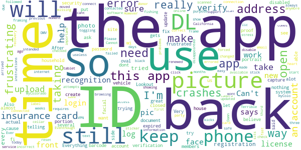

# myColorado
App version ``4.5``

Analyzed with [covid-apps-observer](http://github.com/covid-apps-observer) project, version ``0.1``

## App overview
| | |
|-------------------------|-------------------------| 
| **Name**&nbsp;&nbsp;&nbsp;&nbsp;&nbsp;&nbsp;&nbsp;&nbsp;&nbsp;&nbsp;&nbsp;&nbsp;&nbsp;&nbsp;&nbsp;&nbsp;&nbsp;&nbsp;&nbsp;&nbsp;&nbsp;&nbsp;&nbsp;&nbsp;&nbsp;&nbsp;&nbsp;&nbsp;&nbsp;&nbsp;&nbsp;&nbsp;&nbsp;&nbsp;&nbsp;&nbsp;&nbsp;&nbsp;&nbsp;&nbsp;  | myColorado |
| **Unique identifier** | com.soc.mycolorado |
| **Link to Google Play** | [https://play.google.com/store/apps/details?id=com.soc.mycolorado](https://play.google.com/store/apps/details?id=com.soc.mycolorado) |
| **Summary**  | The State of Colorado&#39;s Official Mobile App |
| **Privacy policy** | [https://mycolorado.state.co.us/privacy-policy](https://mycolorado.state.co.us/privacy-policy) |
| **Latest version** | 4.5 |
| **Last update** | 2021-04-30 15:45:18 |
| **Recent changes** | Minor Bug Fixes. |
| **Installs**  | 50,000+ |
| **Category** | Business |
| **First release** | Jan 2, 2019 |
| **Size**  | 75M |
| **Supported Android version**  | - |

### Description
> As the State of Colorado's official mobile app, myColorado™ provides a simple, secure and convenient way to show proof of identity and access state services.
 With myColorado™, you can:
 - create a Colorado Digital ID™ to complement your physical ID card for in-state use
 - renew your driver license or state ID
 - securely store payment information for future transactions
 - quickly find official online government resources with the State Services search function
 - link to state agency services, such as myDMV, state job search, and COVID-19 information
 - contact the myColorado support team through Chat
 - store your vehicle registration and insurance card in the Wallet
 The myColorado app requires Android OS version 8.1 or higher.
 myColorado™ is your trusted source to interact with state services anytime, anywhere. Skip the trip so you can go out and experience colorful Colorado!

### User interface
The developers of the app provide the following screenshots in the Google play store.
| | | |
|:-------------------------:|:-------------------------:|:-------------------------:|
 |   |   |   | 
 |  

## Development team
In the following we report the main information provided by the development team in the Google play store.

| | |
|-------------------------|-------------------------|
| **Developer**  | State of Colorado - Governor's Office of IT |
| **Website**  | [http://myColorado.state.co.us](http://myColorado.state.co.us) |
| **Email** | myColorado@state.co.us |
| **Physical address**  | - |
| **Other developed apps**  | [https://play.google.com/store/apps/developer?id=State+of+Colorado+-+Governor's+Office+of+IT](https://play.google.com/store/apps/developer?id=State+of+Colorado+-+Governor's+Office+of+IT) |

## Android support

| | |
|-------------------------|-------------------------|
| **Declared target Android version**  | Android10, version 10 (API level 29) |
| **Effective target Android version**  | Android10, version 10 (API level 29) |
| **Minimum supported Android version**  | Oreo, version 8.1.0 (API level 27) |
| **Maximum target Android version**  | - |

The larger the difference between the minimum and maximum supported Android versions, the better. A larger difference means a wider audience. For example, old phones have a very low Android version, so a high minimum supported Android version means that the app cannot be used by users with old phones, thus leading to accessibility problems. 

## Requested permissions

In the following we report the complete list of the permissions requested by the app. 

| **Permission** | **Protection level** | **Description** | 
|-------------------------|-------------------------|-------------------------|
 **android.permission ACCESS_COARSE_LOCATION** | :warning:**Dangerous** | Allows an app to access approximate location. 
 **android.permission ACCESS_FINE_LOCATION** | :warning:**Dangerous** | Allows an app to access precise location. 
 **android.permission ACCESS_NETWORK_STATE** | Normal | Allows applications to access information about networks. 
 **android.permission ACCESS_WIFI_STATE** | Normal | Allows applications to access information about Wi-Fi networks. 
 **android.permission CAMERA** | :warning:**Dangerous** | Required to be able to access the camera device. 
 **android.permission CHANGE_NETWORK_STATE** | Normal | Allows applications to change network connectivity state. 
 **android.permission INTERNET** | Normal | Allows applications to open network sockets. 
 **android.permission READ_EXTERNAL_STORAGE** | :warning:**Dangerous** | Allows an application to read from external storage. 
 **android.permission READ_PHONE_STATE** | :warning:**Dangerous** | Allows read only access to phone state, including the phone number of the device, current cellular network information, the status of any ongoing calls, and a list of any PhoneAccounts registered on the device. 
 **android.permission USE_BIOMETRIC** | Normal | Allows an app to use device supported biometric modalities. 
 **android.permission USE_FINGERPRINT** | Normal | This constant was deprecated in API level 28. Applications should request USE_BIOMETRIC instead 
 **android.permission WAKE_LOCK** | Normal | Allows using PowerManager WakeLocks to keep processor from sleeping or screen from dimming. 
 **android.permission WRITE_EXTERNAL_STORAGE** | :warning:**Dangerous** | Allows an application to write to external storage. 
 **com.google.android.c2dm.permission RECEIVE** | - | - 
 **com.google.android.finsky.permission BIND_GET_INSTALL_REFERRER_SERVICE** | - | - 

## Mentioned servers

| **Server** | **Registrant** | **Registrant country** | **Creation date** | 
|-------------------------|-------------------------|-------------------------|-------------------------|
 | amazonaws.com | Amazon.com, Inc. | :us: US | 2005-08-18 02:10:45 |
 | w3.org | W3C | :us: US | 1994-07-06 04:00:00 |
 | googlesyndication.com | Google LLC | :us: US | 2003-01-21 06:17:24 |
 | google.com | Google LLC | :us: US | 1997-09-15 04:00:00 |
 | app-measurement.com | Google LLC | :us: US | 2015-06-19 20:13:31 |
 | aws-mycolorado.com | Whois Privacy Service | :us: US | 2018-04-17 13:42:13 |
 | oit-shared.com | Whois Privacy Service | :us: US | 2018-06-30 13:57:22 |
 | amazonaws.com | Amazon.com, Inc. | :us: US | 2005-08-18 02:10:45 |
 | crashlytics.com | Google LLC | :us: US | 2011-01-21 15:30:40 |
 | amazonaws.com | Amazon.com, Inc. | :us: US | 2005-08-18 02:10:45 |
 | googleapis.com | Google LLC | :us: US | 2005-01-25 17:52:26 |
 | googleadservices.com | Google LLC | :us: US | 2003-06-19 16:34:53 |
 | state.co.us | State of Colorado | :us: US | 2003-02-05 13:01:22 |

## Security analysis 

Below we report the main security warnings raised by our execution of the [Androwarn](https://github.com/maaaaz/androwarn) security analysis tool.

**Telephony identifiers leakage**
> - This application reads the ISO country code equivalent for the SIM provider's country code 
> - This application reads the ISO country code equivalent of the current registered operator's MCC (Mobile Country Code) 
> - This application reads the MCC+MNC of the provider of the SIM 
> - This application reads the SIM's serial number 
> - This application reads the alphabetic identifier associated with the voice mail number 
> - This application reads the constant indicating the state of the device SIM card 
> - This application reads the current data connection state 
> - This application reads the current location of the device 
> - This application reads the device phone type value 
> - This application reads the numeric name (MCC+MNC) of current registered operator 
> - This application reads the operator name 
> - This application reads the phone number string for line 1, for example, the MSISDN for a GSM phone 
> - This application reads the software version number for the device, for example, the IMEI/SV for GSM phones 
> - This application reads the unique device ID, i.e the IMEI for GSM and the MEID or ESN for CDMA phones 
> - This application reads the unique subscriber ID, for example, the IMSI for a GSM phone 
> - This application reads the voice mail number 
> - This application reads the Cell ID value 
> - This application reads the Location Area Code value 

**Connection interfaces exfiltration**
> - This application reads details about the currently active data network 
> - This application tries to find out if the currently active data network is metered 

**Telephony services abuse**
> - This application makes phone calls 

**Suspicious connection establishment**
> - This application opens a Socket and connects it to the remote address 'Ljava/lang/Object;->toString()Ljava/lang/String;' on the 'N/A' port  
> - This application opens a Socket and connects it to the remote address 'Ljava/lang/StringBuilder;->toString()Ljava/lang/String;' on the 'N/A' port  
> - This application opens a Socket and connects it to the remote address 'Ljava/net/Proxy;->type()Ljava/net/Proxy$Type;' on the 'N/A' port  
> - This application opens a Socket and connects it to the remote address 'Ljava/net/SocketException;' on the 'N/A' port  
> - This application opens a Socket and connects it to the remote address 'No route to  ' on the 'N/A' port  
> - This application opens a Socket and connects it to the remote address 'timeout' on the 'N/A' port  

**Pim data leakage**
> - This application accesses the downloads folder 

**Code execution**
> - This application loads a native library 
> - This application loads a native library: 'PhoenixAndroid' 
> - This application loads a native library: 'jniPdfium' 
> - This application loads a native library: 'modft2' 
> - This application loads a native library: 'modpdfium' 
> - This application loads a native library: 'modpng' 
> - This application executes a UNIX command 

## User ratings and reviews

Below we provide information about how end users are reacting to the app in terms of ratings and reviews in the Google Play store.

### Ratings

The myColorado app has been installed by more than **50000** times. At this time, **865** rated the app and its average score is **3.5247524**. Below we show the distribution of the ratings across the usual star-based rating of Google Play

:star::star::star::star::star:: 446

:star::star::star::star:: 85

:star::star::star:: 60

:star::star:: 25

:star:: 249

### Reviews 

#### 5-star reviews

> Great way entering the digital age  :date: __2021-05-28 08:20:59__

> Fantastic  :date: __2021-05-27 20:15:19__

> Has areas to put registrations, insurance, parks passes, permits, even your MMJ Card, more stuff added, a great Colorado app.  :date: __2021-05-27 13:45:17__

> Super awesome! Very glad to see this come together and work SO well!! My new go to!  :date: __2021-05-27 03:49:05__

> Well made app and useful for storing other important documents.  :date: __2021-05-27 01:06:01__

> Good  :date: __2021-05-26 14:32:06__

> Having this app saved me time and heartache when I lost my ID and needed to prove my identity! It was easy to set up but I had no idea how incredible it would be in my future! Thank you My Colorado!  :date: __2021-05-26 04:40:54__

> Very good but still have not received my ID since 4/4/2021  :date: __2021-05-24 22:00:50__

> Easy to use minimum facts needed pleased overall  :date: __2021-05-24 06:43:16__

> This app is great, no idea what the others are saying. Easy to add vaccine card, insurance cards, fishing licenses. I can't wait until this gets more adoption across the state (and nation).  :date: __2021-05-22 22:40:55__

#### 4-star reviews

> Fixed the camera issue with an update, works fine now. Lots of redirects but otherwise great.  :date: __2021-05-28 23:27:06__

> Won't upload my fishing license  :date: __2021-05-26 19:11:27__

> Quick and Easy  :date: __2021-05-20 05:21:48__

> A bit complicated to set up due to security items, but I really like having my drivers license, fishing license, etc, easily avaliable  :date: __2021-05-19 16:30:54__

> Love the app however it's kind of a pain to get a verification every time you need to use it  :date: __2021-05-17 21:47:54__

> Its helpful I just wish more ppl accepted it.  :date: __2021-05-12 14:37:19__

> This is a life saver app in just a swipe for verification purposes. Just wish we can use this "now" to travel legally since everything are electronic based... but i can wait.  :date: __2021-05-10 20:26:49__

> I saw other comments about the digital ID not recognizing them the same day they went to the DMV. I gave it a try after I went in yesterday and got the same error message as everyone else. I gave it another try today and it worked! Looks like it takes a bit of time for their system to update, which is understandable. A government app that kinda works... what a nice surprise! 4 stars!  :date: __2021-04-28 02:33:45__

> I finally got the app to work for me. The devs should really make this app less difficult to use.  :date: __2021-04-27 09:38:45__

> Awesome.  :date: __2021-04-24 14:37:05__

#### 3-star reviews

> It's cool works 50/50 some people take it some dont  :date: __2021-05-25 22:10:37__

> Confusing to use. It wanted me to center my face in an oval, but then just hung.  :date: __2021-05-12 05:46:10__

> Nice but missing alot .. good luck businesses excepting it !  :date: __2021-04-24 11:16:20__

> Bugs for days But the idea is phonemial  :date: __2021-04-21 02:26:35__

> Used to keep me logged in. Know I have to log in every time and the app has to ping my phone evert time 🤔🥴  :date: __2021-04-19 22:26:24__

> In all honesty the quality,functionality, clarity, ease of use is brilliant the app is amazing and will be worth 5 stars when it is accepted as a real ID. Only reason I gave it a 3 is because it is not accepted for identity validation for investment platforms.  :date: __2021-04-14 00:42:03__

> 2 factor authentication not working. I've been waiting for 15 mins for the code to be text to me so I can buy a lighter and nothing! It's a waste of energy. ---Sure, thanks for the acknowledgement. 👍When this app is working, its amazing.  :date: __2021-03-25 05:22:11__

> Can't get it to scan my id in????  :date: __2021-02-26 21:16:20__

> Keeps crashing when I try to upload an insurance ID card. Everything else is awesome!  :date: __2021-02-01 20:44:35__

> pretty 🆒  :date: __2021-01-14 19:25:48__

#### 2-star reviews

> When it wants to verify me by taking a picture the oval frame is black and wont take a picture. The app is useless to me if i cant use it for its intended purpose.  :date: __2021-05-11 16:14:20__

> Have had 2021 fishing lic for 3 weeks and it's still not available on myColo????  :date: __2021-04-23 01:26:14__

> I'm sure it's a great site, but it does not let me create a site with my California DL.  :date: __2021-04-15 22:12:39__

> Damn camera will not scan the barcode on back of i.d. really frustrating if only I could use this it would save me alot of stress and help me alot at the moment  :date: __2021-04-15 12:07:20__

> It keeps showing error all the time I try to upload my insurance cards  :date: __2021-04-09 15:41:45__

> In my house and put that in your house In  :date: __2021-04-09 10:02:00__

> To verify the first time it requires you to use facial recognition by framing your face in an oval. After three attempts, each time the app just sits there, no way to verify the facial recognition, no way to do over, just nothing. Frustrating.  :date: __2021-04-09 01:43:26__

> Terrible third-party software for text verification and face ID.  :date: __2021-03-19 02:33:43__

> The app says I have no internet connection. Eventhough I am connected to wi-fi or cellar. When toggling my wi-fi off then on, when the app is open, it crashes. Also, when trying to open the insurance cards, the app crashes. I believe it is due to Lookout security app safe browsing VPN. When this service is disabled, the app is able to connect. I believe this app should work with lookout security app where I'm not forced to disable it if I want to use this app.  :date: __2021-03-18 19:30:27__

> MyColorado app failed. Ever since the app was updated, the insurance cards portion doesn't open the document and once you click to open it the app crashes on all my phone's and tablet. Please update this to fix the insurance card portion.  :date: __2021-03-18 03:49:21__

#### 1-star reviews

> Worst app ever. Forgot my user name and password now I can't retrieve it because I don't remember my user name it should be under your email or the app should keep you logged in if you check that box and I did thanks for making this app not user friendly  :date: __2021-05-29 21:44:54__

> I have had only about 1/8 success getting the app to work...  :date: __2021-05-29 03:59:15__

> This ping sso must have been implemented by a 5-year-old! Constant problems sucks that I have to use this app...  :date: __2021-05-28 18:28:54__

> Useless piece of poop.  :date: __2021-05-26 16:34:49__

> It won't let me access it or send me the verification text code... Frustrating  :date: __2021-05-25 22:01:14__

> Now it has a big BUG.. it does not log you back in after the update..  :date: __2021-05-24 18:45:00__

> Licenses won't load, call service is awful  :date: __2021-05-21 20:58:58__

> Can't login  :date: __2021-05-20 15:43:49__

> Garbage app  :date: __2021-05-20 03:13:54__

> "We're sorry, we cannot match your selfie with your DMV picture." Meaning we didn't get a full facial map for our data mining endeavors.  :date: __2021-05-19 23:20:43__

