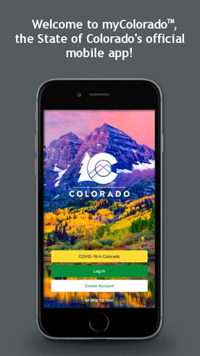
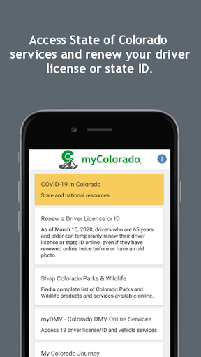
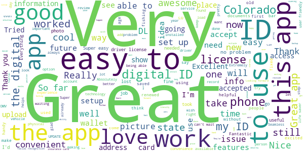
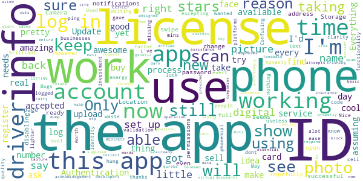
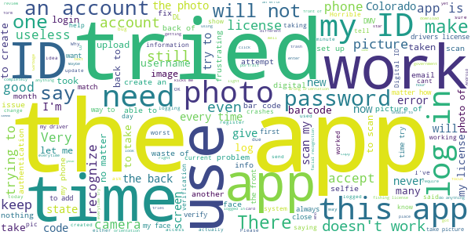

# myColorado
App version ``4.6``

Analyzed with [covid-apps-observer](http://github.com/covid-apps-observer) project, version ``0.1``

## App overview
| | |
|-------------------------|-------------------------| 
| **Name**&nbsp;&nbsp;&nbsp;&nbsp;&nbsp;&nbsp;&nbsp;&nbsp;&nbsp;&nbsp;&nbsp;&nbsp;&nbsp;&nbsp;&nbsp;&nbsp;&nbsp;&nbsp;&nbsp;&nbsp;&nbsp;&nbsp;&nbsp;&nbsp;&nbsp;&nbsp;&nbsp;&nbsp;&nbsp;&nbsp;&nbsp;&nbsp;&nbsp;&nbsp;&nbsp;&nbsp;&nbsp;&nbsp;&nbsp;&nbsp;  | myColorado |
| **Unique identifier** | com.soc.mycolorado |
| **Link to Google Play** | [https://play.google.com/store/apps/details?id=com.soc.mycolorado](https://play.google.com/store/apps/details?id=com.soc.mycolorado) |
| **Summary**  | The State of Colorado&#39;s Official Mobile App |
| **Privacy policy** | [https://mycolorado.state.co.us/privacy-policy](https://mycolorado.state.co.us/privacy-policy) |
| **Latest version** | 4.6 |
| **Last update** | 2021-06-04 10:19:26 |
| **Recent changes** | Minor Bug Fixes. |
| **Installs**  | 50,000+ |
| **Category** | Business |
| **First release** | Jan 2, 2019 |
| **Size**  | 75M |
| **Supported Android version**  | - |

### Description
> As the State of Colorado's official mobile app, myColorado™ provides a simple, secure and convenient way to show proof of identity and access state services.
 With myColorado™, you can:
 - create a Colorado Digital ID™ to complement your physical ID card for in-state use
 - renew your driver license or state ID
 - securely store payment information for future transactions
 - quickly find official online government resources with the State Services search function
 - link to state agency services, such as myDMV, state job search, and COVID-19 information
 - contact the myColorado support team through Chat
 - store your vehicle registration and insurance card in the Wallet
 The myColorado app requires Android OS version 8.1 or higher.
 myColorado™ is your trusted source to interact with state services anytime, anywhere. Skip the trip so you can go out and experience colorful Colorado!

### User interface
The developers of the app provide the following screenshots in the Google play store.
| | | |
|:-------------------------:|:-------------------------:|:-------------------------:|
 |   |   |   | 
 |  

## Development team
In the following we report the main information provided by the development team in the Google play store.

| | |
|-------------------------|-------------------------|
| **Developer**  | State of Colorado - Governor's Office of IT |
| **Website**  | [http://myColorado.state.co.us](http://myColorado.state.co.us) |
| **Email** | myColorado@state.co.us |
| **Physical address**  | - |
| **Other developed apps**  | [https://play.google.com/store/apps/developer?id=State+of+Colorado+-+Governor's+Office+of+IT](https://play.google.com/store/apps/developer?id=State+of+Colorado+-+Governor's+Office+of+IT) |

## Android support

| | |
|-------------------------|-------------------------|
| **Declared target Android version**  | Android10, version 10 (API level 29) |
| **Effective target Android version**  | Android10, version 10 (API level 29) |
| **Minimum supported Android version**  | Oreo, version 8.1.0 (API level 27) |
| **Maximum target Android version**  | - |

The larger the difference between the minimum and maximum supported Android versions, the better. A larger difference means a wider audience. For example, old phones have a very low Android version, so a high minimum supported Android version means that the app cannot be used by users with old phones, thus leading to accessibility problems. 

## Requested permissions

In the following we report the complete list of the permissions requested by the app. 

| **Permission** | **Protection level** | **Description** | 
|-------------------------|-------------------------|-------------------------|
 **android.permission ACCESS_COARSE_LOCATION** | :warning:**Dangerous** | Allows an app to access approximate location. 
 **android.permission ACCESS_FINE_LOCATION** | :warning:**Dangerous** | Allows an app to access precise location. 
 **android.permission ACCESS_NETWORK_STATE** | Normal | Allows applications to access information about networks. 
 **android.permission ACCESS_WIFI_STATE** | Normal | Allows applications to access information about Wi-Fi networks. 
 **android.permission CAMERA** | :warning:**Dangerous** | Required to be able to access the camera device. 
 **android.permission CHANGE_NETWORK_STATE** | Normal | Allows applications to change network connectivity state. 
 **android.permission INTERNET** | Normal | Allows applications to open network sockets. 
 **android.permission READ_EXTERNAL_STORAGE** | :warning:**Dangerous** | Allows an application to read from external storage. 
 **android.permission READ_PHONE_STATE** | :warning:**Dangerous** | Allows read only access to phone state, including the phone number of the device, current cellular network information, the status of any ongoing calls, and a list of any PhoneAccounts registered on the device. 
 **android.permission USE_BIOMETRIC** | Normal | Allows an app to use device supported biometric modalities. 
 **android.permission USE_FINGERPRINT** | Normal | This constant was deprecated in API level 28. Applications should request USE_BIOMETRIC instead 
 **android.permission WAKE_LOCK** | Normal | Allows using PowerManager WakeLocks to keep processor from sleeping or screen from dimming. 
 **android.permission WRITE_EXTERNAL_STORAGE** | :warning:**Dangerous** | Allows an application to write to external storage. 
 **com.google.android.c2dm.permission RECEIVE** | - | - 
 **com.google.android.finsky.permission BIND_GET_INSTALL_REFERRER_SERVICE** | - | - 

## Mentioned servers

| **Server** | **Registrant** | **Registrant country** | **Creation date** | 
|-------------------------|-------------------------|-------------------------|-------------------------|
 | amazonaws.com | Amazon.com, Inc. | :us: US | 2005-08-18 02:10:45 |
 | w3.org | W3C | :us: US | 1994-07-06 04:00:00 |
 | googlesyndication.com | Google LLC | :us: US | 2003-01-21 06:17:24 |
 | google.com | Google LLC | :us: US | 1997-09-15 04:00:00 |
 | app-measurement.com | Google LLC | :us: US | 2015-06-19 20:13:31 |
 | oit-shared.com | Whois Privacy Service | :us: US | 2018-06-30 13:57:22 |
 | amazonaws.com | Amazon.com, Inc. | :us: US | 2005-08-18 02:10:45 |
 | crashlytics.com | Google LLC | :us: US | 2011-01-21 15:30:40 |
 | amazonaws.com | Amazon.com, Inc. | :us: US | 2005-08-18 02:10:45 |
 | googleapis.com | Google LLC | :us: US | 2005-01-25 17:52:26 |
 | googleadservices.com | Google LLC | :us: US | 2003-06-19 16:34:53 |
 | state.co.us | State of Colorado | :us: US | 2003-02-05 13:01:22 |
 | cloudfront.net | Amazon.com, Inc. | :us: US | 2008-04-25 18:25:49 |
 | aws-mycolorado.com | Whois Privacy Service | :us: US | 2018-04-17 13:42:13 |

## Security analysis 

Below we report the main security warnings raised by our execution of the [Androwarn](https://github.com/maaaaz/androwarn) security analysis tool.

**Telephony identifiers leakage**
> - This application reads the ISO country code equivalent for the SIM provider's country code 
> - This application reads the ISO country code equivalent of the current registered operator's MCC (Mobile Country Code) 
> - This application reads the MCC+MNC of the provider of the SIM 
> - This application reads the SIM's serial number 
> - This application reads the alphabetic identifier associated with the voice mail number 
> - This application reads the constant indicating the state of the device SIM card 
> - This application reads the current data connection state 
> - This application reads the current location of the device 
> - This application reads the device phone type value 
> - This application reads the numeric name (MCC+MNC) of current registered operator 
> - This application reads the operator name 
> - This application reads the phone number string for line 1, for example, the MSISDN for a GSM phone 
> - This application reads the software version number for the device, for example, the IMEI/SV for GSM phones 
> - This application reads the unique device ID, i.e the IMEI for GSM and the MEID or ESN for CDMA phones 
> - This application reads the unique subscriber ID, for example, the IMSI for a GSM phone 
> - This application reads the voice mail number 
> - This application reads the Cell ID value 
> - This application reads the Location Area Code value 

**Connection interfaces exfiltration**
> - This application reads details about the currently active data network 
> - This application tries to find out if the currently active data network is metered 

**Telephony services abuse**
> - This application makes phone calls 

**Suspicious connection establishment**
> - This application opens a Socket and connects it to the remote address 'Ljava/lang/Object;->toString()Ljava/lang/String;' on the 'N/A' port  
> - This application opens a Socket and connects it to the remote address 'Ljava/lang/StringBuilder;->toString()Ljava/lang/String;' on the 'N/A' port  
> - This application opens a Socket and connects it to the remote address 'Ljava/net/Proxy;->type()Ljava/net/Proxy$Type;' on the 'N/A' port  
> - This application opens a Socket and connects it to the remote address 'Ljava/net/SocketException;' on the 'N/A' port  
> - This application opens a Socket and connects it to the remote address 'No route to  ' on the 'N/A' port  
> - This application opens a Socket and connects it to the remote address 'timeout' on the 'N/A' port  

**Pim data leakage**
> - This application accesses the downloads folder 

**Code execution**
> - This application loads a native library 
> - This application loads a native library: 'PhoenixAndroid' 
> - This application loads a native library: 'jniPdfium' 
> - This application loads a native library: 'modft2' 
> - This application loads a native library: 'modpdfium' 
> - This application loads a native library: 'modpng' 
> - This application executes a UNIX command 

## User ratings and reviews

Below we provide information about how end users are reacting to the app in terms of ratings and reviews in the Google Play store.

### Ratings

The myColorado app has been installed by more than **50000** times. At this time, **1027** rated the app and its average score is **3.6960785**. Below we show the distribution of the ratings across the usual star-based rating of Google Play

:star::star::star::star::star:: 544

:star::star::star::star:: 161

:star::star::star:: 50

:star::star:: 10

:star:: 262

### Reviews 

#### 5-star reviews

> Very positive. Lke ID on my phone!!  :date: __2021-06-21 02:43:52__

> Very helpful app  :date: __2021-06-20 22:51:46__

> Left my wallet at home before a night of drinking. When all hope was lost, the bouncer at a bar downtown recommended that I download this app and get my ID virtual because it works scanning-wise. One family member at home and a quick set up later, and I was good to go starting my saga of belligerence. 10/10 wingman this app  :date: __2021-06-19 00:24:27__

> Great way to have a backup of your fishing license and ID in one spot. Bars are starting to accept it as valid ID!  :date: __2021-06-18 04:40:57__

> I think the digital ID is nice and helps a lot if you need it on the go  :date: __2021-06-17 19:10:55__

> Tried to sign up when the servers were down. It works now and is great. Really glad Colorado developed this.  :date: __2021-06-15 20:27:31__

> Buggy for now but it's still new. Very useful when you've forgotten or lost your ID or wallet.  :date: __2021-06-14 17:04:01__

> Login issues resolved great app!  :date: __2021-06-11 22:21:15__

> Went to the DMV literally TODAY, and it will not authenticate me. Says it can't match my photo. I look exactly like i did 3 hours ago, hairstyle, clothes and all. This is absurd.  :date: __2021-06-11 21:27:41__

> Lifesaver  :date: __2021-06-11 19:15:14__

#### 4-star reviews

> Worked for a while, but now it won't open my ID, registration, or insurance card. This app is useless if it's not reliable.  :date: __2021-06-21 00:42:16__

> Tried to access and app wouldn't work. Otherwise would give it a 5  :date: __2021-06-20 05:10:13__

> Digital ID is not working from the home screen, have to go into services then it pulls up.  :date: __2021-06-13 22:31:11__

> The scanning took forever to get right but once you get it working it's good.  :date: __2021-06-11 00:54:00__

> Quick and just what I needed Thanks.  :date: __2021-06-08 07:45:01__

> After some initial troubles the app is now stable and very efficient. More features are being added and it is a useful tool for residents.  :date: __2021-06-04 23:26:39__

> Fixed the camera issue with an update, works fine now. Lots of redirects but otherwise great.  :date: __2021-05-28 23:27:06__

> Won't upload my fishing license  :date: __2021-05-26 19:11:27__

> Quick and Easy  :date: __2021-05-20 05:21:48__

> A bit complicated to set up due to security items, but I really like having my drivers license, fishing license, etc, easily avaliable  :date: __2021-05-19 16:30:54__

#### 3-star reviews

> This app worked fine until april/may 2021. Now the app just crashes. The app is a good idea and nice especially if on a bike so you dont need to carry as much, problem is the app does not and will not stay open. It crashes constantly and some features will not open at all and when tried, it causes the app to crash as well. I wish the powers at be could get this app to actually work. Ride safe, Kg  :date: __2021-06-17 23:40:36__

> It won't let me access it or send me verification code, but thank you for at least responding to my issues here! I just thought it was never going to be addressed, I appreciate that!  :date: __2021-06-12 01:05:14__

> Authentication does not work if cell phone service is not available. May make app useless.  :date: __2021-06-06 07:30:23__

> It's cool works 50/50 some people take it some dont  :date: __2021-05-25 22:10:37__

> Confusing to use. It wanted me to center my face in an oval, but then just hung.  :date: __2021-05-12 05:46:10__

> Nice but missing alot .. good luck businesses excepting it !  :date: __2021-04-24 11:16:20__

> Bugs for days But the idea is phonemial  :date: __2021-04-21 02:26:35__

> Used to keep me logged in. Know I have to log in every time and the app has to ping my phone evert time 🤔🥴  :date: __2021-04-19 22:26:24__

> In all honesty the quality,functionality, clarity, ease of use is brilliant the app is amazing and will be worth 5 stars when it is accepted as a real ID. Only reason I gave it a 3 is because it is not accepted for identity validation for investment platforms.  :date: __2021-04-14 00:42:03__

> 2 factor authentication not working. I've been waiting for 15 mins for the code to be text to me so I can buy a lighter and nothing! It's a waste of energy. ---Sure, thanks for the acknowledgement. 👍When this app is working, its amazing.  :date: __2021-03-25 05:22:11__

#### 2-star reviews

> This app worked perfectly for a while, but now I'm met with "certificate errors" and am unable to view my ID or even get to the login page.  :date: __2021-06-21 06:47:57__

> App keeps crashing when opening insurance section.  :date: __2021-06-19 22:00:54__

> Not for use in any situation where speed or proof of insurance is necessary. Alot of layers of security just to open the app, then I'd get kicked completely out of the app when I tried to open the proof of insurance. Then of course all the security again. I ended up using the paper documents anyway. And didn't we fight a war or something to avoid apps like this anyway?  :date: __2021-06-19 04:59:48__

> Unable to change my phone number from my old number to my new number in the app because it asked for a verification code every time I'm trying to log in which is sent to my old phone number which I don't have access to because it's my old phone number so I don't know how I'm going to access my information because I can't access the account with my old number so this is kind of dumbUnable to change my phone number from my old number to my new number in the app because it asked for a verification  :date: __2021-06-16 00:19:38__

> Not great experience. Cannot seem to link digital fishing license to app. Very sluggish app.  :date: __2021-06-14 00:02:32__

> Doesn't work. Scans and then says I need a license which it scanned.  :date: __2021-06-12 15:44:47__

> Seems like every update you have to re-register. Could be a decent, it's just not reliable. Maybe you could try to architect it so that you reuse the user data after each update??  :date: __2021-06-11 22:31:46__

> Nine out of 10 times I'm unable to log in. On the few times I've been able to get to the authentication page afterwards I get an error message. I thought this app would be a game changer having everything in one place but I can't even get it to open  :date: __2021-06-10 22:22:06__

> Works for drivers license. Fishing and hunting licenses dont show up.  :date: __2021-06-10 00:42:26__

> It does not make any situation more convenient and when prompted, the information doesn't open. A screenshot won't work and signal is needed to open the necessary information. Unfortunately trails and streams don't have wifi yet.  :date: __2021-06-03 17:40:14__

#### 1-star reviews

> Developers let their certificates expire. Impossible to log in. All I can do is report the error via email which I have done. Can't believe it hasn't been resolved already.  :date: __2021-06-21 06:17:18__

> App crash and doesn't work. I email about the issue and get no response back.  :date: __2021-06-21 06:06:02__

> Shittttttttiest appvever  :date: __2021-06-21 02:31:32__

> Sucks always having issues when I most need it  :date: __2021-06-21 01:27:20__

> Can't recognize my face against my license.  :date: __2021-06-18 08:11:55__

> This app continues to be rather useless. Login process repeatedly kicks you back to the login page after entering a two factor code.  :date: __2021-06-16 20:44:01__

> Doesn't work, just get an error code upon trying to log in.  :date: __2021-06-15 16:53:02__

> Was once brilliant. Now I can't sign in. I called and was on hold, person answered, then hung up. I called again, left my phone number for a customer service rep to call me back, got the call, answered, then they hung up. Just incompetent and unprofessional. Get it together.  :date: __2021-06-15 04:18:57__

> Can't log in, can't create an account, the most useless app in the store!! 🖕🤬🖕🤬🖕  :date: __2021-06-14 02:01:05__

> Doesn't even work!! Such a waste of time.  :date: __2021-06-14 01:50:19__

