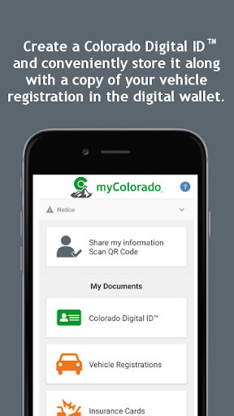
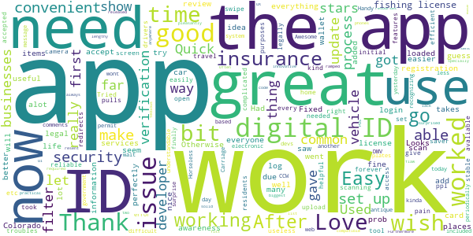
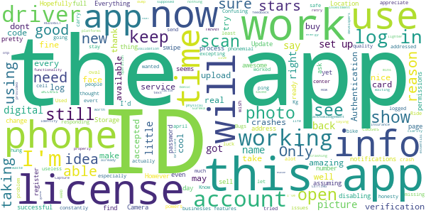
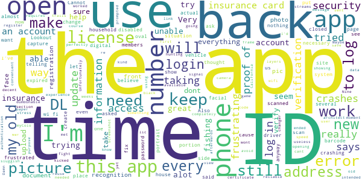
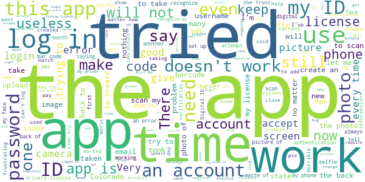

# myColorado
App version ``4.6``

Analyzed with [covid-apps-observer](http://github.com/covid-apps-observer) project, version ``0.1``

## App overview
| | |
|-------------------------|-------------------------| 
| **Name**&nbsp;&nbsp;&nbsp;&nbsp;&nbsp;&nbsp;&nbsp;&nbsp;&nbsp;&nbsp;&nbsp;&nbsp;&nbsp;&nbsp;&nbsp;&nbsp;&nbsp;&nbsp;&nbsp;&nbsp;&nbsp;&nbsp;&nbsp;&nbsp;&nbsp;&nbsp;&nbsp;&nbsp;&nbsp;&nbsp;&nbsp;&nbsp;&nbsp;&nbsp;&nbsp;&nbsp;&nbsp;&nbsp;&nbsp;&nbsp;  | myColorado |
| **Unique identifier** | com.soc.mycolorado |
| **Link to Google Play** | [https://play.google.com/store/apps/details?id=com.soc.mycolorado](https://play.google.com/store/apps/details?id=com.soc.mycolorado) |
| **Summary**  | The State of Colorado&#39;s Official Mobile App |
| **Privacy policy** | [https://mycolorado.state.co.us/privacy-policy](https://mycolorado.state.co.us/privacy-policy) |
| **Latest version** | 4.6 |
| **Last update** | 2021-06-04 10:19:26 |
| **Recent changes** | Minor Bug Fixes. |
| **Installs**  | 50,000+ |
| **Category** | Business |
| **First release** | Jan 2, 2019 |
| **Size**  | 75M |
| **Supported Android version**  | - |

### Description
> As the State of Colorado's official mobile app, myColorado™ provides a simple, secure and convenient way to show proof of identity and access state services.
 With myColorado™, you can:
 - create a Colorado Digital ID™ to complement your physical ID card for in-state use
 - renew your driver license or state ID
 - securely store payment information for future transactions
 - quickly find official online government resources with the State Services search function
 - link to state agency services, such as myDMV, state job search, and COVID-19 information
 - contact the myColorado support team through Chat
 - store your vehicle registration and insurance card in the Wallet
 The myColorado app requires Android OS version 8.1 or higher.
 myColorado™ is your trusted source to interact with state services anytime, anywhere. Skip the trip so you can go out and experience colorful Colorado!

### User interface
The developers of the app provide the following screenshots in the Google play store.
| | | |
|:-------------------------:|:-------------------------:|:-------------------------:|
 |   |   |   | 
 |  

## Development team
In the following we report the main information provided by the development team in the Google play store.

| | |
|-------------------------|-------------------------|
| **Developer**  | State of Colorado - Governor's Office of IT |
| **Website**  | [http://myColorado.state.co.us](http://myColorado.state.co.us) |
| **Email** | myColorado@state.co.us |
| **Physical address**  | - |
| **Other developed apps**  | [https://play.google.com/store/apps/developer?id=State+of+Colorado+-+Governor's+Office+of+IT](https://play.google.com/store/apps/developer?id=State+of+Colorado+-+Governor's+Office+of+IT) |

## Android support

| | |
|-------------------------|-------------------------|
| **Declared target Android version**  | Android10, version 10 (API level 29) |
| **Effective target Android version**  | Android10, version 10 (API level 29) |
| **Minimum supported Android version**  | Oreo, version 8.1.0 (API level 27) |
| **Maximum target Android version**  | - |

The larger the difference between the minimum and maximum supported Android versions, the better. A larger difference means a wider audience. For example, old phones have a very low Android version, so a high minimum supported Android version means that the app cannot be used by users with old phones, thus leading to accessibility problems. 

## Requested permissions

In the following we report the complete list of the permissions requested by the app. 

| **Permission** | **Protection level** | **Description** | 
|-------------------------|-------------------------|-------------------------|
 **android.permission ACCESS_COARSE_LOCATION** | :warning:**Dangerous** | Allows an app to access approximate location. 
 **android.permission ACCESS_FINE_LOCATION** | :warning:**Dangerous** | Allows an app to access precise location. 
 **android.permission ACCESS_NETWORK_STATE** | Normal | Allows applications to access information about networks. 
 **android.permission ACCESS_WIFI_STATE** | Normal | Allows applications to access information about Wi-Fi networks. 
 **android.permission CAMERA** | :warning:**Dangerous** | Required to be able to access the camera device. 
 **android.permission CHANGE_NETWORK_STATE** | Normal | Allows applications to change network connectivity state. 
 **android.permission INTERNET** | Normal | Allows applications to open network sockets. 
 **android.permission READ_EXTERNAL_STORAGE** | :warning:**Dangerous** | Allows an application to read from external storage. 
 **android.permission READ_PHONE_STATE** | :warning:**Dangerous** | Allows read only access to phone state, including the phone number of the device, current cellular network information, the status of any ongoing calls, and a list of any PhoneAccounts registered on the device. 
 **android.permission USE_BIOMETRIC** | Normal | Allows an app to use device supported biometric modalities. 
 **android.permission USE_FINGERPRINT** | Normal | This constant was deprecated in API level 28. Applications should request USE_BIOMETRIC instead 
 **android.permission WAKE_LOCK** | Normal | Allows using PowerManager WakeLocks to keep processor from sleeping or screen from dimming. 
 **android.permission WRITE_EXTERNAL_STORAGE** | :warning:**Dangerous** | Allows an application to write to external storage. 
 **com.google.android.c2dm.permission RECEIVE** | - | - 
 **com.google.android.finsky.permission BIND_GET_INSTALL_REFERRER_SERVICE** | - | - 

## Mentioned servers

| **Server** | **Registrant** | **Registrant country** | **Creation date** | 
|-------------------------|-------------------------|-------------------------|-------------------------|
 | amazonaws.com | Amazon.com, Inc. | :us: US | 2005-08-18 02:10:45 |
 | w3.org | W3C | :us: US | 1994-07-06 04:00:00 |
 | googlesyndication.com | Google LLC | :us: US | 2003-01-21 06:17:24 |
 | google.com | Google LLC | :us: US | 1997-09-15 04:00:00 |
 | app-measurement.com | Google LLC | :us: US | 2015-06-19 20:13:31 |
 | oit-shared.com | Whois Privacy Service | :us: US | 2018-06-30 13:57:22 |
 | amazonaws.com | Amazon.com, Inc. | :us: US | 2005-08-18 02:10:45 |
 | crashlytics.com | Google LLC | :us: US | 2011-01-21 15:30:40 |
 | amazonaws.com | Amazon.com, Inc. | :us: US | 2005-08-18 02:10:45 |
 | googleapis.com | Google LLC | :us: US | 2005-01-25 17:52:26 |
 | googleadservices.com | Google LLC | :us: US | 2003-06-19 16:34:53 |
 | state.co.us | State of Colorado | :us: US | 2003-02-05 13:01:22 |
 | cloudfront.net | Amazon.com, Inc. | :us: US | 2008-04-25 18:25:49 |
 | aws-mycolorado.com | Whois Privacy Service | :us: US | 2018-04-17 13:42:13 |

## Security analysis 

Below we report the main security warnings raised by our execution of the [Androwarn](https://github.com/maaaaz/androwarn) security analysis tool.

**Telephony identifiers leakage**
> - This application reads the ISO country code equivalent for the SIM provider's country code 
> - This application reads the ISO country code equivalent of the current registered operator's MCC (Mobile Country Code) 
> - This application reads the MCC+MNC of the provider of the SIM 
> - This application reads the SIM's serial number 
> - This application reads the alphabetic identifier associated with the voice mail number 
> - This application reads the constant indicating the state of the device SIM card 
> - This application reads the current data connection state 
> - This application reads the current location of the device 
> - This application reads the device phone type value 
> - This application reads the numeric name (MCC+MNC) of current registered operator 
> - This application reads the operator name 
> - This application reads the phone number string for line 1, for example, the MSISDN for a GSM phone 
> - This application reads the software version number for the device, for example, the IMEI/SV for GSM phones 
> - This application reads the unique device ID, i.e the IMEI for GSM and the MEID or ESN for CDMA phones 
> - This application reads the unique subscriber ID, for example, the IMSI for a GSM phone 
> - This application reads the voice mail number 
> - This application reads the Cell ID value 
> - This application reads the Location Area Code value 

**Connection interfaces exfiltration**
> - This application reads details about the currently active data network 
> - This application tries to find out if the currently active data network is metered 

**Telephony services abuse**
> - This application makes phone calls 

**Suspicious connection establishment**
> - This application opens a Socket and connects it to the remote address 'Ljava/lang/Object;->toString()Ljava/lang/String;' on the 'N/A' port  
> - This application opens a Socket and connects it to the remote address 'Ljava/lang/StringBuilder;->toString()Ljava/lang/String;' on the 'N/A' port  
> - This application opens a Socket and connects it to the remote address 'Ljava/net/Proxy;->type()Ljava/net/Proxy$Type;' on the 'N/A' port  
> - This application opens a Socket and connects it to the remote address 'Ljava/net/SocketException;' on the 'N/A' port  
> - This application opens a Socket and connects it to the remote address 'No route to  ' on the 'N/A' port  
> - This application opens a Socket and connects it to the remote address 'timeout' on the 'N/A' port  

**Pim data leakage**
> - This application accesses the downloads folder 

**Code execution**
> - This application loads a native library 
> - This application loads a native library: 'PhoenixAndroid' 
> - This application loads a native library: 'jniPdfium' 
> - This application loads a native library: 'modft2' 
> - This application loads a native library: 'modpdfium' 
> - This application loads a native library: 'modpng' 
> - This application executes a UNIX command 

## User ratings and reviews

Below we provide information about how end users are reacting to the app in terms of ratings and reviews in the Google Play store.

### Ratings

The myColorado app has been installed by more than **50000** times. At this time, **1027** rated the app and its average score is **3.6960785**. Below we show the distribution of the ratings across the usual star-based rating of Google Play

:star::star::star::star::star:: 544

:star::star::star::star:: 161

:star::star::star:: 50

:star::star:: 10

:star:: 262

### Reviews 

#### 5-star reviews

> Awesome  :date: __2021-06-11 02:04:47__

> Really easy to use app. Thanks.  :date: __2021-06-11 00:39:09__

> Easy to upload/photos various documents  :date: __2021-06-10 06:14:42__

> Saves a lot of effort.  :date: __2021-06-09 16:53:11__

> Very easy to use and upload information. Wish all agencies along with TSA accepted the digital documents. Still solid after 6 months.  :date: __2021-06-09 03:42:27__

> Great idea and very very user friendly....  :date: __2021-06-08 20:58:30__

> Im so releaved to have found this app it has been a life saver  :date: __2021-06-04 21:40:37__

> It's just awesome  :date: __2021-06-03 03:27:58__

> Awesome app  :date: __2021-06-02 23:42:48__

> Has all the information that you need about DMV in Colorado  :date: __2021-05-30 17:26:39__

#### 4-star reviews

> The scanning took forever to get right but once you get it working it's good.  :date: __2021-06-11 00:54:00__

> Quick and just what I needed Thanks.  :date: __2021-06-08 07:45:01__

> After some initial troubles the app is now stable and very efficient. More features are being added and it is a useful tool for residents.  :date: __2021-06-04 23:26:39__

> Fixed the camera issue with an update, works fine now. Lots of redirects but otherwise great.  :date: __2021-05-28 23:27:06__

> Won't upload my fishing license  :date: __2021-05-26 19:11:27__

> Quick and Easy  :date: __2021-05-20 05:21:48__

> A bit complicated to set up due to security items, but I really like having my drivers license, fishing license, etc, easily avaliable  :date: __2021-05-19 16:30:54__

> Love the app however it's kind of a pain to get a verification every time you need to use it  :date: __2021-05-17 21:47:54__

> Its helpful I just wish more ppl accepted it.  :date: __2021-05-12 14:37:19__

> This is a life saver app in just a swipe for verification purposes. Just wish we can use this "now" to travel legally since everything are electronic based... but i can wait.  :date: __2021-05-10 20:26:49__

#### 3-star reviews

> Authentication does not work if cell phone service is not available. May make app useless.  :date: __2021-06-06 07:30:23__

> It's cool works 50/50 some people take it some dont  :date: __2021-05-25 22:10:37__

> Confusing to use. It wanted me to center my face in an oval, but then just hung.  :date: __2021-05-12 05:46:10__

> Nice but missing alot .. good luck businesses excepting it !  :date: __2021-04-24 11:16:20__

> Bugs for days But the idea is phonemial  :date: __2021-04-21 02:26:35__

> Used to keep me logged in. Know I have to log in every time and the app has to ping my phone evert time 🤔🥴  :date: __2021-04-19 22:26:24__

> In all honesty the quality,functionality, clarity, ease of use is brilliant the app is amazing and will be worth 5 stars when it is accepted as a real ID. Only reason I gave it a 3 is because it is not accepted for identity validation for investment platforms.  :date: __2021-04-14 00:42:03__

> 2 factor authentication not working. I've been waiting for 15 mins for the code to be text to me so I can buy a lighter and nothing! It's a waste of energy. ---Sure, thanks for the acknowledgement. 👍When this app is working, its amazing.  :date: __2021-03-25 05:22:11__

> Can't get it to scan my id in????  :date: __2021-02-26 21:16:20__

> Keeps crashing when I try to upload an insurance ID card. Everything else is awesome!  :date: __2021-02-01 20:44:35__

#### 2-star reviews

> Nine out of 10 times I'm unable to log in. On the few times I've been able to get to the authentication page afterwards I get an error message. I thought this app would be a game changer having everything in one place but I can't even get it to open  :date: __2021-06-10 22:22:06__

> Works for drivers license. Fishing and hunting licenses dont show up.  :date: __2021-06-10 00:42:26__

> It does not make any situation more convenient and when prompted, the information doesn't open. A screenshot won't work and signal is needed to open the necessary information. Unfortunately trails and streams don't have wifi yet.  :date: __2021-06-03 17:40:14__

> When it wants to verify me by taking a picture the oval frame is black and wont take a picture. The app is useless to me if i cant use it for its intended purpose.  :date: __2021-05-11 16:14:20__

> Have had 2021 fishing lic for 3 weeks and it's still not available on myColo????  :date: __2021-04-23 01:26:14__

> I'm sure it's a great site, but it does not let me create a site with my California DL.  :date: __2021-04-15 22:12:39__

> Damn camera will not scan the barcode on back of i.d. really frustrating if only I could use this it would save me alot of stress and help me alot at the moment  :date: __2021-04-15 12:07:20__

> It keeps showing error all the time I try to upload my insurance cards  :date: __2021-04-09 15:41:45__

> In my house and put that in your house In  :date: __2021-04-09 10:02:00__

> To verify the first time it requires you to use facial recognition by framing your face in an oval. After three attempts, each time the app just sits there, no way to verify the facial recognition, no way to do over, just nothing. Frustrating.  :date: __2021-04-09 01:43:26__

#### 1-star reviews

> It's absolutely useless. The image recognition tool simply does not work. Surely there is a better way to verify identity.  :date: __2021-06-11 01:07:58__

> Won't accept my password to sign-in, and won't accept my existing password to let me change my password. So, it's completely useless. You wouldn't want to rely on this for ID.  :date: __2021-06-10 21:41:36__

> Just created a new account only to get to the login page for it tell me it doesn't recognize my password or username. Waste of an app.  :date: __2021-06-10 16:08:01__

> Created an account and can't log in plus no way to recover account. Trouble logging in button does nothing : (  :date: __2021-06-10 06:17:46__

> My app was working just fine and I was using it constantly then about a month ago it stopped working. When I would log in it would go back and forth to the pingid and login screen. It will not properly work. I also sent an email about it and never received a response back. This app needs to work properly!  :date: __2021-06-09 16:32:52__

> Can even get the app to scan my ID. So many other people are having the same issue. would not give any stars for the Shyte quality CO wants to make their ID's from.  :date: __2021-06-08 03:23:37__

> Would be cool if it worked. Camera worked the first day and then never again. Can't verify or upload anything. Sweet app. Can I have my info back please!  :date: __2021-06-05 20:03:40__

> Went to the DMV literally TODAY, and it will not authenticate me. Says it can't match my photo. I look exactly like i did 3 hours ago, hairstyle, clothes and all. This is absurd.  :date: __2021-06-04 23:46:20__

> This is what happens when the government is tasked with make a app that works. It doesn't, And just like the government it probably never will!!  :date: __2021-06-03 23:50:43__

> If I could give it a zero star i would. Tryed to face scan an it didnt even reconize me. So i tried again an its just a black oval to scan ur face even in the brightest light. I will just wait for my id to come in the mail. This app is a pain in the you know what.  :date: __2021-06-02 04:44:08__

