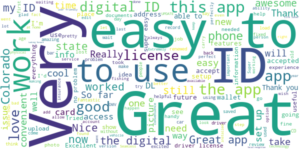

# myColorado
App version ``4.7``

Analyzed with [covid-apps-observer](http://github.com/covid-apps-observer) project, version ``0.1``

## App overview
| | |
|-------------------------|-------------------------| 
| **Name**&nbsp;&nbsp;&nbsp;&nbsp;&nbsp;&nbsp;&nbsp;&nbsp;&nbsp;&nbsp;&nbsp;&nbsp;&nbsp;&nbsp;&nbsp;&nbsp;&nbsp;&nbsp;&nbsp;&nbsp;&nbsp;&nbsp;&nbsp;&nbsp;&nbsp;&nbsp;&nbsp;&nbsp;&nbsp;&nbsp;&nbsp;&nbsp;&nbsp;&nbsp;&nbsp;&nbsp;&nbsp;&nbsp;&nbsp;&nbsp;  | myColorado |
| **Unique identifier** | com.soc.mycolorado |
| **Link to Google Play** | [https://play.google.com/store/apps/details?id=com.soc.mycolorado](https://play.google.com/store/apps/details?id=com.soc.mycolorado) |
| **Summary**  | The State of Colorado&#39;s Official Mobile App |
| **Privacy policy** | [https://mycolorado.state.co.us/privacy-policy](https://mycolorado.state.co.us/privacy-policy) |
| **Latest version** | 4.7 |
| **Last update** | 2021-06-22 14:33:40 |
| **Recent changes** | Minor bug fixes. |
| **Installs**  | 50,000+ |
| **Category** | Business |
| **First release** | Jan 2, 2019 |
| **Size**  | 76M |
| **Supported Android version**  | - |

### Description
> As the State of Colorado's official mobile app, myColorado™ provides a simple, secure and convenient way to show proof of identity and access state services.
 With myColorado™, you can:
 - create a Colorado Digital ID™ to complement your physical ID card for in-state use
 - renew your driver license or state ID
 - securely store payment information for future transactions
 - quickly find official online government resources with the State Services search function
 - link to state agency services, such as myDMV, state job search, and COVID-19 information
 - contact the myColorado support team through Chat
 - store your vehicle registration and insurance card in the Wallet
 The myColorado app requires Android OS version 8.1 or higher.
 myColorado™ is your trusted source to interact with state services anytime, anywhere. Skip the trip so you can go out and experience colorful Colorado!

### User interface
The developers of the app provide the following screenshots in the Google play store.
| | | |
|:-------------------------:|:-------------------------:|:-------------------------:|
 |   |   |   | 
 |  

## Development team
In the following we report the main information provided by the development team in the Google play store.

| | |
|-------------------------|-------------------------|
| **Developer**  | State of Colorado - Governor's Office of IT |
| **Website**  | [http://myColorado.state.co.us](http://myColorado.state.co.us) |
| **Email** | myColorado@state.co.us |
| **Physical address**  | - |
| **Other developed apps**  | [https://play.google.com/store/apps/developer?id=State+of+Colorado+-+Governor's+Office+of+IT](https://play.google.com/store/apps/developer?id=State+of+Colorado+-+Governor's+Office+of+IT) |

## Android support

| | |
|-------------------------|-------------------------|
| **Declared target Android version**  | Android10, version 10 (API level 29) |
| **Effective target Android version**  | Android10, version 10 (API level 29) |
| **Minimum supported Android version**  | Oreo, version 8.1.0 (API level 27) |
| **Maximum target Android version**  | - |

The larger the difference between the minimum and maximum supported Android versions, the better. A larger difference means a wider audience. For example, old phones have a very low Android version, so a high minimum supported Android version means that the app cannot be used by users with old phones, thus leading to accessibility problems. 

## Requested permissions

In the following we report the complete list of the permissions requested by the app. 

| **Permission** | **Protection level** | **Description** | 
|-------------------------|-------------------------|-------------------------|
 **android.permission ACCESS_COARSE_LOCATION** | :warning:**Dangerous** | Allows an app to access approximate location. 
 **android.permission ACCESS_FINE_LOCATION** | :warning:**Dangerous** | Allows an app to access precise location. 
 **android.permission ACCESS_NETWORK_STATE** | Normal | Allows applications to access information about networks. 
 **android.permission ACCESS_WIFI_STATE** | Normal | Allows applications to access information about Wi-Fi networks. 
 **android.permission CAMERA** | :warning:**Dangerous** | Required to be able to access the camera device. 
 **android.permission CHANGE_NETWORK_STATE** | Normal | Allows applications to change network connectivity state. 
 **android.permission INTERNET** | Normal | Allows applications to open network sockets. 
 **android.permission NFC** | Normal | Allows applications to perform I/O operations over NFC. 
 **android.permission READ_EXTERNAL_STORAGE** | :warning:**Dangerous** | Allows an application to read from external storage. 
 **android.permission READ_PHONE_STATE** | :warning:**Dangerous** | Allows read only access to phone state, including the phone number of the device, current cellular network information, the status of any ongoing calls, and a list of any PhoneAccounts registered on the device. 
 **android.permission USE_BIOMETRIC** | Normal | Allows an app to use device supported biometric modalities. 
 **android.permission USE_FINGERPRINT** | Normal | This constant was deprecated in API level 28. Applications should request USE_BIOMETRIC instead 
 **android.permission WAKE_LOCK** | Normal | Allows using PowerManager WakeLocks to keep processor from sleeping or screen from dimming. 
 **android.permission WRITE_EXTERNAL_STORAGE** | :warning:**Dangerous** | Allows an application to write to external storage. 
 **android.permission WRITE_INTERNAL_STORAGE** | - | - 
 **com.google.android.c2dm.permission RECEIVE** | - | - 
 **com.google.android.finsky.permission BIND_GET_INSTALL_REFERRER_SERVICE** | - | - 

## Mentioned servers

| **Server** | **Registrant** | **Registrant country** | **Creation date** | 
|-------------------------|-------------------------|-------------------------|-------------------------|
 | amazonaws.com | Amazon.com, Inc. | :us: US | 2005-08-18 02:10:45 |
 | w3.org | W3C | :us: US | 1994-07-06 04:00:00 |
 | googlesyndication.com | Google LLC | :us: US | 2003-01-21 06:17:24 |
 | google.com | Google LLC | :us: US | 1997-09-15 04:00:00 |
 | app-measurement.com | Google LLC | :us: US | 2015-06-19 20:13:31 |
 | amazonaws.com | Amazon.com, Inc. | :us: US | 2005-08-18 02:10:45 |
 | crashlytics.com | Google LLC | :us: US | 2011-01-21 15:30:40 |
 | amazonaws.com | Amazon.com, Inc. | :us: US | 2005-08-18 02:10:45 |
 | googleapis.com | Google LLC | :us: US | 2005-01-25 17:52:26 |
 | googleadservices.com | Google LLC | :us: US | 2003-06-19 16:34:53 |
 | oit-shared.com | Whois Privacy Service | :us: US | 2018-06-30 13:57:22 |
 | cloudfront.net | Amazon.com, Inc. | :us: US | 2008-04-25 18:25:49 |
 | state.co.us | State of Colorado | :us: US | 2003-02-05 13:01:22 |
 | cloudfront.net | Amazon.com, Inc. | :us: US | 2008-04-25 18:25:49 |
 | aws-mycolorado.com | Whois Privacy Service | :us: US | 2018-04-17 13:42:13 |

## Security analysis 

Below we report the main security warnings raised by our execution of the [Androwarn](https://github.com/maaaaz/androwarn) security analysis tool.

**Telephony identifiers leakage**
> - This application reads the ISO country code equivalent for the SIM provider's country code 
> - This application reads the ISO country code equivalent of the current registered operator's MCC (Mobile Country Code) 
> - This application reads the MCC+MNC of the provider of the SIM 
> - This application reads the SIM's serial number 
> - This application reads the alphabetic identifier associated with the voice mail number 
> - This application reads the constant indicating the state of the device SIM card 
> - This application reads the current data connection state 
> - This application reads the current location of the device 
> - This application reads the device phone type value 
> - This application reads the numeric name (MCC+MNC) of current registered operator 
> - This application reads the operator name 
> - This application reads the phone number string for line 1, for example, the MSISDN for a GSM phone 
> - This application reads the software version number for the device, for example, the IMEI/SV for GSM phones 
> - This application reads the unique device ID, i.e the IMEI for GSM and the MEID or ESN for CDMA phones 
> - This application reads the unique subscriber ID, for example, the IMSI for a GSM phone 
> - This application reads the voice mail number 
> - This application reads the Cell ID value 
> - This application reads the Location Area Code value 

**Connection interfaces exfiltration**
> - This application reads details about the currently active data network 
> - This application tries to find out if the currently active data network is metered 

**Telephony services abuse**
> - This application makes phone calls 

**Suspicious connection establishment**
> - This application opens a Socket and connects it to the remote address 'Ljava/lang/Object;->toString()Ljava/lang/String;' on the 'N/A' port  
> - This application opens a Socket and connects it to the remote address 'Ljava/lang/StringBuilder;->toString()Ljava/lang/String;' on the 'N/A' port  
> - This application opens a Socket and connects it to the remote address 'Ljava/net/Proxy;->type()Ljava/net/Proxy$Type;' on the 'N/A' port  
> - This application opens a Socket and connects it to the remote address 'Ljava/net/SocketException;' on the 'N/A' port  
> - This application opens a Socket and connects it to the remote address 'No route to  ' on the 'N/A' port  
> - This application opens a Socket and connects it to the remote address 'timeout' on the 'N/A' port  

**Pim data leakage**
> - This application accesses the downloads folder 

**Code execution**
> - This application loads a native library 
> - This application loads a native library: 'Ljava/lang/String;->valueOf(Ljava/lang/Object;)Ljava/lang/String;' 
> - This application loads a native library: 'PhoenixAndroid' 
> - This application loads a native library: 'jniPdfium' 
> - This application loads a native library: 'modft2' 
> - This application loads a native library: 'modpdfium' 
> - This application loads a native library: 'modpng' 
> - This application executes a UNIX command 

## User ratings and reviews

Below we provide information about how end users are reacting to the app in terms of ratings and reviews in the Google Play store.

### Ratings

The myColorado app has been installed by more than **50000** times. At this time, **1210** rated the app and its average score is **3.52**. Below we show the distribution of the ratings across the usual star-based rating of Google Play

:star::star::star::star::star:: 601

:star::star::star::star:: 116

:star::star::star:: 116

:star::star:: 67

:star:: 310

### Reviews 

#### 5-star reviews

> Great app  :date: __2021-06-26 21:57:40__

> This is super easy! Now I don't have to carry my driver license or any other license I purchase.  :date: __2021-06-26 03:14:17__

> The fact it gives you a digital version of your actual drivers license its pretty handy if your happen to forget your actual license  :date: __2021-06-26 00:33:55__

> Nice  :date: __2021-06-25 22:12:52__

> Works as expected, can leave my license and other car documents at home and not risk loosing them.  :date: __2021-06-24 18:20:28__

> perfect and is infinately useful.  :date: __2021-06-23 14:20:31__

> Easy and fast reliable and trustworthy  :date: __2021-06-23 08:45:29__

> Awesome!  :date: __2021-06-23 04:46:37__

> Much better than last few days thank u for working on the app i have android and access back today Thank You  :date: __2021-06-22 15:57:45__

> Very positive. Lke ID on my phone!!  :date: __2021-06-21 02:43:52__

#### 4-star reviews

> Ok ?  :date: __2021-06-23 00:51:12__

> I like the idea of being able to take care of all of these things online  :date: __2021-06-22 21:35:08__

> Worked for a while, but now it won't open my ID, registration, or insurance card. This app is useless if it's not reliable.  :date: __2021-06-21 00:42:16__

> Tried to access and app wouldn't work. Otherwise would give it a 5  :date: __2021-06-20 05:10:13__

> Digital ID is not working from the home screen, have to go into services then it pulls up.  :date: __2021-06-13 22:31:11__

> The scanning took forever to get right but once you get it working it's good.  :date: __2021-06-11 00:54:00__

> Quick and just what I needed Thanks.  :date: __2021-06-08 07:45:01__

> After some initial troubles the app is now stable and very efficient. More features are being added and it is a useful tool for residents.  :date: __2021-06-04 23:26:39__

> Fixed the camera issue with an update, works fine now. Lots of redirects but otherwise great.  :date: __2021-05-28 23:27:06__

> Won't upload my fishing license  :date: __2021-05-26 19:11:27__

#### 3-star reviews

> My only problem is why I have it is a lot of places don't consider it valid you know you can't use it to get your ID a lot of motels won't take it I couldn't even get little fireworks from King Soopers with it that's why I only complain about it and it's a legit Colorado government ID so I understand everything is going digital  :date: __2021-06-23 11:00:06__

> V id3 22nd f  :date: __2021-06-22 22:53:05__

> Prompts me to update the app when it is already updated.  :date: __2021-06-22 19:16:56__

> When it works, it works. When it doesn't work, well, good luck.  :date: __2021-06-22 16:32:03__

> This app worked fine until april/may 2021. Now the app just crashes. The app is a good idea and nice especially if on a bike so you dont need to carry as much, problem is the app does not and will not stay open. It crashes constantly and some features will not open at all and when tried, it causes the app to crash as well. I wish the powers at be could get this app to actually work. Ride safe, Kg  :date: __2021-06-17 23:40:36__

> It won't let me access it or send me verification code, but thank you for at least responding to my issues here! I just thought it was never going to be addressed, I appreciate that!  :date: __2021-06-12 01:05:14__

> Authentication does not work if cell phone service is not available. May make app useless.  :date: __2021-06-06 07:30:23__

> It's cool works 50/50 some people take it some dont  :date: __2021-05-25 22:10:37__

> Confusing to use. It wanted me to center my face in an oval, but then just hung.  :date: __2021-05-12 05:46:10__

> Nice but missing alot .. good luck businesses excepting it !  :date: __2021-04-24 11:16:20__

#### 2-star reviews

> Every time I attempt to get my insurance cards, the application crashes.  :date: __2021-06-23 04:06:00__

> This app worked perfectly for a while, but now I'm met with "certificate errors" and am unable to view my ID or even get to the login page.  :date: __2021-06-21 06:47:57__

> App keeps crashing when opening insurance section.  :date: __2021-06-19 22:00:54__

> Not for use in any situation where speed or proof of insurance is necessary. Alot of layers of security just to open the app, then I'd get kicked completely out of the app when I tried to open the proof of insurance. Then of course all the security again. I ended up using the paper documents anyway. And didn't we fight a war or something to avoid apps like this anyway?  :date: __2021-06-19 04:59:48__

> Unable to change my phone number from my old number to my new number in the app because it asked for a verification code every time I'm trying to log in which is sent to my old phone number which I don't have access to because it's my old phone number so I don't know how I'm going to access my information because I can't access the account with my old number so this is kind of dumbUnable to change my phone number from my old number to my new number in the app because it asked for a verification  :date: __2021-06-16 00:19:38__

> Not great experience. Cannot seem to link digital fishing license to app. Very sluggish app.  :date: __2021-06-14 00:02:32__

> Doesn't work. Scans and then says I need a license which it scanned.  :date: __2021-06-12 15:44:47__

> Seems like every update you have to re-register. Could be a decent, it's just not reliable. Maybe you could try to architect it so that you reuse the user data after each update??  :date: __2021-06-11 22:31:46__

> Nine out of 10 times I'm unable to log in. On the few times I've been able to get to the authentication page afterwards I get an error message. I thought this app would be a game changer having everything in one place but I can't even get it to open  :date: __2021-06-10 22:22:06__

> Works for drivers license. Fishing and hunting licenses dont show up.  :date: __2021-06-10 00:42:26__

#### 1-star reviews

> Just don't bother. Unfortunately no one reads reviews before installing an app. But this one is beyond useless. Installed it quite a while ago and created an account. Now it won't let me log in using my credentials stored with Google. And no email is ever sent to reset the password. This is the usual outcome when government agencies award the project to the lowest foreign bidder. I own a software development company and we are constantly fixing their problems. Uninstalling.  :date: __2021-06-26 19:20:16__

> Not good  :date: __2021-06-24 09:52:28__

> Waste of time and data  :date: __2021-06-24 00:19:09__

> App won't update or open.  :date: __2021-06-23 01:36:40__

> Cool at first now it keeps saying there is an update even after downloading it it just keeps going back and forth from update screen to the app and occasionally it will lete click on the sighm in button but say all certificates need check or remewed  :date: __2021-06-23 01:27:40__

> Won't even open!! ... tells me it has an update and sends me to the store....there's no update....typical bureaucratic incompetence...  :date: __2021-06-22 23:23:23__

> Unable to log in now, says there is an update but when Ì try to update it says it's up to date.  :date: __2021-06-22 22:15:20__

> Update as of June 2021: App is unusable, keeps telling me to update, brings me to the app store, then no update available. Shame because now I can't use the digital fishing license... Old 5 star review: This app is great, no idea what the others are saying. Easy to add vaccine card, insurance cards, fishing licenses. I can't wait until this gets more adoption across the state (and nation).  :date: __2021-06-22 20:24:49__

> My app was working just fine and I was using it constantly then about a month ago it stopped working. When I would log in it would go back and forth to the pingid and login screen. It will not properly work. I also sent an email about it and never received a response back. This app needs to work properly! Edit to add even after the new update it still doesn't work. Just does the same login then ping I'd then login again. Very disappointed as I would use this often.  :date: __2021-06-22 19:53:43__

> App is tripin  :date: __2021-06-22 19:52:01__

