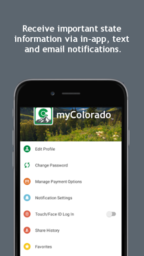
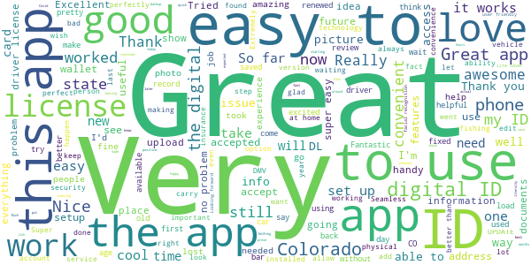
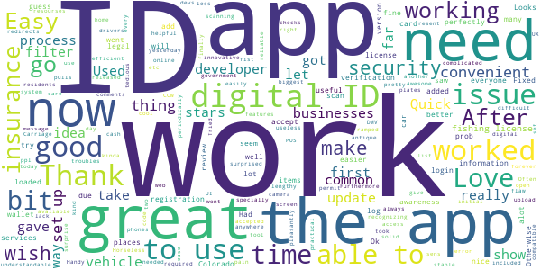

# myColorado
App version ``4.8``

Analyzed with [covid-apps-observer](http://github.com/covid-apps-observer) project, version ``0.1``

## App overview
| | |
|-------------------------|-------------------------| 
| **Name**&nbsp;&nbsp;&nbsp;&nbsp;&nbsp;&nbsp;&nbsp;&nbsp;&nbsp;&nbsp;&nbsp;&nbsp;&nbsp;&nbsp;&nbsp;&nbsp;&nbsp;&nbsp;&nbsp;&nbsp;&nbsp;&nbsp;&nbsp;&nbsp;&nbsp;&nbsp;&nbsp;&nbsp;&nbsp;&nbsp;&nbsp;&nbsp;&nbsp;&nbsp;&nbsp;&nbsp;&nbsp;&nbsp;&nbsp;&nbsp;  | myColorado |
| **Unique identifier** | com.soc.mycolorado |
| **Link to Google Play** | [https://play.google.com/store/apps/details?id=com.soc.mycolorado](https://play.google.com/store/apps/details?id=com.soc.mycolorado) |
| **Summary**  | The State of Colorado&#39;s Official Mobile App |
| **Privacy policy** | [https://mycolorado.state.co.us/privacy-policy](https://mycolorado.state.co.us/privacy-policy) |
| **Latest version** | 4.8 |
| **Last update** | 2021-07-11 14:14:48 |
| **Recent changes** | Minor bug fixes. |
| **Installs**  | 100,000+ |
| **Category** | Business |
| **First release** | Jan 2, 2019 |
| **Size**  | 76M |
| **Supported Android version**  | - |

### Description
> As the State of Colorado's official mobile app, myColorado™ provides a simple, secure and convenient way to show proof of identity and access state services.
 With myColorado™, you can:
 - create a Colorado Digital ID™ to complement your physical ID card for in-state use
 - renew your driver license or state ID
 - securely store payment information for future transactions
 - quickly find official online government resources with the State Services search function
 - link to state agency services, such as myDMV, state job search, and COVID-19 information
 - contact the myColorado support team through Chat
 - store your vehicle registration and insurance card in the Wallet
 The myColorado app requires Android OS version 8.1 or higher.
 myColorado™ is your trusted source to interact with state services anytime, anywhere. Skip the trip so you can go out and experience colorful Colorado!

### User interface
The developers of the app provide the following screenshots in the Google play store.
| | | |
|:-------------------------:|:-------------------------:|:-------------------------:|
 |   |   |   | 
 |  

## Development team
In the following we report the main information provided by the development team in the Google play store.

| | |
|-------------------------|-------------------------|
| **Developer**  | State of Colorado - Governor's Office of IT |
| **Website**  | [http://myColorado.state.co.us](http://myColorado.state.co.us) |
| **Email** | myColorado@state.co.us |
| **Physical address**  | - |
| **Other developed apps**  | [https://play.google.com/store/apps/developer?id=State+of+Colorado+-+Governor's+Office+of+IT](https://play.google.com/store/apps/developer?id=State+of+Colorado+-+Governor's+Office+of+IT) |

## Android support

| | |
|-------------------------|-------------------------|
| **Declared target Android version**  | Android10, version 10 (API level 29) |
| **Effective target Android version**  | Android10, version 10 (API level 29) |
| **Minimum supported Android version**  | Oreo, version 8.1.0 (API level 27) |
| **Maximum target Android version**  | - |

The larger the difference between the minimum and maximum supported Android versions, the better. A larger difference means a wider audience. For example, old phones have a very low Android version, so a high minimum supported Android version means that the app cannot be used by users with old phones, thus leading to accessibility problems. 

## Requested permissions

In the following we report the complete list of the permissions requested by the app. 

| **Permission** | **Protection level** | **Description** | 
|-------------------------|-------------------------|-------------------------|
 **android.permission ACCESS_COARSE_LOCATION** | :warning:**Dangerous** | Allows an app to access approximate location. 
 **android.permission ACCESS_FINE_LOCATION** | :warning:**Dangerous** | Allows an app to access precise location. 
 **android.permission ACCESS_NETWORK_STATE** | Normal | Allows applications to access information about networks. 
 **android.permission ACCESS_WIFI_STATE** | Normal | Allows applications to access information about Wi-Fi networks. 
 **android.permission CAMERA** | :warning:**Dangerous** | Required to be able to access the camera device. 
 **android.permission CHANGE_NETWORK_STATE** | Normal | Allows applications to change network connectivity state. 
 **android.permission INTERNET** | Normal | Allows applications to open network sockets. 
 **android.permission NFC** | Normal | Allows applications to perform I/O operations over NFC. 
 **android.permission READ_EXTERNAL_STORAGE** | :warning:**Dangerous** | Allows an application to read from external storage. 
 **android.permission READ_PHONE_STATE** | :warning:**Dangerous** | Allows read only access to phone state, including the phone number of the device, current cellular network information, the status of any ongoing calls, and a list of any PhoneAccounts registered on the device. 
 **android.permission USE_BIOMETRIC** | Normal | Allows an app to use device supported biometric modalities. 
 **android.permission USE_FINGERPRINT** | Normal | This constant was deprecated in API level 28. Applications should request USE_BIOMETRIC instead 
 **android.permission WAKE_LOCK** | Normal | Allows using PowerManager WakeLocks to keep processor from sleeping or screen from dimming. 
 **android.permission WRITE_EXTERNAL_STORAGE** | :warning:**Dangerous** | Allows an application to write to external storage. 
 **android.permission WRITE_INTERNAL_STORAGE** | - | - 
 **com.google.android.c2dm.permission RECEIVE** | - | - 
 **com.google.android.finsky.permission BIND_GET_INSTALL_REFERRER_SERVICE** | - | - 

## Mentioned servers

| **Server** | **Registrant** | **Registrant country** | **Creation date** | 
|-------------------------|-------------------------|-------------------------|-------------------------|
 | amazonaws.com | Amazon.com, Inc. | :us: US | 2005-08-18 02:10:45 |
 | w3.org | W3C | :us: US | 1994-07-06 04:00:00 |
 | googlesyndication.com | Google LLC | :us: US | 2003-01-21 06:17:24 |
 | google.com | Google LLC | :us: US | 1997-09-15 04:00:00 |
 | app-measurement.com | Google LLC | :us: US | 2015-06-19 20:13:31 |
 | amazonaws.com | Amazon.com, Inc. | :us: US | 2005-08-18 02:10:45 |
 | crashlytics.com | Google LLC | :us: US | 2011-01-21 15:30:40 |
 | amazonaws.com | Amazon.com, Inc. | :us: US | 2005-08-18 02:10:45 |
 | googleapis.com | Google LLC | :us: US | 2005-01-25 17:52:26 |
 | googleadservices.com | Google LLC | :us: US | 2003-06-19 16:34:53 |
 | oit-shared.com | Whois Privacy Service | :us: US | 2018-06-30 13:57:22 |
 | cloudfront.net | Amazon.com, Inc. | :us: US | 2008-04-25 18:25:49 |
 | state.co.us | State of Colorado | :us: US | 2003-02-05 13:01:22 |
 | cloudfront.net | Amazon.com, Inc. | :us: US | 2008-04-25 18:25:49 |
 | aws-mycolorado.com | Whois Privacy Service | :us: US | 2018-04-17 13:42:13 |

## Security analysis 

Below we report the main security warnings raised by our execution of the [Androwarn](https://github.com/maaaaz/androwarn) security analysis tool.

**Telephony identifiers leakage**
> - This application reads the ISO country code equivalent for the SIM provider's country code 
> - This application reads the ISO country code equivalent of the current registered operator's MCC (Mobile Country Code) 
> - This application reads the MCC+MNC of the provider of the SIM 
> - This application reads the SIM's serial number 
> - This application reads the alphabetic identifier associated with the voice mail number 
> - This application reads the constant indicating the state of the device SIM card 
> - This application reads the current data connection state 
> - This application reads the current location of the device 
> - This application reads the device phone type value 
> - This application reads the numeric name (MCC+MNC) of current registered operator 
> - This application reads the operator name 
> - This application reads the phone number string for line 1, for example, the MSISDN for a GSM phone 
> - This application reads the software version number for the device, for example, the IMEI/SV for GSM phones 
> - This application reads the unique device ID, i.e the IMEI for GSM and the MEID or ESN for CDMA phones 
> - This application reads the unique subscriber ID, for example, the IMSI for a GSM phone 
> - This application reads the voice mail number 
> - This application reads the Cell ID value 
> - This application reads the Location Area Code value 

**Connection interfaces exfiltration**
> - This application reads details about the currently active data network 
> - This application tries to find out if the currently active data network is metered 

**Telephony services abuse**
> - This application makes phone calls 

**Suspicious connection establishment**
> - This application opens a Socket and connects it to the remote address 'Ljava/lang/Object;->toString()Ljava/lang/String;' on the 'N/A' port  
> - This application opens a Socket and connects it to the remote address 'Ljava/lang/StringBuilder;->toString()Ljava/lang/String;' on the 'N/A' port  
> - This application opens a Socket and connects it to the remote address 'Ljava/net/Proxy;->type()Ljava/net/Proxy$Type;' on the 'N/A' port  
> - This application opens a Socket and connects it to the remote address 'Ljava/net/SocketException;' on the 'N/A' port  
> - This application opens a Socket and connects it to the remote address 'No route to  ' on the 'N/A' port  
> - This application opens a Socket and connects it to the remote address 'timeout' on the 'N/A' port  

**Pim data leakage**
> - This application accesses the downloads folder 

**Code execution**
> - This application loads a native library 
> - This application loads a native library: 'Ljava/lang/String;->valueOf(Ljava/lang/Object;)Ljava/lang/String;' 
> - This application loads a native library: 'PhoenixAndroid' 
> - This application loads a native library: 'jniPdfium' 
> - This application loads a native library: 'modft2' 
> - This application loads a native library: 'modpdfium' 
> - This application loads a native library: 'modpng' 
> - This application executes a UNIX command 

## User ratings and reviews

Below we provide information about how end users are reacting to the app in terms of ratings and reviews in the Google Play store.

### Ratings

The myColorado app has been installed by more than **100000** times. At this time, **1315** rated the app and its average score is **3.7662337**. Below we show the distribution of the ratings across the usual star-based rating of Google Play

:star::star::star::star::star:: 778

:star::star::star::star:: 85

:star::star::star:: 94

:star::star:: 85

:star:: 273

### Reviews 

#### 5-star reviews

> Really good..  :date: __2021-07-17 23:01:57__

> Better then ID .Me  :date: __2021-07-17 10:29:59__

> love it  :date: __2021-07-17 09:54:24__

> Love this app... And amazing you can get a digital license....  :date: __2021-07-16 06:32:44__

> It is nice so far  :date: __2021-07-15 03:13:50__

> Works great for me I don't know why other people are having problems with the app, it works wonders for me !  :date: __2021-07-14 05:25:33__

> Great app  :date: __2021-07-13 02:39:30__

> Useful and very easy to use.  :date: __2021-07-12 04:06:53__

> Easy and complete for all licenses.  :date: __2021-07-11 02:10:05__

> Don't listen to the bad reviews! My experience with this app is amazing and it works perfectly. So nice to not need to carry around my ID. (plus I'm not 21 and don't smoke so haven't had any problems with it not being accepted)  :date: __2021-07-08 02:13:48__

#### 4-star reviews

> Ok ?  :date: __2021-06-23 00:51:12__

> I like the idea of being able to take care of all of these things online  :date: __2021-06-22 21:35:08__

> Worked for a while, but now it won't open my ID, registration, or insurance card. This app is useless if it's not reliable.  :date: __2021-06-21 00:42:16__

> Tried to access and app wouldn't work. Otherwise would give it a 5  :date: __2021-06-20 05:10:13__

> Digital ID is not working from the home screen, have to go into services then it pulls up.  :date: __2021-06-13 22:31:11__

> The scanning took forever to get right but once you get it working it's good.  :date: __2021-06-11 00:54:00__

> Quick and just what I needed Thanks.  :date: __2021-06-08 07:45:01__

> After some initial troubles the app is now stable and very efficient. More features are being added and it is a useful tool for residents.  :date: __2021-06-04 23:26:39__

> Fixed the camera issue with an update, works fine now. Lots of redirects but otherwise great.  :date: __2021-05-28 23:27:06__

> Won't upload my fishing license  :date: __2021-05-26 19:11:27__

#### 3-star reviews

> App is temperamental  :date: __2021-07-19 04:05:59__

> My wallet got stolen last week, but this app basically means i can still go do adult stuff.  :date: __2021-07-13 18:14:38__

> Not accepted everywhere yet ... CSP doesn't even & they're pay off CO govt.  :date: __2021-07-10 23:12:45__

> Ok, but unable to verify my ID info. Whenever I click confirm, it just takes me to a blank screen.  :date: __2021-07-10 22:09:56__

> I constantly have issues with the app recognizing my username and password. Resetting the password is quite a chore.  :date: __2021-07-06 04:24:49__

> Trouble with updating new 21 I.D.  :date: __2021-07-01 13:13:21__

> My only problem is why I have it is a lot of places don't consider it valid you know you can't use it to get your ID a lot of motels won't take it I couldn't even get little fireworks from King Soopers with it that's why I only complain about it and it's a legit Colorado government ID so I understand everything is going digital  :date: __2021-06-23 11:00:06__

> V id3 22nd f  :date: __2021-06-22 22:53:05__

> Prompts me to update the app when it is already updated.  :date: __2021-06-22 19:16:56__

> When it works, it works. When it doesn't work, well, good luck.  :date: __2021-06-22 16:32:03__

#### 2-star reviews

> App won't accept username, and will not let me log in, even though username fits their parameters. Cannot rate the rest of the app, since it will not let me create an account.  :date: __2021-07-17 16:47:36__

> Log in tedious and time consuming waiting for confirmation codes in messages that don't auto enter.  :date: __2021-07-16 23:13:33__

> I was hoping to used the app as a digital fishing license, but evey time I try to use the video/photo verification the camera is way to dark that it barely picks up any light in the area unless it's natural light. There should be an alternative way to authenticate because now this app is completely useless for me.  :date: __2021-07-16 22:47:30__

> This app is hot trash. Very slow, had to authenticate 4+ times to just use this. At that point physical ID is preferable to this  :date: __2021-07-11 20:30:18__

> No screenshot? Need easier share.  :date: __2021-07-08 23:05:02__

> Waste of time. I've referred so many people to this app too. Then like a month ago useless. I can't open the insurance at all the app just closes. Stupid really. Why bother if I can't store everything in one place. UGH  :date: __2021-07-07 14:14:29__

> Doesn't show any current hunting/fishing licenses or Parks passes regardless of if they were purchased one day ago or 6 months ago  :date: __2021-06-28 04:54:39__

> Every time I attempt to get my insurance cards, the application crashes.  :date: __2021-06-23 04:06:00__

> This app worked perfectly for a while, but now I'm met with "certificate errors" and am unable to view my ID or even get to the login page.  :date: __2021-06-21 06:47:57__

> App keeps crashing when opening insurance section.  :date: __2021-06-19 22:00:54__

#### 1-star reviews

> Garbage app. Can't even create an account without error codes for problems I don't have. Password has everything it needs; a number, symbol, upper and lower case number. App will give you error code saying you dont meet requirements. I hope they didnt put a dime of tax dollars into this hot dumpster fire of app. Nice idea. Aaaaaaaaawwwwffuuuuuuuuuul execution.  :date: __2021-07-17 07:25:25__

> Installed just fine, however to use it you have to upload a "face map" that doesn't seem to work. I have changed lighting and angel......... Seems broken, possibly phone camera incomparably.  :date: __2021-07-17 00:36:42__

> The app updated and forgot my credentials; that makes it real handy when you're trying to show identification... Even video games can use SSO to ensure you can log in quickly every time, don't you think an app with such an important purpose as proving one's identity should be able to do that?!  :date: __2021-07-16 16:18:41__

> I put in the year for the fishing / hunting license and then I'm able to view license for about 5 seconds and then it disappears  :date: __2021-07-16 16:14:50__

> I thought it would be a great place to keep things as we move our physical credentials into the digital age. Bottom line, if you don't login to this app at least every 90 days, your account is scrubbed and you have to start from scratch. This is not worth my time involved to set everything up all over again.  :date: __2021-07-15 22:46:42__

> Junk doesn't work can't even login... Stay clear just carry your ID allot easier then trying to get this to work...  :date: __2021-07-15 04:08:05__

> Yes no one reads reviews, and this app sucks balls 😒  :date: __2021-07-14 02:21:32__

> Every time I need to use it it needs an update??  :date: __2021-07-13 23:43:20__

> This app is trash. Everytime I try to take a picture of the back of my ID. It forecloses.  :date: __2021-07-13 23:20:35__

> Having same issues like everyone else. Not able to login. Tried using the forgot password and user name but none of them work. I haven't received any emails for the past couple of weeks. It worked great before but not sure what happened.  :date: __2021-07-12 23:42:16__

